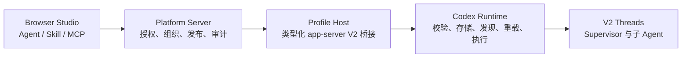

# Agent、Skill 与 MCP 原生生命周期整改计划

## 1. 计划定位

| 字段 | 内容 |
| --- | --- |
| 状态 | 当前跨里程碑整改计划 |
| 更新日期 | 2026-07-28 |
| 产品目标 | 用户在浏览器中安全地创建、验证、发布和使用 Agent、Skill、MCP，并由 Codex V2 完成多 Agent 协同 |
| 架构依据 | `docs/product-vision.md`、`docs/enterprise-agent-platform-architecture.md`、`AGENTS.md` |
| 当前事实 | `docs/architecture.md`、`docs/capability-baseline.md` 与代码 |
| 近期案例 | `docs/enterprise-supervisor-copilot-plan.md` |

本文把长期架构收敛为可以逐阶段交付的整改顺序。它不把未来目标描述为当前能力，
也不以仓网案例的两个固定 Role 代替通用 Agent Studio。

## 2. 最终结果

用户在浏览器中编辑的是稳定的产品资源，而不是 Runtime 文件路径或 TOML：

最终必须满足：

1. Codex Runtime 是 Agent、Skill、MCP 可执行配置和发现状态的唯一权威；
2. Platform 只拥有用户、组织、授权、Catalog 元数据、发布策略和审计；
3. 浏览器只接触有界 DTO，不接触 `CODEX_HOME`、文件路径、配置 key path 或 raw RPC；
4. 新企业 Agent 直接使用当前 V2，不增加 V1 selector、fallback 或 lineage 兼容分支；
5. Thread 通过正式 request config 选择 V2，不能把一次受治理运行变成 Profile 全局设置；
6. Supervisor Policy 和 Agent Definition 可以约束允许使用的版本，但不能复制 Runtime
   Agent 状态或多 Agent 调度；
7. Skill 与 MCP 由 Runtime 的正式发现和生命周期接口管理，Platform 不模拟安装、
   reload 或 Tool discovery。

## 3. 当前问题

| 问题 | 根因 | 长期处理 |
| --- | --- | --- |
| Agent Studio 通过通用 `config/batchWrite` 和文件写入工作 | app-server 缺少原生 Agent CRUD | 增加类型化 V2 Agent API，迁移 Studio |
| 企业 Role 曾同时持久化到 Profile、数据库投影并注入 Thread | 把发布审计与 Runtime 配置混为一个状态机 | 只保留 Policy/Definition 事实；Runtime Role 仅由 Runtime 接口管理 |
| 企业实现携带 V1 `max_depth` 和后端选择概念 | 对 Codex 历史实现做了产品兼容 | V2-only；删除所有 V1 产品分支 |
| `agents.multi_agent_v2` 被作为私有 capability 声明 | 用伪 capability 表达已有稳定 feature | 删除；使用正式 per-thread feature config |
| Agent、Skill、MCP 前台能力采用不同临时路径 | 缺少统一资源生命周期合同 | 统一 list/get/validate/write/delete/reload/test 语义 |
| 仓网两个 Role 容易被误当作通用 Catalog | 示例纵向切片进入平台核心 | 保留为 versioned seed package，不作为第二套 Agent 系统 |

## 4. 目标所有权与合同

### 4.1 Agent

| 项目 | 定义 |
| --- | --- |
| Runtime owner | Agent Role 的可执行配置、指令格式、模型选项、发现、校验、重载 |
| Platform owner | Catalog ID、组织可见性、发布者、审批状态、Policy 允许的版本 |
| Browser input | 名称、说明、指令、Runtime 支持的类型化选项 |
| Browser output | 稳定 Agent DTO、校验错误、发布状态，不包含本地路径 |
| app-server V2 | `agent/list|get|validate|write|delete` |
| capability gate | 从实际方法注册表生成 `agents.crud` 与 `agents.validation` |
| 验证 | schema、路径拒绝、冲突、原子写、reload、新 Thread discovery、删除后 discovery |

### 4.2 Skill

| 项目 | 定义 |
| --- | --- |
| Runtime owner | Skill package 格式、安装位置、发现、校验、启用状态和模型可见内容 |
| Platform owner | 来源授权、组织发布策略、安装审批和审计 |
| Browser input | 受支持来源或受限内容包，不包含任意宿主路径 |
| Browser output | Skill 摘要、来源、校验结果、安装状态 |
| app-server V2 | `skill/list|get|validate|install|update|delete` |
| capability gate | 从实际方法生成 `skills.crud`、`skills.validation` |
| 验证 | 安全解包、大小限制、冲突、原子升级、rollback、Thread 可见性 |

### 4.3 MCP

| 项目 | 定义 |
| --- | --- |
| Runtime owner | MCP server 配置、启动、OAuth/登录状态、Tool/Resource 发现、reload |
| Platform owner | Secret 引用、组织授权、允许的 transport/command 策略和审计 |
| Browser input | 类型化 server 配置和 Secret ID，不包含 Secret 明文或任意 key path |
| Browser output | 安全状态、能力摘要、诊断分类 |
| app-server V2 | `mcpServer/list|get|validate|write|delete|reload`，复用现有 OAuth/status |
| capability gate | 从实际方法生成 `mcp.config`、`mcp.oauth`、`mcp.reload` |
| 验证 | Secret 不回显、启动失败分类、reload、删除、跨 Profile 隔离 |

## 5. 分阶段整改

### Phase 0：V2-only 收敛与状态机删除

目标：让仓网案例只依赖当前 Runtime 正式能力，并把本轮 Agent 功能的 Codex 新增
差异降为零。

- [x] 删除 request-scoped V1 backend selector 及其协议、Core、Schema 和测试；
- [x] 删除私有 `agents.multi_agent_v2` capability；
- [x] 受治理 Thread 只显式设置 `features.multi_agent_v2 = true`；
- [x] 删除企业链路中的 `features.multi_agent`、`agents.enabled` 和 V1 `max_depth`；
- [x] 保留一个 V2 有效的每 Session 子 Thread 并发上限；
- [x] 不再把企业 Role 注册到 Profile 全局 Agent 配置；
- [x] 删除 `profile_runtime_role_projections` 第二状态机及迁移；
- [x] 保留 Policy/Definition digest、Profile Host 原子写入、无符号链接重开和启动前
  hash 校验；
- [x] 重跑完整 Web、Codex contract、app-server 与真实企业 V2 E2E 门禁。

退出条件：

- 普通 Thread 无法从 Profile 配置发现企业 Role；
- 受治理新建与 fork 仍能使用两个精确 Role；
- 所有受治理 root/child session metadata 都是 V2；
- 相对本阶段进入前的 Codex 基线，本功能没有新增非生成 Codex seam。

### Phase 1：统一临时 Agent 发布边界

目标：在原生 CRUD 完成前，避免 Agent Studio 与企业 Policy 继续形成两套业务模型。

- [x] 定义一个 Platform `AgentDefinition` DTO，覆盖用户 Agent Release 和代码发布 seed；
- [ ] `AgentDefinition` 只保存治理元数据和 Runtime resource ID，不保存 Runtime 文件路径；
- [x] 仓网两个 Agent 与用户 Release 通过同一类型化 Catalog API 解析和展示；
- [x] 集中名称、版本、内容摘要、保留名称与 capability template 收窄校验；
- [ ] 删除 Adapter、Server、Profile Host 中重复的 TOML 语义解析；
- [x] 明确临时文件物化器在原生 V2 Agent CRUD 上线后的删除条件，且不向浏览器开放；
- [x] 增加用户 Agent 与企业 seed 同名冲突、跨组织拒绝、精确 Release 依赖和版本
  不可变测试。

当前过渡切片已经提供 Web Agent Catalog、Definition/草稿 Revision/不可变 Release、
组织作用域授权、审计和精确 Supervisor 依赖。浏览器只能选择代码评审的 capability
template；服务端派生 Role、MCP/Tool allowlist 与 capability roots。Runtime resource
ID 和原生 CRUD 尚不存在，因此 Phase 1 退出条件仍未全部满足。

退出条件：前台 Agent、企业 seed、Policy 引用同一种稳定资源身份，但 Runtime 文件
仍只是内部过渡实现。

### Phase 2：Codex App Server V2 Agent 生命周期

目标：由 Runtime 原生拥有 Agent 写入和校验。

- [ ] 在 app-server-protocol 定义 Agent DTO、错误、请求和响应；
- [ ] 在 Runtime 所有者模块实现 list/get/validate/write/delete；
- [ ] 写入必须限制在当前 Profile 的 Agent 根，使用原子替换并拒绝路径逃逸和链接；
- [ ] Runtime 返回稳定 resource ID，不向 Platform 返回必须持久化的绝对路径；
- [ ] 方法注册表生成 Schema、TypeScript 和 capability facts；
- [ ] TUI 对 retained Runtime Agent 能力提供等价管理入口；
- [ ] 增加 app-server 集成测试和新 Thread discovery 测试；
- [ ] Platform Agent Studio 迁移到类型化 API；
- [ ] 删除 Platform Agent TOML/file writer 和通用配置 key 写入。

退出条件：`agents.crud`、`agents.validation` 有方法级证据，Platform 不再解释 Agent
TOML，也不写 Agent 文件。

### Phase 3：Skill 原生生命周期

- [ ] 先固定个人、Project、Plugin 提供 Skill 的优先级和冲突语义；
- [ ] 增加类型化 validate/install/update/delete；
- [ ] 限制 package 大小、文件数量、路径和可执行内容；
- [ ] 复用 Runtime 现有 Skill discovery/cache，不在 Platform 建索引副本；
- [ ] Agent Definition 只引用稳定 Skill resource ID 或 capability requirement；
- [ ] 完成安装、升级失败回滚、Thread 可见性和跨 Profile 隔离测试。

退出条件：Skill Studio 不写隐藏目录，不模拟 discovery。

### Phase 4：MCP 配置生命周期

- [ ] 在现有 MCP status/OAuth/reload 合同上补 typed config CRUD；
- [ ] Platform Secret 只以 Secret ID 绑定，注入 Profile 进程后由 Runtime 使用；
- [ ] 禁止浏览器提交任意服务器命令、路径或环境变量；
- [ ] 把启动错误归一为安全诊断，不返回 stderr、凭据或路径；
- [ ] Agent Definition 通过 capability requirement 引用 MCP，不复制 Tool catalog；
- [ ] 完成 OAuth、reload、删除、失败恢复和跨 Profile 隔离矩阵。

退出条件：MCP Studio 不依赖任意 `config/batchWrite` key path。

### Phase 5：统一发布、组合与治理

- [ ] Agent 发布前解析所需 Skill/MCP capability 并给出可解释缺口；
- [ ] Policy 绑定不可变 Agent Definition 版本和 Runtime resource revision；
- [ ] Thread 启动时由 Runtime 校验引用仍存在，失败时不回退到 default Agent；
- [ ] 支持组织可见性、草稿、发布、弃用和回滚；
- [ ] 评价、成本、审批和 Artifact provenance 使用稳定资源身份；
- [ ] 完成多 Profile、多组织、并发发布和 Runtime restart 矩阵。

## 6. Codex 修改原则

允许进入 `codex/` 的改动：

- Runtime 原生 Agent/Skill/MCP 生命周期；
- 类型化 app-server V2 方法及由 Rust 生成的合同；
- 为现有 Runtime 行为补齐的窄合同或安全修复；
- 与 Web 能力等价的 TUI 工作流。

不得进入 `codex/` 的改动：

- Web 用户、组织、授权、Catalog 审批或审计；
- V1/V2 产品兼容 selector；
- 仓网案例专用 Role、Policy 或业务字段；
- 为 Platform 数据库投影服务的 Runtime 双写；
- 浏览器 DTO 或浏览器路由。

每个 Codex 阶段必须先运行上游状态检查，进入 patch map，并把非生成差异控制在一个
可独立评审的 owner 内。协议阶段必须生成 Schema/TypeScript，运行 scoped tests、
完整 contract check 和真实 app-server smoke。

## 7. 迁移与兼容策略

本产品只面向当前版本，不为旧 V1 backend 增加兼容代码。需要迁移的是本项目已经
创建的数据，不是 Codex 的内部历史债务：

1. 原生 Agent API 上线后，读取现有受管 Role 内容，调用 Runtime write API 创建
   resource revision；
2. Policy/Definition 绑定从内部文件摘要迁移到 Runtime resource revision；
3. 验证所有活跃绑定后删除临时 `platform-agents` 文件写入器；
4. 用户 Agent Studio 数据使用同一路径迁移；
5. 迁移失败保持旧资源只读并阻止发布，不静默改用 default Agent；
6. 不迁移 `profile_runtime_role_projections`，因为它不是业务事实，Phase 0 直接删除。

## 8. 全程门禁

- 安全：路径逃逸、符号链接、Secret 回显、跨组织、跨 Profile；
- 语义：Runtime 是 discovery 和执行唯一权威；
- 恢复：写入中断、reload 失败、进程重启、重复请求；
- 并发：同资源更新冲突、不同资源并行、多个 Server 实例；
- 合同：Rust 类型、Schema、TypeScript、fixture 和 Manifest 一致；
- 产品：用户能从创建到验证、发布、绑定和运行完成一条真实路径；
- E2E：Supervisor 必须真实创建子 Thread，不能由根 Thread 独自模拟完成。

任何阶段未通过对应门禁，只能在能力基线中标为 degraded 或 unsupported，不能由
Web 功能开关伪装为已支持。
