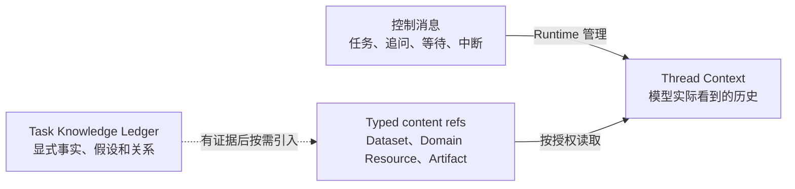
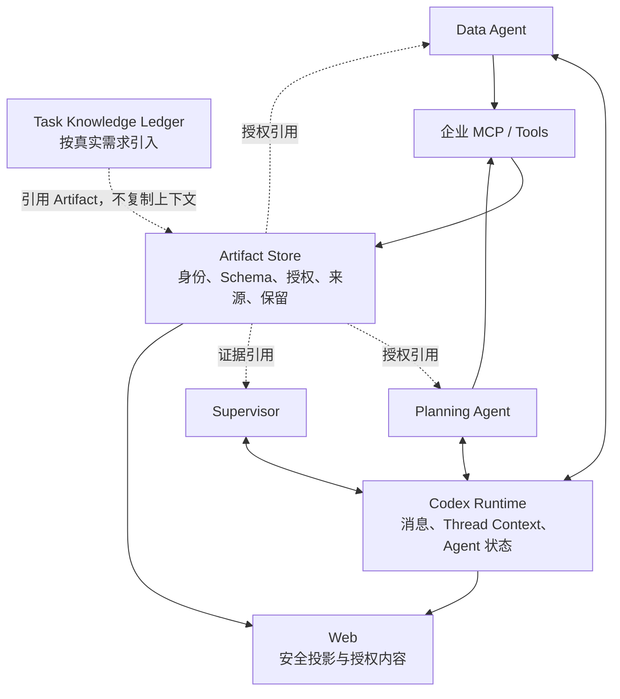
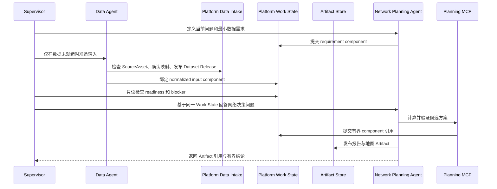
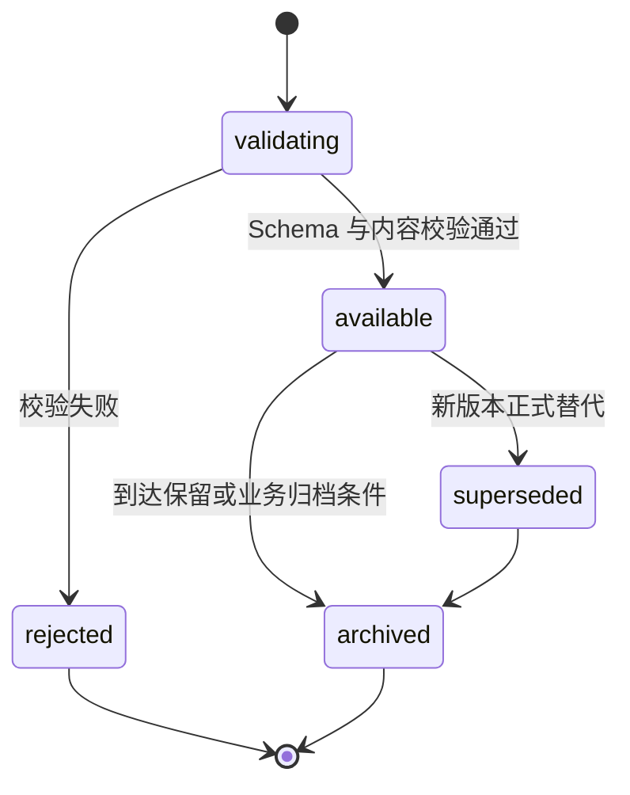

# Agent 信息交换：从消息传递到可追溯的协作事实

> 文档性质：Agent 信息交换历史研究输入；不是当前计划
>
> 更新日期：2026-08-08
>
> 当前阶段：Agent 协作使用 Runtime 原生消息与 Thread Context；provider-owned intermediate
> 使用官方 MCP Resource；用户可见/跨 package 交接使用 Workspace 文件；Artifact 只用于最终交付
>
> 事实边界：下文 typed Dataset/Domain Resource、Resource Broker、Work State、Artifact
> 交接与 Ledger 路线已被 ADR-018 否决；这里的 DomainResource/Broker 不等于 Codex 官方 MCP
> Resource。下文仅保存历史推演，当前合同以
> [ADR-018](adr/018-built-in-network-copilot-runtime-closure.md) 和
> [开发计划](development-plan.md) 为准；当前能力声明以 [能力基线](capability-baseline.md) 为准

---

## 结论先行

Agent 之间并不需要共享彼此的全部上下文。它们真正需要交换的是两类信息：

- 用来协调下一步的短消息，例如任务、追问、状态和完成通知；
- 需要复用、复核和进入最终结论的持久内容，例如数据集、领域中间结果、图表和报告。

前者由 Codex Runtime 的 Agent 通信承担；后者按生命周期分别使用有稳定身份、类型、
来源和授权的 `DatasetReleaseRef`、`DomainResourceRef` 与 `ArtifactRef`。Artifact 只拥有
用户可见或需长期保留的交付物，不再充当所有大型中间内容的总称。只有当这些类型化
引用仍然过于粗粒度时，才考虑结构化 Task Knowledge Ledger。

这些对象不能合并成一个“共享记忆”：

| 信息类型 | 解决的问题 | 权威所有者 |
| --- | --- | --- |
| Agent 消息 | 下一步做什么、发给谁、是否等待或中断 | Codex Runtime |
| Thread Context | 模型在当前 Thread 中实际看到什么 | Codex Runtime |
| Dataset Release | 不可变标准化输入是什么、谁能读 | Platform Data Intake |
| Domain Resource | 大型中间结果是什么、谁生产和消费 | Domain Package + Resource Broker |
| Artifact | 用户可见或长期交付物是什么、谁能读、由什么产生 | Platform Artifact Store |
| Work State | 本次任务的依赖、readiness、operation 和引用摘要 | Platform Work State |
| Task Knowledge Ledger | 某项业务事实或假设当前采用哪一版 | 可选的平台业务记录 |

---

## 1. 为什么“把消息发过去”还不够

点对点消息适合传递小而及时的协作信息。例如：

- “请基于这份规划数据比较杭州和无锡方案”；
- “上一版需求假设已修正，请重新计算”；
- “请说明成本差异来自哪些输入”；
- “这项工作可以停止，返回当前结论”。

但消息不适合承载需要长期复用的大型数据和正式成果。把 CSV、完整报告或工具原始
结果复制进消息，会马上产生几个问题：

- 同一份数据出现多份副本，后来无法确认引用的是哪一版；
- 下游 Agent 无法验证 Schema、单位、范围和内容摘要；
- 最终报告很难追溯到真正的生产者和工具调用；
- 数据跟随聊天历史扩散，授权边界难以控制；
- 页面刷新或另一个 Run 复用时，只能重新翻查自然语言。

因此，消息和成果必须分开：

> 消息告诉协作者“接下来做什么”；类型化内容引用让协作者准确取得“应该基于什么做”；
> Artifact 专门承载用户可见或长期保留的交付。

---

## 2. 信息交换的四条通道

### 2.1 协调通道：Runtime 消息

协调通道包含 spawn、message/follow-up、wait 和 interrupt 等动作。它负责 Agent
之间的任务和控制信息，保留父子 Thread 关系与真实接收者。

适合放入这条通道的内容：

- 子任务目标；
- 预期输出；
- Artifact 引用；
- 少量约束和完成标准；
- 追问、纠偏和停止要求。

不适合放入这条通道的内容：

- 无界原始数据；
- 需要长期保存的大型结果；
- Secret、内部路径和 Runtime 原始协议；
- 用自然语言伪装的授权或审批。

### 2.2 上下文通道：Thread 历史

每个 Agent Thread 有自己的模型可见历史。父 Thread 的历史如何进入子 Thread、
消息怎样追加为新的 Turn、上下文如何压缩与恢复，都是 Codex Runtime 语义。

平台可以展示和审计安全投影，但不能再保存一份“模型应该看到什么”的副本。否则，
Runtime Context 与平台共享状态会形成两个竞争的当前真相。

### 2.3 成果通道：Artifact

Artifact 是 Agent 之间主要的持久交接接口。它至少需要回答：

- 这是什么类型的成果；
- 内容在哪里，是否已经校验并可读取；
- 谁在什么 Task、Run、Thread、Turn 和 Item 中产生；
- 使用了哪些输入和版本；
- 谁被授权读取；
- 当前是可用、失败、已替代还是已归档。

生产者标识只说明来源，不决定 Artifact 的所有权。生产 Run 结束或删除后，Artifact
是否保留，应由 Artifact 自身的授权和保留策略决定。

### 2.4 业务知识通道：可选 Ledger

Artifact 很适合保存“结果”，却不一定适合回答：

- 当前采用的需求增长假设是哪一版；
- 哪些分析仍然依赖已经失效的假设；
- 两个 Agent 的分歧来自数据、方法还是评价标准；
- 一个新证据影响了哪些既有结论。

只有这些问题在真实任务中持续出现，才值得引入 Task Knowledge Ledger。Ledger
保存的是显式业务记录和关系，不是全部聊天、模型思维过程或新的 Workflow Engine。

---

## 3. 从起点到目标状态

### 3.1 起点：结果停留在对话里

最初的单 Agent 模式中，工具结果和结论主要通过当前 Thread 使用。只要一个 Agent
完成一次短任务，这种方式足够简单。

进入多 Agent 后，同一份结果会被不同子 Thread 使用，也可能在任务完成后继续进入
审查、展示或后续分析。此时，“结果曾经出现在聊天里”不再等于“结果可以被可靠复用”。

### 3.2 目标：不同信息各走自己的通道

目标状态不是建立一块保存所有内容的无限 Blackboard，而是把信息按生命周期分开：

### 3.3 最终要达到的质量

一项关键结论应该能够回答：

1. 它来自哪个 Agent 和哪次执行；
2. 它依据哪一版输入和 Artifact；
3. 使用了什么单位、时间范围、方法和约束；
4. 是否经过 Schema 和业务校验；
5. 哪些后续成果依赖它；
6. 被替代或失效后，哪些结论需要复核；
7. 哪些内容是工具事实，哪些是模型判断，哪些是人工决定。

---

## 4. 里程碑总览

| 里程碑 | 阶段目标 | 主要交换方式 | 当前状态 |
| --- | --- | --- | --- |
| I0 对话内结果 | 先完成单 Thread 工具闭环 | 消息与 Thread Context | 基础已具备 |
| I1 Runtime 协调消息 | 让真实 Agent 能够分工和返回结果 | spawn、message、wait、interrupt | 原语已有，真实异常矩阵未完成 |
| I2 Typed Reference First | 让内容有稳定类型和身份并跨子 Thread 交接 | Runtime 消息携带 Dataset/Domain Resource/Artifact 引用 | 仓网原型部分使用；公共 handle/resolver 未完成 |
| I3 完整成果生命周期 | 管理版本、依赖、替代、失效和保留 | 类型化 Artifact 与依赖关系 | 部分实现 |
| I4 Task Knowledge Ledger | 管理细粒度事实、假设、冲突和问题 | 有限类型业务记录 | 条件阶段 |
| I5 Decision Knowledge | 支撑跨 Task 决策复核和有界重评 | 授权的决策记录与事件 | 条件阶段 |

协同文档中的 C0—C5 与这里的 I0—I5 观察的是同一演进过程，但视角不同：

- C 系列衡量“协作行为能否成立”；
- I 系列衡量“协作信息能否可靠流动”。

二者不要求编号机械对齐。例如，C3 的追加任务和部分失败会同时推动 I1 的控制消息
验证与 I3 的 Artifact 生命周期完善。

---

## 5. I0：对话内结果

### 阶段目标

让单个根 Thread 能够读取工具结果、继续推理并形成回答。

### 细致目标

- [x] Codex Runtime 拥有 Thread、Turn、Item 和上下文；
- [x] Tool/MCP 结果进入当前 Agent 的模型可见执行过程；
- [x] 平台只把安全、有限的事件和内容投影到浏览器；
- [x] 页面刷新后能够恢复权威历史；
- [ ] 不把这一阶段的聊天内结果误称为可复用企业成果。

### 局限

结果缺少独立身份、授权、保留和跨 Agent 使用合同。它适合完成一次对话，不足以承担
多 Agent 的正式成果交换。

---

## 6. I1：Runtime 协调消息

### 阶段目标

通过 Codex 原生 Agent 通信建立真实的任务委派、反馈、等待和中断通道。

### 细致目标

- [x] 根 Agent 能够 spawn 精确 Runtime Role；
- [x] 子 Agent 有独立 Thread 身份和状态；
- [x] Supervisor 可以等待并接收子 Agent 结果；
- [x] 平台能从协作事件识别发送者、接收者和动作；
- [ ] 在真实案例中验证对既有 Agent 的 follow-up/message；
- [ ] 验证 interrupt、等待超时和部分失败；
- [ ] 验证并行消息交错不会把任务归到错误 Agent；
- [ ] 明确消息长度、摘要和敏感内容边界。

### 交换合同

一条委派消息至少应说明：

| 字段 | 作用 |
| --- | --- |
| 子问题 | 这次需要回答什么 |
| 输入引用 | 使用哪些 Artifact 或受限资源 |
| 约束 | 数据范围、工具范围、时间和成本限制 |
| 预期输出 | 返回什么 Artifact Schema 或简短结论 |
| 完成条件 | 怎样才算足以交回 Supervisor |

这是一份协作契约，不是平台授权。Agent 即使在消息中收到一个资源 ID，Tool/MCP
仍然必须独立校验它是否属于当前授权范围。

---

## 7. I2：Typed Reference First

### 阶段目标

让 Agent 交换同一份经过验证且类型正确的内容，而不是复制数据、工具结果或聊天内容，
也不把 Workspace `source_ref`、MCP URI、领域 Resource 和 Artifact 混成字符串。

### 迁移后的目标案例

当前 7/7 E3 仍由脚本创建 Work State、Prompt 注入内部身份，并要求 Agent 拼装部分领域
引用。迁移后的仓网案例必须采用以下交接链：

Runtime 中传递的是 Work State 与 tagged Dataset/Domain Resource/Artifact handle 的
稳定身份和有界摘要；Resource Broker 根据当前 Assignment Grant 解析。浏览器看到的是
平台鉴权后的安全 DTO，不接收内部 MCP Resource URI、宿主路径或完整业务 payload。

### 细致目标

- [x] Artifact 具有独立稳定 ID；
- [x] 记录 Schema、显示名称、MIME、大小和内容摘要；
- [x] 记录生产 Run、Thread、Turn、Item 和 Agent Role；
- [x] Artifact 授权绑定 Task，而不是绑定某个子 Thread；
- [x] 另一个子 Thread 可以按同 Task 授权读取同一成果；
- [x] 平台先登记并持久化，再向浏览器提供安全投影；
- [x] 生产 Run 删除不自动删除 Artifact、Task Grant 和来源记录；
- [x] 当前真实案例已经产生并读取多种 ready Artifact；
- [ ] 最终 Supervisor 报告目前仍保存在 Codex history，尚未统一发布为正式报告 Artifact；
- [ ] 浏览器的 Artifact 打开、比较和下载体验仍需完善。

### 退出标准

下游 Agent、浏览器和最终报告引用的是同一个逻辑成果；任何一方都不需要从自然语言
中猜测内容版本，也不需要获得内部 Resource URI 或宿主机路径。

---

## 8. I3：完整成果生命周期

### 阶段目标

让 Artifact 不只是“成功登记的文件”，而是能够安全经历校验、替代、失效、归档和
复用的企业成果。

### 目标生命周期

当前实现使用 `pending`、`materializing`、`ready`、`failed` 等物化状态。上图描述的
是面向业务生命周期的目标语义，不要求直接把现有存储字段机械改名；实施时需要先
明确物化状态与业务状态的对应关系。

### 细致目标

#### 类型与校验

- [x] 记录 `artifact_schema` 和内容摘要；
- [x] MCP 侧验证仓网案例的主要规划合同；
- [ ] 建立通用 Artifact Schema 注册、版本和兼容规则；
- [ ] 区分 Tool 调用成功与 Artifact 业务校验通过；
- [ ] 为缺字段、超大内容、非法单位和未授权引用建立失败矩阵。

#### 来源与依赖

- [x] 保存不可变生产来源；
- [ ] 显式记录一个 Artifact 使用了哪些输入 Artifact；
- [ ] 在最终报告中保留关键结论到 Artifact 的引用；
- [ ] 支持从成果查看生产 Agent 和对应 Thread/Turn；
- [ ] 支持从输入变更定位可能受影响的下游成果。

#### 替代与保留

- [ ] 建立 supersedes / superseded-by 关系，不隐式覆盖旧版本；
- [ ] 定义 invalidated、archived 与删除语义；
- [ ] 定义组织、项目和 Artifact 类型的保留策略；
- [ ] 完成跨 Run 授权复用；
- [ ] 验证来源 Run、Thread 或 Workspace 清理后的读取行为；
- [ ] 为删除、保留和审计建立恢复测试。

#### 访问与展示

- [x] 浏览器只接收安全 URL 和有界元数据；
- [ ] 根据 Schema 提供表格、地图、报告和数据集的合适视图；
- [ ] 展示单位、时间范围、校验状态和来源；
- [ ] 支持用户比较同类 Artifact 的不同版本；
- [ ] 对下载、分享和跨 Task 使用执行独立授权。

### 退出标准

一个成果从创建到归档始终拥有稳定身份和可解释状态；新版本不会静默覆盖旧依据，
生产者消失不会自动破坏有权读取的历史，未经授权的引用也不会因出现在消息中而生效。

---

## 9. I4：Task Knowledge Ledger

### 阶段目标

当 Artifact 无法有效表达细粒度业务变化时，用有限类型记录事实、假设、证据、冲突
和决定之间的关系。

### 允许保存的内容

| 类型 | 示例 |
| --- | --- |
| Fact | 华东订单在指定期间增长 11% |
| Assumption | 未来一年促销强度保持当前水平 |
| Evidence | 指向已验证数据 Artifact 的引用 |
| Finding | 当前仓网在苏南区域存在时效缺口 |
| Question | 大客户合同是否会在规划期内生效 |
| Scenario | 保守、基准和激进需求情景 |
| Decision | 人工选择无锡方案并说明批准者 |
| ArtifactReference | 某项记录对应的正式计算结果 |

### 明确不保存

- 模型完整聊天和思维过程；
- Thread 的下一轮上下文；
- Agent 当前运行状态；
- Run 的排队、租约和重试状态；
- 直接驱动执行的无界触发器；
- Secret、内部 Tool 参数和未经脱敏的数据。

### 启动条件

- Artifact 粒度反复过大，无法回答“当前采用哪个假设”；
- 同一事实的修订反复导致人工排查依赖；
- Supervisor 多次重复整理相同证据；
- 跨 Run 复核无法判断既有结论是否过期；
- I3 的 Artifact 生命周期和授权已经稳定。

### 细致目标

- [ ] 只采用有限、版本化的记录类型；
- [ ] 每条记录具有来源、状态、作者和时间；
- [ ] 冲突并存，不用最后写入静默覆盖；
- [ ] 通过正式 Tool/Resource 按需读取，不自动塞入所有 Agent Context；
- [ ] 新证据先标记潜在影响，再由确定性 Task/Run 创建复核任务；
- [ ] 建立访问、保留、删除和审计规则；
- [ ] 以真实任务数据证明 Ledger 比 Artifact 摘要更有价值。

### 退出标准

Ledger 能够减少重复整理和依赖排查，同时没有变成第二套 Runtime Memory、Agent
状态机或 Workflow Engine。

---

## 10. I5：跨 Task 的决策知识

### 阶段目标

在长期运行中保存经过授权的决策依据，并在外部事实发生变化时发起有责任人、有预算、
有停止条件的复核。

### 可能功能

- 追踪某项决定依赖的事实、假设、Artifact 和人工批准；
- 新数据到达后识别可能过期的决定；
- 由确定性规则创建待复核事项，而不是直接启动无限 Agent；
- 比较历史情景与当前事实；
- 允许后续 Task 按组织授权复用既有 Artifact 和决策记录。

### 细致目标

- [ ] 决策记录区分 Agent 建议和人工决定；
- [ ] 触发条件、责任人、预算和停止规则全部显式化；
- [ ] 跨 Task 访问遵循独立授权；
- [ ] 复核产生新的版本和来源，不篡改历史；
- [ ] 模型建议不能直接改变生产系统或审计记录；
- [ ] 只有在真实业务价值成立时才扩展到 Agent Decision OS。

---

## 11. 当前实现位置

### 已实现

- Runtime 原生父子 Thread 与协作事件；
- Supervisor 到 Data/Network 两个 exact Runtime Role 的按需任务委派；
- Task 级持久 Artifact、生产来源和同 Task 授权；
- Platform Work State 的 component/operation/blocker/deliverable 持久化骨架；最新最小
  E2E 已用它交接标准化输入、路线矩阵和规划报告；
- Artifact 内容物化、Schema、摘要和安全浏览器 DTO；
- 删除生产 Run 后保留 Artifact 身份、授权和来源的数据库验证；
- Web 恢复 Agent、Artifact 和最终 Thread 报告。

### 部分实现

- Artifact 当前能表达类型和来源，但完整输入依赖关系尚未建立；
- Work State 当前只有 `{owner,type,id,hash}` 通用引用，领域仍要求 Agent 构造 MCP URI；
- Workspace SourceAsset、Dataset、Domain Resource 和 Artifact 不是不同 tagged handle；
- Platform Data Intake 与供应链 CaseRepository 仍重复保存 source/mapping/operation；
- Data Server 通过 aliases 接受多个 wire shape，正式交换 schema 仍不唯一；
- 当前状态覆盖物化成功与失败，但业务替代、失效和归档尚未完成；
- 当前案例能引用 Artifact，但浏览器打开、比较和依赖导航仍有限；
- Runtime 有 follow-up、message 和 interrupt 原语，真实企业异常矩阵尚未完成。

### 尚未开始或由证据触发

- 通用 Artifact Schema Registry；
- 跨 Run 复用与完整保留策略；
- Task Knowledge Ledger；
- 跨 Task Decision Knowledge；
- 自动事件重评和 Agent Decision OS。

---

## 12. 下一步优先级

1. 先完成无数据 Clean Spine 的 Catalog/Compiler、Profile Installation、Runtime discovery、
   Assignment Grant、ToolOutcome 与 Run Completion；
2. 再建立 scope-bound `SourceAssetRef/DatasetReleaseRef/DomainResourceRef/ArtifactRef`；
3. 由 Resource Broker 解析 handle，MCP URI 只留在 Runtime/MCP 内部；
4. Data Intake 成为 source/mapping/Dataset 唯一 owner并删除领域副本；
5. 验证追加任务、部分失败、刷新和重启中既有引用安全复用；
6. 完成 Artifact 替代、失效、归档、删除和跨 Run 授权；
7. 只有 typed handle 与 Artifact 仍无法解决的真实证据出现时，才立项 Knowledge Ledger。

---

## 13. 代码事实入口

- Agent 协作和 Artifact 登记投影：
  [`event_projection.rs`](../apps/web/server/src/event_projection.rs)；
- Artifact API 与授权读取：
  [`routes/artifacts.rs`](../apps/web/server/src/routes/artifacts.rs)；
- Artifact 浏览器安全合同：
  [`platform-contracts/src/lib.rs`](../apps/web/crates/platform-contracts/src/lib.rs)；
- Task Artifact 数据结构：
  [`20260726000022_task_artifacts.sql`](../apps/web/migrations/20260726000022_task_artifacts.sql)；
- 仓网数据和规划 MCP：
  [`copilots/warehouse-network/tools/planner`](../copilots/warehouse-network/tools/planner)；
- 已退役旧交接验证：旧 `enterprise-supervisor-e2e.mjs` 已随 Platform 数据面和冻结能力包
  删除，只保留在版本历史中作为迁移证据。

本文不以源码中“存在某个字段或方法”替代产品验证。各能力能否对外声称可用，仍以
[能力基线](capability-baseline.md) 的验证范围为准。
