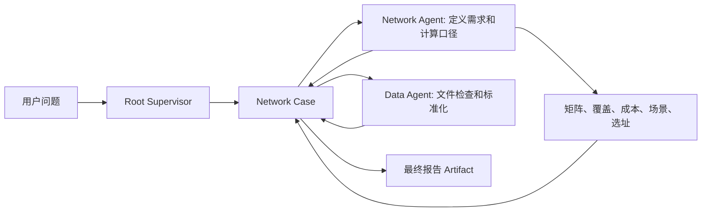

# Architecture

本文描述当前实现的所有权和边界。长期产品方向见 `product-vision.md`；目标 Copilot
创作架构见 `supervisor-agent-skill-tool-architecture.md`；能力证据见
`capability-baseline.md`；本仓网 6.0 的过渡实现合同见
`enterprise-supervisor-copilot-plan.md`。

当前 Network Case 不是目标平台通用对象：其来源/映射与 Platform Data Intake 重复，
其 revision/operation/readiness 属于待提取的 Platform Work State，当前领域 Tool envelope
也泄漏到 event projection。以下章节记录这些代码现在如何运行，不代表重构后的 owner。

## 目标

`open-web-codex` 是围绕官方 Codex Runtime 的浏览器控制面，不在 WebApp、Server 或数据库中重新实现 Thread、Turn、Agent、Skill、MCP、记忆或模型上下文。

```text
Browser
  -> authenticated Web API + WebSocket
  -> Platform Server: Profile / Workspace / Run / Approval / Artifact / audit
  -> Profile Host: one isolated CODEX_HOME and one app-server per Profile
  -> Codex Runtime: Thread / Turn / Item / context / Agent / Skill / MCP / Provider
  -> authorized Workspace / Runner / Git for execution roots
```

## 所有权

| 层 | 拥有 | 不拥有 |
| --- | --- | --- |
| Browser WebApp | 表现、输入、可访问性、平台 DTO 渲染 | Thread 语义、模型上下文、Runtime discovery、凭据、原始 JSON-RPC |
| Platform Server | Profile、Workspace 授权、Run、Approval、Artifact、审计、浏览器 DTO、执行投影 | 推理、上下文压缩、Skill/MCP 生命周期、Provider transport |
| Profile Host | 隔离 `CODEX_HOME`、app-server 进程、请求桥接、Runtime 事件归一化 | Web UI、平台组织、第二个状态库、Runtime 模拟 |
| Codex Runtime | Thread/Turn/Item、Agent 调度、Skill/Plugin/MCP discovery、模型调用和官方输入请求 | Web session、组织授权、浏览器 DTO、Workspace provisioning |
| Workspace/Runner/Git | 授权执行根、Run lease、clone/worktree、命令和交付 | 模型可见对话状态 |
| Skill/Plugin/MCP | 模型可见的指令、声明、Tool、Resource | 隐式 Profile mutation、Web 命令拦截、平台授权 |

平台事件和数据库表是可重建投影，不是第二个 Thread 或第二个 Supervisor。Codex 保持模型可见对话的唯一权威。

## Supervisor 协作

Supervisor 不承载仓网业务流程。它先创建一个 Network Case，再根据当前用户问题和 Case readiness 动态选择：



Root 只创建和查询 Case，并把同一个 `case_id` 放进每个子 Agent assignment。Network Agent 把本次最小数据需求写入 Case；Data Agent 只有在存在用户文件或用户明确请求教程 Demo 时才发现来源。候选仓、current coverage、报价、成本规则、导航许可和时效目标都是按当前问题决定的条件输入。没有一个完整数据集是所有分析的通用前置条件。

## Case 与 Artifact

大数据不经过 Agent 消息传递，也不通过多个 MCP Resource 串联。Network Case 是业务状态的唯一来源，使用 Profile 范围内的 SQLite 保存：

```text
requirements -> sources -> mapping -> normalized input
             -> route/cost matrix -> baseline/scenario/facility solution
```

每次工具调用只返回 `case_id`、facet 状态、有限问题和有限指标。内部组件用内容 hash、revision 和依赖关系进行失效与幂等控制，但这些内部标识不进入模型消息。只有 `publish_network_planning_report` 会创建内容寻址的 `network_planning_report.v1` ResourceLink；平台把它投影为已授权 Artifact。Resource 不再承担 Agent 间数据总线职责。

## 仓网计算边界

- Data Server 使用 `workspace_intake.py` 作为唯一 CSV/JSON/XLSX 来源发现和检查实现。
- `geography.py` 负责行政区目录、名称解析、候选仓构建和边界校验；ambiguous/missing 进入用户输入。
- Planner 使用 `matrix.py` 构建球面路线、批量导航注册和成本矩阵；不改 Maps MCP `distance_matrix` 接口，也不从一个 MCP 内部调用另一个 MCP。
- Solver 使用 OR-Tools CP-SAT；固定已有仓默认开启，用户明确指定的 optional existing 才能关闭；求解超时返回当前可行解和 `timeout`。
- `evaluate_network_baseline` 将真实当前覆盖和已有仓优化基线分开。没有 current assignment 时不能输出 `actual_current`。
- 地图由 Planner 从同一个 Case 中的两个方案生成，不增加 Visualization Agent 的二次计算链路。

## 用户输入和执行投影

Runtime `item/tool/requestUserInput` 由平台先创建 Approval，再广播 `platform/userInputRequested`。平台解析问题、选项、secret 标记和 root/child 来源，但不把 Runtime server request ID 暴露给浏览器。回答使用 Approval UUID 和版本做并发控制，secret 不保存正文；Runtime 投递未知时保持 `delivery_unknown`。

每个 child execution 在首次 assignment/spawn 时生成稳定短标题。连续普通 wait 只更新 `wait_cycle_count` 和当前状态；等待用户输入进入 `waiting_for_input` 并关联平台 Approval。完成、失败和中断只允许一个终态，乱序事件不能把终态恢复成 running。原始 Run 事件继续完整持久化，execution/activity 是可重建的浏览器投影。

## Supervisor Draft

Draft 是可变资源，使用 `revision`、`content_sha256` 和 `updated_at`；保存时使用 expected revision 做乐观并发控制。发布是不可变 Release，服务器在事务中分配 semver patch 版本。运行绑定记录 Draft revision/hash 或 Release version/hash，避免运行过程中内容漂移。不要要求用户输入语义版本号，也不要为历史本地实现增加双读或旧字段兜底。

## Codex 定制门禁

官方 Runtime 已提供用户输入和 Agent 生命周期，因此这些能力没有新增 Codex 修改。第三方 Chat usage 的缓存统计属于现有 `provider-chat-transport` 保留补丁：`codex-api` 同时解析标准 `prompt_tokens_details.cached_tokens` 和 DeepSeek 顶层 `prompt_cache_hit_tokens`。任何其他 Runtime 修改仍必须先运行 upstream/customization status 脚本并满足 Patch Map 门禁。
