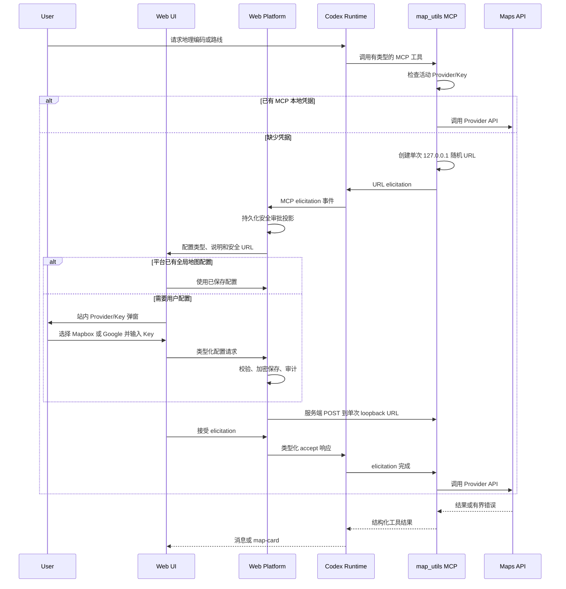

# Skills、MCP 与定制交互扩展指南

本文说明如何在 open-web-codex 中创建和维护定制 Skill，以及何时需要同时增加
MCP Server、Secret 配置、审批适配或专用 Web 面板。`tools/maps-mcp` 中的
`map-utils` 是本文的完整参考实现。

本文描述当前仓库的实现边界。Runtime 能力状态仍以
`docs/capability-baseline.md` 为准，交付顺序以 `docs/development-plan.md`
为准。

## 目录

1. [先确定扩展属于哪一层](#1-先确定扩展属于哪一层)
2. [创建一个 Skill](#2-创建一个-skill)
3. [把 Skill 与 MCP 组成 Plugin](#3-把-skill-与-mcp-组成-plugin)
4. [新建或扩展 MCP Server](#4-新建或扩展-mcp-server)
5. [Secret 或 Key 输入界面的完整适配](#5-secret-或-key-输入界面的完整适配)
6. [自定义卡片和其他面板](#6-自定义卡片和其他面板)
7. [测试与验收](#7-测试与验收)
8. [常见错误](#8-常见错误)
9. [完成定义](#9-完成定义)

## 1. 先确定扩展属于哪一层

Skill、MCP 和界面不是同一种能力：

| 层 | 负责什么 | 不应负责什么 |
| --- | --- | --- |
| Skill | 告诉 Codex 何时执行某个工作流、按什么顺序调用工具、如何处理失败和输出 | 保存 Secret、直接实现远端 API、伪造工具结果 |
| Plugin | 把一个或多个 Skill、MCP、App 或 Hook 组织成可发现的能力包 | 执行业务请求、代替权限控制 |
| MCP Server | 暴露有类型的工具，校验输入，调用本地或远端能力，返回结构化结果 | 把 API Key 作为模型可见参数、渲染浏览器界面 |
| Codex Runtime | 发现 Plugin/Skill/MCP，执行工具，管理 Thread/Turn 和 elicitation | 保存平台用户、组织权限或浏览器状态 |
| Web Platform | 鉴权、授权、持久化、Secret、审批投影、审计和 Runtime 生命周期 | 重新实现 Skill 选择或 MCP 调度 |
| Web UI | 显示安全的浏览器 DTO、弹窗、卡片、加载和错误状态 | 扫描插件目录、启动 MCP、接收 raw JSON-RPC 或本地路径 |

选择方式：

- 只有领域知识或操作流程：创建 Skill。
- 需要重复执行的确定性本地逻辑：优先给 Skill 增加 `scripts/`。
- 需要稳定的工具 Schema、远端 API、长任务、Secret 或独立超时：增加 MCP。
- 需要把 Skill 和 MCP 一起分发：创建 Plugin 能力包。
- 需要 Key 输入、审批、图表、地图或其他专用呈现：继续完成 Platform 和 Web
  适配，不能只修改 Skill。

`map-utils` 的组成如下：

```text
tools/maps-mcp/
├── .codex-plugin/plugin.json       Plugin 清单
├── .mcp.json                       map_utils MCP 启动声明
├── bin/maps-mcp-launcher           启动、依赖检查和诊断
├── maps_mcp/                       MCP Server 实现
├── skills/
│   └── map-utils/
│       ├── SKILL.md                模型工作流
│       └── agents/openai.yaml      Skill 的 UI 元数据
└── tests/                          不访问付费 API 的测试
```

命名建议：

- Skill 和 Plugin 使用 kebab-case，例如 `map-utils`。
- MCP Server 使用 snake_case，例如 `map_utils`。
- 名称应稳定；重命名 MCP Server 会同时影响工具名、审批识别、测试和已有配置。

## 2. 创建一个 Skill

### 2.1 先写触发样例

创建文件前先列出三类样例：

1. 应触发：例如“批量查询这些地址的经纬度”。
2. 不应触发：例如“解释经纬度是什么”。
3. 失败路径：例如 MCP 未连接、用户拒绝提供 Key、远端 API 超时。

触发边界不明确时，Skill 会过度占用上下文，或者在需要时不被加载。

### 2.2 使用脚手架

仓库内置 Skill 脚手架。下面的示例把新 Skill 放入一个仓库级能力包：

```bash
python3 codex/codex-rs/skills/src/assets/samples/skill-creator/scripts/init_skill.py \
  geo-analysis \
  --path /absolute/path/to/open-web-codex/tools/geo-tools/skills \
  --resources scripts,references \
  --interface display_name="Geo Analysis" \
  --interface short_description="Analyze locations with typed geographic tools." \
  --interface default_prompt="Use $geo-analysis to analyze these locations."
```

只创建真正需要的资源目录：

```text
geo-analysis/
├── SKILL.md
├── agents/
│   └── openai.yaml
├── scripts/        可选；重复、确定性的执行逻辑
├── references/     可选；按需加载的 API、Schema 或领域资料
└── assets/         可选；输出会直接使用的模板、图标等资源
```

不要在 Skill 目录里增加 README、CHANGELOG 或安装手册。Skill 运行所需的信息放在
`SKILL.md` 或它直接引用的资源中；面向开发者的说明放在 Plugin 根目录或 `docs/`。

### 2.3 编写 SKILL.md

`SKILL.md` 的 frontmatter 只放 `name` 和 `description`。`description` 是主要触发
依据，必须同时说明“做什么”和“什么时候使用”。

```markdown
---
name: geo-analysis
description: Use the geo_tools MCP server to normalize locations, resolve coordinates, and compare geographic results. Use when a task needs address cleanup, coordinate lookup, geographic validation, or a structured location result.
---

# Geo Analysis

Use `geo_tools` for typed geographic operations.

## Workflow

1. Validate the requested locations.
2. Call the smallest matching `geo_tools` tool.
3. Stop and report a sanitized error when configuration is declined, invalid,
   unavailable, or timed out.
4. Return the structured result in the format requested by the user.

Never include API keys in prompts, tool arguments, answers, logs, or generated
artifacts.
```

编写原则：

- 使用直接、命令式表述。
- 只写模型无法可靠自行推断的流程和约束。
- 把“何时触发”完整写进 `description`，不要只写在正文里。
- `SKILL.md` 尽量控制在 500 行以内。
- 大型 API 文档放入 `references/`，并由 `SKILL.md` 直接说明何时读取。
- 容易出错或必须一致的步骤写成脚本，不要让每次调用临时生成。
- 明确拒绝、超时、权限不足和网络失败后的行为，避免无限重试。

### 2.4 编写 agents/openai.yaml

该文件提供 Skill 列表和快捷入口的 UI 元数据，不代替 `SKILL.md`：

```yaml
interface:
  display_name: "Geo Analysis"
  short_description: "Analyze locations with typed geographic tools."
  default_prompt: "Use $geo-analysis to analyze these locations."
```

要求：

- 所有字符串加引号。
- `default_prompt` 必须显式包含 `$skill-name`。
- 只有确实存在图标资源时才增加 `icon_small`、`icon_large`。
- Skill 更新后同步检查该文件，避免 UI 描述与真实工作流不一致。

可以使用生成器重新生成：

```bash
python3 codex/codex-rs/skills/src/assets/samples/skill-creator/scripts/generate_openai_yaml.py \
  /absolute/path/to/geo-analysis \
  --interface display_name="Geo Analysis" \
  --interface short_description="Analyze locations with typed geographic tools." \
  --interface default_prompt="Use $geo-analysis to analyze these locations."
```

### 2.5 验证 Skill

```bash
python3 codex/codex-rs/skills/src/assets/samples/skill-creator/scripts/quick_validate.py \
  /absolute/path/to/geo-analysis
```

基础校验通过后，再用真实措辞做正向、负向和失败路径测试。复杂 Skill 应验证：

- 明确点名 `$skill-name` 时能够工作。
- 未点名但描述匹配时能够被选中。
- 相邻领域请求不会误触发。
- MCP 缺失或失败时不会编造结果。
- 输出不会泄露 Secret、路径或原始协议内容。

## 3. 把 Skill 与 MCP 组成 Plugin

仓库和工作区的能力包以 `.codex-plugin/plugin.json` 为入口。

### 3.1 Plugin 清单

```json
{
  "name": "geo-tools",
  "version": "0.1.0",
  "description": "Typed geographic tools and workflows.",
  "author": {
    "name": "Open Web Codex"
  },
  "license": "MIT",
  "keywords": ["geography", "mcp"],
  "skills": "./skills/",
  "mcpServers": "./.mcp.json",
  "interface": {
    "displayName": "Geo Tools",
    "shortDescription": "Resolve and analyze geographic data.",
    "longDescription": "Adds geographic Skills and typed MCP tools.",
    "developerName": "Open Web Codex",
    "category": "Productivity",
    "capabilities": ["MCP", "Geography"],
    "defaultPrompt": [
      "Resolve these locations and summarize the results."
    ]
  }
}
```

规则：

- 清单位于 `<plugin-root>/.codex-plugin/plugin.json`。
- 相对路径以 `./` 开头，并且必须留在 Plugin 根目录内。
- 没有对应文件时不要声明 `mcpServers`、`skills`、`apps` 或资源图片。
- `version` 使用严格语义版本。
- Plugin 清单描述整个能力包；Skill 的触发描述仍由各自 `SKILL.md` 决定。

### 3.2 当前仓库如何发现能力包

新建 Thread 时，`apps/web/crates/codex-adapter` 会把以下 Plugin 根加入
`selectedCapabilityRoots`：

- 服务进程源码树下的 `tools/*`。
- 当前授权 workspace 下的 `tools/*`。
- `OPEN_WEB_CODEX_CAPABILITY_ROOTS` 中显式配置的绝对路径。

只有包含 `.codex-plugin/plugin.json` 的目录才会被选中。浏览器不能提交或修改这些
本地路径。

能力根在 `thread/start` 时传给 Runtime，因此新增或修改能力包后应新建 Thread
验证。不要通过以下方式绕过发现链路：

- 从 WebApp 扫描 `.mcp.json`。
- 让 WebApp 或启动脚本直接写用户 Profile 的 `config.toml`。
- 在 Platform 中伪造 Skill 或 MCP 工具列表。
- 把工作区路径或 Plugin 路径暴露给浏览器。

## 4. 新建或扩展 MCP Server

### 4.1 什么时候需要 MCP

以下任一条件成立时，优先使用 MCP：

- 需要稳定的输入/输出 Schema。
- 需要调用付费或受权限控制的远端 API。
- 需要独立的超时、并发、重试和费用上限。
- 需要在模型上下文之外处理 Secret。
- 需要多个 Skill 复用同一组工具。
- 需要把工具执行状态交给 Runtime 管理。

### 4.2 MCP 启动声明

`.mcp.json` 示例：

```json
{
  "mcpServers": {
    "geo_tools": {
      "command": "./bin/geo-tools-launcher",
      "args": ["--workspace-root", "."],
      "cwd": ".",
      "startup_timeout_sec": 60,
      "tool_timeout_sec": 90,
      "tools": {
        "create_geo_card": {
          "approval_mode": "approve"
        }
      },
      "env_vars": [
        "OPEN_WEB_CODEX_DATA_DIR",
        "OPEN_WEB_CODEX_LOG_DIR"
      ]
    }
  }
}
```

建议：

- 使用相对于 Plugin 根目录的 launcher。
- 设置有界的启动和工具超时。
- 只传递明确允许的环境变量。
- 为高成本、写操作或特殊展示工具选择明确的审批策略。
- 不在 `.mcp.json` 中写 API Key。

### 4.3 MCP 工具实现

Python FastMCP 的最小结构：

```python
from mcp.server.fastmcp import FastMCP
from pydantic import BaseModel, Field

mcp = FastMCP("Geo Tools", json_response=True)

class Point(BaseModel):
    latitude: float = Field(ge=-90, le=90)
    longitude: float = Field(ge=-180, le=180)

@mcp.tool()
async def normalize_point(point: Point) -> dict[str, object]:
    return {
        "latitude": point.latitude,
        "longitude": point.longitude,
    }

def main() -> None:
    mcp.run(transport="stdio")
```

工具设计要求：

- 输入使用明确类型、范围、最大数组长度和必填字段。
- 返回小而稳定的 JSON，不返回内部对象、堆栈或 Secret。
- 对批量和矩阵请求设置费用上限；`map_utils` 分别限制 500 个地理编码输入和
  2,500 个矩阵元素。
- 对远端 API 设置连接/读取超时和有限重试。
- 只对明确可重试的限流和 5xx/网络错误重试。
- 将 Provider 返回的错误清洗后再返回；URL 中的 Key 和查询参数必须移除。
- 用户拒绝配置、Key 无效或超时后终止工具调用，不要自动切换 Provider。
- 不把 `provider` 或 `api_key` 暴露成模型可填写的工具参数；这类状态由配置层管理。

### 4.4 Launcher 要求

stdio MCP 的 stdout 只能输出 JSON-RPC。安装日志、诊断和 Python 异常必须写入
stderr 或独立日志。

生产形态的 launcher 应：

1. 解析 Plugin 根和受控运行环境。
2. 检查解释器、依赖和 import。
3. 缺少依赖时快速失败，并给出平台启动期修复方式。
4. 不在用户对话期间下载依赖。
5. 记录版本、cwd、依赖检查和错误摘要，但不记录 Secret 或代理值。
6. 最后使用 `exec` 启动 MCP Server，避免多余父进程。

`tools/maps-mcp/bin/maps-mcp-launcher` 和
`scripts/setup-maps-mcp-env.sh` 分别是启动期诊断与共享依赖环境的参考。

## 5. Secret 或 Key 输入界面的完整适配

Key 输入不是一个普通确认框。它横跨 MCP、Runtime、Platform、Secret Store 和
Web UI，必须保证 Key 不经过模型上下文。

### 5.1 map-utils 当前流程



关键顺序是：Platform 成功把 Key 投递给 MCP 后，Web 才响应 accept。不能先发送普通
Accept 再尝试投递，否则 MCP 会继续等待、前端显示 Invalid，工具保持进行中。

### 5.2 MCP 侧

参考 `tools/maps-mcp/maps_mcp/credential_prompt.py` 和 `server.py`：

- 只监听 `127.0.0.1`。
- 每次请求生成高熵、单次使用的随机路径。
- URL 不携带 Key。
- 使用 URL-mode elicitation，不使用模型可见表单收集 Secret。
- 设置等待超时并在 `finally` 中关闭临时 Server。
- 拒绝或取消时抛出明确终态错误。
- 成功后发送 elicitation complete。
- MCP 本地缓存仅作为运行侧受限记忆，不能代替平台用户级 Secret 设计。

### 5.3 Platform 侧

新增一种 Secret 配置至少需要：

1. 在 `apps/web/crates/platform-contracts` 定义稳定浏览器 DTO。
2. 在 `apps/web/server/src/routes` 增加类型化 GET/PUT/use 路由。
3. 使用 `crates/secret-store` 加密保存 Secret；普通
   `platform_configuration` 只保存非 Secret 数据。
4. 校验当前用户/组织权限并写审计记录。
5. 对单次 URL 做严格 allowlist：
   - 仅 `http://127.0.0.1:<port>/<random-path>`。
   - 禁止 username、password、query、fragment 和空路径。
   - 禁止重定向和系统代理。
   - 使用很短的连接/请求超时。
6. 只有投递成功后才允许审批响应进入 accepted。
7. 对投递失败保留可重试状态；不能让 Turn 永久显示 Working。

地图实现使用：

- `GET /api/configuration/maps`：读取安全状态。
- `PUT /api/configuration/maps`：替换活动 Provider 和 Key。
- `POST /api/configuration/maps/use`：把已保存配置投递给当前 elicitation。

当前地图配置暂按全局作用域保存，下一次配置覆盖上一次。新增配置类型时应预留未来
按用户/Profile 作用域迁移的键结构。

### 5.4 Web 侧

参考以下文件：

- `apps/web/browser/client.ts`：类型化 HTTP 方法。
- `apps/web/src/services/mapsConfiguration.ts`：共享配置状态和加载/保存动作。
- `MapsConfigurationModal.tsx`：Provider 选择、Key 输入、验证和错误状态。
- `ApprovalCard.tsx`：把 map elicitation 适配成站内配置流程。

新界面必须具备：

- loading、saving、success、error 和 retry 状态。
- 取消后向 Runtime 返回 decline/cancel，而不是继续显示进行中。
- 服务端权限不足时禁用保存并解释原因。
- 明暗主题、窄屏和超大屏布局。
- 键盘焦点、Esc、可访问名称、`aria-modal`、错误 `role="alert"`。
- 请求进行中禁止重复提交。
- 刷新页面后从服务端恢复配置状态，不能只保存在 React state。

不要依赖提示文案正则来长期区分新配置类型。`map_utils` 当前为兼容旧
`workspace_maps` 保留了 serverName/文案识别；增加下一种配置面板时，应在 Platform
的安全审批投影中增加明确、受控的配置类型字段，再由 Web 按该字段选择组件。

### 5.5 Secret 可见性

默认规则是 Secret 永不返回浏览器。唯一例外必须由客户端 SDK 的运行方式证明：

- Google Maps Key 在当前实现中只保留在 Server，并只投递给地图 MCP。
- Mapbox GL 在浏览器加载底图，因此活动 Mapbox Token 必须是以 `pk.` 开头的公开
  浏览器 Token。Platform 只在 Mapbox 为当前 Provider 时返回它；部署者还应在
  Mapbox 控制台限制允许的站点来源和权限。

“公开浏览器 Token”不等于可以把任意 Server Secret 返回给浏览器。

### 5.6 失败状态矩阵

| 失败 | MCP 行为 | Platform/Web 行为 |
| --- | --- | --- |
| 未配置 | 发起一次 URL elicitation | 显示配置弹窗或自动使用已保存配置 |
| 用户拒绝 | 结束工具并返回明确错误 | 将审批标记为 declined/cancelled，停止 Working |
| 无配置权限 | 不收到 Key | 禁用保存，显示权限错误，可取消 |
| URL 不安全 | 不接受投递 | 返回 400，不渲染可点击外链 |
| Key 格式错误 | 不调用远端 API | 前后端同时校验，弹窗保留输入 |
| Provider 拒绝 Key | 返回清洗后的 API 错误 | 工具进入 failed，不保持 in-progress |
| 网络/超时 | 有限重试后失败 | 展示可理解错误，允许用户重新运行 |
| MCP 启动失败 | 快速退出并写安全诊断 | Runtime status 显示分类错误 |
| 页面刷新/重连 | Runtime 请求仍是权威状态 | 从持久审批和服务端配置恢复 |

## 6. 自定义卡片和其他面板

### 6.1 先选择承载方式

| 需求 | 推荐承载 |
| --- | --- |
| 简短文字或表格 | 普通 assistant Markdown |
| 一次确认 | Runtime approval / elicitation 卡片 |
| Secret 或结构化表单 | 类型化 Platform 资源 + modal |
| 工具执行详情 | 对话时间线中的 tool card |
| 可交互结果 | 稳定 DTO +专用 card renderer |
| 大型数据、文件、GeoJSON | Artifact 引用和按权限加载 |
| 跨消息持续操作 | 独立侧栏或页面级 panel，并由服务端持久状态驱动 |

### 6.2 map-card 当前实现

`map_utils.create_map_card` 返回一个小型 fenced marker：

````markdown
```open-web-card map.v1
{"title":"Jakarta","status":"ready","points":[{"latitude":-6.1754,"longitude":106.8272}]}
```
````

浏览器链路：

1. `replyCards.ts` 识别、限制大小并规范化 marker。
2. `AssistantMessage.tsx` 把文字和卡片拆开渲染。
3. `MapReplyCard.tsx` 将点、线、面或 GeoJSON 转成 Mapbox GL 图层。
4. 没有 Mapbox Token 时仍保留卡片，并显示模拟地图 SVG 和配置按钮。
5. Mapbox 失败时显示错误和更新 Key 操作。
6. 卡片使用稳定内容比较，输入草稿或其他消息变化不会重建地图实例。

当前 `open-web-card map.v1` 是小型内联预览协议，单个 marker 上限为 16 KiB。
大 GeoJSON 应使用 `input_ref` 或 `artifact_id`。平台 Artifact 的完整权限和 hydration
仍是待完成能力，因此不要把当前文字 marker 复制成通用的大型生产数据通道。

### 6.3 新增一种专用卡片

至少完成：

1. 定义版本化 payload，例如 `chart.v1`，并限制字节、数组长度和嵌套深度。
2. 在 MCP 侧生成结构化 payload，不让模型手写复杂数据。
3. 在 Platform 边界决定使用内联预览还是 Artifact。
4. 在浏览器定义独立类型、严格 parser/normalizer 和 fallback text。
5. 为卡片创建独立组件，处理 loading、ready、empty、error、retry。
6. 使用稳定 ID 和 memoization；不要因流式 delta、输入草稿或无关消息重新挂载。
7. 支持主题、响应式、全屏/关闭、键盘和屏幕阅读器。
8. 不渲染 payload 中的任意 HTML、脚本或未经允许的 URL。
9. 增加 parser、组件、消息组合、历史恢复和流式稳定性测试。

如果卡片需要访问新的浏览器 SDK 或公开 Token，还要增加：

- 依赖拆包或动态加载，避免扩大首屏包。
- Content Security Policy、来源限制和 SDK 失败状态。
- Token 的最小权限与来源限制。
- 资源销毁、ResizeObserver 和重复渲染测试。

### 6.4 新增普通业务面板

不要直接把 raw MCP payload 传给 React。采用以下链路：

```text
Runtime event/tool result
  -> Profile Host 内部协议
  -> Platform 持久化和授权
  -> 稳定浏览器 DTO
  -> typed browser client
  -> UI 状态机
  -> panel/modal/card
```

面板设计前先写清：

- owner：Runtime、Platform 还是纯 Browser 状态。
- 数据主键和版本。
- 创建、加载、刷新、提交、取消、失败和过期状态。
- 刷新/重连后从哪里恢复。
- 多 Thread 同时运行时如何隔离。
- 用户快速重复操作时如何幂等绑定。
- 哪些字段可以进入浏览器，哪些只能留在 Server。

## 7. 测试与验收

### 7.1 Skill 和 Plugin

```bash
python3 codex/codex-rs/skills/src/assets/samples/skill-creator/scripts/quick_validate.py \
  tools/<plugin>/skills/<skill>
```

检查：

- Plugin 清单路径都存在且不越出 Plugin 根。
- Skill 名称、目录和 frontmatter 一致。
- `agents/openai.yaml` 的默认 Prompt 包含 `$skill-name`。
- 新建 Thread 的 `selectedCapabilityRoots` 包含预期 Plugin。
- Runtime 能看到 Skill 和 MCP 工具。

### 7.2 MCP 单元与启动 Smoke

地图参考命令：

```bash
cd tools/maps-mcp
PYTHONPATH=. python3 -m unittest discover -s tests -v

cd ../..
./scripts/setup-maps-mcp-env.sh
./scripts/smoke-maps-mcp-launcher.sh
```

单元测试使用 fake HTTP，不应访问付费 Provider。至少覆盖：

- 工具 Schema 和输入边界。
- 缺少 Key、接受、拒绝、超时。
- Provider 4xx、429、5xx、网络失败、无效 JSON。
- Secret 脱敏。
- 批量切片、顺序和费用上限。
- MCP initialize、`tools/list` 和代表性 `tools/call`。
- stdout 没有非 JSON-RPC 内容。

### 7.3 Web 和 Platform

仅浏览器变化：

```bash
npm --prefix apps/web run lint
npm --prefix apps/web run typecheck
npm --prefix apps/web test
npm --prefix apps/web run build
npm --prefix apps/web run check:no-desktop
```

地图卡片定向 Smoke：

```bash
./scripts/smoke-map-card-rendering.sh
```

Platform DTO、路由、Secret、审批或持久化变化：

```bash
cd apps/web
cargo fmt --all --check
cargo test --workspace --locked
```

还应使用一次性 PostgreSQL 数据库运行相关 ignored integration tests，并覆盖：

- 跨组织拒绝。
- 非管理员配置拒绝。
- Secret 加密保存且普通配置表无明文。
- 安全 loopback URL 接受，外部 URL、query、fragment、redirect 拒绝。
- 投递失败不错误地接受 elicitation。
- 重连、重启和重复决策。

跨 Codex 协议变化还需执行：

```bash
npm --prefix apps/web run check:codex-contracts
npm --prefix apps/web run smoke:codex-app-server -- --require-manifest
```

不要为只增加 Skill/MCP 能力包而修改 Codex 协议；优先使用现有 Plugin、MCP 和
elicitation 边界。

### 7.4 真实端到端流程

真实验收至少包括：

1. 启动 Platform，确认 MCP 依赖环境健康。
2. 新建 Workspace 和新 Thread，验证能力根在新 Thread 中生效。
3. 使用目标 Provider/模型发送会触发 Skill 的自然语言请求。
4. 未配置 Key 时，确认显示站内配置弹窗，不打开新网页。
5. 取消配置，确认工具失败并停止 Working。
6. 配置 Key，确认工具继续并进入 completed 或明确 failed。
7. 刷新页面和切换 Thread，确认审批、工具状态和专用卡片稳定恢复。
8. 在明暗主题、窄屏和超大屏下检查弹窗/面板。
9. 让 Provider API 返回错误或断网，确认不会永久 in-progress。

第三方 Provider 到 map-card 的真实 Runtime Smoke 可使用：

```bash
DEEPSEEK_API_KEY="<test-only-key>" \
  ./scripts/smoke-third-party-map-card-mcp.sh
```

测试 Key 只放在进程环境或 Secret Store，不提交到仓库、日志、Prompt 或测试快照。

## 8. 常见错误

- 只写 Skill，却没有实现它要求调用的工具。
- 把 API Key 放进 Skill、MCP 参数、`.mcp.json` 或模型 Prompt。
- MCP 启动时向 stdout 打印安装日志，破坏 JSON-RPC 握手。
- 在用户对话期间创建虚拟环境或下载依赖。
- 没有超时，导致工具和 Thread 永久显示进行中。
- 在 WebApp 里扫描 Plugin 或直接调用第三方 API，绕过 Runtime 和 Platform。
- 把 raw app-server request ID、路径或未知 payload 暴露给浏览器。
- 对 URL elicitation 发送普通 Accept，没有先完成安全投递。
- 依靠英文提示文案决定使用哪个业务弹窗。
- 只处理成功状态，没有拒绝、权限、网络、重连和刷新恢复。
- 卡片组件跟随每次流式消息或输入草稿重新挂载。
- 用内联 marker 承载大型数据，而不是 Artifact 引用。
- 只适配暗色主题，或把原生 `alert/confirm` 当作正式交互。

## 9. 完成定义

一个定制能力只有同时满足以下条件才算完成：

- Skill 的触发范围、工作流和失败策略明确并通过验证。
- MCP 工具 Schema、输入上限、超时、错误和脱敏完整。
- Plugin 能由新 Thread 的 Runtime 真实发现。
- Secret 不进入模型上下文、浏览器不接收 Server Secret。
- Platform 完成鉴权、授权、持久化、审计和安全投影。
- Web 完成加载、提交、取消、失败、重试和恢复状态。
- 专用卡片/面板适配主题、尺寸、键盘、可访问性和稳定渲染。
- 单元、集成、启动 Smoke 和真实端到端流程均有可重复证据。
