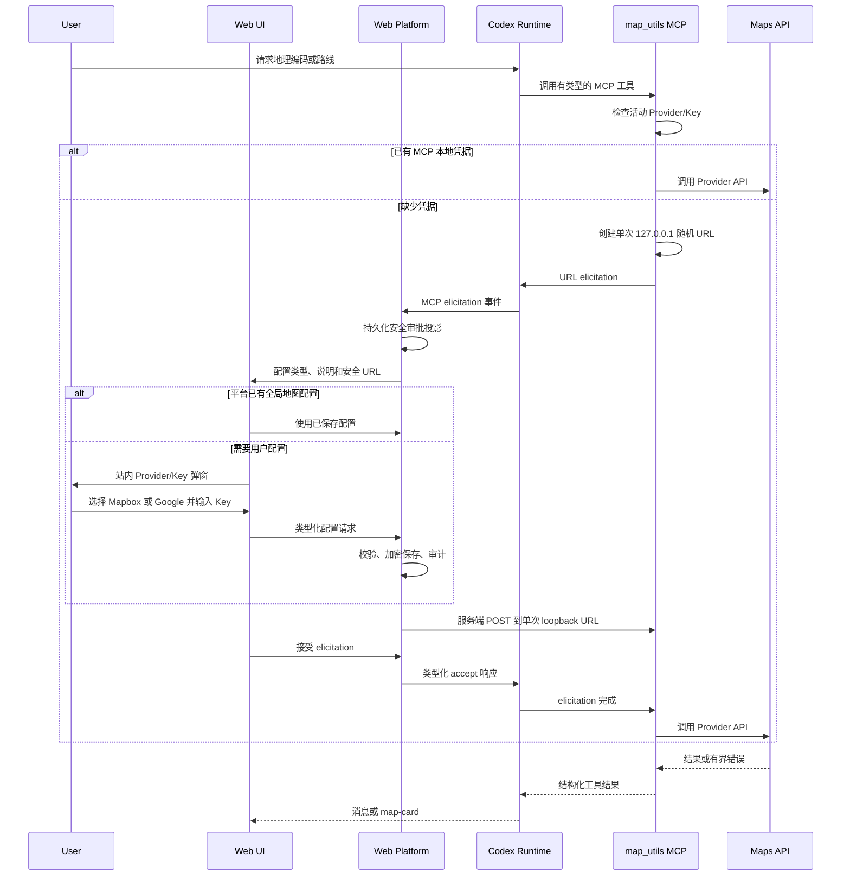

# Skills、MCP 与定制交互扩展指南

本文说明如何在 open-web-codex 中创建和维护定制 Skill，以及何时需要同时增加
MCP Server、Secret 配置、审批适配或专用 Web 面板。`tools/maps-mcp` 中的
`map-utils` 是本文的完整参考实现。

本文描述当前仓库的实现边界。Runtime 能力状态仍以
`docs/capability-baseline.md` 为准，阶段顺序以 `docs/roadmap.md` 为准，当前
任务以 `docs/development-plan.md` 为准。

阶段二已建立 Copilot SDK 源码、通用 Tool runtime、隔离 discovery 与本地正常链入口；尚无
Web Studio、生产安装或 Marketplace。当前直接编辑目录的命令用于 SDK 源码与仓库内 reference
开发，不是 Web 用户安装协议。新建或重写的 `SKILL.md` 主体必须使用中文；
代码标识、Schema 字段和正式产品名可以保留英文。

如需先理解 Agent Definition、Runtime Role、领域知识、Skill 与 MCP 的职责拆分和组合方式，参见
[`domain-agent-extension-architecture.md`](domain-agent-extension-architecture.md)。

## 目录

1. [先确定扩展属于哪一层](#1-先确定扩展属于哪一层)
2. [创建一个 Skill](#2-创建一个-skill)
3. [把 Skill 与 MCP 组成 Copilot 源码](#3-把-skill-与-mcp-组成-copilot-源码)
4. [新建或扩展 MCP Server](#4-新建或扩展-mcp-server)
5. [Secret 或 Key 输入界面的完整适配](#5-secret-或-key-输入界面的完整适配)
6. [自定义卡片和其他面板](#6-自定义卡片和其他面板)
7. [测试与验收](#7-测试与验收)
8. [常见错误](#8-常见错误)
9. [完成定义](#9-完成定义)

## 1. 先确定扩展属于哪一层

Skill、MCP 和界面不是同一种能力：

| 层 | 负责什么 | 不应负责什么 |
| --- | --- | --- |
| Skill | 告诉 Codex 何时执行某个工作流、按什么顺序调用工具、如何处理失败和输出 | 保存 Secret、直接实现远端 API、伪造工具结果 |
| Copilot source | 用 manifest 组合 Skill、Role、Tool runtime 与正常用例 | 执行业务请求、代替权限控制或在源码中安装依赖 |
| MCP Server | 暴露有类型的工具，校验输入，调用本地或远端能力，返回结构化结果 | 把 API Key 作为模型可见参数、渲染浏览器界面 |
| Codex Runtime | 发现 Plugin/Skill/MCP，执行工具，管理 Thread/Turn 和 elicitation | 保存平台用户、组织权限或浏览器状态 |
| Web Platform | 鉴权、授权、持久化、Secret、审批投影、审计和 Runtime 生命周期 | 重新实现 Skill 选择或 MCP 调度 |
| Web UI | 显示安全的浏览器 DTO、弹窗、卡片、加载和错误状态 | 扫描插件目录、启动 MCP、接收 raw JSON-RPC 或本地路径 |

选择方式：

- 只有领域知识或操作流程：创建 Skill。
- 需要重复执行的确定性本地逻辑：优先给 Skill 增加 `scripts/`。
- 需要稳定的工具 Schema、远端 API、长任务、Secret 或独立超时：增加 MCP。
- 需要组合 Skill、Role 和 MCP：创建 Copilot source，并由 SDK 生成临时 Runtime projection。
- 需要 Key 输入、审批、图表、地图或其他专用呈现：继续完成 Platform 和 Web
  适配，不能只修改 Skill。

`map-utils` 的组成如下：

```text
tools/maps-mcp/
├── runtime.toml                    typed dependency/server/env 合同
├── pyproject.toml                  Python 项目与直接依赖
├── requirements.lock               带 SHA-256 的 Python lock
├── package.json                    Node 项目与直接依赖
├── package-lock.json               Node lockfile v3
├── maps_mcp/                       MCP Server 实现
└── tests/                          不访问付费 API 的测试
```

命名建议：

- Skill 使用 kebab-case，例如 `map-utils`；capability-root ID 与 server ID 使用稳定标识。
- MCP Server 使用 snake_case，例如 `map_utils`。
- 名称应稳定；重命名 MCP Server 会同时影响工具名、审批识别、测试和已有配置。

## 2. 创建一个 Skill

### 2.1 先写触发样例

创建文件前先列出三类样例：

1. 应触发：例如“批量查询这些地址的经纬度”。
2. 不应触发：例如“解释经纬度是什么”。
3. 失败路径：例如 MCP 未连接、用户拒绝提供 Key、远端 API 超时。

触发边界不明确时，Skill 会过度占用上下文，或者在需要时不被加载。

### 2.2 使用脚手架

仓库内置 Skill 脚手架。下面的示例把新 Skill 放入一个仓库级能力包：

```bash
python3 codex/codex-rs/skills/src/assets/samples/skill-creator/scripts/init_skill.py \
  geo-analysis \
  --path /absolute/path/to/open-web-codex/tools/geo-tools/skills \
  --resources scripts,references \
  --interface display_name="Geo Analysis" \
  --interface short_description="Analyze locations with typed geographic tools." \
  --interface default_prompt="Use $geo-analysis to analyze these locations."
```

只创建真正需要的资源目录：

```text
geo-analysis/
├── SKILL.md
├── agents/
│   └── openai.yaml
├── scripts/        可选；重复、确定性的执行逻辑
├── references/     可选；按需加载的 API、Schema 或领域资料
└── assets/         可选；输出会直接使用的模板、图标等资源
```

不要在 Skill 目录里增加 README、CHANGELOG 或安装手册。Skill 运行所需的信息放在
`SKILL.md` 或它直接引用的资源中；面向开发者的说明放在 Plugin 根目录或 `docs/`。

### 2.3 编写 SKILL.md

`SKILL.md` 的 frontmatter 只放 `name` 和 `description`。`description` 是主要触发
依据，必须同时说明“做什么”和“什么时候使用”。

```markdown
---
name: geo-analysis
description: Use the geo_tools MCP server to normalize locations, resolve coordinates, and compare geographic results. Use when a task needs address cleanup, coordinate lookup, geographic validation, or a structured location result.
---

# Geo Analysis

Use `geo_tools` for typed geographic operations.

## Workflow

1. Validate the requested locations.
2. Call the smallest matching `geo_tools` tool.
3. Stop and report a sanitized error when configuration is declined, invalid,
   unavailable, or timed out.
4. Return the structured result in the format requested by the user.

Never include API keys in prompts, tool arguments, answers, logs, or generated
artifacts.
```

编写原则：

- 使用直接、命令式表述。
- 只写模型无法可靠自行推断的流程和约束。
- 把“何时触发”完整写进 `description`，不要只写在正文里。
- `SKILL.md` 尽量控制在 500 行以内。
- 大型 API 文档放入 `references/`，并由 `SKILL.md` 直接说明何时读取。
- 容易出错或必须一致的步骤写成脚本，不要让每次调用临时生成。
- 明确拒绝、超时、权限不足和网络失败后的行为，避免无限重试。

### 2.4 编写 agents/openai.yaml

该文件提供 Skill 列表和快捷入口的 UI 元数据，不代替 `SKILL.md`：

```yaml
interface:
  display_name: "Geo Analysis"
  short_description: "Analyze locations with typed geographic tools."
  default_prompt: "Use $geo-analysis to analyze these locations."
```

要求：

- 所有字符串加引号。
- `default_prompt` 必须显式包含 `$skill-name`。
- 只有确实存在图标资源时才增加 `icon_small`、`icon_large`。
- Skill 更新后同步检查该文件，避免 UI 描述与真实工作流不一致。

可以使用生成器重新生成：

```bash
python3 codex/codex-rs/skills/src/assets/samples/skill-creator/scripts/generate_openai_yaml.py \
  /absolute/path/to/geo-analysis \
  --interface display_name="Geo Analysis" \
  --interface short_description="Analyze locations with typed geographic tools." \
  --interface default_prompt="Use $geo-analysis to analyze these locations."
```

### 2.5 验证 Skill

```bash
python3 codex/codex-rs/skills/src/assets/samples/skill-creator/scripts/quick_validate.py \
  /absolute/path/to/geo-analysis
```

基础校验通过后，再用真实措辞做正向、负向和失败路径测试。复杂 Skill 应验证：

- 明确点名 `$skill-name` 时能够工作。
- 未点名但描述匹配时能够被选中。
- 相邻领域请求不会误触发。
- MCP 缺失或失败时不会编造结果。
- 输出不会泄露 Secret、路径或原始协议内容。

## 3. 把 Skill 与 MCP 组成 Copilot 源码

`copilot.toml` 是当前 SDK 源码组合入口。每个 Tool 必须同时声明源码根和显式 runtime：

```toml
[[tools]]
id = "geo_tools"
root = "tools/geo-tools"
runtime = "tools/geo-tools/runtime.toml"
```

Role 源码只在 `[plugins.geo_tools.mcp_servers.geo_tools]` 下声明 server allowlist 与审批
policy，不写 transport。Tool source 也不写 `.codex-plugin/plugin.json`、`.mcp.json`、安装脚本
或 launcher；这些都是 SDK 编译出的临时 Runtime projection，不是作者事实。

`copilot validate` 校验 Skill、Role、Tool runtime 与测试引用；`copilot prepare` 在调用者给定的
外置 output root 准备依赖并写入内部 `prepared-tools.v1.json`。SDK `dev`/`test` 从 descriptor
生成一次性 selected capability roots；Platform local startup 只调用一次相同 prepare，然后由
Server 在当前 Profile 下解析 typed env binding 并投影 Role-local MCP。不要通过以下方式绕过：

- 扫描 Tool 目录猜测语言、依赖或 server。
- 让 WebApp、Tool 或 Runtime launch 写 Profile 配置或安装依赖。
- 在 Tool source 维护第二份 transport 或 installer。
- 把 prepared descriptor、环境路径或 Plugin projection 暴露给浏览器。

## 4. 新建或扩展 MCP Server

### 4.1 什么时候需要 MCP

以下任一条件成立时，优先使用 MCP：

- 需要稳定的输入/输出 Schema。
- 需要调用付费或受权限控制的远端 API。
- 需要独立的超时、并发、重试和费用上限。
- 需要在模型上下文之外处理 Secret。
- 需要多个 Skill 复用同一组工具。
- 需要把工具执行状态交给 Runtime 管理。

### 4.2 MCP 启动声明

Tool `runtime.toml` 示例：

```toml
schema_version = 1

[[dependencies]]
id = "python"
kind = "python-project"
manifest = "pyproject.toml"
lock = "requirements.lock"

[[servers]]
id = "geo_tools"
entry = { kind = "python-module", dependency = "python", module = "geo_tools.server" }
args = []
startup_timeout_sec = 60
tool_timeout_sec = 90

[[servers.env]]
name = "GEO_STATE_ROOT"
source = "tool_state_root"

[[servers.env]]
name = "HTTPS_PROXY"
source = "host"
```

建议：

- 只声明 `python-project` / `node-project` 及其直接 manifest 与 lock，不扫描目录猜语言。
- Python lock 使用 exact pin 与 SHA-256；Node 使用 `package-lock.json` v3。
- server entry 显式引用一个 Python dependency 和 dotted module。
- 环境绑定只使用 `profile_home`、`tool_state_root`、`dependency_root` 或 `host`；`host` 只转发
  声明的同名变量，任何 Secret 值都不进入 manifest。
- 有界启动/工具超时属于 server 声明；工具审批属于 Role policy，不混进 transport。

### 4.3 MCP 工具实现

Python FastMCP 的最小结构：

```python
from mcp.server.fastmcp import FastMCP
from pydantic import BaseModel, Field

mcp = FastMCP("Geo Tools", json_response=True)

class Point(BaseModel):
    latitude: float = Field(ge=-90, le=90)
    longitude: float = Field(ge=-180, le=180)

@mcp.tool()
async def normalize_point(point: Point) -> dict[str, object]:
    return {
        "latitude": point.latitude,
        "longitude": point.longitude,
    }

def main() -> None:
    mcp.run(transport="stdio")
```

工具设计要求：

- 输入使用明确类型、范围、最大数组长度和必填字段。
- 返回小而稳定的 JSON，不返回内部对象、堆栈或 Secret。
- 对批量和矩阵请求设置费用上限；`map_utils` 分别限制 500 个地理编码输入和
  2,500 个矩阵元素。
- 对远端 API 设置连接/读取超时和有限重试。
- 只对明确可重试的限流和 5xx/网络错误重试。
- 将 Provider 返回的错误清洗后再返回；URL 中的 Key 和查询参数必须移除。
- 用户拒绝配置、Key 无效或超时后终止工具调用，不要自动切换 Provider。
- 不把 `provider` 或 `api_key` 暴露成模型可填写的工具参数；这类状态由配置层管理。

### 4.4 环境准备与启动边界

Tool 作者不实现 installer 或 launcher。SDK provisioner 负责外置 venv/Node root、cache、staged
build、hash-locked install、`pip check`、declared module 验证、有界子进程组和 typed failure；
prepared descriptor 只包含运行 transport 与 typed binding，不包含安装命令、日志或 Secret。
Platform 在 Runtime 启动前完成一次 prepare；Server 消费 descriptor 并解析 Profile-scoped
binding；Runtime 仅启动已准备的 `python -m <module>`，用户对话期间不下载依赖。

## 5. Secret 或 Key 输入界面的完整适配

Key 输入不是一个普通确认框。它横跨 MCP、Runtime、Platform、Secret Store 和
Web UI，必须保证 Key 不经过模型上下文。

### 5.1 map-utils 当前流程


```mermaid
sequenceDiagram
    participant U as User
    participant W as Web UI
    participant P as Web Platform
    participant R as Codex Runtime
    participant M as map_utils MCP
    participant A as Maps API

    U->>R: 请求地理编码或路线
    R->>M: 调用有类型的 MCP 工具
    M->>M: 检查活动 Provider/Key
    alt 已有 MCP 本地凭据
        M->>A: 调用 Provider API
    else 缺少凭据
        M->>M: 创建单次 127.0.0.1 随机 URL
        M->>R: URL elicitation
        R->>P: MCP elicitation 事件
        P->>P: 持久化安全审批投影
        P->>W: 配置类型、说明和安全 URL
        alt 平台已有全局地图配置
            W->>P: 使用已保存配置
        else 需要用户配置
            W->>U: 站内 Provider/Key 弹窗
            U->>W: 选择 Mapbox 或 Google 并输入 Key
            W->>P: 类型化配置请求
            P->>P: 校验、加密保存、审计
        end
        P->>M: 服务端 POST 到单次 loopback URL
        W->>P: 接受 elicitation
        P->>R: 类型化 accept 响应
        R->>M: elicitation 完成
        M->>A: 调用 Provider API
    end
    A-->>M: 结果或有界错误
    M-->>R: 结构化工具结果
    R-->>W: 消息或 map-card
```

关键顺序是：Platform 成功把 Key 投递给 MCP 后，Web 才响应 accept。不能先发送普通
Accept 再尝试投递，否则 MCP 会继续等待、前端显示 Invalid，工具保持进行中。

### 5.2 MCP 侧

参考 `tools/maps-mcp/maps_mcp/credential_prompt.py` 和 `server.py`：

- 只监听 `127.0.0.1`。
- 每次请求生成高熵、单次使用的随机路径。
- URL 不携带 Key。
- 使用 URL-mode elicitation，不使用模型可见表单收集 Secret。
- 设置等待超时并在 `finally` 中关闭临时 Server。
- 拒绝或取消时抛出明确终态错误。
- 成功后发送 elicitation complete。
- MCP 本地缓存仅作为运行侧受限记忆，不能代替平台用户级 Secret 设计。

### 5.3 Platform 侧

新增一种 Secret 配置至少需要：

1. 在 `apps/web/crates/platform-contracts` 定义稳定浏览器 DTO。
2. 在 `apps/web/server/src/routes` 增加类型化 GET/PUT/use 路由。
3. 使用 `crates/secret-store` 加密保存 Secret；普通
   `platform_configuration` 只保存非 Secret 数据。
4. 校验当前用户/组织权限并写审计记录。
5. 对单次 URL 做严格 allowlist：
   - 仅 `http://127.0.0.1:<port>/<random-path>`。
   - 禁止 username、password、query、fragment 和空路径。
   - 禁止重定向和系统代理。
   - 使用很短的连接/请求超时。
6. 只有投递成功后才允许审批响应进入 accepted。
7. 对投递失败保留可重试状态；不能让 Turn 永久显示 Working。

地图实现使用：

- `GET /api/configuration/maps`：读取安全状态。
- `PUT /api/configuration/maps`：替换活动 Provider 和 Key。
- `POST /api/configuration/maps/use`：把已保存配置投递给当前 elicitation。

当前地图配置暂按全局作用域保存，下一次配置覆盖上一次。新增配置类型时应预留未来
按用户/Profile 作用域迁移的键结构。

### 5.4 Web 侧

参考以下文件：

- `apps/web/browser/client.ts`：类型化 HTTP 方法。
- `apps/web/src/services/mapsConfiguration.ts`：共享配置状态和加载/保存动作。
- `MapsConfigurationModal.tsx`：Provider 选择、Key 输入、验证和错误状态。
- `ApprovalCard.tsx`：把 map elicitation 适配成站内配置流程。

新界面必须具备：

- loading、saving、success、error 和 retry 状态。
- 取消后向 Runtime 返回 decline/cancel，而不是继续显示进行中。
- 服务端权限不足时禁用保存并解释原因。
- 明暗主题、窄屏和超大屏布局。
- 键盘焦点、Esc、可访问名称、`aria-modal`、错误 `role="alert"`。
- 请求进行中禁止重复提交。
- 刷新页面后从服务端恢复配置状态，不能只保存在 React state。

不要依赖提示文案正则来长期区分新配置类型。`map_utils` 当前为兼容旧
`workspace_maps` 保留了 serverName/文案识别；增加下一种配置面板时，应在 Platform
的安全审批投影中增加明确、受控的配置类型字段，再由 Web 按该字段选择组件。

### 5.5 Secret 可见性

默认规则是 Secret 永不返回浏览器。唯一例外必须由客户端 SDK 的运行方式证明：

- Google Maps Key 在当前实现中只保留在 Server，并只投递给地图 MCP。
- Mapbox GL 在浏览器加载底图，因此活动 Mapbox Token 必须是以 `pk.` 开头的公开
  浏览器 Token。Platform 只在 Mapbox 为当前 Provider 时返回它；部署者还应在
  Mapbox 控制台限制允许的站点来源和权限。

“公开浏览器 Token”不等于可以把任意 Server Secret 返回给浏览器。

### 5.6 失败状态矩阵

| 失败 | MCP 行为 | Platform/Web 行为 |
| --- | --- | --- |
| 未配置 | 发起一次 URL elicitation | 显示配置弹窗或自动使用已保存配置 |
| 用户拒绝 | 结束工具并返回明确错误 | 将审批标记为 declined/cancelled，停止 Working |
| 无配置权限 | 不收到 Key | 禁用保存，显示权限错误，可取消 |
| URL 不安全 | 不接受投递 | 返回 400，不渲染可点击外链 |
| Key 格式错误 | 不调用远端 API | 前后端同时校验，弹窗保留输入 |
| Provider 拒绝 Key | 返回清洗后的 API 错误 | 工具进入 failed，不保持 in-progress |
| 网络/超时 | 有限重试后失败 | 展示可理解错误，允许用户重新运行 |
| MCP 启动失败 | 快速退出并写安全诊断 | Runtime status 显示分类错误 |
| 页面刷新/重连 | Runtime 请求仍是权威状态 | 从持久审批和服务端配置恢复 |

## 6. 自定义卡片和其他面板

### 6.1 先选择承载方式

| 需求 | 推荐承载 |
| --- | --- |
| 简短文字或表格 | 普通 assistant Markdown |
| 一次确认 | Runtime approval / elicitation 卡片 |
| Secret 或结构化表单 | 类型化 Platform 资源 + modal |
| 工具执行详情 | 对话时间线中的 tool card |
| 可交互结果 | Inline Visualization Artifact + 稳定 DTO +专用 renderer |
| 大型数据、文件、GeoJSON | Artifact 引用和按权限加载 |
| 跨消息持续操作 | 独立侧栏或页面级 panel，并由服务端持久状态驱动 |

### 6.2 map-card 当前实现

地图数据工具先返回标准 MCP `resource_link`，并在 `outputSchema` 约束的
`data_ref.server` 与 `data_ref.uri` 中返回 Resource 路由身份。该 `data_ref` 既可原样
放入 `create_map_card.sources.<source-id>.data_ref`，也可在下游工具确实需要 GeoJSON
时把 `server`、`uri` 原样传给 MCP
`resources/read`。`map_utils` 是原始 server ID，`mcp__map_utils` 只是模型可见 Tool
命名空间。

`create_map_card` 使用单一 `map.v3` 合同。`sources` 是由 source ID 索引的平台管理
GeoJSON：统一使用平台管理的 `data_ref`，GeoJSON 内容不得通过模型上下文传递；其他官方
GeoJSON source option 保留。`layers` 是官方 Mapbox Style Specification Layer JSON，
由官方 validator 校验；Open Web 不再维护第二套 layer type、paint/layout、filter
或 expression 白名单。官方未知属性诊断是 warning，已知语法错误失败。标准 camera
字段位于顶层；文本 hover 和 legend 都是 `extensions` 下的可选 Open Web 行为。

同一 Run、同一 Thread 中后续的 `map_utils.create_map_card` 通过 MCP `outputSchema`
返回 `structuredContent`：

```json
{
  "type": "open-web-artifact",
  "kind": "inline-visualization.v1",
  "artifact": {
    "ref": "map-7d67b30d",
    "renderer": {
      "kind": "map.v3",
      "payload": {
        "title": "Jakarta locations",
        "intent": "visualization",
        "status": "ready",
        "sources": {
          "locations": {
            "type": "geojson",
            "data": {
              "type": "mcp_resource",
              "server": "map_utils",
              "uri": "maps-data://geojson/map-data-8a4c...",
              "format": "geojson"
            }
          }
        },
        "layers": [
          {
            "id": "points",
            "type": "circle",
            "source": "locations",
            "paint": {
              "circle-color": "#ef4444",
              "circle-opacity": 0.9,
              "circle-radius": 8,
              "circle-stroke-color": "#ffffff",
              "circle-stroke-width": 2
            }
          }
        ]
      }
    }
  },
  "embed": {
    "syntax": "codex-inline-vis.artifact.v1",
    "code": "::codex-inline-vis{artifact=\"map-7d67b30d\"}"
  }
}
```

> 以下 MCP Resource→Inline Artifact 链描述当前旧地图实现，属于 ADR-018 要删除的迁移
> 输入，不得用于阶段一新增数据交换。阶段一仓网 Tool 使用 Workspace 相对路径读取数据，
> 地图 Tool 直接产生用户交付 Artifact；Artifact 不再作为 Agent 输入。

浏览器链路：

1. Server 通过通用 `inline-visualization.v1` envelope 和 renderer registry 识别
   Artifact，不根据 `map_utils` 或 `create_map_card` 名称分支。`map.v3` validator
   校验安全 envelope、source 授权图、camera 和 extension 引用，不重复实现 Mapbox
   样式语义；Tool 的 `structuredContent.embed.code` 是唯一可复制的嵌入指令，公开
   Tool projection 不向浏览器提供 renderer payload。
2. Server 从较早完成的 MCP Tool 的标准 `resource_link.uri` 注册 Resource，
   并在同一 Run、同一 Thread 内解析 renderer 中的同一 server/URI。跨 Run、
   跨 Thread、后向引用、缺失、冲突和自引用不会登记为可用 Artifact。
3. 授权 Artifact API 通过官方 `mcpServer/resource/read` 延迟加载并缓存 GeoJSON；
   Inline Artifact 保存把 Resource 引用替换为授权 URL 后的 renderer payload。
4. Tool completed 只登记 Artifact，不渲染地图。Assistant 把 Tool 生成的
   `structuredContent.embed.code` 独占一行放入目标回复位置；`MAP_HANDOFF` 只保留
   输入 Resource provenance 和 map Artifact ID，不把该指令转义进 JSON。
5. Server 为该 Agent Message 事件解析独立指令并附加类型化 `inlineArtifacts`；
   `AssistantMessage.tsx` 对实时事件和历史恢复使用这份浏览器权威 DTO、同一指令
   parser 和 renderer registry；一条消息按顺序组合 Markdown/Artifact segment。
6. fenced/indented code 中的指令不解析；不完整的流式指令先缓冲；无权访问或无效
   引用在 Message 完成后显示明确 unavailable 状态。
7. `MapReplyCard.tsx` 为每个 source 创建 Mapbox GL source，再将标准 layer JSON
   除本地 layer/source ID 外原样交给 `map.addLayer`。
8. 未提供 `center`/`zoom` 时在 map load 和容器首次获得非零尺寸后 fit；显式
   camera 精确使用 center、zoom、bearing 和 pitch。
9. 没有 Mapbox Token 时仍保留卡片和配置按钮；Mapbox 或 Artifact 失败时显示明确错误。

`map.v3` 不接受 inline GeoJSON。所有 GeoJSON 必须通过 MCP Resource URI 和授权 Artifact
传输。Server 的通用 Resource 内存安全边界不属于卡片合同；需要更大数据时应新增流式
PMTiles/MVT source，而不是复制 GeoJSON 到文本。

当前可运行流程是：

```text
data tool -> MCP Resource
render tool -> Inline Visualization Artifact + Tool-generated embed code
assistant -> MAP_HANDOFF(provenance + artifact ID) + standalone embed directive
platform event -> typed inlineArtifacts
web -> one Agent Message with ordered Markdown/Artifact segments
```

约束：

- render Tool 完成只登记 Artifact，不自动显示；
- Assistant 只把 Tool 生成的短代码复制为独立指令，不复制 payload，也不把代码再
  转义进 `MAP_HANDOFF` JSON；
- 浏览器只使用平台事件的类型化 `inlineArtifacts` 解析 Artifact；
- Platform 通过通用 Artifact envelope 和 renderer registry 分派，不按 MCP
  server/tool 名称硬编码；
- 指令必须使用官方独立行语法，代码块中的字面量不解析；
- live/history 使用同一 parser 和 Artifact resolver；
- 旧 `replyCard` 投影已删除，不双写、不兼容恢复旧地图历史。

### 6.3 新增一种 Inline Visualization renderer

至少完成：

1. 定义版本化 payload，例如 `chart.v1`，并限制字段、数组长度、嵌套深度和跨字段不变量。
2. 在 MCP 侧生成结构化 payload，不让模型手写复杂数据。
3. 用通用 `inline-visualization.v1` envelope 包裹 renderer payload，并由 Tool
   生成安全、不可预测、无路径语义的 Artifact ref 与完整 embed code。真实 HTML
   文件才使用官方 `file="*.html"`。
4. Platform 注册授权 Artifact；Tool 完成时不得直接挂载 renderer。
5. 在浏览器定义独立类型、严格 parser/normalizer 和 fallback text。
6. 为 Artifact 创建独立组件，处理 loading、ready、empty、error、retry。
7. 使用稳定 ID 和 memoization；不要因流式 delta、输入草稿或无关消息重新挂载。
8. 支持主题、响应式、全屏/关闭、键盘和屏幕阅读器。
9. 不渲染 payload 中的任意 HTML、脚本或未经允许的 URL。
10. 增加指令 parser、组件、消息组合、未引用不显示、历史恢复和流式稳定性测试。

如果卡片需要访问新的浏览器 SDK 或公开 Token，还要增加：

- 依赖拆包或动态加载，避免扩大首屏包。
- Content Security Policy、来源限制和 SDK 失败状态。
- Token 的最小权限与来源限制。
- 资源销毁、ResizeObserver 和重复渲染测试。

### 6.4 新增普通业务面板

不要直接把 raw MCP payload 传给 React。采用以下链路：

```text
Runtime event/tool result
  -> Profile Host 内部协议
  -> Platform 持久化和授权
  -> 稳定浏览器 DTO
  -> typed browser client
  -> UI 状态机
  -> panel/modal/card
```

面板设计前先写清：

- owner：Runtime、Platform 还是纯 Browser 状态。
- 数据主键和版本。
- 创建、加载、刷新、提交、取消、失败和过期状态。
- 刷新/重连后从哪里恢复。
- 多 Thread 同时运行时如何隔离。
- 用户快速重复操作时如何幂等绑定。
- 哪些字段可以进入浏览器，哪些只能留在 Server。

## 7. 测试与验收

### 7.1 Skill 和 Plugin

```bash
python3 codex/codex-rs/skills/src/assets/samples/skill-creator/scripts/quick_validate.py \
  tools/<plugin>/skills/<skill>
```

检查：

- `copilot.toml` 的 Skill、Role、Tool root/runtime 与 tests 引用一致且不越出 source root。
- `runtime.toml` 的 dependency manifest/hash lock、server entry 与 env binding 通过 typed 校验。
- Skill 名称、目录和 frontmatter 一致。
- `agents/openai.yaml` 的默认 Prompt 包含 `$skill-name`。
- SDK 投影的新 Thread `selectedCapabilityRoots` 包含预期临时 capability root。
- Runtime 能看到 Skill 和 MCP 工具。

### 7.2 MCP 单元与启动 Smoke

地图参考命令：

```bash
cd tools/maps-mcp
PYTHONPATH=. python3 -m unittest discover -s tests -v

cd ../..
PYTHONPATH=tools/copilot-sdk python3 -m copilot_sdk prepare . \
  --manifest apps/web/builtin/warehouse-network-copilot/copilot.toml \
  --output-root "$PWD/.local/open-web-codex/copilot-environment"
```

单元测试使用 fake HTTP，不应访问付费 Provider。至少覆盖：

- 工具 Schema 和输入边界。
- 缺少 Key、接受、拒绝、超时。
- Provider 4xx、429、5xx、网络失败、无效 JSON。
- Secret 脱敏。
- 批量切片、顺序和费用上限。
- MCP initialize、`tools/list` 和代表性 `tools/call`。
- stdout 没有非 JSON-RPC 内容。

### 7.3 Web 和 Platform

仅浏览器变化：

```bash
npm --prefix apps/web run lint
npm --prefix apps/web run typecheck
npm --prefix apps/web test
npm --prefix apps/web run build
npm --prefix apps/web run check:no-desktop
```

地图卡片定向 Smoke：

```bash
./scripts/smoke-map-card-rendering.sh
```

Inline Visualization 迁移完成后，该 smoke 必须验证 Tool 完成不显示、Assistant
引用才显示、同一消息内“文字—组件—文字”、跨 delta 指令、代码块排除和历史恢复；
不得保留旧 `replyCard` 断言作为兼容路径。

Platform DTO、路由、Secret、审批或持久化变化：

```bash
cd apps/web
cargo fmt --all --check
cargo test --workspace --locked
```

还应使用一次性 PostgreSQL 数据库运行相关 ignored integration tests，并覆盖：

- 跨组织拒绝。
- 非管理员配置拒绝。
- Secret 加密保存且普通配置表无明文。
- 安全 loopback URL 接受，外部 URL、query、fragment、redirect 拒绝。
- 投递失败不错误地接受 elicitation。
- 重连、重启和重复决策。

跨 Codex 协议变化还需执行：

```bash
./scripts/test-codex.sh -p codex-app-server-protocol schema_fixtures::
npm --prefix apps/web run smoke:codex-app-server
```

不要为只增加 Skill/MCP 能力而修改 Codex 协议；优先使用现有 Copilot source/runtime、
SDK projection、MCP 和 elicitation 边界。

### 7.4 真实端到端流程

真实验收至少包括：

1. 启动 Platform，确认 MCP 依赖环境健康。
2. 新建 Workspace 和新 Thread，验证能力根在新 Thread 中生效。
3. 使用目标 Provider/模型发送会触发 Skill 的自然语言请求。
4. 未配置 Key 时，确认显示站内配置弹窗，不打开新网页。
5. 取消配置，确认工具失败并停止 Working。
6. 配置 Key，确认工具继续并进入 completed 或明确 failed。
7. 刷新页面和切换 Thread，确认审批、工具状态和专用卡片稳定恢复。
8. 在明暗主题、窄屏和超大屏下检查弹窗/面板。
9. 让 Provider API 返回错误或断网，确认不会永久 in-progress。

先以 `copilot dev` 验证 discovery，再以 `copilot test` 验证本地确定性正常链；真实 Provider、
Credential elicitation 和 Web map-card 仍需从真实 Task 入口单独验收。测试 Key 只放在进程环境
或 Secret Store，不提交到仓库、日志、Prompt 或测试快照。

## 8. 常见错误

- 只写 Skill，却没有实现它要求调用的工具。
- 把 API Key 放进 Skill、MCP 参数、`runtime.toml`、Role policy 或模型 Prompt。
- MCP 启动时向 stdout 打印安装日志，破坏 JSON-RPC 握手。
- 在用户对话期间创建虚拟环境或下载依赖。
- 没有超时，导致工具和 Thread 永久显示进行中。
- 在 WebApp 里扫描 Tool/runtime 或直接调用第三方 API，绕过 Runtime 和 Platform。
- 把 raw app-server request ID、路径或未知 payload 暴露给浏览器。
- 对 URL elicitation 发送普通 Accept，没有先完成安全投递。
- 依靠英文提示文案决定使用哪个业务弹窗。
- 只处理成功状态，没有拒绝、权限、网络、重连和刷新恢复。
- 卡片组件跟随每次流式消息或输入草稿重新挂载。
- 用内联 `structuredContent` 承载大型数据，而不是 Artifact 引用。
- 只适配暗色主题，或把原生 `alert/confirm` 当作正式交互。

## 9. 完成定义

一个定制能力只有同时满足以下条件才算完成：

- Skill 的触发范围、工作流和失败策略明确并通过验证。
- MCP 工具 Schema、输入上限、超时、错误和脱敏完整。
- Plugin 能由新 Thread 的 Runtime 真实发现。
- Secret 不进入模型上下文、浏览器不接收 Server Secret。
- Platform 完成鉴权、授权、持久化、审计和安全投影。
- Web 完成加载、提交、取消、失败、重试和恢复状态。
- 专用卡片/面板适配主题、尺寸、键盘、可访问性和稳定渲染。
- 单元、集成、启动 Smoke 和真实端到端流程均有可重复证据。
