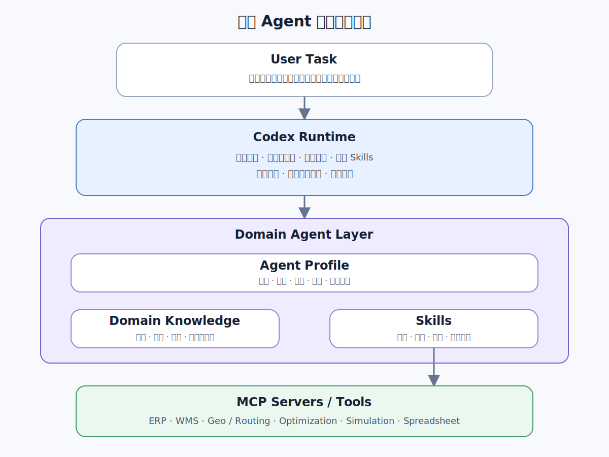
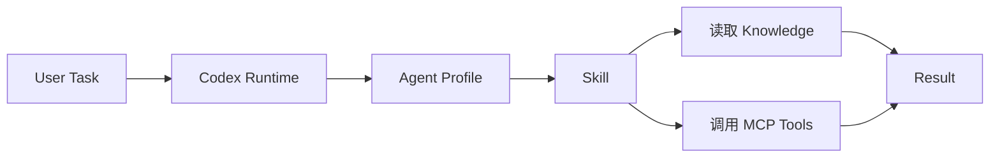
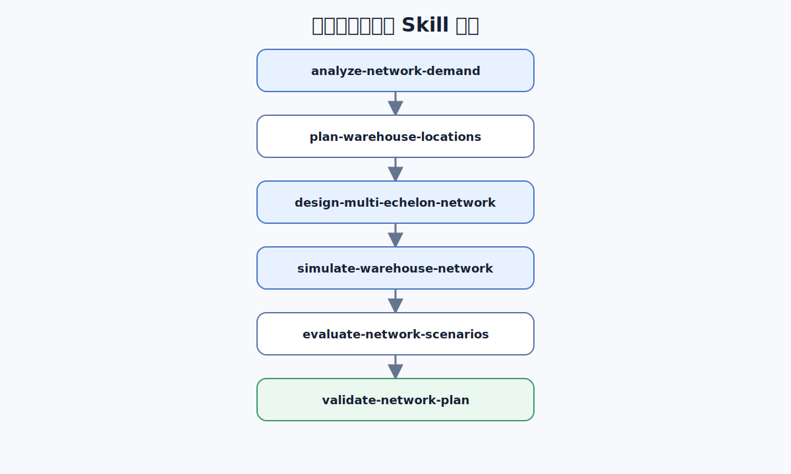
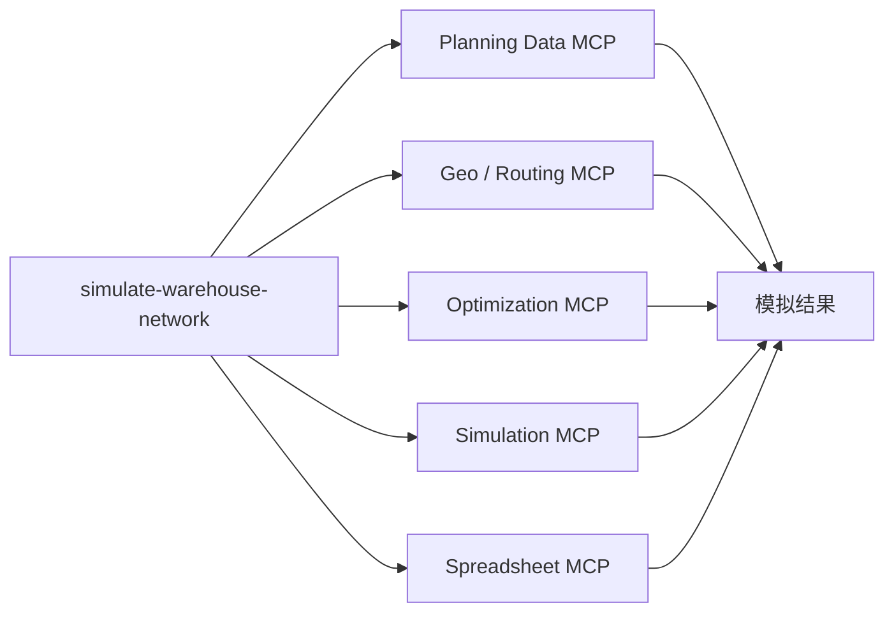
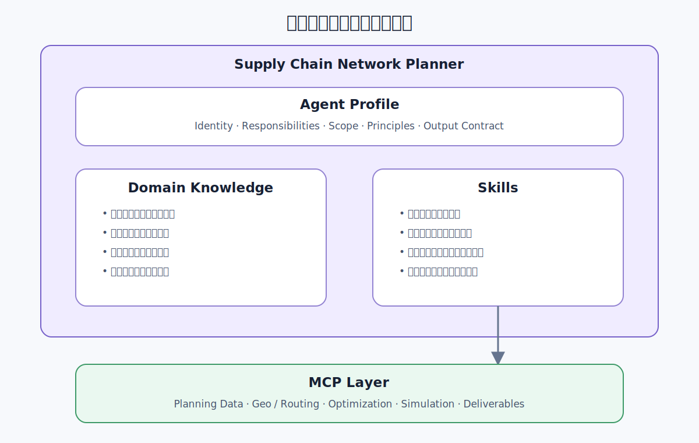
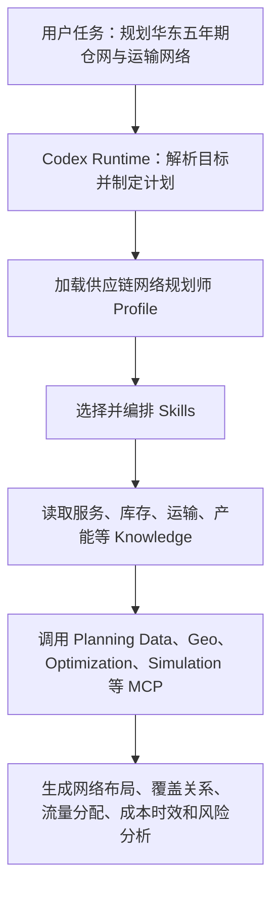
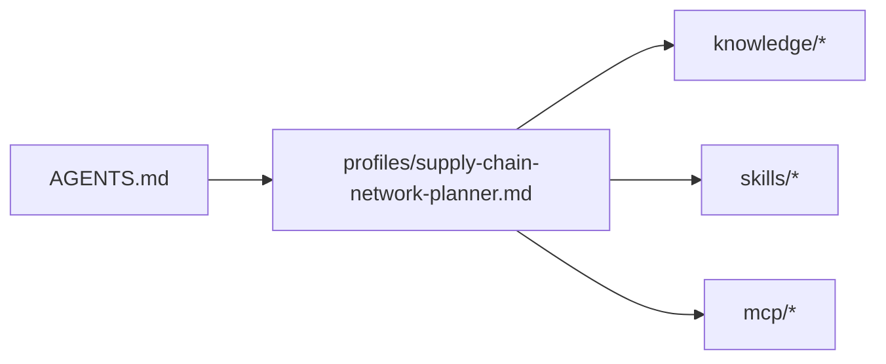
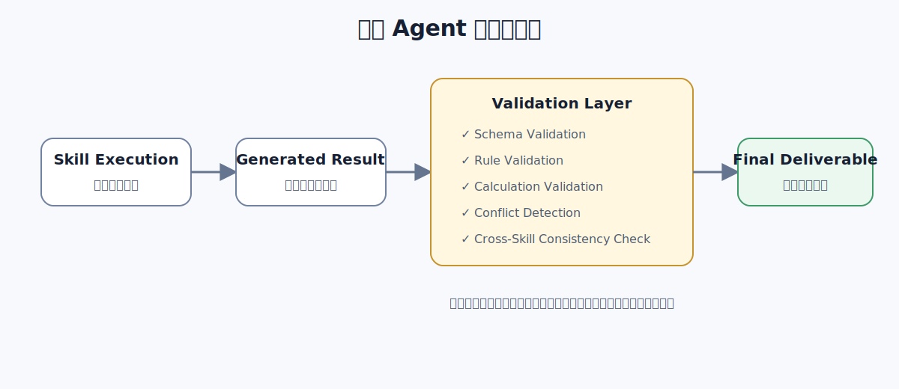
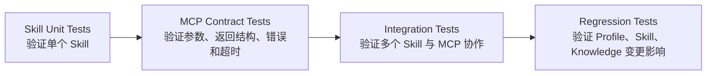

# 面向 Codex 的领域 Agent 扩展架构

## 1. 文档概述

领域 Agent 扩展架构由 **Agent Profile、Domain Knowledge、Skills 与 MCP Servers** 组成，适合为 Codex 增加供应链、系统架构、数据分析等专业能力。

典型应用包括：

- 供应链网络规划师
- 系统架构师
- 云平台运维专家
- 数据分析专家
- 安全审计专家
- 代码评审专家
- 行业解决方案顾问

领域 Agent 通常不需要独立的基础模型。Codex Runtime 加载角色说明、领域知识、任务流程和外部工具后，即可按相应专业角色完成工作。

领域 Agent 包含四个部分：

| 组成 | 作用 |
| --- | --- |
| Agent Profile | 定义角色、职责、边界和工作原则 |
| Domain Knowledge | 提供标准、规范、业务事实和项目资料 |
| Skills | 定义专业任务的执行方法 |
| MCP Servers / Tools | 连接外部系统、数据和计算工具 |

其中，Codex Runtime 负责通用任务理解、规划、调度和执行；领域 Agent 负责提供专业角色、专业知识、专业方法和工具能力。

---

## 2. 总体架构

### 2.1 逻辑分层



该结构形成以下执行流程：



---

### 2.2 职责划分

| 组件 | 核心职责 |
| --- | --- |
| Codex Runtime | 理解任务、规划步骤、组织执行并汇总结果 |
| Agent Profile | 定义角色、职责、边界和工作约束 |
| Domain Knowledge | 提供领域事实、标准、规范和项目资料 |
| Skill | 定义专业任务的执行方法 |
| MCP Server | 提供外部系统、数据和工具能力 |

可以进一步归纳为：

| 概念 | 说明 |
| --- | --- |
| Agent Profile | 以什么专业角色工作 |
| Knowledge | 依据什么进行判断 |
| Skill | 如何完成某类专业任务 |
| MCP | 通过什么外部能力执行 |
| Codex | 如何理解、规划和组织全过程 |

---

## 3. Agent Profile

### 3.1 定义

Agent Profile 是对领域 Agent 的总体说明，可以写在 `AGENTS.md` 或领域配置中。

它用于描述：

- Agent 的专业身份；
- Agent 的任务范围；
- Agent 的职责边界；
- Agent 的工作原则；
- Agent 可以使用的 Skills；
- Agent 对知识和工具的使用要求；
- Agent 的输出格式和完成标准。

Agent Profile 规定 Agent 在不同任务中都要遵循的角色、职责和工作原则。具体任务的执行步骤由 Skill 定义。

Agent Profile 通常包含：

| 字段 | 内容 |
| --- | --- |
| Identity / Description | 角色名称和专业说明 |
| Responsibilities / Scope | 职责、适用范围和排除范围 |
| Constraints / Operating Principles | 工作约束和执行原则 |
| Available Skills | 可用的专业流程 |
| Knowledge References | 使用的领域资料 |
| Output Requirements | 输出格式和完成标准 |

---

### 3.2 供应链网络规划师 Profile 示例

```yaml
name: supply-chain-network-planner

description: >
  面向供应链设施布局、仓网规划、运输网络与服务能力设计的网络规划专家。

responsibilities:
  - 分析需求分布、订单结构、服务时效和现有供应链网络
  - 设计工厂、区域仓、前置仓、门店与客户之间的网络布局
  - 执行设施选址、仓库覆盖、运输线路、产能与库存配置规划
  - 识别成本、时效、产能、韧性和碳排风险
  - 生成网络方案、流量分配、成本测算和实施建议

scope:
  includes:
    - facility location planning
    - warehouse network design
    - customer and demand allocation
    - transportation lane design
    - inventory positioning
    - capacity planning
    - cost and service-level optimization

  excludes:
    - 未经授权直接调整生产、采购、库存或运输系统
    - 在数据缺失时输出确定性结论
    - 将单一预测或优化结果描述为唯一可行方案

operating_principles:
  - 先确认需求，再进行方案设计
  - 区分事实、假设和建议
  - 关键计算必须保留依据
  - 设施产能、流量守恒和服务半径必须进行约束校验
  - 至少比较基准方案与候选方案
  - 设计结果必须明确风险和待确认项

output_requirements:
  - 规划假设
  - 供应链网络布局
  - 设施与线路参数表
  - 成本和服务水平测算
  - 风险清单
  - 决策依据
```

---

### 3.3 Profile 的边界

Agent Profile 应保持稳定，不应承载大量变化频繁的实现细节。

| 适合放入 Profile | 不适合放入 Profile |
| --- | --- |
| 角色职责 | 完整 API 参数 |
| 工作原则 | 大量执行步骤 |
| 任务边界 | 厂商命令手册 |
| 输出标准 | 大量领域文档正文 |
| 工具使用原则 | 具体脚本实现 |

例如，Profile 可以规定：

```text
设施规划必须查询权威的需求、产能和地理数据源。
```

但不应规定：

```text
必须调用 WMS API 的 /api/facilities/capacity 接口。
```

前者是角色级约束，后者是工具实现细节。

---

## 4. Domain Knowledge

### 4.1 定义

Domain Knowledge 是领域 Agent 在任务执行过程中使用的专业依据。

它可以来自行业标准、企业规范、外部资料、项目资料、历史方案和交付模板。

对于供应链网络规划 Agent，典型知识来源包括：

| 类别 | 典型内容 |
| --- | --- |
| 标准知识 | 物流设施与作业标准；运输、包装与温控规范；碳核算标准；行业服务水平基准 |
| 企业知识 | 客户服务承诺；库存与补货策略；设施分级与选址约束；运输采购与计价规则；成本核算口径 |
| 项目知识 | 客户与需求分布；现有工厂和仓库；设施产能与利用率；订单和货物流量；运输时效与成本；需求预测 |
| 外部知识 | 地理与路网数据；承运商能力与报价；区域政策和灾害风险；行业网络布局案例 |

---

### 4.2 Knowledge 与 Skill 的关系

Knowledge 提供判断依据，Skill 提供执行方法。


因此，Skill 在执行过程中读取 Knowledge、调用 MCP Tools，并根据专业流程生成结果。

企业规范发生变化时，应优先更新 Knowledge，而不是重写 Skill。

---

## 5. Skills

### 5.1 定义

Skill 是面向某类专业任务的可复用执行单元。

一个完整 Skill 通常包含：

| 内容 | 说明 |
| --- | --- |
| Name / Description / When to Use | Skill 的名称、用途和触发条件 |
| Inputs / Required Knowledge | 输入数据和需要读取的领域资料 |
| Workflow / Tools | 执行步骤和使用的工具 |
| Validation Rules | 结果校验规则 |
| Outputs / Completion Criteria | 输出内容和完成条件 |

Skill 的核心价值是将专业方法从通用模型推理中显式抽离出来。

---

### 5.2 供应链网络规划 Skill 集合

供应链网络规划的主链是“需求基线—仓网选址—多层网络设计—仓网布局模拟—方案评估—统一校验”。一个网络规划 Agent 可以包含如下 Skills：

| Skill | 作用 |
| --- | --- |
| `analyze-network-demand` | 整理需求、设施、成本和服务目标 |
| `plan-warehouse-locations` | 决定仓库位置、组合和启停时间 |
| `design-multi-echelon-network` | 设计网络层级、节点角色和连接关系 |
| `simulate-warehouse-network` | 模拟流量、产能、库存、成本、时效和韧性 |
| `evaluate-network-scenarios` | 比较不同选址、网络结构和模拟结果 |
| `validate-network-plan` | 校验约束、流量守恒、一致性和结果完整性 |

其中三个核心规划 Skill 的边界是：

| Skill | 回答的问题 | 负责的内容 |
| --- | --- | --- |
| `plan-warehouse-locations` | 仓在哪里、开哪些仓、何时启停 | 候选仓评估，新建、保留、扩建、迁移和关闭决策，初步产能约束与分年度设施计划 |
| `design-multi-echelon-network` | 网络分几层、各层做什么、节点如何连接 | 工厂、中央仓、区域仓、前置仓和客户的角色、覆盖、主备关系、补货、调拨、配送、直发与逆向路由 |
| `simulate-warehouse-network` | 给定设施和网络关系后，实际运行表现如何 | 需求、流量、产能、库存、成本、时效、服务水平、韧性与生命周期模拟 |

产能、时效、成本、韧性和生命周期不需要分别拆成独立 Skill：

- 设施的初步产能和启停时间属于仓网选址决策；
- 详细产能、库存定位和上下游关系属于多层网络设计；
- 产能利用率、成本、时效、韧性及生命周期影响由仓网布局模拟验证。

其余三个 Skill 提供流程支撑：

- `analyze-network-demand` 形成统一的需求、设施、成本和服务基线；
- `evaluate-network-scenarios` 比较不同选址、网络结构和模拟结果；
- `validate-network-plan` 校验约束、流量守恒、一致性和结果完整性。

每个 Skill 的粒度应满足两个条件：

1. 能够独立执行；
2. 能够独立验证。

不建议设计为：

```text
do-all-supply-chain-network-planning
```

因为这种 Skill 的输入、输出、执行边界和失败恢复机制都不清晰。

---

### 5.3 核心 Skill 的协作关系



仓网布局模拟应支持多种模式，但共享同一套设施、网络关系、需求和指标定义：

```yaml
simulation_modes:
  - steady_state
  - peak
  - growth
  - disruption
  - lifecycle
```

- `steady_state`：验证正常需求下的流量、产能、库存、成本和时效；
- `peak`：验证大促、季节性和极端峰值；
- `growth`：验证多年需求增长与扩容节奏；
- `disruption`：模拟仓库、供应、承运商或运输线路中断；
- `lifecycle`：模拟新仓爬坡、扩建、迁移、新旧仓并行和关仓过程。

---

### 5.4 Skill 内部结构

`simulate-warehouse-network` 的主要步骤如下：

1. 验证输入数据。
2. 读取设施和网络关系。
3. 选择模拟模式。
4. 分配需求和货物流量。
5. 计算产能、库存、端到端时效和成本。
6. 注入需求增长、设施变化或中断事件。
7. 生成模拟结果和校验报告。

对应配置可以表示为：

```yaml
name: simulate-warehouse-network

description: >
  在给定设施组合、多层网络关系和需求基线下，
  模拟货物流量、产能、库存、成本、时效、韧性和生命周期表现。

inputs:
  required:
    - network_baseline
    - selected_facilities
    - multi_echelon_relations
    - demand_points
    - service_level_targets
    - transportation_rates

  optional:
    - simulation_modes
    - demand_growth_scenarios
    - peak_factors
    - disruption_scenarios
    - lifecycle_events

knowledge:
  - knowledge/service-level-policy.md
  - knowledge/capacity-and-inventory-policy.md
  - knowledge/transportation-cost-rules.md

workflow:
  - 验证输入数据
  - 读取设施、层级、覆盖与路由关系
  - 选择正常、峰值、增长、中断或生命周期模拟模式
  - 分配客户需求、订单和货物流量
  - 计算仓库吞吐、存储、人员和设备利用率
  - 计算库存位置、仓内处理、运输和端到端时效
  - 计算设施、仓储、运输、调拨、库存和逆向物流成本
  - 注入需求增长、设施启停或网络中断事件
  - 重新分配流量并计算服务损失与恢复时间
  - 输出瓶颈、风险、敏感性和待确认事项

tools:
  - planning.query_demand
  - geo.calculate_distance_matrix
  - optimizer.allocate_product_flow
  - simulator.simulate_product_flow
  - simulator.calculate_capacity_utilization
  - simulator.calculate_time_and_cost
  - simulator.apply_disruption_event
  - spreadsheet.create_workbook

validation:
  - 所有需求必须分配到可服务设施
  - 设施分配量不得超过可用产能
  - 网络流量必须守恒且不存在循环路由
  - 成本和时效口径必须符合企业规范
  - 中断场景必须记录备用关系、服务损失与恢复时间
  - 所有计算必须保留依据
```

---

## 6. MCP Servers 与 Tools

### 6.1 定义

MCP Server 用于向 Codex 暴露外部系统能力。

MCP Server 可以提供 Tools、Resources、认证、连接管理和结构化输入输出。

在领域 Agent 架构中，MCP 是工具接入层，而不是业务流程层。

---

### 6.2 供应链网络规划相关 MCP

| MCP | 典型 Tools |
| --- | --- |
| Planning Data MCP | `get_demand_points`、`get_facilities`、`get_inventory`、`get_capacity`、`get_orders` |
| Geo / Routing MCP | `geocode_locations`、`get_distance_matrix`、`estimate_transit_time`、`calculate_route_cost` |
| Optimization MCP | `solve_facility_location`、`allocate_demand`、`compare_solutions` |
| Simulation MCP | `simulate_product_flow`、`calculate_capacity_utilization`、`calculate_time_and_cost`、`apply_disruption_event` |
| Diagram MCP | `create_topology`、`add_node`、`add_link`、`export_diagram` |
| Spreadsheet MCP | `create_workbook`、`add_sheet`、`write_table`、`export_xlsx` |
| Git MCP | `read_repository`、`create_branch`、`commit_changes`、`create_pull_request` |

---

### 6.3 Skill 与 MCP 的调用关系



这里的关键原则是：

| 层 | 职责 |
| --- | --- |
| Skill | 组织专业工作方法 |
| MCP | 提供外部执行能力 |

MCP Tool 不应隐藏完整业务流程。

| 建议 | 示例 |
| --- | --- |
| 使用职责明确的 Tool | `get_demand_points`、`get_facility_capacity`、`get_distance_matrix`、`calculate_route_cost`、`create_diagram`、`write_table` |
| 避免用一个 Tool 覆盖完整业务流程 | `design_entire_supply_chain_network` |

如果 MCP Tool 直接完成整个网络设计，Skill 层将失去流程控制、校验和可观测能力。

---

### 6.4 MCP 工具输出合同（`outputSchema`）

每个 MCP Tool 都以 `inputSchema` 描述可接受的参数；对需要被后续 Skill、平台或
确定性 UI 使用的稳定结果，还应声明 `outputSchema`。前者是工具调用合同，后者是
工具结果合同，二者都不应依赖模型从自然语言中猜测字段含义。

| 字段或通道 | 负责的内容 | 使用边界 |
| --- | --- | --- |
| `inputSchema` | 参数名、类型、必填项、范围和数组上限 | MCP Tool 的调用输入；MCP 工具定义必须提供。 |
| `outputSchema` | 稳定结果的字段、类型和约束 | MCP Tool 的结构化结果；MCP 允许省略，但稳定的机器可读结果应提供。 |
| `structuredContent` | 实际返回的、受 `outputSchema` 约束的数据 | Runtime、其他受控服务或具备协议能力的 MCP Client 使用。 |
| `content` | 与结构化结果一致的可读文本或序列化 JSON | 兼容只读取文本的 Client 和模型上下文；不应成为浏览器的协议入口。 |

输入和输出样例可以帮助人和模型理解工具，但它们不是校验机制。校验来自 Schema、
服务端模型验证以及对实际 MCP 响应的测试。

以下是声明稳定结构化结果的最小 FastMCP 模式。类型标注使 FastMCP 在 `tools/list`
中生成 `outputSchema`；实现仍显式构造 `structuredContent`，并提供等价的 JSON
文本内容以兼容不同 MCP Client：

```python
import json
from typing import Annotated, Literal

from mcp.server.fastmcp import FastMCP
from mcp.types import CallToolResult, TextContent
from pydantic import BaseModel, ConfigDict, Field


mcp = FastMCP("Routing")


class RouteResult(BaseModel):
    model_config = ConfigDict(extra="forbid")

    route_id: str = Field(min_length=1)
    status: Literal["ready"]
    distance_meters: int = Field(ge=0)


@mcp.tool(structured_output=True)
async def calculate_route(origin: str, destination: str) -> Annotated[
    CallToolResult, RouteResult
]:
    result = RouteResult(
        route_id="route-123",
        status="ready",
        distance_meters=1_240,
    )
    structured = result.model_dump(mode="json")
    return CallToolResult(
        content=[TextContent(type="text", text=json.dumps(structured))],
        structuredContent=structured,
    )
```

实际 Tool 应让输出模型拥有与输入同等严格的约束：禁止未知字段、限制集合大小，
并为字段间的不变量增加服务端验证。`map_utils.create_map_card` 同时返回
`type`、`kind` 和 `card`，并验证 viewport 判别联合、source/layer 引用关系、
样式范围及集合大小；因此任何不一致的工具结果都会在 MCP Server 中失败，而不是
由浏览器猜测或修复。大型结果使用 MCP `resource_link`；数据 Tool 在结构化
`data_ref` 中返回原始 MCP server ID 与 `resource_link.uri` 对应的 URI。完整引用可
直接传给卡片，其 server/URI 也可供 MCP `resources/read` 使用；模型可见的
`mcp__server` Tool 命名空间不是原始 server ID。不设置卡片专用的任意字节上限。

`outputSchema` 只约束 MCP Tool 的结果，不能约束模型随后生成的 assistant 最终回复。
两者是不同的协议消息。可交互结果不应依赖模型重新抄写 Tool 结果，而应同时：

1. 对 Tool 结果使用 `outputSchema` 和 MCP Server 不变量验证。
2. 在 Platform Server 只识别受支持的 `structuredContent.type/kind`，重新验证并
   投影成浏览器安全 DTO；不得透传任意 raw Tool Result。
3. 浏览器只消费该 DTO，assistant 最终回复只负责自然语言说明。
4. 在端到端测试中同时验证实时事件、Thread 历史恢复和无效合同拒绝。

地图卡片采用这一分层：数据 Tool 返回标准 `resource_link` 和包含原始 server/URI 的
`data_ref`；后续 Tool 把 `data_ref` 原样放入 `structuredContent.card` 的 source；
Platform Server 验证同一 Run、同一 Thread 中较早完成的 Tool 引用并生成
`replyCard`；浏览器直接渲染该类型化投影。`content` 只包含模型可读摘要和
ResourceLink，既不复制卡片 JSON，也不参与渲染。

---

## 7. 供应链网络规划师参考架构



---

## 8. 完整执行与 Skill 编排

下面以“为华东地区设计五年期供应链网络”为例。

### 8.1 任务调用链



---

### 8.2 编排原则

复杂任务通常由多个 Skill 协同完成。

Codex Runtime 根据任务目标组织 Skill 顺序，具体依赖关系见 [5.3 核心 Skill 的协作关系](#53-核心-skill-的协作关系)。

Skill 本身应尽量保持可独立调用。例如，`simulate-warehouse-network` 既可以作为完整网络规划流程的一部分，也可以单独用于正常运营、峰值、增长、中断或生命周期模拟。

---

## 9. 推荐目录结构

```text
supply-chain-network-planner-agent/
│
├── AGENTS.md
│
├── profiles/
│   └── supply-chain-network-planner.md
│
├── knowledge/
│   ├── standards/
│   │   ├── service-level-policy.md
│   │   ├── facility-planning.md
│   │   ├── transportation-costing.md
│   │   └── inventory-policy.md
│   │
│   ├── company/
│   │   ├── demand-segmentation.md
│   │   ├── facility-constraints.md
│   │   └── network-planning-principles.md
│   │
│   ├── external/
│   │   ├── geospatial/
│   │   ├── carriers/
│   │   └── regional-risk/
│   │
│   └── templates/
│       ├── network-plan-template.md
│       ├── scenario-comparison-template.xlsx
│       └── implementation-roadmap-template.md
│
├── skills/
│   ├── analyze-network-demand/
│   │   └── SKILL.md
│   │
│   ├── plan-warehouse-locations/
│   │   ├── SKILL.md
│   │   ├── scripts/
│   │   └── examples/
│   │
│   ├── design-multi-echelon-network/
│   │   └── SKILL.md
│   │
│   ├── simulate-warehouse-network/
│   │   ├── SKILL.md
│   │   └── scripts/
│   │
│   ├── evaluate-network-scenarios/
│   │   └── SKILL.md
│   │
│   └── validate-network-plan/
│       └── SKILL.md
│
├── mcp/
│   ├── planning-data/
│   ├── geo-routing/
│   ├── optimization/
│   ├── simulation/
│   ├── diagram/
│   └── spreadsheet/
│
├── schemas/
│   ├── demand-input.schema.json
│   ├── warehouse-location-plan.schema.json
│   ├── multi-echelon-network.schema.json
│   └── simulation-result.schema.json
│
├── tests/
│   ├── skills/
│   ├── integration/
│   └── fixtures/
│
└── examples/
    ├── regional-warehouse-network/
    ├── omnichannel-fulfillment/
    └── disruption-resilience/
```

目录之间的关系如下：



---

## 10. 结构化输入与输出

在复杂工程场景中，Skill 之间不应只通过自然语言传递数据。

推荐采用结构化中间结果：


例如供应链网络需求输入：

```json
{
  "planning_period_years": 5,
  "service_level_target": {
    "next_day_coverage_ratio": 0.95
  },
  "demand_points": [
    {
      "region_code": "EAST-SH",
      "annual_orders": 1200000,
      "annual_growth_rate": 0.12
    }
  ],
  "existing_facilities": [
    {
      "facility_code": "WH-SH-01",
      "capacity_orders_per_day": 5000,
      "fixed_cost_per_year": 18000000
    }
  ]
}
```

经过选址、多层网络设计和仓网布局模拟后，可以形成统一的场景结果：

```json
{
  "scenario_id": "east-china-balanced-01",
  "simulation_mode": "growth",
  "selected_facilities": [
    {
      "facility_code": "WH-SH-01",
      "facility_role": "regional_distribution_center",
      "lifecycle_state": "expand",
      "activation_year": 2027,
      "design_capacity_orders_per_day": 6500,
      "capacity_utilization": 0.78,
      "covered_regions": ["EAST-SH", "EAST-JS"]
    }
  ],
  "network_relations": [
    {
      "origin": "PLANT-AH-01",
      "destination": "WH-SH-01",
      "relation_type": "replenishment",
      "priority": "primary"
    },
    {
      "origin": "WH-SH-01",
      "destination": "EAST-SH",
      "relation_type": "fulfillment",
      "priority": "primary",
      "fallback_facility": "WH-SZ-01"
    }
  ],
  "flow_and_service": {
    "assigned_annual_orders": 1180000,
    "next_day_coverage_ratio": 0.957,
    "p95_fulfillment_hours": 27.5
  },
  "annual_cost": {
    "facility": 18000000,
    "transportation": 42600000,
    "inventory": 9300000,
    "total": 69900000
  },
  "resilience": {
    "single_facility_disruption_coverage_ratio": 0.82,
    "estimated_recovery_hours": 36
  },
  "validation": {
    "all_demand_allocated": true,
    "capacity_sufficient": true,
    "service_level_met": true,
    "flow_conserved": true
  }
}
```

---

## 11. 校验与测试

### 11.1 校验架构

领域 Agent 的正确性不能完全依赖模型推理。

建议在 Skill 中显式定义领域校验规则。



供应链网络规划中的典型校验包括：

| 阶段 | 主要校验 |
| --- | --- |
| 仓网选址 | 候选仓满足地理、政策和业务约束；设施决策完整；初步产能、覆盖范围和启停时间可行 |
| 多层网络设计 | 设施角色和上下游关系完整；主供、备份、溢出和逆向关系明确；没有断链或循环路由；货物流量守恒；产能、库存和覆盖关系一致 |
| 仓网布局模拟 | 距离、成本、时效和产能单位一致；正常、峰值和增长场景满足服务目标；成本项完整；中断切换和恢复时间明确；生命周期变化可执行 |
| 方案评估 | 基准和候选方案使用统一口径；成本、服务、产能、库存和韧性的取舍明确；关键参数完成敏感性分析；推荐方案说明适用和失效条件 |

---

### 11.2 测试架构



例如仓网规划测试：

| 类型 | 内容 |
| --- | --- |
| 输入 | 120 万年订单量；95% 次日达覆盖目标；3 个现有仓库和 5 个候选仓库；未来五年 12% 年增长率 |
| 验证 | 设施组合满足需求；产能利用率计算正确；达到次日达目标；比较基准与候选方案总成本；验证中断场景下的替代分配；保留计算依据 |

---

## 12. 常见设计问题与核心原则

### 12.1 将全部内容写入 Profile

| 不建议全部放入 Profile | 应放置的位置 |
| --- | --- |
| 领域知识 | Knowledge |
| 任务流程和校验规则 | Skills |
| API 定义和外部调用 | MCP |
| 输出模板 | Skill 资源或模板目录 |

这种结构会让 Profile 文件过大，难以维护和复用。

Profile 只保留角色、范围和原则；Knowledge 保存领域事实；Skills 组织专业流程；MCP 连接外部工具。

---

### 12.2 Agent 直接绑定具体工具


这样可以隔离角色、流程和工具之间的变化。

---

### 12.3 Skill 只是工具清单

只列出 Python、Excel、WMS 或 Geo Routing 等工具并不能构成完整 Skill。

| 完整 Skill 应描述 | 说明 |
| --- | --- |
| 使用条件和输入 | 何时执行以及需要哪些数据 |
| 执行步骤和工具调用 | 如何完成任务 |
| 校验规则 | 如何判断结果正确 |
| 输出和完成条件 | 交付什么以及何时结束 |

---

### 12.4 MCP Tool 过度业务化

| 不建议 | 建议拆分 |
| --- | --- |
| `design_entire_supply_chain_network` | `get_sites`、`get_demand_points`、`get_facilities`、`get_capacity`、`get_distance_matrix`、`calculate_route_cost`、`simulate_product_flow`、`calculate_time_and_cost`、`write_workbook` |

完整业务流程应由 Skill 组织。

---

### 12.5 分层稳定性

| 稳定性 | 组成 | 变化方式 |
| --- | --- | --- |
| 高 | Agent Profile | 角色、职责和工作原则保持相对稳定 |
| 较高 | Skills | 随专业方法逐步完善 |
| 中 | Knowledge | 随标准和业务资料持续更新 |
| 较低 | MCP Adapter | 随外部系统和接口变化进行替换 |

例如，将仓储数据源从 Legacy WMS 更换为 New WMS 时，只需要替换 MCP Adapter；`simulate-warehouse-network` 的专业流程和 Agent Profile 不需要同步重写。

---

### 12.6 核心设计原则

| 原则 | 要求 |
| --- | --- |
| 职责分离 | Profile 负责角色，Knowledge 负责知识，Skill 负责流程，MCP 负责工具 |
| 低耦合 | 更换工具不影响角色，更新规范不重写流程，Skill 可以跨项目复用 |
| 可验证 | 使用结构化输入输出、明确校验规则和自动化测试 |
| 可扩展 | 可以独立增加 Skill、Knowledge、MCP Server，并组合新的领域 Agent |

---

## 结论

这套架构通过明确的职责分工、专业流程、工具接口和验证机制，为 Codex 提供可维护的领域能力。

Codex Runtime 负责理解、规划和执行；Agent Profile 定义角色；Domain Knowledge 提供专业依据；Skills 组织工作方法；MCP Servers 连接外部系统。各层可以独立更新，使领域 Agent 更容易维护、测试和复用。
