# 从企业 Copilot 到 Agent Decision OS

_企业多 Agent 协同平台的架构推演与落地路径_

> 文档性质：架构推演与演进设计报告
>
> 适用范围：企业级、多用户、可治理的多 Agent 协同平台
>
> 阅读方式：先从业务问题推导理想能力，不预设技术选型；再引入现有系统、实现成本和演进约束，逐步收敛到可落地架构
>
> 文档边界：本文负责长期架构推演；产品北极星、当前代码事实、能力证据和已接受的
> 阶段顺序分别以 [产品愿景](product-vision.md)、[系统架构](architecture.md)、
> [能力基线](capability-baseline.md) 和 [路线图](roadmap.md) 为准
>
> 专题展开：[多 Agent 协同演进](multi-agent-collaboration-evolution.md)、
> [Agent 信息交换演进](agent-information-exchange-evolution.md) 与
> [Supervisor、Agent、Skill、Tool 分层架构](supervisor-agent-skill-tool-architecture.md)

---

## 第一部分：先把问题想完整

### 引言：从一个具体的企业决策开始

假设一家零售企业的经营负责人提出一个问题：

> 基于最近两年的订单、履约和仓网数据，我们是否应该在华东新增一个区域仓？

这句话很短，但它不是一个简单的查询问题。

一个可以进入管理会议的答案，至少要解释：

- 华东订单增长是真实趋势，还是短期活动造成的波动；
- 当前仓网的容量和时效瓶颈到底在哪里；
- 新建仓、改造现有干线和建设前置仓分别会带来什么结果；
- 每种方案的建设成本、运营成本和回收周期；
- 需求不及预期时，哪一种方案风险最低；
- 最终建议依赖哪些数据和假设，什么变化会使建议失效。

这已经很像一个真实咨询项目：需要数据分析、网络规划、财务测算和风险判断，最终还要有人把这些工作组织成一个一致的结论。

如果只让一个通用助手完成全部工作，它也许能写出一份结构完整的报告，但随着问题深入，几个限制会逐渐出现：

- 它要同时理解多个专业领域；
- 它拥有的工具和数据权限越来越多；
- 大量数据、计算过程和报告文本挤在同一个上下文中；
- 某个环节出错时，很难独立复核；
- 很难知道结论究竟来自数据、假设，还是语言模型的推断。

于是，一个很自然的想法出现了：

> 与其让一个助手扮演所有专家，是否可以让多个专业 Agent 分工完成？

多 Agent 平台的推演，就从这个看似简单的想法开始。

---

### 1. 从专业分工到真正协作

针对新增华东仓的问题，我们可以先按照专业领域拆分：

- **Data Agent**：分析订单分布、履约时效、SKU 周转和客户增长；
- **Network Planning Agent**：分析仓网结构、运输路径、容量和服务半径；
- **Finance Agent**：计算建设成本、运营成本、现金流和回收周期；
- **Risk Agent**：评估需求波动、选址风险、供应商依赖和合规。

这样的分工先解决了专业边界：每个 Agent 只需要掌握自己的方法、工具和数据范围。最直接的做法，就是让它们并行分析，最后把四份报告放在一起。

第一轮结果回来后，问题才真正出现。Data Agent 发现，华东订单增长主要来自两次短期促销；Finance Agent 原本使用的历史增长率因此不再可靠。Network Planning Agent 又提出，改造现有干线可能以更低成本解决大部分时效问题；Risk Agent 则指出，激进增长情景依赖一个尚未签约的大客户。原来的分析顺序和方案范围都需要调整，最终建议也只能是“满足某些条件时新增仓”，而不是简单的“建”或“不建”。

这时首先需要回答的是：**谁来持续维护总目标，根据中间结果调整分工，并把相互冲突的专业意见收拢成一个结论？** 如果没有这样的责任，四个 Agent 只是同时工作，并没有围绕同一个决策协作。

调整计划还不够。假设 Data Agent 修正了促销影响，发布了第二版需求预测，Finance Agent 和 Network Planning Agent 必须知道应该使用哪个版本，最终报告也要能够说明关键数字来自哪份数据和哪次计算。普通消息仍然可以用来沟通，但需要复用、复核或进入最终决策的关键成果，不能只存在于一段无法追踪来源的自然语言中。

由此出现第二个问题：**关键成果怎样只发布一次，又能被其他 Agent 准确引用、校验并追踪版本？**

协作还会遇到第三类情况。Data Agent 已经完成分析，Finance Agent 却在测算中失败，Network Planning Agent 正等待新的需求情景，付费仿真仍在外部运行，而用户此时取消了任务。系统必须知道哪些成果可以保留、哪些步骤需要终止、恢复时应该从哪里继续，以及哪些敏感操作仍然需要审批。

这就带来第三个问题：**当多个子任务并行、等待、部分成功或失败时，怎样让整个执行过程保持可控，并且可以取消、恢复和审计？**

到这里，多 Agent 平台要解决的已经不是“如何多启动几个 Agent”，而是三个相互关联的问题：

- **协调问题**：谁维护全局目标、调整分工并对最终答案负责；
- **成果协作问题**：关键成果如何被复用、复核和追踪；
- **运行控制问题**：并行执行如何安全地停止、恢复和收敛。

接下来评估任何协作架构，都应该回到这三个问题。某种方案即使能够调用很多 Agent，如果不能处理结论冲突、成果版本和部分失败，它仍然只是任务分发，而不是完整协作。

由此得到本文的第一个判断：

> 多 Agent 协作不是把任务并行分发出去，而是让多个专业能力围绕同一目标、同一组可追踪依据和一个可控的执行过程，最终形成一份有人负责的答案。

---

### 2. 几种常见协作方式及其适用边界

第一章留下了三个评价标准：谁负责协调，关键成果怎样协作，执行过程如何受控。常见架构并不是简单的先进与落后之分，它们往往只是优先解决了其中一部分问题。

> **本章的判断标准**
>
> - **协调责任**：能否根据新证据调整分工，并收敛最终结论；
> - **成果协作**：能否让关键成果被复用、复核和追踪；
> - **运行控制**：能否可靠处理状态、审批、取消、失败与恢复。

#### 2.1 单 Agent + 很多工具

> **适合：** 能力数量有限、任务边界清楚，而且一个上下文足以承载主要信息的场景。

单 Agent 是成本最低、也最应该首先考虑的基线。它天然拥有统一上下文和单一回答责任，不需要额外设计跨 Agent 通信。

| 为什么它简单 | 什么时候开始吃力 |
| --- | --- |
| 目标、工具结果和最终回答集中在一个上下文 | 数据、计算过程和长报告争夺同一上下文空间 |
| 工具调用和调试路径较短 | 工具数量增长后，选择空间和 Prompt 同时膨胀 |
| 只有一个主要执行身份 | 多个业务领域的权限容易集中到同一身份 |
| 结果由同一个 Agent 综合 | 很难隔离评价某个专业环节，也难以让不同团队独立维护 |

因此，单 Agent 是合理的基线，但不是所有企业决策问题的终点。

#### 2.2 固定 Workflow

> **适合：** 路径已知、步骤稳定，并且对状态、审批和恢复有强确定性要求的工作。

固定流程擅长处理已知路径：

```text
读取数据 -> 计算指标 -> 生成报告 -> 审批 -> 发布
```

它的价值在于运行过程可以被明确记录和恢复。但新增仓这样的复杂决策无法总是预先穷举路径：数据质量不足时可能要先治理数据，出现新的候选方案后可能要追加仿真，选址不满足合规条件时又可能提前终止。

Anthropic 在 [Building effective agents](https://www.anthropic.com/engineering/building-effective-agents) 中区分了两类系统：

- Workflow 由预定义代码路径组织模型和工具；
- Agent 由模型根据过程中的信息动态决定下一步。

> **适用边界：** Workflow 适合承载可预定义的执行路径和确定性生命周期；遇到尚不知道应该调查什么、选择哪个专家或何时证据已经足够的问题，就需要模型参与判断。二者不是互斥方案。

#### 2.3 Router + 专家 Agent

> **适合：** 请求可以被清晰分类，并且一次通常只需要一个专业能力的场景。

Router 可以按照问题类型把请求交给一个专家：

```text
问题 -> 分类 -> Data Agent 或 Finance Agent
```

Router 很好地回答了“这次请求交给谁”，但当一个决策需要多个专家反复协作时，它没有继续回答：

- 子任务之间有什么依赖；
- 中间结论出现后是否需要改变计划；
- 专家意见冲突时，谁决定继续调查、采用哪个结论并对最终答案负责。

因此，Router 可以成为系统入口，却不能单独承担复杂任务的完整协调责任。

#### 2.4 Peer-to-Peer Agent Network

> **适合：** 专家边界开放、协作路径难以预先确定，并且确实需要多方协商和迭代的局部问题。

P2P 网络没有持续负责全局协调的中心 Agent。每个 Agent 都可以寻找其他专业 Agent、转交任务或继续委派，因此下一步由网络中的节点自主决定。

但“Agent 之间能够直接通信”并不等于 P2P：Supervisor 架构也可以允许 Domain Agents 横向交换信息。真正的 P2P 意味着任务下一步由各节点自主决定，因此原本集中在 Supervisor 中的目标保持、任务去重、权限控制、预算、停止条件和最终责任都必须由额外协议解决。

它有两个尤其关键的局限：

1. **结论由谁负责。** 多个 Agent 得出不同意见时，没有天然的责任主体决定采用哪个结论、是否继续调查以及最终由谁对用户负责。增加投票、共识或 Judge，实际上又引入了新的协调层。
2. **网络如何控制规模。** 如果每个 Agent 都可能发现、调用和继续委派其他 Agent，潜在通信关系会随 Agent 数量接近平方增长，任务分支还可能递归扩张，权限、成本、审计和停止条件都会越来越难控制。

Google Cloud 的 [Agentic AI design patterns](https://docs.cloud.google.com/architecture/choose-design-pattern-agentic-ai-system) 也把类似的 swarm 视为高复杂度、高通信成本并且需要显式退出条件的模式。因此，企业平台可以允许受限的 Peer 协作，但不适合把完全开放的 P2P 网络作为默认架构。

#### 2.5 多 Agent 架构其实不是一张单选题

最近出现了许多多 Agent 架构名称，但它们经常描述的是不同维度：

- Supervisor、Hierarchical 和 P2P 描述的是**决策权如何分布**；
- Sequential、Parallel 和 Loop 描述的是**工作以什么顺序执行**；
- Agent-as-Tool、Message 和 Handoff 描述的是**控制或任务如何转移**；
- Point-to-Point、Artifact 和 Blackboard 描述的是**信息如何共享**。

因此，它们并不是互斥选项。

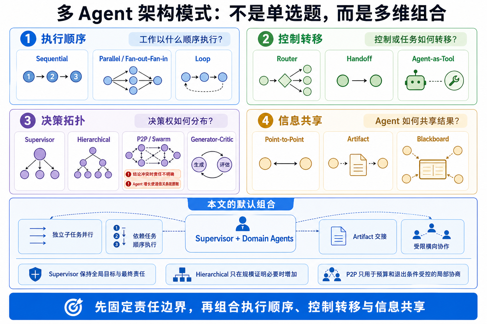

同一个系统可以同时采用多种模式：Supervisor 决定全局责任，Parallel 或 Sequential 决定子任务顺序，Artifact 决定成果如何交接，局部问题再按需要使用 Handoff、Critic 或受限的 Peer 协作。

| 维度 | 常见模式 | 核心特点 | 主要代价 |
| --- | --- | --- | --- |
| 执行顺序 | Sequential | 按固定顺序把上一步输出交给下一步 | 灵活性低 |
| 执行顺序 | Parallel / Fan-out–Fan-in | 独立子任务并行，最后统一汇总 | 冲突综合与瞬时成本 |
| 控制转移 | Router / Handoff | 根据意图把控制权转给一个专业 Agent | 跨领域协作能力有限 |
| 决策拓扑 | Supervisor / Coordinator | 中心 Agent 动态拆分、委派并综合 | 中心瓶颈、上下文和成本 |
| 决策拓扑 | Hierarchical | 多层 Supervisor 递归分解复杂任务 | 调试困难、层级调用多 |
| 决策拓扑 | P2P / Network / Swarm | Peer 自主通信、交接和迭代收敛 | 循环、权限、审计和收敛 |
| 质量控制 | Generator–Critic / Debate | 一个生成，另一个质疑或多方辩论 | 需要可靠退出和 Judge |
| 知识共享 | Blackboard | 多个 Agent 围绕共享状态贡献和读取 | 容易演变成第二套 Memory/Workflow |

Google Cloud 的模式目录同时列出 Sequential、Parallel、Coordinator、Hierarchical 和 Swarm；[OpenAI Agents SDK](https://openai.github.io/openai-agents-python/multi_agent/) 则从 Manager-as-Tool、Handoff、LLM Orchestration 和 Code Orchestration 的角度描述组合方式。两种分类并不冲突，只是观察同一个系统的不同侧面。实际系统也往往把它们组合起来：例如由 Supervisor 掌握目标和最终责任，同时让独立子任务并行执行，必要时允许专家进行有限的横向协作。

> **本文的架构选择**
>
> - 默认使用 **Supervisor + Domain Agents**，先固定全局目标和最终责任；
> - 当单个 Supervisor 无法有效管理任务规模时，再使用 Hierarchical 结构扩展；
> - P2P 只用于边界明确、预算和退出条件受控的局部协商。

这项选择并不排斥 Sequential、Parallel、Handoff、Generator–Critic 或 Blackboard。它只是先固定企业最需要的责任边界，再在边界内部按任务需要组合执行顺序、控制转移和信息共享方式。

确定默认协作骨架以后，下一步才是把第一章的三个问题展开成一套完整的理想平台。

---

### 3. 理想中的企业多 Agent 协作平台

现在先暂时忽略现有代码和工作量。

如果从零设计一个最理想的企业多 Agent 平台，它不应只是一条调用链，而应包含多个相互正交的平面。

#### 3.1 理想架构全景

从上至下，理想平台由体验与治理、持久任务控制、认知协调、专家协作、知识与成果、Agent Runtime 与执行、企业集成七个平面组成；身份授权以及安全、可观测性和预算形成贯穿全部平面的纵向约束。


这张展示图先帮助读者建立整体印象；需要追踪七个平面之间的逻辑关系时，可对照[附录 F：理想架构组件关系](#附录-f理想架构组件关系)。

整个平台包含两条相互配合的主线：

- 控制主线从用户请求进入 Task/Run，由 Supervisor 理解目标、组织专业 Agent，并把需要执行的动作交给 Runtime；
- 成果主线把各 Agent 产生的事实、假设、证据、决策和 Artifact 沉淀到共享知识层，再用于后续协作和最终综合。

这正好回应第一章得到的三个问题：Supervisor 解决协调问题，知识与成果平面解决成果协作问题，Task/Run 与 Runtime 共同解决运行控制问题；身份、权限、安全、预算和可观测性则约束三者如何可靠地协同。

专业 Agent 在统一目标下可以进行有限的横向协作；Runtime 统一承载上下文、通信、工具和执行环境；MCP Gateway 则把这些能力连接到企业数据、业务系统、优化与仿真服务。图中实线表示控制或调用，双向箭头表示协作与交换，虚线表示策略或观测。

这套结构背后有七个重要判断。

##### 第一，用户体验与 Agent 执行不是同一层

浏览器负责呈现和交互，但只能接收经过平台鉴权、裁剪和脱敏的产品数据。Agent 的真实上下文、工具发现、文件系统权限、Runtime 凭据和原始执行协议仍然属于服务端执行边界。

例如，用户需要看到“Data Agent 正在分析订单分布”以及已经生成的图表，却不需要获得执行机器的本地路径、工具凭据或完整模型上下文。把这些内部信息直接透传给浏览器，不仅扩大攻击面，也会让界面开始依赖 Runtime 内部协议，使两层难以独立演进。

##### 第二，任务控制与认知决策不是同一层

复杂任务同时包含两种性质完全不同的不确定性。

**认知不确定性**来自目标理解、证据判断和方案选择，需要模型根据中间结果持续推理；**运行不确定性**来自任务是否已经提交、执行到哪里、审批是否完成以及失败后如何恢复，必须由确定性系统给出唯一答案。

| Task/Run 系统 | Supervisor |
| --- | --- |
| Task 是否已创建，本次 Run 处于什么状态 | 当前目标意味着什么 |
| 是否取消、等待审批或已经结束 | 应该拆成哪些子问题、选择哪些专家 |
| 哪些动作已经发生，失败后能否恢复 | 新证据是否要求调整计划 |
| 保存权限、事件和审计事实 | 比较冲突意见并综合结论 |

例如，Data Agent 发现增长主要来自短期促销后，Supervisor 可以要求 Finance Agent 改用多种增长情景，并让 Network Agent 重跑方案；这类路径调整不应被固定 Workflow 写死。但付费仿真是否已调用、用户是否批准、取消后工具是否仍在运行，不能由 Supervisor 用自然语言记住，必须可靠持久化。

如果两类职责混在一起，就可能出现模型认为任务已经取消而后台仍在执行，或者上下文丢失后重复发起有副作用的操作。反过来，如果把所有判断都写成确定性流程，系统又无法根据新证据改变调查方向。

因此，Supervisor 负责理解、推理、规划和综合；Task/Run 系统负责身份、状态、权限、审批、恢复和审计。认知路径可以动态变化，承载它的运行事实必须始终确定。

##### 第三，Domain Agent 是受约束的专业执行者

理想的 Domain Agent 不只是一个 Prompt，而是一项可治理的专业能力。它至少要说明五组信息：

- **责任**：解决什么业务问题，以什么版本接受治理；
- **能力**：遵循哪些专业指令，可以使用哪些 Skill、Plugin、MCP 和模型；
- **权限**：能读取哪些数据、调用哪些工具，以及允许消耗多少成本；
- **契约**：接受什么输入，产出什么结构化结果和 Artifact；
- **评价**：用什么样例、指标和质量门槛判断它是否可靠。

只有这些边界可以被识别、授权和评价时，“Finance Agent”才代表一项稳定的专业能力，而不只是一个容易随 Prompt 漂移的角色名称。

##### 第四，知识交换不应等于复制聊天记录

Agent 之间真正需要共享的不是全部聊天内容，而是对协作有明确意义的事实、假设、证据、计算结果、Artifact、未决问题以及带有置信度的结论。这些信息需要稳定身份、来源和版本，才能被其他 Agent 复用和复核。

例如，Data Agent 不应只告诉 Finance Agent“华东需求增长较快”，而应发布一份可引用的需求情景成果，说明数据时间范围、促销影响、三种增长假设及计算文件。Finance Agent 随后引用同一成果完成现金流测算；当需求假设更新时，系统也能知道哪些下游结论需要重新计算。

这里所谓的 **Task Knowledge Blackboard**，就是围绕一个任务组织这些显式协作信息的共享空间。它不是把所有聊天复制到公共 Memory，也不是另一套隐式驱动流程的 Workflow 引擎；它的价值是让关键认知成果能够被发现、引用、质疑和追踪。

##### 第五，Agent 的上下文与执行状态由 Runtime 统一管理

Agent 不会在每一步都从零开始。此前的对话、工具结果、子 Agent 回复和记忆共同构成当前上下文，决定了它下一步如何判断和行动；Runtime 必须按照正确顺序持续维护这些信息。

如果平台也保存并驱动一套“当前上下文”和“Agent 状态”，两套状态在中断和恢复时就可能不一致：平台认为子任务已经完成，Runtime 实际仍在等待；或者平台缺少一次工具结果，导致 Agent 重复执行。

因此，Agent 的上下文和真实执行状态由 Runtime 统一管理。平台只保存用于界面展示、审计和检索的事件记录，并且这些记录应当能够从 Runtime 重新构建。

##### 第六，Workspace 是执行授权边界

Workspace 不是某个聊天的临时附件，也不是每个 Run 都必须新建的目录。

它是经过授权、可以独立存在并被多个任务使用的执行环境。平台负责决定某个用户或 Agent 能否进入该环境，以及可以使用哪些资源；Runtime 只能在已经授权的边界内执行。

例如，围绕同一仓网项目的分析任务、复核任务和报告修订可以复用同一个 Workspace，而不必各自复制一套项目数据。Workspace 的创建、共享和回收也不应由一次聊天或一次 Run 隐式决定；具体资源生命周期如何实现，留到现有系统和落地架构分析时再讨论。

##### 第七，安全与可观测性横跨所有平面

企业安全不能依赖“Agent 会自觉遵守 Prompt”。

它必须落实到四类可执行约束：

- **身份与权限**：隔离用户和组织，并对 Agent、Workspace、Tool、MCP 和具体资源实施最小授权；
- **敏感动作**：对数据导出、外部写入、高成本调用等操作设置审批和明确的执行边界；
- **资源预算**：限制 Agent 数量、委派深度、运行时间、Token 和外部服务费用；
- **来源与审计**：记录重要事件以及 Artifact、结论和外部动作的来源，使过程能够追踪和重建。

OWASP 的 [AI Agent Security Cheat Sheet](https://cheatsheetseries.owasp.org/cheatsheets/AI_Agent_Security_Cheat_Sheet.html) 同样强调最小工具权限、敏感操作审批、会话隔离、结构化输出和对多 Agent 调用链的限制。这里的关键不是增加一段安全 Prompt，而是让安全由模型之外的系统边界执行。

---

### 4. 理想 Supervisor：不是“大号 Router”

把问题交给几个专家并不难，难的是第一轮结果回来以后怎么办。

Data Agent 发现订单增长主要来自促销，Network Agent 认为改造干线比新建仓更划算，Finance Agent 的回收期却建立在增长会长期延续的假设上。此时再做一次路由没有意义：系统需要有人回到最初的问题，判断哪些结论仍然成立、还缺什么证据，以及下一步应该让谁重新分析。

这才是 Supervisor 与 Router 的真正区别。Router 完成一次转交，Supervisor 则从问题提出开始，一直跟到结论形成，并随着新证据不断调整中间路径。

#### 4.1 先让所有人回答同一个问题

“是否应该在华东新增区域仓”看起来目标明确，实际上还缺少很多判断条件：企业更看重时效还是成本？只评估新建仓，还是也比较干线改造和前置仓？看未来一年还是三年？能够接受多大的需求风险？

如果这些问题不先说清楚，Network Agent 可能追求最短配送时间，Finance Agent 可能追求最快回收，Risk Agent 又按照最坏情景否决所有方案。每份分析单独看都可能正确，放在一起却无法形成决策。

Supervisor 首先要做的，就是把模糊的业务问题整理成共同的问题框架：比较哪些方案、使用哪些评价标准、遵守哪些约束、最终需要什么证据。这一步通常称为 Goal Framing。它不是提前给出答案，而是让后面的专家知道怎样才算真正回答了问题。

#### 4.2 计划要跟着证据变化

问题明确以后，可以先并行分析订单和现有仓网，再根据需求情景设计候选方案，最后进行财务测算。这里拆分的不是几个部门，而是结论之间的依赖关系：哪些工作可以同时开始，哪些必须等待上一步，哪些只在特定条件成立时才有必要继续。

但第一版计划不会永远正确。如果 Data Agent 发现促销活动扭曲了历史增长，Supervisor 就要增加保守、基准和激进三种情景，并让使用旧预测的网络和财务分析重新计算。所谓 Dynamic Decomposition，并不是一开始把任务拆得足够细，而是在证据变化时知道计划的哪一部分也必须随之改变。

#### 4.3 不是每个子问题都需要一个 Agent

有了任务分解，并不意味着要为每一步都创建 Agent。确定的数据查询和计算可以直接交给工具或受控流程；只有在需要专业判断、独立上下文或明确责任边界时，引入 Domain Agent 才真正有价值。

选择 Agent 时，也不能只看名称。它是否具备所需能力，输出能否被下一步使用，数据和工具是否已经授权，成本和质量是否合适，都比“它叫不叫 Finance Agent”更重要。Supervisor 只能从已经允许使用的候选能力中选择，不能自行扩大权限。

因此，华东仓任务的第一轮也许只需要 Data、Network 和 Finance 三个 Agent；等到出现具体选址和高风险假设后，再引入 Risk Agent。好的协作不是尽可能多地调用 Agent，而是找到当前真正需要的那几个。

#### 4.4 真正的协调发生在结论不一致时

如果 Supervisor 只是把任务发出去，再把返回结果收集起来，它仍然只是一个并行调用器。协调真正开始于不同结果无法直接放在一起的时候。

假设 Data Agent 给出三种需求情景，Network Agent 只在激进情景下验证了新增仓，Finance Agent 却沿用历史平均增长率。表面上，Network Agent 支持建仓，Finance Agent 认为回收期可以接受；实际上两者回答的并不是同一个问题。Supervisor 此时要做的不是投票，而是发现前提不一致，让两个 Agent 使用同一组情景重新计算。

如果重新计算后仍然冲突，就继续判断分歧来自数据、方法、假设还是评价标准。必要时可以要求复算或增加独立验证；如果进一步调查的价值已经不高，也可以保留分歧，并明确降低结论的置信度。Supervisor 判断证据是否足以形成答案，系统则负责强制执行费用、时限和最大 Agent 数等硬约束。

动态调整的意义也正在这里：不是频繁改写计划，而是让新证据真正改变下一步工作和已有结论。

#### 4.5 最后必须有人把答案收拢起来

多份专业报告不会自动变成一个企业决策。Supervisor 需要说明推荐什么、为什么不选择其他方案、结论依赖哪些条件、还有哪些风险没有解决，而不是简单拼接报告或采用多数意见。

华东仓的最终建议可能是：“先改造现有干线；如果剔除促销后的自然增长连续两个季度超过阈值，并且候选选址通过合规审查，再启动新仓建设。”这不是一个简单的“建”或“不建”，但它把数据、方案和风险收拢成了可以执行和复核的条件性结论。

Supervisor 对这种答案的完整性负责：不能隐藏冲突，也不能把未经判断的几份报告直接交给用户。但它不取代企业决策者。最终商业选择仍由被授权的人作出，平台负责权限、审批和审计。

由此可以看出，Supervisor 不是位于调用链顶端的“大号 Router”，而是始终维护目标、证据和最终结论的协调者。

不过，要让它真正做到这一点，各 Agent 的成果就不能只存在于零散聊天和点对点消息里。事实、假设、证据和 Artifact 需要一种稳定的共享方式，这正是 Blackboard 思想最有吸引力的地方。

---

### 5. 理想 Blackboard：为什么诱人

第四章中，Supervisor 要求 Network Agent 和 Finance Agent 使用同一组需求情景重新计算。这个动作看起来简单，却马上产生一个实际问题：这组情景应该怎样交给它们？

如果 Agent 只通过点对点消息协作，Data Agent 就要分别发送两份结果。后来它发现促销数据处理有误，又要通知每一个下游 Agent 替换旧版本。新的 Risk Agent 中途加入时，不知道此前用过哪些假设；Supervisor 想检查财务结论时，还要重新翻阅多段聊天，才能确认它引用的究竟是哪一次预测。

问题不在于消息发不出去，而在于同一项成果被复制以后，很快失去了唯一身份、来源和版本。复杂任务需要一个所有参与者都可以按权限访问的共享空间：一项事实或分析结果只发布一次，其他 Agent 引用它；发生修订时保留新旧版本，并且能够看出哪些下游结论受到影响。

这正是 Blackboard 架构吸引人的地方。它借用了团队围绕一块公共黑板解决问题的思路：不同专家把自己掌握的局部结果写到黑板上，也读取其他人的进展；一个协调角色观察当前状态，决定接下来还缺什么知识、应该请谁继续工作。

经典 Blackboard 系统通常包含 Knowledge Source、共享 Blackboard 和 Control/Scheduler。这一思想可以追溯到 Hearsay-II 等系统，参见 [The Hearsay-II Speech-Understanding System](https://www.ijcai.org/Proceedings/77-2/Papers/055.pdf)。映射到企业多 Agent 场景，可以得到：

| Blackboard 概念 | 企业 Agent 映射 |
| --- | --- |
| Knowledge Source | Domain Agent |
| Blackboard | 任务中的事实、假设、分析结论、问题和 Artifact 引用 |
| Control | Supervisor |
| Partial solution | 尚未收敛的方案和阶段性结论 |
| Trigger | 新证据、冲突、缺口或状态变化 |

回到华东仓任务，Data Agent 可以发布一项“需求情景”，说明数据范围、促销处理方式、三种增长假设，并关联保存计算结果的 Artifact。Network Agent 和 Finance Agent 不再复制这份数据，而是在各自结论中引用同一个版本。如果情景后来修订，旧结论不会被隐式覆盖，Supervisor 可以看到哪些分析仍然依赖旧版本，并决定是否重算。

这样的共享空间会让协作发生几个根本变化：

- 新加入的 Agent 可以先读取已经确认的事实、假设和未决问题，而不是重放全部聊天；
- 两个相互冲突的结论可以同时保留，各自指向不同的证据和方法；
- Supervisor 能够看到证据缺口，以及某次修订可能影响哪些下游成果；
- 最终报告可以从结论追溯到假设、计算结果和原始来源。

大型文件、数据集和报告仍然作为 Artifact 保存；Blackboard 记录的是它们在当前决策中的含义、来源和关系。它也不必保存 Agent 的全部讨论，只需要沉淀后续协作确实要引用的显式成果。

理想状态下，这已经很接近一个围绕企业任务逐步形成认知的公共工作空间，也难怪 Blackboard 容易被进一步想象成“企业认知操作系统”。

但它的吸引力和危险来自同一个地方：几乎所有东西看起来都可以放进这块黑板。如果它开始保存完整对话和模型上下文，就会变成第二套 Memory；如果每条记录都能自动触发 Agent、重试和恢复，就会变成 Workflow Engine；如果它还管理 Agent 的运行状态，又会成为第二套 Runtime。

因此，Blackboard 的边界需要先说清楚：它只保存 Agent 之间需要共享的业务成果。模型实际看过哪些对话和工具结果、上下文如何压缩和恢复，以及 Agent 当前处于运行、完成还是失败状态，都由 Runtime 管理；任务是否排队、重试、超时或恢复，则由 Task/Run 控制系统管理。如果 Blackboard 再保存并驱动这些状态，系统中就会出现两份相互竞争的“当前真相”。下一章讨论的，正是理想架构中这些看似自然、实际上会造成重复建设的边界。

---

## 第二部分：为什么不能直接照搬理想架构

### 6. 理想图的隐藏成本

理想架构回答了“企业最终需要哪些能力”，却还没有回答“这些能力应该由谁实现”。如果把图中的每个方框都直接建设成一个新服务，最容易被低估的成本不是代码量，而是同一个事实开始出现多个所有者。

> **本章的核心判断**
>
> 一个组件可以读取、投影和使用其他组件的状态，但不能因此成为同一事实的第二个权威来源。

#### 6.1 第二套 Agent Runtime

为了在平台界面中展示多 Agent 进度，一个很自然的设计是增加 Agent Instance Manager，保存父子关系、消息、状态、取消和恢复。但这些信息彼此关联，共同构成 Agent 的真实执行生命周期。

如果底层 Agent Runtime 也管理同一生命周期，就可能出现：

| 同一事实 | 平台记录 | Runtime 实际状态 | 后果 |
| --- | --- | --- | --- |
| 子 Agent 状态 | `running` | 已经 `failed` | 界面继续等待，恢复路径错误 |
| 取消结果 | 已标记 `cancelled` | Tool Call 仍在执行 | 外部费用或副作用继续产生 |
| 父子关系 | 子任务已经重建 | 原 Agent 仍然存在 | 重复执行和重复成果 |

增加同步频率、缓存失效或重试只能缩短不一致持续的时间，不能消除两个系统都认为自己可以驱动状态的问题。平台可以保存用于界面和审计的 Agent 执行轨迹，但真实的 Agent 创建、通信和终止必须只有一个 Runtime 所有者。

#### 6.2 第二套 Thread Memory

Blackboard 需要保存“需求增长假设是什么”“财务结论引用了哪份预测”，但这不等于它应该保存模型实际看过的全部内容。

| Blackboard 可以保存 | 不应复制的 Runtime 语义 |
| --- | --- |
| 事实、假设和阶段性结论 | 完整对话与 Tool 结果顺序 |
| Artifact 引用和证据关系 | 下一轮模型上下文 |
| 冲突、未决问题和决策记录 | 上下文压缩摘要与模型 Memory |

如果平台另外维护一份“模型当前知道什么”，Thread 恢复后就可能出现两个不同上下文：Runtime 已经压缩或加入了新的 Tool 结果，平台却仍在注入旧摘要。除了重复持久化敏感内容，平台还可能绕过 Runtime 原有的上下文与能力发现路径，以及系统既有的授权边界。

> **边界：** Blackboard 记录可共享的业务认知；模型可见上下文、压缩和 Memory 仍由 Runtime 管理。

#### 6.3 第二套 Workflow Engine

理想 Blackboard 中，“新证据出现后自动重新分析”很有吸引力。但只要一条记录能够直接驱动执行，系统就必须继续回答整条生命周期：

```text
记录变化
-> 判断是否触发
-> 去重与排队
-> 分配执行
-> 超时、重试或取消
-> 失败恢复与副作用补偿
```

这时 Blackboard 已经不只是共享知识，而是在承担 Workflow Engine 的职责。尤其当两个 Agent 互相更新记录时，如果没有幂等、预算和退出条件，系统很容易进入循环。

Temporal 的 [Workflow 文档](https://docs.temporal.io/workflows) 说明了 durable workflow 所需的确定性重放与事件历史；外部 API、数据库和文件 I/O 通常需要隔离为 Activities。本文引用它不是为了建议立即引入 Temporal，而是为了说明：**可靠工作流远不只是一个状态字段和重试按钮。**

Supervisor 可以根据新证据判断“是否值得重新分析”；任务是否已经排队、能否重试以及失败后如何恢复，仍应由确定性执行控制负责。

#### 6.4 第二套能力发现

企业需要知道“允许使用哪些 Agent 和工具”，但治理目录中的允许不等于 Runtime 此刻真的能够执行。

| 治理层看到的状态 | Runtime 可能出现的事实 |
| --- | --- |
| Agent Definition 已发布 | 对应 Runtime Role 当前不可发现 |
| MCP 被允许使用 | 当前 Profile 未启用或启动失败 |
| Tool 已登记 | 实际 Schema 已变化或依赖不可用 |

如果浏览器或平台根据自己的扫描结果直接告诉模型“你具备这些能力”，就会产生能力幻觉。治理目录可以拥有业务名称、维护者、风险等级、权限和评价信息；当前可执行能力则必须来自 Runtime 的正式发现和类型化协议。

#### 6.5 第二套 Workspace 语义

“Task Workspace”听起来像一个方便的统一容器，却可能同时表示执行目录、共享文件和 Agent 的认知状态。三者一旦共用名称，就很容易被错误地赋予同一个生命周期，例如任务结束时同时删除代码目录、分析成果和决策记录。

目标语义必须拆开：

| 概念 | 它实际表示什么 | 生命周期 |
| --- | --- | --- |
| `Workspace` | 经过授权的执行根 | 独立于 Task、Run 和 Thread 存在 |
| `Artifact` | 文件、数据、图表或报告等持久成果 | 拥有独立身份、授权和保留策略 |
| `Task Knowledge Ledger` | 可选的结构化业务协作记录 | 随真实协作需求逐步建设 |

这里得到的是目标所有权边界，并不代表当前代码已经完成这些迁移。现状和缺口要到下一部分通过项目代码与能力基线确认。

---

### 7. 第一轮收敛：理想能力保留，重复所有权删除

发现隐藏成本并不意味着理想架构应该被推翻。Supervisor、专业 Agent、运行控制和知识沉淀仍然是企业需要的产品能力；需要删除的是对同一生命周期的重复实现。

> **状态说明：** 下表表达的是架构所有权结论和目标方向，不是当前代码能力清单。第三部分才会逐项检查哪些能力已经存在、哪些仍是缺口。

| 理想能力 | 是否保留 | 收敛后的承载方式 |
| --- | --- | --- |
| Supervisor | 保留 | 作为目标理解、动态分工和最终综合的统一责任 |
| Domain Agents | 保留 | 作为具有专业能力和权限边界的执行单元 |
| Dynamic Planning | 保留 | Supervisor 推理，不新增独立 Planner 服务 |
| Agent Registry | 保留但拆分 | Agent Governance Catalog（下文简称 **Agent Catalog**）与 Runtime `AgentRegistry` 分属不同责任 |
| Task Runtime | 拆分 | **Task/Run Control Plane（任务运行控制面，后文简称 Task/Run Control）** 与 Agent 执行 Runtime 分离 |
| Agent Instance Manager | 不在平台重复建设 | 由唯一的 Agent Runtime 统一管理 |
| Shared Workspace | 拆分 | Workspace、Artifact、Task Knowledge Ledger 三个概念 |
| Task Knowledge Blackboard | 延后、收窄 | Artifact First，成熟后增加 Task Knowledge Ledger |
| Tool/Skill/MCP Registry | 不在业务平台复制 | 由 Agent Runtime 发现，平台只做授权与安全投影 |
| Decision Memory | 分层 | Runtime Memory 与平台业务决策记录分别拥有 |
| Peer Agent Network | 默认不建设 | 有明确必要性时才作为受限模式 |

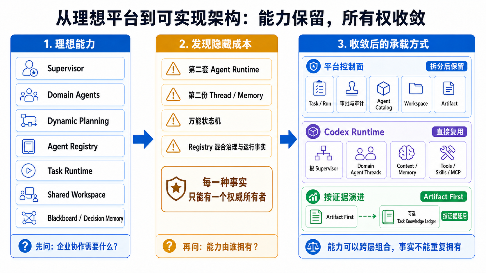

这次变化不是削减多 Agent 能力，而是把“需要什么能力”和“谁拥有相应事实”分开回答：协调、专业执行和动态规划继续存在，重复的 Runtime、Memory 和万能状态机不再进入目标架构。

这次收敛也重新回答了第一章的三个问题：

- **协调问题**仍由 Supervisor 负责，但 Agent 的真实创建和执行不因此转移到平台；
- **成果协作问题**先由有类型的结果和 Artifact 解决，结构化 Ledger 按真实需求增加；
- **运行控制问题**拆成确定性 Task/Run Control 与唯一的 Agent Runtime，避免一套“大状态机”同时拥有所有状态。

背后的原则可以压缩为一句话：

> 产品能力可以跨层组合，但每一种事实只能有一个权威所有者。

到这里，我们只确定了责任应该怎样划分，仍然没有证明当前项目拥有哪些能力。下一步才进入工程事实：先把这些责任翻译成对 Agent Runtime 的能力要求，再判断代码中是否已经存在可以复用的基础。

---

## 第三部分：寻找可以复用的工程基础

前两部分已经确定了理想能力和责任边界，接下来需要把它们放回当前工程中检验。本部分依次回答三个问题：

1. Codex 是否已经具备我们需要的多 Agent Runtime；
2. Open Web Codex 是否已经具备承接 Runtime 的平台控制面；
3. 哪些能力可以进入近期建设，哪些仍然只是代码基础或目标设计。

这三个问题不能混在一起。Runtime 机制存在，不代表 Web 产品已经可用；平台有数据库和页面，也不代表它拥有模型上下文或 Agent 生命周期。

> **本部分的证据范围**
>
> 知识图谱基于 `main@107f3f187905`；分支上新增的 Artifact、Agent 设置等能力，以 `codex/agent-architecture-features@8b8bb27712ed` 的源码和项目权威文档重新核实。下文会把 **main 基线**、**分支已验证能力**、**目标设计** 和 **待验证缺口** 分开描述。Codex 的公开行为同时参考官方 [Subagents 文档](https://learn.chatgpt.com/docs/agent-configuration/subagents.md)；当前产品能力及缺口以 [`architecture.md`](architecture.md)、[`capability-baseline.md`](capability-baseline.md) 和 [`development-plan.md`](development-plan.md) 为准。源码中存在某个类型或方法，只能证明机制存在，不能自动证明产品链路已经完成。

### 8. 多 Agent Runtime 的能力要求与复用判断

对候选 Runtime 的判断不能从“现有代码里有什么”出发，而要先明确理想架构要求它承担哪些责任，再用同一组标准检查现有实现。

#### 8.1 Agent Runtime 的能力边界与复用标准

Supervisor 可以理解目标、拆分任务和选择专家，但它作出的决定仍需要一个执行环境来落实。这个执行环境必须让 Agent 在多轮交互中持续存在，能够调用工具、创建子 Agent、交换消息，并在上下文增长或进程重启后继续工作。

| 协作中的问题 | Runtime 必须承担的责任 |
| --- | --- |
| “刚才做到哪里了？” | 保存 Thread、Turn、Item 和模型可见上下文 |
| “让另一个专家并行调查” | 创建独立子 Agent，并记录父子关系 |
| “给正在工作的专家补充信息” | 路由消息、追加任务或中断执行 |
| “不同专家为什么具备不同能力？” | 加载角色配置，并发现 Tool、Skill、Plugin 和 MCP |
| “上下文过长或进程重启怎么办？” | 处理压缩、持久历史、恢复和运行限制 |

在逐项检查具体能力时，还要同时使用三项横向标准：

1. **生命周期完整**：Agent 从创建、运行、通信到结束或中断，都有稳定身份和明确状态；
2. **执行事实统一**：上下文、Tool 调用、父子关系和恢复由同一套运行机制维护；
3. **边界可以治理**：平台能够授权、审计和展示，但不需要模拟 Runtime 内部行为。

如果现有基础无法满足这些要求，平台就必须补建 Runtime；反之，如果这些能力已经存在，再建立一套 Agent 实例模型和执行状态机，只会制造重复所有权。

Open Web Codex 已经集成了 Codex Runtime，因此它是最直接的候选，但“项目中已经包含 Codex”本身不是复用理由。下面分别检查它的会话连续性、Agent 执行树、协作协议和角色配置。

#### 8.2 执行上下文与会话连续性

多 Agent 协作首先要求每个 Agent 都有连续的执行上下文。否则所谓子 Agent 只是一次临时模型请求：它无法可靠记住已经使用过哪些资料、调用过哪些工具，也无法在收到追加任务时从原来的位置继续。

Codex 将这组连续状态组织为 Thread、Turn 和 Item：

| 概念 | 在执行中的作用 |
| --- | --- |
| Thread | 一个 Agent 持续工作的会话边界 |
| Turn | Thread 中由一次输入触发的一轮执行 |
| Item | 一轮执行中的消息、推理、Tool 调用及结果等记录 |

当前代码中，[`CodexThread`](../codex/codex-rs/core/src/codex_thread.rs) 承载一个 Thread 的实际执行会话，[`ThreadManager`](../codex/codex-rs/core/src/thread_manager.rs) 负责新建、恢复和派生 Thread；上下文整理与压缩也由 Runtime 内部的 [`context_manager`](../codex/codex-rs/core/src/context_manager) 和 [`compact`](../codex/codex-rs/core/src/compact.rs) 处理。

这说明模型可见的执行历史不是一段普通聊天记录，而是一组只有 Runtime 能完整解释的状态。Thread 中哪些内容进入模型上下文、Tool 结果如何关联、何时发生压缩，都应保持同一个所有者。

对多 Agent 架构而言，这一机制还有一个直接含义：

> 子 Agent 必须拥有独立 Thread，父 Thread 负责发起委派并接收协作结果；子 Agent 的上下文不能被简化为父 Thread 中的一段临时状态。

Codex 官方文档同样将子 Agent 定义为拥有独立 Agent Thread 的真实执行单元。接下来需要验证的是，这些独立 Thread 如何形成一组可控制的协作关系。

#### 8.3 Agent 执行树与运行状态

假设主 Agent 同时委派三个专家，Runtime 不仅要创建三个 Thread，还必须知道它们属于哪次协作、由谁派生、消息应该送给谁，以及当前是否还能继续运行。这些关系不能只存在于 Supervisor 的自然语言计划中。

Codex 使用 [`AgentControl`](../codex/codex-rs/core/src/agent/control.rs) 和
[`AgentRegistry`](../codex/codex-rs/core/src/agent/registry.rs) 共同维护这棵执行树：

- 根 Thread（Root Thread）与其派生的子 Agent 共享同一个 `AgentControl`；
- spawn 创建的是具有父子关系的独立 Agent Thread，而不是根 Thread 内的一段嵌套状态；
- `AgentRegistry` 维护 Thread ID、`AgentPath`、昵称和角色等运行身份；
- Runtime 同时处理可执行 Agent 数量、运行配额和树内消息；
- 子 Agent 还可以继续派生下一层 Agent，由 `AgentPath` 表达其在整棵树中的位置。

```text
根 Agent Thread
  ├─ 代码分析 Agent Thread
  ├─ 风险评估 Agent Thread
  └─ 资料整理 Agent Thread
       └─ 外部资料核验 Agent Thread
```

由此可以确定，Agent Thread 的身份、父子关系和运行状态已经由 Runtime 统一维护。Supervisor 负责决定“是否需要增加专家”，Runtime 则负责真实创建、约束和管理这些 Agent Thread。

#### 8.4 多 Agent 协作协议

Agent 执行树解决了“谁在参与”，还需要解决“它们如何协作”。对模型而言，创建专家、补充信息、等待结果和中断工作不能只是自然语言约定，而应当是输入输出明确的 Runtime 操作。

[`multi_agents_spec.rs`](../codex/codex-rs/core/src/tools/handlers/multi_agents_spec.rs) 和
[`multi_agents_v2`](../codex/codex-rs/core/src/tools/handlers/multi_agents_v2) 将这些动作定义为模型可见的 Tool：

| 协作动作 | Runtime 语义 |
| --- | --- |
| `spawn_agent` | 创建一个拥有独立 Thread 的子 Agent |
| `send_message` | 投递消息，但不主动开启目标 Agent 的新一轮执行 |
| `followup_task` | 追加任务，并唤醒目标 Agent 继续执行 |
| `wait_agent` | 等待 Agent 状态变化或结果返回 |
| `list_agents` | 查看当前 Agent 执行树中的成员和状态 |
| `interrupt_agent` | 中断目标 Agent 当前正在进行的工作 |

其中，[`spawn.rs`](../codex/codex-rs/core/src/tools/handlers/multi_agents_v2/spawn.rs) 会基于父 Turn 构造子 Agent 配置，应用角色、环境和当前运行约束，再建立 `AgentPath` 与父 Thread 关系；[`message_tool.rs`](../codex/codex-rs/core/src/tools/handlers/multi_agents_v2/message_tool.rs) 则明确区分“只投递消息”和“触发下一轮执行”。

```text
模型决定委派
  -> 调用 spawn_agent
  -> Runtime 创建独立子 Thread
  -> AgentControl 将其纳入执行树
  -> 消息、等待和中断继续通过正式 Tool 完成
```

因此，子 Agent 必须通过 Codex Runtime 的正式 spawn 机制创建。只有这条路径才能同时建立独立 Thread、父子关系、运行配置和后续协作语义。

#### 8.5 Runtime Role 与调度职责分离

不同专家需要不同模型、指令、Skill、MCP 或 sandbox 配置，但“专家怎样执行”与“现在应该选择哪个专家”是两个问题。

Codex 将这种配置称为 **Agent Role**；为了与企业 Agent Definition 区分，本文架构层统一称为 **Runtime Role**。[`role.rs`](../codex/codex-rs/core/src/agent/role.rs) 在 spawn 时把选定角色作为配置层应用到子 Agent，却不决定何时委派，也不决定业务上应该选择谁；协调决策仍由模型和多 Agent Tool Handler 完成。

当前代码包含 `default`、`explorer` 和 `worker` 三种内置角色；Codex 官方机制也允许在项目的 `.codex/agents/` 或 Profile 的 `~/.codex/agents/` 下定义自定义 Agent。项目级定义可以随代码一起评审和演进，Profile 级定义则适合个人或隔离环境中的配置。

Runtime Role 只是执行配置的一种来源；一个 Tool、Skill、Plugin 或 MCP 是否真正可用，仍由 Codex Runtime 的正式发现和执行机制决定。平台不能根据角色名称或文件内容自行拼装一套替代能力目录。

企业 Domain Agent 进入 Runtime 的路径是：Agent Definition 先经过治理、评审与发布，再映射到 Codex 可发现的 Runtime Role；`spawn_agent` 选择该角色后，才产生真正执行的子 Agent Thread。

这条链路包含三个生命周期不同的对象：

| 层次 | 负责的事实 | 生命周期 |
| --- | --- | --- |
| 企业 Agent Definition | 所有者、版本、适用范围、合规、评价和发布状态 | 作为企业治理记录长期存在 |
| Runtime Role | spawn 时使用的模型、指令、Skill、MCP 和 sandbox 等配置 | 随项目或 Profile 配置进行版本演进 |
| Agent Thread 实例 | 本次协作中实际创建的 Thread、`AgentPath`、父子关系和运行状态 | 随一次具体协作创建、运行和结束 |

#### 8.6 Codex Runtime 的适配性结论

经过上述对照，Codex 与理想架构所需 Runtime 的匹配关系可以归纳如下：

| 所需能力 | Codex 中的实现基础 | 复用判断 |
| --- | --- | --- |
| 执行上下文与会话连续性 | Thread、Turn、Item、历史恢复和 compaction | 由 Codex 继续拥有 |
| Agent 执行树 | 独立子 Thread、`AgentControl`、`AgentRegistry`、`AgentPath` | 不建设第二套 Agent 生命周期 |
| 正式协作动作 | spawn、消息、追加任务、等待和中断 Tool | 通过 Runtime 正式协议接入 |
| 专家角色与能力配置 | 内置和自定义 Runtime Role，以及 Runtime 能力发现机制 | 企业治理映射到 Codex 配置 |

回到 8.1 的三项标准：

- **生命周期完整性**：Thread、Agent 执行树、消息和中断已经处于同一套 Runtime 生命周期中；
- **执行事实统一性**：上下文、父子关系、Runtime Role 和 Tool 执行都由 Codex 解释；
- **平台治理边界**：Codex 提供正式 Thread、Tool 和事件机制，平台应在边界外负责授权、可靠控制和安全投影。

因此可以形成明确的架构结论：

> Codex 已经覆盖多 Agent Runtime 的核心职责。Open Web Codex 不应再建设第二套 Agent 生命周期、上下文或协作协议。

这仍然只是复用判断，不是产品发布结论。下一章继续检查：当前平台是否已经具备承接这套 Runtime 的工程骨架。

---

### 9. 平台控制面的现有基础与所有权缺口

复用 Codex 解决了 Agent 如何执行，却没有解决谁可以使用 Runtime、一次任务如何可靠启动、浏览器如何安全观察过程，以及成果如何长期保存。

这些是企业平台必须承担的责任，但它们应该围绕 Runtime 建设，而不是进入 Runtime 内部重新实现一遍。当前 Open Web Codex 已经形成了几块可以继续演进的控制面骨架，接下来需要判断它们分别解决了什么，哪些所有权边界已经成立，以及哪些能力仍然存在缺口。

#### 9.1 Profile 生命周期与 Runtime 宿主

Codex 的持久 Thread 历史、用户配置、Memory，以及 Profile 级的 Skill、Plugin、MCP 和 Provider 状态，都以 `CODEX_HOME` 为持久范围。如果每次 Run 都临时创建一份，这些状态就无法稳定延续；如果多个用户共享同一份，又会产生严重的隔离问题。

当前代码中的 [`ProfileHost`](../apps/web/crates/profile-host/src/lib.rs) 负责持有**一个 Profile 的持久 `CODEX_HOME`、一个原生 app-server 进程以及与它的协议连接**。它还记录进程实例身份、能力协商结果、活动 Turn 和尚未完成的 Server Request。这样做的直接价值是：更新凭据或重启进程时，平台能够判断 Runtime 是否仍在忙，而不是在一轮执行中途直接替换进程。

这里也必须区分当前实现和目标架构：

| 范围 | 结论 |
| --- | --- |
| 当前已实现 | `ProfileHost` 能安全托管一个持久 Profile，并验证 app-server 返回的 `CODEX_HOME` 和能力清单 |
| 当前部署收口 | 平台服务端仍组合一个预先配置的 Profile，先服务一个隐式本地 Owner |
| 多用户目标 | 根据已认证用户动态路由到各自 Profile 与进程，并完成并发隔离验证 |

因此，“每个用户拥有独立 Profile”是正确的目标所有权；但不能把它写成当前已经完成的多用户能力。[`capability-baseline.md`](capability-baseline.md) 仍明确记录：动态多 Profile 进程路由尚未完成。

#### 9.2 Task/Run 的可靠执行控制

Agent 可以用概率性的方式思考，但平台不能用概率性的方式判断一个任务是否已经启动两次、是否已经取消，或某个 worker 是否仍拥有执行权。

当前的 [`RunOrchestrator`](../apps/web/crates/run-orchestrator/src/lib.rs) 正在处理这类确定性问题。它使用幂等键避免重复创建 Run，使用 lease、heartbeat 和过期恢复协调 worker，并处理取消、失败、恢复和清理。

这里的 **lease** 可以理解为一张有有效期的执行凭证：取得凭证的 worker 暂时拥有这个 Run；它必须持续发送 heartbeat 证明自己仍然存活。凭证过期后，平台才能安全地把 Run 交给恢复流程，从而避免两个 worker 同时认为自己是执行者。

| Task/Run Control 应该拥有 | Task/Run Control 不应该拥有 |
| --- | --- |
| 幂等创建、排队和执行尝试 | Supervisor 的任务理解与计划 |
| lease、heartbeat、cancel、timeout | 子 Agent 的父子关系和消息 |
| 失败分类、恢复入口和审计结果 | 模型上下文、Tool 选择和压缩 |
| Workspace 授权检查与交付流程 | Codex 内部的 Agent 恢复语义 |

这也说明，原先容易被称作 `Task Runtime Service` 的组件，更准确的定位是 **Task/Run Control**：它保证一次执行尝试可靠发生，却不负责替 Agent 思考。

Workspace 在这里是经过授权的独立执行根。它先由明确的 Workspace 操作创建和授权，Run 入队时只选择 `workspace_id`；Workspace 的保留和删除由自身生命周期管理，不由某次 Run 的取消、失败、租约过期或恢复决定。这样，同一 Workspace 可以承载多个前后相继的 Thread/Run，而不会因为一次调度失败就丢失工作目录。

这里仍需保留证据边界：独立所有权和接口已经落地，但共享 Workspace 的并发冲突策略、进程崩溃后的创建恢复，以及真实 Codex multi-`cwd` 行为还没有完成发布级验证。它们属于 Workspace 并发、恢复和 Runtime 集成问题，不能交给 Run 生命周期代为处理。

#### 9.3 Runtime 适配与 Workspace 授权边界

平台与 Codex 使用不同语言：平台认识用户、组织和已授权 Workspace；Codex app-server 认识 Thread、Turn、协议请求和 `cwd`。两边需要一个翻译层，但这个翻译层越宽，越容易逐渐变成第二个 Runtime。

[`RealCodexAdapter`](../apps/web/crates/codex-adapter/src/real.rs) 当前做了几件关键的事：

- 接收平台已经解析出的 `AuthorizedWorkspace`，而不是相信浏览器传来的本地路径；
- 将路径规范化，并确认它位于 Profile Host 允许的执行根内；
- 在 `thread/start`、`thread/resume` 等正式请求中传递 `cwd`；
- 记录当前进程内的 Thread 与 Workspace 绑定，拒绝把同一 Thread 隐式切到另一个未授权目录；
- 直接连接 `ProfileHost`，不再增加另一个本地 Gateway。

这类 Adapter 应保持“窄”：内部可以理解 Codex 的生成协议，外部只暴露稳定、有限的平台操作。它不应把 raw JSON-RPC 透传给浏览器，也不应通过 Prompt 注入模拟 Tool、Skill 或 Agent 能力。

这里的证据边界是：当前代码已经有路径包含检查和 Thread 绑定，但 `Profile multi-workspace` 的所有权与并发行为仍未完成真实验证。因此这些保护是正确方向，还不足以证明多 Workspace 能力已经达到发布标准。

#### 9.4 Runtime 事件投影与浏览器读模型

Runtime 事件通常细、快，而且包含浏览器不应该看到的内部字段。浏览器需要的是经过授权、可以重连恢复、结构稳定的消息和状态。平台因此需要一份 **projection**：它是从权威事件整理出的读取视图，而不是另一份原始历史。

[`event_projection.rs`](../apps/web/server/src/event_projection.rs) 已经把 Codex 事件归一化为版本化 Run Event，关联 Thread、Turn 和 Item，并在事务中更新 Run 状态、注册 Inline Artifact。平台服务端还遵循“先持久化，再广播”的顺序，使断线后的浏览器可以从数据库补回遗漏事件，而不只依赖内存中的实时消息。

这套设计只有一个方向：Codex 权威历史先由平台归一化并持久化，再形成供浏览器读取、重连和审计的视图。

而不能倒过来让数据库投影冒充 Codex Thread。平台可以根据 Runtime 历史重建展示，但不能根据一条简化后的 UI 事件恢复模型上下文；被投影省略的 Tool 输入、上下文边界或压缩语义，只有 Codex 才完整理解。

#### 9.5 Artifact 交付链路与持久化边界

Agent 最终交付的不只是文字，也可能是地图、报告、数据集或其他可交互成果。它们需要独立的身份、授权和保留策略，不能只作为某条消息里的一段临时 JSON。

当前项目已经打通一条真实的 Inline Visualization 纵向链路：

1. MCP Tool 返回经过 schema 验证的 Artifact Envelope；
2. 平台根据 renderer 类型登记 Artifact，并保存生产它的 Turn/Item 来源；
3. 内部 MCP Resource 被替换成浏览器可访问的授权 URL；
4. Assistant Message 决定 Artifact 在回复中的展示位置；
5. 浏览器刷新后仍从同一类型化投影恢复渲染。

这证明“Runtime 产生成果、平台授权登记、浏览器安全渲染”的分工是可行的。但 [`capability-baseline.md`](capability-baseline.md) 同时记录了当前限制：

| 已经可用 | 仍需迁移 |
| --- | --- |
| 类型化 Envelope 与 renderer 注册 | 独立于 Run/Thread 的持久 Artifact ID |
| producer Turn/Item 来源记录 | Artifact 自身的授权与保留策略 |
| 同一 Run/Thread 内的引用和恢复 | 跨 Run、跨 Thread 的授权复用 |
| 授权 Resource URL 与浏览器渲染 | Workspace 或生产 Run 结束后的稳定解析 |

> **Artifact 拥有自己的身份与生命周期；Run、Thread、Turn 和 Item 只记录它从哪里产生。**

换句话说，生产者是来源证明，不是成果的所有者。未来一个有权限的任务能否读取 Artifact，应由 Artifact 自身的授权决定，而不是由生产它的 Run 是否仍然存在决定。

综合来看，当前平台不需要从零建设新的控制面：Profile 宿主、独立 Workspace、Run 调度、Runtime 适配、事件投影和 Artifact 纵向链路都已经存在。真正的工作集中在几项明确演进上：从单 Profile 组合走向授权路由，补齐现有执行根登记与共享 Workspace 的并发验证，从 Run/Thread 作用域 Artifact 走向持久身份，并验证真实的多 Agent 执行轨迹。

---

### 10. 能力基线与阶段性建设边界

第 8 章证明了 Codex Runtime 可以复用，第 9 章证明了平台控制面已有骨架；但不同能力的成熟度并不一致。能力基线要回答的不是“代码里有没有”，而是“现在能够对产品承诺到什么程度”。

本章使用五种证据口径：

| 口径 | 含义 |
| --- | --- |
| **代码已确认** | 当前实现足以确认所有权和主要机制 |
| **真实链路已验证** | 代码之外，真实 Runtime 或浏览器链路验证已通过 |
| **部分可用或实验性** | 路径存在，但仍有明确发布门 |
| **声明存在、行为未验证** | 协议或能力清单已经声明，关键行为尚未经过真实验证 |
| **未支持或目标缺口** | 尚无稳定、安全的平台合同，或仍属于待迁移目标 |

根据当前 [`capability-baseline.md`](capability-baseline.md)，与多 Agent 平台最相关的事实是：

| 能力 | 当前证据 | 仍不能声称什么 | 对架构的约束 |
| --- | --- | --- | --- |
| Codex 多 Agent 核心机制 | **代码已确认**：Agent 执行树、角色、消息、等待和中断属于 Runtime | Web 端完整多 Agent 体验已经可发布 | 复用 Runtime，不建设第二套 Agent 生命周期 |
| Multi-agent Trajectory | **实验性**：已有父子与协作事件 | 真实 Agent 执行轨迹、重连和隔离已经通过链路验证 | 先补 fixture 与真实端到端验证 |
| Profile Agent 设置 | **分支已实现的过渡能力**：Web 可以创建、更新和删除平台托管的 Profile Agent 配置文件 | 已经具备企业 Agent Catalog、发布治理或原生 app-server CRUD | 明确其过渡边界，不能让文件编辑路径成为企业发布事实源 |
| Native Agent CRUD | **未支持**：没有稳定的 app-server CRUD/validation 合同 | Agent Studio 已经可以通过 Runtime 原生合同管理 Agent | Catalog 先做治理和发布映射，再决定现有设置入口如何迁移 |
| Skills | **部分可用**：已验证选定能力根能够注入新 Thread | Profile 级发现、写入、验证和隔离测试已经完整可用 | 通过 Codex 正式机制演进，不在 Web 端复制发现逻辑 |
| Plugins | **未支持**：平台合同尚未建立 | 安装、升级、权限和卸载生命周期已经可用 | 暂不开放完整 Plugin Studio |
| Tools discovery | **未支持**：平台没有稳定的发现合同 | 平台已经拥有权威 Tool Catalog | 不建设 fallback 目录，不从显示文本猜能力 |
| Profile multi-workspace | **声明存在、行为未验证**：Manifest 已有相关限制 | 所有权、并发和隔离行为已经通过验证 | 发布验证必须覆盖共享、越权、恢复和并发 |
| Profile 多用户路由 | **目标缺口**：当前仍为单 Profile 组合 | 每个认证用户已经动态路由到独立进程 | 多用户 Beta 前完成进程路由与隔离矩阵 |
| Inline Artifact | **真实链路已验证**：登记、授权 URL、展示和刷新恢复可用 | 已有独立身份、跨 Run 授权和保留策略 | 保留现有纵向链路，迁移所有权而非推倒重写 |
| Task/Run Control | **代码已确认且已有可用链路**：幂等、lease、heartbeat、恢复和审计路径存在；Run 只选择独立 Workspace | 共享 Workspace 的并发、越权和 multi-`cwd` 已经完成真实验证 | 保持 Run 与 Workspace 的所有权边界，补齐真实链路验证 |

这张表揭示了第三部分最重要的判断：

> **我们已经有足够的工程基础开始建设平台，但还没有足够的产品证据一次性开放全部平台能力。**

因此，近期目标不应是把理想架构中的每个名词都实现一遍，而应验证一条能够代表最终边界的真实路径：

```text
用户与 Profile 授权
  -> 选择已授权 Workspace
  -> Codex 启动根 Thread
  -> 根 Agent 创建并协调子 Agent
  -> 平台形成安全的 Agent 执行投影，并记录审批和审计事件
  -> 结果登记为可授权 Artifact
  -> 中断、重连或进程恢复后仍能继续
```

这是一条待完成的产品验证路径，不是对当前能力的描述。它需要同时证明：

- Agent 父子关系和协作消息来自真实 Codex Runtime；
- Profile、Workspace、审批和事件始终经过平台授权；
- 断线、进程重启和失败恢复不会产生第二份 Agent 或 Thread 状态；
- Artifact 在当前链路中可恢复，并为后续持久身份迁移保留正确来源。

这条路径通过后，平台才有依据逐步开放 Agent Catalog、协作视图、治理能力和更复杂的编排模式。到这里，理想能力、代码事实和发布边界已经完成对照，下一部分再据此收敛目标架构。

---

## 第四部分：从现实约束收敛到目标架构

### 11. 收敛的关键不是删组件，而是重新分配所有权

理想架构帮助我们把需要的能力想完整，代码探索则告诉我们哪些能力已经有可靠的承载者。两者结合后，收敛并不是简单地从图中删掉几个方框，而是回答：**每一项理想能力最终由谁负责，是否需要新建系统。**

#### 11.1 六个理想构件如何落位

| 理想模型中的构件 | 收敛后的承载方式 | 这样处理的原因 |
| --- | --- | --- |
| Root Supervisor | Codex 根 Thread 中的主 Agent | 它需要直接看到当前上下文、调用工具并管理子 Agent；拆成平台服务会产生第二套计划和执行语义 |
| Domain Agent | Codex Runtime 创建的子 Agent Thread | Agent 的创建、角色、历史、通信和中断已经属于 Runtime |
| Task Orchestrator | 平台的 Task/Run Control | lease、幂等、取消、恢复和审计必须由确定性系统持久化，不能交给模型判断 |
| Agent Registry | Agent Catalog + Runtime 能力发现 | Catalog 管企业治理，Runtime 管当前是否真的可执行；任何一方都不能单独代表“可用 Agent” |
| Shared Task Workspace | Workspace、Artifact 和可选 Task Knowledge Ledger 三类对象 | 执行目录、业务成果和协作知识的生命周期不同，合成一个“共享空间”反而会模糊所有权 |
| Blackboard | Artifact First，必要时增加 Task Knowledge Ledger | 先用可交付成果解决协作；只有真实任务证明还需要细粒度事实、假设和冲突管理时，再增加新状态 |

这里最重要的变化，是把原来容易重叠的 `Task Orchestrator` 拆成两种责任：

- **平台调度执行**：本次 Run 能否开始、是否仍持有 lease、是否取消、失败后能否恢复；
- **Supervisor 调整工作**：目标如何分解、需要哪些专家、证据不足时下一步调查什么、最后如何综合。

两者都会谈“任务”，但前者管理可靠执行，后者进行认知判断。如果用一个组件同时承担，就会很快遇到一个问题：数据库中的固定计划和模型根据新证据调整后的计划，哪一份才是当前计划？

#### 11.2 一个事实只能有一个权威所有者

“平台需要可观测”不等于“平台要接管 Runtime 状态”。平台可以根据 Codex 事件重建 Agent 执行投影，用于展示执行轨迹、断线补发和审计；但投影不能反过来恢复模型上下文或命令 Runtime。

| 事实 | 权威所有者 | 其他层可以保留什么 |
| --- | --- | --- |
| Thread 中有哪些 Turn、Item 和模型可见历史 | Codex Runtime | 安全的事件投影、检索索引和不透明 ID |
| 子 Agent 是否存在、位于哪条 Agent Path | Codex Runtime | 父子关系、状态和活动摘要的投影 |
| Run 是否持有 lease、是否已取消 | 平台 | 浏览器只读取平台状态 |
| 某个执行目录是否对用户授权 | 平台 Workspace | Runtime 只接收已经验证的 `cwd` |
| Tool Call 如何执行以及是否成功 | Codex Runtime | 平台保存规范化事件、审批和结果引用 |
| Artifact 是否存在、谁能读取、保留多久 | 持久 Artifact Store（后文简称 Artifact Store） | Run/Thread/Turn/Item 只作为生产来源 |
| 某个业务结论依赖哪些证据 | 可选的 Task Knowledge Ledger | Runtime 通过正式 Tool/Resource 按需读取 |

这个原则也直接解释了为什么当前代码中的事件投影是正确方向。[`event_projection.rs`](../apps/web/server/src/event_projection.rs) 负责把 Runtime Frame 转换成安全的浏览器事件，并做持久化和脱敏；它没有尝试重新实现 Thread。

#### 11.3 概率性判断和确定性控制必须分开

新增华东仓的任务里，模型可以判断：

- 当前证据不足，需要补充哪些分析；
- Data、Network 和 Finance Agent 哪些可以并行；
- 两个专家结论冲突时，应该追加什么验证；
- 什么时候证据已经足以形成建议。

但下面这些问题不能由模型“认为已经完成”就算完成：

- 用户是否有权访问华东订单数据；
- 本次 Run 是否仍然持有执行租约；
- 敏感导出是否真的获得批准；
- 取消信号是否已经送达；
- Artifact 是否已经持久化；
- 失败、拒绝、超时和中断分别进入哪个终态。

> **设计准则**
>
> LLM 可以提出动作和解释证据；确定性系统决定动作是否被允许，并记录动作是否真实发生。

这不是为了限制 Agent 的自主性，而是为了让自主行为具备清楚的责任边界。模型负责“下一步做什么更合理”，平台和 Runtime 合同负责“这一步能否安全、可靠地发生”。

#### 11.4 复杂度只在证据出现后增加

收敛后的默认协作拓扑仍然是层级式：

```text
Root Supervisor
    ├── Data Agent
    ├── Network Agent
    ├── Finance Agent
    └── Risk Agent
```

子 Agent 可以使用 Runtime 支持的通信方式协作，但根 Supervisor 对最终结论负责。更自由的 P2P 委派、独立 Planner、长期 Task Knowledge Ledger 都不是被永久排除，而是只有在收益和触发条件得到明确证明后才考虑。

同样，能力不能通过平台隐式修改 Profile、拦截浏览器命令或把一大段内部目录拼进 Prompt。它需要经过 Runtime 正式发现，并通过版本化合同和能力门确认可用。这样做的代价是第一阶段能力更少，但换来的是每个已开放能力都能被验证、恢复和治理。

---

### 12. 所有权模型：三个控制域与两个数据域

“控制”和“状态”在多 Agent 平台中很容易被笼统使用。实际上，谁可以执行、下一步做什么、某项能力能否使用，是三个不同问题；模型对话和业务成果也是两类不同数据。它们需要彼此协作，但不能由同一个中心状态机统一接管。

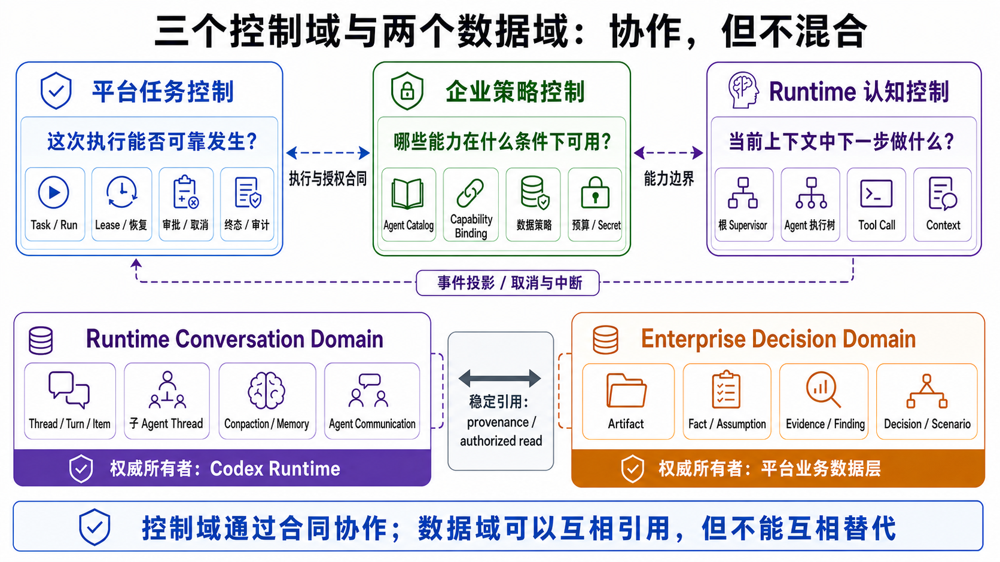

三个控制域通过合同形成执行边界，两个数据域通过 provenance 和授权读取互相连接。连接的目的，是让一次任务能够闭环，而不是把它们合并成一张万能状态表。

#### 12.1 三个控制域回答不同问题

| 控制域 | 回答的问题 | 权威事实 | 不负责什么 |
| --- | --- | --- | --- |
| 平台任务控制 | 这次执行能否可靠发生 | Task、Run、lease、审批、终态、审计 | 解释业务目标和选择专家 |
| Runtime 认知控制 | 当前上下文中下一步做什么 | Thread、Turn、Agent 执行树、Tool Call、上下文 | 用户和组织授权 |
| 企业策略控制 | 哪些能力在什么条件下可用 | Agent 发布状态、Capability Binding、数据和成本策略 | 替 Supervisor 推理 |

##### 平台任务控制

这个控制域由 Task、Run、Approval、Lease、Runner 和 Audit 组成。当前项目的 [`run-orchestrator`](../apps/web/crates/run-orchestrator/src/lib.rs) 已经实现幂等创建、lease、heartbeat、取消和恢复等骨架，它要保证的是“这次执行能否可靠地发生”：

- 谁发起，属于哪个组织和项目；
- 使用哪个 Profile 和授权 Workspace；
- 当前 Run 是否可以执行；
- 是否正在等待人工批准；
- worker 是否失联，是否允许恢复；
- 最终是成功、失败、拒绝、取消、超时还是中断。

它不解释“华东是否应该建仓”，也不维护模型当前的调查计划。例如，Run 被取消是一个持久化事实；取消后 Supervisor 是否还想继续分析，不会改变这个事实。

##### Runtime 认知控制

这个控制域由根 Thread、[`AgentControl`](../codex/codex-rs/core/src/agent/control.rs)、Runtime `AgentRegistry` 和原生多 Agent Tools 组成。它负责根据当前证据决定下一步：

- 是否需要子 Agent，使用哪个 Runtime Role；
- 给子 Agent 什么任务；
- 何时等待、追加指令或中断；
- 如何处理中间结果和结论冲突；
- 何时结束探索并生成最终回答。

当 Data Agent 发现历史增长主要来自促销时，是根 Agent 判断应该让 Finance Agent 重算情景，而不是 Run 状态机增加一条硬编码分支。Supervisor 因此是 Runtime 中的认知角色，不是另一个平台微服务。

##### 企业策略控制

这个控制域由 Agent Catalog、授权策略、Capability Binding、Secret 和 MCP Gateway 组成。它负责“哪些能力可以被谁以什么条件使用”：

- 某 Agent Definition 是否已经发布，其 Runtime Role 是否可用；
- 某 Capability 绑定哪些 Tool；
- 当前用户、Task 和数据范围是否允许使用；
- 哪些动作需要审批；
- 调用预算、并发和 Secret 注入有什么限制。

例如，Supervisor 可以提出“让 Data Agent 导出客户明细”，策略控制域可以因为数据等级而拒绝、裁剪范围或要求审批。它可以限制 Runtime，但不替 Runtime 判断这份数据是否足以支持建仓结论。

三个控制域通过显式合同连接，而不是共享一张万能状态表：平台先确认 Run 可以执行，授权策略给出本次可用的能力边界，Runtime 在边界内动态工作，随后 Runtime 事件回到平台形成审计和产品视图。

#### 12.2 两个数据域保存不同类型的事实

##### Runtime Conversation Domain

Thread、Turn、Item、子 Agent Thread、Context、Compaction、Runtime Memory、Tool Call 和 Agent Communication 都属于 Runtime Conversation Domain。

这些数据共同决定模型经历了什么、现在能看到什么、下一轮如何继续，因此权威所有者必须是 Codex。平台只保存安全、有限、可重建的事件投影和检索索引；浏览器缓存则是这份投影的临时视图。

这条边界意味着：即使平台数据库中已经保存了一条“Data Agent completed”事件，也不能仅凭这条事件恢复 Data Agent 的上下文，更不能自行伪造下一轮 Agent 消息。

##### Enterprise Decision Domain

报告、数据集、图表、仿真结果以及被明确发布的 Fact、Assumption、Evidence、Finding、Decision 和 Scenario，属于 Enterprise Decision Domain。这里保存的是需要被人复核、授权和复用的业务成果，而不是模型的隐式思考过程。

两个数据域通过稳定引用连接：

```text
Artifact
  ├── 自己的身份 / 授权 / 保留策略
  └── produced_by
        ├── task_id / run_id
        ├── thread_id / turn_id / item_id
        └── runtime_agent_path
```

`produced_by` 只回答“它从哪里产生”，不回答“它现在属于谁”。如果把 Artifact 的读取权限绑定在生产 Run 上，一旦 Run 被清理，后续任务即使有业务权限也无法复用成果。

第 9.5 节已经给出现有 Inline Visualization 的完整证据和作用域限制。这里得到的所有权结论是：保留 producer provenance 与授权 Resource 链路，同时把 Artifact 的身份和授权从生产 Run 中独立出来。

> **两个数据域可以互相引用，但不能互相替代。**
>
> Runtime 可以读取经过授权的 Artifact 或 Task Knowledge Ledger 记录；平台可以展示 Agent 执行轨迹。前者不会把 Artifact 变成模型 Memory，后者也不会把事件投影变成 Codex Thread。

---

### 13. 用对象关系澄清平台术语

这些名词不是为了增加一套抽象，而是为了避免在实现时把不同生命周期的对象绑在一起。与其逐个记定义，不如先看它们分别回答什么问题。

#### 13.1 目标与执行对象

| 对象 | 回答的问题 | 所有者与生命周期 |
| --- | --- | --- |
| **Task** | 用户长期想完成什么 | 平台持久化；可以跨时间继续，并拥有多个 Run |
| **Run** | 这一次用户可追踪的调度与审计尝试发生了什么 | 平台持久化；拥有幂等、lease、heartbeat、内部执行 Attempt、恢复记录和明确结果 |
| **Thread** | 模型经历了怎样的会话 | Codex Profile 持有；保存当前 `cwd`、Turn 历史和上下文语义 |
| **Turn** | Thread 中这一次模型执行发生了什么 | Codex Runtime 持有；可以产生多个 Item、Tool Call 和子 Agent 活动 |

在目标产品中，一个 Task 组织长期目标并关联其 Codex Thread；Run 是用户可追踪的一次调度与审计尝试。Worker lease 恢复可以在同一 Run 内增加内部 Attempt，用户重新执行才创建新的 Run。两者都不会因此获得新的业务目标，也不会因为调度恢复就创建一份新的 Workspace 所有权。

#### 13.2 Agent 的四个不同含义

| 对象 | 它是什么 | 它不是什么 |
| --- | --- | --- |
| **Agent Definition** | 平台治理记录：稳定 ID、版本、职责、所有者、能力、风险、评价和发布状态 | 正在运行的 Agent |
| **Runtime Role** | Codex 能够解析并用于创建 Agent 的角色配置 | 企业治理目录的替代品 |
| **Runtime Agent** | Codex 实际创建的子 Agent Thread，具有 Thread ID、Agent Path、Runtime Role、状态和父子关系 | 平台数据库里的一条“实例状态” |
| **Agent 执行投影** | 平台从 Runtime 事件重建的可观察视图 | 控制 Runtime Agent 的权威记录 |

三个相近名词在后文各有固定含义：**Agent 执行树**只描述 Runtime 中的父子关系，**Agent 执行轨迹**描述按时间发生的 spawn、消息、Tool、等待和中断过程，**Agent 执行投影**则是平台根据 Runtime 事件重建的可丢弃视图。企业需要用投影展示和审计轨迹，但不会因此接管 Agent 生命周期；投影可以回答“页面最后观察到什么”，不能回答“Runtime 下一步必须做什么”。

#### 13.3 持久资源与能力对象

| 对象 | 定义 | 关键边界 |
| --- | --- | --- |
| **Profile** | 用户级持久 Runtime 隔离范围，包含 `CODEX_HOME`、身份、配置、Thread、Memory 和扩展状态 | 由平台按认证归属解析，不由 Supervisor 根据 Agent 名称自由选择 |
| **Workspace** | 经授权的执行根，可以是已有目录、Managed Clone 或 Worktree | 独立于 Task、Run 和 Thread；Codex Thread 只保存当前 `cwd` |
| **Artifact** | 具有独立身份、类型、来源、授权和保留策略的持久成果 | producer Run/Thread/Turn/Item 只记录来源 |
| **Capability** | 稳定的业务能力语义，如 `data.query`、`network.optimize`、`finance.npv` | 不等于某个具体 Tool，也不证明 Runtime 当前可用 |
| **Task Knowledge Ledger** | 可选的 Task 级结构化协作记录 | 不是 Workspace、Thread、Runtime Memory 或自由文本剪贴板 |

Skill、Tool、Plugin 与 MCP 则是 Runtime 能力进入执行环境的不同载体：

- **Skill** 描述如何使用能力和工具；
- **Tool** 提供模型可调用的类型化动作；
- **Plugin** 打包 Skill、MCP、App 等扩展；
- **MCP** 标准化外部 Resources、Prompts 和 Tools 的连接。

[MCP Specification 2025-11-25](https://modelcontextprotocol.io/specification/2025-11-25) 解决连接和协议语义，但不会自动替企业完成用户授权、最小权限、数据分级或成本治理。

把这些对象连起来，目标关系是：

```text
Authenticated User
  -> Profile
  -> Authorized Workspaces

Task
  ├── Runs
  └── Codex Thread
        └── Agent 执行树

Artifact / optional Task Knowledge Ledger
  <- producer provenance from Run / Thread / Turn / Item
```

箭头表示授权和关联，不表示生命周期所有权。Workspace 不因为 Thread 关闭而消失，Artifact 也不因为 Run 完成而失效。

#### 13.4 理想概念如何演进为实施对象

前文为了先把问题想完整，使用了 Blackboard、Agent Registry 和 Shared Workspace 等理想能力名称。收敛后，这些名称不能直接变成同名服务：

| 理想阶段的概念 | 实施阶段的对应关系 |
| --- | --- |
| Task Knowledge Blackboard | Phase 1 的 Artifact Store；真实证据出现后才增加 Task Knowledge Ledger |
| Agent Registry | Agent Catalog；不等于 Codex Runtime 的 `AgentRegistry` |
| Shared Task Workspace | 独立 Workspace + 持久 Artifact + 可选 Task Knowledge Ledger |
| Agent | Agent Definition、Runtime Role、Runtime Agent Thread 和 Agent 执行投影四种对象 |
| Task Context | 平台提供的有界任务资源清单；不等于 Runtime 的模型上下文 |

这张表解释的是概念演进，不是兼容层。后文使用收敛后的对象名，以免一个理想名词重新获得多重所有权。

---

### 14. 受治理的 Agent 能力模型

一个专业 Agent 当然需要明确的角色说明，但只写 Prompt 无法回答它能够访问什么、以什么权限执行、应该输出什么结构、失败后怎样处理以及如何评价。企业所谓“Data Agent”，实际上要由 **Agent Definition、Capability、Skill/Tool、授权策略、Supervisor Policy 和 Evaluation** 共同成立。

例如，`network.optimize` 是业务能力；线性规划求解器和仿真服务是实现它的工具；Skill 告诉 Agent 应该如何设置约束、检查可行性和解释结果；授权策略决定当前用户能否读取这组数据、是否允许调用付费仿真。缺少其中任何一环，目录里的“Network Agent”都不能被视为本次任务真正可用。

第一次解释时，可以把它简化为 `Agent → Capability → Skill → Tool → MCP → Enterprise System`。

这适合做第一次解释，却不适合作为真实数据模型，因为实际关系是多对多的：

- 一个 Agent 可以声明多个 Capability；
- 一个 Capability 可以由多种 Tool 组合实现；
- 一个 Tool 可以支撑多个 Capability；
- Skill 可能只描述方法，不直接绑定单一 Tool；
- Tool 可能是本地 Runtime Tool，也可能来自 MCP；
- 同一个 MCP Server 暴露多个 Resources、Prompts 和 Tools；
- 授权策略会按用户、组织、Agent、Task 和资源动态裁剪。

因此更准确的模型是：

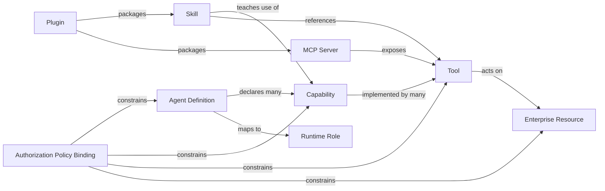

能力图有两个事实来源：

1. **业务治理事实**由平台目录拥有；
2. **当前可执行事实**由 Codex Runtime 的能力发现拥有。

只有二者交集才是本次任务可选择的能力：

> **可选择的 Agent = 已发布的 Agent Definition ∩ Runtime 可发现的 Runtime Role ∩ 用户与 Task 授权策略 ∩ 可用依赖 ∩ 预算。**

这条交集非常重要。它阻止平台把“目录里登记过”误写成“Runtime 现在能执行”，也阻止 Runtime 中偶然可见的 Tool 绕过企业发布和授权策略。

#### 14.1 Agent Catalog 管治理，不管运行实例

没有 Catalog，就无法回答某个专业 Agent 由谁维护、使用了什么评价集、是否已经发布、能访问哪些数据；但 Catalog 只管理企业治理事实，不能扩张成第二个 Agent Runtime。

| Catalog 应该拥有 | Catalog 不应该拥有 |
| --- | --- |
| Agent Definition ID、版本和业务描述 | 当前子 Agent Thread 的权威状态 |
| 所有者、维护团队和发布状态 | Agent 之间的消息队列 |
| Runtime Role Reference 和 Capability 声明 | 模型上下文和 compaction |
| 输入输出 Schema、风险等级和数据域 | Tool Call 执行 |
| 审批、成本、并发和预算策略 | Agent spawn、通信和中断 |
| 评价集版本与质量门 | 对 Skill、Plugin、MCP 和 Tool 的替代发现 |

Catalog 中一条记录只能说明“企业愿意提供这个 Agent”。它引用的 Runtime Role 还必须在当前 Profile 中可发现，所需依赖必须健康，本次用户和 Task 也必须通过策略检查，才能成为 Supervisor 的候选。

#### 14.2 Supervisor 看到的是候选集合，不是整张目录

Supervisor 不应直接读取 Catalog 数据库，也不应由平台把所有 Agent 描述拼进每个 Prompt。目标流程分为四步：

1. 从任务中识别需要的能力；
2. 平台根据发布状态、用户授权、Task 授权策略和预算筛选；
3. 与当前 Profile 中 Runtime 可发现的 Runtime Role 和依赖取交集，再通过有界、类型化的 Tool 返回候选；
4. Supervisor 决定是否创建，Runtime 执行真实 spawn。

候选结果只需要包含做选择所需的信息：

```text
Data Analysis Agent v3
  runtime_role: enterprise-data-analyst
  capabilities: data.query, data.analysis
  constraints: read_only, approval_for_export
  runtime_status: available
```

这项候选查询能力本身也需要作为正式 Tool 或 MCP Tool 被 Codex 发现，并经过 Schema 与 Capability Manifest 验证；在它完成之前，第一阶段直接使用代码管理的有限 Runtime Role 清单。平台负责约束候选范围，Supervisor 负责认知选择，Runtime 负责真正创建 Agent——三者各自只完成一段责任。

> **当前发布边界**
>
> 第 10 章已经区分当前 Runtime 能力与企业发布治理。落实到本章，第一阶段只开放经过代码审查、能力门确认并通过真实 spawn 验证的有限 Runtime Role；Agent Catalog 不以任何配置文件“已经存在”作为可用性的替代证据。

---

### 15. Supervisor：根 Thread 中的认知责任

“Supervisor Agent”仍然是合适的架构名称，因为复杂任务确实需要一个角色持续维护总目标、调整分工并对最后答案负责。但这里容易产生一个新的误解：既然 Codex 已经有根 Thread，是不是不需要任何额外设计，直接复用就够了？

答案不是简单的“是”或“否”：

> **根 Thread 已经具备 Supervisor 的运行机制，但默认只是一名能够使用多 Agent Tools 的主 Agent。要让它稳定承担企业 Supervisor 责任，仍然需要一套版本化的行为策略；不需要的是另一套 Supervisor Runtime。**

Supervisor 的完整设计由运行载体、稳定行为策略、可复用方法和本次业务目标共同构成；授权、审批、恢复和持久化等硬约束则继续留在确定性系统合同中。

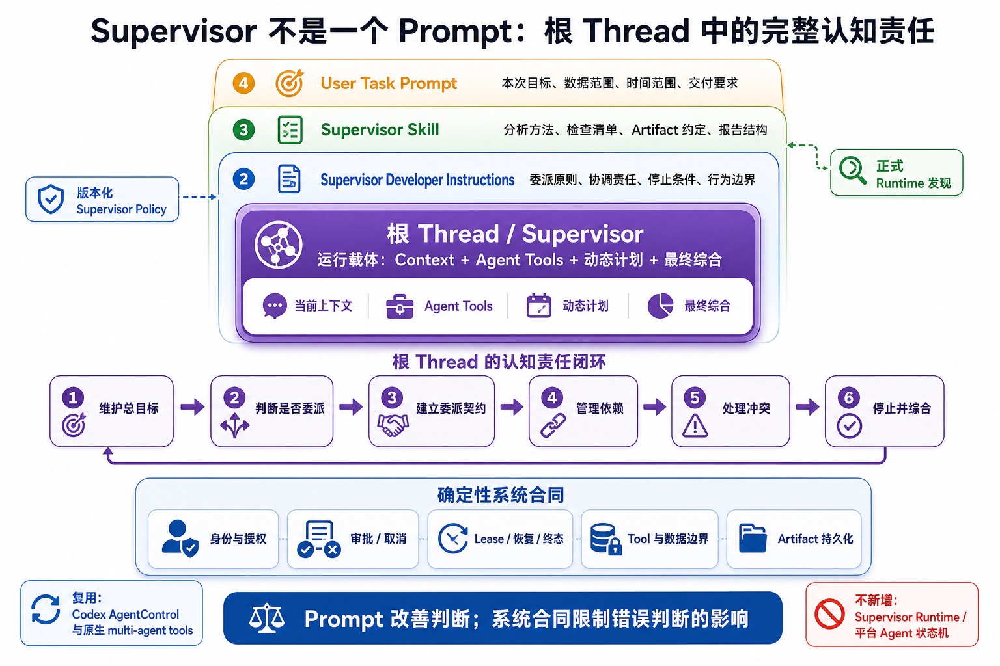

#### 15.1 根 Thread 已经提供执行机制，但没有完整的业务职责

Codex 已经处理了多 Agent 执行中最难复刻的一组机制：

| 已有能力 | 代码依据 | 解决的问题 |
| --- | --- | --- |
| 一棵 Agent 执行树共享控制面 | [`AgentControl`](../codex/codex-rs/core/src/agent/control.rs) 以 root session 为作用域 | spawn、通信、等待、中断、状态和执行额度属于同一 Runtime |
| 子 Agent 是真实 Thread | [`spawn_agent`](../codex/codex-rs/core/src/tools/handlers/multi_agents_v2/spawn.rs) 解析 Runtime Role、建立父子来源并创建 Thread | 不需要平台模拟 Agent 实例 |
| 根 Agent 能看见协作工具和子 Agent 结果 | Runtime 在 [`config/mod.rs`](../codex/codex-rs/core/src/config/mod.rs) 中为 root 定义 multi-agent usage instructions | 根 Agent 可以组织委派并综合返回结果 |
| Domain Agent 可以使用独立 Runtime Role | [`agent_roles.rs`](../codex/codex-rs/core/src/config/agent_roles.rs) 校验 `description` 和 `developer_instructions`，并合并 Runtime Role 配置 | 专业 Agent 不必共享一份通用 Prompt |

[Codex Subagents 文档](https://learn.chatgpt.com/docs/agent-configuration/subagents.md) 也把 spawn、follow-up、等待和结果收集定义为 Codex 的编排职责。因此，Supervisor 不需要再实现消息路由、子 Thread 生命周期或 Agent 状态机。

但默认 root instructions 主要说明“你是 `/root`、有哪些协作工具、如何联系子 Agent”，并没有定义企业决策中的职责，例如：

- 什么时候值得拆分，什么时候应该自己完成；
- 如何选择 Data、Network 或 Finance Agent；
- 子任务必须返回哪些证据和 Artifact；
- 两个专业结论冲突时如何处理；
- 什么时候证据已经充分，应该停止继续调查；
- 最终报告必须怎样综合建议、假设、风险和来源。

而且 [`effective_multi_agent_mode`](../codex/codex-rs/core/src/session/multi_agents.rs) 表明，除特定的主动委派模式外，多 Agent 默认策略是 `ExplicitRequestOnly`，也就是需要明确指令才会委派。这进一步说明：**根 Thread 是 Supervisor 的载体，不是开箱即用的企业 Supervisor。**

#### 15.2 Supervisor 应该由四层设计共同构成

只在一次用户消息里写“你是 Supervisor”可以做演示，却不足以成为可治理的产品能力。更稳定的设计是：

| 层次 | 应该承载什么 | 不应该承载什么 |
| --- | --- | --- |
| 根 Thread | 当前上下文、动态计划、Agent Tools 和最终综合 | 企业授权和 Run 状态机 |
| Supervisor Developer Instructions | 委派原则、协调责任、停止条件、综合要求和行为边界 | 本次任务的动态状态 |
| Supervisor Skill | 可复用的分析方法、检查清单、Artifact 约定和报告结构 | 绕过 Runtime 的隐藏执行逻辑 |
| User Task Prompt | 本次业务目标、数据范围、时间范围和交付要求 | 每次重复整套平台治理规则 |

其中，必须始终生效的核心责任应该使用版本化的 `developer_instructions`，而不是覆盖模型自己的 `base_instructions`。更长、可按任务调用的方法可以放入 Runtime 正式发现的 Supervisor Skill；用户 Prompt 只描述这一次要解决的问题。

Codex 的 `thread/start` 协议已经提供 `developerInstructions` 字段，可见于 [`ThreadStartParams`](../codex/codex-rs/app-server-protocol/src/protocol/v2/thread.rs)。因此，这条路径不需要修改 Codex Core，也不需要暗中编辑 Profile 配置。

当前受限企业链路已经实现这条注入路径：Task/Run 选择代码发布的精确 Policy
版本，平台解析并封存不可变 Snapshot，把 `developerInstructions` 传入根 Thread；
执行前检查同时验证 Definition 指令摘要和多 Agent Capability，物化受管 Role
文件，并由 [`thread_start_params`](../apps/web/crates/codex-adapter/src/real.rs)
只在本次 Thread 的 request config 中启用 V2 和精确 Domain Runtime Roles。当前
缺口不再是 Adapter 注入，而是 Runtime 原生 Agent CRUD、更广泛的 Catalog 治理、
Role 可用性查询和多 Profile 授权。

Supervisor Policy 的 ID 和版本应该与 Thread 建立明确关联。恢复 Thread 时继续使用原版本；升级既有 Thread 时要进行显式迁移，而不是在后台隐式替换其行为规则。

#### 15.3 Supervisor Policy 需要规定什么

这份策略不需要把所有业务流程写成固定 Workflow，但必须把责任和判断标准说清楚。

| 责任 | Supervisor 应有的行为 |
| --- | --- |
| 维护总目标 | 提取评价标准、关键约束和待验证假设，并在整个协作过程中保持一致 |
| 判断是否委派 | 只有在需要独立专业判断、可并行调查或上下文隔离时才创建子 Agent |
| 建立委派契约 | 为每个子 Agent 明确目标、输入、允许使用的依据、预期 Artifact、限制和完成条件 |
| 管理依赖 | 区分可并行任务和前置依赖，根据中间结果追加、重跑、中断或取消后续调查 |
| 处理冲突 | 定位分歧来自数据、假设、方法还是评价标准；必要时追加验证，而不是简单多数表决 |
| 控制停止 | 当主要方案已覆盖、关键假设得到验证、剩余不确定性已披露时停止继续扩张 Agent 执行树 |
| 综合结果 | 最终回答包含推荐、替代方案、证据、假设、风险、未决问题和来源引用，而不是拼接子报告 |

Supervisor Policy 还必须明确自身边界：它可以建议访问数据、申请审批或调用付费仿真，但不能自己宣布授权通过、审批完成、Run 成功或 Artifact 已经持久化。

这些硬约束由 Prompt 之外的系统保证：

- Agent Thread 的并发数量由 Runtime 配置限制；V2 尚未提供已验证的最大嵌套深度硬限制；
- Tool 次数、费用和业务预算由平台、企业 Tool/MCP 边界与 Runtime 可用限制共同约束；
- 用户、Profile、Workspace 和 Capability 权限由平台校验；
- Tool 和数据范围由 MCP Gateway 执行；
- 审批、取消、lease、恢复和终态由 Task/Run Control 持久化；
- Artifact 的身份、授权和保留策略由 Artifact Store 管理。

换句话说，Prompt 负责让 Supervisor 作出更好的判断，系统合同负责让错误判断也不能突破安全边界。

#### 15.4 第一阶段需要改什么，不需要改什么

第一阶段可以采用很小的实现范围：

| 直接复用 | 需要补充 |
| --- | --- |
| Codex 根 Thread | 版本化 Supervisor Policy |
| AgentControl 与原生 multi-agent tools | Adapter 通过正式 `thread/start` 合同传入 `developerInstructions` |
| Runtime Role 解析和 spawn | Data、Network、Finance 等有限 Runtime Role 及其输入输出约定 |
| Runtime Agent 状态和通信 | Capability Gate、Artifact 交接和 multi-agent trajectory 验证 |

因此，第一阶段不需要修改 Codex 的 AgentControl、重新实现 spawn，也不需要增加 Supervisor 微服务。真正需要增加的是**产品级角色定义和一条正式的配置进入 Runtime 的路径**。

这也意味着不能把 Supervisor Prompt 直接硬编码在 WebApp，由浏览器随请求发送；它应当是服务端解析的、经过发布和版本控制的模型可见策略。否则用户可以绕过治理规则，恢复后的 Thread 也无法确定自己使用的是哪一版 Supervisor。

#### 15.5 第一阶段为什么不拆出 Planner

独立 Planner 只有在下列条件出现时才有价值：

- 计划本身需要单独模型或专门评价；
- 执行 Agent 不应修改计划；
- 计划要跨多次 Run 持久化并由人审批；
- 计划生成和执行有明确的组织职责分离；
- 已经测量到根 Supervisor 在规划与综合之间发生稳定冲突。

在这些条件出现前拆分 Planner，会新增：

- Supervisor 与 Planner 职责重叠；
- 两份计划状态；
- 计划变更协议；
- 失败恢复时的归属问题；
- 额外时延和成本；
- 新的测试矩阵。

因此第一阶段让根 Supervisor 同时负责动态规划和结果综合。需要展示计划时，可以投影其结构化输出；但不能让这个投影隐式变成另一份权威计划。

#### 15.6 什么时候再拆 Planner

Planner 不应因为“进入第二阶段”就自动出现，而应由可测量结果触发：

- 超过某比例的任务需要计划审批；
- 计划经常被单独保存、比较和复用；
- 根 Supervisor 的计划稳定性低于质量门槛；
- 计划与执行确实需要不同模型、权限或团队负责；
- 独立 Planner 的评测收益覆盖新增复杂度。

---

### 16. 从 Artifact 协作到可选 Task Knowledge Ledger

共享知识不应从一套完整 Blackboard 起步。第一步先让 Agent 之间能够通过持久、可授权、可追溯的 Artifact 可靠交接成果；只有生产任务持续暴露出更细粒度的冲突、替代和恢复需求，才增加结构化 Ledger。

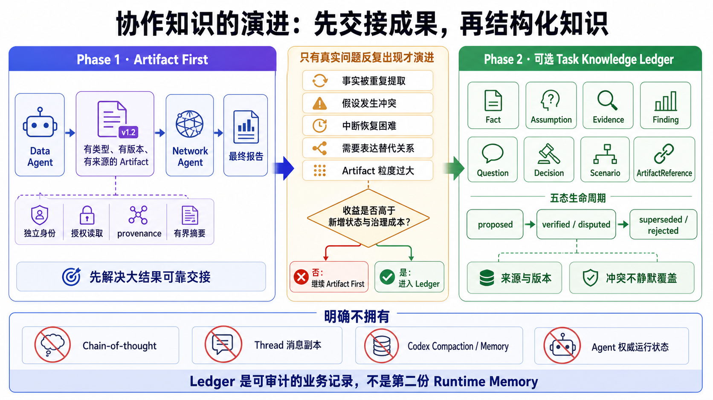

#### 16.1 Artifact First：先让成果成为协作接口

多 Agent 协作最先遇到的问题，通常不是缺少一张知识表，而是大结果无法可靠交接。Data Agent 产生十万行订单分析，Network Agent 不应该从聊天消息中重新复制一遍 CSV；它需要读取一份有类型、有版本、有来源、经过授权的结果。

因此第一阶段把 Artifact 作为主要协作接口：

- Agent 在消息中只返回 `artifact_id`、有界摘要和限制；
- 后续 Agent 按授权读取 Artifact；
- 浏览器根据 Artifact 类型选择安全渲染方式；
- 最终报告引用产生它的证据 Artifact；
- 大结果不会被重复塞进多个 Agent 的上下文。

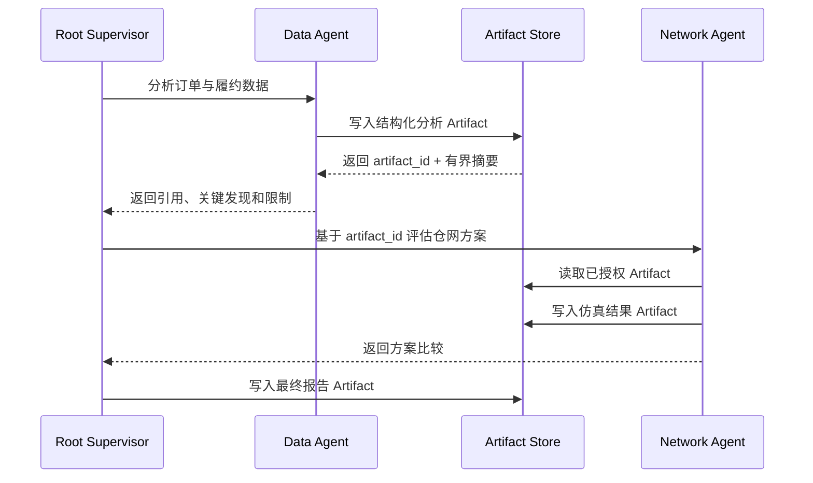

当前项目的 Inline Visualization 链路已经验证了其中一条纵向路径：Runtime Tool 产生类型化 Envelope，平台登记来源并转换授权 Resource，Assistant 决定展示位置，浏览器刷新后可以恢复渲染。这是采用 Artifact First 的代码依据。

但“当前链路可用”和“目标 Artifact 已完成”是两件事：

| 已经验证 | 目标仍需补齐 |
| --- | --- |
| 类型化 Envelope 和 renderer 注册 | 通用、生成式 Artifact Schema |
| producer Turn/Item 来源 | 独立于 Run/Thread 的 Artifact 身份 |
| 授权 Resource URL | Artifact 自身的授权和保留策略 |
| 同一 Run/Thread 内恢复 | 跨 Run、跨 Thread 的持久解析 |

所以本章说的“跨 Run 复用”是目标能力，不是当前代码事实。迁移时应保留现有生产和渲染链路，只改变 Artifact 的身份与授权所有权。

#### 16.2 当 Artifact 不再足够

Artifact 能很好地交接“结果”，但不一定适合维护一项长期决策里不断变化的细粒度知识。假设多个 Agent 反复使用“未来三年华东订单增长 18%”这个假设，后来 Data Agent 发现促销因素并把它修正为 11%。如果这个数字只埋在三份报告里，系统很难知道哪些分析受影响、哪一版已经被替代。

只有当这类问题在真实任务中持续出现，才值得增加 Task Knowledge Ledger：

- 同一事实或假设被多个 Agent 重复提取；
- 中断恢复需要查找结构化中间结论；
- 多个 Agent 必须并发贡献同一项决策；
- 需要明确表达冲突、依赖、验证状态和替代关系；
- Artifact 粒度过大，无法高效回答“目前采用哪个假设”。

Task Knowledge Ledger 建议只允许 `Fact`、`Assumption`、`Evidence`、`Finding`、`Question`、`Decision`、`Scenario` 和 `ArtifactReference` 等有限类型。

其中 `Finding` 比宽泛的“Insight”更适合作为持久模型。它必须指出依据哪些 Evidence 或 Artifact、由谁产生、是否已经验证；产品界面仍然可以把已验证 Finding 展示为“洞察”。

一条记录至少要表达：

| 字段 | 作用 |
| --- | --- |
| `task_id`、`record_id`、`kind` | 确定范围、身份和类型 |
| `statement`、`status`、`confidence` | 表达内容及其验证程度 |
| `source_artifact_ids` | 连接可复核证据 |
| `created_by` | 记录 Thread、Turn 和 Runtime Agent 来源 |
| `supersedes`、`version` | 表达替代关系，而不是静默覆盖 |

这些记录可以采用 `proposed / verified / disputed / superseded / rejected` 等状态。例如两个 Agent 分别给出 18% 和 9% 的增长率时，Ledger 保存各自证据、提出者、采用关系和替代原因，不让最后一次写入静默覆盖前一条记录。这里描述的是满足上述触发条件后的设计方向，不是第一阶段需要提前建设的第五类生命周期。

#### 16.3 Task Knowledge Ledger 不能变成第二份 Runtime Memory

Ledger 不保存 Chain-of-thought、完整 Prompt、Thread 消息副本、Codex compaction 摘要、Tool 凭据或 Agent 的权威运行状态，也不声明“下一轮必须把哪些内容注入模型”。

Runtime 只能通过正式的类型化 Tool 或 MCP Resource 搜索、读取、提出和替代记录，并自己决定何时使用、如何压缩。平台不能在背后把整本 Ledger 静默拼进每个 Agent 的 Prompt。

“Ledger”这个名称强调记录有来源、有版本、有状态、可以冲突并且可以审计；“Memory”则容易暗示它拥有模型召回和上下文语义。这个命名边界，正是为了保留 Blackboard 的协作价值，同时不与 Codex Memory 争夺所有权。

演进顺序因此是：先用有界摘要和 Artifact Reference 完成 Task 内协作；有证据证明不足后，再增加 Task Knowledge Ledger；最后才评估是否需要跨 Task 的 Decision Knowledge。

---

### 17. 收敛后的目标架构全景

到这里，Supervisor、Agent 治理、Artifact 协作和所有权边界都已经完成了必要推导，目标架构才具备完整含义。它由三个控制域、两个数据域和一条明确的 Runtime 边界组成。下图描述的是**目标结构**，不是当前部署现状；其中既包括已有骨架，也包括需要完成的迁移，以及只有在真实证据出现后才引入的能力。

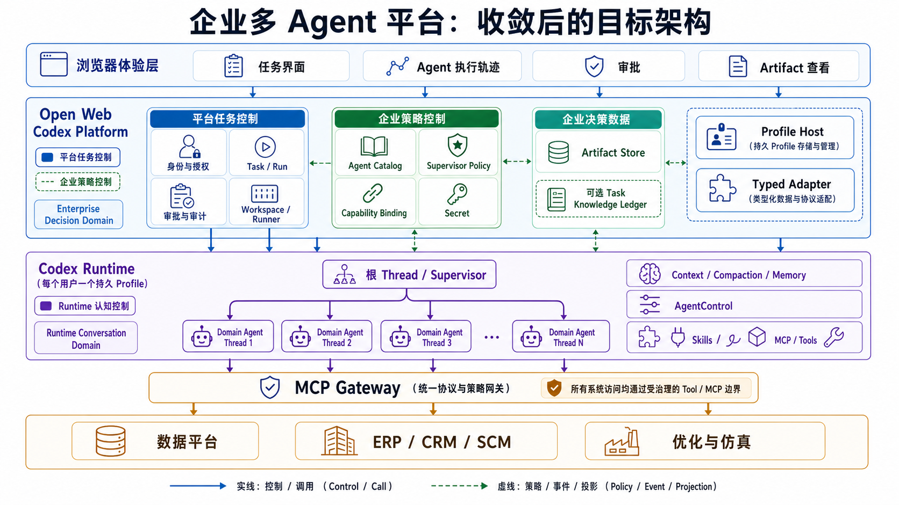

平台控制面、Codex Runtime 与企业系统之间的责任分界构成了目标架构的主骨架。为了进一步说明组件之间的调用、投影和授权关系，下面把同一结构展开为精确关系图。

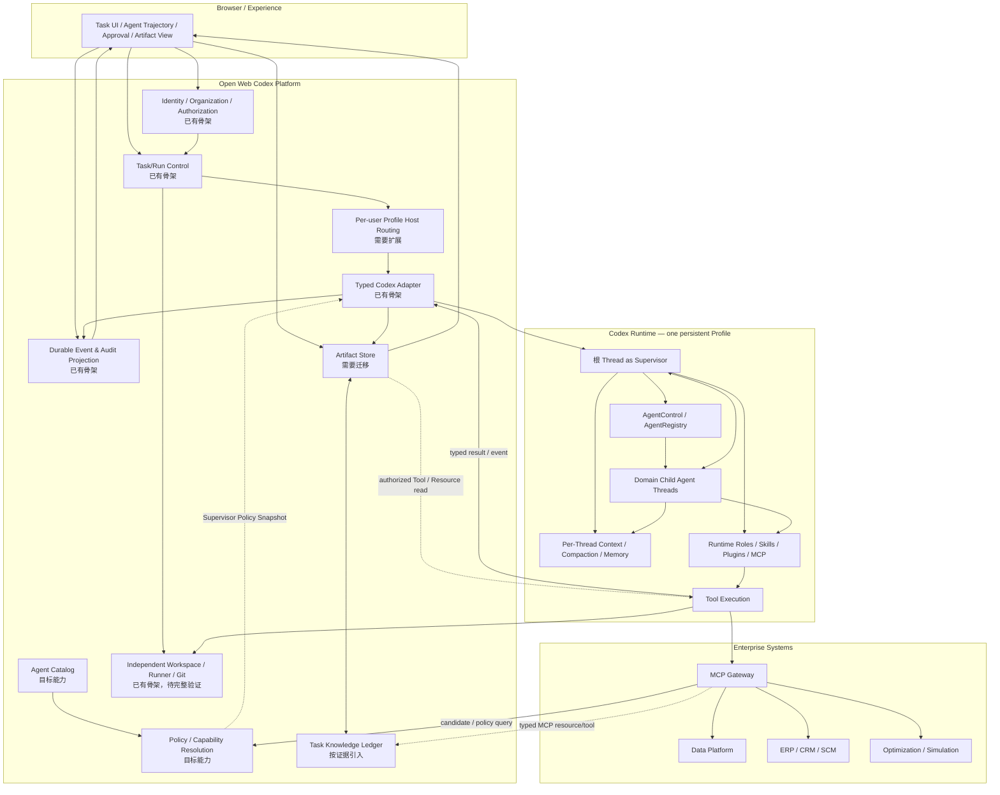

理解这张图，可以先抓住四条主线：

1. 浏览器只面对平台提供的类型化资源，不直接理解 Codex 协议；
2. 平台负责多用户、工作流、策略、审计和持久成果；
3. Codex Runtime 负责模型可见的执行，以及 Agent、Tool 和上下文语义；
4. 企业系统通过受治理的企业 Tool/MCP 边界被调用，不直接暴露给模型。

它同样通过“没有什么”表达边界：

- 没有独立的平台 Agent Scheduler；
- 没有平台保存的第二份 Thread 或 Memory；
- 没有浏览器直连 Codex；
- 没有平台模拟 Skill、Plugin、MCP 和 Tool 发现；
- 没有把 Task、Run、Workspace、Thread 和 Artifact 合并成一个万能对象；
- 没有让 Task Knowledge Ledger 静默注入模型上下文；
- 没有让 Agent 自己决定授权结果。

> **当前实现与目标图的距离**
>
> [`run-orchestrator`](../apps/web/crates/run-orchestrator/src/lib.rs)、[`profile-host`](../apps/web/crates/profile-host/src/lib.rs)、[`codex-adapter`](../apps/web/crates/codex-adapter/src/real.rs) 和事件投影已经形成平台骨架。Workspace 具有独立身份、授权和托管生命周期，Run 只保存所选 Workspace 的引用；Task-owned 持久 Artifact Store、同 Task 跨子 Thread 读取和生产者 provenance 也已在受限案例中验证。当前仍是单 Profile 组合，现有执行根登记、共享 Workspace 并发验证、Artifact 替代/失效/删除/保留和跨 Run 复用尚未完成，不能把这些目标写成现有能力。

---

### 18. 用完整任务路径检验目标架构

架构图中的每条边界最终都要在一条真实任务中同时成立。下面继续使用华东仓决策，但这里描述的是**目标验收流程**，不是对当前产品界面的截图式说明。

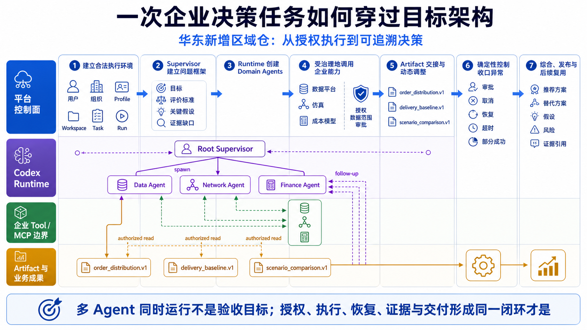

这条路径把授权、认知协作、企业能力调用、Artifact 交接和异常收口放在同一次任务中检验。任何一段只能在正常演示中工作，都不足以证明目标架构成立。

#### 18.1 平台先建立合法的执行环境

用户提交：

> 基于最近两年订单、当前仓网和未来三年增长预测，判断是否应在华东新增区域仓，并比较至少两个替代方案。

平台依次完成：

1. 验证用户、组织、Project 和 Task 权限；
2. 根据认证记录解析用户拥有的 Profile；
3. 验证用户显式选择的 Workspace，并确认 `cwd` 位于授权执行根内；
4. 创建或继续 Task，以幂等键创建 Run；
5. worker 获取 lease；
6. 通过 Adapter 启动或恢复 Codex Thread，并发起 Turn。

这一步不需要理解建仓问题，只负责保证后续执行有清楚的身份、目录、租约和恢复位置。当前 Task/Run、独立托管 Workspace、Profile Host 和 Adapter 骨架已经存在；按用户 Profile 路由、现有执行根登记和共享 Workspace 的真实并发验证仍有缺口，不能据此把这一层描述成已经完整实现。

#### 18.2 Supervisor 建立问题框架

根 Thread 中的 Supervisor：

- 提取评价指标：成本、时效、容量、风险；
- 识别数据缺口；
- 查询已授权 Agent 候选；
- 选择 Data、Network 和 Finance 三个 Domain Agent；
- 决定 Data 与现有网络盘点可以并行。

第一阶段的候选来自经过验证的有限 Runtime Role 清单；Agent Catalog 和候选查询能力完成后，再由策略筛选后的目录结果替代。两种阶段都不能让 Supervisor 选择 Runtime 实际不存在的 Runtime Role。

#### 18.3 Runtime 创建并管理子 Agent

Supervisor 使用 Codex 原生 `spawn_agent`。当前 [`spawn_agent` 实现](../codex/codex-rs/core/src/tools/handlers/multi_agents_v2/spawn.rs) 会解析 Runtime Role 和父子来源，通过共享的 `AgentControl` 创建子 Thread，并发出 Agent 活动事件。

这时平台根据 Runtime 事件形成 Agent 执行投影，用于页面和审计。投影中的状态来自真实子 Thread；仅新增一条平台数据库“实例记录”并不能证明 Agent 已经被 Runtime 创建。

#### 18.4 企业能力通过受治理的 Tool 边界使用

Data Agent 通过受限的企业 Tool/MCP 边界查询数据。目标授权链依次验证用户与组织成员关系、Task/Profile/Workspace 授权、Agent Definition 与 Runtime Role、Capability 与 Tool，以及 Dataset/Row Policy。

模型提出调用后，Runtime 执行正式 Tool；平台或 MCP Gateway 根据确定性授权策略决定是否允许、是否裁剪数据以及是否要求审批。目标验收需要证明：即使 Prompt 诱导 Data Agent 执行写操作，只读身份也会在企业 Tool/MCP 边界拒绝它。这个安全属性由权限配置和负向测试证明，不能只写在 Agent Prompt 中。

#### 18.5 Artifact 交接和动态调整

Data Agent 输出：

- `order_distribution.v1` Artifact；
- `delivery_baseline.v1` Artifact；
- 有界摘要；
- 数据质量限制。

Network Agent 读取经过授权的 Artifact，而不是接收一份重新复制的原始 CSV。这样，双方引用的是同一版本的数据，最终报告也能追溯到同一份来源。

Network Agent 发现：

- 新增仓可以改善 12% 的平均时效；
- 改造现有干线可以改善 8%，但成本明显更低；
- 结果对未来增长率非常敏感。

Supervisor 因此追加任务：

- Finance Agent 计算三个增长情景；
- Data Agent 验证 18% 增长假设；
- Network Agent 对低增长情景重跑。

这一步正是固定 Router 无法表达，而动态 Supervisor 有价值的地方。

#### 18.6 审批、取消和恢复仍由确定性系统收口

这条目标路径只需要在此确认责任归属：Supervisor 可以提出高成本或高风险动作，审批、取消、lease、恢复和终态仍由 Task/Run Control 与正式 Runtime 合同完成。它们在拒绝、重启、部分成功和迟到事件下的具体行为，留到第五部分按异常路径逐项检验。

#### 18.7 综合、发布与后续复用

Supervisor 最终生成：

- 推荐方案；
- 两个替代方案；
- 情景比较；
- 关键假设；
- 风险；
- 证据引用；
- 未决问题；
- 建议复核时间。

最终报告保存为独立 Artifact。

在目标态中，Task 完成后，Artifact 仍可按组织授权被后续 Task 使用，生产它的 Run、Thread、Turn 和 Item 只保留为 provenance。当前 Inline Artifact 仍受 Run/Thread 作用域限制，所以这一步同时也是持久 Artifact 迁移的验收条件。

整条路径最终要证明的不是“多个 Agent 能同时运行”，而是下列责任可以在一次真实任务中闭环：

| 需要证明的事实 | 应当由谁证明 |
| --- | --- |
| 用户、Profile、Workspace 和数据访问没有越权 | 平台授权 + 企业 Tool/MCP 边界 |
| 子 Agent 真实创建、通信、中断并产生可恢复历史 | Codex Runtime |
| Run 在成功、失败、拒绝、取消、超时和中断时都有明确终态 | Task/Run Control |
| 页面断线重连后看到同一条 Agent 执行轨迹，而不是另一套状态 | 持久事件投影 |
| 结果可被授权、追溯并在生产 Run 结束后继续存在 | Artifact Store |

至此，第四部分完成了从理想构件到目标对象、控制边界和完整任务路径的收敛。下一部分不再增加新的架构名词，而是继续处理状态机、协议、恢复和阶段交付，使这套目标架构真正可以实现。

---

## 第五部分：让架构可以实现，而不仅可以解释

### 19. 从所有权结论走向可执行合同

上一章沿正常路径展示了目标架构如何完成一次任务；本部分转向最容易破坏这条路径的异常情况。第四部分已经回答了“谁应该负责什么”，但所有权表本身不会让系统自动正确。真正开始实现时，一次任务会连续穿过平台、Profile Host、Codex Runtime、企业 Tool/MCP 边界和 Artifact Store；只要其中一个边界没有稳定合同，前面建立的单一事实源就会在异常路径中失效。

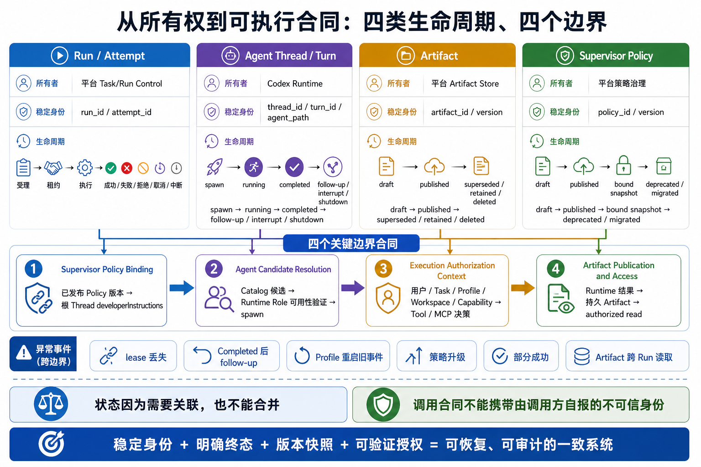

因此，实现不能只列出对象，还要同时规定每类对象的稳定身份、终态或版本变化，以及它穿过所有权边界时使用的合同。生命周期保持独立，合同负责连接，异常恢复才不会重新制造第二份事实。

仍以华东新增仓任务为例。正常演示很容易完成：根 Agent 创建 Data Agent，Data Agent 查询数据，Network Agent 做仿真，Supervisor 汇总结果。真正决定架构是否成立的是下面这些时刻：

| 发生的情况 | 系统必须回答的问题 |
| --- | --- |
| Worker 失去 lease，但 Codex Thread 仍然存在 | 应恢复同一个 Run，还是创建新的执行？哪些 Tool 可以重试？ |
| Data Agent 已完成一次 Turn，稍后又收到补充调查 | 它是已经永久结束的 Agent，还是仍可继续使用的 Thread？ |
| Data Agent 产生结果，Network Agent 位于另一个子 Thread | 两者如何引用同一份数据，而不是复制一段聊天文本？ |
| 子 Agent 调用企业 MCP | Gateway 如何知道调用属于哪个用户、Task 和执行角色？ |
| Profile 重启后又收到旧进程事件 | 哪一条记录可以更新浏览器投影，哪一条必须丢弃？ |
| Supervisor 策略升级 | 已经运行的 Thread 应继续使用旧版本，还是静默改变行为？ |

这些问题共同揭示了一个实现原则：

> **状态不能因为需要关联就合并，合同也不能因为调用方便就携带不可信身份。**

接下来把前面确定的所有权落实为四类生命周期和四个关键边界合同。字段级数据模型和完整示例放在附录，正文只保留理解设计所必需的部分。

---

### 20. 四类生命周期必须分开

多 Agent 系统的复杂度主要出现在中断、恢复、追加任务和部分成功。要处理这些情况，首先必须区分四种容易被混在一起的对象：Run、Runtime Agent Thread、Artifact 和 Supervisor Policy。

#### 20.1 Run 与 Attempt：企业执行事实

Run 回答的是：**平台是否已经受理并执行了这一次任务请求，最终结果是什么。** 它属于平台，因为幂等、lease、heartbeat、取消和审计需要数据库事务和确定性终态。

当前代码中的 Run 状态已经形成了一条可用骨架：

```text
pending
  -> provisioning
  -> running
  -> completed / cancelled / failed

provisioning / running / cancelling
  -> recovery_pending
  -> running
```

这里的 `recovery_pending` 不是一条新的业务请求。当前 [`RunOrchestrator`](../apps/web/crates/run-orchestrator/src/scheduler.rs) 会在同一个 Run 上重新取得 lease，并在调度尝试中递增 `attempt`。因此需要明确区分两种“重试”：

| 情况 | 正确身份语义 |
| --- | --- |
| Worker 丢失、lease 过期、可恢复基础设施故障 | 同一个 Run 内的新 Attempt |
| 用户要求重新执行、换输入或从旧结果派生新方案 | 新的 Run，并保留与旧 Run 的来源关系 |

审批也不必强行变成 Run 的一个状态。Approval 已经是拥有独立身份、版本和结果的持久对象；Run 可以在等待它时保持活动，但不能用一个 `awaiting_approval` 字符串替代审批本身的请求、授权主体和回答记录。

面向产品和审计，Run 最终仍应能够区分 `succeeded`、`failed`、`rejected`、`cancelled`、`timed_out` 和 `interrupted`。

这些是目标结果语义，不要求与当前数据库状态逐字一一对应。例如，审批被拒绝可以形成 `rejected` 结果，deadline 超时可以形成 `timed_out` 结果，而底层存储在迁移前仍可能使用 `failed + failure_code`。文档和 API 必须明确当前映射，不能把目标枚举写成已经存在的数据库事实。

#### 20.2 Agent Thread 与当前 Turn：模型执行事实

Runtime Agent 回答的是：**某个子 Agent Thread 是否存在，当前是否在执行一轮任务，以及还能否继续收到工作。** 这些事实属于 Codex Runtime。

这里不能沿用 Run 的“终态保护”思路。Codex 的 `AgentStatus` 明确区分：

- `Running`：当前正在执行；
- `Interrupted`：当前 Turn 被中断，但仍可能收到新输入；
- `Completed`：当前工作已经返回结果；
- `Errored`：当前工作发生错误；
- `Shutdown`：Agent Thread 已关闭。

`followup_task` 会重新加载已有的 V2 Agent Thread 并触发新的 Turn。因此，`Completed` 和 `Errored` 描述的是最近一次工作结果，不等于整个 Agent Thread 永远终结。

浏览器投影应当拆成两组有限事实：

| 投影维度 | 示例 | 解释 |
| --- | --- | --- |
| Thread 可用性 | `available / shutdown / unknown` | 是否仍能接收 follow-up |
| 当前活动 | `starting / running / waiting / completed / errored / interrupted` | 当前或最近一轮执行情况 |

当平台与 Runtime 失去连接时，正确状态是 `unknown`，不是根据“很久没收到消息”擅自推断 `failed`。恢复后应从 Codex 的 Thread 和 Agent 事实重建投影。

投影保存 `agent_thread_id`、`AgentPath`、父子关系、Runtime Role 和最近观察位置，用于展示、审计和检索；它不能成为 spawn、follow-up、interrupt 或恢复的命令来源。

#### 20.3 Artifact：跨 Agent 的成果事实

Artifact 回答的是：**某份企业成果是什么、由什么产生、谁可以读取，以及生产者结束后是否继续存在。**

第 9.5 节已经给出 Inline Artifact 的完整证据链：Runtime Tool 结果经过平台校验与登记，转换为授权 Resource URL，并在浏览器完成渲染与刷新恢复。本节只讨论这条现有链路怎样演进为跨 Agent 的持久成果。

但当前表仍以 Run 为删除边界，并把引用限制在同一 Run/Thread。对于单 Thread 展示，这已经可用；对于多 Agent 协作却还不够，因为 Data Agent 和 Network Agent 是两个独立 Thread。

因此，Artifact First 不只是定义一个 Envelope。第一阶段就需要具备最小的跨子 Thread 交接：

1. Artifact 获得独立稳定 ID；
2. 生产 Run、Thread、Turn、Item 只作为 provenance；
3. 同一授权 Task 中的其他 Agent 通过正式 Tool/Resource 读取；
4. 平台服务端校验 Schema、大小、来源、组织和 Task 授权；
5. 内部 MCP URI、路径和 Secret 不进入浏览器 DTO。

随后再逐步增加跨 Run 复用、保留策略、替代关系和依赖失效。也就是说，**独立身份和跨子 Thread 读取是 Phase 1 的协作前提，长期治理才是 Phase 2 的扩展。**

目标生命周期可以保持简单：Artifact 从 `validating` 进入 `available`，校验失败进入 `rejected`；可用成果后续可以进入 `superseded` 或 `archived`。

Tool 调用成功只说明 Tool 返回了结果，不说明 Artifact 已经通过校验并可被其他 Agent 使用。

#### 20.4 Supervisor Policy：认知责任也有版本

Supervisor Policy 回答的是：**这条根 Thread 被要求以什么原则委派、处理冲突、控制停止并综合结果。**

它与普通用户 Prompt 不同：用户 Prompt 描述本次业务目标，Supervisor Policy 描述长期、可治理的协调责任。既然行为会影响委派范围、成本和结果质量，它就不能只是 WebApp 中的一段硬编码文字。

目标生命周期是：Supervisor Policy 从 `draft` 经过 `reviewed` 进入 `published`，之后可以 `deprecated`；已发布版本产生不可变 Policy Snapshot，并绑定到 Task 与根 Thread。

启动根 Thread 时，平台根据已认证用户、Profile、Task 和发布状态解析一个 Policy Snapshot，通过正式的 `thread/start.developerInstructions` 传入 Runtime，并记录：

- Policy ID 与版本；
- 内容 hash；
- 适用范围；
- 绑定的 Task 和根 Thread；
- 创建时间和迁移来源。

恢复既有 Thread 时继续使用原快照。升级策略不能在后台改变一个正在运行的 Supervisor；如果确实需要升级，应显式创建迁移记录，并说明旧上下文如何继续解释新策略。

当前浏览器还可以选择 `collaborationMode` 并随 `turn/start` 发送。它表达用户当前想怎样协作，不能替代或削弱始终生效的企业 Supervisor Policy。服务端也不能接受浏览器任意提交一份 `developerInstructions` 作为企业政策。

---

### 21. 四个合同把所有权连接起来

生命周期解决“事实属于谁”，合同解决“事实怎样安全地穿过边界”。每个合同都必须说明输入从哪里来、输出由谁解释、失败如何表达，以及哪些身份绝不能由浏览器或模型自报。

#### 21.1 Supervisor 策略绑定（Supervisor Policy Binding）

这个合同发生在根 Thread 启动之前：平台从已认证的 Task 请求解析已发布策略，生成不可变 Policy Snapshot，将它绑定到 Task 与根 Thread，再由 Adapter 通过 `thread/start.developerInstructions` 送入 Runtime。

它的可信输入来自服务端认证和数据库关联，而不是浏览器提交的组织、Profile 路径或任意策略正文。输出至少包含 Policy 版本、内容 hash、适用范围和真正送入 Runtime 的有界指令。

失败要能够区分：

- Task 没有可用策略；
- Policy 未发布或已被禁用；
- 用户无权使用该 Policy；
- Adapter 或 Runtime 不支持所需字段；
- 恢复 Thread 时找不到原 Policy Snapshot。

这样，Supervisor 的行为变化才可以被审计和复现。

#### 21.2 Agent 候选解析（Agent Candidate Resolution）

Supervisor 不应该看到整张企业 Agent 目录，也不应该自行拼接 Runtime Role 文件。它需要的是一个已经经过组织授权、Capability 筛选和 Runtime 可用性验证的候选集合。

模型可见输入只需表达业务需求，例如：

```json
{
  "required_capabilities": ["data.query"],
  "risk_ceiling": "medium",
  "limit": 5
}
```

`organization_id`、`profile_id` 和 `task_id` 不应作为模型可自由填写的 Tool 参数。它们由服务端根据当前执行绑定取得。

返回候选需要同时说明两个不同事实：

| 字段 | 回答的问题 |
| --- | --- |
| Definition ID / version | 企业批准使用的是哪一版能力 |
| Runtime Role reference / 可用性 | 当前 Profile 中是否真的能够 spawn |
| Capability constraints | 允许做什么、哪些动作需要审批 |
| Failure reason | 是未授权、Runtime Role 不可发现，还是依赖不可用 |

当前 Web 已经存在 Profile Agent 创建、编辑和删除入口，它直接维护平台托管的 Agent 配置文件。这是一条可用的 Profile 管理路径，但不是企业 Catalog 的发布合同。后续设计必须决定它是受控管理员入口、只读配置视图，还是被正式发布流程替代；不能让“Catalog 已发布”和“某个 Profile 文件刚被编辑”同时成为 Agent 可用性的权威事实。

#### 21.3 执行授权上下文（Execution Authorization Context）

这是当前架构中最重要、也最需要明确证据边界的合同。本文首次定义为**执行授权上下文（Execution Authorization Context）**，后文统一使用中文名称。

目标上，MCP Gateway 根据 `user + organization + profile + task + runtime role + capability + resource + action` 共同决定访问。

前四项可以由平台的认证会话和 Task/Profile 绑定得到；但当 Codex 中的某个子 Agent 调用 MCP Tool 时，当前文档和代码还没有证明 Gateway 一定能够可靠取得它的 `AgentPath` 或 Runtime Role。

因此，执行授权上下文需要成为明确的协议验证项；在真实链路验证以前，架构图不能把细粒度授权写成已经成立。可行方向包括：

- 为不同 Runtime Role 或 Task 建立独立、受限的 MCP 连接或凭据；
- 给 Thread/Agent 绑定服务端签发的短期衰减 Token；
- 在 app-server/Runtime 到 Tool 的正式调用元数据中增加有界 provenance；
- 如果上游合同不足，保留一条最小、集中、可测试的 Codex seam。

最终选择必须满足三个条件：

1. 身份由系统绑定，模型无法伪造或放大；
2. 子 Agent 获得的业务权限可以小于 Supervisor；
3. 重启、恢复和并发调用后仍能解析到同一授权主体。

在这条合同被真实验证以前，Phase 1 只能承诺 Profile/Task 级隔离、只读 Tool 身份和明确的资源范围，不能提前承诺按每个 Runtime Role 动态裁剪企业数据。

#### 21.4 Artifact 发布与访问（Artifact Publication and Access）

平台可以告诉 Runtime“本次任务允许使用哪些资源”，但不应把所有平台状态拼进模型上下文。为此，本合同接收一份有界的**任务资源清单**，它只是 Artifact 发布与访问的输入，不是另一种模型上下文或新的架构对象。

任务资源清单只包含稳定引用：

- 已授权 Workspace；
- 已发布的 Supervisor Policy Snapshot；
- 已授权 Artifact；
- 预算和 deadline；
- 当前可用的业务能力。

真正的 Artifact 内容通过正式 Tool/Resource 按需读取。数据集、仿真输出、图表和报告走数据路径；spawn、follow-up、wait、interrupt、审批状态和小型摘要走控制路径。

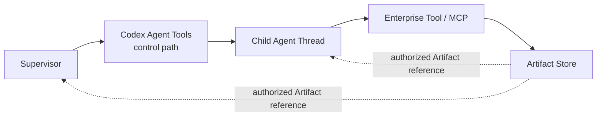

这避免了通过 Agent Message 复制完整数据集所带来的 Token 浪费、上下文污染、版本不明和权限模糊。

Artifact Envelope 只负责描述类型、内容引用、摘要、输入依赖和生产者。平台服务端负责校验、持久化、授权和脱敏，再返回稳定 Artifact ID；浏览器只接收安全 DTO，不接收内部 MCP URI、原始 JSON-RPC ID、本地路径、Secret 或无界 Runtime Payload。

---

### 22. 用失败场景检验安全、恢复与一致性

安全和恢复彼此耦合：一次恢复如果无法确认调用者，就可能越权；一次授权如果没有稳定身份，也无法在重启后继续。比起先列出几十条安全功能，更有效的设计方法是逐个检查真实失败场景。

#### 22.1 Data Agent 被诱导写入生产库

假设用户或数据源中的 Prompt Injection 要求 Data Agent 修改生产表。即使 Supervisor 转发了这项要求，系统也必须在企业 Tool/MCP 边界拒绝。

完整防线依次包括：已认证用户与 Task、已授权 Profile 与 Workspace、服务端绑定的 Tool 身份、只读数据库凭据、Capability/Resource/Action 授权策略、Schema 与查询边界，以及授权策略要求时的人工审批。

Prompt 中的“不要写生产库”只是行为引导；真正的安全属性来自只读凭据和服务端授权。Secret 由平台加密保存，只注入拥有生命周期的 Profile 进程或 Tool 服务，不进入浏览器、Agent Definition、Artifact、Task Knowledge Ledger 或日志。

这一场景也暴露了 21.3 的验证门：如果 Gateway 无法证明调用来自哪个 Task 或受限 Runtime Role，就不能声称已经实现 Agent 级最小权限。

#### 22.2 Artifact 或 Tool 输出包含恶意指令

企业数据、网页、Artifact 和 Tool 输出都属于不可信内容。Runtime 可以把它们用于分析，但不能把其中的文字解释为新的授权或平台政策。

系统需要共同保证：

- Tool 输入输出有 Schema 和大小边界；
- 数据与模型指令在合同上分离；
- Artifact 保留来源和信任级别；
- 高风险动作由系统审批；
- Tool 侧再次校验资源和动作；
- 高风险结论可以要求独立 Agent 或确定性程序验证。

多 Agent 不会自动消除 Prompt Injection。相反，一个被污染的 Agent 可能把错误摘要传给其他 Agent，因此 Agent 间交接必须携带来源和 Artifact 引用，而不是只传“我已经确认”。

#### 22.3 Profile 重启并收到旧进程事件

恢复路径必须从权威所有者重建，而不是从最后一张页面截图继续。

平台需要：

1. 识别旧的 Runtime Instance 和 process generation；
2. 启动同一 Profile 的新 app-server 并重新协商能力；
3. 从 Codex 读取 Thread 权威历史；
4. 根据稳定 Thread、Turn、Item 和 Agent 身份补齐投影；
5. 检查未终结 Run、lease 和 Approval；
6. 决定继续同一个 Run Attempt，还是形成明确失败结果。

当前设计不应假设 Runtime 提供一个跨进程、跨所有事件的全局单调序号。事件身份应由下列信息共同组成：

| 信息 | 作用 |
| --- | --- |
| Runtime Instance / process generation | 隔离旧进程迟到事件 |
| Thread、Turn、Item、Activity ID | 定位 Runtime 中的真实对象 |
| 平台持久 sequence/cursor | 支持持久化、重连和浏览器 replay |
| 对象级幂等键 | 防止相同事件重复应用 |

终态保护也必须按对象定义：Run 的确认终态不能被旧事件回退；已 `Shutdown` 的 Agent Thread 不能被旧活动重新打开；但 `Completed` 的 Agent 可以收到 follow-up，因此不能被当作永久终态。

浏览器重连只需要快照、cursor 和缺失事件 replay。浏览器缓存可以随时丢弃，也不能用来恢复模型上下文。

#### 22.4 一个 Agent 成功，另一个 Agent 失败

部分成功不是异常边角，而是多 Agent 任务的常态。

如果 Data Agent 已产生有效 Artifact，而 Finance Agent 失败：

- 已验证 Artifact 继续保留；
- Supervisor 恢复后可以引用已有成果；
- Data Agent 不应被无条件重跑；
- 最终结果必须披露缺失分析和影响；
- 用户可以选择继续、降级交付或终止；
- Run 结果和各 Agent 最近一次 Turn 结果分别记录。

Tool 是否自动重试取决于语义：

| Tool 类型 | 默认处理 |
| --- | --- |
| 纯读取 | 在有幂等键和授权仍有效时重试 |
| 计算或仿真 | 按输入 hash 去重后重试 |
| Artifact 注册 | 使用内容 hash 与 producer 幂等键 |
| 外部写操作 | 除非存在正式幂等合同，否则不自动重试 |
| 支付、发布、删除 | 人工确认或明确补偿流程 |

“网络错误就重试三次”不能成为平台通用恢复策略。

#### 22.5 子 Agent 不断继续派生

控制 swarm 风险需要多层限制，而不是在 Supervisor Prompt 中写一句“不要创建太多 Agent”。

当前已经可以确认的事实是：Codex V2 提供每个 Session 的并发 spawned Agent Thread 上限；费用、deadline、Tool 次数、资源范围和审批阈值可以由平台与 Tool 边界继续限制。

尚不能确认的是 V2 最大嵌套深度硬限制。当前 `agent_max_depth` 只适用于 V1，V2 会忽略它。因此：

- 文档不能把最大深度写成现成 Runtime 能力；
- Phase 0 必须验证 V2 的真实派生行为；
- 如果业务必须硬限制深度，应优先寻找正式 Runtime Hook；
- 如果官方合同不足，再评估一条集中、可测试且进入 patch map 的最小 Codex seam。

Supervisor Policy 仍应定义停止条件和委派原则，但系统必须确保一次错误判断最多浪费受限资源，不能突破预算和权限边界。

---

### 23. 可观测性、评价与发布门槛

到这里，架构已经从方框图变成了可以测试的责任链。最后还需要回答：用户、运维和评审者分别应该看到什么，以及什么证据足以证明这一阶段可以发布。

#### 23.1 同一执行过程有三种观察视角

| 视角 | 应该看到 | 不应该看到 |
| --- | --- | --- |
| 用户 | 任务阶段、Agent 分工、关键 Tool/审批、Artifact、失败与恢复、证据和成本摘要 | JSON-RPC ID、本地路径、Secret、无界 Runtime Payload |
| 运维 | Profile generation、Thread/Turn 时延、并发 Agent 数、企业 Tool/MCP 边界健康度、lease、恢复、事件延迟、授权拒绝和成本 | Chain-of-thought、其他组织数据、Tool 内部凭据 |
| 审计与评价 | Supervisor Policy 版本、Agent Definition 版本、授权决定、Artifact provenance、Run/Attempt 结果和人工决策 | 无法解释来源的模型内部状态 |

“展示得更多”不等于“更可观测”。正确的目标是让每个角色能够判断系统发生了什么，同时不泄露不属于它的事实。

#### 23.2 分别评价 Agent、Supervisor 和系统

单个 Domain Agent 的专业正确性不能证明 Supervisor 会合理委派；一次高质量的最终报告也不能证明系统能够恢复。因此评价至少分三层：

| 层次 | 重点问题 |
| --- | --- |
| Domain Agent | Tool 选择、专业准确性、Schema、权限合规、失败表达和成本 |
| Supervisor | 是否选择必要 Agent、处理冲突、发现证据缺口、及时停止并引用 Artifact |
| 平台 + Runtime | 授权、取消、审批、重启、重连、并发、幂等和持久成果是否正确 |

指标应服务于这些问题，而不是装饰仪表盘：

- `Duplicate subtask rate`：是否只是让多个 Agent 重复劳动；
- `Evidence coverage`：关键结论是否能够追溯到 Artifact；
- `Unresolved contradiction rate`：冲突是否被发现并处理；
- `Run recovery success rate`：中断后是否恢复同一份事实；
- `Cost per completed task`：并发是否带来真实价值；
- `Unauthorized access denial rate`：负向授权测试是否稳定成立。

第五部分到这里已经把目标架构转化为可以观察、评价和验证的边界。下一步先看哪些失败最可能推翻这些判断，再决定建设顺序。

---

## 第六部分：风险与验证

### 24. 风险与反例决定路线图

正常演示只能说明系统在理想条件下可以工作；反例才会暴露所有权、授权和恢复边界是否真实成立。

| 风险 | 发生方式 | 架构缓解 |
| --- | --- | --- |
| 第二套 Agent Runtime | 平台保存并驱动 Agent Instance | Runtime 权威，平台只保存可重建投影 |
| Catalog/Runtime 双真相 | Agent 已发布，但 Runtime Role 不可发现 | 发布门与 Runtime 可用性分别表达 |
| Profile 配置/Catalog 双真相 | Profile 配置被编辑，同时 Catalog 又声明发布状态 | 发布、安装和可用性分别建模 |
| Supervisor Policy 漂移 | 浏览器参数或后台升级静默改变既有根 Thread | 服务端解析不可变快照，显式绑定与迁移 |
| 第二套 Memory | Blackboard 保存并注入完整上下文 | Task Knowledge Ledger 只存业务记录，并通过 Tool 按需访问 |
| Workspace 越权 | 浏览器提交任意路径 | 服务端解析授权记录并验证目录边界 |
| Tool 调用者身份不明 | MCP Gateway 无法证明调用属于哪个 Task 或 Runtime Role | 验证执行授权上下文；完成前只承诺受限的 Task/Profile 权限 |
| 权限放大 | 子 Agent 沿用 Supervisor 的全部业务权限 | 服务端绑定身份、受限凭据和 Capability/Resource 裁剪 |
| Agent 循环 | V2 子 Agent 持续派生 | 已验证并发上限、预算和 deadline；深度硬限制仍作为显式缺口 |
| Artifact 无法交接或发生泄漏 | 子 Thread 复制聊天文本，或暴露内部 URI、跨组织引用 | Phase 1 建立独立 ID、同 Task 授权读取和安全 DTO |
| Agent 状态被永久封死 | `Completed` 被平台当作 Thread 终态 | 分离 Thread 可用性与当前 Turn 状态，并覆盖 follow-up |
| 状态回退 | 旧 Profile 进程事件迟到 | Runtime generation、稳定对象 ID 和平台 cursor |
| 自动重试产生副作用 | 写操作被重复执行 | 幂等合同、审批和补偿；不做通用盲目重试 |
| Codex 同步困难 | 产品逻辑散落在 Runtime | 保持差异集中、可追踪并优先适配上游结构 |
| 过早平台化 | Studio 或 Task Knowledge Ledger 先于真实协作闭环 | 以 Phase 0/1 的退出证据控制范围 |

相应的反例集至少覆盖：

- 浏览器提交另一个组织的 Profile、Workspace 或 Artifact ID；
- Data Agent 尝试写生产库或导出原始 PII；
- Agent Catalog 已发布，但目标 Profile 中的 Runtime Role 不可发现；
- 已完成的子 Agent 收到 follow-up 并重新运行；
- V2 子 Agent 继续派生，触发并发上限或暴露深度缺口；
- MCP 输出包含 Prompt Injection；
- Run 等待审批时 Profile 重启；
- Tool 成功，但 Artifact Schema 校验失败；
- 浏览器重连后收到旧 Profile 进程的迟到事件；
- Supervisor Policy 更新，但旧 Thread 继续使用原快照；
- 两个 Agent 对同一指标定义给出不同结论。

这些测试直接构成前面每项架构判断能否成立的证据。

---

### 25. 用验证矩阵证明完整责任链

阶段退出不以“页面已经出现”或“数据库表已经创建”为准，而以行为是否穿过真实所有者并在异常条件下保持一致为准。

| 边界 | 正常路径 | 失败路径 | 恢复或并发路径 |
| --- | --- | --- | --- |
| User/Profile | 当前授权 Profile 正确启动 | 非授权 Profile 或组织资源被拒绝 | Phase 2 两用户同时运行不串进程、事件和 Secret |
| Workspace/cwd | Thread 在授权根执行 | path escape 被拒绝 | 重启后保持合法 `cwd` |
| Supervisor Policy | 已发布快照进入根 Thread | 未授权或不支持时明确失败 | 恢复使用原版本，升级不静默漂移 |
| Agent Definition/Runtime Role | 候选经过治理且真实可发现 | 已发布但 unknown role 明确失败 | Profile 配置刷新不污染活动 Agent |
| Agent Control | spawn、message/follow-up、wait | 并发上限与 interruption | Completed 后新 Turn、多 Agent 乱序完成 |
| Run/Attempt | lease、heartbeat、success | cancel、timeout、failure | worker loss 后同 Run 新 Attempt，用户重跑创建新 Run |
| Approval | 请求、批准、继续 | 拒绝、过期 | 重连后仍处于正确 Turn 位置 |
| 执行授权上下文 | 合法 Task 使用受限 Tool | 模型伪造组织/Runtime Role 或越权资源被拒绝 | 重启和并发后仍解析到同一授权主体 |
| MCP Tool | 合法读取和计算 | 授权、Schema 或依赖失败 | timeout、cancel，并仅按语义做幂等重试 |
| Artifact | 校验、注册、跨子 Thread 读取 | Schema 无效或引用未授权 | restart/reload；Phase 2 再验证跨 Run 复用 |
| Task Knowledge Ledger（Phase 3） | propose、search、link | conflict 或来源无效 | 并发提案与替代关系保持一致 |
| 浏览器投影 | 实时事件 | 有界错误 DTO | snapshot、cursor、replay 和迟到事件 |

其中六条责任链尤其关键：

| 需要证明的能力 | 必须穿过的边界 |
| --- | --- |
| Supervisor 策略真实生效 | Published Policy → 平台解析 → Adapter → Codex 根 Thread |
| Domain Agent 真实可用 | Catalog/Manifest → Runtime Role discovery → `spawn_agent` → 子 Thread |
| 企业数据没有越权 | Authenticated Task → 执行授权上下文 → 企业 Tool/MCP 边界 → Resource |
| Artifact 可以交接 | 生产者子 Thread → Artifact Store → 已授权消费者子 Thread |
| 执行可以恢复 | Run lease + Profile generation + Codex history + 持久事件投影 |
| 浏览器看到同一条 Agent 执行轨迹 | 持久事件 → snapshot/cursor/replay → 有界 DTO |

第一条端到端验收用例仍然使用华东新增仓，以便让同一业务场景随阶段增长：

> **Phase 1：**平台把已发布的 Supervisor Policy 绑定到根 Thread；Supervisor 创建 Data Agent 与 Network Agent；Data Agent 通过只读 MCP 产生订单 Artifact；Network Agent 从另一个子 Thread 授权读取这份 Artifact 并完成三方案仿真；高成本仿真进入审批；一个已完成 Agent 收到补充任务后继续执行；最终报告引用关键 Artifact；浏览器刷新和 Profile 重启后，Agent 执行轨迹与报告仍指向同一事实。

Phase 2 在同一用例上增加第二个组织和第二个 Profile 并发运行，验证 Profile 进程、Secret、Workspace、Thread、Artifact 和事件完全隔离；同时验证执行授权上下文，证明 Network Agent 不能读取未经授权的原始数据，Data Agent 也不能伪造其他 Runtime Role。

在这条用例稳定以前，用十个 Agent 或通用 Blackboard 扩大表面规模不会增加架构可信度。

---

## 第七部分：阶段化演进

### 26. 路线图按风险收敛

本章保留从风险推导建设顺序的理由和阶段原型；项目当前接受的阶段名称、位置与
进入/退出条件由 [产品与工程路线图](roadmap.md) 统一维护。

前面的分析改变了建设顺序。Profile Host、Run Orchestrator、Codex Adapter、事件投影和 Inline Artifact 已经存在；下一步集中在几条尚未穿透真实边界的产品链路。

第 24、25 章已经给出完整风险和验证矩阵。2026-08-08 的路线图调整确认：用户创建
Tool、中文 Skill、Agent 和 Supervisor 已经是当前纵向闭环本身，因此单 Profile
Copilot 创作平台与 Runtime 执行轨迹、Artifact、Data Intake、Work State 一起进入
Phase 1；多用户路由和组织治理仍在 Phase 2。Task Knowledge Ledger 继续留在生产数据
证明必要之后。

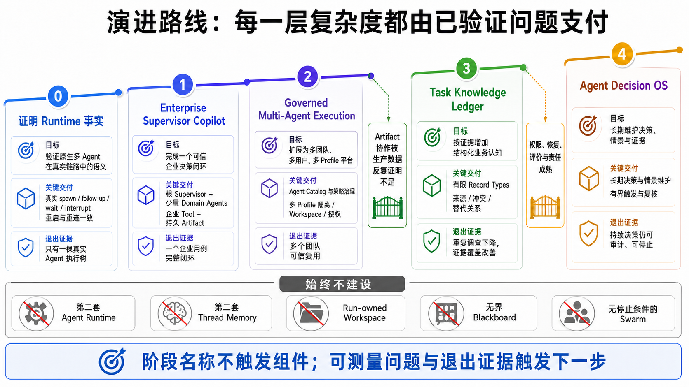

五个阶段不是按名称自动解锁的功能包。每一阶段都要以真实退出证据证明当前风险已经被控制；Task Knowledge Ledger 和 Agent Decision OS 还需要额外的业务触发条件。

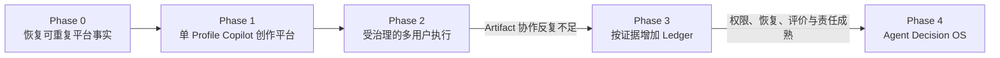

#### 26.1 Phase 0：先证明 Runtime 事实

##### 目标

第一步先恢复数据库、Workspace、Codex 原生多 Agent、真实 Profile、真实 app-server、
Adapter 和 Web 投影的可重复事实，为 Phase 1 的有界 Studio 提供可信基线。

这一步重点回答：

| 问题 | 需要的证据 |
| --- | --- |
| 子 Agent 是否是真实独立 Thread | spawn 后能够读取父子来源、AgentPath 和独立历史 |
| 完成后能否继续工作 | 对 Completed Agent 执行 follow-up，并产生新的 Turn |
| Profile 重启后是否还是同一棵树 | 恢复同一 Thread 历史，不创建平台模拟实例 |
| 浏览器刷新后是否看到同一 Agent 执行轨迹 | 持久事件快照、cursor 和 replay 一致 |
| Runtime 如何限制规模 | 验证 V2 并发上限，并记录最大深度仍为缺口 |
| Runtime Role 不可用时如何失败 | 返回明确 capability/role 错误，不静默改用其他 Agent |

同时完成 Workspace `cwd` 授权的真实链路验证、审批与中断、协议生成门和 Capability Manifest 验证。当前单 Profile 部署仍要覆盖已有组织、Profile、Workspace 和 Artifact 路由的拒绝测试，但真正的“两用户同时路由到两个 Profile 进程”属于 Phase 2，不能在这里提前宣称完成。

##### 本阶段不建设

Phase 0 不建设通用 Blackboard、独立 Planner、Peer Agent Network、平台 Agent Scheduler
或 Tool Catalog fallback。Catalog/Studio 的业务实现进入 Phase 1，不通过 Phase 0 的
启动、迁移和 Runtime 事实门禁提前宣称 ready。

##### 退出条件

- 一条真实 Agent 执行轨迹覆盖 spawn、message/follow-up、wait、interrupt 和 shutdown；
- Completed Agent 再次获得 Turn 的状态投影正确；
- 浏览器刷新和 Profile 重启不产生第二份 Thread 或 Agent 状态；
- V2 并发限制通过真实测试，最大深度能力被准确记录为缺口或形成正式解决方案；
- Runtime Role 不可发现和能力不支持都有明确错误；
- 当前已有授权边界的拒绝测试通过；
- 自动化真实链路验证可以稳定重复。

---

#### 26.2 Phase 1：单 Profile Copilot 创作平台

##### 目标

在一个授权 Profile 中完成 Tool、中文 Skill、Domain Agent、Supervisor、Copilot 的创建、
发布、安装、Runtime discovery 和真实运行闭环。印尼仓网是第一条参考实现，第二个
非供应链案例验证平台没有领域硬编码。

仓网从 Data Agent 和 Network Planning Agent 开始。二者的先后关系由当前 Work State
readiness 和用户问题决定，不由 Supervisor 固定阶段；平台提供 Root 只读 coordination，
Runtime 继续拥有 spawn、follow-up、wait 和 interrupt。

##### 需要同时交付的能力

| 能力 | 第一阶段的最小范围 |
| --- | --- |
| Catalog | Tool、Skill、Agent、Supervisor、Copilot 共享 Draft、Release、精确依赖和 Profile Installation |
| Compiler | 自动生成版本、hash、依赖 lock、Runtime bundle 和 capability requirements |
| Supervisor | 绑定精确 Agent Releases、动态协作原则、部分失败规则和最终交付 |
| Domain Agent | 用户可创建并测试的 Agent Definition，组合 Skills、Tools、数据权限和交付合同 |
| 企业 Tool | 受限 Python MCP SDK、contract test、受控安装和真实 Runtime discovery |
| Skill | 中文方法说明，类型化绑定输入 owner、Tool capability、失败处理和交付件 |
| Work State | 通用 operation/dependency/readiness/deliverable 元数据；领域包拥有 payload |
| Data Intake | Platform 唯一拥有 SourceAsset、mapping、Dataset Release；领域只做 validator/normalizer |
| Artifact | 独立 Artifact ID、Schema、provenance，以及同一 Task 内跨子 Thread 授权读取 |
| Runtime 协作 | 原生 spawn、follow-up、wait、interrupt，不增加平台 Agent 调度器 |
| 产品控制 | 审批、取消、deadline、并发和费用边界，以及安全的 Agent 执行轨迹 DTO |
| 评价 | 一个端到端用例和一组越权、恢复、部分成功反例 |

本方案把 Work State、Data Intake、Artifact 和上下文观测一并前置到 Phase 1。否则
Studio 只是在 Web 创建更多 Prompt，Agent 仍会复制数据、重复扫描和用自然语言传状态。

##### Studio 是有界创作平台

第一阶段允许用户编辑 Tool package、中文 Skill、Agent 和 Supervisor，但不开放任意
shell、无约束在线依赖构建、Plugin Marketplace、长期 Ledger、复杂触发器或跨组织共享。
Catalog Release、Profile Installation 和 Runtime 可用性分别表达；Platform 不通过目录
存在、角色名称或发布记录伪造可执行状态。

##### 退出条件

- 印尼仓网和第二个非供应链用例都从数据读取、跨 Agent 协作到最终交付完整运行；
- 用户不修改 migration、`.mcp.json`、Profile 隐藏配置或手工 hash 即可创建 Copilot；
- 每个关键结论引用至少一个可授权 Artifact；
- Supervisor Policy 版本能够从最终结果追溯到根 Thread；
- Data Agent 在 Prompt 诱导下仍无法写生产库；
- Network Agent 只能读取本 Task 明确授权的 Artifact；
- 一个 Agent 失败时，Supervisor 能复用已完成成果并给出部分结果或明确失败；
- 浏览器刷新和 Profile 重启后，Artifact 与 Agent 执行轨迹仍指向同一事实；
- 成本、时延、重复子任务和证据覆盖率形成基线。

---

#### 26.3 Phase 2：受治理的多用户执行

##### 目标

Phase 1 证明单 Profile 创作和运行能够可信成立；Phase 2 才开放多个团队、多个用户和
多个 Profile 的组织能力。

建设重点包括：

- 持久 Agent Definition、Capability 与授权策略绑定；
- 发布、弃用、评价门和 Runtime Role 可用性；
- Supervisor Policy 生命周期、升级和迁移；
- 已验证的执行授权上下文，使 Runtime Role 权限可以被系统裁剪；
- 多用户动态 Profile 路由和并发隔离；
- Workspace 的多用户授权、共享并发与官方 `cwd` 链路验证；
- Agent 执行投影的重建和历史查询；
- Artifact 跨 Run 复用、保留策略、替代关系和依赖失效；
- recovery、cancel、timeout、approval 的系统级验证；
- 配额、费用和 Agent 执行轨迹可视化。

如果采用 MCP 2025-11-25 中仍属实验性的 MCP Tasks 处理长时间 Tool 请求，也要保持边界：MCP Task 只跟踪一个被延迟执行的 MCP 请求，不替代平台 Task/Run 的用户授权、调度、Run Attempt、审计和交付语义。

##### 组织级 Studio 的开放条件

Phase 1 已交付单 Profile 有界 Studio；Phase 2 的问题是它何时有资格开放跨用户共享、
组织发布和管理。

至少满足以下条件后，才能开放正式发布：

1. Catalog Definition、Profile 配置和 Runtime 可用性三种事实可以分别查看；
2. 写入、验证、安装和回滚拥有稳定、类型化合同；
3. 发布动作经过组织授权和审计；
4. 活动 Thread 不会被后台配置变化静默改变；
5. 现有托管文件路径有明确迁移和退出条件。

在此之前，单 Profile Studio 可以完成受控发布和安装，但不能把直接写 Profile 文件展示
成组织共享或全局安装成功。

##### 退出条件

- 两个用户可以同时路由到各自 Profile，事件、Secret、Thread 和配置不串流；
- Agent Definition 的发布状态与 Runtime 可用性不会混淆；
- 执行授权上下文在重启和并发调用后仍不可伪造；
- Workspace 拥有独立身份、授权与生命周期，Run 只引用执行所用的 Workspace；
- Artifact 脱离生产 Run 后仍可按授权读取；
- Agent 执行投影删除后可以从权威历史重建；
- 高风险 Capability 必须经过系统审批；
- Agent 和 Supervisor 版本、策略与评价结果可以完整追溯。

---

#### 26.4 Phase 3：Task Knowledge Ledger

##### 只有证据出现才启动

Phase 3 只在 Phase 2 的真实数据反复表明下列问题造成明显损失时启动：

- Artifact 不能有效表达细粒度事实、假设和冲突；
- 多个 Agent 经常重复调查；
- 决策依据无法长期审计；
- 中断恢复需要结构化的任务认知；
- 这些问题的业务损失高于新增状态、权限和评价成本。

##### 有限能力与清晰边界

第一版只支持有限 Record Type、来源、状态、替代关系、Evidence/Artifact Link、冲突检测和 Task 范围授权。Runtime 通过类型化 MCP Tool/Resource 执行 `search`、`get`、`propose` 和 `supersede`，检索结果始终有界。

它明确不保存模型隐式 Chain-of-thought，不把全部 Ledger 自动注入 Prompt，不触发任意 Agent，不替代 Codex Memory，也不在没有业务查询证据时引入通用图数据库。

退出条件不只是功能可用，还包括：冲突不再静默覆盖、记录都有创建者和来源、删除 Agent 投影不影响业务记录、泄漏测试通过，并且重复子任务率或证据覆盖率确实改善。

---

#### 26.5 Phase 4：Agent Decision OS

##### 目标与前置条件

只有身份、权限、Artifact、恢复、评价和 Task Knowledge Ledger 已经稳定，平台才从“一次分析”演进为“持续维护决策、情景和证据”。

可能能力包括长期决策 Task、数据变化触发重评、Scenario Branch、Decision Review Date、跨 Task Artifact 复用、评价驱动的 Agent 版本选择，以及有界、可去重、可停止的事件触发。

它要求组织愿意承担持续运行成本，并为每项决策指定责任人。Agent 可以提供证据和建议，不能吸收人的决策责任。

##### 仍然不等于无界自治

Agent Decision OS 不等于自动执行所有企业决策，不等于用模型替代权限或 Workflow，也不等于保存无限量模型记忆。它只是把 Agent 推理、企业能力、确定性控制和可审计决策组织成一套长期系统。

---

#### 26.6 阶段投入与价值

以下不是精确人日估算，而是相对投入和风险排序。

| 阶段 | 主要价值 | 新增复杂度 | 最大风险 | 建议 |
| --- | --- | --- | --- | --- |
| Phase 0 | 证明边界和真实能力 | 低到中 | 发现 Runtime/协议缺口 | 先完成 |
| Phase 1 | 形成可用企业 Copilot | 中 | Artifact 跨 Thread 与数据权限 | 最优产品起点 |
| Phase 2 | 多团队治理和复用 | 中到高 | 执行身份、Profile 隔离与多重配置事实 | 有真实复用需求后做 |
| Phase 3 | 结构化协作认知 | 高 | 第二套 Memory/Workflow | 由指标触发 |
| Phase 4 | 持续决策系统 | 很高 | 自治失控、成本、责任 | 只在成熟后做 |

这一路线要求每一层复杂度都由已验证问题支付。

---

## 第八部分：我们最终得到的架构

### 27. 最终架构与建设顺序都来自责任收敛

最终方案从理想架构出发，为每项责任确定唯一所有者。Codex 根 Thread 承载 Supervisor；平台发布并绑定 Supervisor Policy；Domain Agents 以受治理的 Agent Definition 和 Runtime Role 进入候选；Task/Run Control 与 Codex Runtime 分别拥有确定性执行事实和认知执行；平台从 Runtime 事件重建 Agent 执行投影；Workspace、Artifact 和可选 Task Knowledge Ledger 分别承载执行环境、持久成果和结构化业务认知；企业 Tool/MCP 边界执行授权决定。

> Open Web Codex 是一个企业级、浏览器优先的 Codex 平台：平台负责身份、授权、Profile 生命周期与路由、Workspace、Run、Supervisor Policy、审批、Artifact 和审计；Codex Runtime 负责 Thread、每个 Thread 的 Context、Agent、Tool、Skill、Plugin 和 MCP；根 Thread 在版本化 Supervisor Policy 约束下使用原生多 Agent 机制组织 Domain Agents，通过受治理的企业能力和持久 Artifact 完成协作，并在真实需求成熟后演进出 Task Knowledge Ledger 与 Agent Decision OS。

建设顺序也由这些边界决定。近期先打通 Enterprise Supervisor Copilot：一个绑定版本化 Supervisor Policy 的根 Supervisor、少量 Domain Agents、受限企业 MCP、可以跨子 Thread 交接的 Artifact，以及完整的审批、取消、恢复和评价。多个团队开始复用后，再完善 Agent Catalog、执行授权上下文、多 Profile 路由、版本评价和发布流程；只有 Artifact 协作被数据反复证明不足时，才增加 Task Knowledge Ledger。

现阶段明确不建设第二套 Agent Runtime、第二套 Thread Memory、Run-owned Workspace、依靠 Prompt 的权限、浏览器直通 Runtime 协议、无界 Blackboard，以及没有停止条件的 Agent swarm。Planner Agent、更自由的 Agent Network 和长期 Agent Decision OS 都由可测量问题触发，不随阶段名称自动出现。

---

### 28. 结论

企业多 Agent 平台不是更多 Agent 的集合。只有多个专业能力能够围绕同一目标、同一组可追踪依据和一个可控的执行过程，最终形成一份有人负责的答案，专业分工才真正成为协作。

理想架构指出了 Supervisor、专业 Agent、动态调整、成果共享、运行控制和知识沉淀的必要性；随后对隐藏成本、Runtime 能力和所有权边界的分析，又让这些能力各自回到正确的系统。Codex 继续拥有模型可见的上下文和 Agent 执行，平台集中建设企业身份、授权、任务控制、持久成果与审计。

合理的起点是一条可以真实验证的路径：

1. 一个真实目标；
2. 一个绑定明确 Supervisor Policy 的根 Supervisor；
3. 两个受治理的 Domain Agents；
4. 两类最小权限企业能力；
5. 一组可以跨子 Thread 交接、能够追溯来源的 Artifact；
6. 一个可恢复、可审计、可信的结果。

当这条路径稳定、被用户采用，并且数据证明现有协作方式已经不足时，平台再逐步长出 Agent Catalog、Task Knowledge Ledger 和持续决策能力。这不是对理想架构的妥协，而是让理想架构有条件真正演进出来。

---

> 正文到此结束。以下附录用于架构决策追踪、实施映射、证据索引和设计评审；不影响按正文主线阅读。

## 附录 A：关键架构决策

### A.1 ADR-01：不重新建设 Agent Runtime

#### 决策

复用 Codex Runtime 的 Thread、AgentControl、AgentRegistry、Agent Tools、Context、Memory、Skills、Plugins 和 MCP。

#### 原因

- 当前代码已经拥有这些语义；
- 运行时状态高度耦合；
- 双实现会导致状态分歧；
- 产品关键价值在企业治理和 Web 平台；
- 保持 Codex 子树可持续同步。

#### 代价

- 平台受 Codex 正式能力和协议演进约束；
- 某些 Web 功能必须等待类型化 Runtime Contract；
- 需要维护少量、集中、可重放的 Codex 定制。

#### 被拒绝方案

- 平台自建 Agent Instance Service；
- 浏览器直接管理子 Agent；
- 通过数据库队列模拟 Agent Communication。

---

### A.2 ADR-02：默认使用 Supervisor + Domain Agents

#### 决策

由 Codex 根 Thread 承载 Supervisor，使用原生 Agent Tools 创建专业子 Agent。

#### 原因

- 任务分解具有动态性；
- 企业需要统一责任和最终综合；
- 比 Peer Network 更容易限制成本和权限；
- 与 Codex 当前根 Session Tree 模型一致。

#### 代价

- 根 Supervisor 可能成为上下文和决策瓶颈；
- 需要评价其委派质量；
- 大任务需要 Artifact 和有界摘要减轻上下文负担。

#### 被拒绝方案

- 只用 Router；
- 所有 Agent 对等全连接；
- 平台 Workflow 预先写死全部任务图。

---

### A.3 ADR-03：第一阶段不引入独立 Planner Agent

#### 决策

由 Supervisor 同时承担动态规划、调整和综合。

#### 原因

- 当前职责规模可控；
- 避免两份计划状态；
- 减少一次模型调用和恢复协议；
- 先用评价证明问题存在。

#### 重新评估条件

- 计划需要独立审批或复用；
- 规划和执行需要不同权限；
- 根 Supervisor 规划质量成为主要瓶颈；
- 独立 Planner 的离线评价显著更好。

---

### A.4 ADR-04：Task/Run Control 是确定性控制面

#### 决策

平台 Run Orchestrator 只拥有 Task、Run、Lease、Recovery 和 Approval 等确定性生命周期。

#### 原因

- 这些状态需要数据库事务、幂等和恢复；
- LLM 不适合成为权限和终态所有者；
- Agent 生命周期已经由 Codex 持有。

#### 被拒绝方案

- 让 Supervisor 保存 Run 状态；
- 让 Run Orchestrator 管理 Agent 计划和 Agent Instance；
- 用 Agent 消息作为唯一审计记录。

---

### A.5 ADR-05：Workspace 独立于 Task、Run 和 Thread

#### 决策

Workspace 是独立授权执行根；Thread 持有当前 `cwd`；平台验证其位于授权 Workspace 中。

#### 原因

- 多个 Thread 可以共享同一仓库；
- Run 是尝试，不应拥有 checkout；
- Thread 恢复必须保持 Codex 的 `cwd` 语义；
- Managed Clone/Worktree 有独立生命周期。

#### 被拒绝方案

- 每个 Run 自动创建并拥有 checkout；
- 把 Workspace 当作聊天附件；
- 信任浏览器传入本地路径。

---

### A.6 ADR-06：Artifact 拥有独立持久身份

#### 决策

Artifact 由 Artifact Store 持有独立身份、授权和保留策略；Run/Thread/Turn/Item 仅为 provenance。

#### 原因

- 企业成果需要跨 Run 和 Thread 复用；
- 浏览器刷新和历史恢复需要稳定引用；
- 生产者生命周期不应决定成果生命周期；
- Task Knowledge Ledger 需要引用持久对象。

#### 被拒绝方案

- 以 Run/Thread 为 Artifact 主键范围；
- 把大结果直接写入 Agent 消息；
- 让浏览器直接读取内部 MCP URI。

---

### A.7 ADR-07：Artifact First，Blackboard 分阶段

#### 决策

Phase 1–2 使用 Artifact 和有界摘要协作；Phase 3 在数据证明需要后建设 Task Knowledge Ledger。

#### 原因

- Artifact 已有代码基础；
- 更容易定义 Schema、授权和 provenance；
- 避免提前复制 Memory 和 Workflow；
- 可以用真实指标验证 Blackboard 价值。

#### 被拒绝方案

- 第一天建设通用 Task Knowledge Ledger；
- 保存完整 Agent 思考；
- 用共享数据库记录驱动所有 Agent。

---

### A.8 ADR-08：Agent Definition 不是 Runtime Agent

#### 决策

平台 Agent Definition 负责治理；Codex Runtime Role 和子 Thread 负责执行。

二者通过版本化 `runtime_role_ref` 和可用性验证关联。

在当前受限单 Profile 实现中，代码发布的 Definition/version 还携带不可变、可校验
hash 的 Runtime 指令。只有已绑定显式已发布 Supervisor Policy 的 worker 执行前检查
才可以在 Capability Manifest 确认 `agents.multi_agent@1.0.0` 之后，通过 Profile Host
原子写入受管 Role 文件，并在 Runtime 消费前无跟随重开和校验 hash。受治理的
`thread/start` 与 `thread/fork` 只通过 request-scoped config 显式启用
`features.multi_agent_v2`、设置 V2 并发限制并引用这些精确 Role；不写入 Profile 或
Project 持久配置。新企业功能直接依赖当前 V2 协作合同，不增加 V1 兼容分支，也不为
已有稳定 feature 增加产品私有 capability。Platform 不持久化 Runtime Role 配置投影；
只有 Runtime 事件产生、可删除重建的 Agent 执行投影。普通 Root 会话不携带企业 Role。

这仍是 Runtime 原生 Agent CRUD 缺失期间的过渡实现。长期由类型化 app-server V2
Agent 生命周期接口拥有写入、校验、发现与 reload，整改顺序见
`docs/agent-capability-lifecycle-plan.md`。

#### 原因

- 业务目录需要所有者、评价和合规；
- Runtime 需要真实配置和发现；
- 混为一谈会造成 Catalog 与执行状态双真相。

#### 被拒绝方案

- 一个 `agents` 表同时保存 Prompt、运行状态和子 Thread；
- 平台在通用启动、浏览器 CRUD 或未经类型化审计的隐藏 Profile 文件修改中“发布”
  Agent；
- Catalog 显示的能力不验证 Runtime 可用性。

---

### A.9 ADR-09：权限由系统边界强制执行

#### 决策

Agent/Prompt 声明用于行为引导，真正授权由平台、Workspace、MCP Gateway 和企业系统执行。

#### 原因

- Prompt 不是安全边界；
- 多 Agent 委派可能放大权限；
- 企业数据需要资源级策略；
- 高风险动作需要审计和审批。

#### 被拒绝方案

- “告诉 Agent 不要访问”；
- Supervisor 一次授权后所有子 Agent共享；
- MCP 连接成功即表示所有 Tool 都可用。

---

### A.10 ADR-10：Context Assembler 不是 Prompt 注入服务

#### 决策

平台只提供有界任务资源清单、Artifact Reference 和 Knowledge Tool；Runtime 决定模型上下文的检索和压缩。

#### 原因

- Codex 拥有 Context 和 compaction；
- 静默 Prompt 拼接不可审计；
- 平台不了解 Runtime 当前上下文预算；
- 统一通过 Tool/Resource 更容易授权和测试。

#### 被拒绝方案

- 每轮把数据库中全部 Task 状态拼入 System Prompt；
- 平台保存“模型下一轮上下文”；
- 浏览器决定要注入哪些 Memory。

---

### A.11 ADR-11：Supervisor Policy 使用不可变版本绑定根 Thread

#### 决策

企业 Supervisor 的长期责任由平台发布和解析为不可变 Policy Snapshot，通过正式 `thread/start.developerInstructions` 进入 Codex 根 Thread。Task 与根 Thread 记录所用版本；恢复沿用原快照，升级需要显式迁移。

#### 原因

- 根 Thread 已经拥有多 Agent 执行机制，但默认指令不包含企业业务责任；
- 临时 Prompt 无法稳定复现、审计或评价；
- 浏览器传入的协作模式不能成为企业政策事实源；
- Policy 变化不应在后台改变活动 Thread。

#### 被拒绝方案

- 在 WebApp 中硬编码 Supervisor Prompt；
- 每轮由浏览器提交完整 `developerInstructions`；
- 后台升级 Policy 后静默影响所有历史 Thread；
- 新建一个 Supervisor 微服务接管根 Thread。

---

### A.12 ADR-12：企业 Tool 权限依赖服务端执行授权上下文

#### 决策

用户、组织、Profile、Task 和 Agent 执行身份必须由系统边界绑定，模型只提交业务参数。只有当 Runtime 到企业 Tool/MCP 边界的正式路径能够携带或推导不可伪造的执行身份时，平台才承诺 Runtime Role 级 Capability 与 Resource 裁剪。

#### 原因

- Prompt 和 Tool 参数都不是可信身份来源；
- 子 Agent 的 Runtime sandbox 继承不等于企业数据权限继承；
- 重启、并发和 follow-up 后仍需解析到同一授权主体；
- 当前尚未验证 MCP Gateway 可以稳定取得 V2 AgentPath/Runtime Role。

#### 当前阶段边界

Phase 1 使用 Task/Profile 级受限连接、只读凭据和明确资源范围；Phase 2 在完成协议验证后引入 Runtime Role 级授权。若上游合同不足，只允许增加集中、类型化、可测试并进入 Codex patch map 的最小 seam。

#### 被拒绝方案

- 让模型提交 `organization_id`、`profile_id` 或任意 Runtime Role；
- Supervisor 获得一次授权后，所有子 Agent 自动共享全部权限；
- MCP 连接成功就表示其中所有 Tool 和资源都已授权。

---

## 附录 B：实施映射、边界与合同草案

### B.1 架构概念到当前代码的映射

架构概念不直接等同于代码对象。映射的目的不是为每个架构名词新建一个同名服务，而是寻找已经拥有相应生命周期和语义的代码边界；只有不存在合适所有者时，才增加新组件。

| 架构概念 | 当前/目标代码位置 | 状态 |
| --- | --- | --- |
| Root Supervisor | Codex 根 Thread / Session | Runtime 载体已有；版本化 Supervisor Policy 与 Adapter 注入未完成 |
| Runtime Agent Control | `codex/.../core/src/agent/control.rs` | 已有 |
| Runtime Agent Registry | `codex/.../core/src/agent/registry.rs` | 已有 |
| Runtime Role（Codex Agent Role） | `codex/.../core/src/agent/role.rs`、`config/agent_roles.rs` | 已有内置和自定义发现基础 |
| Multi-agent Tools | `codex/.../tools/handlers/multi_agents_*` | 已有，真实 Web Agent 执行轨迹仍需链路验证 |
| V2 Agent 规模限制 | `codex/.../core/src/config/mod.rs` | 并发 Thread 上限已有；`agent_max_depth` 仅适用于 V1，V2 深度硬限制未解决 |
| Profile Host | `apps/web/crates/profile-host` | 已有骨架 |
| Typed Runtime Bridge | `apps/web/crates/codex-adapter` | 已有，继续收窄并能力门控 |
| Task/Run Control | `apps/web/crates/run-orchestrator` + Server | 已有较强骨架 |
| Event Projection | `apps/web/server/src/event_projection.rs` | 已有，增加 Agent 执行轨迹 |
| Browser Agent UI | `apps/web/src` | 局部事件 UI 已有，需稳定 DTO |
| Profile Agent 设置 | `profile_content.rs` + `SettingsAgentsSection.tsx` | 分支已有托管配置文件 CRUD；是 Profile 管理路径，不是企业 Catalog 发布合同 |
| Workspace | Platform/Git/Adapter | 已具备独立身份、授权和显式托管生命周期；Run 只保存引用；现有执行根登记、真实 worktree 和共享并发验证待补 |
| Artifact Store | Artifact routes/contracts/event projection | 有同 Run/Thread 垂直切片；Phase 1 需独立 ID 和跨子 Thread 读取 |
| 执行授权上下文 | 平台 + Runtime/MCP 边界 | 目标合同；AgentPath/Runtime Role 的不可伪造传递尚未验证 |
| Agent Catalog | 平台新增能力 | 未建设 |
| Task Knowledge Ledger | 平台 + MCP package | Phase 3，不应提前建设 |

知识图谱中的层次也与此边界一致：

- `AgentControl`、`AgentRegistry` 位于 Codex App-Server 与 Runtime 层；
- `ProfileHost`、`RealCodexAdapter` 位于 Profile Host 与适配层；
- `RunOrchestrator` 位于 Workspace、Runner 与 Git 层。

这进一步说明：它们不是同一个可以任意互换的“Task Runtime”组件。

---

### B.2 哪些变化应该进入 Codex，哪些不应该

项目目标不是零 Codex Diff，而是小而明确的保留缝隙。

#### B.2.1 适合进入 Codex

- Runtime 通用的 Agent 协调能力；
- Runtime Role 解析和配置层；
- 生成的协议类型；
- 通用 capability manifest；
- Provider transport/model discovery 的必要扩展；
- app-server 的版本化 Runtime API；
- TUI 中与保留 Provider 能力等价的体验。

如果 V2 深度硬限制或 Tool 调用者 provenance 无法通过现有正式合同实现，它们也只能以通用 Runtime 能力或最小 app-server seam 进入 Codex；不能把同一语义分别散落到 Web 路由和 Prompt 中。

#### B.2.2 适合留在 Platform

- 用户与组织；
- Agent Definition 的企业治理元数据；
- Policy Binding；
- Supervisor Policy 的发布、Snapshot 和 Thread 绑定；
- Task/Run/Approval；
- Workspace grant；
- 执行授权上下文的企业主体与资源策略；
- Secret management；
- Artifact authorization；
- Browser DTO；
- Audit；
- Git orchestration；
- 多用户 Profile routing。

#### B.2.3 适合做成 Skill/Plugin/MCP

- Data Agent 的工作方法；
- Network Planning Agent 的能力说明；
- 数据查询 Tool；
- 仿真 Tool；
- Agent Catalog 的有界查询；
- Task Knowledge Ledger 的类型化 tools/resources；
- 企业系统连接器。

#### B.2.4 变更前检查

如果必须修改高变动 Codex 代码：

1. 运行 `scripts/codex-upstream-status.sh`；
2. 检查 `docs/custom-codex-patch-map.md`；
3. 把差异分类为 `retain-core`、`upstreamed`、`move-out` 或 `drop`；
4. 优先使用官方结构；
5. 只保留文档化、集中、可测试的 seam；
6. 协议变化后重新生成 Schema 和 TypeScript；
7. 同时验证 Web 与 Codex 契约。

---

### B.3 每个功能提案必须回答的七个问题

以后无论建设 Agent Studio、Task Knowledge Ledger 还是新 Domain Agent，都先写一页边界说明。

#### B.3.1 Owner

哪个层拥有这个事实和生命周期？

#### B.3.2 Typed Input

输入是否有稳定 Schema？是否包含浏览器不应知道的字段？

#### B.3.3 Typed Output

输出是否有界、可校验、可版本化？

#### B.3.4 Capability Gate

Runtime、Profile 和平台如何证明该能力存在？

#### B.3.5 Persistence Scope

数据属于：

- Runtime Thread；
- Profile；
- Task；
- Run；
- Workspace；
- Artifact；
- Organization；

中的哪一个？

#### B.3.6 Failure Lifecycle

是否覆盖：

- failure；
- rejection；
- cancellation；
- timeout；
- interruption；
- restart；
- retry；
- concurrency；
- out-of-order delivery？

#### B.3.7 Validation Path

测试是否穿过真正的所有权边界？

例如 Runtime Role 能否使用，不能只测平台 Catalog 返回 200，还必须建立真实 Codex Thread 并完成 spawn。

---

### B.4 目标数据与合同草案

本节保留实现评审所需的字段级草案。它描述目标边界，不表示当前数据库已经存在这些表，也不要求最终实现逐字采用这些名称。进入开发前仍需与正式平台 Contract、生成的 Codex Protocol 和迁移计划对齐。

#### B.4.1 Supervisor Policy

`supervisor_policy_versions` 保存不可变发布版本：

```text
id
organization_id
stable_key
version
status
developer_instructions
content_hash
applicable_scope
created_by
created_at
published_at
deprecated_at
```

`supervisor_policy_bindings` 保存一次实际解析结果：

```text
id
organization_id
task_id
root_thread_id
policy_version_id
snapshot_hash
bound_at
migrated_from_binding_id
```

发布后的 `developer_instructions` 不原地修改。恢复 Thread 时按 binding 读取原版本；迁移产生新的 binding 和审计记录。

目标 Snapshot 可以被表达为：

```json
{
  "policyId": "supervisor_policy_...",
  "version": 4,
  "contentHash": "sha256:...",
  "developerInstructions": "Maintain the decision objective...",
  "scope": {
    "project": "project_...",
    "useCase": "warehouse-network-evaluation"
  }
}
```

浏览器可以请求一个有权使用的 Policy Key，但不能提交这份 Snapshot 的组织身份、发布状态或指令正文。

#### B.4.2 Agent Governance

`agent_definitions` 保存企业治理事实：

```text
id
organization_id
stable_key
version
display_name
description
owner_team
runtime_role_ref
input_schema_ref
output_schema_ref
risk_level
status
created_at
published_at
deprecated_at
```

唯一性建议为 `(organization_id, stable_key, version)`。`capabilities`、`agent_capability_bindings` 和 `policy_bindings` 分别表达版本化能力、Agent 所需能力以及组织授权条件；它们不能保存“当前 Runtime 中某个 Tool 一定可调用”这样的动态事实。

模型查询候选时只提交业务要求：

```json
{
  "requiredCapabilities": ["data.query"],
  "riskCeiling": "medium",
  "limit": 5
}
```

平台从当前执行绑定推导组织、Profile 和 Task，再返回有界候选：

```json
{
  "candidates": [
    {
      "definitionId": "agent_def_...",
      "definitionVersion": 3,
      "runtimeRole": "enterprise-data-analyst",
      "runtimeAvailability": "available",
      "capabilities": ["data.query", "data.analysis"],
      "constraints": {
        "readOnly": true,
        "approvalRequired": ["data.export"]
      }
    }
  ]
}
```

失败至少区分 `not_authorized`、`role_not_discoverable`、`dependency_unavailable` 和 `capability_not_supported`，不能全部折叠成空数组。

#### B.4.3 Runtime Agent Projection

`agent_execution_projections` 可以保存：

```text
organization_id
task_id
run_id
runtime_instance_id
root_thread_id
agent_thread_id
agent_path
parent_agent_path
runtime_role
thread_availability
current_activity
last_turn_id
last_item_or_activity_id
last_platform_event_sequence
observed_at
```

约束是：

- 数据只从 Runtime 事件和权威历史产生；
- `runtime_instance_id` 隔离进程 generation；
- `last_platform_event_sequence` 是平台落库位置，不冒充 Runtime 全局时钟；
- `thread_availability` 与 `current_activity` 分开；
- `Completed`、`Errored` 和 `Interrupted` 可以被新的 follow-up 更新；
- 投影可以删除并重建，不能驱动 spawn 或恢复。

#### B.4.4 Artifact

`artifacts` 保存成果自身：

```text
id
organization_id
project_id
kind
schema_version
content_locator
content_hash
size_bytes
status
authorization_scope
retention_policy
created_at
superseded_by
```

`artifact_provenance` 保存生产来源：

```text
artifact_id
task_id
run_id
thread_id
turn_id
item_id
runtime_agent_path
tool_name
created_at
```

`artifact_dependencies` 保存 Artifact 间的输入、派生和替代关系。生产 Run、Thread、Turn 和 Item 都不是 Artifact 的授权边界。

目标 Envelope 示例：

```json
{
  "schema": "open-web-artifact.v1",
  "kind": "network_plan.v1",
  "title": "华东仓网方案比较",
  "summary": "比较新增区域仓、干线改造与混合方案",
  "content": {
    "mediaType": "application/json",
    "resourceRef": "internal-mcp-resource-reference"
  },
  "inputs": ["artifact_orders_...", "artifact_costs_..."],
  "producer": {
    "threadId": "runtime-thread-reference",
    "agentPath": "/root/network",
    "tool": "network.optimize"
  }
}
```

`resourceRef` 只存在于 Runtime 到平台服务端的内部合同中。平台服务端完成 Schema、授权、大小、来源和内容校验后，返回独立 Artifact ID 和浏览器安全 URL。

#### B.4.5 执行授权上下文（Execution Authorization Context）

这是服务端内部安全上下文，不是模型可见 Tool 参数：

```json
{
  "authenticatedSubjectRef": "server-session-binding",
  "organizationId": "org_...",
  "profileId": "profile_...",
  "taskId": "task_...",
  "runtimeBinding": {
    "threadId": "thread_...",
    "agentPath": "/root/data",
    "runtimeRole": "enterprise-data-analyst"
  },
  "capability": "data.query",
  "resourceScope": "analytics.warehouse_readonly",
  "expiresAt": "..."
}
```

当前未验证的部分是 `runtimeBinding` 如何通过正式 Runtime/MCP 路径不可伪造地建立。实现可以改变字段或载体，但不能把这些值退回给模型填写。

#### B.4.6 可选 Task Knowledge Ledger

只有 Phase 3 触发条件成立后，才增加：

```text
knowledge_records
  id, task_id, kind, statement, structured_value,
  confidence, status, version, creator, supersedes_id

knowledge_evidence_links
  knowledge_record_id, artifact_id, relation, locator

decision_records
  id, task_id, question, decision, rationale,
  status, decided_by, decided_at, review_at

decision_inputs
  decision_id, knowledge_record_id, relation
```

关系表已经足以表达来源、替代和决策输入。只有真实查询规模证明关系查询成为瓶颈时，才评估图数据库。

Runtime Tool 对 Task Knowledge Ledger 只能提出结构化 Proposal；平台负责 Task 授权、Schema、Artifact 来源、版本、冲突和审计。它始终不能保存模型隐式推理过程。

---

## 附录 C：本地代码与架构依据

### C.1 项目权威文档

- [`AGENTS.md`](../AGENTS.md)
- [`docs/README.md`](README.md)
- [`docs/product-vision.md`](product-vision.md)
- [`docs/product-design.md`](product-design.md)
- [`docs/architecture.md`](architecture.md)
- [`docs/security-model.md`](security-model.md)
- [`docs/capability-baseline.md`](capability-baseline.md)
- [`docs/roadmap.md`](roadmap.md)
- [`docs/development-plan.md`](development-plan.md)
- [`docs/domain-agent-extension-architecture.md`](domain-agent-extension-architecture.md)
- [`docs/codex-upstream-sync.md`](codex-upstream-sync.md)
- [`docs/custom-codex-patch-map.md`](custom-codex-patch-map.md)

### C.2 Codex Runtime

- [`codex/codex-rs/core/src/agent/control.rs`](../codex/codex-rs/core/src/agent/control.rs)
- [`codex/codex-rs/core/src/agent/registry.rs`](../codex/codex-rs/core/src/agent/registry.rs)
- [`codex/codex-rs/core/src/agent/role.rs`](../codex/codex-rs/core/src/agent/role.rs)
- [`codex/codex-rs/core/src/config/agent_roles.rs`](../codex/codex-rs/core/src/config/agent_roles.rs)
- [`codex/codex-rs/core/src/config/mod.rs`](../codex/codex-rs/core/src/config/mod.rs)
- [`codex/codex-rs/protocol/src/protocol.rs`](../codex/codex-rs/protocol/src/protocol.rs)
- [`codex/codex-rs/core/src/tools/handlers/multi_agents_spec.rs`](../codex/codex-rs/core/src/tools/handlers/multi_agents_spec.rs)
- [`codex/codex-rs/core/src/tools/handlers/multi_agents_v2`](../codex/codex-rs/core/src/tools/handlers/multi_agents_v2)

### C.3 Open Web Codex Platform

- [`apps/web/crates/profile-host/src/lib.rs`](../apps/web/crates/profile-host/src/lib.rs)
- [`apps/web/crates/codex-adapter/src/real.rs`](../apps/web/crates/codex-adapter/src/real.rs)
- [`apps/web/crates/run-orchestrator/src/lib.rs`](../apps/web/crates/run-orchestrator/src/lib.rs)
- [`apps/web/crates/run-orchestrator/src/scheduler.rs`](../apps/web/crates/run-orchestrator/src/scheduler.rs)
- [`apps/web/crates/platform-contracts/src/lib.rs`](../apps/web/crates/platform-contracts/src/lib.rs)
- [`apps/web/server/src/event_projection.rs`](../apps/web/server/src/event_projection.rs)
- [`apps/web/server/src/routes/artifacts.rs`](../apps/web/server/src/routes/artifacts.rs)
- [`apps/web/server/src/routes/profile_content.rs`](../apps/web/server/src/routes/profile_content.rs)
- [`apps/web/src/features/settings/components/sections/SettingsAgentsSection.tsx`](../apps/web/src/features/settings/components/sections/SettingsAgentsSection.tsx)

---

## 附录 D：外部资料

### D.1 Agent 与 Workflow

- Anthropic, [Building effective agents](https://www.anthropic.com/engineering/building-effective-agents)
- Anthropic, [How we built our multi-agent research system](https://www.anthropic.com/engineering/multi-agent-research-system)
- Google Cloud, [Choose a design pattern for your agentic AI system](https://docs.cloud.google.com/architecture/choose-design-pattern-agentic-ai-system)
- OpenAI Agents SDK, [Agent orchestration](https://openai.github.io/openai-agents-python/multi_agent/)

### D.2 Codex 多 Agent

- OpenAI, [Multi-agent — Codex](https://learn.chatgpt.com/docs/agent-configuration/subagents.md)

### D.3 MCP

- Model Context Protocol, [Versioning](https://modelcontextprotocol.io/docs/learn/versioning)
- Model Context Protocol, [Specification 2025-11-25](https://modelcontextprotocol.io/specification/2025-11-25)
- Model Context Protocol, [Experimental Tasks](https://modelcontextprotocol.io/specification/2025-11-25/basic/utilities/tasks)

MCP 2025-11-25 是当前正式协议版本，其中 Tasks 仍属于实验性能力。MCP Task 用于包装一次延迟执行的 MCP 请求并支持轮询或稍后取回结果；它不拥有企业平台 Task/Run 的用户授权、调度、Attempt、审计和交付生命周期。

### D.4 Durable Workflow

- Temporal, [Workflow](https://docs.temporal.io/workflows)
- Temporal, [Event History](https://docs.temporal.io/encyclopedia/event-history)

### D.5 Blackboard

- Lee D. Erman et al., [The Hearsay-II Speech-Understanding System](https://www.ijcai.org/Proceedings/77-2/Papers/055.pdf)
- Penny Nii, [The Blackboard Architecture: Example Systems](https://wrap.warwick.ac.uk/id/eprint/60797/12/WRAP_cs-rr-101.pdf)

### D.6 Agent Security

- OWASP, [AI Agent Security Cheat Sheet](https://cheatsheetseries.owasp.org/cheatsheets/AI_Agent_Security_Cheat_Sheet.html)

---

## 附录 E：后续设计评审检查表

每次新增多 Agent 功能时，逐项回答：

- [ ] 是否明确唯一权威所有者？
- [ ] 是否标明这是 main 基线、分支已验证能力、目标设计还是待验证缺口？
- [ ] 是否复用了 Codex 原生 Thread/Agent/Tool 语义？
- [ ] 是否避免平台成为第二套 Runtime 或 Memory？
- [ ] 输入输出是否类型化、有界、可版本化？
- [ ] 是否有正式 capability gate？
- [ ] Supervisor Policy 是否由服务端解析为不可变快照并绑定根 Thread？
- [ ] 浏览器的协作模式是否无法覆盖或削弱 Supervisor Policy？
- [ ] 浏览器是否只看到安全 DTO？
- [ ] Secret 是否完全留在拥有生命周期的服务边界？
- [ ] Workspace `cwd` 是否经过授权和 containment 校验？
- [ ] 执行授权上下文是否由系统绑定，而不是由模型提交组织、Task 或 Runtime Role？
- [ ] 子 Agent 是否按 Capability 和 Resource 使用最小权限？
- [ ] 是否定义 success、failure、rejection、cancel、timeout、interruption？
- [ ] 是否覆盖 restart、reconnect、retry、concurrency 和乱序？
- [ ] Run 恢复 Attempt 与用户重新执行的新 Run 是否明确区分？
- [ ] Agent Thread 可用性与当前 Turn 状态是否分开？
- [ ] 是否验证 Completed Agent 接收 follow-up 后重新运行？
- [ ] Artifact 是否拥有独立身份、provenance 和跨子 Thread 授权读取？
- [ ] Agent Definition 是否与 Runtime Agent 明确分离？
- [ ] 现有 Profile Agent 设置是否不会与 Catalog 发布状态形成双重事实源？
- [ ] Catalog 中的能力是否经过 Runtime 可用性验证？
- [ ] 是否只声明已经验证的 Agent 并发、深度、费用和时限约束？
- [ ] 是否有真实 app-server 端到端验证？
- [ ] 是否有跨用户、跨组织拒绝测试？
- [ ] 新复杂度是否由已测量问题触发？

---

## 附录 F：理想架构组件关系

下面的逻辑图展开第三章“先把理想能力想完整”时的七个能力平面，帮助读者回看最初需求如何覆盖体验、控制、认知、专家、成果、执行和企业集成。它是**所有权收敛之前的能力视图**，不是第 17 章目标架构的同义图。

尤其需要注意：图中相邻不代表由同一个系统拥有。Codex Runtime 负责 Thread、Agent、Tool 与 sandbox 语义；平台的 Workspace/Runner/Git 负责授权执行根和资源生命周期。Task Knowledge Blackboard 也仍是理想能力名称，目标演进顺序是 Artifact First，再按证据增加 Task Knowledge Ledger。

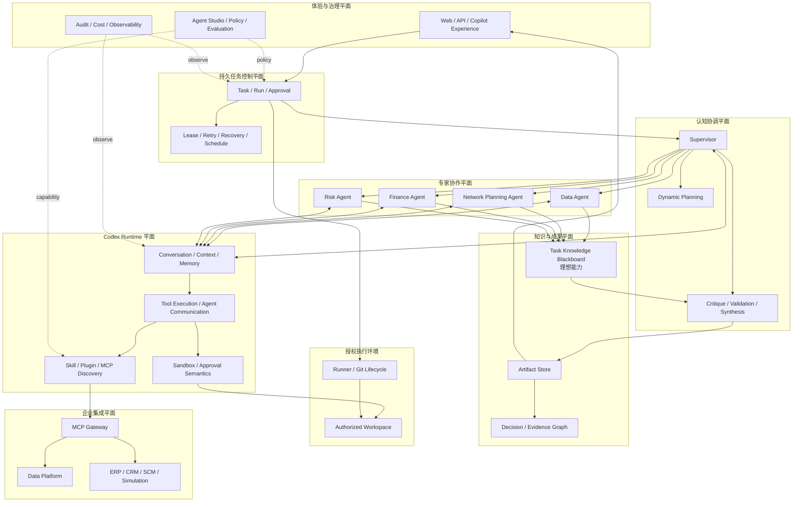
