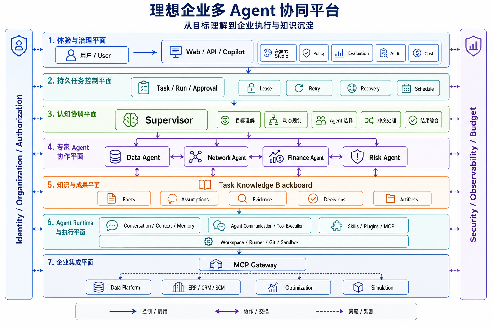
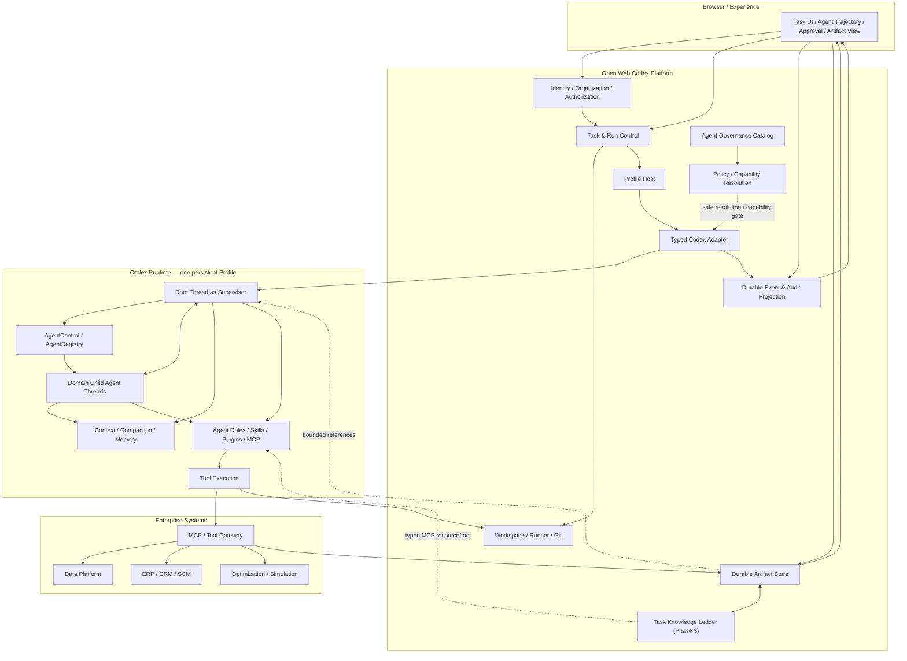
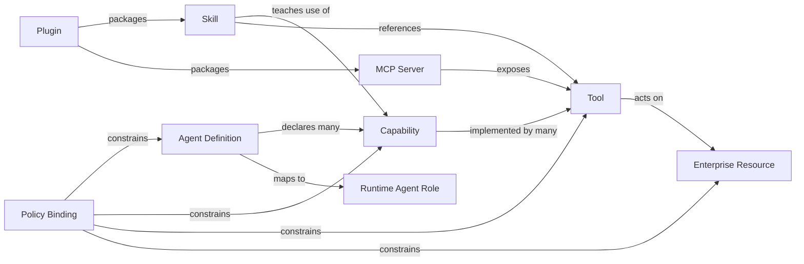
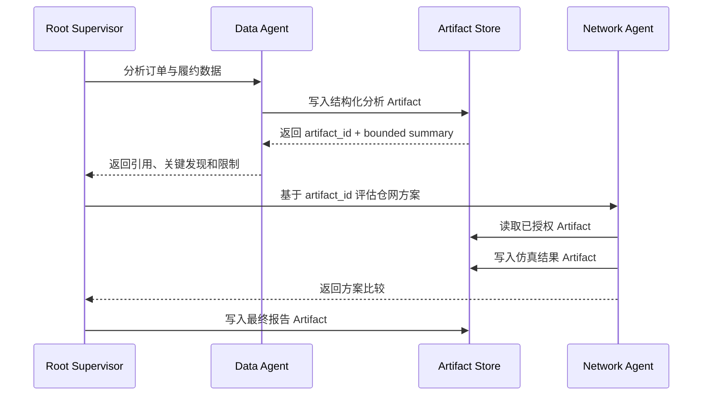
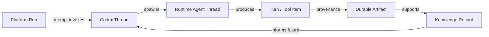
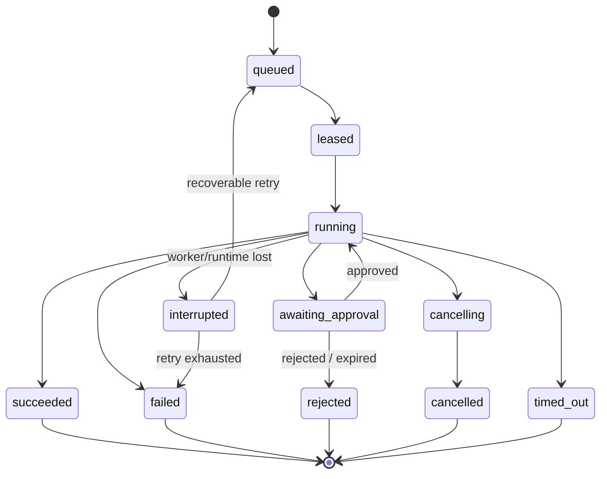
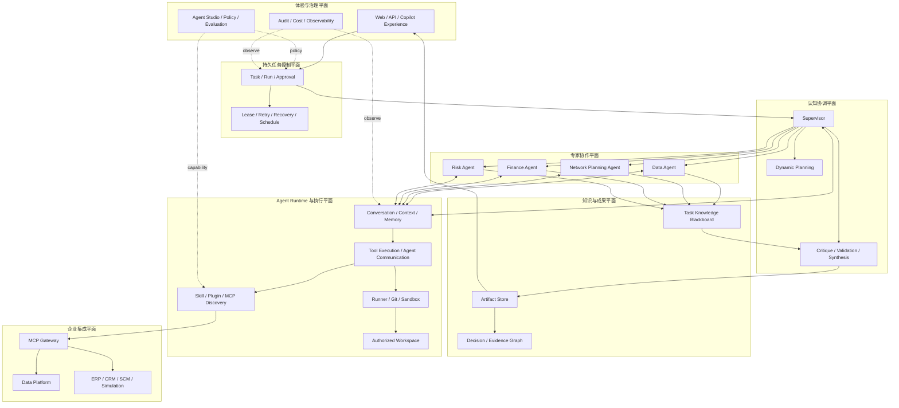

# 从企业 Copilot 到 Agent Decision OS

## 企业多 Agent 协同平台的架构推演与落地路径

> 文档性质：架构推演与演进设计报告
>
> 适用范围：企业级、多用户、可治理的多 Agent 协同平台
>
> 阅读方式：先从业务问题推导理想能力，不预设技术选型；再引入现有系统、实现成本和演进约束，逐步收敛到可落地架构

---

# 0. 从一个具体的企业决策开始

假设一家零售企业的经营负责人提出一个问题：

> 基于最近两年的订单、履约和仓网数据，我们是否应该在华东新增一个区域仓？

这句话很短，但它不是一个简单的查询问题。

一个可以进入管理会议的答案，至少要解释：

- 华东订单增长是真实趋势，还是短期活动造成的波动；
- 当前仓网的容量和时效瓶颈到底在哪里；
- 新建仓、改造现有干线和建设前置仓分别会带来什么结果；
- 每种方案的建设成本、运营成本和回收周期；
- 需求不及预期时，哪一种方案风险最低；
- 最终建议依赖哪些数据和假设，什么变化会使建议失效。

这已经很像一个真实咨询项目：需要数据分析、网络规划、财务测算和风险判断，最终还要有人把这些工作组织成一个一致的结论。

如果只让一个通用助手完成全部工作，它也许能写出一份结构完整的报告，但随着问题深入，几个限制会逐渐出现：

- 它要同时理解多个专业领域；
- 它拥有的工具和数据权限越来越多；
- 大量数据、计算过程和报告文本挤在同一个上下文中；
- 某个环节出错时，很难独立复核；
- 很难知道结论究竟来自数据、假设，还是语言模型的推断。

于是，一个很自然的想法出现了：

> 与其让一个助手扮演所有专家，是否可以让多个专业 Agent 分工完成？

多 Agent 平台的推演，就从这个看似简单的想法开始。

---

# 第一部分：先把问题想完整

# 1. 从专业分工到真正协作

针对新增华东仓的问题，我们可以先按照专业领域拆分：

- **Data Agent**：分析订单分布、履约时效、SKU 周转和客户增长；
- **Network Planning Agent**：分析仓网结构、运输路径、容量和服务半径；
- **Finance Agent**：计算建设成本、运营成本、现金流和回收周期；
- **Risk Agent**：评估需求波动、选址风险、供应商依赖和合规。

最直接的分工方式看起来很简单：

```text
同一个问题
    ├── Data Agent
    ├── Network Planning Agent
    ├── Finance Agent
    └── Risk Agent
```

四个 Agent 并行工作，然后把四份报告拼在一起。

这比单 Agent 有了更清晰的专业边界，却仍然不是真正的协作。因为各专家开始工作以后，很快会遇到依赖关系：

1. Data Agent 发现，华东订单增长主要来自两次短期促销；
2. 这意味着 Finance Agent 不能直接采用历史增长率，而要重做保守、基准和激进三种情景；
3. Network Planning Agent 又发现，新增仓并非唯一解，改造现有干线可能以更低成本解决大部分时效问题；
4. Risk Agent 指出，激进增长情景依赖一个尚未签约的大客户；
5. 于是网络方案和财务模型都需要重新计算；
6. 最终建议只能是“满足某些条件时新增仓”，而不是简单的“建”或“不建”。

到这里，第一个架构需要自然出现了：系统中必须有一个角色持续理解总目标，根据中间结果调整分工，并对最后的结论负责。本文暂时把这个角色称为**协调者**；在后面的架构中，我们会把它正式定义为 Supervisor。

第二个需要也随之出现：Agent 之间传递的不能只是“我分析完了”或一段无法复核的自然语言。Finance Agent 需要知道 Data Agent 使用了哪份数据，Network Planning Agent 需要复用相同的需求情景，最终报告还要能够指回原始计算结果。因此，分析结果必须成为可以被引用、校验和追踪来源的共享成果。

第三个需要来自实际运行：数据查询可能失败，仿真可能持续数十分钟，敏感数据导出可能需要审批，用户也可能中途取消任务。理解和判断可以具有不确定性，但权限、状态、取消、恢复和审计不能依靠 Agent 自己记住。

因此，问题已经从“多启动几个 Agent”变成了三件相互关联的事：

```text
协调问题：如何组织专业分工
+
成果问题：如何让中间成果可靠流动
+
运行问题：如何让整个执行过程可控
```

由此得到本文的第一个判断：

> 多 Agent 平台的核心不是 Agent 数量和并发，而是动态分工、成果传递、冲突处理、运行控制和责任收敛。

---

# 2. 几种常见协作方式及其适用边界

## 2.1 单 Agent + 很多工具

这是成本最低的起点。

它的优势是：

- 上下文集中；
- 不需要跨 Agent 协议；
- 调试路径短；
- 适合能力数量有限、任务边界清晰的场景。

但当工具越来越多时，单 Agent 会承担过多职责：

- Prompt 变长；
- 工具选择空间膨胀；
- 不同业务权限混在同一个执行身份中；
- 专业方法互相干扰；
- 一个上下文同时承载目标、数据、分析过程和长结果；
- 很难独立评价某个专业环节。

因此，单 Agent 是合理的基线，但不是所有企业决策问题的终点。

## 2.2 固定 Workflow

固定流程擅长处理已知路径：

```text
读取数据 -> 计算指标 -> 生成报告 -> 审批 -> 发布
```

它具备确定性、可恢复、可审计等优势。

问题在于，复杂决策的路径经常无法预先穷举。新增仓问题可能需要物流优化，也可能因为数据质量不足而先做数据治理；可能需要财务测算，也可能在选址合规检查时提前终止。

Anthropic 在 [Building effective agents](https://www.anthropic.com/engineering/building-effective-agents) 中区分了两类系统：

- Workflow 由预定义代码路径组织模型和工具；
- Agent 由模型根据过程中的信息动态决定下一步。

这不是“Workflow 或 Agent”二选一，而是在提醒我们：

> 确定性工作流应该管理确定性生命周期；未知问题的分解和工具选择才交给模型。

## 2.3 Router + 专家 Agent

Router 可以按照问题类型把请求交给一个专家：

```text
问题 -> 分类 -> Data Agent 或 Finance Agent
```

它适合互斥且边界清晰的意图分类，却难以处理一个任务需要多个专家反复协作的情况。

Router 回答“交给谁”，但不回答：

- 子任务之间有什么依赖；
- 中间结论出现后是否需要改变计划；
- 专家意见冲突时，谁决定继续调查、采用哪个结论并对最终答案负责。

## 2.4 Peer-to-Peer Agent Network

P2P 网络没有持续负责全局协调的中心 Agent。每个 Agent 都可以根据自己掌握的信息寻找其他专业 Agent、转交任务或继续委派，因而协作路径在开始时并不完全确定。它适合开放式专家网络以及需要多方讨论、协商和迭代的任务。

但“Agent 之间能够直接通信”并不等于 P2P：Supervisor 架构也可以允许 Domain Agents 横向交换信息。真正的 P2P 意味着任务下一步由各节点自主决定，因此原本集中在 Supervisor 中的目标保持、任务去重、权限控制、预算、停止条件和最终责任都必须由额外协议解决。

它有两个尤其关键的局限。第一，当多个 Agent 得出不同结论时，没有天然的责任主体决定采用哪个结论、是否继续调查以及最终由谁对用户负责；增加投票、共识或 Judge，实际上又引入了新的协调层。第二，网络会随 Agent 规模迅速膨胀：如果每个 Agent 都可能发现、调用和继续委派其他 Agent，潜在通信关系接近平方增长，实际任务分支还会继续递归扩张，权限、成本、审计和停止条件都会变得越来越难控制。

Google Cloud 的 [Agentic AI design patterns](https://docs.cloud.google.com/architecture/choose-design-pattern-agentic-ai-system) 也把类似的 swarm 视为高复杂度、高通信成本并且需要显式退出条件的模式。因此，企业平台可以允许受限的 Peer 协作，但不适合把完全开放的 P2P 网络作为默认架构。

## 2.5 多 Agent 架构其实不是一张单选题

最近出现了许多多 Agent 架构名称，但它们经常不在同一个分类维度上。

例如：

- Supervisor、Hierarchical 和 P2P 描述的是**决策权如何分布**；
- Sequential、Parallel 和 Loop 描述的是**工作以什么顺序执行**；
- Agent-as-Tool、Message 和 Handoff 描述的是**控制或任务如何转移**；
- Point-to-Point、Artifact 和 Blackboard 描述的是**信息如何共享**。

因此，它们并不是互斥选项。

| 维度 | 常见模式 | 核心特点 | 主要代价 |
| --- | --- | --- | --- |
| 执行顺序 | Sequential | 按固定顺序把上一步输出交给下一步 | 灵活性低 |
| 执行顺序 | Parallel / Fan-out–Fan-in | 独立子任务并行，最后统一汇总 | 冲突综合与瞬时成本 |
| 控制转移 | Router / Handoff | 根据意图把控制权转给一个专业 Agent | 跨领域协作能力有限 |
| 决策拓扑 | Supervisor / Coordinator | 中心 Agent 动态拆分、委派并综合 | 中心瓶颈、上下文和成本 |
| 决策拓扑 | Hierarchical | 多层 Supervisor 递归分解复杂任务 | 调试困难、层级调用多 |
| 决策拓扑 | P2P / Network / Swarm | Peer 自主通信、交接和迭代收敛 | 循环、权限、审计和收敛 |
| 质量控制 | Generator–Critic / Debate | 一个生成，另一个质疑或多方辩论 | 需要可靠退出和 Judge |
| 知识共享 | Blackboard | 多个 Agent 围绕共享状态贡献和读取 | 容易演变成第二套 Memory/Workflow |

Google Cloud 的模式目录同时列出 Sequential、Parallel、Coordinator、Hierarchical 和 Swarm；[OpenAI Agents SDK](https://openai.github.io/openai-agents-python/multi_agent/) 则从 Manager-as-Tool、Handoff、LLM Orchestration 和 Code Orchestration 的角度描述组合方式。两种分类并不冲突，只是观察同一个系统的不同侧面。实际系统也往往把它们组合起来：例如由 Supervisor 掌握目标和最终责任，同时让独立子任务并行执行，必要时允许专家进行有限的横向协作。

对本文讨论的企业决策任务，默认骨架应当先解决第一章提出的协调问题。因此我们选择 **Supervisor + Domain Agents**：由 Supervisor 维持全局目标、调整分工并综合结论；当任务规模大到单个 Supervisor 无法有效管理时，再用 Hierarchical 结构扩展；P2P 则只用于边界明确、预算和退出条件受控的局部协商。

这项选择并不排斥 Sequential、Parallel、Handoff、Generator–Critic 或 Blackboard。它只是先固定企业最需要的责任边界，再在边界内部按任务需要组合执行顺序、控制转移和信息共享方式。

---

# 3. 理想中的企业多 Agent 协作平台

现在先暂时忽略现有代码和工作量。

如果从零设计一个最理想的企业多 Agent 平台，它不应只是一条调用链，而应包含多个相互正交的平面。

## 3.1 理想架构全景

从上至下，理想平台由体验与治理、持久任务控制、认知协调、专家协作、知识与成果、Agent Runtime 与执行、企业集成七个平面组成；身份授权以及安全、可观测性和预算形成贯穿全部平面的纵向约束。



整个平台包含两条相互配合的主线：

- 控制主线从用户请求进入 Task/Run，由 Supervisor 理解目标、组织专业 Agent，并把需要执行的动作交给 Runtime；
- 成果主线把各 Agent 产生的事实、假设、证据、决策和 Artifact 沉淀到共享知识层，再用于后续协作和最终综合。

这正好回应第一章得到的三个问题：Supervisor 解决协调问题，知识与成果平面解决成果问题，Task/Run 与 Runtime 共同解决运行问题；身份、权限、安全、预算和可观测性则约束三者如何可靠地协同。

专业 Agent 在统一目标下可以进行有限的横向协作；Runtime 统一承载上下文、通信、工具和执行环境；MCP Gateway 则把这些能力连接到企业数据、业务系统、优化与仿真服务。图中实线表示控制或调用，双向箭头表示协作与交换，虚线表示策略或观测。

这套结构背后有七个重要判断。

### 第一，用户体验与 Agent 执行不是同一层

浏览器负责呈现和交互，但只能接收经过平台鉴权、裁剪和脱敏的产品数据。Agent 的真实上下文、工具发现、文件系统权限、Runtime 凭据和原始执行协议仍然属于服务端执行边界。

例如，用户需要看到“Data Agent 正在分析订单分布”以及已经生成的图表，却不需要获得执行机器的本地路径、工具凭据或完整模型上下文。把这些内部信息直接透传给浏览器，不仅扩大攻击面，也会让界面开始依赖 Runtime 内部协议，使两层难以独立演进。

### 第二，任务控制与认知决策不是同一层

复杂任务同时包含两种性质完全不同的不确定性。

**认知不确定性**来自目标理解、证据判断和方案选择，需要模型根据中间结果持续推理；**运行不确定性**来自任务是否已经提交、执行到哪里、审批是否完成以及失败后如何恢复，必须由确定性系统给出唯一答案。

| Task/Run 系统 | Supervisor |
| --- | --- |
| Task 是否已创建，本次 Run 处于什么状态 | 当前目标意味着什么 |
| 是否取消、等待审批或已经结束 | 应该拆成哪些子问题、选择哪些专家 |
| 哪些动作已经发生，失败后能否恢复 | 新证据是否要求调整计划 |
| 保存权限、事件和审计事实 | 比较冲突意见并综合结论 |

例如，Data Agent 发现增长主要来自短期促销后，Supervisor 可以要求 Finance Agent 改用多种增长情景，并让 Network Agent 重跑方案；这类路径调整不应被固定 Workflow 写死。但付费仿真是否已调用、用户是否批准、取消后工具是否仍在运行，不能由 Supervisor 用自然语言记住，必须可靠持久化。

如果两类职责混在一起，就可能出现模型认为任务已经取消而后台仍在执行，或者上下文丢失后重复发起有副作用的操作。反过来，如果把所有判断都写成确定性流程，系统又无法根据新证据改变调查方向。

因此，Supervisor 负责理解、推理、规划和综合；Task/Run 系统负责身份、状态、权限、审批、恢复和审计。认知路径可以动态变化，承载它的运行事实必须始终确定。

### 第三，Domain Agent 是受约束的专业执行者

理想的 Domain Agent 不只是一个 Prompt，而是一项可治理的专业能力。它至少要说明五组信息：

- **责任**：解决什么业务问题，以什么版本接受治理；
- **能力**：遵循哪些专业指令，可以使用哪些 Skill、Plugin、MCP 和模型；
- **权限**：能读取哪些数据、调用哪些工具，以及允许消耗多少成本；
- **契约**：接受什么输入，产出什么结构化结果和 Artifact；
- **评价**：用什么样例、指标和质量门槛判断它是否可靠。

只有这些边界可以被识别、授权和评价时，“Finance Agent”才代表一项稳定的专业能力，而不只是一个容易随 Prompt 漂移的角色名称。

### 第四，知识交换不应等于复制聊天记录

Agent 之间真正需要共享的不是全部聊天内容，而是对协作有明确意义的事实、假设、证据、计算结果、Artifact、未决问题以及带有置信度的结论。这些信息需要稳定身份、来源和版本，才能被其他 Agent 复用和复核。

例如，Data Agent 不应只告诉 Finance Agent“华东需求增长较快”，而应发布一份可引用的需求情景成果，说明数据时间范围、促销影响、三种增长假设及计算文件。Finance Agent 随后引用同一成果完成现金流测算；当需求假设更新时，系统也能知道哪些下游结论需要重新计算。

这里所谓的 **Task Knowledge Blackboard**，就是围绕一个任务组织这些显式协作信息的共享空间。它不是把所有聊天复制到公共 Memory，也不是另一套偷偷驱动流程的 Workflow 引擎；它的价值是让关键认知成果能够被发现、引用、质疑和追踪。

### 第五，Agent 的上下文与执行状态由 Runtime 统一管理

Agent 不会在每一步都从零开始。此前的对话、工具结果、子 Agent 回复和记忆共同构成当前上下文，决定了它下一步如何判断和行动；Runtime 必须按照正确顺序持续维护这些信息。

如果平台也保存并驱动一套“当前上下文”和“Agent 状态”，两套状态在中断和恢复时就可能不一致：平台认为子任务已经完成，Runtime 实际仍在等待；或者平台缺少一次工具结果，导致 Agent 重复执行。

因此，Agent 的上下文和真实执行状态由 Runtime 统一管理。平台只保存用于界面展示、审计和检索的事件记录，并且这些记录应当能够从 Runtime 重新构建。

### 第六，Workspace 是执行授权边界

Workspace 不是某个聊天的临时附件，也不是每个 Run 都必须新建的目录。

它是经过授权、可以独立存在并被多个任务使用的执行环境。平台负责决定某个用户或 Agent 能否进入该环境，以及可以使用哪些资源；Runtime 只能在已经授权的边界内执行。

例如，围绕同一仓网项目的分析任务、复核任务和报告修订可以复用同一个 Workspace，而不必各自复制一套项目数据。Workspace 的创建、共享和回收也不应由一次聊天或一次 Run 隐式决定；具体资源生命周期如何实现，留到现有系统和落地架构分析时再讨论。

### 第七，安全与可观测性横跨所有平面

企业安全不能依赖“Agent 会自觉遵守 Prompt”。

它必须落实到四类可执行约束：

- **身份与权限**：隔离用户和组织，并对 Agent、Workspace、Tool、MCP 和具体资源实施最小授权；
- **敏感动作**：对数据导出、外部写入、高成本调用等操作设置审批和明确的执行边界；
- **资源预算**：限制 Agent 数量、委派深度、运行时间、Token 和外部服务费用；
- **来源与审计**：记录重要事件以及 Artifact、结论和外部动作的来源，使过程能够追踪和重建。

OWASP 的 [AI Agent Security Cheat Sheet](https://cheatsheetseries.owasp.org/cheatsheets/AI_Agent_Security_Cheat_Sheet.html) 同样强调最小工具权限、敏感操作审批、会话隔离、结构化输出和对多 Agent 调用链的限制。这里的关键不是增加一段安全 Prompt，而是让安全由模型之外的系统边界执行。

---

# 4. 理想 Supervisor：不是“大号 Router”

Supervisor 是理想架构中的核心责任，但不一定是一个独立部署的服务。

它应承担五类认知职责。

## 4.1 Goal Framing

把用户表达转化为可判断的任务目标：

- 决策对象是什么；
- 评价标准是什么；
- 时间范围是什么；
- 哪些约束不可违反；
- 最终需要报告、方案、代码还是执行动作。

## 4.2 Dynamic Decomposition

根据任务和中间信息动态拆解：

- 哪些子问题相互独立，可以并行；
- 哪些必须先完成；
- 哪些只在特定条件成立时继续；
- 哪些结果不足以支撑决策。

## 4.3 Agent Selection

Agent 选择不应只匹配名称，而应依据：

- 声明能力；
- 输入输出契约；
- 可用工具；
- 数据授权；
- 组织政策；
- 当前 Runtime 是否真的可发现该角色；
- 成本、时延和质量要求。

## 4.4 Coordination and Challenge

Supervisor 不只是收集答案。

它还要：

- 把一个 Agent 的 Artifact 交给另一个 Agent；
- 要求复算或解释矛盾；
- 把证据不足显式记录为不确定性；
- 避免重复工作；
- 在达到停止条件时终止继续探索。

## 4.5 Synthesis and Accountability

最终输出需要由一个责任主体收敛：

- 哪个结论是推荐；
- 哪些是替代方案；
- 哪些条件会改变推荐；
- 每个关键数字来自哪里；
- 哪些风险仍未解决。

这就是为什么默认选择：

```text
Supervisor + Domain Agents
```

而不是：

```text
Router + one selected Agent
```

也不是：

```text
Unbounded Peer Agent Network
```

---

# 5. 理想 Blackboard：为什么诱人

复杂协作中，所有 Agent 只通过点对点消息传递会产生明显问题：

- A 的结论需要复制给 B、C、D；
- 新加入的 Agent 不知道之前发生了什么；
- 同一事实出现多个文本版本；
- 结论与证据逐渐脱离；
- 最终报告难以追踪来源。

经典 Blackboard 架构提供了一个很有吸引力的模型。

在 Blackboard 模型中：

- 多个 Knowledge Source 独立贡献；
- 共享 Blackboard 保存逐步形成的解；
- Control/Scheduler 决定下一步激活谁。

这一思想可以追溯到 Hearsay-II 等系统，参见 [The Hearsay-II Speech-Understanding System](https://www.ijcai.org/Proceedings/77-2/Papers/055.pdf)。

映射到企业多 Agent：

| Blackboard 概念 | 企业 Agent 映射 |
| --- | --- |
| Knowledge Source | Domain Agent |
| Blackboard | 事实、假设、证据、Artifact、决策记录 |
| Control | Supervisor |
| Partial solution | 尚未收敛的分析方案 |
| Trigger | 新证据、冲突、缺口或状态变化 |

理想的 Blackboard 可以支持：

- Agent 订阅自己关心的记录；
- 新证据触发重新计算；
- 冲突事实并存而不是互相覆盖；
- 结论与依据形成图；
- 长期任务在中断后继续；
- 新 Agent 通过读取结构化记录快速加入。

这听起来非常接近“企业认知操作系统”。

但也正因为它如此强大，它非常容易越界成为第二套 Runtime、第二套 Memory，甚至第二套 Workflow Engine。

---

# 第二部分：为什么不能直接照搬理想架构

# 6. 理想图的隐藏成本

理想架构中每多一个方框，通常就多出一组难以回避的问题。

## 6.1 第二套 Agent Runtime

如果平台的 Task Runtime Service 管理：

- Agent Instance；
- 父子关系；
- 消息；
- Agent 状态；
- 取消；
- Agent 恢复；
- 并发限制；

那么它实际上已经成为一套 Agent Runtime。

只要底层 Agent Runtime 也管理这些语义，系统就会出现两个所有者：

```text
Platform Agent Instance = running
Runtime child Agent      = failed
```

或者：

```text
Platform says cancelled
Runtime tool call still executing
```

这类分歧不能靠“多同步几次”从根本上解决，因为两个系统都认为自己拥有生命周期。

## 6.2 第二套 Thread Memory

如果 Cognitive Blackboard 直接保存：

- 对话上下文；
- Agent 的完整推理过程；
- 下一轮应该注入的 Prompt；
- 模型记忆；
- 压缩摘要；

它就不再是业务知识账本，而成为第二套模型上下文系统。

随之而来的问题包括：

- Runtime 上下文压缩与平台摘要不一致；
- Thread 恢复后出现不同上下文；
- 敏感内容被重复持久化；
- 浏览器、平台和 Runtime 对“模型看到了什么”各执一词；
- Prompt 注入路径绕过 Runtime 能力发现和授权。

## 6.3 第二套 Workflow Engine

如果 Blackboard 的每条记录都能触发 Agent，平台还要管理：

- 触发条件；
- 去重；
- 排队；
- 重试；
- 超时；
- 循环；
- 恢复；
- 补偿；

那它本质上又成为一套 Workflow Engine。

Temporal 的 [Workflow 文档](https://docs.temporal.io/workflows) 说明了 durable workflow 所需的确定性重放与事件历史；外部 API、数据库和文件 I/O 通常需要隔离为 Activities。本文引用它不是为了建议立即引入 Temporal，而是为了说明：**可靠工作流远不只是一个状态字段和重试按钮。**

## 6.4 第二套能力发现

如果 Web 或 Platform 自己扫描 Skills、Plugins、MCP 和 Tools，并据此告诉模型“你具备这些能力”，就会产生能力幻觉：

- 平台目录显示可用；
- 当前 Runtime 环境实际未安装；
- 当前任务会话没有发现或启用该能力；
- MCP 启动失败；
- Tool schema 已经变化。

能力目录可以拥有业务治理信息，但 Runtime 可执行事实必须来自 Runtime 的正式发现与协议。

## 6.5 第二套 Workspace 语义

“Task Workspace”这个名称很自然，却会同时指向三种完全不同的东西：

1. Git 或文件系统执行根；
2. Task 中共享的 Artifact；
3. Agent 之间共享的认知状态。

当一个名词同时表示授权目录、协作记录和临时上下文时，生命周期一定会混乱。

因此，这三个概念必须拆开：

- `Workspace`：授权执行根；
- `Artifact`：持久成果；
- `Task Knowledge Ledger`：可选的业务协作记录。

---

# 7. 第一轮收敛：理想能力保留，重复所有权删除

理想架构并不是要被全部推翻。

正确做法是保留它表达的产品责任，同时删除重复实现。

| 理想能力 | 是否保留 | 收敛后的承载方式 |
| --- | --- | --- |
| Supervisor | 保留 | 作为目标理解、动态分工和最终综合的统一责任 |
| Domain Agents | 保留 | 作为具有专业能力和权限边界的执行单元 |
| Dynamic Planning | 保留 | Supervisor 推理，不新增独立 Planner 服务 |
| Agent Registry | 保留但拆分 | 企业治理目录与运行中 Agent Registry 分属不同责任 |
| Task Runtime | 拆分 | 确定性 Task/Run Control 与 Agent 执行 Runtime 分离 |
| Agent Instance Manager | 不在平台重复建设 | 由唯一的 Agent Runtime 统一管理 |
| Shared Workspace | 拆分 | Workspace、Artifact、Knowledge Ledger 三个概念 |
| Cognitive Blackboard | 延后、收窄 | Artifact-first，成熟后增加 Task Knowledge Ledger |
| Tool/Skill/MCP Registry | 不在业务平台复制 | 由 Agent Runtime 发现，平台只做授权与安全投影 |
| Decision Memory | 分层 | Runtime Memory 与平台业务决策记录分别拥有 |
| Peer Agent Network | 默认不建设 | 有明确必要性时才作为受限模式 |

这一轮收敛背后的原则是：

> 产品能力可以跨层组合，但每一种事实只能有一个权威所有者。

到这里，我们仍然没有决定使用哪一种 Agent Runtime。下一步才是工程设计中非常现实的问题：这些运行能力需要从头建设，还是现有项目中已经存在可以复用的基础？

---

# 第三部分：寻找可以复用的工程基础

# 8. Agent Runtime 是否真的需要从头建设

根据前面的推演，一个可用的 Agent Runtime 至少需要负责：

- 为一次协作维护稳定的执行上下文；
- 创建和管理子 Agent；
- 保存父子关系和运行状态；
- 支持 Agent 间消息、等待、追加任务和中断；
- 处理 Tool 调用和能力发现；
- 处理上下文、压缩、恢复和运行限制。

如果现有系统没有这些能力，我们就必须设计新的运行时。但 Open Web Codex 并不是一张白纸：项目内部已经集成了 Codex Runtime。因此，在新增任何 Agent Instance Service 之前，首先应该验证 Codex 到底已经拥有多少能力。

> 本部分的代码证据主要基于 `main@107f3f187905`，并结合 `codex/agent-architecture-features@4cb9c9ae8523` 上已经收敛的项目架构约束。当前产品事实仍以 `docs/architecture.md`、`docs/capability-baseline.md` 和 `docs/development-plan.md` 为准。

验证结果是：Codex 已经覆盖了上述 Agent Runtime 的核心职责。这不是基于名称作出的假设，而是可以从官方文档和当前代码中直接确认的事实。

Codex 官方 [Multi-agent 文档](https://learn.chatgpt.com/docs/agent-configuration/subagents.md) 说明：

- 主 Thread 可以生成专门的子 Agent；
- Runtime 负责 spawn、follow-up、wait 以及结束或中断等协调；
- 每个 Agent Thread 是真实执行；
- Agent 可以使用内置角色或项目/Profile 下的自定义角色；
- 子 Agent 继承当前有效的 sandbox 和 approval 覆盖。

当前仓库中的实现进一步明确了所有权。

## 8.1 `AgentControl` 是根会话树级的控制面

[`codex/codex-rs/core/src/agent/control.rs`](../codex/codex-rs/core/src/agent/control.rs) 中的注释直接说明：

- `AgentControl` 提供生成 Agent 和 Agent 间通信；
- 一个根 Thread/Session Tree 至多创建一个；
- 根 Agent 与全部子 Agent 共享同一个控制对象；
- Registry 作用域是根 Thread，而不是全局 `ThreadManager`。

这意味着父子关系和协作控制天然属于 Codex Runtime，而不是平台 Run 服务。

## 8.2 `AgentRegistry` 已经管理运行时 Agent

[`codex/codex-rs/core/src/agent/registry.rs`](../codex/codex-rs/core/src/agent/registry.rs) 保存：

- 活跃 Agent；
- Thread ID；
- `AgentPath`；
- nickname；
- role；
- 每个用户会话的 Agent 数量限制；
- spawn depth 等运行时约束。

因此，平台可以保存用于 UI、审计和检索的 Agent Trajectory Projection，但不应再定义一个权威 `agent_instances.status` 来驱动 Runtime。

## 8.3 原生多 Agent Tool 已经形成协调协议

[`codex/codex-rs/core/src/tools/handlers/multi_agents_spec.rs`](../codex/codex-rs/core/src/tools/handlers/multi_agents_spec.rs) 和
[`multi_agents_v2`](../codex/codex-rs/core/src/tools/handlers/multi_agents_v2) 提供：

- `spawn_agent`
- `send_message`
- `followup_task`
- `wait_agent`
- `list_agents`
- `interrupt_agent`

生成子 Agent 时，Runtime 会：

- 从父 Turn 构造子配置；
- 应用选中的 Agent Role；
- 继承当前环境和运行时覆盖；
- 创建规范的 `AgentPath`；
- 记录父 Thread；
- 通过 `AgentControl` 建立运行和通信。

这些都不是一个 HTTP `POST /agent-instances` 可以安全替代的细节。

## 8.4 Agent Role 是配置层，不是调度器

[`codex/codex-rs/core/src/agent/role.rs`](../codex/codex-rs/core/src/agent/role.rs) 的模块注释明确区分：

- Role 负责在 spawn 时叠加配置；
- Role 本身不决定何时生成子 Agent；
- Role 也不决定应该选择哪一个 Agent；
- 这些协调决策属于多 Agent Tool Handler 和模型。

当前代码提供 `default`、`explorer` 和 `worker` 等内置角色；官方机制也允许在项目 `.codex/agents/` 或 Profile 的 `~/.codex/agents/` 下定义自定义角色。对企业 Domain Agent 而言，项目级定义适合随代码评审和版本演进，Profile 级定义适合用户隔离的能力配置；二者都必须由 Codex 的配置机制加载，而不是由 Web 端猜测文件内容。

这为企业 Domain Agent 提供了自然映射：

```text
Domain Agent Definition
    -> Runtime 可发现的 Agent Role
    -> spawn_agent(agent_type=...)
    -> Child Agent Thread
```

但这里仍需注意：

> `AGENTS.md` 是项目级持久指引，不是 Agent Definition；Agent Role 文件也不是企业治理记录的全部。

企业目录可以记录所有者、版本、合规、评价和能力声明；真正进入 Runtime 的角色配置仍必须通过 Codex 正式机制被发现和验证。

---

# 9. Open Web Codex 已经具备平台控制面的骨架

如果 Codex 已经拥有 Agent Runtime，那么 Open Web Codex 的价值不在于再造 Runtime，而在于为它增加企业平台边界。

## 9.1 `ProfileHost`：每个 Profile 的持久 Runtime 宿主

[`apps/web/crates/profile-host/src/lib.rs`](../apps/web/crates/profile-host/src/lib.rs) 的模块注释已经给出边界：

- Host 持有一个持久 `CODEX_HOME`；
- Host 持有原生 app-server 进程与协议连接；
- 产品授权、Workspace 配置和浏览器投影仍属于平台。

`ProfileHost` 维护进程代际、能力清单、协议协商、活动 Turn 和待处理 Server Request。

因此，Profile 是用户 Runtime 能力、配置、Memory、Skills、Plugins、MCP 和 Provider 选择的持久隔离范围，而不是临时 Run 目录。

## 9.2 `RunOrchestrator`：确定性执行控制，而非认知协调

[`apps/web/crates/run-orchestrator/src/lib.rs`](../apps/web/crates/run-orchestrator/src/lib.rs) 已经拥有：

- 数据库；
- Git Runtime；
- Codex Adapter；
- worker identity；
- lease TTL；
- heartbeat；
- expired lease recovery；
- execution loop；
- cleanup。

这些是可靠平台必需的确定性职责。

它应该继续拥有：

- 幂等启动；
- 调度尝试；
- lease；
- heartbeat；
- cancel；
- timeout；
- recovery；
- audit outcome。

但它不应该拥有：

- Supervisor 的计划；
- 子 Agent Registry；
- Agent 消息；
- 模型上下文；
- Tool 选择；
- Runtime Agent 恢复语义。

因此，原稿中的 `Task Runtime Service` 更准确的名称是：

```text
Task & Run Control Plane
```

或者在代码语境中：

```text
Run Orchestrator + Platform Workflow State
```

## 9.3 `CodexAdapter`：授权资源到 Runtime 契约的窄桥

[`apps/web/crates/codex-adapter/src/real.rs`](../apps/web/crates/codex-adapter/src/real.rs) 负责把平台已授权的资源映射到 Codex app-server 请求，并处理 `cwd` 等边界。

它不是：

- 第二个 Runtime；
- 通用 JSON-RPC 透传；
- Prompt 注入层；
- Web 端能力模拟器。

一个好的 Adapter 应该足够窄，以至于：

- 内部使用生成的 Codex 协议事实；
- 对外只暴露稳定、有限的平台契约；
- 任何新映射都能说明输入、输出、能力门和测试。

## 9.4 Event Projection：可重建视图，不是第二份 Thread

[`apps/web/server/src/event_projection.rs`](../apps/web/server/src/event_projection.rs) 已经承担：

- Runtime 事件归一化；
- Run 事件持久化；
- 浏览器重连投影；
- Inline Artifact Envelope 验证和注册；
- 安全资源引用替换。

这是企业 Web 体验所需的 read model。

但它必须始终满足：

```text
Codex history -> rebuild platform projection
```

而不能反过来：

```text
platform projection -> pretend to be Codex history
```

## 9.5 Artifact：已有基础，但所有权仍需迁移

当前项目已经能：

- 从 Tool 输出识别结构化 Artifact Envelope；
- 注册 Renderer；
- 保留 producer Turn/Item provenance；
- 把内部 MCP Resource 引用替换为授权 URL；
- 在浏览器中恢复渲染。

不过 [`docs/capability-baseline.md`](capability-baseline.md) 明确记录了当前限制：

- Artifact 仍以 Run/Thread 作为存储和授权范围；
- 跨 Run、跨 Thread 复用尚不可用；
- Durable Artifact Identity、独立授权和 retention 仍是迁移缺口。

最终架构必须让：

```text
Artifact identity != producing Run
```

Run、Thread、Turn、Item 是来源信息，不应决定一个有权限的未来任务能否读取该成果。

---

# 10. 当前能力基线给出的现实约束

任何架构都必须诚实区分“代码已经支持”和“文档希望支持”。

当前 [`docs/capability-baseline.md`](capability-baseline.md) 对多 Agent 平台最重要的事实包括：

| 能力 | 当前结论 | 架构含义 |
| --- | --- | --- |
| Native Agent CRUD | 未支持 | 不能先画完整 Agent Studio 并假定有稳定写入协议 |
| Multi-agent trajectory | 实验性 | 父子和协作事件存在，但真实轨迹 smoke 仍是门 |
| Skills | 降级/按操作不完整 | 已验证部分 Thread 注入，不等于完整 Profile 管理能力 |
| Plugins | 未支持 | 不应提前建设 Web 端 Plugin 生命周期 |
| Tools discovery | 未支持 | 平台不能发明一个 fallback Tool Catalog |
| Profile multi-workspace | 声明支持、行为未验证 | Workspace 迁移必须有真实隔离和并发测试 |
| Artifact | 有可用垂直切片 | 独立身份、跨 Run 授权和 retention 尚未完成 |
| Task/Run | 已有较强骨架 | 需从 per-Run checkout 迁移到独立 Workspace |

由此可以得到第二个重要判断：

> 第一阶段的目标不应是把理想架构中的所有名词都建一遍，而应先打通一条真实、多 Agent、可授权、可恢复、可观察的端到端路径。

---

# 第四部分：从现实约束收敛到目标架构

# 11. 最终设计原则

在理想模型与现有代码之间，本文采用以下原则收敛。

## 11.1 Runtime 与 Platform 分离

Codex Runtime 负责：

- Thread、Turn、Item；
- 模型上下文与 compaction；
- Memory；
- Agent 创建、父子关系和通信；
- Tool 执行；
- Skills、Plugins 和 MCP 发现；
- Provider 传输与模型调用。

企业 Platform 负责：

- 用户、组织和授权；
- Profile 生命周期；
- Workspace 授权；
- Task、Run、审批、lease、recovery；
- Agent 业务治理目录；
- Secret 注入；
- Artifact 身份、授权和 retention；
- 事件、审计和浏览器 DTO；
- Git 和 Runner 生命周期。

二者之间通过版本化、类型化、能力门控的 Adapter 协作。

## 11.2 LLM 与确定性系统分离

LLM 适合负责：

- 目标理解；
- 动态分解；
- 专家选择；
- 证据解释；
- 冲突判断；
- 结果综合。

确定性系统负责：

- 身份；
- 权限；
- 状态转移；
- 持久化；
- 幂等；
- 超时；
- 取消；
- 恢复；
- 审批；
- 审计；
- 配额。

LLM 可以建议“应该访问华东订单数据”，但不能自己决定调用者是否有权访问。

## 11.3 一个事实，一个所有者

平台可以投影 Runtime 状态，但不能成为第二所有者。

例如：

| 事实 | 权威所有者 | 平台可保存 |
| --- | --- | --- |
| 子 Agent 是否存在 | Codex Runtime | Thread ID、AgentPath、状态投影 |
| 模型看到了哪些上下文 | Codex Runtime | 不透明 ID、审计摘要 |
| Run 是否持有 lease | Platform | 完整记录 |
| Workspace 是否授权 | Platform | 完整记录 |
| Tool 是否执行成功 | Codex Runtime | 规范化事件与结果引用 |
| Artifact 是否可被某用户访问 | Platform Artifact Store | 完整授权记录 |
| 某结论依据哪些证据 | Task Knowledge Ledger | 结构化业务记录 |

## 11.4 能力通过正式发现进入 Runtime

平台不通过隐藏地修改 Profile、拦截 Web 命令或拼接 Prompt 来“赋予”能力。

能力应通过：

- Agent Role；
- Skill；
- Plugin；
- MCP Server；
- Runtime Tool；
- 版本化 app-server Contract；

被 Codex Runtime 正式发现和执行。

## 11.5 Artifact First，Blackboard Later

第一阶段 Agent 间协作优先使用：

- 有类型的结果；
- Artifact；
- 有界摘要；
- 显式 provenance。

只有当真实任务反复出现以下问题时，才引入 Knowledge Ledger：

- 同一事实被多个 Agent 重复计算；
- 中断恢复需要读取结构化中间结论；
- 多个 Agent 必须并发贡献同一决策；
- Artifact 粒度过大，无法表达事实和假设；
- 需要跨多轮维护冲突、依赖和决策关系。

这保留了原稿“从轻量 Task Context 逐步演进为 Cognitive Blackboard”的直觉，只是把容易混淆的 Shared Task Workspace 拆成了更明确的对象：

```text
Task Context Manifest + Artifact Reference
    -> Task 内的 Artifact 协作
    -> Task Knowledge Ledger
    -> 可跨任务复用的 Decision Knowledge
```

每一阶段只在上一阶段已经证明不足时增加新的持久状态。

## 11.6 默认层级协作，受限开放

默认拓扑是：

```text
Root Supervisor
    ├── Data Agent
    ├── Network Agent
    ├── Finance Agent
    └── Risk Agent
```

子 Agent 可以按 Runtime 支持的方式通信，但业务责任仍由根 Supervisor 收敛。

只有在有明确收益、深度限制、预算限制、权限约束和停止条件时，才允许更自由的 Agent-to-Agent 委派。

---

# 12. 最终目标架构

收敛后的架构不再是一条线，而是三个控制域、两个数据域和一条明确的 Runtime 边界。



这张图中最值得强调的不是新增组件，而是被删除的错误边界：

- 没有独立的 Platform Agent Scheduler；
- 没有 Platform 保存的第二份 Thread；
- 没有浏览器直连 Codex；
- 没有 Platform 模拟 Tool/Skill/MCP 发现；
- 没有把 Task、Run、Workspace 和 Thread 合并成一个对象；
- 没有让 Blackboard 直接注入模型上下文；
- 没有让 Agent 自己执行授权。

---

# 13. 三个控制域

## 13.1 平台任务控制域

由 Task、Run、Approval、Lease、Runner 和 Audit 组成。

它负责“这次执行能否可靠地发生”：

- 谁发起；
- 属于哪个组织和项目；
- 使用哪个 Profile；
- 使用哪个被授权 Workspace；
- 当前 Run 是否可以执行；
- 是否需要人工批准；
- 是否被取消；
- worker 是否失联；
- 是否允许恢复；
- 最终是成功、失败、拒绝、超时还是中断。

它不解释业务目标，也不生成 Agent 计划。

## 13.2 Runtime 认知控制域

由根 Thread、AgentControl、AgentRegistry 和原生多 Agent Tools 组成。

它负责“在当前模型上下文中下一步做什么”：

- 是否需要子 Agent；
- 选择哪个 Runtime Role；
- 给子 Agent 什么任务；
- 如何等待或追加指令；
- 如何处理中间结果；
- 何时结束探索；
- 如何生成最终回答。

Supervisor 是这个控制域中的一个角色，而不是另一个平台服务。

## 13.3 企业策略控制域

由 Agent Governance Catalog、Policy、Capability Binding、Secret 和 MCP Gateway 组成。

它负责“哪些能力可以被谁以什么条件使用”：

- 某 Agent Definition 是否已发布；
- 其 Runtime Role 是否可用；
- 某 Capability 绑定哪些工具；
- 当前用户和任务是否允许使用；
- 哪些动作需要审批；
- 哪些数据范围被允许；
- 调用预算和并发上限；
- 哪个 Secret 可以注入到哪个 Profile 或服务。

策略控制域可以限制 Runtime，但不替 Runtime 进行推理。

---

# 14. 两个数据域

## 14.1 Runtime Conversation Domain

包括：

- Thread；
- Turn；
- Item；
- Agent Thread；
- Context；
- Compaction；
- Runtime Memory；
- Tool Call；
- Agent Communication。

权威所有者是 Codex。

平台只保存安全、有限、可重建的事件投影和检索索引。

## 14.2 Enterprise Decision Domain

包括：

- Artifact；
- Fact；
- Assumption；
- Evidence；
- Finding；
- Decision；
- Scenario；
- Provenance；
- Retention；
- Authorization。

权威所有者是 Platform。

这里保存的是可复用的业务成果，不是模型的隐式思考过程。

两个数据域通过稳定引用连接：

```text
Artifact.produced_by = {
  task_id,
  run_id,
  thread_id,
  turn_id,
  item_id,
  runtime_agent_path
}
```

但这些字段只是 provenance。

Artifact 是否存在、谁能读取、保存多久，不由产生它的 Run 决定。

---

# 15. 关键术语：避免同名不同义

## 15.1 Task

用户或业务希望完成的持久目标。

Task 可以有多个 Run，可以跨时间继续，也可以关联多个 Artifact。

## 15.2 Run

一次调度和审计尝试。

Run 拥有：

- idempotency；
- lease；
- heartbeat；
- terminal outcome；
- retry/recovery 记录。

Run 不拥有 Agent Tree，也不创建专属 Workspace。

## 15.3 Thread

Codex 持有的模型可见会话。

Thread 拥有当前 `cwd`、Turn 历史、上下文和 Runtime 语义。

## 15.4 Turn

Thread 中一次用户意图与 Runtime 执行的边界。

一个 Turn 可以产生多个 Item、Tool Call 和子 Agent 活动。

## 15.5 Agent Definition

平台治理对象，描述一个企业专业 Agent：

- 稳定身份与版本；
- 业务职责；
- 所有者；
- 能力声明；
- Runtime Role 引用；
- 权限策略；
- 成本策略；
- 输入输出契约；
- 评价状态；
- 发布状态。

它不是一个正在运行的 Agent。

## 15.6 Runtime Agent

由 Codex 创建的真实子 Agent Thread。

它具有 Runtime Thread ID、`AgentPath`、Role、状态和父子关系。

## 15.7 Agent Execution Projection

平台从 Codex 事件重建的可观察视图，用于 UI、审计和检索。

它不是 Runtime Agent 的控制记录。

## 15.8 Workspace

独立授权的执行根。

它可以是本地目录、Managed Clone 或 Worktree，但生命周期独立于 Task、Run 和 Thread。

## 15.9 Artifact

具有独立身份、授权、来源、类型、版本和 retention 的持久成果。

例如：

- 数据集快照；
- 查询结果；
- 图表；
- 优化方案；
- Markdown 报告；
- 模型文件；
- 仿真结果。

## 15.10 Task Knowledge Ledger

Task 级、结构化、有 provenance 的业务协作记录。

它不是 Workspace，不是 Thread，不是 Memory，也不是任意文本剪贴板。

## 15.11 Capability

面向业务的稳定能力语义，例如：

```text
data.query
network.optimize
scenario.compare
finance.npv
artifact.publish
```

Capability 不等于具体 Tool。

## 15.12 Skill、Tool、Plugin 与 MCP

- Skill：给 Runtime/模型的能力使用说明和工作方法；
- Tool：模型可以调用的类型化动作；
- Plugin：可打包的 Skill、MCP、App 等能力集合；
- MCP：连接外部资源、Prompt 和 Tool 的标准协议。

[MCP Specification](https://modelcontextprotocol.io/specification/2025-06-18/index) 定义了 Resources、Prompts、Tools，以及 cancellation、progress 等协议能力。MCP 解决标准化连接，不自动替企业完成授权、最小权限和数据治理。

## 15.13 Profile Resolution

原稿把 `Profile Resolver` 放在 Agent Platform 中，这个需求并没有消失，但它的含义需要收窄。

Profile 是用户 Runtime 配置、凭据引用和能力环境的持久隔离范围。选择 Profile 必须依据已经认证的平台记录、用户归属和任务授权；它不是 Supervisor 根据 Agent 名称自由选择的另一个执行节点，也不应通过修改隐藏配置临时拼出新 Profile。因此，最终架构把 Profile Resolution 放在 Platform 的身份与 Runtime 生命周期边界，而不是作为 Agent Catalog 的一项模糊能力。

---

# 16. Agent 能力模型：从线性链改为受治理的能力图

Agent 不等于 Prompt。

Prompt 只描述模型应该如何思考和表达，却不能单独说明它能够访问什么、以什么权限执行、输出什么结构、失败后如何处理以及如何评价。一个完整的企业 Agent 至少由以下部分共同构成：

```text
Agent Definition
+
Capability
+
Skill / Tool
+
Permission
+
Runtime Policy
+
Evaluation
```

因此，专业 Agent 的差异不能只靠几段不同的系统提示词表达，而要落实为可发现能力、类型化工具、真实权限和运行约束。

原始设计使用：

```text
Agent -> Capability -> Skill -> Tool -> MCP -> Enterprise System
```

它适合解释概念，但不适合作为真实数据模型，因为关系并不是一对一线性链。

现实中：

- 一个 Agent 可以声明多个 Capability；
- 一个 Capability 可以由多种 Tool 组合实现；
- 一个 Tool 可以支撑多个 Capability；
- Skill 可能只描述方法，不直接绑定单一 Tool；
- Tool 可能是本地 Runtime Tool，也可能来自 MCP；
- 同一个 MCP Server 暴露多个 Resources、Prompts 和 Tools；
- Policy 会按用户、组织、Agent、Task 和资源动态裁剪。

因此更准确的模型是：



这个能力图有两个事实来源：

1. **业务治理事实**由平台目录拥有；
2. **当前可执行事实**由 Codex Runtime 的能力发现拥有。

只有二者交集才是本次任务可选择的能力。

```text
Selectable Agent
    = Published Agent Definition
    ∩ Runtime-discoverable Role
    ∩ User/Task Policy
    ∩ Available Dependencies
    ∩ Budget
```

这避免出现“目录里有、Runtime 里没有”的假能力。

---

# 17. Agent Catalog：保留什么，不保留什么

企业确实需要 Agent Catalog，但必须避免把它建成第二个 Agent Runtime。

## 17.1 Catalog 应该拥有

- Agent Definition ID；
- 名称与业务描述；
- 版本；
- 所有者和维护团队；
- Runtime Role Reference；
- Capability 声明；
- 输入输出 Schema；
- 风险等级；
- 允许的数据域；
- 审批策略；
- 默认预算；
- 评价集版本；
- draft/published/deprecated 状态。

## 17.2 Catalog 不应该拥有

- 当前子 Agent Thread 的权威状态；
- Agent 之间的消息队列；
- 模型上下文；
- Tool 调用执行；
- Runtime compaction；
- Agent spawn/recovery；
- 对 Skills/Plugins/MCP 的替代发现。

## 17.3 Supervisor 如何使用 Catalog

Supervisor 不应该读取整张内部数据库，也不应该由 Platform 把所有 Agent 描述拼进 Prompt。

更合理的是提供一个有界、类型化的 Runtime 可见能力，例如：

```text
agent_catalog.list_candidates(task_summary, required_capabilities)
```

这是一项目标能力，不是对当前 Tools Discovery 能力的假设。只有当它作为正式 MCP/Tool 被 Codex 发现、其 Schema 被验证、并且 Profile 能力门确认可用后，Supervisor 才能依赖它；在此之前，Phase 1 使用代码管理且经过真实 spawn 验证的有限 Agent 清单。

返回：

```json
{
  "candidates": [
    {
      "definition_id": "agent_def_data_v3",
      "runtime_role": "enterprise-data-analyst",
      "capabilities": ["data.query", "data.analysis"],
      "constraints": ["read_only", "approval_for_export"],
      "availability": "available"
    }
  ]
}
```

这个结果必须已经经过：

- 当前用户和组织授权；
- 当前 Task Policy；
- 当前 Profile 的 Runtime 可发现性检查；
- 依赖和健康检查；
- 数据最小化。

随后仍由 Supervisor 决定是否调用原生：

```text
spawn_agent(agent_type="enterprise-data-analyst", ...)
```

平台负责约束候选集合，Runtime 负责真实 spawn，Supervisor 负责认知选择。

---

# 18. Supervisor 的最终落点

本文保留 “Supervisor Agent” 作为架构名称，因为它准确描述产品责任。

但实现上不新增一个 Supervisor 微服务。

最终映射是：

| 架构概念 | 实现承载 |
| --- | --- |
| Supervisor Agent | Codex 根 Thread 中的主 Agent |
| Dynamic Planner | 根 Agent 的推理与原生 Agent Tools |
| Domain Agent | 自定义 Agent Role 创建的子 Thread |
| Agent Communication | Codex `AgentControl` 和 multi-agent tools |
| Agent Trajectory | Codex 事件的 Platform Projection |
| Task Lifecycle | Platform Task/Run Control |
| Policy Enforcement | Platform Authorization + MCP/Tool boundary |

## 18.1 为什么第一阶段不增加 Planner Agent

独立 Planner 只有在下列条件出现时才有价值：

- 计划本身需要单独模型或专门评价；
- 执行 Agent 不应修改计划；
- 计划要跨多次 Run 持久化并由人审批；
- 计划生成和执行有明确的组织职责分离；
- 已经测量到根 Supervisor 在规划与综合之间发生稳定冲突。

第一阶段不满足这些条件。

提前增加 Planner 会带来：

- Supervisor 与 Planner 职责重叠；
- 两份计划状态；
- 计划变更协议；
- 失败恢复时的归属问题；
- 额外时延和成本；
- 新的测试矩阵。

因此第一阶段让根 Supervisor 同时负责动态规划和综合。

## 18.2 什么时候再拆 Planner

不是“平台发展到 Phase 2”就自动拆，而是满足可测量触发条件：

- 超过某比例的任务需要计划审批；
- 计划经常被单独保存、比较和复用；
- 根 Supervisor 的计划稳定性低于质量门槛；
- 计划与执行确实需要不同模型、权限或团队负责；
- 独立 Planner 的评测收益覆盖新增复杂度。

---

# 19. Task Knowledge Ledger：Blackboard 的最终收敛

我们仍然需要保留 Blackboard 的价值，但必须重新定义其边界。

## 19.1 它保存什么

建议只允许有限类型：

```text
Fact
Assumption
Evidence
Finding
Question
Decision
Scenario
ArtifactReference
```

原稿中的 `Insights` 在这里收敛为 `Finding`。`Insight` 很容易退化成一段听起来有价值、却无法判断真伪的文字；`Finding` 则要求说明它基于哪些 Evidence 或 Artifact、由谁产生、当前是否已验证。产品界面仍可以把已验证的 Finding 展示为“洞察”，但持久模型使用更可审计的语义。

每条记录至少包含：

```json
{
  "record_id": "kr_...",
  "task_id": "task_...",
  "kind": "assumption",
  "statement": "未来三年华东订单年复合增长率为 18%",
  "status": "proposed",
  "confidence": 0.62,
  "source_artifact_ids": ["artifact_..."],
  "created_by": {
    "thread_id": "...",
    "turn_id": "...",
    "runtime_agent_path": "/root/finance"
  },
  "supersedes": null,
  "created_at": "...",
  "version": 1
}
```

## 19.2 它不保存什么

- Chain-of-thought；
- Runtime 的完整 Prompt；
- Thread 全量消息副本；
- Codex compaction 摘要；
- Tool 凭据；
- 任意未校验对象；
- “下一轮必须注入的上下文”；
- Agent 的权威运行状态。

## 19.3 Runtime 如何访问

Knowledge Ledger 通过正式的 Tool/MCP Resource 暴露：

```text
knowledge.search(task_id, query, kinds, limit)
knowledge.get(record_ids)
knowledge.propose(record)
knowledge.supersede(record_id, replacement)
knowledge.link(record_id, artifact_id)
```

Runtime 自己决定何时检索、如何使用和如何压缩。

平台不在背后把 Ledger 内容静默拼进每个 Agent 的 Prompt。

## 19.4 为什么叫 Ledger，而不是 Memory

“Memory”暗示模型上下文和召回语义。

“Ledger”强调：

- 记录是显式的；
- 有创建者；
- 有来源；
- 有版本；
- 有状态；
- 可以冲突；
- 可以被替代但不静默覆盖；
- 可以审计。

这样既保留 Blackboard 的协作价值，又不与 Codex Memory 争夺所有权。

---

# 20. Artifact First 的协作方式

在 Knowledge Ledger 建设前，多 Agent 已经可以通过 Artifact 实现大量高价值协作。

推荐模式：



这个方案的优点是：

- Agent 间不复制大段数据；
- Artifact 有类型和 Schema；
- 大结果不会挤占所有 Agent 上下文；
- 每个结果都有来源；
- 未来可跨 Run 复用；
- 浏览器可以安全渲染；
- Knowledge Ledger 可以以后引用 Artifact，而不需要迁移原始数据。

---

# 21. 完整任务路径：华东仓决策

下面用一个真实任务说明最终架构如何运行。

## 21.1 创建与授权

用户提交：

> 基于最近两年订单、当前仓网和未来三年增长预测，判断是否应在华东新增区域仓，并比较至少两个替代方案。

Platform：

1. 验证用户、组织、Project 和 Task 权限；
2. 选择用户拥有的 Profile；
3. 验证目标 Workspace；
4. 创建或继续 Task；
5. 以幂等键创建 Run；
6. 获取 lease；
7. 通过 Adapter 对 Codex Thread 发起 Turn。

## 21.2 Supervisor 建立问题框架

根 Thread 中的 Supervisor：

- 提取评价指标：成本、时效、容量、风险；
- 识别数据缺口；
- 查询已授权 Agent 候选；
- 选择 Data、Network 和 Finance 三个 Domain Agent；
- 决定 Data 与现有网络盘点可以并行。

## 21.3 Runtime 原生生成子 Agent

Supervisor 调用 Codex 原生 `spawn_agent`。

Codex：

- 解析 Agent Role；
- 建立子 Thread；
- 分配 `AgentPath`；
- 继承 live sandbox/approval overrides；
- 通过 `AgentControl` 注册和限制；
- 产生父子与协作事件。

Platform 不创建 `agent_instance` 来命令 Codex执行。

## 21.4 数据访问

Data Agent 通过受限 MCP Tool 查询企业数据。

权限链是：

```text
user
-> organization membership
-> task
-> profile
-> agent definition / runtime role
-> capability
-> tool
-> dataset / row policy
```

即使 Prompt 被攻击，Data Agent 也不能写入生产数据库，因为 MCP Gateway 只给它只读身份。

## 21.5 结果交接

Data Agent 输出：

- `order_distribution.v1` Artifact；
- `delivery_baseline.v1` Artifact；
- 有界摘要；
- 数据质量限制。

Network Agent 读取 Artifact，而不是接收一份重新复制的原始 CSV。

## 21.6 动态调整

Network Agent 发现：

- 新增仓可以改善 12% 的平均时效；
- 改造现有干线可以改善 8%，但成本明显更低；
- 结果对未来增长率非常敏感。

Supervisor 因此追加任务：

- Finance Agent 计算三个增长情景；
- Data Agent 验证 18% 增长假设；
- Network Agent 对低增长情景重跑。

这一步正是固定 Router 无法表达，而动态 Supervisor 有价值的地方。

## 21.7 审批

如果仿真需要付费外部服务或导出敏感数据：

- Runtime 发出需要审批的 Tool Request；
- Platform 持久化 Approval；
- Browser 展示安全的意图与范围；
- 用户批准或拒绝；
- 结果通过正式 Runtime 协议返回。

Supervisor 不自己绕过审批。

## 21.8 综合与发布

Supervisor 最终生成：

- 推荐方案；
- 两个替代方案；
- 情景比较；
- 关键假设；
- 风险；
- 证据引用；
- 未决问题；
- 建议复核时间。

最终报告保存为独立 Artifact。

Task 完成后，Artifact 仍可按组织授权被后续 Task 使用；Run 只保留其 producer provenance。

---

# 第五部分：让架构可以实现，而不仅可以解释

# 22. 三类状态，而不是一个“大状态机”

原始设计把状态分成 Runtime State、Task State 和 Cognitive State，这个方向是正确的。

需要修正的是：不能让三类状态都由一个中心服务统一驱动。

## 22.1 Runtime State

权威所有者：Codex Runtime。

包括：

- Thread lifecycle；
- Turn lifecycle；
- Item lifecycle；
- Runtime Agent status；
- Agent parent/child relationship；
- Tool call；
- Agent communication；
- Context and compaction；
- Runtime Memory。

平台通过规范化事件建立投影：

```text
Runtime Event
    -> Adapter normalization
    -> durable platform event
    -> browser DTO / audit projection
```

投影丢失时，从 Codex 权威历史重建。

## 22.2 Platform Workflow State

权威所有者：Platform。

包括：

- Task；
- Run；
- idempotency；
- scheduling attempt；
- lease；
- heartbeat；
- approval；
- cancellation；
- timeout；
- recovery；
- audit outcome；
- Profile/Workspace binding。

这类状态必须有完整终态，而不是只有 `running` 和 `done`：

```text
succeeded
failed
rejected
cancelled
timed_out
interrupted
```

## 22.3 Enterprise Decision State

权威所有者：Platform Artifact Store / Task Knowledge Ledger。

包括：

- Artifact；
- Fact；
- Assumption；
- Evidence；
- Finding；
- Decision；
- Scenario；
- provenance；
- validation status。

它描述企业已知什么、基于什么、如何决策。

它不描述模型当前“想到了什么”。

## 22.4 三类状态如何关联



关联使用稳定 ID，而不是共享一套状态字段。

---

# 23. 生命周期设计

多 Agent 系统最危险的不是正常路径，而是中断、乱序和部分成功。

因此每种异步对象都必须有稳定身份和终态。

## 23.1 Run 生命周期



Run 的重试是新的 attempt，不是假装第一次从未发生。

## 23.2 Runtime Agent 生命周期

Runtime Agent 状态由 Codex 事件解释，平台只投影。

建议浏览器 DTO 使用有限状态：

```text
starting
running
waiting
completed
failed
interrupted
unknown
```

`unknown` 很重要。

当 Platform 失去 Runtime 连接时，不能因为长时间没收到事件就擅自把 Agent 标为 failed。应先恢复 Profile/Thread 连接并读取权威状态。

## 23.3 Artifact 生命周期

```text
draft -> validating -> available -> superseded -> archived
                    \-> rejected
```

Artifact 还应区分：

- 内容是否完整；
- Schema 是否通过；
- 来源是否可解析；
- 安全扫描是否通过；
- 是否允许发布；
- retention 是否到期。

Tool 成功不等于 Artifact 一定可用。

## 23.4 Knowledge Record 生命周期

建议状态：

```text
proposed
verified
disputed
superseded
rejected
```

冲突记录不应由最后写入者静默覆盖。

例如：

```text
Fact A: 未来三年 CAGR = 18%
Fact B: 经活动影响校正后 CAGR = 9%
```

系统应保留：

- 两个陈述；
- 各自证据；
- 谁提出；
- 哪个被后续 Decision 采用；
- 为什么。

---

# 24. 建议的平台数据模型

以下数据模型是目标方向，不表示当前数据库已经全部实现。

它刻意只保存平台应该拥有的事实。

## 24.1 Agent Governance

### `agent_definitions`

```text
id
organization_id
stable_key
version
display_name
description
owner_team
runtime_role_ref
input_schema_ref
output_schema_ref
risk_level
status
created_at
published_at
deprecated_at
```

唯一性建议：

```text
(organization_id, stable_key, version)
```

### `capabilities`

```text
id
organization_id
stable_key
version
description
risk_class
status
```

### `agent_capability_bindings`

```text
agent_definition_id
capability_id
required
constraints
```

### `policy_bindings`

```text
subject_type
subject_id
resource_type
resource_id
effect
conditions
approval_policy_id
```

`conditions` 必须是版本化、类型化的政策表达，不允许使用不可审计的任意脚本或名称猜测。这里保存业务治理，不保存当前 Tool 是否在 Runtime 中真的可调用。

## 24.2 Runtime Projection

### `agent_execution_projections`

```text
task_id
run_id
root_thread_id
agent_thread_id
agent_path
parent_agent_path
runtime_role
projected_status
last_runtime_sequence
observed_at
```

约束：

- 数据从 Runtime 事件产生；
- 不作为 spawn、cancel 或 recovery 的命令来源；
- 可以删除并重建；
- 同一 Runtime sequence 必须幂等；
- 乱序事件不能回退已确认的终态。

## 24.3 Artifact

### `artifacts`

```text
id
organization_id
project_id
kind
schema_version
content_locator
content_hash
size_bytes
status
authorization_scope
retention_policy
created_at
superseded_by
```

### `artifact_provenance`

```text
artifact_id
task_id
run_id
thread_id
turn_id
item_id
runtime_agent_path
tool_name
created_at
```

### `artifact_dependencies`

```text
artifact_id
depends_on_artifact_id
relation
```

这允许回答：

- 这份报告由哪些数据和仿真产生；
- 上游数据更新后哪些结果可能失效；
- 某个 Artifact 能否安全删除；
- 哪个 Agent、Tool 和 Turn 产生了它。

## 24.4 Task Knowledge Ledger

### `knowledge_records`

```text
id
organization_id
task_id
kind
statement
structured_value
confidence
status
version
created_by_thread_id
created_by_agent_path
created_at
supersedes_id
```

### `knowledge_evidence_links`

```text
knowledge_record_id
artifact_id
relation
locator
```

### `decision_records`

```text
id
task_id
question
decision
rationale
status
decided_by
decided_at
review_at
```

### `decision_inputs`

```text
decision_id
knowledge_record_id
relation
```

Knowledge Ledger 第一版不需要通用图数据库。

关系表已经足以支持来源、依赖、替代和决策输入。只有在真实查询和规模证明关系查询成为瓶颈时，才考虑专门图存储。

---

# 25. 类型化边界契约

架构真正落地的标志，不是有多少组件，而是组件之间是否有稳定契约。

每个新能力都应说明：

- owner；
- typed input；
- typed output；
- capability gate；
- persistence scope；
- failure modes；
- validation path。

## 25.1 Agent Candidate Resolution

Owner：Platform Agent Governance / Policy。

输入：

```json
{
  "organization_id": "org_...",
  "profile_id": "profile_...",
  "task_id": "task_...",
  "required_capabilities": ["data.query"],
  "risk_ceiling": "medium",
  "limit": 10
}
```

输出：

```json
{
  "candidates": [
    {
      "definition_id": "agent_def_...",
      "definition_version": 3,
      "runtime_role": "enterprise-data-analyst",
      "capabilities": ["data.query", "data.analysis"],
      "constraints": {
        "read_only": true,
        "approval_required": ["data.export"]
      },
      "runtime_availability": "available"
    }
  ]
}
```

失败必须区分：

```text
not_authorized
role_not_discoverable
dependency_unavailable
capability_not_supported
budget_exceeded
```

不能全部返回空数组，让 Supervisor 猜原因。

## 25.2 Task Context Manifest

平台可以向 Runtime 提供任务资源引用，但不能把它变成隐式 Prompt 注入。

建议：

```json
{
  "task_id": "task_...",
  "workspace_id": "workspace_...",
  "authorized_artifact_refs": [
    {
      "artifact_id": "artifact_...",
      "kind": "order_distribution.v1",
      "summary": "华东订单分布，按城市和月份聚合",
      "access": "read"
    }
  ],
  "policy_ref": "policy_snapshot_...",
  "budget": {
    "max_subagents": 4,
    "max_tool_calls": 100
  }
}
```

Manifest 是有界引用集合。

Runtime 可以通过正式工具读取内容，平台不把全部 Artifact 文本塞进模型上下文。

## 25.3 Artifact Envelope

建议通用 Envelope：

```json
{
  "schema": "open-web-artifact.v1",
  "kind": "network_plan.v1",
  "title": "华东仓网方案比较",
  "content": {
    "media_type": "application/json",
    "resource_ref": "mcp-resource://..."
  },
  "summary": "比较新增区域仓、干线改造与混合方案",
  "inputs": ["artifact_orders_...", "artifact_costs_..."],
  "producer": {
    "runtime_agent_path": "/root/network",
    "tool": "network.optimize"
  }
}
```

Server 负责：

- Schema 校验；
- Resource 引用解析；
- 授权检查；
- 内容大小限制；
- 资源持久化；
- 生成独立 Artifact ID；
- 删除内部 URI 和敏感字段；
- 返回浏览器安全 DTO。

## 25.4 Knowledge Record Proposal

Runtime Tool 只能“提议”结构化记录：

```json
{
  "kind": "finding",
  "statement": "新增区域仓仅在 CAGR 高于 14% 时优于干线改造",
  "confidence": 0.78,
  "evidence_artifact_ids": ["artifact_scenario_..."],
  "structured_value": {
    "threshold": 0.14,
    "unit": "annual_growth_rate"
  }
}
```

平台负责：

- Task 授权；
- 类型校验；
- Artifact 来源验证；
- 版本；
- 冲突策略；
- 审计。

## 25.5 Browser DTO

浏览器只接收有限产品对象，例如：

```json
{
  "agentPath": "/root/network",
  "displayName": "Network Planning Agent",
  "status": "running",
  "summary": "正在比较三个仓网方案",
  "startedAt": "...",
  "lastActivityAt": "..."
}
```

不暴露：

- 原始 JSON-RPC ID；
- 本地 Profile 路径；
- `CODEX_HOME`；
- Secret；
- 未裁剪 Tool Catalog；
- 原始 Runtime 内部 Payload；
- 模型隐式推理内容。

---

# 26. 控制路径与数据路径

多 Agent 系统中，控制信息和大数据必须走不同路径。

## 26.1 控制路径

适合承载：

- spawn；
- follow-up；
- wait；
- interrupt；
- 状态；
- 审批；
- 小型结构化摘要；
- Artifact ID。

路径：

```text
Supervisor
-> Codex multi-agent tool
-> AgentControl
-> child Agent Thread
```

## 26.2 数据路径

适合承载：

- 数据集；
- 大型查询结果；
- 图表；
- 仿真输出；
- 报告；
- 文件。

路径：

```text
Agent Tool
-> Enterprise/MCP resource
-> Artifact Store
-> authorized artifact reference
-> consuming Agent
```

不要通过 Agent Message 复制大文件或完整数据集。

否则会造成：

- Token 浪费；
- 上下文污染；
- 内容版本不明；
- 权限边界模糊；
- 恢复后重复传输；
- 浏览器和 Runtime 负载增加。

---

# 27. 安全模型

企业 Agent 平台的安全边界必须比 Agent 的自然语言指令更强。

## 27.1 授权链

建议完整链路：

```text
authenticated session
-> user
-> organization membership
-> project permission
-> profile grant
-> workspace grant
-> task / run
-> runtime agent role
-> capability
-> tool
-> resource
-> action
```

链路中的每一层都必须使用服务端事实。

浏览器传来的：

- 本地路径；
- Profile ID；
- Workspace ID；
- Agent Role；
- Artifact ID；

都不能直接信任。

## 27.2 最小权限

以 Data Agent 为例：

```text
允许：
  read analytics views
  execute bounded queries
  create analysis artifacts

不允许：
  write production tables
  export raw PII
  access unrelated organizations
  invoke Git push
  modify Agent configuration
```

即使 Supervisor 要求越权，Tool/MCP Gateway 也必须拒绝。

## 27.3 Secret

Secret：

- 由 Platform 加密保存；
- 只注入拥有生命周期的 Profile Process 或 Tool Service；
- 不进入浏览器 DTO；
- 不进入 Agent Definition 文本；
- 不进入 Artifact；
- 不进入日志；
- 不通过 Knowledge Ledger 传播。

## 27.4 Prompt Injection

企业数据、网页、Artifact 和 Tool 输出都应视为不可信输入。

缓解措施包括：

- 严格区分数据与指令；
- 对 Tool 输入使用 Schema；
- 对敏感动作进行审批；
- Tool 侧执行授权；
- 对输出大小和类型设限；
- 禁止模型把数据中的文本直接解释为新权限；
- 在多 Agent 传递中携带来源和信任级别；
- 对高风险结果增加独立验证。

## 27.5 Agent-to-Agent 权限

子 Agent 不因为由 Supervisor 创建就自动继承所有业务权限。

应区分：

- Runtime live sandbox/approval 的继承；
- 企业 Capability 和 Resource 授权的裁剪。

Runtime 可以继承当前安全覆盖，但 MCP Gateway 仍应根据：

```text
user + profile + task + runtime role + capability + resource
```

决定具体数据访问。

## 27.6 预算与停止条件

策略至少包含：

- 最大子 Agent 数；
- 最大 spawn depth；
- 最大 Tool Call 数；
- 最大 Token/费用；
- 最大并行度；
- 单 Tool timeout；
- Run deadline；
- 重试上限；
- 人工审批阈值。

这是控制 swarm 风险和资源耗尽的系统机制，不是给 Supervisor 的温馨提示。

---

# 28. 恢复、重连与一致性

## 28.1 Profile Process 重启

Platform 应：

1. 识别旧 process generation；
2. 启动同一 Profile 的新 app-server；
3. 重新协商能力；
4. 从 Codex 读取 Thread 权威历史；
5. 重建缺失事件投影；
6. 检查未终结 Run；
7. 根据正式 Runtime 能力决定 resume、interrupt 或标记失败。

不能：

- 用浏览器缓存恢复 Thread；
- 根据最后一条 Platform Event 编造 Agent 状态；
- 创建一个新 Thread 冒充旧 Thread；
- 默认重新执行所有 Tool Call。

## 28.2 浏览器重连

浏览器通过：

- 快照；
- 单调 cursor；
- 缺失事件 replay；
- 稳定 DTO ID；

恢复视图。

浏览器缓存可丢弃。

## 28.3 事件乱序

事件投影需要：

- Runtime instance identity；
- process generation；
- Thread identity；
- monotonic sequence 或可比较位置；
- 幂等键；
- terminal state protection。

旧进程的迟到事件不能覆盖新进程已经确认的状态。

## 28.4 Tool 重试

Tool 是否可重试取决于语义：

| Tool 类型 | 默认策略 |
| --- | --- |
| 纯读取 | 可使用幂等键重试 |
| 计算/仿真 | 可按输入 hash 去重 |
| Artifact 写入 | 使用内容 hash 和 producer idempotency |
| 外部写操作 | 默认不自动重试，除非官方幂等契约 |
| 支付/发布/删除 | 人工确认或补偿流程 |

“网络错误就重试三次”不是通用正确性策略。

## 28.5 部分成功

如果 Data Agent 成功、Finance Agent 失败：

- 已完成 Artifact 保留；
- Run 可以进入 interrupted 或 failed；
- Supervisor 恢复后可以引用已完成 Artifact；
- 不应无条件重跑 Data Agent；
- 最终报告必须标记缺失分析；
- 用户可以决定继续、降级或终止。

---

# 29. 可观测性：观察系统，不泄露系统

企业用户需要看到多 Agent 在做什么，但不需要看到 Runtime 内部所有细节。

## 29.1 用户可见

- 当前任务阶段；
- 哪些 Agent 正在工作；
- 每个 Agent 的任务摘要；
- 关键 Tool/审批；
- 已产出的 Artifact；
- 失败和可恢复状态；
- 最终证据来源；
- 费用和耗时摘要。

## 29.2 运维可见

- Profile process generation；
- app-server health；
- Thread/Turn latency；
- spawn count/depth；
- Tool success/failure/timeout；
- MCP health；
- lease and recovery；
- event lag；
- Artifact validation failure；
- authorization denial；
- Token 与成本。

## 29.3 默认不可见

- Secret；
- 原始本地路径；
- 未裁剪 Runtime Payload；
- Chain-of-thought；
- 其他组织的资源标识；
- Tool 内部凭据；
- 无界模型输出。

## 29.4 关键指标

平台成熟度不应只看“能否生成最终答案”。

建议指标：

```text
Task success rate
Run recovery success rate
Agent spawn success rate
Duplicate subtask rate
Artifact reuse rate
Evidence coverage
Human approval rate
Unauthorized access denial rate
Median / P95 task latency
Cost per completed task
Supervisor re-plan count
Unresolved contradiction rate
```

其中：

- `Duplicate subtask rate` 衡量多 Agent 是否只是重复劳动；
- `Evidence coverage` 衡量最终结论是否可追踪；
- `Unresolved contradiction rate` 衡量 Blackboard/Artifact 是否真的改善协作；
- `Cost per completed task` 防止并发 Agent 只提高表面吞吐。

---

# 30. 评价体系

多 Agent 平台必须分别评价单体能力和整体协作。

## 30.1 Agent Definition 评价

- 输入理解；
- Tool 选择；
- 数据权限合规；
- 输出 Schema；
- 专业准确性；
- 失败表达；
- 成本；
- 对恶意输入的鲁棒性。

## 30.2 Supervisor 评价

- 是否选择必要 Agent；
- 是否避免无关 Agent；
- 是否合理并行；
- 是否发现证据缺口；
- 是否处理冲突；
- 是否按停止条件结束；
- 最终结论是否引用证据；
- 是否在不确定时降低置信度。

## 30.3 系统评价

- restart/recovery；
- cancel；
- timeout；
- approval；
- out-of-order event；
- cross-user denial；
- Artifact persistence；
- Workspace containment；
- Profile isolation；
- MCP dependency failure；
- agent limit enforcement。

## 30.4 反例场景

评价集必须包括：

- 用户要求 Data Agent 写生产库；
- Artifact 引用来自其他组织；
- 子 Agent 尝试生成更多 Agent 直到超限；
- MCP 返回含 Prompt Injection 的字段；
- Run 在审批等待时 Profile 重启；
- 两个 Agent 对同一指标定义不一致；
- Tool 成功但 Artifact Schema 失败；
- Browser 重连收到旧进程迟到事件；
- Workspace `cwd` 逃逸授权根；
- Agent Catalog 已发布但 Runtime Role 缺失。

这些场景比一个正常 Demo 更能证明架构成立。

---

# 第六部分：阶段化演进

# 31. 为什么路线图必须重排

原始路线中：

- Phase 1 建 Agent Registry、Supervisor、Domain Agent、MCP、Task Workspace；
- Phase 2 再建 Task Runtime、Agent Instance、Event、Recovery。

这与现有代码和正确所有权并不一致。

实际情况是：

- Run Orchestrator、Event Projection、Profile Host 已经存在；
- Agent Instance 应由 Codex Runtime 拥有，而不是 Phase 2 新建；
- Artifact 已有垂直切片，但身份仍需迁移；
- Native Agent CRUD 尚无 Web-safe contract；
- Multi-agent trajectory 还需要真实 smoke；
- Skills/Plugins/Tools discovery 仍有能力缺口；
- Workspace 正在从 per-Run ownership 向独立资源迁移。

因此路线图不应按“组件名出现的顺序”，而应按“风险被消除的顺序”排列。

---

# 32. Phase 0：事实与边界先行

## 32.1 目标

证明 Codex 原生多 Agent 能力可以在真实 Profile、真实 app-server、真实 Web 投影中工作，并固定所有权边界。

## 32.2 建设内容

- 真实根 Thread 生成子 Agent；
- parent/child、AgentPath、status、collaboration events 的 fixture；
- Profile restart 后 Thread history 和 trajectory 恢复；
- cross-user Profile isolation；
- Agent Role 发现与不可用错误；
- spawn depth / max agents 限制；
- approval 与 interruption；
- Workspace `cwd` 授权 smoke；
- 能力 Manifest 与 protocol generation gate。

## 32.3 不建设

- Agent Studio CRUD；
- 通用 Blackboard；
- 独立 Planner；
- Peer Agent Network；
- Platform Agent Scheduler；
- 通用 Tool Catalog fallback。

## 32.4 退出条件

- 一条真实多 Agent trajectory 从 spawn 到 terminal 可观察；
- 浏览器刷新后轨迹一致；
- Profile 重启后不产生第二份 Agent 状态；
- 非授权用户无法读取 Thread、Artifact 或 Workspace；
- Unsupported capability 返回明确门控，而不是静默降级；
- 自动化 smoke 可重复执行。

---

# 33. Phase 1：Enterprise Supervisor Copilot

## 33.1 目标

用最小新增能力完成一个可信的企业决策用例。

推荐只选择两个 Domain Agent：

- Data Agent；
- Network Planning Agent。

如果财务计算必须加入，也保持总数有限。

## 33.2 建设内容

- 根 Thread Supervisor 指令；
- 两个通过 Codex 正式机制发现的自定义 Agent Role；
- 只读企业数据 MCP；
- 网络优化/仿真 MCP；
- 原生 `spawn_agent`、follow-up、wait、interrupt；
- Agent trajectory 安全 DTO；
- 有类型 Artifact 交接；
- Artifact 输入依赖和 producer provenance；
- 敏感动作审批；
- 预算和并发限制；
- 端到端评价集。

## 33.3 Agent Catalog 的范围

第一阶段可以是：

- 代码管理、版本化的 Agent Definition Manifest；
- Platform 读取并验证；
- 只读候选查询；
- 不提供 Web 任意编辑；
- `runtime_role_ref` 必须经过真实发现验证。

这样可以先验证模型是否合理，再决定 CRUD 和 Studio 需要什么。

## 33.4 不建设

- 任意用户在线编辑 Agent Prompt；
- 自动安装 Plugin；
- Agent marketplace；
- 长期 Cognitive Blackboard；
- 复杂触发器；
- 计划审批系统；
- 跨组织 Agent 共享。

## 33.5 退出条件

- 华东仓用例可以从数据读取到最终报告完整运行；
- 每个关键结论引用至少一个 Artifact；
- Data Agent 无法写生产库；
- Network Agent 无法访问未授权原始数据；
- Agent 失败时 Supervisor 能给出部分结果或明确失败；
- Artifact 能在浏览器刷新后恢复；
- 成本、时延和质量有基线。

---

# 34. Phase 2：Governed Multi-Agent Execution

## 34.1 目标

把 Phase 1 的单一用例升级为可被多个团队安全复用的平台能力。

## 34.2 建设内容

- Durable Agent Definition 与版本；
- Capability 与 Policy Binding；
- 发布、弃用和评价门；
- Runtime Role availability validation；
- Agent Execution Projection；
- 独立 Workspace 资源和官方 `cwd` 授权；
- Durable Artifact Identity；
- 跨 Run/Thread 的 Artifact 授权读取；
- retention 和 supersession；
- 多 Profile 路由；
- recovery、cancel、timeout、approval 的系统测试；
- 费用和配额；
- Agent 轨迹可视化。

## 34.3 Agent Studio 的条件

只有当 Runtime 有稳定、类型化、可验证的 Agent 写入/发现契约后，才开放 Web CRUD。

在此之前，Studio 可以：

- 展示 Catalog；
- 展示版本和评价；
- 展示 Runtime 可用性；
- 发起受控发布流程；

但不能通过直接写隐藏 Profile 文件来模拟“已安装”。

## 34.4 退出条件

- Agent Definition 的业务状态与 Runtime availability 不会混淆；
- Workspace 不再由 Run 隐式拥有；
- Artifact 脱离 Run/Thread 仍可按授权读取；
- 多用户、多 Profile 隔离通过；
- Runtime 投影删除后可重建；
- Agent 版本与评价结果可追踪；
- 高风险 Capability 必须经过系统审批。

---

# 35. Phase 3：Task Knowledge Ledger（Blackboard Lite）

## 35.1 触发条件

不是时间到了就建设，而是 Phase 2 的测量结果证明：

- Artifact 不能有效表达细粒度事实和假设；
- 多个 Agent 经常重复调查；
- 冲突结论无法系统追踪；
- 中断恢复需要结构化任务认知；
- 决策依据需要被长期审计；
- 这些问题的业务损失高于新增复杂度。

## 35.2 建设内容

- 有限 Record Types；
- provenance；
- status 和 supersession；
- Evidence/Artifact Link；
- 冲突检测；
- Task scope authorization；
- typed MCP tools/resources；
- search、get、propose、supersede；
- bounded retrieval；
- 记录质量评价；
- retention。

## 35.3 不建设

- 模型隐式 Chain-of-thought 存储；
- 自动把全部 Ledger 注入 Prompt；
- 任意触发 Agent 的通用规则引擎；
- 全局企业知识图谱；
- 没有来源的“Insight”文本堆；
- 替代 Codex Memory。

## 35.4 退出条件

- Ledger 记录均有创建者和来源；
- 冲突不会静默覆盖；
- Runtime 通过正式能力访问；
- 删除 Thread 投影不影响业务记录；
- Ledger 内容泄漏测试通过；
- 重复子任务率和证据覆盖率有可测改善。

---

# 36. Phase 4：Agent Decision OS

## 36.1 目标

从“按请求完成一次分析”演进为“持续维护决策、情景和证据”。

## 36.2 可能能力

- 长期决策 Task；
- 数据变化触发重评；
- Scenario Branch；
- Decision Review Date；
- 多团队协作；
- 人机共同审批；
- 跨 Task Artifact 复用；
- 评价驱动的 Agent 版本选择；
- Continuous Optimization；
- 有限、受治理的事件触发；
- 决策影响追踪。

## 36.3 前置条件

- Phase 1–3 的身份、权限、Artifact、恢复和评价已经稳定；
- 真实用户证明长期决策有价值；
- Trigger 有明确去重、预算、停止和审计；
- 组织愿意为持续运行承担成本；
- 决策记录有责任人，不把责任转移给模型。

## 36.4 仍然不等于

Agent Decision OS 不等于：

- 一个无界自治 Agent 集群；
- 自动执行所有企业决策；
- 用模型替代权限；
- 用 Blackboard 替代数据平台；
- 用 Agent 替代全部 Workflow；
- 保存无限量模型记忆。

它是一套把 Agent 推理、企业能力、确定性控制和可审计决策组织起来的平台。

---

# 37. 阶段投入与价值

以下不是精确人日估算，而是相对投入和风险排序。

| 阶段 | 主要价值 | 新增复杂度 | 最大风险 | 建议 |
| --- | --- | --- | --- | --- |
| Phase 0 | 证明边界和真实能力 | 低到中 | 发现 Runtime/协议缺口 | 必须先做 |
| Phase 1 | 形成可用企业 Copilot | 中 | 用例质量与数据权限 | 最优产品起点 |
| Phase 2 | 多团队治理和复用 | 中到高 | Catalog 与 Runtime 双真相 | 有真实复用需求后做 |
| Phase 3 | 结构化协作认知 | 高 | 第二套 Memory/Workflow | 由指标触发 |
| Phase 4 | 持续决策系统 | 很高 | 自治失控、成本、责任 | 只在成熟后做 |

这一路线的核心不是保守，而是让每一层复杂度都由已验证问题支付。

---

# 第七部分：关键架构决策

# 38. ADR-01：不重新建设 Agent Runtime

## 决策

复用 Codex Runtime 的 Thread、AgentControl、AgentRegistry、Agent Tools、Context、Memory、Skills、Plugins 和 MCP。

## 原因

- 当前代码已经拥有这些语义；
- 运行时状态高度耦合；
- 双实现会导致状态分歧；
- 产品关键价值在企业治理和 Web 平台；
- 保持 Codex 子树可持续同步。

## 代价

- 平台受 Codex 正式能力和协议演进约束；
- 某些 Web 功能必须等待类型化 Runtime Contract；
- 需要维护少量、集中、可重放的 Codex 定制。

## 被拒绝方案

- Platform 自建 Agent Instance Service；
- Browser 直接管理子 Agent；
- 通过数据库队列模拟 Agent Communication。

---

# 39. ADR-02：默认使用 Supervisor + Domain Agents

## 决策

由 Codex 根 Thread 承载 Supervisor，使用原生 Agent Tools 创建专业子 Agent。

## 原因

- 任务分解具有动态性；
- 企业需要统一责任和最终综合；
- 比 Peer Network 更容易限制成本和权限；
- 与 Codex 当前根 Session Tree 模型一致。

## 代价

- 根 Supervisor 可能成为上下文和决策瓶颈；
- 需要评价其委派质量；
- 大任务需要 Artifact 和有界摘要减轻上下文负担。

## 被拒绝方案

- 只用 Router；
- 所有 Agent 对等全连接；
- Platform Workflow 预先写死全部任务图。

---

# 40. ADR-03：第一阶段不引入独立 Planner Agent

## 决策

由 Supervisor 同时承担动态规划、调整和综合。

## 原因

- 当前职责规模可控；
- 避免两份计划状态；
- 减少一次模型调用和恢复协议；
- 先用评价证明问题存在。

## 重新评估条件

- 计划需要独立审批或复用；
- 规划和执行需要不同权限；
- 根 Supervisor 规划质量成为主要瓶颈；
- 独立 Planner 的离线评价显著更好。

---

# 41. ADR-04：Run Control 是确定性控制面

## 决策

Platform Run Orchestrator 只拥有 Task/Run/Lease/Recovery/Approval 等确定性生命周期。

## 原因

- 这些状态需要数据库事务、幂等和恢复；
- LLM 不适合成为权限和终态所有者；
- Agent 生命周期已经由 Codex 持有。

## 被拒绝方案

- 让 Supervisor 保存 Run 状态；
- 让 Run Orchestrator 管理 Agent 计划和 Agent Instance；
- 用 Agent 消息作为唯一审计记录。

---

# 42. ADR-05：Workspace 独立于 Task、Run 和 Thread

## 决策

Workspace 是独立授权执行根；Thread 持有当前 `cwd`；Platform 验证其位于授权 Workspace 中。

## 原因

- 多个 Thread 可以共享同一仓库；
- Run 是尝试，不应拥有 checkout；
- Thread 恢复必须保持 Codex 的 `cwd` 语义；
- Managed Clone/Worktree 有独立生命周期。

## 被拒绝方案

- 每个 Run 自动创建并拥有 checkout；
- 把 Workspace 当作聊天附件；
- 信任浏览器传入本地路径。

---

# 43. ADR-06：Artifact 拥有独立持久身份

## 决策

Artifact 由 Platform Artifact Store 持有独立身份、授权和 retention；Run/Thread/Turn/Item 仅为 provenance。

## 原因

- 企业成果需要跨 Run 和 Thread 复用；
- 浏览器刷新和历史恢复需要稳定引用；
- 生产者生命周期不应决定成果生命周期；
- Knowledge Ledger 需要引用持久对象。

## 被拒绝方案

- 以 Run/Thread 为 Artifact 主键范围；
- 把大结果直接写入 Agent 消息；
- 让浏览器直接读取内部 MCP URI。

---

# 44. ADR-07：Artifact First，Blackboard 分阶段

## 决策

Phase 1–2 使用 Artifact 和有界摘要协作；Phase 3 在数据证明需要后建设 Task Knowledge Ledger。

## 原因

- Artifact 已有代码基础；
- 更容易定义 Schema、授权和 provenance；
- 避免提前复制 Memory 和 Workflow；
- 可以用真实指标验证 Blackboard 价值。

## 被拒绝方案

- 第一天建设通用 Cognitive Blackboard；
- 保存完整 Agent 思考；
- 用共享数据库记录驱动所有 Agent。

---

# 45. ADR-08：Agent Definition 不是 Runtime Agent

## 决策

平台 Agent Definition 负责治理；Codex Agent Role 和子 Thread 负责执行。

二者通过版本化 `runtime_role_ref` 和可用性验证关联。

## 原因

- 业务目录需要所有者、评价和合规；
- Runtime 需要真实配置和发现；
- 混为一谈会造成 Catalog 与执行状态双真相。

## 被拒绝方案

- 一个 `agents` 表同时保存 Prompt、运行状态和子 Thread；
- Platform 通过隐藏修改 Profile 文件“发布” Agent；
- Catalog 显示的能力不验证 Runtime 可用性。

---

# 46. ADR-09：权限由系统边界强制执行

## 决策

Agent/Prompt 声明用于行为引导，真正授权由 Platform、Workspace、Tool/MCP Gateway 和 Enterprise System 执行。

## 原因

- Prompt 不是安全边界；
- 多 Agent 委派可能放大权限；
- 企业数据需要资源级策略；
- 高风险动作需要审计和审批。

## 被拒绝方案

- “告诉 Agent 不要访问”；
- Supervisor 一次授权后所有子 Agent共享；
- MCP 连接成功即表示所有 Tool 都可用。

---

# 47. ADR-10：Context Assembler 不是 Prompt 注入服务

## 决策

Platform 只提供有界 Task Manifest、Artifact Reference 和 Knowledge Tool；Runtime 决定模型上下文的检索和压缩。

## 原因

- Codex 拥有 Context 和 compaction；
- 静默 Prompt 拼接不可审计；
- Platform 不了解 Runtime 当前上下文预算；
- 统一通过 Tool/Resource 更容易授权和测试。

## 被拒绝方案

- 每轮把数据库中全部 Task 状态拼入 System Prompt；
- Platform 保存“模型下一轮上下文”；
- 浏览器决定要注入哪些 Memory。

---

# 第八部分：代码映射与实施边界

# 48. 架构概念到当前代码的映射

架构概念不直接等同于代码对象。映射的目的不是为每个架构名词新建一个同名服务，而是寻找已经拥有相应生命周期和语义的代码边界；只有不存在合适所有者时，才增加新组件。

| 架构概念 | 当前/目标代码位置 | 状态 |
| --- | --- | --- |
| Root Supervisor | Codex 根 Thread / Session | Runtime 已有，需业务角色与评价 |
| Runtime Agent Control | `codex/.../core/src/agent/control.rs` | 已有 |
| Runtime Agent Registry | `codex/.../core/src/agent/registry.rs` | 已有 |
| Agent Role | `codex/.../core/src/agent/role.rs`、`config/agent_roles.rs` | 已有内置和自定义发现基础 |
| Multi-agent Tools | `codex/.../tools/handlers/multi_agents_*` | 已有，真实 Web trajectory 需 smoke |
| Profile Runtime Host | `apps/web/crates/profile-host` | 已有骨架 |
| Typed Runtime Bridge | `apps/web/crates/codex-adapter` | 已有，继续收窄并能力门控 |
| Task/Run Control | `apps/web/crates/run-orchestrator` + Server | 已有较强骨架 |
| Event Projection | `apps/web/server/src/event_projection.rs` | 已有，增加 Agent trajectory |
| Browser Agent UI | `apps/web/src` | 局部事件 UI 已有，需稳定 DTO |
| Workspace | Platform/Git/Adapter | 正在从 per-Run ownership 迁移 |
| Artifact Store | Artifact routes/contracts/event projection | 有垂直切片，需独立身份 |
| Agent Governance Catalog | Platform 新增能力 | 未建设 |
| Task Knowledge Ledger | Platform + MCP package | Phase 3，不应提前建设 |

知识图谱中的层次也与此边界一致：

- `AgentControl`、`AgentRegistry` 位于 Codex App-Server 与 Runtime 层；
- `ProfileHost`、`RealCodexAdapter` 位于 Profile Host 与适配层；
- `RunOrchestrator` 位于 Workspace、Runner 与 Git 层。

这进一步说明：它们不是同一个可以任意互换的“Task Runtime”组件。

---

# 49. 哪些变化应该进入 Codex，哪些不应该

项目目标不是零 Codex Diff，而是小而明确的保留缝隙。

## 49.1 适合进入 Codex

- Runtime 通用的 Agent 协调能力；
- Agent Role 解析和配置层；
- 生成的协议类型；
- 通用 capability manifest；
- Provider transport/model discovery 的必要扩展；
- app-server 的版本化 Runtime API；
- TUI 中与保留 Provider 能力等价的体验。

## 49.2 适合留在 Platform

- 用户与组织；
- Agent Definition 的企业治理元数据；
- Policy Binding；
- Task/Run/Approval；
- Workspace grant；
- Secret management；
- Artifact authorization；
- Browser DTO；
- Audit；
- Git orchestration；
- 多用户 Profile routing。

## 49.3 适合做成 Skill/Plugin/MCP

- Data Agent 的工作方法；
- Network Planning Agent 的能力说明；
- 数据查询 Tool；
- 仿真 Tool；
- Agent Catalog 的有界查询；
- Knowledge Ledger 的 typed tools/resources；
- 企业系统连接器。

## 49.4 变更前检查

如果必须修改高变动 Codex 代码：

1. 运行 `scripts/codex-upstream-status.sh`；
2. 检查 `docs/custom-codex-patch-map.md`；
3. 把差异分类为 `retain-core`、`upstreamed`、`move-out` 或 `drop`；
4. 优先使用官方结构；
5. 只保留文档化、集中、可测试的 seam；
6. 协议变化后重新生成 Schema 和 TypeScript；
7. 同时验证 Web 与 Codex 契约。

---

# 50. 每个功能提案必须回答的七个问题

以后无论建设 Agent Studio、Knowledge Ledger 还是新 Domain Agent，都先写一页边界说明。

## 50.1 Owner

哪个层拥有这个事实和生命周期？

## 50.2 Typed Input

输入是否有稳定 Schema？是否包含浏览器不应知道的字段？

## 50.3 Typed Output

输出是否有界、可校验、可版本化？

## 50.4 Capability Gate

Runtime、Profile 和 Platform 如何证明该能力存在？

## 50.5 Persistence Scope

数据属于：

- Runtime Thread；
- Profile；
- Task；
- Run；
- Workspace；
- Artifact；
- Organization；

中的哪一个？

## 50.6 Failure Lifecycle

是否覆盖：

- failure；
- rejection；
- cancellation；
- timeout；
- interruption；
- restart；
- retry；
- concurrency；
- out-of-order delivery？

## 50.7 Validation Path

测试是否穿过真正的所有权边界？

例如 Agent Role 能否使用，不能只测 Platform Catalog 返回 200，还必须建立真实 Codex Thread 并完成 spawn。

---

# 第九部分：风险与验证矩阵

# 51. 主要风险

| 风险 | 发生方式 | 架构缓解 |
| --- | --- | --- |
| 第二套 Agent Runtime | Platform 保存并驱动 Agent Instance | Runtime 权威，Platform 只投影 |
| Catalog/Runtime 双真相 | Agent 已发布但 Role 不可发现 | 发布门 + Runtime availability |
| 第二套 Memory | Blackboard 注入和保存完整上下文 | Ledger 只存业务记录，通过 Tool 访问 |
| Workspace 越权 | Browser 传入任意路径 | Server 解析 grant，canonical containment |
| 权限放大 | 子 Agent继承父 Agent 全部业务权限 | Capability/Resource 级裁剪 |
| Agent 循环 | 子 Agent不断 spawn | depth、count、budget、deadline |
| 成本失控 | 并行 Agent重复工作 | Supervisor 评价、去重指标、预算 |
| Artifact 泄漏 | 内部 MCP URI 或跨组织引用 | Server 注册、授权 URL、安全 DTO |
| 状态回退 | 旧进程事件迟到 | generation + sequence + terminal guard |
| 自动重试副作用 | 写操作重复执行 | 幂等契约、审批、补偿 |
| Codex 同步困难 | 产品逻辑散落 Runtime | 窄 seam、patch map、upstream-first |
| 过早平台化 | 先建 Studio/Blackboard，真实用例未通 | Phase 0/1 exit gate |

---

# 52. 验证矩阵

| 边界 | 正常路径 | 失败路径 | 恢复/并发路径 |
| --- | --- | --- | --- |
| User/Profile | 正确 Profile 启动 | 非授权 Profile 拒绝 | 两用户同时运行不串事件 |
| Workspace/cwd | Thread 在授权根执行 | path escape 拒绝 | 重启后保持合法 cwd |
| Agent Role | 成功发现并 spawn | unknown role 明确失败 | 配置刷新不污染活动 Agent |
| Agent Control | spawn/message/wait | limit/interruption | 多子 Agent 并行、乱序完成 |
| Run Control | lease/heartbeat/success | cancel/timeout/failure | worker loss/recovery/idempotency |
| Approval | 请求、批准、继续 | 拒绝、过期 | 重连后仍在正确 Turn 位置 |
| MCP Tool | 合法读/计算 | auth/schema/dependency failure | timeout/cancel/idempotent retry |
| Artifact | validate/register/render | invalid schema/forbidden ref | restart/reload/cross-run authorized reuse |
| Knowledge Ledger | propose/search/link | conflict/invalid source | concurrent proposal/supersession |
| Browser Projection | live event | bounded error DTO | snapshot/cursor/replay/late event |

---

# 53. 第一条端到端验收用例

一条验收用例应同时验证产品价值和架构边界。

建议固定为：

> 用户要求评估华东新增仓。Supervisor 生成 Data Agent 与 Network Agent；Data Agent 通过只读 MCP 产生订单 Artifact；Network Agent 基于该 Artifact 产生三方案仿真；一个高成本仿真需要审批；其中一个子 Agent 被中断后恢复；最终报告引用全部关键 Artifact；浏览器刷新和 Profile 重启后轨迹与报告保持一致；另一个组织无法访问这些 Thread、Workspace 和 Artifact。

这条用例覆盖：

- multi-agent spawn；
- parent/child projection；
- Domain Role；
- MCP；
- Artifact；
- approval；
- interrupt/recovery；
- browser replay；
- cross-user denial；
- final synthesis。

在它稳定以前，不需要用十个 Agent 和通用 Blackboard 扩大表面规模。

---

# 第十部分：我们最终得到的架构

# 54. 最终架构不是理想图的缩小版

经过推演，最终方案并不是简单删除几个组件。

它发生了几项本质变化。

## 54.1 从线性调用链变成分层所有权

不再是：

```text
User
-> Task Runtime
-> Supervisor
-> Domain Agents
-> Task Workspace
-> Agent Platform
-> MCP
```

而是：

```text
Platform deterministic control
        |
Typed Profile/Runtime boundary
        |
Codex cognitive coordination
        |
Governed enterprise capabilities
```

Artifact 和事件沿数据路径返回，不在一条链上扮演“下一层服务”。

## 54.2 从 Agent Instance 管理变成 Agent Governance + Runtime Projection

平台管理“允许有哪些专业 Agent、谁维护、如何评价、可以访问什么”。

Codex 管理“当前真正运行了哪些 Agent、父子关系和状态是什么”。

## 54.3 从 Task Workspace 变成三个清晰概念

```text
Workspace
    = authorized execution root

Artifact
    = durable result

Task Knowledge Ledger
    = structured collaboration record
```

三者不共享生命周期，也不混用名称。

## 54.4 从 Cognitive Blackboard 变成 Artifact-first Ledger

先让 Agent 通过类型化 Artifact 交换成果。

真实数据证明需要后，再增加有来源、有版本、有限类型的业务记录。

## 54.5 从 Platform Orchestration 变成 Runtime-native Orchestration

Supervisor 使用 Codex 原生 Agent Tools。

Platform 不通过自己的 HTTP 调度器模拟 spawn、message 和 wait。

## 54.6 从 Prompt Permission 变成系统授权

Agent Role 描述行为，Platform 和 MCP/Tool Gateway 执行权限。

模型永远不是授权事实来源。

---

# 55. 最终组件清单

## 55.1 近期必须建设

- 多 Agent 真实 trajectory 与 smoke；
- Supervisor 根角色；
- 少量 Domain Agent Roles；
- 只读企业数据 MCP；
- 有类型 Artifact；
- Agent trajectory browser DTO；
- Workspace 独立授权迁移；
- Durable Artifact Identity；
- 多用户 Profile 隔离；
- approval、cancel、interrupt、recovery；
- Agent 数量、深度、预算限制；
- 端到端评价。

## 55.2 中期按需求建设

- Agent Governance Catalog；
- Capability/Policy Binding；
- Agent version/evaluation/publish；
- 多 Profile routing；
- Artifact dependency/provenance graph；
- Agent Studio 的只读和受控发布体验；
- 成本与运营控制。

## 55.3 后期由指标触发

- Task Knowledge Ledger；
- Conflict/Supersession；
- Decision Record；
- Event-driven re-evaluation；
- Planner Agent；
- 更自由的 Agent Network；
- 长期 Decision OS。

## 55.4 明确不建设

- 第二套 Agent Runtime；
- 第二套 Thread Store；
- Browser 直通 raw JSON-RPC；
- Platform Tool Catalog fallback；
- 隐藏 Profile 配置修改；
- Run-owned Workspace；
- Run-owned durable Artifact；
- 无界 Blackboard；
- 依靠 Prompt 的权限系统；
- 没有停止条件的 Agent swarm。

---

# 56. 一句话描述最终架构

> Open Web Codex 是一个企业级、浏览器优先的 Codex Platform：Platform 负责身份、授权、Profile、Workspace、Run、审批、Artifact 与审计；Codex Runtime 负责 Thread、Context、Agent、Tool、Skill、Plugin 和 MCP；根 Thread 作为 Supervisor 使用原生多 Agent 机制组织 Domain Agents，通过受治理的企业能力和持久 Artifact 完成协作，并在真实需求成熟后演进出 Task Knowledge Ledger 与 Decision OS。

---

# 57. 结论

企业多 Agent 平台不是更多 Agent 的集合。

如果只增加 Agent 数量，系统得到的往往是：

- 更多 Token；
- 更多时延；
- 更多重复劳动；
- 更难解释的失败；
- 更模糊的责任。

真正的平台能力来自四种系统的正确组合：

```text
Codex Agent Runtime
+
Enterprise Capability Governance
+
Deterministic Task/Run Control
+
Durable Artifact and Decision Knowledge
```

我们一开始构想的理想系统并没有错。

它正确地指出了企业最终需要：

- Supervisor；
- 专业 Agent；
- 动态协作；
- 任务控制；
- 知识沉淀；
- 安全治理；
- 持续决策。

但代码和所有权分析告诉我们，这些产品责任不能都变成新的平台服务。

最重要的收敛是：

- 让 Codex 继续做它已经擅长的 Runtime；
- 让 Platform 做企业真正缺失的治理和持久控制；
- 用 Artifact 先建立可靠的数据协作；
- 用 Task Knowledge Ledger 谨慎承载显式业务认知；
- 用阶段和退出条件约束复杂度；
- 用真实失败、恢复、并发和授权测试证明系统成立。

因此，合理的起点不是建设一个完整的 Agent Operating System。

合理的起点是一条能够被验证的 Enterprise Supervisor Copilot 路径：

```text
一个真实目标
-> 一个负责任的 Supervisor
-> 两个受治理的 Domain Agents
-> 两类最小权限企业能力
-> 一组可追踪 Artifact
-> 一个可恢复、可审计、可信的结果
```

当这条路径稳定、被用户采用，并且数据证明现有协作方式已经不足时，平台才继续长出 Agent Catalog、Knowledge Ledger 和持续决策能力。

这不是对理想架构的妥协。

这是让理想架构能够真正演进出来。

---

# 附录 A：本地代码与架构依据

## A.1 项目权威文档

- [`AGENTS.md`](../AGENTS.md)
- [`docs/product-design.md`](product-design.md)
- [`docs/architecture.md`](architecture.md)
- [`docs/capability-baseline.md`](capability-baseline.md)
- [`docs/development-plan.md`](development-plan.md)
- [`docs/domain-agent-extension-architecture.md`](domain-agent-extension-architecture.md)
- [`docs/codex-upstream-sync.md`](codex-upstream-sync.md)
- [`docs/custom-codex-patch-map.md`](custom-codex-patch-map.md)

## A.2 Codex Runtime

- [`codex/codex-rs/core/src/agent/control.rs`](../codex/codex-rs/core/src/agent/control.rs)
- [`codex/codex-rs/core/src/agent/registry.rs`](../codex/codex-rs/core/src/agent/registry.rs)
- [`codex/codex-rs/core/src/agent/role.rs`](../codex/codex-rs/core/src/agent/role.rs)
- [`codex/codex-rs/core/src/config/agent_roles.rs`](../codex/codex-rs/core/src/config/agent_roles.rs)
- [`codex/codex-rs/core/src/tools/handlers/multi_agents_spec.rs`](../codex/codex-rs/core/src/tools/handlers/multi_agents_spec.rs)
- [`codex/codex-rs/core/src/tools/handlers/multi_agents_v2`](../codex/codex-rs/core/src/tools/handlers/multi_agents_v2)

## A.3 Open Web Codex Platform

- [`apps/web/crates/profile-host/src/lib.rs`](../apps/web/crates/profile-host/src/lib.rs)
- [`apps/web/crates/codex-adapter/src/real.rs`](../apps/web/crates/codex-adapter/src/real.rs)
- [`apps/web/crates/run-orchestrator/src/lib.rs`](../apps/web/crates/run-orchestrator/src/lib.rs)
- [`apps/web/crates/platform-contracts/src/lib.rs`](../apps/web/crates/platform-contracts/src/lib.rs)
- [`apps/web/server/src/event_projection.rs`](../apps/web/server/src/event_projection.rs)
- [`apps/web/server/src/routes/artifacts.rs`](../apps/web/server/src/routes/artifacts.rs)

---

# 附录 B：外部资料

## B.1 Agent 与 Workflow

- Anthropic, [Building effective agents](https://www.anthropic.com/engineering/building-effective-agents)
- Anthropic, [How we built our multi-agent research system](https://www.anthropic.com/engineering/multi-agent-research-system)
- Google Cloud, [Choose a design pattern for your agentic AI system](https://docs.cloud.google.com/architecture/choose-design-pattern-agentic-ai-system)
- OpenAI Agents SDK, [Agent orchestration](https://openai.github.io/openai-agents-python/multi_agent/)

## B.2 Codex 多 Agent

- OpenAI, [Multi-agent — Codex](https://learn.chatgpt.com/docs/agent-configuration/subagents.md)

## B.3 MCP

- Model Context Protocol, [Specification 2025-06-18](https://modelcontextprotocol.io/specification/2025-06-18/index)

## B.4 Durable Workflow

- Temporal, [Workflow](https://docs.temporal.io/workflows)
- Temporal, [Event History](https://docs.temporal.io/encyclopedia/event-history)

## B.5 Blackboard

- Lee D. Erman et al., [The Hearsay-II Speech-Understanding System](https://www.ijcai.org/Proceedings/77-2/Papers/055.pdf)
- Penny Nii, [The Blackboard Architecture: Example Systems](https://wrap.warwick.ac.uk/id/eprint/60797/12/WRAP_cs-rr-101.pdf)

## B.6 Agent Security

- OWASP, [AI Agent Security Cheat Sheet](https://cheatsheetseries.owasp.org/cheatsheets/AI_Agent_Security_Cheat_Sheet.html)

---

# 附录 C：后续设计评审检查表

每次新增多 Agent 功能时，逐项回答：

- [ ] 是否明确唯一权威所有者？
- [ ] 是否复用了 Codex 原生 Thread/Agent/Tool 语义？
- [ ] 是否避免 Platform 成为第二套 Runtime 或 Memory？
- [ ] 输入输出是否类型化、有界、可版本化？
- [ ] 是否有正式 capability gate？
- [ ] Browser 是否只看到安全 DTO？
- [ ] Secret 是否完全留在拥有生命周期的服务边界？
- [ ] Workspace `cwd` 是否经过授权和 containment 校验？
- [ ] 子 Agent 是否按 Capability 和 Resource 使用最小权限？
- [ ] 是否定义 success、failure、rejection、cancel、timeout、interruption？
- [ ] 是否覆盖 restart、reconnect、retry、concurrency 和乱序？
- [ ] Artifact 是否拥有独立身份和 provenance？
- [ ] Agent Definition 是否与 Runtime Agent 明确分离？
- [ ] Catalog 中的能力是否经过 Runtime availability 验证？
- [ ] 是否设置 Agent 数量、深度、费用和时限？
- [ ] 是否有真实 app-server 端到端验证？
- [ ] 是否有跨用户、跨组织拒绝测试？
- [ ] 新复杂度是否由已测量问题触发？

---

# 附录 D：理想架构组件关系

下面的逻辑图展开第三章七个平面之间的主要控制、协作和成果流向。Workspace、执行隔离和工具调用共同属于 Agent Runtime 与执行平面，它们一起承载 Agent 的实际行动，而不是一项独立的业务或认知责任。


