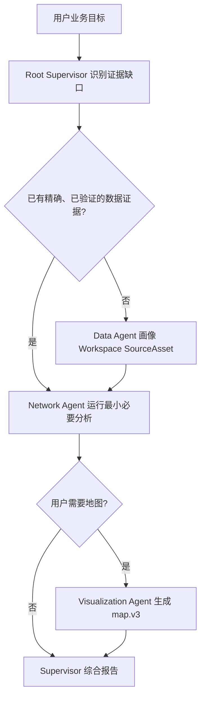

# Enterprise Supervisor Copilot 短期实施计划

## 0. 文档定位

| 字段 | 内容 |
| --- | --- |
| 文档状态 | 当前短期执行基线 |
| 更新日期 | 2026-07-30 |
| 对应阶段 | M2 Enterprise Supervisor Copilot |
| 实施范围 | 单用户、单 Profile、真实 Runtime、一个印尼仓网决策案例 |
| 当前版本 | `enterprise-supervisor-copilot@4.0.0` |
| 平台行为合同 | `platform-supervisor-behavior@1.1.0` |
| 当前事实 | [能力基线](capability-baseline.md) 与代码 |
| 架构依据 | [企业多 Agent 平台架构](enterprise-agent-platform-architecture.md) |

本文只描述当前 M2 实施状态和下一步工作。当前目标是让用户只表达业务问题，由根
Supervisor 根据证据缺口动态选择受治理的 Domain Agent，并通过类型化 Artifact
形成可审查决策。平台不执行案例 Workflow，也不把某次 E2E 轨迹固化为产品流程。

## 1. 当前实现合同

| 维度 | 当前合同 |
| --- | --- |
| 认知规划 Owner | Codex Runtime 中的根 Supervisor |
| 专业判断 Owner | Data、Network Planning、Visualization Domain Agent |
| 确定性计算 Owner | `supply_chain_indonesia` 与 `map_utils` MCP |
| 治理与持久化 Owner | Platform Server |
| 浏览器 Owner | Workspace 数据上传、对话内 Profile/Mapping/参数/最终 checklist 确认，以及有界 readiness、Artifact 呈现 |
| Agent 输入输出 | 4.0.0 Agent Release、exact Runtime Role、版本化 Intake Artifact、durable Resource reference |
| 核心数据合同 | Workspace SourceAsset、`data_requirement_profile.v1`、`source_profile.v1`、`mapping_proposal.v1`、`planning-dataset.v2` |
| 运行能力门禁 | `agents.multi_agent@1.0.0`、exact Role/Tool allowlist、per-Role limit、授权 Workspace |
| 持久化范围 | Codex 保持 Thread/Turn/Item 权威；平台持久化 Release、Run binding、Artifact、审批、审计和可重建投影 |
| 验证路径 | 数据生成回归、Python 单元测试、MCP stdio smoke、Catalog/Server/Web 合同测试、真实 Runtime/browser E2E |

本实现不需要修改 `codex/`。如果后续发现官方 Runtime 合同无法满足需求，必须先按
[Codex Patch Map](custom-codex-patch-map.md) 证明必要性、最小范围、验证方式和退出
条件。

## 2. 用户结果

用户可以在浏览器中提出：

> 分析现有印尼仓网并给出建议。先说明当前一日、二日、三日送达覆盖率和各省差异；
> 再计算两级运输成本，评价一个指定候选点；最后在有限候选集合中选择满足目标的
> 最优位置，并用地图比较当前方案和建议方案。

用户不需要提供服务器路径、Runtime Role、MCP 名称、Tool 调用顺序或 Agent 数量。
最终报告必须区分事实、假设、分析、建议和缺失证据，并让重要数字追溯到精确
Artifact schema 与 `resource_name`。

### 2.1 可用参与者

| 参与者 | 责任 | 何时需要 |
| --- | --- | --- |
| Root Supervisor | 解释目标、识别最小证据缺口、委派、处理冲突并综合报告 | 每次受治理多 Agent 任务 |
| Data Agent `4.0.0` | 扫描授权 Workspace 的 Excel/CSV/JSON，发布有界 Source Profile、模糊映射候选，并只在用户确认后归一化 | 需要文件理解或映射 |
| Network Planning Agent `4.0.0` | 根据目标生成完整 Requirement Profile，判断数据/参数缺口，发布最终 readiness checklist，并选择最小网络分析 | 需要业务要求或网络计算 |
| Visualization Agent `2.0.0` | 只接收 Network 生成的 `network_comparison_map.v1` 与 `geojson.v1` Resource，交给地图 Tool；`map.v3` 是唯一地图交付 | 用户要求地图 |
| Platform | 发布不可变 Release、执行预检、持久化 Artifact/审计/审批和浏览器投影 | 全程 |

所有 Domain Agent 都是可选能力。Policy 不要求固定 Agent 数量或顺序。已有可信
Artifact 可以消除一次委派；独立调查在输入满足时可以并行；新证据只触发最小必要的
复算或追问。

### 2.2 动态协作语义

该图只表达证据依赖，不是平台状态机。Runtime 可以在输入已经存在时跳过 Data，
只回答服务基线，或在用户不要求地图时不创建 Visualization Agent。

## 3. 数据与 Artifact

教程数据作为一个不可变 Workspace Dataset Release 发布。它包含：

- 38 个省级行政区边界与统一名称；
- 240,000 个位于边界内部的合成客户，需求分布参考人口但不与人口简单成正比；
- 3 个中心仓、8 个前置仓、当前客户分配和有限候选点；
- 现有仓到省级目的地的报价，以及干线和末端单位需求报价；
- Haversine 距离、道路系数 `1.25`、平均速度 `45 km/h`、每天驾驶 `6` 小时的
  教程政策；
- generator manifest、文件摘要、来源与数据质量说明。

浏览器只处理 Dataset Release 的逻辑身份：`workspace_id`、`release_id`、
`dataset_id`、版本和内容哈希。Workspace 根由 Platform 按授权记录解析，浏览器和
模型都不接收本地路径。数据、生成方法、外部来源和已知限制以
[印尼案例总览](tutorials/supply-chain-agent-tutorial.md) 和
`tools/supply-chain-network-planner/references/indonesia-tutorial-data-contract.md`
为准。

### 3.1 当前 Artifact 合同

| Schema | Owner | 用途 |
| --- | --- | --- |
| `indonesia_dataset_inspection.v1` | Data Agent | 数据身份、摘要、完整性和边界核验 |
| `indonesia_service_baseline.v1` | Network Agent | 不含成本和两级设施的渐进式时效基线 |
| `indonesia_current_network_analysis.v1` | Network Agent | 当前两级仓网覆盖与运输成本 |
| `indonesia_candidate_scenario.v1` | Network Agent | 一个明确候选仓的同口径结果 |
| `indonesia_location_optimization.v1` | Network Agent | 有限候选集合的约束优化结果 |
| `indonesia_network_map.v1` | Network Agent | 有界地图 manifest 与图层语义 |
| `geojson.v1` | Network Agent | 地图使用的有界 GeoJSON Resource |
| `indonesia_decision_report.v1` | Network Agent / MCP | 交叉校验七个同 Server Resource 后确定性渲染的业务报告 Markdown，不持有地图 Artifact |
| `report.v1` | Network Agent / MCP | 指向精确报告 Resource 的浏览器类型化交付，不复制报告正文 |
| `map.v3` | Visualization Agent | 浏览器可渲染地图 |

Artifact 使用 Task 级稳定 ID 和 durable Resource reference 交接。Platform 记录
producer Run/Thread/Turn/Item provenance；根只能解析同一 Run 内来源已验证且引用
唯一的子 Agent Resource。消息不得复制完整客户数据，平台投影也不是第二份 Thread
或 Agent 状态。

报告与地图分别只有一条类型化交付路径。`REPORT_HANDOFF` JSON 仅含报告 Resource 名和
`report_artifact_id`；Network Agent 把 Tool 生成的 `report.v1` embed 独立交付一次。
权威 `indonesia_decision_report.v1` Resource 拥有 schema、digest、精确来源声明、
类型化 checks 和完整报告内容，模型正文不是报告来源。`MAP_HANDOFF` JSON 仅含两个输入
Resource 名和 `map_artifact_id`，不含 Resource URI 或 embed code；Visualization Agent
把 Tool 的 `structuredContent.embed.code` 原样作为独立指令发出一次。Platform 将该
指令解析为 Agent Message 事件的类型化 `inlineArtifacts`，这份安全投影是两种交付的
浏览器实时与恢复视图。浏览器不读取 handoff 里的转义字符串，也不根据 Artifact ID
猜测指令。

## 4. Policy 与能力边界

`enterprise-supervisor-copilot@4.0.0` 精确绑定三个 Agent Release，每个 Role 最多
一个实例，V2 驻留额度为三。当前 Multi-Agent V2 没有 `close_agent`，终态子 Agent
仍占额度，因此这个上限覆盖全部可选角色，而不是要求三个角色都运行。十个 Artifact
handoff 都是条件性证据边；未选择某项分析时不得为了满足数量而伪造 Artifact。

Root Supervisor：

- 只负责规划、委派、冲突处理和综合；
- 不拥有供应链 MCP、地图 MCP、shell 或源数据访问；
- 不得自行生成专业计算结果；
- 不得把 Prompt 当作审批、授权或能力发现；
- 不得把 Role 数量、固定 Tool 顺序或特定候选点当作完成条件。

Domain Agent：

- 只能使用 Definition 声明的 exact Runtime Role、MCP Server 和 Tool allowlist；
- 只能读取 Task 授权的 Dataset/Resource；
- 必须保留 schema、resource name、单位、周期、假设和限制；
- Tool 不可用、证据不兼容或输入不足时显式失败，不回退到默认 Agent、目录扫描或
  兄弟 Agent 的 MCP。

Platform：

- 发布并解析不可变 Dataset、capability package、Agent、Supervisor 和行为合同
  Release；
- 在 `thread/start` 前验证 Runtime capability、Role hash、package/Dataset 内容
  哈希、Workspace 授权和 MCP 隔离；
- 通过官方 per-thread config 注入 exact allowlist 和并发限制；
- 持久化 durable Artifact、审批、运行事实和有界浏览器 DTO；
- 不观察 Prompt 内容来决定下一步，不建立第二套 Supervisor 调度器。

## 5. Web 可达性与新手闭环工作包

该工作包属于当前 M2，而不是第二份路线图。它解决的是现有能力虽然分别存在，但新用户
不能从生产 `/web` 入口完成“数据准备—依赖检查—启动—审批—交付—恢复”的根因。
产品不得让模型在运行后向用户索要 `workspace_id`、`release_id`、`dataset_id`、Runtime
Role、MCP 内部标识或服务器路径来弥补平台绑定缺失。

### 5.1 所有权、合同与完成顺序

| 工作面 | Owner | 类型化输入输出 | Capability gate | 持久化与验证 |
| --- | --- | --- | --- | --- |
| Workspace data | Platform Server；Web 只呈现 | 有界文件选择、不可变 Dataset Release 与安全逻辑身份 | 当前 Workspace 授权和发布限制 | Dataset Release 是权威状态；真实 `/web` 发布、刷新、并发和拒绝测试 |
| Run readiness | Platform Server | 精确 Standard/Agent/Supervisor、Provider/模型选择；`ready/degraded/blocked` 检查与修复动作 | Runtime 类型化 discovery、精确 Release/hash、Dataset/package 和已封存的平台 MCP 声明；不得扫描 `.mcp.json` 推断可用性 | readiness 不单独持久化；启动时按权威状态复算并校验 fingerprint，Thread 创建后再用官方 Runtime MCP inventory 精确复检 |
| Tutorial Blueprint | Platform Server | 版本化只读 manifest、幂等 reconcile 请求和分阶段结果 | Blueprint 资产哈希、发布合同和当前 Runtime 能力 | 安装状态从已发布资源推导，不增加第二个教程状态源 |
| Learn 与 launcher | Browser WebApp | 有界 Blueprint/readiness DTO、用户选择和幂等启动请求 | 只消费 Server 返回状态，不在浏览器推断能力 | Task/Run/Thread 接受后才显示；真实浏览器 E2E |
| Agent Studio | Browser WebApp + 现有 Platform 发布服务 | 引导式草稿、派生 Artifact/handoff、不可变 Release | reviewed template、精确依赖和同一语义编译器 | 草稿/Release 使用现有 owner；代码/Web 语义与哈希相等 |

实施必须按下列顺序收敛；合同变化在同一变更中更新所有调用方、fixture、测试和当前
文档，不维护新旧启动或数据入口双轨。

### 5.2 WP0：事实纠偏与失败回归

- [x] 已确认 Dataset 发布组件只接在非生产文件面板，当前 `/web` Files 入口不可达；
- [x] 已确认 Agent/Supervisor 选择器未在创建 Thread 前展示 Dataset、Agent、MCP 和
  Provider/模型依赖；
- [ ] 用 Web 回归测试固定“空 Workspace 没有 Add data”和“缺少依赖仍可尝试启动”的
  原始失败；
- [ ] 在能力基线中把源码、路由、组件和真实浏览器可达证据分开记录。

### 5.3 WP1：唯一 Workspace Files 与 Dataset 生命周期

- [x] 将当前生产 `FileManager` 收敛为唯一 `WorkspaceFilesPanel`，接入同一个
  `DatasetReleaseDialog`；
- [x] Files 头部和空状态均提供 **Add data**，发布弹窗为 **Publish a data release**；
- [x] **Available releases** 显示版本、摘要、文件数和内容哈希，并提供
  **View details** 与 **New version**；
- [x] 发布成功后独立刷新 Dataset Release 投影，不用文件树刷新冒充数据状态刷新；
- [x] Agent Studio 缺少 Dataset 时复用同一 **Add data** 入口，不复制发布逻辑；
- [x] 删除旧 `FileTreePanel` 的 Dataset 生命周期接线，使其不再成为第二个 owner。

验收覆盖空 Workspace、1–32 文件、重复提交、超限、损坏内容、失败重试、并发发布、
刷新恢复和跨 Organization 拒绝。用户不需要终端、宿主路径或内部 ID。

### 5.4 WP2：类型化 readiness 与统一启动器

平台增加一个只读 readiness evaluator，由预览 API、正式 start 路由和 Worker 最终检查
共同使用。公共合同至少包含：

- `RunReadinessRequest`：Workspace、Standard/Agent/Supervisor 精确选择、Provider 和模型；
- `RunReadiness`：`ready | degraded | blocked`、检查列表和
  `evaluation_fingerprint`；
- `RunReadinessCheck`：稳定 code、状态、安全说明、是否阻塞和类型化修复动作；
- `StartRunRequest.readiness_fingerprint`：正式启动必须重新计算并拒绝漂移。

稳定检查 code 为 `runtime_profile`、`provider_model`、`execution_definition`、
`workspace_dependencies`、`runtime_capabilities`、`mcp_servers` 和
`map_presentation`。修复动作只使用 `open_workspace_data`、`open_agent_studio`、
`open_provider_settings`、`open_mcp_status`、`open_maps_settings` 和 `retry`。
`map_utils` 缺失会阻塞要求地图的任务；仅缺浏览器公开 Mapbox Token 时为
`degraded`，不能把分析标为失败。

- [x] 提供 `POST /api/workspaces/{workspace_id}/run-readiness`；
- [x] 正式启动重新验证 fingerprint，变化时返回类型化 `readiness_changed`；
- [x] readiness 通过前不创建 Task、Run 或乐观 Thread；
- [x] 用一个 **New task** 启动器选择 Standard、Agent 或 Supervisor，替代按图标猜测的
  两个受治理入口；
- [x] 阻塞项显示明确修复动作；修复后返回同一草稿并自动复检；
- [x] 重复点击由浏览器锁和平台幂等键共同去重。

### 5.5 WP3：版本化 Tutorial Blueprint 与 Learn

首个 Blueprint 是独立教程入口 `indonesia-warehouse-network@1.4.0`；正常业务路径使用
`indonesia-warehouse-network@2.0.0` Requirement Contract，声明 Workspace 全域发现、
用户整体确认和严格 Planning Dataset，不把教程 Dataset 作为输入。它声明精确 Dataset bundle、
capability package、Agent/Supervisor/行为合同版本与哈希、推荐 Prompt、必需能力、
预期 Artifact 和确定性验收值。它是通用平台资源，不把印尼业务写进 Web 或
`codex/`。

平台提供：

- `GET /api/tutorial-blueprints`；
- `GET /api/tutorial-blueprints/{id}/{revision}`；
- `POST /api/workspaces/{workspace_id}/tutorial-blueprints/{id}/{revision}/reconcile`。

上述 manifest、精确 hash 校验、DTO、list/read/reconcile 路由、幂等部分恢复 source
和生产 **Learn** 入口已经落地。`Learn UI E2E 20260730 0728` 已从全新空 Workspace
通过生产 `/web` 完成创建、安装、readiness、启动和发送。修复后的 typed Artifact
卡片尚需一次真实浏览器显示与恢复复核。

reconcile 只能引用构建时校验过的资产，必须使用幂等键，并通过手工发布所用的同一 owner
service 创建 Dataset、Agent 和 Supervisor Release。同 ID、版本与哈希时复用；同身份
内容不同时显式冲突，不自动升级版本。部分成功的不可变资源保留，响应逐阶段说明结果，
后续重试按身份和哈希继续。

- [x] 在主导航提供 **Learn**，连接 Workspace 选择、示例安装、readiness、启动和
  报告/地图审阅入口；
- [x] 从空环境只使用 Learn UI 完成 Create Workspace → Open Learn → Set up example →
  readiness（仅 maps presentation 为 `degraded`）→ Start task → Send，真实 DeepSeek
  Run completed；
- [ ] 服务重启后用真实浏览器确认修复后的报告/地图卡片显示，并刷新重开同一
  Workspace/Thread 验证各恢复一个；
- [ ] 完成度从 Dataset、Release、readiness、Run 和 Artifact 权威状态推导，不建独立
  教程进度表；
- [ ] 从空 Profile/Workspace 到第一次业务结果的人工设置目标为 5–10 分钟；
- [ ] 安装前显示将创建或复用的资源，安装失败保留明确阶段，不伪造原子成功。

长期决定与约束由
[ADR-008：版本化可安装 Tutorial Blueprint](adr/008-installable-tutorial-blueprints.md)
记录。

### 5.6 WP4：Agent Studio 渐进式交互

- [ ] 统一 `Agents/Supervisors/Capabilities/MCP` 与
  `Directory/Detail/Create/Edit draft` 状态；
- [ ] 目录默认只显示用途、来源、版本、数据、输入输出和发布状态；完整 instruction、
  capability ID、Artifact ID 与哈希收进 **Technical contract**；
- [ ] Agent capability template 初始为空，Artifact outputs 只能从模板允许值选择；
- [ ] Agent 创建按身份与目标、能力与数据、交付物、校验与发布分步；
- [ ] Supervisor 创建按目标与作者指令、精确 Agent Release、派生 handoff、校验与发布
  分步；用户只可收窄 required、consumer 和并发；
- [ ] 平台行为合同默认只显示版本和摘要，全文只在技术合同中展示；
- [ ] 已发布 Release 只能完整复制为明确的新版本；built-in Release 只读，定制时复制
  为新的用户 Definition，不能占用保留 ID；
- [ ] MCP 只展示声明和 Runtime 状态，Python capability 创建只从 Capabilities 进入。

代码 Package 与 Web 创建继续使用同一个语义编译器；相同定义必须产生逐字段相同的
规范化执行语义和 SHA-256。

### 5.7 WP5：教程、防漂移门禁与真实验收

- [x] 教程已重构为“快速体验、理解执行、安全修改、高级 Builder”四条路径；
- [x] `npm run check:tutorial-contracts` 校验 Blueprint 资产、内置 Release、Agent 输出、
  Supervisor handoff、Dataset 已知答案、精确金额、稳定 UI 标签、链接和安全文本；
- [x] 真实 DeepSeek enterprise Supervisor E2E 通过 13/13 验收；精确 Blueprint、
  8 类 Resource 和恰好一个 `report.v1`/`map.v3` 均 ready；
- [x] 全新空 Workspace 的生产 Learn UI 安装、readiness、启动、发送和真实 Run
  completion 通过；
- [x] Web owning layer 已修复 commentary typed Artifact 卡片投影；live/restored DOM
  回归、58 项 focused tests、typecheck、lint、parity 和 build 通过；
- [ ] 服务重启后完成 post-fix 真实浏览器卡片显示和刷新恢复复核；
- [ ] 增加缺 Dataset、内容漂移、缺 package/MCP、Provider 不可用、审批拒绝、重复启动、
  断线、Server/Profile Host 重启和 Mapbox Token 缺失路径；
- [ ] 浏览器投影不包含 Secret、宿主路径、Runtime Role、内部 URI 或无界原始数据。

只有 post-fix 真实 `/web` 卡片显示和恢复复核通过后，能力基线才可以把新手闭环声明
为 available。组件、路由或单元测试存在都不能代替该证据。

## 6. 当前纵向切片

### Slice 0：数据与 Workspace

- [x] 合成数据生成器、边界核验、manifest、文件哈希和分析回归已落地；
- [x] Platform API 与独立发布组件可上传多个文件并原子发布 Workspace Dataset Release；
- [x] 当前生产 `/web` Files 已接入该组件、Release history、详情和安全逻辑身份；
- [ ] 空 Workspace 的真实浏览器发布、刷新和复用证据待 WP5 完成；
- [x] 空库迁移、授权和内容漂移具有聚焦测试；
- [ ] 补充超限、损坏归档和并发发布的数据库矩阵。

### Slice 1：单 Agent authoring

- [x] Web 可创建受限标准库 Python MCP Tool、JSON Schema 和 Skill 指令；
- [x] 平台固定 package/launcher，清空继承环境并验证 initialize/discovery；
- [x] Tool Test 可读取精确授权的 Workspace Dataset Release；
- [x] Agent Release 可绑定精确 package/Dataset 依赖并直接作为根运行；
- [x] 当前配送审计教程已完成真实 Runtime/browser E2E：一次精确 MCP 审批和 Tool
  调用、ready Artifact、无 shell、刷新恢复通过。

### Slice 2：动态 Supervisor

- [x] Data `4.0.0`、Network `4.0.0`、Visualization `2.0.0` 精确声明责任、输入输出和
  Tool allowlist；
- [x] Supervisor `4.0.0` 与平台行为合同 `1.1.0` 不包含固定角色数或执行顺序；
- [x] 语义编译器、内容哈希、精确依赖和能力预检测试通过；
- [x] Root 与子 Agent MCP 隔离、兄弟 package 隔离具有聚焦测试；
- [x] 当前 exact Release hashes 的真实 DeepSeek Runtime/Artifact E2E 通过：一个 Root
  与三个 child Threads、8 个持久 Agent tasks、14 次 MCP 调用、8 个 ready Resource，
  以及恰好一个 `report.v1` 和一个 `map.v3`。

### Slice 3：Artifact 与浏览器审查

- [x] Artifact 有稳定 ID、schema、Task scope 和完整 producer provenance；
- [x] 子 Agent Artifact 可由同一 Run 的根安全解析，不能按 Thread 相等错误拒绝；
- [x] Agent 行为、非空等待说明、审批和 Artifact 从持久事件投影到浏览器；
- [x] 已授权 typed Artifact 卡片按 Turn 项目顺序独立投影并按稳定 ref 去重；
  commentary prose 仍折叠，卡片显示不改变 phase，也不提升 prose；
- [x] 报告验收覆盖 Artifact schema/version、非空 payload 与重算 digest、精确 Tool
  来源、类型化 checks、Dataset Release 身份、producer provenance 和交付引用，不比较
  报告措辞或模型正文；live/restored DOM 聚焦回归通过；
- [ ] post-fix 生产 `/web` 报告/地图卡片显示及各一份刷新恢复待真实浏览器复核；
- [ ] 补齐执行中崩溃、乱序、重复、深层 Agent 树和 Artifact 生命周期矩阵。

### Slice 4：语义化 E2E

E2E 只验证不变量，不验证精确轨迹或 Tool 次数：

- Root 不调用业务 MCP 或 shell；
- 被调用的 Agent 只使用自己的 exact MCP/Tool allowlist；
- Dataset 身份和市场正确，原始客户数据不进入消息或浏览器投影；
- 每项材料性结论引用 ready Artifact 和精确 Resource name；
- 地图由 Network 证据与 Visualization Tool 生成，Root 只引用；
- Agent 行为、等待、审批、Artifact 和最终报告在刷新后收敛；
- 证据不含凭据、内部 Resource URI、服务器路径或无界 payload。

2026-07-30 的 `4.0.0` exact Release 真实 DeepSeek E2E 已通过 13/13 验收。该次运行
观察到一个 Root 与三个 child Threads、8 个持久 Agent tasks、14 次 MCP 调用、8 个
ready Resource，以及恰好一个 `report.v1` 和一个 `map.v3`。权威
`indonesia_decision_report.v1` 按 schema/version、非空 payload 与重算 digest、精确
Tool 来源、类型化 checks、Dataset Release 身份、producer provenance、交付引用和恢复
一致性验收；不校验报告措辞或模型正文。这些数量是本次问题的观测证据，不得固化为
Supervisor 的固定顺序、角色数、调用数或 Artifact 数量。

后续 `Learn UI E2E 20260730 0728` 从全新空 Workspace 只通过生产 `/web` 完成 Create
Workspace、Open Learn、Set up example、readiness（仅 maps presentation 为
`degraded`）、Start task 和 Send；真实 DeepSeek Run completed，Blueprint 精确安装，
8 类 Resource、`report.v1` 和 `map.v3` 均 ready。首次完成后卡片 DOM 为 0，根因是两个
typed `inlineArtifacts` 位于 Runtime `commentary` message，而 `final_answer` 不含
embeds；Web 折叠 commentary，Platform/Blueprint/Artifact 均正常。

修复位于 Web owning layer：commentary prose 继续折叠，只把已授权 typed cards 按 Turn
项目顺序独立展示并按稳定 ref 去重，不改变 phase、不提升 prose。live/restored DOM
回归、58 项 focused tests、typecheck、lint、parity 和 build 通过，服务已重启。浏览器
控制器随后因自身 URL policy 拒绝刷新，post-fix 真实浏览器卡片显示和恢复仍是最后门禁。

以上两次 E2E 是旧教程/Artifact 交付路径的历史证据，不等同于当前
Workspace 全域 Excel/CSV/JSON Intake 主旅程。当前主旅程的真实格式画像、整体 Profile/
Mapping 确认、参数快照、严格 `planning-dataset.v2`、原 Thread Analysis Turn、重启恢复
和重复 Turn 门禁仍必须通过 `scripts/smoke-network-planning-intake.sh` 才能提升能力基线。

## 7. 完成定义

### 功能闭环

以下条件全部满足后，才能声明“当前印尼动态 Supervisor 功能闭环”：

1. 全新 Profile 和授权 Workspace 使用真实 Codex app-server 启动任务；
2. Runtime 自主选择完成问题所需的已发布 Agent，不由平台规定轨迹；
3. Agent 通过 MCP discovery 和 durable Resource 完成跨 Thread 证据交接；
4. 结果含问题所需的可验证网络建议，未要求的分析没有被强制执行；
5. 浏览器可查看 Agent 行为、等待原因、审批、Artifact、地图和最终报告；
6. 新用户可以只通过 `/web` 发布或安装数据、修复 readiness 阻塞并启动，不向模型提供
   内部 ID 或路径；
7. 刷新恢复通过，证据不包含凭据、宿主路径或完整原始数据。

当前真实证据已经覆盖 Runtime 协作、确定性 Artifact 和第 6 项的纯 UI Learn 安装/
启动路径；修复后的第 5、7 项卡片显示与刷新恢复仍缺真实浏览器复核，因此尚不声明整个
新手闭环完成。

### 可信发布

以下工作不阻塞教程和受限演示，但阻塞生产能力声明：

- 执行中断、审批拒绝、超时、取消和部分失败恢复；
- 事件乱序、重复、断线和 Profile 重启收敛；
- 共享 Workspace、真实 multi-`cwd` 和并发资源矩阵；
- 多用户、多 Profile 的进程与数据隔离；
- Artifact 替代、失效、删除、保留和跨 Run 生命周期；
- 生产 ERP/WMS 数据源、导航缓存、外部法规和运营事实接入；
- 多 Provider 的完整协作兼容矩阵。

## 8. 风险台账

| 风险 | 当前控制 | 升级触发条件 |
| --- | --- | --- |
| Runtime 自由编排导致轨迹变化 | E2E 验证语义和能力边界，不固定 Tool 次数与顺序；有界 wait 保持可见 | 重复委派、循环、无效满时等待或预算失控 |
| 合成数据与真实业务有差距 | 明确 source provenance、生成规则和缺失值 | 对真实投资决策负责 |
| 球面距离低估真实路况 | 教程固定道路系数并声明近似 | 需要线路承诺或生产 SLA |
| 大规模导航调用不可控 | 教程不用导航；生产接入必须有持久缓存、限流和失败合同 | 开始使用逐客户导航数据 |
| Runtime Role 不是企业身份 | MCP 授权限定 Task/Profile，Role 只做能力边界 | 需要 Agent 级动态数据权限 |
| Artifact 生命周期未完整 | 当前创建和同 Task 读取有明确合同 | 长期复用、删除或跨 Run 共享 |
| 恢复矩阵未完整 | Codex history 权威，平台投影可重建 | 开放长任务或多人试用 |
| 调用量与成本无基线 | 保留语义 E2E 证据，不固定轨迹 | 设置 SLA、预算或扩大试用 |
| 能力存在但 Web 不可达 | 以真实导航和浏览器 E2E 为能力证据，不以组件存在代替 | 发布新的 UI 入口或教程 Blueprint |
| Blueprint 变成隐藏 Workflow | Blueprint 只安装不可变资源；Runtime 仍按证据缺口协调 | 安装逻辑开始规定 Agent 顺序或 Tool 次数 |

## 9. 下一步

1. 完成 WP1 的唯一 Files/Dataset 入口；
2. 完成 WP2 的共享 readiness evaluator 与统一启动器；
3. 完成 WP3 的 Blueprint reconcile 与 Learn 快速体验；
4. 完成 WP4/5 的 Studio、教程与真实空环境 E2E；
5. 并行补齐部分失败、审批拒绝、重启收敛、Artifact 生命周期和共享 Workspace 门禁。
