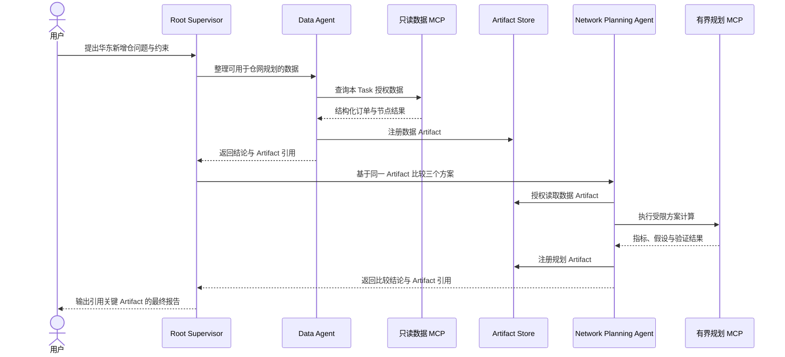
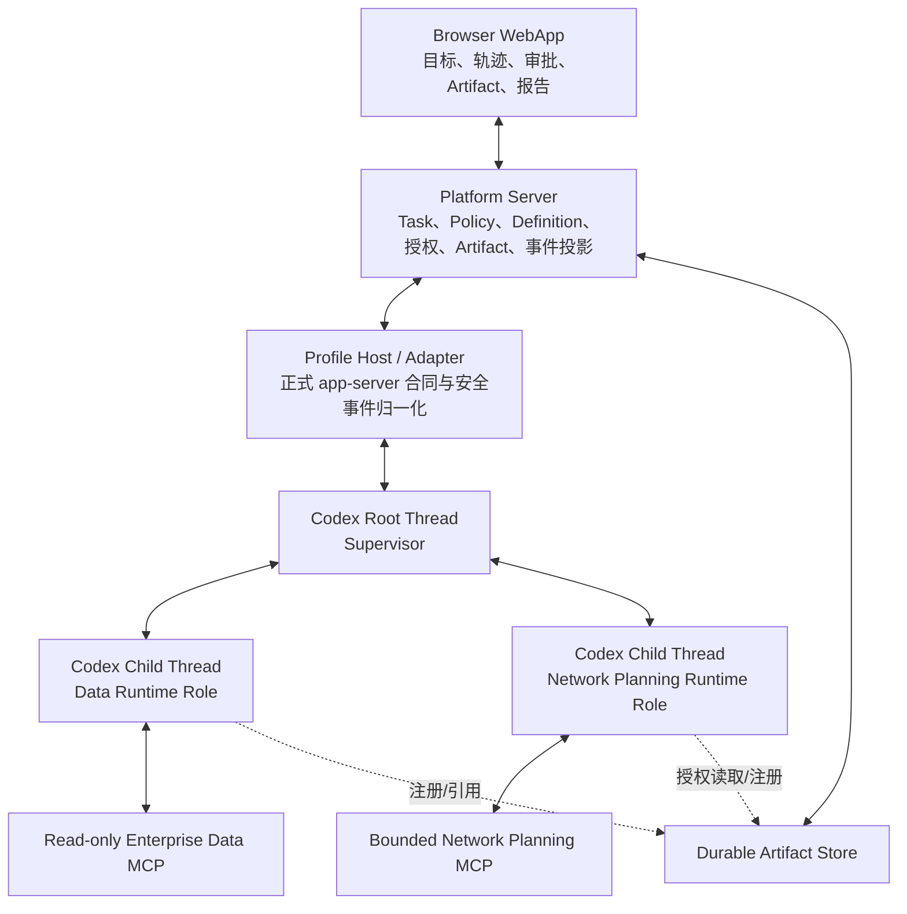

# Enterprise Supervisor Copilot 短期实施计划

## 0. 文档定位

| 字段 | 内容 |
| --- | --- |
| 文档状态 | 当前短期执行基线 |
| 更新日期 | 2026-07-28 |
| 对应阶段 | M2 Enterprise Supervisor Copilot |
| 实施范围 | 单用户入口、单 Profile、单主 Profile Host、一个真实企业案例 |
| 第一优先级 | 先形成可使用的多 Agent Copilot 功能闭环 |
| 可信策略 | 只前置不可绕过的安全与语义边界，其余可信缺口持续登记，不阻塞早期功能迭代 |
| 中期顺序 | [产品与工程路线图](roadmap.md) |
| 当前事实 | [能力基线](capability-baseline.md) 与代码 |
| 架构依据 | [企业多 Agent 平台架构](enterprise-agent-platform-architecture.md) |

本文细化当前 M2 功能主线，回答“下一批代码具体实现什么、以什么顺序实现、怎样才算
跑通”。它不替代：

- [开发计划](development-plan.md) 对全项目当前工作、上游同步和并行债务的汇总；
- [能力基线](capability-baseline.md) 对“已经实现并验证到什么程度”的判断；
- [安全模型](security-model.md) 中不能因阶段或演示而削弱的安全边界。

本计划采用 **Feature-first，Risk-visible** 的执行方式：可以暂缓完整数据库矩阵、
多用户隔离、全面恢复演练和生产级运维，但不能用临时模拟替代 Codex Runtime，不能
绕过 Workspace 授权，不能把 Prompt 当作权限，也不能把尚未验证的目标写成现有能力。

> **当前开发目标不是先证明平台已经足够可信，而是先让一个真实企业问题通过根
> Supervisor、两个 Domain Agents、企业 MCP 和持久 Artifact 得到完整答案。**
> 暂缓的可信工作必须保留明确风险、当前限制和升级触发条件。

---

## 1. 短期要交付的用户结果

用户在浏览器中提出一个需要数据分析与方案比较的企业问题。根 Thread 作为
Supervisor 理解目标，调用两个真实的 Codex Domain Agent 分工执行。Agent 使用受限
企业 MCP 获得数据和仿真结果，通过持久 Artifact 交接成果；Supervisor 处理冲突、
缺口和部分失败，最后生成一份引用关键 Artifact 的可审查报告。

第一条案例沿用架构报告中的“华东新增仓”：

> 企业计划在华东新增一个仓库。需要根据订单分布、现有仓网、时效目标和成本约束，
> 在同一优化口径下比较“不新增仓、增加杭州仓、增加无锡仓”三种方案，说明推荐
> 方案、适用条件、风险和仍需补充的数据。

### 1.1 第一版参与者

| 参与者 | 责任 | 第一版明确不承担 |
| --- | --- | --- |
| Root Supervisor | 理解目标、分工、追问、处理冲突、决定何时停止、综合最终报告 | 数据库授权、审批判定、Run 终态和 Artifact 持久化 |
| Data Agent | 通过只读数据 MCP 整理订单、区域、时效和现有节点数据，产出数据 Artifact | 修改源数据、选择最终仓网方案 |
| Network Planning Agent | 读取授权的数据 Artifact，调用有界规划 MCP，比较三个方案 | 绕过预算运行任意规划计算、访问本 Task 之外的数据 |
| 用户 | 提出目标、补充约束、处理高成本操作审批、审查结果 | 手工协调每个 Agent 的底层消息 |

Finance Agent、通用 Agent Catalog 和长期 Blackboard 不进入第一版。只有两个 Agent
不足以完成案例时，才增加第三个角色。

### 1.2 目标流程



### 1.3 两级完成定义

短期开发把“功能完成”和“可信发布”分开，避免所有可信工作阻塞第一条产品链路。

#### 功能完成：当前主目标

- 使用真实 Codex Profile、app-server 和原生多 Agent Tool，不使用 Fake Runtime
  代替验收；
- 根 Supervisor 真实创建 Data Agent 与 Network Planning Agent 子 Thread；
- 两个 Agent 使用真实可发现的 Runtime Role，而不是平台数据库中的模拟实例；
- Data Agent 产生可授权的数据 Artifact，Network Planning Agent 从另一个子
  Thread 读取同一 Artifact；
- 有界规划计算产生类型化结果 Artifact；
- 至少一次高成本操作进入现有审批链；
- 至少覆盖一次 Agent 追加任务或部分失败后的继续综合；
- 浏览器可以看见父子关系、关键状态、Artifact 和最终报告；
- 最终报告的关键结论引用对应 Artifact。

#### 可信发布：不阻塞早期编码，但阻塞能力声明

- 空白 PostgreSQL 完成全部迁移和相关 ignored integration tests；
- Profile 重启、事件乱序和断线重连收敛到同一执行轨迹；
- 共享 Workspace 并发、删除阻断和真实 multi-`cwd` 矩阵通过；
- 两用户、两 Profile 的进程与数据隔离在 M3 完成；
- Chat/Responses、不同 Provider 和 Capability Manifest 完成完整兼容矩阵；
- Artifact 保留、替代、删除和跨 Run 授权完成生产级验证。

功能完成后可以称为“单 Profile 企业案例功能闭环”，但在可信发布条件满足前，不能
称为多用户生产平台或完整可恢复的企业 Agent 平台。

---

## 2. 当前代码给出的起点

短期计划不从理想组件清单重新开始，而是沿已有纵向链路补齐缺口。

| 领域 | 当前已有 | 当前缺口 | 短期判断 |
| --- | --- | --- | --- |
| Codex 多 Agent | `1.7.0` 真实根 Thread 已按顺序 spawn/wait 两个白名单 Role 子 Thread；Runtime 的模型可见目录和执行入口共同拒绝白名单外角色，并原子限制每个必需 Role 仅一个驻留实例；子 Role 配置显式关闭 V2 与继续委派 | follow-up、interrupt、深层树和部分失败尚未进入真实案例矩阵 | 继续复用 Runtime，只补行为证据 |
| Thread 启动 | Adapter 使用正式 `thread/start` 传入授权 `cwd`、审批策略、历史模式和已绑定 Policy；真实企业 Thread 启动已通过 | shared Workspace、真实 multi-`cwd` 和多 Profile 路由仍缺证据 | 不新增 Supervisor Runtime |
| 事件与 Web | Server 把根/子 Thread 事件投影为可重建 DTO；真实刷新与 Server/Profile Host 重启恢复同一 Policy、三节点 Agent 树和最终报告 | 多层历史导航、乱序/重复矩阵和完成后追加任务仍不完整 | 扩展投影与 DTO，不建立第二套 Agent 状态机 |
| Runtime Role | Data `1.6.0` 与 Network `1.5.0` 显式绑定经评审的 Runtime 指令 hash，并从类型化声明确定性生成 shell、普通扩展、V2/继续委派禁用以及精确 MCP allowlist；根 request config 只选择声明的 capability root，并提供 exact `agents.allowed_roles` 与 `agents.role_spawn_limits` | Runtime 原生 Agent CRUD、通用发布、治理视图和多 Profile Catalog 仍未完成 | 新企业 Thread 直接依赖当前 V2，不引入历史版本兜底；启动前后均失败关闭；普通 Root 不获得 Policy、企业 Role 或 V2 覆盖 |
| Artifact | 已有 Task 级稳定身份、Schema、状态、内容、生产者 provenance 与同 Task 授权；最新真实案例完成跨子 Thread Resource 交接并产生九个 ready Artifact | 替代、失效、删除、保留、跨 Run 复用和内容打开体验未完成 | 完成生命周期，不退回 Run/Thread 所有权 |
| MCP | 最新真实案例通过 Runtime discovery 完成受限的数据、Resource 读取、计算和验证调用；Data 不使用 planner 业务操作，Network 不使用 Data 业务操作，Root 无 MCP/命令且没有 `map_utils` 泄漏 | 超限、超时、取消、高成本拒绝和生产数据连接仍缺系统证据 | 沿现有发现与审批路径补非 happy path |
| Workspace | Workspace 已独立于 Thread/Run，Adapter 会校验 Runner root | 现有根登记、共享并发和真实 multi-`cwd` 证据不完整 | 第一版限定一个已授权 managed Workspace |
| Profile | 单 Profile Host、Provider、Secret 和 Runtime status 已有主体实现 | 多 Profile Router 和完整重启矩阵未完成 | 明确限定单 Profile，不提前建设多用户路由 |

这意味着短期工作重点不是增加新的控制面，而是补齐五条连接：

1. Supervisor Policy → 根 Thread；
2. Agent Definition → Runtime Role → 子 Thread；
3. Runtime collab event → 平台投影 → 浏览器；
4. 子 Thread → Artifact → 另一个子 Thread；
5. Task/Profile 授权 → 企业 MCP → 受限资源。

---

## 3. 当前实施边界

### 3.1 本轮包含

- 单 Profile、一个主 app-server 进程；
- 一个授权 managed Workspace；
- 一个 Root Supervisor；
- Data Agent 和 Network Planning Agent；
- 一个版本化 Supervisor Policy；
- 两个代码管理、可评审的 Agent Definition Manifest；
- 一个只读企业数据 MCP；
- 一个有界仓网规划 MCP；
- Task 级持久 Artifact 和同 Task 跨子 Thread 读取；
- Agent 执行轨迹、审批、Artifact 与最终报告的浏览器体验；
- 一条真实 Runtime 企业案例 smoke。

### 3.2 本轮不包含

- 登录、注册、多用户 Profile Router 和多组织生产隔离；
- 任意用户在线创建、发布或安装 Agent；
- 完整 Agent Catalog、Marketplace 或 Agent Studio；
- 平台自定义 Planner、Agent Scheduler 或 Peer-to-Peer Agent Network；
- Runtime Role 级动态数据权限；
- 长期 Blackboard、Task Knowledge Ledger 和 Agent Decision OS；
- 自动 Commit、Push、合并或生产系统写入；
- 任意企业数据库适配器和生产 ERP/WMS 连接器；
- 跨 Task、跨组织和长期跨 Run 的 Artifact 共享；
- 为演示重新引入 Run 私有 Workspace。

### 3.3 不可因“功能优先”而放宽的边界

以下项目不是可信增强，而是功能正确性的组成部分：

- 浏览器不接收 Secret、服务器路径、raw JSON-RPC 或无界 Runtime payload；
- Codex Thread `cwd` 必须位于当前授权 Workspace；
- Prompt、Agent 名称或模型提交的 Task/Profile ID 不能成为授权依据；
- 企业数据 MCP 使用只读资源，规划 MCP 有明确输入、时间、并发和输出上限；
- Agent 间交接使用授权 Artifact 引用，不复制无界内部数据；
- Runtime 拥有 Thread、Turn、上下文与子 Agent；平台只保存治理事实和可重建投影；
- Artifact、审批和平台事件先持久化，再向浏览器发布；
- 不支持的 Runtime Role、Capability 或 MCP 必须明确失败，不能静默换用其他实现。

---

## 4. 最小架构与所有权



| 对象 | 权威所有者 | 输入 | 输出 | 不得变成 |
| --- | --- | --- | --- | --- |
| Root Supervisor 执行 | Codex Runtime | 用户目标、Policy instructions、Runtime capabilities | 原生多 Agent Tool Call、消息和最终回答 | 平台调度器 |
| Supervisor Policy | Platform | 已发布版本、Task 选择 | 不可变 Snapshot、Thread binding、developer instructions | 浏览器临时 Prompt |
| Agent Definition | Platform 治理包 | 稳定 ID、版本、职责、runtime role ref | 有界候选和审计元数据 | Runtime Agent 状态 |
| Runtime Role | Codex Runtime/Profile | Codex 可发现 Role 配置 | spawn 时的执行配置 | 企业权限身份 |
| Agent 执行投影 | Platform | Runtime Thread 与 collab events | 可重建的 Agent 树和状态 DTO | 第二份 Thread 真相 |
| Artifact | Platform | 类型化内容、Schema、provenance、Task 授权 | 稳定 ID、授权引用、浏览器 DTO | Run 附件或消息内大段数据 |
| 企业 MCP | Tool 服务边界 | 系统绑定的 Task/Profile 范围、受限业务参数 | 类型化结果与 Artifact envelope | 根据 Prompt 自行授权 |

---

## 5. 交付顺序：六条纵向切片

每条切片都必须穿过真实 owning boundary，并产生可演示结果。单元测试完成但真实
Runtime 路径没有运行，不算切片完成。

### Slice 0：固定案例合同与可重复数据

#### 目标

先固定一个足够真实、又能重复运行的企业问题，避免 Agent Prompt、MCP Schema 和
Artifact 结构各自演进。

#### 工作项

- [x] 固定“华东新增仓”业务问题、不新增仓/杭州/无锡三种可比方案和输入约束；
- [x] 准备去标识化、可重复生成的订单、区域、时效、现有仓与成本数据；
- [x] 明确数据时间范围、单位、缺失值和不允许推断的字段；
- [x] 固定第一版实际 Artifact 合同：
  - `planning-dataset.v1`：订单需求、区域聚合、服务时效与现有节点；
  - `network_snapshot.v1` 与 `route_matrix.v1`：同口径不可变输入和路线；
  - `current_coverage_result.v1`、`network_scenario_result.v1` 与
    `scenario_comparison.v1`：现状、候选结果和同口径差异；
  - 根 Thread 报告保留在 Codex history，并引用上述 Artifact，不伪装成尚未实现的
    `supervisor-report.v1`；
- [ ] 为每种 Schema 准备有效、缺字段、超大和未经授权样例；
- [ ] 记录一份人工可核对的基准结果，只用于判断明显错误，不要求模型复述固定答案。

#### 完成标准

同一输入可以重复生成相同的工具结果；模型可以采用不同分析表达，但不能改变工具
返回的确定性指标、单位和来源。

### Slice 1：真实多 Agent 执行轨迹

#### 目标

先证明当前 Codex Runtime 的协作能力可以通过现有 Profile Host 和 Adapter 被平台
观察，而不是先设计新的 Agent 管理系统。

#### 工作项

- [x] 在真实 Capability Manifest 中确认当前构建支持所需多 Agent 方法和事件；
- [x] 使用真实 Profile 和 app-server 创建根 Thread，绑定一个授权 managed
  Workspace；
- [x] 让根 Thread 使用原生协作工具按顺序完成两个精确 Role 的 spawn 与 wait；
- [ ] 在同一真实案例矩阵中补齐 follow-up/message、interrupt 和完成后继续执行；
- [x] 保留 Runtime Thread ID、父 Thread 来源、AgentPath、nickname、Runtime Role
  和原始终态语义；
- [x] 扩展 Server 的安全事件归一化，确保 collab Tool Call 与
  sub-Agent activity 可以投影为有界 DTO；
- [x] 浏览器使用 Runtime Thread 关系展示 Agent 树，不创建本地模拟 Agent；
- [ ] Thread 完成后追加任务时，继续使用同一个真实子 Thread；
- [ ] 为 fixture 事件补齐乱序、重复、缺少可选字段和未知事件类型测试；
- [x] 增加一条真实 Runtime E2E，保存可审查的 Thread/Agent ID、Tool、
  Artifact 和最终报告摘要。

#### 最小投影语义

平台投影至少需要表达：

- 根 Thread 与子 Thread 的稳定关联；
- AgentPath、nickname 和 Runtime Role；
- spawning、running、waiting、completed、failed、interrupted 等 Runtime 可观察状态；
- 当前协作动作及其来源 Turn/Item；
- 最后一次活动时间和最终结果引用；
- 数据不完整时的 `unknown`，而不是平台猜测状态。

投影可以被事件重放重建，不得反向驱动 Codex，也不新增权威
`agent_instances.status`。

#### 功能验收

- [x] 根 Thread 创建两个真实子 Thread；
- [x] 两个子 Thread 的独立身份与历史由 Runtime 保存，平台可按 ID 读取；
- [ ] Completed Agent 接受 follow-up 后产生新的 Turn；
- [ ] interrupt 后产生明确结果，根 Supervisor 能继续综合；
- [x] 浏览器刷新和 Server/Profile Host 重启后可以从持久事件与 Codex history
  恢复同一棵树和根报告。

#### 暂缓可信项

- Profile 进程重启后的完整乱序恢复矩阵；
- 并发上限、最大深度和资源耗尽的系统性压测；
- 两用户同时控制同一 Task 的隔离测试。

这些项目进入第 8 节风险台账，不影响第一条 happy path，但阻塞可信发布。

### Slice 2：持久 Artifact 与跨子 Thread 交接

#### 目标

让 Agent 交换有稳定身份、类型和授权的成果，而不是复制对话文本或依赖原 Run
仍然存在。

#### 工作项

- [x] 建立统一 Artifact 身份，Run/Thread/Turn/Item 只作为 provenance；
- [x] 为 Artifact 保存组织、Task、类型、Schema 版本、状态、内容摘要、生产者来源和
  创建时间；
- [x] 第一版授权限定为当前组织、当前单 Profile 和同一 Task；
- [x] 以 Artifact ID 为主资源路由，不再要求消费者先持有生产 Run ID；
- [x] 注册和物化时验证 Schema、类型、大小与受支持的 JSON 内容类型；
- [x] 保留面向 Runtime 的有界 Resource 引用，使另一个子 Thread 可以授权读取；
- [x] 提供面向浏览器的稳定 Artifact DTO 与受控内容路由；
- [x] 将现有 reply/inline visualization 数据迁移到统一所有权模型，不增加长期
  dual-read 或 dual-write；
- [x] 更新事件投影：Tool 结果注册 Artifact，Assistant 只负责在消息中引用；
- [ ] 补齐同 Task 读取、其他 Task 拒绝、猜测 ID 拒绝、Schema 失败和超限失败的
  完整数据库矩阵；真实 happy path 与跨组织猜测 ID 拒绝已有证据。

#### 第一版生命周期

```text
pending -> materializing -> ready
pending -> materializing -> failed
```

当前实现不提供复杂版本分支、失效操作和跨 Run 共享 UI，但数据模型没有把 Artifact
绑定成 Run 的子对象。删除、替代、失效和长期保留策略作为可信 TODO 记录。

#### 功能验收

- [x] Data Agent 在自己的 Thread 中产生 `planning-dataset.v1`；
- [x] Network Planning Agent 不复制原始消息，通过同一 Resource 引用读取相同内容；
- [x] Network Planning Agent 产生 snapshot、route、scenario 与 comparison
  类型的规划 Artifact；
- [x] 最终报告引用 Artifact schema 与 Resource name，浏览器恢复其摘要；
- [x] 原生产 Turn 结束后，Artifact 在当前 Task 内仍可读取。
- [x] 删除生产 Run 不会级联删除 Artifact、Task grant 或不可变 provenance identity。

### Slice 3：Supervisor Policy 与两个 Agent Definition

#### 目标

让“谁负责综合、可以选择谁、以什么规则停止”成为可评审且可追溯的产品事实，同时
仍由 Codex 根 Thread 承担真实 Supervisor 执行。

#### Supervisor Policy 工作项

- [x] 定义稳定 Policy ID、语义版本、正文、摘要和内容 digest，并只通过已发布
  Policy 列表对外提供；
- [x] 第一版使用一个代码评审后发布的 Policy，不建设在线编辑器；
- [x] 发布后生成不可变 Snapshot；
- [x] Task 启动时由服务端解析授权版本；
- [x] Adapter 通过正式 `thread/start.developerInstructions` 注入根 Thread；
- [x] 平台保存根 Thread 与 Policy Snapshot 的绑定；
- [x] Thread resume 沿用原绑定，不从“当前最新版”静默替换；
- [x] 浏览器可以看见 Policy 名称和版本，但不能提交任意企业 Policy 正文；
- [ ] 最终报告保留 Policy 版本引用。

第一版 Policy 至少规定：

- 如何分解目标以及何时选择 Data/Network Agent；
- Agent 结论冲突时由 Supervisor 负责继续调查和最终综合；
- 什么时候可以给出部分结果，什么时候必须明确失败；
- 何时申请审批、何时停止继续委派；
- 最多允许的 Agent 数量、并发、仿真次数和总体预算；
- 最终结论必须引用哪些 Artifact；
- Supervisor 无权自行宣布授权、审批、持久化或 Run 成功。

#### Agent Definition 工作项

- [x] 定义 Data Agent 和 Network Planning Agent 的稳定 Definition ID 与版本；
- [x] 每个 Definition 声明职责、输入、输出、所需 Capability、风险和
  `runtime_role_ref`；
- [x] Definition 以代码管理并经过评审，不建设 Catalog CRUD；
- [x] 已发布的 Definition/version 显式绑定经评审的 Runtime 指令 hash；Profile Host
  物化的 TOML 由这一份指令源确定性生成，不维护第二份容易漂移的模板；
- [x] 只有已绑定显式已发布 Supervisor Policy 的 worker 执行前检查会触发物化：Run
  入队只封存 Policy Snapshot；Snapshot hash 同时覆盖 Supervisor 指令和引用的每个
  Definition id/version/Runtime 指令 hash。每次根 Thread 创建或继承 fork 前，worker
  重新解析已发布 id/version、核对完整 Snapshot 与 `agents.multi_agent@1.0.0`。
  随后由 Profile Host 原子写入受管 Role 文件；Adapter 在 Runtime 消费前安全重开并
  校验 hash，再通过官方 per-thread config 显式启用 `features.multi_agent_v2`、设置
  V2 并发限制和精确 Role。该选择只作用于本次 Thread，不注册到 Profile/Project；
- [x] 不持久化 Runtime Role 配置投影；PostgreSQL 只保留 Policy/Definition 业务事实
  和由 Runtime 事件重建的 `runtime_agent_projections` 执行观察；
- [x] 受管平台 Role 名称为保留名称，Profile Role CRUD 不能创建、修改或覆盖它们；
- [x] 用真实 spawn 证明两个已配置 Runtime Role 均可被当前 Runtime 发现；
- [x] Definition 版本或指令 hash 漂移、未启用多 Agent 能力、Role 文件校验失败或
  越界 V2 并发限制明确失败，不回退到 default 或其他 Agent；
- [x] 普通 Root 会话不触发或变更企业 Agent 配置，也不获得 Policy 指令、企业 Role
  或 V2 覆盖；
- [ ] 不把 Runtime nickname、AgentPath 或 Role 名称作为企业数据授权身份。

现有 Profile Agent 设置可以继续服务非保留的 Runtime 配置，但不能被描述为完整企业
Agent Catalog。受管 Role 文件物化是原生 Agent CRUD 缺失期间的内部过渡边界：它只
发生在显式 Policy 前置检查内，必须经过 Profile Host 原子写入和启动前 hash 重验，
且不能写入 Profile 全局 Agent 配置。退出路径见
`docs/agent-capability-lifecycle-plan.md`。

#### 功能验收

- 同一 Policy 版本重复启动案例时，根 Thread 获得相同协调规则；
- Data 与 Network Definition 可以追溯到实际 spawn 使用的 Runtime Role；
- Role 冲突、版本或 Runtime 指令 hash 漂移会在每次根 Thread 创建或继承 fork 的
  Runtime 调用前失败；
- 缺少、版本不匹配或未启用的多 Agent Capability 会在
  `thread/start`/`thread/fork` 之前失败；
- 受治理的新建与 fork Thread 均使用 V2；不为新企业功能保留 V1 兼容分支；
- 不带 Enterprise Supervisor Policy 的普通 Root 启动不创建或修改任何 Runtime Role，
  也不获得企业 V2 配置覆盖；
- unknown Role 产生明确可见错误；
- 修改已发布 Policy 源内容会产生新版本，而不是改变既有 Thread 行为；
- 用户 Prompt 不能覆盖“只读数据、审批和 Artifact 引用”等确定性边界。

### Slice 4：只读数据 MCP 与有界规划 MCP

#### 目标

用两个真实 MCP 把案例从“多个 Agent 聊天”推进到“多个 Agent 使用企业能力完成
有证据的协作”。

#### 只读数据 MCP

第一版提供满足案例所需的少量类型化工具和 Resource，不建设任意 SQL 控制台。

- [x] 输入只包含业务查询条件，不接受模型提交组织、用户、Profile 或凭据；
- [x] Task/Profile 资源范围由服务端或部署配置绑定；
- [x] 使用只读、去标识化 fixture 数据源；
- [x] 返回明确字段、单位、时间范围、行数和截断信息；
- [x] 大数据通过 Resource/Artifact 有界读取，不全部进入模型上下文；
- [x] 结果注册为 `planning-dataset.v1`；
- [x] 记录查询摘要和来源，但不记录 Secret 或直接个人标识。

#### 有界规划 MCP

- [x] 输入只接受经过 Schema 验证的候选仓、需求摘要、约束和有限参数；
- [ ] 已限制候选方案数、输入与输出大小；继续把执行时间、并发和重试预算纳入
  可注入失败测试；
- [ ] 普通模式直接执行，高成本模式进入现有审批链；
- [ ] 明确成功、参数拒绝、审批拒绝、超时、取消和内部失败；
- [x] 输出指标、单位、假设、约束命中情况与验证结果；
- [x] 结果按实际工具合同注册为 `network_snapshot.v1`、`route_matrix.v1`、
  `network_scenario_result.v1` 与 `scenario_comparison.v1`；
- [x] 同一规范化输入在确定性模式下产生可重复结果。

#### 授权边界

Phase 1 只承诺 Task/Profile 级资源范围。Runtime Role 级不可伪造执行身份尚未建立，
因此不能宣称“Data Agent 和 Network Agent 拥有不同动态行权限”。真正的安全属性
来自只读数据连接、仿真输入边界和服务端绑定的 Task/Profile 范围，而不是 Agent
Prompt 中的角色说明。

#### 功能验收

- [x] Data Agent 使用的工具合同不提供源数据写入；
- [x] Network Agent 读取被授权的 planning Resource；跨组织 Artifact ID 猜测
  返回不可枚举的拒绝；
- [ ] 补齐超限仿真拒绝与高成本仿真审批的端到端证据；
- [ ] 补齐取消或审批拒绝后由 Supervisor 利用已有 Artifact 给出部分结果；
- [x] Tool 返回的结构化事实与最终报告引用一致。

### Slice 5：Copilot 产品体验与最终报告

#### 目标

让用户不需要理解 Codex 内部协议，也能看懂“谁在做什么、为什么等待、产出了什么、
最后依据什么得出结论”。

#### 工作项

- [x] 在 Workspace 菜单提供目录驱动的 Governed Supervisor 入口，由用户从服务端
  发布的 Policy 列表选择后提交精确 ID 与版本；供应链 Policy 只是当前可选模板，
  浏览器不写死其 ID、版本或执行顺序；
- [x] 根 Thread 页面展示当前 Supervisor Policy 名称和版本；
- [x] 在现有 Thread 体验中展示 Runtime 投影的根 Supervisor、子 Agent、角色和
  当前可观察状态；
- [x] 从持久 Runtime Event 建立可重建的 Agent 执行投影：Supervisor 摘要固定置顶，
  展示主任务、运行状态、当前行为和最新进展；每个真实子 Agent Turn 持久化为独立
  任务节点，完成后不再被后续事件改写，同一 Agent 再次启动 Turn 时按序创建新节点，
  不同 Agent 可并行保持活动状态；同一持久事件源还生成按序的完整行为日志，显示
  执行者、动作类型、状态、时间和有界公开详情；协作 Prompt 仅作为任务摘要，工具
  参数、结果、内部路径和推理内容不进入浏览器 DTO；
- [x] Agent 与 Files 复用同一右侧栏并以标签切换；两个标签始终可选，没有 Agent
  时显示空态；顶部 Agent 快捷入口在真实子 Agent 出现后启用，Files 可见时的
  Agent 更新只显示未读提示，不抢占当前页面；
- [ ] 将两层列表扩展为可进入历史的多层 Agent 树；
- [x] collab Tool Call 保留人类可读动作；无目标的 V2 `wait_agent` 明确显示为等待
  任一 Agent 更新或新输入的有界等待，开始与结束都进入持久行为日志，普通 Thread
  的实时和恢复视图不再显示空输出；当前案例已显示创建、等待与协作进度，追问、
  中断和继续待非 happy path 验证；
- [ ] 子 Agent 详情可以进入真实 Thread 历史；
- [ ] 等待审批、审批拒绝、部分失败和完成状态有清楚表达；
- [x] Artifact 摘要卡片显示类型、生产者、状态和大小；
- [ ] 最终报告中的 Artifact 引用可以打开授权内容；
- [x] 未引用 Artifact 不自动插入消息，保持模型对报告编排的控制；
- [x] 不向浏览器暴露 app-server request ID、Agent 本地路径、宿主机路径或内部
  Resource URI；
- [ ] 长报告与多个 Artifact 已覆盖；继续补窄屏、长 Agent 名称和深层树前端测试。

#### 第一版不建设

- 独立 Agent Studio；
- 可拖拽工作流画布；
- 通用 Blackboard 页面；
- Agent 运行指标大盘；
- 浏览器直接编辑 Runtime Role 或企业 Policy；
- 为了展示效果模拟不存在的进度百分比。

#### 功能验收

第一次接触项目的读者可以仅通过页面回答：

1. 当前根目标是什么；
2. Supervisor 创建了哪些 Agent；
3. 每个 Agent 负责什么、现在处于什么状态；
4. 哪一步正在等待用户；
5. 哪些 Artifact 支撑最终结论；
6. 某个 Agent 失败后，最终结果是部分成功还是整体失败。

### Slice 6：真实企业案例验收

#### Happy path

1. [x] 创建 Task 并选择一个已授权 managed Workspace；
2. [x] 绑定已发布 Supervisor Policy；
3. [x] 根 Thread 创建 Data Agent；
4. [x] Data Agent 调用只读 MCP 并注册 planning Artifact；
5. [x] 根 Thread 创建 Network Planning Agent；
6. [x] Network Agent 读取同一 planning Resource；
7. [x] Network Agent 计算实际现状、优化既有基线、杭州和无锡两个候选并注册
   snapshot、route、scenario 与 comparison Artifact；
8. [x] Supervisor 比较方案并输出引用 Artifact schema 与 Resource name 的最终报告；
9. [x] 浏览器刷新及 Server/Profile Host 重启后恢复同一 Agent 树、Artifact 摘要和
   完整报告；子 Thread 导航和 Artifact 内容打开仍属于 Slice 5 后续体验。

#### 必须覆盖的非 Happy path

| 场景 | 预期产品行为 |
| --- | --- |
| Runtime Role 不存在 | spawn 明确失败，Supervisor 不静默换角色 |
| 数据字段缺失 | Data Agent 记录缺口，Supervisor 追问或限定结论 |
| 两个 Agent 结论冲突 | Supervisor 保留两份依据，继续调查或解释取舍 |
| 高成本仿真被拒绝 | 已有数据 Artifact 保留，最终形成部分结果 |
| Network Agent 失败 | Supervisor 复用 Data Artifact，说明无法完成的比较 |
| Completed Agent 收到补充问题 | 在同一子 Thread 产生新 Turn |
| 浏览器刷新 | 不创建第二棵 Agent 树，不重复 Artifact |
| Artifact ID 被猜测 | 未授权读取返回不可枚举的拒绝 |

#### 功能完成证据包

- [x] 一条真实 app-server 执行记录；
- [x] 根 Thread、两个子 Thread 和 AgentPath 摘要；
- [x] Policy Snapshot ID/版本与根 Thread binding；
- [x] 两个 Agent Definition 版本与 Runtime Role discovery 结果；
- [x] planning、snapshot、route、scenario、comparison Artifact 与根 Thread 报告；
- [x] 当前 Run 的 MCP elicitation 通过现有持久审批链处理；
- [x] happy path 已纳入自动化证据包；
- [ ] 至少两个业务非 happy path 仍需加入同一证据包；
- [x] 浏览器关键页面已人工核对，自动化恢复检查验证页面所依赖的四类资源；
- [x] 能力基线准确区分新增能力与未验证部分。

最新一次全新环境证据为 9/9：真实协作产生一个根 Thread、两个子 Thread、33 次
企业 MCP 调用、十个 ready Task Artifact 和 3762 字六段式报告；恢复检查读取到
同一个 Turn、三个 Agent 与十个 Artifact，并验证三条受治理 Runtime Thread 均使用
Multi-Agent V2。调用与 Artifact 精确数量不是产品不变量；E2E 固定必需 Schema 的
最小数量，并要求所有已注册 Artifact ready。该证据通过
`scripts/smoke-enterprise-supervisor-copilot.sh` 在一次性 Profile、PostgreSQL 和
managed Workspace 上重建；运行时证据文件由执行环境指定，不作为仓库中的长期事实
副本。

---

## 6. 推荐的提交与合并顺序

| 批次 | 主要内容 | 应保持单独的原因 |
| --- | --- | --- |
| A | 案例 fixture、Artifact Schema 和基准结果 | 先固定业务合同，避免实现同时漂移 |
| B | 真实多 Agent Runtime trajectory 与有界平台 DTO | 证明复用链路，不混入治理数据模型 |
| C | 持久 Artifact 身份、授权和 Resource 读取 | 独立的数据所有权变化，需要单独审查 |
| D | Supervisor Policy Snapshot、Thread binding 与 Adapter 注入 | 平台治理和 Runtime 参数边界清楚 |
| E | 两个 Agent Definition 与 Runtime Role discovery | 不与完整 Agent Studio 混合 |
| F | 只读数据 MCP | 独立检查数据范围与只读属性 |
| G | 有界规划 MCP 与审批 | 独立检查预算、超时和失败终态 |
| H | Web Agent 轨迹、Artifact 与报告体验 | 保持浏览器只消费稳定 DTO |
| I | 真实案例 E2E、能力基线和运行说明 | 最终形成可重复证据包 |

如果某一批次必须同时修改多个 owning layer，应按“合同 → Server/Adapter → Web”
拆分提交，而不是用一个大提交隐藏边界变化。

---

## 7. 验证策略：功能优先但不是只验 Happy Path

### 7.1 每个切片必须执行

- owning module 的单元测试；
- 类型和 Schema 合同检查；
- Fake fixture 的正常与失败语义；
- 至少一条真实 Profile/app-server smoke；
- Git diff 与生成物 drift 检查；
- 当前新增或变化的可信风险登记。

### 7.2 当前功能门禁

这些检查失败时停止对应切片，不以 TODO 代替：

- Runtime 实际不支持所需多 Agent 方法或事件；
- 根/子 Thread 不能稳定关联；
- Artifact 跨子 Thread 无法执行确定性授权；
- 数据 MCP 不能保证只读；
- 规划 MCP 无法限制输入、时间和终态；
- Prompt 或浏览器字段可以改变服务端授权；
- 必须通过浏览器 raw RPC 或隐藏 Profile 文件修改才能运行；
- 功能依赖平台重新实现 Codex Thread、上下文或 Agent Scheduler。

### 7.3 暂缓可信项的处理

暂缓项不能只写一句“以后补测试”。每项至少记录：

| 字段 | 要求 |
| --- | --- |
| Risk ID | 稳定编号，例如 `TRUST-003` |
| 影响能力 | 具体到 Slice、API、状态或用户流程 |
| 当前事实 | 已有代码和测试证明了什么 |
| 未验证部分 | 明确缺少的并发、恢复、拒绝或环境 |
| 当前限制 | 单 Profile、managed Workspace、只读 fixture 等 |
| 失败后果 | 数据越权、状态重复、结果丢失、成本失控等 |
| 提升触发条件 | 什么时候必须从 TODO 变成阻塞任务 |
| 关闭证据 | 将来用什么测试或运行证据关闭 |

风险解决后，从活动风险表删除，并更新能力基线；过程历史由 Git 保存，不把本文
积累成变更日志。

---

## 8. 当前可信风险与 TODO

下表只保留当前有效的未解决风险。开发过程中发现新风险时先登记，再决定是否提升为
功能阻塞项。

| ID | 风险与当前限制 | 短期处理 | 提升为阻塞项的条件 | 状态 |
| --- | --- | --- | --- | --- |
| TRUST-002 | 第一版固定单 Profile，尚未证明两用户到两个 Profile 进程的隔离 | 本轮只提供受限单用户入口，不宣称多用户 | 开放登录、多用户或第二个 Profile | deferred to M3 |
| TRUST-003 | 共享 Workspace 并发与真实 multi-`cwd` 矩阵不完整 | 案例固定一个授权 managed Workspace；保留 `cwd` 包含校验 | 允许多个可写 Thread 并行修改同一仓库，或开放多 Workspace | open |
| TRUST-004 | 真实 happy path 已证明浏览器刷新和 Server/Profile Host 重启可恢复 Agent 树、Task Artifact 摘要与根报告；乱序、重复、执行中崩溃和部分物化恢复矩阵仍不完整 | 保留 canonical Codex JSONL、可重建平台投影与稳定 ID；下一步增加故障注入 | 宣称一般可恢复、进入长任务试用或 M2 阶段退出 | open |
| TRUST-006 | Runtime Role 不是不可伪造的企业执行身份 | 第一版只承诺 Task/Profile 级 MCP 范围和只读/有界服务 | 需要不同 Agent 动态获得不同数据权限 | deferred to M3 |
| TRUST-007 | Capability Manifest 仍有手工 Alpha 子集 | 使用真实 Manifest gate，并记录缺少的生成事实 | UI 或 Server 需要猜测 Runtime 能力时 | open |
| TRUST-008 | Chat/Responses 和不同 Provider 的协作输出可能存在差异 | 先固定一个已验证 Provider 跑通案例；保留标准 Runtime 事件合同 | 对外承诺多 Provider，或出现事件顺序差异 | open |
| TRUST-009 | 官方 Codex 已有待同步提交 | 不在高频 Runtime 文件增加无必要差异；平台侧优先 | 必须修改 Codex 高 churn 模块，或现有多 Agent bug 已被上游修复 | open |
| TRUST-010 | Agent 并发、深度、预算和超时尚无完整压力基线 | Policy 和 Runtime 配置采用保守上限；案例只使用两个子 Agent | 开放通用委派、长任务或第三个以上 Agent | open |
| TRUST-011 | Artifact 删除、替代、保留和跨 Run 生命周期未完成 | 第一版只在同 Task 内创建和读取，不开放管理 UI | Artifact 需要长期复用、合规删除或跨 Run 共享 | deferred |
| TRUST-012 | 企业数据仍为受控案例数据，不是真实 ERP/WMS 连接 | 使用真实 MCP 协议和授权边界，但准确标注数据来源 | 接入生产数据源或对业务结果负责 | deferred |
| TRUST-013 | 最新真实 E2E 约 553 秒、三个 V2 Agent Thread、33 次 MCP 调用、十个 Artifact 与报告引用；调用和 Artifact 数量会随有效调查步骤变化，且尚无运行分布、token/成本预算、重复委派率和证据覆盖率基线 | 保留每次 E2E 的同口径证据，按必需 Schema 最小集合判断功能而不固定轨迹计数，后续聚合多次运行 | 扩大试用、设置 SLA 或预算 | open |

---

## 9. 短期执行看板

看板只反映当前有效状态，不保存已经被替代的过程描述。

### 当前主线

- [-] Slice 0：案例、可重复数据与实际 Artifact Schema 已固定；负向样例和人工
  基准包待补；
- [-] Slice 1：真实 spawn/wait 与恢复已通过；follow-up、interrupt 和失败轨迹待补；
- [x] Slice 2：Task 级持久 Artifact 与跨子 Thread 交接 happy path；
- [-] Slice 3：Supervisor Policy 与两个 Agent Definition；
- [-] Slice 4：只读数据 MCP 与有界规划 MCP happy path 已通过，失败预算待补；
- [-] Slice 5：Policy、Agent、完整持久行为日志、Artifact 摘要和最终报告可见，
  深层历史与内容操作待补；
- [-] Slice 6：真实企业 happy path 9/9；至少两个业务非 happy path 待加入证据包。

### 并行可信工作

- [x] 空白 PostgreSQL migration smoke；
- [x] 记录但暂不扩展单 Profile 的部署限制；
- [ ] 真实 multi-`cwd` 与共享 Workspace 风险复核；
- [-] Profile 重启后的 happy path 恢复已通过，故障注入矩阵待补；
- [x] 选定 OpenAI Provider 的真实案例路径验证；
- [-] Codex 上游差异与 retained seam 已复核；待在专用分支同步 142 个提交。

### 当前不启动

- [ ] 多 Profile Router；
- [ ] 完整 Agent Catalog/Studio；
- [ ] Runtime Role 级动态企业授权；
- [ ] Task Knowledge Ledger；
- [ ] 通用工作流编排器；
- [ ] 生产数据写入和自动 Git 交付。

---

## 10. 当前判断：happy path 已闭环，M2 尚未退出

以下陈述现在已有真实运行证据：

> 在一个全新的单 Profile 环境中，用户从浏览器启动绑定明确 Policy 版本的 Codex
> 根 Thread。根 Supervisor 使用 Codex 原生多 Agent 能力按顺序创建 Data Agent 和
> Network Planning Agent；前者通过只读企业 MCP 产生持久数据 Artifact，后者从
> 另一个真实子 Thread 读取同一 Resource，并通过确定性规划 MCP 比较实际现状、
> 优化既有基线、杭州和无锡方案。Supervisor 最终生成引用关键 Artifact 的六段式
> 报告；刷新和 Server/Profile Host 重启后，浏览器恢复同一 Policy、Agent 树、
> Artifact 摘要和完整报告。

因此，“华东新增仓”的**受限 happy path 功能闭环已经完成**。这项结论不是说 M2
已经退出：Completed Agent follow-up、interrupt、审批拒绝、部分失败、业务数据缺失
等非 happy path 仍需真实证据；Artifact 内容操作和完整生命周期、故障注入恢复、
共享 Workspace、multi-`cwd` 与多用户隔离也仍未完成。

第 8 节 open 风险继续限制可恢复性、试用范围和生产能力声明。后续实现应优先扩大
同一纵向案例的行为覆盖，而不是另起一套编排、Agent 状态或 Blackboard。
