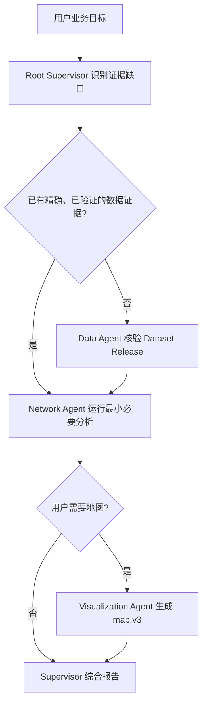

# Enterprise Supervisor Copilot 短期实施计划

## 0. 文档定位

| 字段 | 内容 |
| --- | --- |
| 文档状态 | 当前短期执行基线 |
| 更新日期 | 2026-07-29 |
| 对应阶段 | M2 Enterprise Supervisor Copilot |
| 实施范围 | 单用户、单 Profile、真实 Runtime、一个印尼仓网决策案例 |
| 当前版本 | `enterprise-supervisor-copilot@3.7.0` |
| 平台行为合同 | `platform-supervisor-behavior@1.1.0` |
| 当前事实 | [能力基线](capability-baseline.md) 与代码 |
| 架构依据 | [企业多 Agent 平台架构](enterprise-agent-platform-architecture.md) |

本文只描述当前 M2 实施状态和下一步工作。当前目标是让用户只表达业务问题，由根
Supervisor 根据证据缺口动态选择受治理的 Domain Agent，并通过类型化 Artifact
形成可审查决策。平台不执行案例 Workflow，也不把某次 E2E 轨迹固化为产品流程。

## 1. 当前实现合同

| 维度 | 当前合同 |
| --- | --- |
| 认知规划 Owner | Codex Runtime 中的根 Supervisor |
| 专业判断 Owner | Data、Network Planning、Visualization Domain Agent |
| 确定性计算 Owner | `supply_chain_indonesia` 与 `map_utils` MCP |
| 治理与持久化 Owner | Platform Server |
| 浏览器 Owner | Dataset/Package/Agent/Supervisor 发布操作，以及有界运行投影、Artifact 和报告呈现 |
| Agent 输入输出 | 不可变 Agent Release、exact Runtime Role、exact package/Dataset 依赖、durable Resource reference |
| 核心数据合同 | Workspace Dataset Release 与 `indonesia_dataset_inspection.v1` |
| 运行能力门禁 | `agents.multi_agent@1.0.0`、exact Role/Tool allowlist、per-Role limit、授权 Workspace |
| 持久化范围 | Codex 保持 Thread/Turn/Item 权威；平台持久化 Release、Run binding、Artifact、审批、审计和可重建投影 |
| 验证路径 | 数据生成回归、Python 单元测试、MCP stdio smoke、Catalog/Server/Web 合同测试、真实 Runtime/browser E2E |

本实现不需要修改 `codex/`。如果后续发现官方 Runtime 合同无法满足需求，必须先按
[Codex Patch Map](custom-codex-patch-map.md) 证明必要性、最小范围、验证方式和退出
条件。

## 2. 用户结果

用户可以在浏览器中提出：

> 分析现有印尼仓网并给出建议。先说明当前一日、二日、三日送达覆盖率和各省差异；
> 再计算两级运输成本，评价一个指定候选点；最后在有限候选集合中选择满足目标的
> 最优位置，并用地图比较当前方案和建议方案。

用户不需要提供服务器路径、Runtime Role、MCP 名称、Tool 调用顺序或 Agent 数量。
最终报告必须区分事实、假设、分析、建议和缺失证据，并让重要数字追溯到精确
Artifact schema 与 `resource_name`。

### 2.1 可用参与者

| 参与者 | 责任 | 何时需要 |
| --- | --- | --- |
| Root Supervisor | 解释目标、识别最小证据缺口、委派、处理冲突并综合报告 | 每次受治理多 Agent 任务 |
| Data Agent `3.0.0` | 核验一个精确授权的 Indonesia Dataset Release，发布有界检查结果 | 缺少可信数据证据 |
| Network Planning Agent `3.0.0` | 只运行问题所需的服务、现网、候选、优化或地图准备计算 | 需要网络计算 |
| Visualization Agent `1.1.0` | 把已验证地图 manifest 与 GeoJSON 交给地图 Tool，并原样交付地图及输入 Resource provenance | 用户要求地图 |
| Platform | 发布不可变 Release、执行预检、持久化 Artifact/审计/审批和浏览器投影 | 全程 |

所有 Domain Agent 都是可选能力。Policy 不要求固定 Agent 数量或顺序。已有可信
Artifact 可以消除一次委派；独立调查在输入满足时可以并行；新证据只触发最小必要的
复算或追问。

### 2.2 动态协作语义

该图只表达证据依赖，不是平台状态机。Runtime 可以在输入已经存在时跳过 Data，
只回答服务基线，或在用户不要求地图时不创建 Visualization Agent。

## 3. 数据与 Artifact

教程数据作为一个不可变 Workspace Dataset Release 发布。它包含：

- 38 个省级行政区边界与统一名称；
- 240,000 个位于边界内部的合成客户，需求分布参考人口但不与人口简单成正比；
- 3 个中心仓、8 个前置仓、当前客户分配和有限候选点；
- 现有仓到省级目的地的报价，以及干线和末端单位需求报价；
- Haversine 距离、道路系数 `1.25`、平均速度 `45 km/h`、每天驾驶 `6` 小时的
  教程政策；
- generator manifest、文件摘要、来源与数据质量说明。

浏览器只处理 Dataset Release 的逻辑身份：`workspace_id`、`release_id`、
`dataset_id`、版本和内容哈希。Workspace 根由 Platform 按授权记录解析，浏览器和
模型都不接收本地路径。数据、生成方法、外部来源和已知限制以
[印尼案例总览](tutorials/supply-chain-agent-tutorial.md) 和
`tools/supply-chain-network-planner/references/indonesia-tutorial-data-contract.md`
为准。

### 3.1 当前 Artifact 合同

| Schema | Owner | 用途 |
| --- | --- | --- |
| `indonesia_dataset_inspection.v1` | Data Agent | 数据身份、摘要、完整性和边界核验 |
| `indonesia_service_baseline.v1` | Network Agent | 不含成本和两级设施的渐进式时效基线 |
| `indonesia_current_network_analysis.v1` | Network Agent | 当前两级仓网覆盖与运输成本 |
| `indonesia_candidate_scenario.v1` | Network Agent | 一个明确候选仓的同口径结果 |
| `indonesia_location_optimization.v1` | Network Agent | 有限候选集合的约束优化结果 |
| `indonesia_network_map.v1` | Network Agent | 有界地图 manifest 与图层语义 |
| `geojson.v1` | Network Agent | 地图使用的有界 GeoJSON Resource |
| `map.v3` | Visualization Agent | 浏览器可渲染地图 |

Artifact 使用 Task 级稳定 ID 和 durable Resource reference 交接。Platform 记录
producer Run/Thread/Turn/Item provenance；根只能解析同一 Run 内来源已验证且引用
唯一的子 Agent Resource。消息不得复制完整客户数据，平台投影也不是第二份 Thread
或 Agent 状态。

## 4. Policy 与能力边界

`enterprise-supervisor-copilot@3.7.0` 精确绑定三个 Agent Release，每个 Role 最多
一个实例，V2 驻留额度为三。当前 Multi-Agent V2 没有 `close_agent`，终态子 Agent
仍占额度，因此这个上限覆盖全部可选角色，而不是要求三个角色都运行。八个 Artifact
handoff 都是条件性证据边；未选择某项分析时不得为了满足数量而伪造 Artifact。

Root Supervisor：

- 只负责规划、委派、冲突处理和综合；
- 不拥有供应链 MCP、地图 MCP、shell 或源数据访问；
- 不得自行生成专业计算结果；
- 不得把 Prompt 当作审批、授权或能力发现；
- 不得把 Role 数量、固定 Tool 顺序或特定候选点当作完成条件。

Domain Agent：

- 只能使用 Definition 声明的 exact Runtime Role、MCP Server 和 Tool allowlist；
- 只能读取 Task 授权的 Dataset/Resource；
- 必须保留 schema、resource name、单位、周期、假设和限制；
- Tool 不可用、证据不兼容或输入不足时显式失败，不回退到默认 Agent、目录扫描或
  兄弟 Agent 的 MCP。

Platform：

- 发布并解析不可变 Dataset、capability package、Agent、Supervisor 和行为合同
  Release；
- 在 `thread/start` 前验证 Runtime capability、Role hash、package/Dataset 内容
  哈希、Workspace 授权和 MCP 隔离；
- 通过官方 per-thread config 注入 exact allowlist 和并发限制；
- 持久化 durable Artifact、审批、运行事实和有界浏览器 DTO；
- 不观察 Prompt 内容来决定下一步，不建立第二套 Supervisor 调度器。

## 5. 当前纵向切片

### Slice 0：数据与 Workspace

- [x] 合成数据生成器、边界核验、manifest、文件哈希和分析回归已落地；
- [x] Web Files 可上传多个文件并原子发布 Workspace Dataset Release；
- [x] Dataset 详情显示并复制安全逻辑身份，不暴露本地路径；
- [x] 空库迁移、授权和内容漂移具有聚焦测试；
- [ ] 补充超限、损坏归档和并发发布的数据库矩阵。

### Slice 1：单 Agent authoring

- [x] Web 可创建受限标准库 Python MCP Tool、JSON Schema 和 Skill 指令；
- [x] 平台固定 package/launcher，清空继承环境并验证 initialize/discovery；
- [x] Tool Test 可读取精确授权的 Workspace Dataset Release；
- [x] Agent Release 可绑定精确 package/Dataset 依赖并直接作为根运行；
- [x] 当前配送审计教程已完成真实 Runtime/browser E2E：一次精确 MCP 审批和 Tool
  调用、ready Artifact、无 shell、刷新恢复通过。

### Slice 2：动态 Supervisor

- [x] Data `3.1.0`、Network `3.1.0`、Visualization `1.1.0` 精确声明责任、输入输出和
  Tool allowlist；
- [x] Supervisor `3.7.0` 与平台行为合同 `1.1.0` 不包含固定角色数或执行顺序；
- [x] 语义编译器、内容哈希、精确依赖和能力预检测试通过；
- [x] Root 与子 Agent MCP 隔离、兄弟 package 隔离具有聚焦测试；
- [ ] 当前 exact Release hashes 的全新真实 Runtime/browser E2E 正在重跑。

### Slice 3：Artifact 与浏览器审查

- [x] Artifact 有稳定 ID、schema、Task scope 和完整 producer provenance；
- [x] 子 Agent Artifact 可由同一 Run 的根安全解析，不能按 Thread 相等错误拒绝；
- [x] Agent 行为、非空等待说明、审批和 Artifact 从持久事件投影到浏览器；
- [x] 地图只有在最终消息含精确 standalone embed directive 时显示；
- [ ] 补齐执行中崩溃、乱序、重复、深层 Agent 树和 Artifact 生命周期矩阵。

### Slice 4：语义化 E2E

E2E 只验证不变量，不验证精确轨迹或 Tool 次数：

- Root 不调用业务 MCP 或 shell；
- 被调用的 Agent 只使用自己的 exact MCP/Tool allowlist；
- Dataset 身份和市场正确，原始客户数据不进入消息或浏览器投影；
- 每项材料性结论引用 ready Artifact 和精确 Resource name；
- 地图由 Network 证据与 Visualization Tool 生成，Root 只引用；
- Agent 行为、等待、审批、Artifact 和最终报告在刷新后收敛；
- 证据不含凭据、内部 Resource URI、服务器路径或无界 payload。

当前聚焦测试、MCP smoke 和 exact Release 真实 E2E 均已通过。观察到的轨迹为根加
三个问题所需子 Agent、七个 ready Resource Artifact、一个恢复后的 `map.v3` 和
六段报告；这些数量是本次问题的证据，不是 Supervisor 的固定顺序或固定调用次数。
浏览器刷新后 Agent 行为、非空 wait、Artifact、报告和地图均收敛。Runtime 有时会在
子 Agent 已完成后再次进入最长 120 秒的官方有界 wait；状态可见且不影响正确性，
但仍是性能缺口，平台不得用伪完成或计时器掩盖。

## 6. 完成定义

### 功能闭环

以下条件全部满足后，才能声明“当前印尼动态 Supervisor 功能闭环”：

1. 全新 Profile 和授权 Workspace 使用真实 Codex app-server 启动任务；
2. Runtime 自主选择完成问题所需的已发布 Agent，不由平台规定轨迹；
3. Agent 通过 MCP discovery 和 durable Resource 完成跨 Thread 证据交接；
4. 结果含问题所需的可验证网络建议，未要求的分析没有被强制执行；
5. 浏览器可查看 Agent 行为、等待原因、审批、Artifact、地图和最终报告；
6. 刷新恢复通过，证据不包含凭据、宿主路径或完整原始数据。

### 可信发布

以下工作不阻塞教程和受限演示，但阻塞生产能力声明：

- 执行中断、审批拒绝、超时、取消和部分失败恢复；
- 事件乱序、重复、断线和 Profile 重启收敛；
- 共享 Workspace、真实 multi-`cwd` 和并发资源矩阵；
- 多用户、多 Profile 的进程与数据隔离；
- Artifact 替代、失效、删除、保留和跨 Run 生命周期；
- 生产 ERP/WMS 数据源、导航缓存、外部法规和运营事实接入；
- 多 Provider 的完整协作兼容矩阵。

## 7. 风险台账

| 风险 | 当前控制 | 升级触发条件 |
| --- | --- | --- |
| Runtime 自由编排导致轨迹变化 | E2E 验证语义和能力边界，不固定 Tool 次数与顺序；有界 wait 保持可见 | 重复委派、循环、无效满时等待或预算失控 |
| 合成数据与真实业务有差距 | 明确 source provenance、生成规则和缺失值 | 对真实投资决策负责 |
| 球面距离低估真实路况 | 教程固定道路系数并声明近似 | 需要线路承诺或生产 SLA |
| 大规模导航调用不可控 | 教程不用导航；生产接入必须有持久缓存、限流和失败合同 | 开始使用逐客户导航数据 |
| Runtime Role 不是企业身份 | MCP 授权限定 Task/Profile，Role 只做能力边界 | 需要 Agent 级动态数据权限 |
| Artifact 生命周期未完整 | 当前创建和同 Task 读取有明确合同 | 长期复用、删除或跨 Run 共享 |
| 恢复矩阵未完整 | Codex history 权威，平台投影可重建 | 开放长任务或多人试用 |
| 调用量与成本无基线 | 保留语义 E2E 证据，不固定轨迹 | 设置 SLA、预算或扩大试用 |

## 8. 下一步

1. 补齐部分失败、审批拒绝和预算耗尽后的 Supervisor 综合矩阵；
2. 验证 Server/Profile Host 重启、事件乱序和重复后的投影收敛；
3. 完成 Artifact 替代、失效、删除与保留生命周期；
4. 验证共享 Workspace、multi-`cwd` 和多用户隔离；
5. 建立耗时、Token、MCP 调用量和失败率基线，并定位无效满时 wait。
