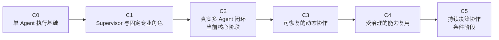
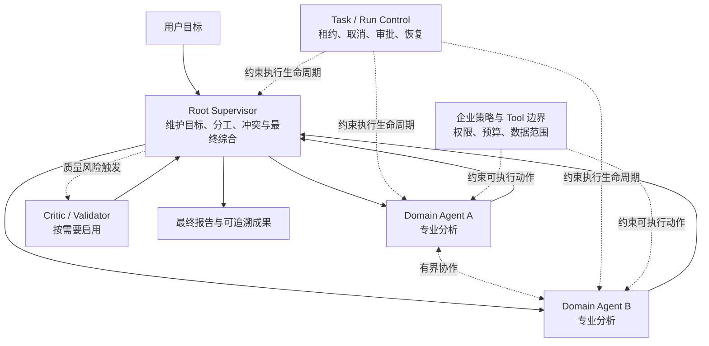

# 多 Agent 协同：从单一执行到可治理协作

> 文档性质：多 Agent 协同专项演进设计
>
> 更新日期：2026-07-29
>
> 当前阶段：产品路线图位于 M2；协同专项的 C2 核心闭环已经形成，正在补齐 C3
> 所需的追加任务、中断、并行与恢复证据
>
> 事实边界：当前能力以 [能力基线](capability-baseline.md) 和代码为准；本文负责说明
> 协同能力为什么按这一顺序演进，以及每个里程碑完成后用户实际得到什么

---

## 结论先行

多 Agent 协同的成熟度，不取决于一次能启动多少个 Agent，而取决于系统是否逐步回答
了下面五个问题：

1. 谁持续维护用户的最终目标；
2. 谁决定把什么工作交给哪个专业 Agent；
3. 中间证据改变后，谁调整计划并处理冲突；
4. Agent 失败、等待或被中断后，任务怎样继续；
5. 谁对最终答案的完整性负责。

因此，本项目不会从开放式 Agent 网络起步。演进主线是：

默认架构始终是 **Root Supervisor + Domain Agents**。顺序执行、并行执行、追问、
中断、Critic 或局部 Peer 协作，是这套责任结构内部可以按需采用的协作方式，而不是
互相排斥的架构选项。

---

## 1. 我们所说的“协同”到底是什么

把一项任务同时交给几个 Agent，只完成了工作分发。

真正的协同发生在中间结果开始改变后续路径的时候。例如，Data Agent 发现历史增长
主要来自促销，原先的需求预测不再可靠。此时 Network Planning Agent 和 Finance
Agent 不能继续沿用旧假设，Supervisor 需要识别影响范围、要求最小范围的重算，并在
最终报告中说明哪些结论被修正、哪些分歧仍然存在。

这类过程包含四种不同责任：

| 责任 | 核心问题 | 权威承担者 |
| --- | --- | --- |
| 目标责任 | 最终要回答什么，什么才算完成 | Root Supervisor |
| 专业执行 | 某个领域问题怎样分析和验证 | Domain Agent |
| 运行控制 | 是否创建、等待、中断、取消、恢复 | Codex Runtime 与平台 Task/Run |
| 企业约束 | 是否有权限、是否需要审批、是否超出预算 | Platform 与企业 Tool/MCP |

Supervisor 可以改变分析路径，却不能用自然语言宣布审批通过、扩大数据权限或把 Run
标记为成功。平台可以强制预算、授权和恢复规则，却不应该替 Supervisor 判断还缺什么
证据。这条边界贯穿所有里程碑。

### 1.1 协同能力的四个判断维度

每个阶段都从四个维度验收，而不是只检查“有没有 spawn Agent”：

- **责任是否清楚**：目标、专业结论和最终综合分别由谁负责；
- **过程是否可调整**：新证据出现后能否追问、改派、并行或停止；
- **异常是否可收敛**：部分失败、中断、重复事件和重连后是否回到同一事实；
- **结果是否可解释**：最终结论能否指出使用了哪些 Agent、依据和 Artifact。

---

## 2. 从起点到目标状态

### 2.1 起点：一个可靠的根 Thread

最初状态不是“没有 Agent”，而是平台已经能够让一个 Codex Thread 在授权 Workspace
中持续执行：

- Profile 提供持久的 Runtime 身份和配置环境；
- Workspace 提供经过授权的执行根；
- Task/Run 提供排队、租约、取消、审批和审计；
- Codex Runtime 拥有 Thread、Turn、上下文和工具执行；
- 浏览器通过平台恢复消息、状态和结果。

这是多 Agent 的必要基础。单个 Thread 如果在刷新、失败和恢复后都不能维持一致，
增加更多 Agent 只会放大不确定性。

### 2.2 目标：有人负责、专业分工、动态调整

目标状态中，根 Thread 在版本化 Supervisor Policy 约束下承担协调责任。它可以从
经过治理且 Runtime 确实可用的 Agent 候选中选择专业角色，创建或复用子 Thread，
根据证据变化追加任务，并在预算和停止条件内形成最终结论。

专业 Agent 可以在边界明确时交换消息，但开放式 P2P 不是默认结构。多个 Agent
结论冲突时，仍由 Supervisor 决定是否补充调查、保留分歧或停止，而不是把最终责任
交给投票或无边界协商。

目标结构可以概括为：

### 2.3 演进中不改变的原则

| 原则 | 含义 |
| --- | --- |
| 一个最终责任主体 | 默认由 Root Supervisor 综合，不让多个 Agent 的分歧无人负责 |
| Runtime 拥有真实 Agent | Agent 的创建、通信、Thread 和 Turn 状态不由平台模拟 |
| 平台拥有确定性控制 | 身份、权限、审批、Run、审计和恢复不能交给 Prompt |
| Agent Definition 不等于运行实例 | 目录描述“允许使用什么”，Runtime Thread 表示“这次实际运行了谁” |
| 先解决真实案例 | 每一阶段先用端到端业务任务证明，再扩大角色数量和自由度 |
| 复杂结构由问题触发 | Hierarchical、Critic、P2P 和长期规划器不随阶段名称自动出现 |

---

## 3. 里程碑总览

| 里程碑 | 阶段目标 | 用户获得的主要能力 | 当前状态 |
| --- | --- | --- | --- |
| C0 单 Agent 执行基础 | 建立可靠的浏览器到 Runtime 闭环 | 在授权 Workspace 中创建、继续、取消和恢复一次执行 | 基础已具备，生产门禁仍在路线图中 |
| C1 Supervisor 与固定专业角色 | 固定协调责任和可审查的专业边界 | 选择企业 Supervisor，并只调用明确发布的角色 | 已实现受限版本 |
| C2 真实多 Agent 闭环 | 让多个真实子 Thread 完成一个企业案例 | 看见分工、Agent 过程、Artifact 和最终报告 | **当前核心阶段；主路径已实现** |
| C3 可恢复的动态协作 | 处理追加任务、并行、中断和部分失败 | Agent 不是一次性调用，协作可调整并可恢复 | 已有部分基础，真实矩阵未完成 |
| C4 受治理的能力复用 | 从固定角色走向可发现、可评价的 Agent Catalog | 不同团队复用版本化 Agent，并知道其适用范围 | 尚未开始通用能力建设 |
| C5 持续决策协作 | 在事实变化时有界重评长期问题 | 保留决策依据、触发复核、由人作最终决定 | 条件阶段 |

当前不能笼统地说“已经完成多 Agent 平台”。更准确的描述是：

> 已经形成单 Profile、版本化 Supervisor Policy、四个可选 Runtime Role 和条件性
> Artifact handoff 的动态协作实现；当前印尼案例的精确 `2.0.0` Runtime 重跑与
> 追加任务、中断、并行和恢复矩阵仍是 C2/C3 的退出门禁。

---

## 4. C0：单 Agent 执行基础

### 阶段目标

证明浏览器、平台和 Codex Runtime 能够围绕同一个 Thread 维持一致事实，为后续
父子 Thread 协作提供可靠地基。

### 用户可见功能

- 从浏览器选择一个已授权 Workspace 并开始任务；
- 持续看到模型消息、工具活动、审批和执行状态；
- 页面刷新后恢复同一任务，而不是创建新的本地会话；
- 取消或失败时得到明确结果；
- 继续任务时沿用 Codex 的 Thread 历史。

### 细致目标

- [x] Profile 作为持久 Runtime 身份；
- [x] Workspace 独立于 Thread 和 Run；
- [x] Task/Run 的排队、租约和事件投影；
- [x] 浏览器只接收安全、版本化的平台 DTO；
- [x] Codex 继续拥有 Thread、Turn、上下文和工具执行；
- [ ] 完成生产级多 Profile 路由、并发和灾难恢复验证。

### 退出标准

同一执行在正常运行、页面刷新和服务恢复后能够回到同一 Thread 与 Run 事实；浏览器
不需要直连 app-server，也不保存第二份 Runtime 状态。

### 当前判断

这一基础已经足以支撑受限多 Agent 案例，但仍不能等同于多用户生产 GA。

---

## 5. C1：Supervisor 与固定专业角色

### 阶段目标

在启动多个 Agent 之前，先确定“谁协调”和“可调用哪些专业角色”，避免多 Agent
能力退化为任意角色名加一段 Prompt。

### 用户可见功能

- 用户可以启动一个明确命名、版本固定的 Enterprise Supervisor；
- Supervisor 的职责不会因浏览器临时参数而静默变化；
- 子任务只会交给当前 Runtime 真正可用的专业角色；
- 恢复既有任务时仍然使用原 Supervisor Policy。

### 细致目标

- [x] 发布当前 `enterprise-supervisor-copilot@2.0.0`；
- [x] 把不可变 Policy Snapshot 绑定到 Run 和根 Thread；
- [x] 发布 Data、Network Planning、Finance 与 Risk 四个可选 Agent Definition；
- [x] 每个 Definition 映射到一个精确 Runtime Role 和指令摘要；
- [x] 在根 Thread 启动前验证 Runtime Capability；
- [x] 只对这次受治理的请求启用所需 Runtime Roles；
- [x] 不把 Runtime Role 配置复制成 PostgreSQL 中的第二套真相；
- [ ] 用 Runtime 原生 Agent 生命周期替代当前过渡性的 Role 文件物化。

### 退出标准

Policy、Definition 或 Runtime Capability 不匹配时明确失败；成功启动时，根 Thread
得到的是经过服务端解析的固定策略，而不是浏览器提交的任意开发者指令。

### 当前判断

受限版本已经实现。它证明了 Supervisor 不需要一套新的 Runtime，但确实需要版本化
的产品行为策略。

---

## 6. C2：真实多 Agent 功能闭环

### 阶段目标

让一个真实企业问题通过根 Supervisor、按证据选择的真实子 Agent、企业 MCP 和持久
Artifact 完成，并让用户在 Web 端看见这条协作链。

### 第一条业务路径

当前案例是印尼配送网络决策：

1. Supervisor 明确 90% 两日达目标、决策周期、投资假设和交付标准；
2. 缺少适用数据时，Data Agent 从 typed source catalog 生成并验证
   `planning-dataset.v2`；
3. Network Planning Agent 读取同一个授权数据成果，诊断现网并比较有限候选方案；
4. 只有经济性会改变建议时才选择 Finance Agent；
5. 只有材料性不确定性或实施风险会改变建议时才选择 Risk Agent；
6. Supervisor 使用一致口径综合事实、假设、分析、建议、风险和缺失证据。

Policy 不规定固定角色数量或顺序。Dataset 等确定性输入依赖会自然形成先后关系；
输入已经满足的独立调查可以并行，新证据只触发最小必要的复算或追问。

### 用户可见功能

- 右侧 Agent 面板固定展示 Supervisor；
- 每个真实子 Agent 的任务、状态、当前行为和最新进展形成独立节点；
- Agent 完成一项任务后，该节点保持不变；
- 同一个子 Thread 再次执行新 Turn 时，产生下一个任务节点；
- 页面刷新后从持久投影恢复 Agent 树与任务节点；
- 用户能够看到 Artifact 及其生产角色，最终答案引用关键依据。

### 细致目标

- [x] 根 Thread 使用 Codex 原生多 Agent 工具创建 exact allowlist 中的角色子 Thread；
- [x] 子 Agent 通过 Runtime 正式发现并调用 MCP；
- [x] Domain Agents 通过同 Task durable Artifact reference 完成交接；
- [x] Runtime 事件投影为根/子 Thread 关系和安全活动摘要；
- [x] 已完成节点不会被后续事件改写；
- [x] Web 端用 Agent / Files 标签共享右侧栏，没有 Agent 时保持可用空态；
- [x] 既有回归旅程验证了 spawn/wait、MCP、Artifact、刷新与重启恢复；
- [x] 当前 `2.0.0` 印尼语义 E2E 已通过真实 Runtime happy path；
- [x] 每 Turn 持久任务节点已在当前真实企业旅程中完成复验；
- [ ] 子节点尚不能直接进入它所对应的权威 Thread/Turn 历史；
- [ ] Artifact 打开、比较和依赖关系体验仍需完善。

> `[~]` 表示实现已经存在，但还没有取得该阶段要求的完整端到端证据。

### 退出标准

一名没有阅读代码的用户也能回答：

- Supervisor 把什么任务交给了谁；
- 每个 Agent 当前在做什么或怎样结束；
- 哪些成果被下游 Agent 使用；
- 最终建议依据哪些可验证结果；
- 刷新后为什么看到的仍是同一次协作。

### 当前判断

C2 的主路径已经形成，当前最重要的不是再增加角色数量，而是把这一闭环推进到 C3
的动态和异常路径。

---

## 7. C3：可恢复的动态协作

### 阶段目标

让 Agent 从“一次性完成子任务”变成可继续工作的协作者，并证明并行、追问、中断和
部分失败都不会破坏最终责任或历史事实。

### 用户可见功能

- Supervisor 可以向既有子 Agent 追加问题，而不是每次创建新 Agent；
- 新 Turn 在时间线上形成新任务节点，旧节点保持可审查；
- 独立子任务可以并行，存在依赖的任务仍按证据顺序执行；
- 用户可以看见等待审批、被中断、失败和继续执行；
- 一个 Agent 失败时，Supervisor 可以复用其他已验证成果并返回部分结果；
- 重连或服务重启后，活动状态与历史节点收敛到同一结果。

### 细致目标

#### 追加任务与复用

- [ ] 在真实案例中使用 follow-up / message 让已完成 Agent 开始新 Turn；
- [x] 数据模型为同一 Agent Thread 的不同 Turn 分配独立序号；
- [x] 已终止任务节点保持不可变；
- [ ] UI 从节点进入对应 Thread/Turn 的权威历史；
- [ ] 明确何时复用旧 Agent、何时因上下文隔离创建新 Agent。

#### 并行与依赖

- [x] Runtime 和持久投影允许多个子 Thread 同时处于活动状态；
- [x] Web 可以分别展示多个活动节点；
- [ ] 增加一个确实独立的双 Agent 并行真实用例；
- [ ] 验证并发上限、事件交错和完成顺序不影响节点归属；
- [ ] 不把业务上有依赖的步骤为了演示并行而强行并行。

#### 中断与部分失败

- [ ] 验证单个子 Agent interrupt 后的 Runtime 终态和 Supervisor 行为；
- [ ] 验证用户取消根 Run 时所有活动子任务的收敛；
- [ ] 验证一个 Agent 失败、另一个 Artifact 有效时的部分综合；
- [ ] 验证审批拒绝、超时和工具失败不会被展示为成功；
- [ ] 为失败后重试定义稳定身份和幂等边界。

#### 冲突处理

- [ ] 固定一个数据或假设冲突场景；
- [ ] Supervisor 判断冲突来自数据、假设、方法还是评价标准；
- [ ] 要求最小范围的补充调查，而不是默认重新运行全部 Agent；
- [ ] 最终报告保留未解决分歧和置信度，不采用简单多数投票；
- [ ] 建立 Supervisor 质量评价：证据覆盖、冲突处理和停止判断。

### 退出标准

至少一条真实业务旅程同时覆盖：

- 两个独立 Agent 并行；
- 一个既有 Agent 接受追加任务；
- 一个 Agent 被中断或失败；
- Supervisor 使用已有 Artifact 继续完成可解释的部分或完整答案；
- 重连后历史节点、活动状态和最终结果一致。

### 当前判断

这一阶段已经有 Runtime 原语、持久节点和 Web 展示基础，但真实动态协作矩阵尚未
完成。它是当前最值得投入的下一阶段，而不是提前建设通用 Studio 或开放 P2P 网络。

---

## 8. C4：受治理的能力复用

### 阶段目标

把当前代码管理的两个固定角色演进为可发现、可评价、可发布和可弃用的企业 Agent
能力，同时保持 Agent Catalog 与 Runtime 执行状态分离。

### 用户可见功能

- 团队可以查看经过发布的 Agent 及其用途、版本、输入输出和风险；
- Supervisor 只看到当前 Task 真正有权使用、Runtime 也确实支持的候选；
- 同一个 Agent Definition 可以被多个任务复用；
- 版本升级不会静默改变正在运行的 Thread；
- 管理员可以根据真实评价结果弃用有问题的版本。

### 细致目标

- [ ] Agent Definition 的 draft、reviewed、published、deprecated 生命周期；
- [ ] Runtime 原生 Agent CRUD、验证、发现与重新加载合同；
- [ ] Definition、Runtime Role、Skill、MCP 和 Artifact Schema 的能力绑定；
- [ ] 按组织、Profile、Workspace、数据域和成本策略筛选候选；
- [ ] Supervisor 使用有界候选查询，而不是读取整张目录；
- [ ] 记录每次执行实际采用的 Definition 与 Policy 版本；
- [ ] 分别评价 Domain Agent、Supervisor 和系统恢复能力；
- [ ] 多 Profile 与跨用户隔离验证；
- [ ] Agent Studio 只开放 Runtime 已声明并经过验证的操作。

### 退出标准

一个 Agent 从创建、评审、发布、被 Supervisor 选择、执行、评价到弃用具有完整审计
链；删除目录记录不会删除 Runtime 历史，Runtime Thread 的终态也不会反向修改
Definition 的发布状态。

### 当前判断

当前只有两个代码发布的 Definition，可视为 Registry 的受限种子，不是通用 Agent
Catalog。C4 不应抢在 C3 动态协作证据之前。

---

## 9. C5：持续决策协作

### 阶段目标

当真实业务反复需要长期跟踪同一决策时，让系统能够识别事实变化、定位受影响结论并
发起有界重评，但仍由被授权的人作最终商业决定。

### 可能出现的功能

- 版本化保存事实、假设、证据、问题、情景和决定；
- 新证据出现时，识别可能过期的分析和 Artifact；
- 根据责任人、预算和停止条件创建重评任务；
- 在长期情景中比较“当时为什么这样决定”和“现在什么发生了变化”；
- 必要时引入多层 Supervisor、Critic 或边界明确的局部 Peer 协商。

### 启动条件

这一阶段不会因为 C4 完成而自动开始。至少需要同时满足：

- Artifact 已经稳定，但仍反复无法表达细粒度事实、假设和替代关系；
- Supervisor 经常重复整理同一组证据；
- 身份、权限、恢复、评价和 Artifact 生命周期已经可靠；
- 企业明确了重评责任人、触发条件、预算和停止规则；
- 长期保存的业务价值足以覆盖新增状态和治理成本。

### 细致目标

- [ ] 以生产证据决定是否引入 Task Knowledge Ledger；
- [ ] Ledger 只保存显式业务记录，不复制 Thread Context 或模型 Memory；
- [ ] 新证据只产生“需要复核”的确定性事实，不直接触发无限 Agent 循环；
- [ ] 重评任务沿用 Task/Run、审批和授权合同；
- [ ] 决策记录区分模型建议、工具事实和人工决定；
- [ ] 为层级协作与局部 P2P 设置最大深度、规模、预算和退出条件。

### 退出标准

系统能够说明某个建议为何产生、依赖什么、何时失效、谁批准了最终行动；模型不能
自行扩大权限、修改审计事实或无限启动新的协作。

---

## 10. 当前实现与下一步

### 10.1 当前已经能够证明的事实

| 能力 | 当前证据 |
| --- | --- |
| Supervisor 有稳定行为策略 | 代码发布 Policy、不可变快照、Run/根 Thread 绑定 |
| 子 Agent 是真实 Runtime Agent | 精确 Runtime Role 通过 Codex 原生多 Agent 工具创建子 Thread |
| 专业角色边界明确 | Data、Network、Finance 与 Risk Agent 有独立 Definition、指令和 Tool allowlist |
| Agent 过程可观察 | Runtime Thread、Turn、Item 和协作事件形成安全投影 |
| Agent 历史可持久化展示 | 根/子树投影和每 Turn 任务节点保存在 PostgreSQL，可在 Web 恢复 |
| 成果可跨子 Thread 交接 | 同 Task Artifact、生产来源和授权读取已经进入真实案例 |
| 主路径可恢复 | 既有仓网旅程验证过刷新和 Server/Profile Host 重启恢复 |

### 10.2 仍不能提前声称的能力

- 还没有完成通用 Agent Catalog 或在线 Agent Studio；
- 当前 `2.0.0` 印尼 happy path 已取得真实 Runtime 通过记录，但不是失败恢复证明；
- follow-up、interrupt、部分失败和深层 Agent 树仍缺真实端到端矩阵；
- 每 Turn 任务节点的新持久投影尚待完整企业旅程复验；
- 多用户、多 Profile 和跨组织生产隔离尚未完成；
- Agent Decision OS 和 Task Knowledge Ledger 仍是条件能力。

### 10.3 下一阶段的最小交付顺序

1. 让 Agent 节点能够进入对应的权威 Thread/Turn 历史；
2. 在真实仓网任务中复用一个已完成 Agent，并形成第二个 Turn 节点；
3. 增加一个业务上真正独立的并行子任务；
4. 覆盖 interrupt 或部分失败，并由 Supervisor 复用有效 Artifact；
5. 验证刷新、重连和服务重启后的同一轨迹；
6. 再根据证据决定是否增加第三个专业角色。

---

## 11. 代码事实入口

本文的当前阶段判断主要由以下实现支撑：

- Supervisor Policy 与 Agent Definition：
  [`supervisor_policy.rs`](../apps/web/server/src/supervisor_policy.rs)、
  [`agent_definition.rs`](../apps/web/server/src/agent_definition.rs)；
- 根 Thread 启动前的 Capability 与 Runtime Role 验证：
  [`supervisor_runtime_preflight.rs`](../apps/web/server/src/supervisor_runtime_preflight.rs)；
- Agent Thread、活动和每 Turn 任务节点投影：
  [`event_projection.rs`](../apps/web/server/src/event_projection.rs)；
- 浏览器安全合同：
  [`platform-contracts/src/lib.rs`](../apps/web/crates/platform-contracts/src/lib.rs)；
- Agent 右侧栏：
  [`SupervisorOverview.tsx`](../apps/web/src/components/Conversation/SupervisorOverview.tsx)；
- 真实企业旅程：
  [`enterprise-supervisor-e2e.mjs`](../apps/web/scripts/enterprise-supervisor-e2e.mjs)。

这些入口只能证明相应机制和验证范围。完整、可对外声明的当前能力仍以
[能力基线](capability-baseline.md) 为准。
