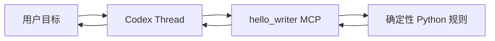
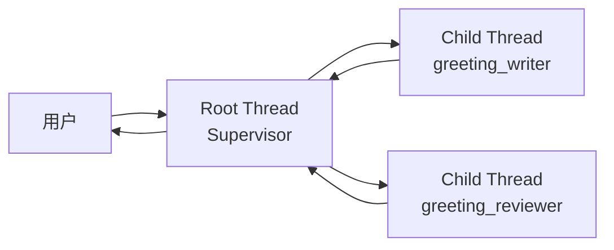
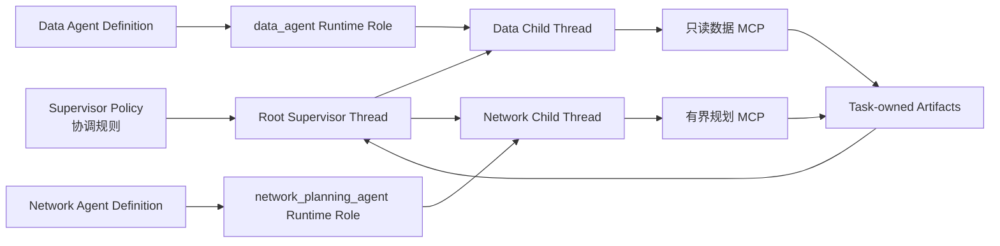

# 零基础开发多 Agent：从一个 Tool 到受治理的企业协作

## 1. 这套教程解决什么问题

这套教程面向第一次开发 Agent 的工程师。你只需要：

- 能看懂基础 Python；
- 会在终端运行命令；
- 知道 JSON 是结构化数据；
- 会查看 Git 工作区状态。

学习过程分成三篇：

1. [Hello Agent：15 分钟跑通第一个 Tool](tutorials/hello-agent-quickstart.md)
2. [Hello Team：用两个真实子 Agent 完成协作](tutorials/hello-agent-team.md)
3. [仓网规划：接入企业 Supervisor、治理合同与 Artifact](tutorials/supply-chain-agent-tutorial.md)

不要一次读完。第一篇先证明 Codex 会真实调用确定性 Tool；第二篇再引入两个独立
子 Thread；第三篇才讨论企业为什么还需要 Policy、Definition、授权和持久成果。

> 多 Agent 开发最容易犯的错误，是还没有把一个 Tool 做正确，就先画出十几个 Agent；
> 或者看到两个 Skill、两个 MCP Server，便把它们称为两个 Agent。本教程会把这些
> 概念放到真正需要它们的步骤中。

---

## 2. 从简单能力到企业协作，究竟增加了什么

第一步，用户只需要一条可靠问候：



这时，一个 Thread 就是本次运行中的 Agent。Skill 告诉它何时调用 Tool，MCP 把
Tool 接入 Runtime，普通 Python 保存可重复的业务规则。

第二步，生成结果的人不应同时成为唯一审核人，于是需要两个执行身份：



这里真正新增的不是第二个 Tool，而是第二个由 Codex Runtime 拥有的 Thread。每个
子 Thread 有独立身份、角色、上下文、Tool 调用和状态。

第三步，仓网规划进入企业场景后，仅有三个 Thread 仍然不够。平台还必须回答：

- 允许启动的是哪个版本的 Supervisor 规则；
- 企业发布的是哪两个专业 Agent；
- 它们映射到哪些真实 Runtime Role；
- 大型数据如何交接而不复制进消息；
- 成果如何在 Run 结束后继续被授权读取；
- 浏览器怎样展示真实轨迹而不建立第二套 Agent 状态。

于是形成当前完整链路：



这四层不能混在一起：

| 层 | 回答的问题 | 当前示例 |
| --- | --- | --- |
| 业务核心 | 结果怎样确定性计算 | `build_greeting`、覆盖率与成本算法 |
| 能力包 | Runtime 能发现哪些方法与工具 | Plugin、Skill、MCP Server |
| Runtime 执行 | 本次究竟创建了谁、怎样协作 | Root/Child Thread、Runtime Role |
| 平台治理 | 允许怎样协作、成果如何授权和保留 | Policy、Agent Definition、Artifact |

---

## 3. 当前代码已经走到哪里

截至当前分支，仓库已经验证：

- 新 Thread 可以通过选中的 capability roots 发现 Plugin 中的 Skill 与 MCP；
- Codex Runtime 创建的子 Thread 会继承父 Thread 选择的 capability roots；
- Profile 可以通过正式 Agent 设置配置可发现的 Runtime Role；
- Root Thread 可以用 Codex 原生协作 Tool 创建并等待真实子 Thread；
- 平台可以发布版本化 Supervisor Policy 和 Agent Definition，并在 Run 启动前检查
  Capability Manifest、multi-agent 开关、并发/深度限制和精确 Role；
- MCP Resource 可以从真实 Tool 结果注册为具有独立身份、Task 授权和生产者来源的
  持久 Artifact；
- 最新一次“华东新增仓”真实案例跑通一个根 Thread、两个指定 Role 子 Thread、
  33 次企业 MCP 调用、十个 ready Artifact 和一份六段式报告；稳定验收要求的是
  必需 Schema 的最小集合，调用和 Artifact 精确数量允许随有效调查步骤变化；
- 页面刷新及 Server/Profile Host 重启后，可以恢复同一 Policy、Agent 树、
  Artifact 摘要和根报告。

这些事实有一组明确限制：

| 已验证范围 | 尚未成为通用能力 |
| --- | --- |
| 单用户入口、单 Profile、一个受控企业案例 | 多 Profile、多用户生产隔离 |
| 两个固定企业 Role 的受限 happy path | 任意 Agent Catalog 与在线发布 |
| Root 与两个直接子 Agent 的真实轨迹 | 深层树、通用 follow-up、interrupt 和部分失败 |
| 同 Task 的 Artifact 创建与读取 | 替代、失效、删除、保留和跨 Run 复用 |
| 子 Thread 继承根能力包 | 按 Role 动态授予不同 capability root |
| 代码发布的一个企业 Policy | 通用 Policy 编辑器或流程画布 |

因此，教程会真实使用当前能力，但不会把受限 happy path 写成“企业多 Agent 平台已经
完整交付”。当前能力声明仍以[能力基线](capability-baseline.md)为准。

---

## 4. 第一站：Hello Agent

目标：

> 用户说“向小林问好”，Codex 必须真实调用 `hello_writer.say_hello`，不能只凭模型
> 自己写一句问候。

仓库示例位于：

[`tools/hello-agent`](../tools/hello-agent/)

先运行：

```bash
tools/hello-agent/bin/setup-env

.local/open-web-codex/tool-envs/hello-agent/bin/python \
  -m pytest tools/hello-agent/tests -q

.local/open-web-codex/tool-envs/hello-agent/bin/python \
  tools/hello-agent/tests/stdio_smoke.py
```

当前基线结果：

```text
8 passed
Hello Agent stdio smoke passed
```

然后阅读
[Hello Agent 快速入门](tutorials/hello-agent-quickstart.md)。它会逐步解释：

- 纯业务函数为什么不能藏在 Prompt 里；
- 类型注解怎样形成 Tool 合同；
- `FastMCP`、`@mcp.tool()` 和 stdio 分别做什么；
- launcher、`.mcp.json`、Skill 与 Plugin 各自属于哪一层；
- 如何判断 Codex 是否真的调用了 Tool。

完成这一站，只证明“一名 Agent 使用了一项确定性能力”。这已经是后续所有协作的
基础，不能跳过。

---

## 5. 第二站：Hello Team

第二篇增加三个职责：

- Greeting Writer：生成结构化问候；
- Greeting Reviewer：审核问候，但不能改写；
- Root Supervisor：安排先生成、后审核，并决定最终是否交付。


这一步分成两种不同验证：

1. stdio smoke 在进程边界验证两个 MCP Server 的 Schema 与交接合同；
2. Runtime 练习配置 `greeting_writer` 和 `greeting_reviewer` 两个 Role，由根
   Thread 创建两个真实子 Thread。

角色指令与根请求已经放在脚手架：

- [`greeting-writer.md`](../tools/hello-agent/examples/runtime-roles/greeting-writer.md)
- [`greeting-reviewer.md`](../tools/hello-agent/examples/runtime-roles/greeting-reviewer.md)
- [`hello-team-request.md`](../tools/hello-agent/examples/hello-team-request.md)

详细步骤见：

[Hello Team 双 Agent 教程](tutorials/hello-agent-team.md)

### 为什么两个能力仍放在一个 Plugin

当前代码是：

```text
tools/hello-agent/
├── hello_agent/core.py
├── hello_agent/writer_server.py
├── hello_agent/reviewer_server.py
├── skills/say-hello/
├── skills/review-greeting/
└── .mcp.json
```

目录与运行身份不是同一件事：

```text
Plugin 目录
    = 代码、依赖、Skill 和 MCP 的发布边界

Runtime child Thread
    = 本次实际运行的 Agent 身份和执行历史
```

Writer 和 Reviewer 共享合同、依赖、团队与版本周期，所以一个 Plugin 更合理。
是否拆 Plugin 应由发布、部署和授权边界决定，而不是由 Agent 数量决定。

当前子 Thread 继承父 Thread 的 capability roots，所以两个 Role 都能发现同一能力
包。Role instructions 可以约束职责，却不能证明 Reviewer 在安全上绝对无法调用
Writer Tool。真正的权限必须由 MCP 的操作面、服务端资源绑定和平台授权保证。

---

## 6. 第三站：仓网规划

仓网案例把 Hello Team 的交接关系扩展为企业决策：

| Hello Team | 仓网规划 |
| --- | --- |
| Greeting Writer | Data Agent |
| Greeting Reviewer | Network Planning Agent |
| `Greeting` | `planning-dataset.v1` |
| Writer Tool | 数据检查、聚合和验证 Tool |
| Reviewer Tool | 覆盖率、场景比较和有限候选选址 Tool |
| 短结构化消息 | MCP Resource + Task Artifact |
| Root Supervisor | Policy-bound Enterprise Supervisor |

这只是“上游产生可信输入、下游基于同一输入工作”的结构类比。Network Planning
Agent 会计算新方案，不是一个只做格式检查的 Reviewer。

业务问题是：

1. 当前一日到货覆盖率是多少？
2. 不新增仓但重新优化分配时，基准结果是多少？
3. 增加杭州或无锡仓后，时效和成本怎样变化？
4. 哪个方案应该成为默认建议，哪些条件会改变建议？

当前实现位于：

[`tools/supply-chain-network-planner`](../tools/supply-chain-network-planner/)

真实平台合同位于：

- [`enterprise-supervisor-copilot-v1.md`](../apps/web/server/resources/supervisor-policies/enterprise-supervisor-copilot-v1.md)
- [`data-agent-v1.json`](../apps/web/server/resources/agent-definitions/data-agent-v1.json)
- [`network-planning-agent-v1.json`](../apps/web/server/resources/agent-definitions/network-planning-agent-v1.json)

详细教程见：

[仓网规划 Agent 教程](tutorials/supply-chain-agent-tutorial.md)

这一篇会解释：能力包为什么不能拥有 Policy、Definition 为什么不是运行实例、
Role 怎样映射到子 Thread、Resource 怎样物化为 Artifact，以及真实 E2E 的九项
证据分别证明了什么。

---

## 7. Resource 与 Artifact 是同一份内容的两个生命周期

Hello 问候只有几个短字段，普通消息足够传递。

仓网 Dataset 和规划结果需要稳定引用。Tool 首先发布 MCP Resource：

```text
supply-chain-data://resources/<opaque-id>
supply-chain://resources/<opaque-id>
```

这个引用属于 Runtime 与 MCP 的执行合同。Network Agent 可以通过
`read_mcp_resource` 读取 Data Agent 返回的同一内容，避免把订单和全部规划输入复制
进消息。

平台观察到真实 Tool 完成事件中的 `resource_link` 后，为同一内容注册 Artifact：

```text
MCP Resource
    ↓ Tool completion + provenance
Task-owned Artifact
    ↓ 独立 ID、授权、状态和持久内容
Browser / later authorized history
```

| 对象 | 谁拥有 | 主要用途 |
| --- | --- | --- |
| 普通消息 | Codex Thread history | 短问题、短结论、小型结构 |
| MCP Resource | MCP Server / Runtime 调用链 | Agent 之间按原引用读取同一内容 |
| Artifact | Web Platform | 独立授权、持久化、浏览器读取和生产者追踪 |

Run、Thread、Turn 和 Item 只记录 Artifact 从哪里产生，不拥有 Artifact。删除生产
Run 不应删除 Artifact 或其 Task grant。

---

## 8. 开发一个新领域 Agent 的推荐顺序

不要从 Supervisor Prompt 开始。当前架构推荐按照证据逐层上移：

1. 固定一个能人工核对的小型业务问题；
2. 准备去标识化 fixture 与已知结果；
3. 用普通代码实现确定性规则和稳定类型；
4. 为成功、拒绝和错误建立单元测试；
5. 通过 MCP 暴露最小 Tool 与 Resource；
6. 用 Skill 说明触发、顺序、校验、失败和停止条件；
7. 用 stdio smoke 证明真实 MCP 协议链；
8. 把相关 Skill/MCP 组成一个可发现 Plugin；
9. 定义 Runtime Role，并用真实子 Thread 验证分工；
10. 只有需要企业发布、版本和协调规则时，才增加 Agent Definition 与 Supervisor
    Policy；
11. 大型跨 Agent 成果接入 Task-owned Artifact；
12. 最后覆盖审批拒绝、数据缺失、Agent 失败、中断、重启与恢复。


每增加一层，都应该解决前一层解决不了的具体问题：

| 新层 | 它解决的问题 |
| --- | --- |
| MCP | 让 Runtime 以稳定 Schema 调用确定性能力 |
| Skill | 让模型知道何时、按什么步骤调用 |
| Runtime Role | 让子 Thread 获得明确执行职责 |
| Agent Definition | 让企业发布和审查“允许提供什么 Agent” |
| Supervisor Policy | 让根 Thread 的协调规则可版本化、可绑定、可追踪 |
| Artifact | 让成果脱离消息和生产 Run 获得独立身份与授权 |

如果说不清新层解决了什么问题，就先不要增加它。

---

## 9. 怎样证明“真的完成”

不同测试证明不同事实：

| 证据 | 能证明 | 不能证明 |
| --- | --- | --- |
| 纯函数单元测试 | 业务规则与边界可重复 | Runtime 能发现 Tool |
| MCP stdio smoke | initialize、tools/list、tools/call 真实通过 | 存在两个 Agent |
| 新 Thread Tool 调用 | Skill/MCP 被 Runtime 发现和执行 | 子 Agent 与治理已成立 |
| 父子 Thread 轨迹 | Codex 真实创建多个 Agent | 企业授权和 Artifact 生命周期完整 |
| Policy/Definition binding | 协作规则与角色版本可追溯 | Prompt 本身形成权限 |
| Artifact 授权与恢复测试 | 成果具有独立身份并可恢复 | 所有保留/删除策略已经完成 |
| 真实企业 E2E | 指定环境和案例闭环成立 | 通用多用户生产能力 |

教程的目标不是让演示看起来成功，而是让读者知道每一层需要什么证据，以及目前证据
覆盖到哪里。

---

## 10. 进一步阅读

完成三篇教程后，再阅读：

- [领域 Agent 扩展架构](domain-agent-extension-architecture.md)
- [Skills、MCP 与自定义 UI 扩展](custom-skills-mcp-ui-guide.md)
- [Enterprise Supervisor Copilot 短期实施计划](enterprise-supervisor-copilot-plan.md)
- [系统架构](architecture.md)
- [能力基线](capability-baseline.md)
- [安全模型](security-model.md)

这些文档分别拥有目标设计、扩展规范、近期计划、当前代码事实和不可削弱的安全
边界。教程负责教学，不重新定义这些权威来源。
