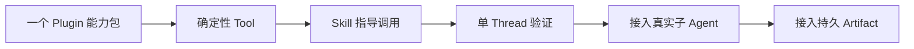
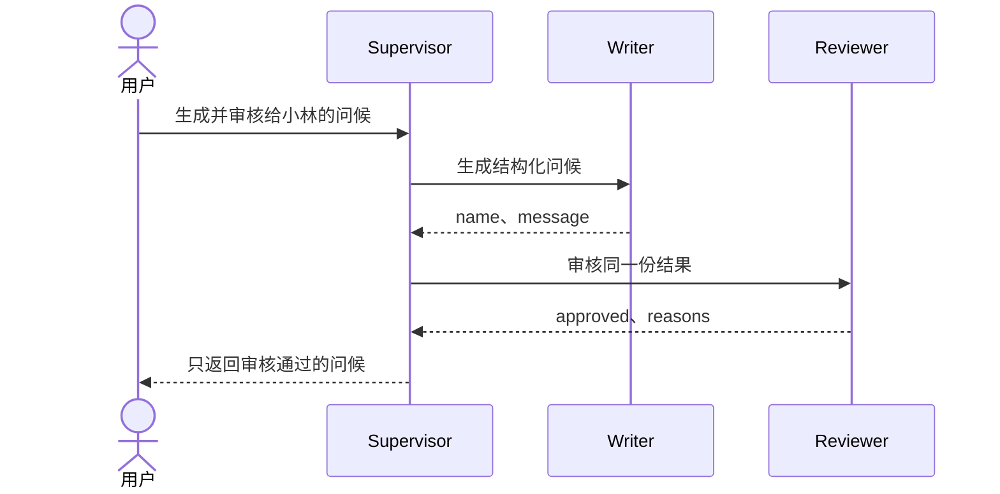

# 零基础开发多 Agent：从 Hello Agent 到仓网规划

## 1. 这套教程适合谁

这套教程面向第一次开发 Agent 的工程师。你只需要：

- 能看懂基础 Python；
- 会在终端运行命令；
- 知道 JSON 是结构化数据；
- 会查看 Git 工作区状态。

学习过程分成三篇可以独立完成的教程：

1. [Hello Agent：15 分钟跑通第一个 Tool](tutorials/hello-agent-quickstart.md)
2. [Hello Team：从一个 Agent 扩展到两个 Agent](tutorials/hello-agent-team.md)
3. [仓网规划：从领域能力走向真实多 Agent](tutorials/supply-chain-agent-tutorial.md)

不要一次读完。先完成第一篇并看到 Tool 被真实调用，再进入下一篇。

---

## 2. 当前阶段必须先说明

本文采用的是当前版本的短期可行方案。

目前已经可以：

- 在当前本地开发路径中，让新 Thread 发现 Plugin 中的 Skill 和 MCP；
- 让 Codex 调用结构化 Tool；
- 使用两个独立 MCP Server 表达不同职责；
- 在单 Thread 中验证完整业务能力链；
- 复用 Codex 已有的原生多 Agent 能力继续建设真实子 Thread。

目前还没有全部完成：

- Plugin 的安装、权限和 Studio 管理体验；
- Agent Definition 的完整发布体验；
- 按 Agent 为每个子 Thread 独立选择能力；
- 真实多 Agent Web 端到端轨迹的完整验证；
- 跨子 Thread 的持久 Artifact 交接；
- 面向开发者的一体化 Agent 创建界面。

因此，当前路径是：



这不是最终开发体验。未来平台能力补齐后，开发者会更直接地定义 Agent、选择能力和
连接交接结果，使用方式会更简单、更符合直觉。现在写好的 Tool、Skill 和数据合同
仍然可以复用。

当前能力是否可以对外宣称支持，以[能力基线](capability-baseline.md)为准。

---

## 3. 开始前只需要认识四个概念

第一篇教程只需要理解：

| 概念 | 简单解释 | Hello 示例 |
| --- | --- | --- |
| Agent | 能理解目标并决定下一步的智能工作者 | 当前 Codex Thread |
| Tool | Agent 可以调用的确定性函数 | `say_hello` |
| MCP Server | 把 Tool 标准化接给 Codex 的进程 | `hello_writer` |
| Skill | 告诉 Agent 何时、按什么规则调用 Tool | `$say-hello` |

先不要背 Runtime Role、Artifact 或 Agent Definition。它们会在真正需要时解释。

最小闭环是：


Agent 负责判断“应该调用什么”，普通 Python 负责可重复计算。

---

## 4. 第一站：Hello Agent

目标：

> 用户说“向小林问好”，Codex 必须真实调用 `hello_writer.say_hello`，不能只凭模型
> 自己写一句问候。

仓库已经包含可运行示例：

[`tools/hello-agent`](../tools/hello-agent/)

先运行：

```bash
tools/hello-agent/bin/setup-env

.local/open-web-codex/tool-envs/hello-agent/bin/python \
  -m pytest tools/hello-agent/tests -q

.local/open-web-codex/tool-envs/hello-agent/bin/python \
  tools/hello-agent/tests/stdio_smoke.py
```

期望：

```text
8 passed
Hello Agent stdio smoke passed
```

然后阅读
[Hello Agent 快速入门](tutorials/hello-agent-quickstart.md)。其中逐行解释：

- `FastMCP` 为什么存在；
- 纯业务函数和 MCP Tool 为什么分开；
- 类型注解怎样形成 Tool 合同；
- `@mcp.tool()` 做了什么；
- `mcp.run(transport="stdio")` 为什么不能随意打印日志；
- launcher、`.mcp.json` 和 Skill 分别属于哪一层；
- 如何判断 Codex 是否真的调用了 Tool。

完成标志：

- 单元测试通过；
- stdio 的 initialize、tools/list 和 tools/call 通过；
- 新 Thread 能看到 `$say-hello`；
- Tool 不可用时 Agent 不伪造结果。

---

## 5. 第二站：Hello Team

第二篇增加两个职责：

- Greeting Writer：生成结构化问候；
- Greeting Reviewer：审核问候，但不能改写；
- Supervisor：先安排生成，再安排审核。



先在一个 Thread 中依次调用两个 MCP Tool，证明交接合同正确。然后再理解怎样升级为
两个由 Codex Runtime 创建的真实子 Thread。

详细步骤见：

[Hello Team 双 Agent 教程](tutorials/hello-agent-team.md)

### 为什么两个 Agent 能力放在一个目录

当前代码是：

```text
tools/hello-agent/
├── hello_agent/core.py
├── hello_agent/writer_server.py
├── hello_agent/reviewer_server.py
├── skills/say-hello/
├── skills/review-greeting/
└── .mcp.json
```

因为目录与 Agent 身份不是同一件事：

```text
Plugin 目录
    = 代码、依赖、Skill 和 MCP 的发布边界

Runtime Agent Thread
    = 某一次真正运行的 Agent 身份和工作记录
```

两个能力共享：

- 同一套 `Greeting` 数据合同；
- 同一套姓名和消息规则；
- 同一 Python 环境；
- 同一发布团队和版本周期。

所以当前放在一个 Plugin 中最简单。Writer 和 Reviewer 仍然拥有不同 Skill、不同
MCP Server，并在未来使用不同 Runtime Role 和子 Thread。

必须注意：两个 MCP Server 是逻辑边界，不自动等于权限隔离。当前按 Agent 选择能力
尚未完整实现时，不能声称 Reviewer 在安全上绝对无法调用 Writer Tool。

只有当两个能力需要独立团队、依赖、发布、部署或授权时，才拆成两个 Plugin。

---

## 6. 第三站：仓网规划

仓网案例只是把 Hello Team 的结构放大：

| Hello Team | 仓网规划 |
| --- | --- |
| Greeting Writer | Data Agent |
| Greeting Reviewer | Network Planning Agent |
| `Greeting` | `planning-dataset.v1` |
| Writer Tool | 数据检查、聚合和验证 Tool |
| Reviewer Tool | 覆盖率、场景和选址 Tool |
| 短 JSON 消息 | MCP Resource，未来升级为 Artifact |
| Hello Supervisor | 仓网 Supervisor |

这只是对“上游产生结构化结果、下游消费结果”的流程类比，不表示 Greeting Reviewer
和 Network Planning Agent 具有相同业务职责。

业务问题是：

1. 当前一日到货覆盖率是多少？
2. 如果在杭州增加仓库，时效和成本变化多少？
3. 一日覆盖率达到 90% 至少需要增加几个仓？

当前实现位于：

[`tools/supply-chain-network-planner`](../tools/supply-chain-network-planner/)

详细教程见：

[仓网规划 Agent 教程](tutorials/supply-chain-agent-tutorial.md)

其中会解释：

- 为什么 Data 和 Network Planning 要分工；
- 为什么仍然先放在一个 Plugin；
- 为什么地图能力继续复用 `map_utils`；
- 一日达为什么不能只看导航时间；
- 实际覆盖率和优化覆盖率为什么不同；
- 当前 Resource 与未来 Artifact 的区别；
- 如何从单 Thread 能力链升级到真实多 Agent。

---

## 7. 什么时候才算两个真实 Agent

两个 Skill 不是两个 Agent，两个 MCP Server 也不是两个 Agent。

只有 Codex Runtime 真实创建两个独立子 Thread，才能声称存在两个运行中的 Agent：

```text
Root Supervisor Thread
├── Data Agent Thread
└── Network Planning Agent Thread
```

每个子 Thread 应拥有：

- 独立 Thread ID；
- 父 Thread 关系；
- 使用的 Runtime Role；
- 自己的消息和 Tool 调用；
- running、completed、failed、interrupted 等真实状态；
- 恢复后仍可找到的上下文。

当前多 Agent trajectory 仍是 experimental。教程中的单 Thread 验证是短期可运行
方案，不能包装成已经完成的双 Agent Runtime 轨迹。

---

## 8. Resource 与 Artifact 何时出现

Hello 问候只有几个短字段，用普通消息交接即可。

仓网 Dataset 可能很大，需要先用 MCP Resource 保存内容并返回引用：

```text
supply-chain-data://resources/<opaque-id>
```

真正跨 Agent、需要长期身份和授权的结果，未来使用平台 Artifact：

| 交接方式 | 适合什么 |
| --- | --- |
| 普通消息 | 短问题、短结论和小型 JSON |
| MCP Resource | 当前 MCP 内部需要重复读取的有界结果 |
| Artifact | 跨 Agent、需要版本、授权和长期保留的成果 |

不要把所有短消息都变成 Artifact，也不要把大型 Dataset 复制进 Agent 消息。

---

## 9. 推荐开发顺序

开发新的领域 Agent 时，复用同一顺序：

1. 固定一个可以人工核对的小问题；
2. 准备去标识化 fixture；
3. 把确定性规则写成普通代码；
4. 为代码增加严格输入、输出和失败；
5. 通过 MCP 暴露最小 Tool；
6. 用 Skill 说明触发条件和调用顺序；
7. 在单 Thread 中跑通完整业务链；
8. 再增加真实 Runtime Role 和子 Thread；
9. 大结果通过授权 Artifact 交接；
10. 验证拒绝、取消、失败、重启和恢复。


---

## 10. 进一步阅读

完成三篇教程后，再阅读：

- [领域 Agent 扩展架构](domain-agent-extension-architecture.md)
- [Skills、MCP 与自定义 UI 扩展](custom-skills-mcp-ui-guide.md)
- [Enterprise Supervisor Copilot 短期实施计划](enterprise-supervisor-copilot-plan.md)
- [系统架构](architecture.md)
- [能力基线](capability-baseline.md)

这些文档分别拥有架构、扩展规范、近期计划和当前能力事实。教程只负责教学，不重新
定义核心术语或宣称尚未通过验证的能力。
