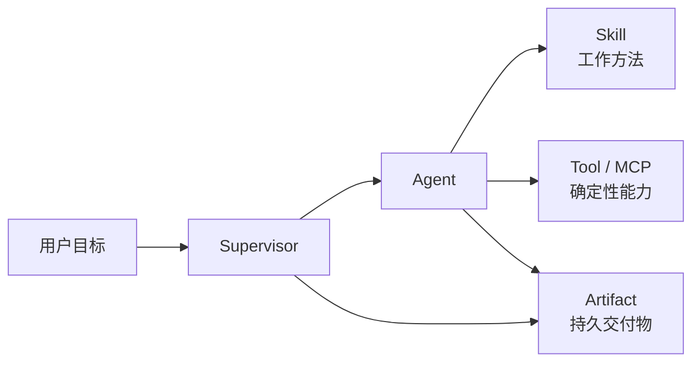

# 从第一次 Tool 调用到受治理 Supervisor

这是一条面向第一次接触本项目的用户和开发者的实践路径。你不需要先理解 Codex
内部协议，也不需要先阅读架构文档。每一篇都会先让你得到一个可观察的成功结果，再
解释刚刚使用的对象和边界。

## 开始前你需要什么

完成整套教程前，请确认：

- 本地平台已经按[运行手册](mvp-runbook.md)启动；
- Web 页面可以打开，左侧能看到至少一个 Workspace；
- 已配置可用的 Provider 和模型；
- 你能在仓库根目录运行教程给出的准备与测试命令；
- 教程使用的 `hello-agent` 和 `supply-chain-network-planner` 能力包仍在当前工作树。

当前开发环境是单用户、单 Profile。教程不会要求你配置租户、成员或跨用户权限，但
Workspace、Task、Thread、Artifact 和审批仍然经过平台记录与授权。

Provider 调用可能产生费用。供应链案例会启动多个 Agent，并比普通对话消耗更多
模型 Token。开始前应选择你愿意用于练习的模型。

## 你会完成四次交付

| 顺序 | 教程 | 预计时间 | 完成后得到什么 |
| --- | --- | ---: | --- |
| 1 | [Hello Agent](tutorials/hello-agent-quickstart.md) | 10–15 分钟 | 一个真实调用确定性 Tool 的普通 Thread |
| 2 | [Hello Team](tutorials/hello-agent-team.md) | 20–30 分钟 | 两个已发布 Agent Release 和一个已发布 Supervisor Release |
| 3 | [企业仓网 Supervisor](tutorials/supply-chain-agent-tutorial.md) | 20–30 分钟 | 一次可恢复的多 Agent 分析、Agent 轨迹和一组持久 Artifact |
| 4 | [审批与故障恢复](tutorials/approvals-and-recovery.md) | 15–20 分钟 | 能判断何时审批、何时拒绝，以及失败后从哪里恢复 |

不要一次读完。每篇末尾都有完成检查表；当前一篇没有通过时，不要用下一层掩盖问题。

## 先记住六个对象



| 对象 | 初学时怎样理解 | 不要把它误解成 |
| --- | --- | --- |
| Supervisor | 对最终目标负责，分配工作并综合交付 | 第二套 Runtime 调度器 |
| Agent | 承担一种清晰职责的运行角色 | 一组散落的 Tool |
| Skill | 告诉 Agent 何时、按什么方法使用能力 | 执行业务计算的代码 |
| Tool / MCP | 以类型化输入输出执行确定性操作 | 拥有目标和责任的 Agent |
| Thread | Codex 保存对话和执行上下文的运行记录 | 平台自己复制的一份聊天状态 |
| Artifact | 有独立身份、授权和来源的持久交付物 | 只能依附某一次 Run 的临时附件 |

第一篇只用一个普通 Thread 和一个 Tool。第二篇才引入发布的 Agent 与 Supervisor。
第三篇再处理 Resource、Artifact 和企业证据。这样每增加一层，都有明确理由。

## 当前框架中的发布关系

在 Web 中创建 Agent 时，用户不是直接输入任意 MCP Server 或 Tool 名称。当前流程
要求选择一个已评审的 capability template：

```text
已评审 capability template
  └── 固定 Runtime Role、MCP Server、Tool allowlist 和能力根
        ↓
用户 Agent draft
  └── 定义职责、工作方法和 Artifact 合同
        ↓ Validate → Publish
不可变 Agent Release
        ↓ 精确选择
Supervisor draft
        ↓ Validate → Publish
不可变 Supervisor Release
```

这意味着：

- 用户可以定义 Agent 的职责、方法、限制和交付物；
- 用户可以收窄模板允许的 Artifact 输入输出；
- 用户不能通过文本声明获得模板没有提供的 Tool、凭据或数据权限；
- Supervisor 绑定精确的 Agent Release，而不是按名称寻找“差不多的版本”；
- 已发布版本不可编辑；修改时创建新版本，已有 Thread 继续使用原绑定。

当前发布级证据覆盖自定义 Agent/Supervisor 的创建、验证、不可变发布和运行目录解析；
自定义 Release 的真实 Runtime 执行还不是教程门禁。因此第二篇以发布成功为闭环，
第三篇使用已通过真实 E2E 的内置企业 Supervisor 学习 Root 与 Child Threads。

## 怎样判断一次练习真的成功

不同证据回答不同问题：

| 证据 | 它能证明什么 |
| --- | --- |
| 单元测试 | 普通业务规则和输入边界可重复 |
| MCP stdio smoke | Server 能初始化、列出并调用 Tool |
| Thread 中的 Tool 事件 | Runtime 真实发现并执行了能力 |
| Agent Activity 中的父子节点 | Runtime 真实创建了多个 Agent Thread |
| `Validated` 与 `Published` | Agent/Supervisor 合同通过平台校验并形成不可变 Release |
| Artifact 卡片 | 交付物拥有 Schema、生产者、状态和持久身份 |
| 刷新后仍能恢复 | 页面不是靠临时前端状态伪造结果 |

模型直接说出一个看似正确的答案，不足以证明 Tool 调用成功；数据库出现一条
“Agent running”记录，也不足以证明 Runtime 创建了子 Thread。

## 每篇教程共同遵守的边界

- 不把 Provider Key、内部 Resource URI、宿主机路径或 Runtime request ID 写进
  Prompt、截图或教程结果；
- 不通过脚本偷偷修改隐藏 Profile 配置；
- 不在 Tool 不可用时让模型伪造等价结果；
- 不把 Role instructions 当成授权；
- 不为了减少弹框关闭全部审批；
- 不把当前单 Profile 练习写成已经完成多用户生产隔离；
- 不要求维持旧教程版本、旧 Schema 或旧 Release 的运行时兼容。

## 学习完成后的下一步

完成四篇教程后，你应该能独立回答：

1. 这个需求是否只需要一个普通 Thread 和 Tool？
2. 为什么需要独立 Agent，而不是让 Root 自己完成所有工作？
3. Agent 的能力来自哪里，为什么 instructions 不能扩大权限？
4. Supervisor 应绑定哪些精确 Agent Release 和 Artifact 交付合同？
5. 哪些操作可以预批准，哪些操作必须由用户决定？
6. 失败属于 Provider、能力包、Runtime、Agent、Artifact 还是浏览器投影哪一层？

需要继续开发新领域能力时，再阅读：

- [领域 Agent 扩展架构](domain-agent-extension-architecture.md)
- [Supervisor、Agent、Skill 与 Tool](supervisor-agent-skill-tool-architecture.md)
- [Skills、MCP 与自定义 UI 扩展](custom-skills-mcp-ui-guide.md)
- [系统架构](architecture.md)
- [安全模型](security-model.md)
- [能力基线](capability-baseline.md)

教程负责教你完成一次正确交付；这些权威文档负责定义架构、安全和当前能力边界。
