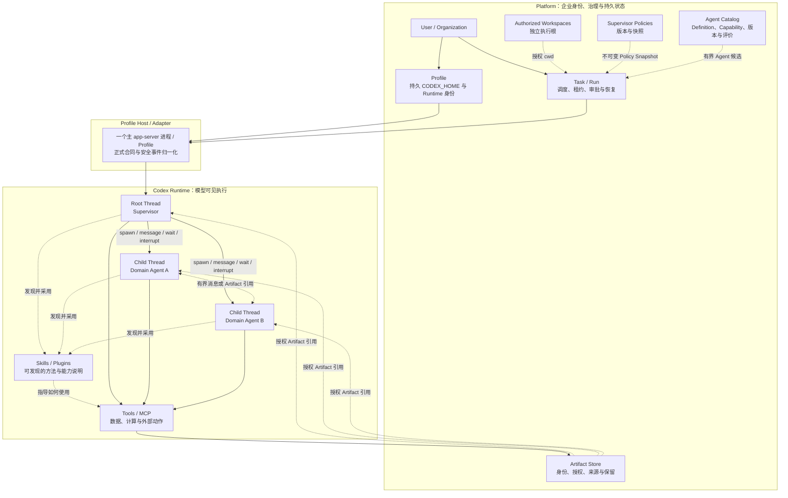
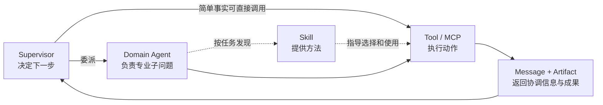
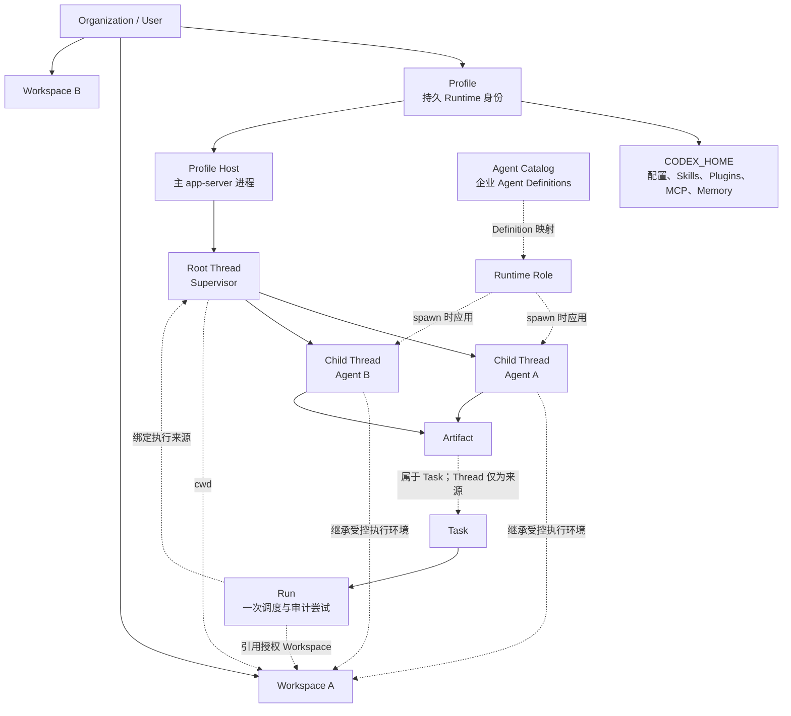
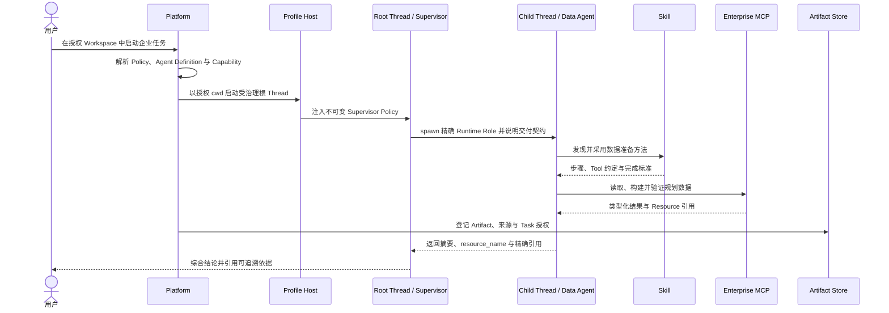

# Supervisor、Agent、Skill 与 Tool 的分层架构

> 文档性质：企业 Agent 能力分层与平台对象关系说明
>
> 更新日期：2026-07-27
>
> 适用范围：解释 `Supervisor → Agent ↔ Agent → Skill → Tool/MCP` 与
> Profile、Workspace、Thread、Agent Registry（实施对象称为 Agent Catalog）的关系
>
> 事实边界：图中同时包含当前骨架与目标治理能力；每一节会明确区分二者

---

## 结论先行

`Supervisor → Agent → Skill → Tool` 看起来像一条调用链，但更准确地说，它是四层
责任：

| 层 | 回答的问题 | 本质 |
| --- | --- | --- |
| Supervisor | 为了完成总目标，下一步应该解决什么、由谁负责 | 根 Thread 中的协调角色 |
| Agent | 某个专业子问题由谁持续分析并返回结论 | 运行在独立 Thread 中的专业角色 |
| Skill | 这类问题应该遵循什么方法、步骤和输出约定 | Runtime 向模型提供的可发现说明 |
| Tool / MCP | 哪项确定性动作真正访问数据、计算或改变外部系统 | 受权限约束的执行能力 |

Skill 不会代替 Agent 思考，也不是一个后台服务；MCP 不会决定业务目标，也不是
Agent。Supervisor 和 Domain Agent 都可以使用 Skill 和 Tool，区别在于它们承担的
责任不同。

Capability 也很重要，但它不是第五层执行组件。它是一项稳定的能力声明，用来连接
Agent Definition、Skill、Tool 和治理策略。例如，`network.optimize` 表示“能够完成
受约束的仓网优化”，具体方法可以由一个或多个 Skill 描述，实际计算可以由不同 Tool
实现，平台策略则决定当前任务是否允许使用。

Agent 之间的横向协作也不意味着默认采用 P2P 网络。Domain Agents 可以交换有限
消息或引用彼此的 Artifact，最终目标和结论仍由 Root Supervisor 负责。

---

## 1. 一张图看清完整结构

这张图有三条需要特别注意的边界：

1. **Profile 和 Workspace 不在 Agent 层级中。** Profile 是 Runtime 身份与环境，
   Workspace 是授权执行根，它们不会因为创建子 Agent 而被复制。
2. **Agent Catalog 不创建正在运行的 Agent。** 它提供经过治理的 Definition；
   Runtime 真正创建的是 Root/Child Thread。本文把常说的 “Agent Registry” 收敛为
   Agent Catalog，避免与 Codex 内部的 Runtime Registry 混淆。
3. **Artifact 不属于某个 Thread。** Thread、Turn 和 Item 只记录来源；Artifact
   自身拥有身份、授权和保留周期。

---

## 2. 四层能力分别负责什么

### 2.1 Supervisor：维护总目标和最终责任

Supervisor 运行在根 Thread 中。Codex 已经提供创建子 Agent、发送消息、等待和中断
的运行机制，但默认根 Agent 并不会自动成为企业 Supervisor。

企业 Supervisor 还需要版本化行为策略，明确：

- 怎样建立共同的问题框架；
- 什么情况下应该委派；
- 子任务需要什么输入和 Artifact；
- 什么时候追加调查，什么时候复用既有 Agent；
- 怎样识别数据、假设、方法和评价标准冲突；
- 什么情况下停止；
- 最终报告必须包含哪些依据、风险和缺失证据。

当前项目通过代码发布的 Supervisor Policy，将这些规则作为服务端解析的
`developer_instructions` 进入受治理根 Thread。Policy 被保存为不可变快照并绑定到
Run；浏览器不能提交一段任意 Prompt 来替换它。Workspace 中的通用 Governed
Supervisor 入口读取服务端发布目录并让用户选择 Policy，不绑定任何领域 Policy
ID、版本或 Agent 顺序。当前供应链顺序只属于
`enterprise-supervisor-copilot@1.7.0` 这一可选 Policy，服务端不发布或解析旧版本。
当前 Policy 通过 Runtime 的 exact Agent Role allowlist 和 per-Role instance limit
约束模型可见目录、执行入口与驻留实例数，并通过 Role 配置关闭子 Agent 继续委派；
提示词不承担授权职责。已发布显示名和执行内容保持不可变，需要改变时必须发布新版本。

Supervisor 不负责：

- 判定用户是否有权限；
- 批准高风险操作；
- 维护 Run 租约和终态；
- 伪造 Tool 结果；
- 宣布 Artifact 已持久化；
- 自己实现子 Thread 消息路由。

### 2.2 Agent：拥有专业任务的 Runtime 角色

Domain Agent 是在独立 Runtime Thread 中执行的专业角色。它应该有清楚的职责、
输入、输出、可使用能力和禁止范围。

以当前仓网案例为例：

| Agent | 负责 | 不负责 |
| --- | --- | --- |
| Data Agent | 检查数据源、生成并验证规划数据 Artifact | 选择仓址或作最终建议 |
| Network Planning Agent | 读取授权输入、调用确定性规划工具、比较方案 | 扩大数据权限或替企业作决定 |
| Root Supervisor | 分工、检查证据、处理冲突、综合最终报告 | 代替专业工具计算或批准操作 |

Agent 的三个名称容易混淆：

| 概念 | 含义 |
| --- | --- |
| Agent Definition | 平台治理记录，描述职责、版本、能力、输入输出和风险 |
| Runtime Role | Codex 能发现并在 spawn 时应用的执行配置 |
| Agent Thread | 本次协作中实际运行的 Agent 身份与历史 |

当前代码中，两个 Agent Definition 被映射为精确 Runtime Role；根 Supervisor 通过
Codex 原生多 Agent 工具创建子 Thread。当前受治理供应链 Policy 的根 Thread 不暴露
shell 或业务 MCP；每个 Role 只重新启用 Definition 声明的 MCP server/tool
allowlist。平台不会插入一条“Agent 实例”数据库记录来模拟这个过程。

### 2.3 Skill：把专业方法交给 Agent

Skill 是模型可发现的任务方法和操作说明。它适合表达：

- 什么时候使用这项能力；
- 按什么步骤完成；
- 需要先检查哪些输入；
- 应调用哪些正式 Tool/MCP；
- 输出必须满足什么结构和质量标准；
- 常见错误和停止条件是什么。

Skill 不应包含：

- 绕过 Runtime 的隐藏执行器；
- Secret 或固定用户凭据；
- 由文件名或显示文本猜测权限的逻辑；
- 与平台数据库并行的状态机；
- 只在某个示例里成立、却伪装成通用规则的常量。

当前仓网工具包已经把数据准备、基线建立、方案评估、优化和结果验证拆为独立 Skills。
下一阶段会把案例中过度固定的输入和规则继续下沉为明确业务事实与 Tool 合同，使
Skill 描述通用方法，而不是背诵一个示例答案。

### 2.4 Tool / MCP：执行确定性动作

Tool 是 Runtime 可以调用的动作；MCP 是把外部工具和资源以标准方式提供给 Runtime
的一种协议边界。

企业 Tool/MCP 适合负责：

- 查询授权数据；
- 执行确定性计算和优化；
- 校验 Schema、单位和约束；
- 读取或发布受控 Resource；
- 调用企业系统；
- 对高成本或有副作用的动作提出审批要求。

Tool/MCP 必须自行执行授权和输入校验。即使 Prompt 或 Supervisor 消息声称“已经
批准”，也不能把自然语言当作可信执行上下文。

在当前案例中：

- `supply_chain_data` 提供有界数据源目录、只读数据检查、构建和验证；
- `supply_chain_planner` 提供仓网快照、路线、方案计算、优化和验证；
- MCP 返回类型化 `data_ref` 与 `resource_name`；
- 平台把可交付结果登记为独立 Artifact，并向浏览器隐藏内部 Resource URI。

### 2.5 Capability：连接治理声明与真实能力

Capability 回答“这个 Agent 声称能完成什么”，但声明本身不证明能力真的可用。

一项企业 Agent Capability 成立，至少需要四个条件同时满足：

1. Agent Definition 声明该能力和适用边界；
2. 当前 Runtime 能发现需要的 Role、Skill 与 Tool；
3. 当前用户、Task 和资源范围获得企业授权；
4. 真实验证证明输入、输出和失败语义符合合同。

还需要区分两类容易同名的能力：

| 类型 | 示例 | 作用 |
| --- | --- | --- |
| 业务 Capability | `network.optimize`、`data.query` | 描述 Agent 对业务能做什么 |
| Runtime Capability | `agents.multi_agent@1.0.0` | 证明当前 Codex 构建支持某项运行机制 |

Supervisor 只能从已经通过这两层检查的候选中选择 Agent。目录里写着“支持仓网优化”，
但 Runtime 没有规划 Tool，或者当前 Task 没有数据授权，都必须明确判定为不可用。

---

## 3. Supervisor → Agent ↔ Agent → Skill → Tool 应该怎样理解

### 3.1 它不是每次都必须走完的固定流水线

通用 Supervisor 只有在其治理合同明确授予对应 Tool 时，才可以直接获取简单事实；
也可以先委派 Agent。当前供应链根 Supervisor 的合同只授予协作能力，领域 Tool
必须由 owning Domain Agent 调用。Agent 可以根据任务采用一个或多个 Skill，再调用
多个 Tool。Skill 只在相关时被发现和采用，不会成为所有调用的中转服务。

因此，更准确的关系是：

### 3.2 Agent ↔ Agent 有两种交换方式

| 方式 | 适合 | 不适合 |
| --- | --- | --- |
| Runtime 消息 | 追问、纠偏、小型摘要、等待和中断 | 大型数据、长期结果和授权事实 |
| Artifact 引用 | 数据集、计算结果、图表、报告和可复核证据 | 代替及时的协调消息 |

Domain Agents 可以直接交换有限消息，但默认仍由 Supervisor 维护全局目标。只有在
局部问题确实需要平等协商，并且规模、权限、预算和退出条件明确时，才考虑受限 Peer
模式。

### 3.3 Skill 与 Tool 的边界

用仓网规划说明：

- Skill 说明“先读取规划数据，确认单位和服务策略，再建立基线，最后比较同口径方案”；
- MCP Tool 负责真正读取数据、计算覆盖率、求解候选位置和验证结果；
- Agent 负责判断该采用哪种分析方法、如何解释结果和报告限制；
- Supervisor 负责判断这份结果是否足以回答企业问题。

把这些责任混在一起会产生两种相反错误：

- 把业务判断硬编码进 Tool，使工具只能重复一个案例；
- 把确定性计算写进 Prompt，使不同运行得到不可验证的数字。

---

## 4. Profile、Workspace、Thread 与 Agent Catalog

### 4.1 对象关系图

### 4.2 Profile：一个用户的持久 Runtime 环境

Profile 包含一个用户的 Runtime 身份和持久 `CODEX_HOME`，承载配置、Provider、
Skills、Plugins、MCP、Memory 和 Thread 历史所需环境。当前组合采用一个主
app-server 进程服务一个 Profile。

一个 Profile 可以使用多个经过授权的 Workspace，也可以拥有多个 Thread。创建
子 Agent 不会创建新 Profile；它是在同一 Runtime 环境中创建新的 Agent Thread。

当前状态：

- 单 Profile 主路径已实现；
- 企业 Supervisor 的 Runtime Roles 只对受治理请求可见；
- 多 Profile 动态路由和完整隔离仍是后续阶段。

### 4.3 Workspace：独立授权的执行根

Workspace 是文件系统和 Git 执行的授权根，不属于某个 Thread 或 Run。多个 Thread
可以在授权允许时使用同一个 Workspace。

Thread 的当前 `cwd` 由 Codex Runtime 拥有；平台负责验证它位于授权 Workspace
之内。Run 只引用选中的 Workspace，不创建或拥有一个 Run 私有 checkout。

这意味着：

- 创建 Agent 不复制 Workspace；
- Agent Definition 不绑定服务器绝对路径；
- Skill 可以描述相对的工作方法，却不能绕过 Workspace 授权；
- 托管 clone/worktree 是显式 Workspace 资源，不是 Thread 的隐式副作用。

### 4.4 Thread：Agent 真正运行的地方

Root Supervisor 和每个实际子 Agent 都运行在 Codex Thread 中。Thread 拥有：

- Turn 和 Item 历史；
- 模型可见上下文；
- Context compaction 与恢复语义；
- 工具调用与 Agent 通信；
- 当前 `cwd`。

根 Thread 可以创建子 Thread。子 Agent 完成一项任务后，后续对同一个 Agent 的追加
工作会形成新的 Turn；Web 可以为每个 Turn 建立独立任务节点，但这些节点只是从
Runtime 事件重建的视图，不能反向驱动 Agent。

### 4.5 Agent Catalog：Agent Registry 的实施对象

在理想架构讨论中，这项能力常被称为 Agent Registry。进入实施设计后，项目统一使用
**Agent Catalog**：它保存 Agent Definition，同时避免与 Codex Runtime 内部用于
发现 Agent 配置的 Registry 混淆。Catalog 中的 Definition 包含：

- 稳定 ID 和版本；
- 适用范围与所有者；
- 职责、输入、输出和所需能力；
- Runtime Role 引用；
- 风险、评价、发布和弃用状态。

它回答“企业允许使用哪些 Agent”，不回答“这次实际创建了哪些 Agent”。后一个问题
由 Runtime Thread 与 Agent 执行树回答。

当前项目还没有通用 Agent Catalog。现有的两个代码发布 Definition 是受限起点：

- 它们可以被服务端列出和解析；
- Policy 精确绑定其版本和 Runtime Role；
- 它们不能由普通用户在线创建或发布；
- 它们不拥有运行状态，也不充当子 Thread 记录。

Supervisor Policy 目录已经先采用同一原则：服务端注册表是新 Run 可选版本的唯一
来源，浏览器只消费其有界摘要；不可变历史版本仍可被已绑定 Run 恢复，但不会出现在
新建列表，也不能通过新 Run 接口重新选择。当前目录只有一个供应链模板不代表产品
语义被限定为供应链，增加其他领域应通过发布新的 Policy/Definition 包完成。

### 4.6 Task 与 Run：把业务目标和执行尝试分开

完整关系还需要 Task 与 Run 来连接业务目标和实际执行：

- Task 表示用户要完成的长期业务目标；
- Run 表示一次排队、租约、恢复和审计尝试；
- Root Thread 承担这次模型可见协作；
- Artifact 归属于 Task 的授权范围；
- Run、Thread、Turn 和 Item 保留 Artifact 的生产来源。

这样，一次 Run 失败不会抹去已经验证的业务成果，重新执行也不会要求创建新的
Workspace 所有权模型。

---

## 5. 一次真实任务怎样穿过这些层

这里有两条并行发生的事实链：

- **Runtime 链**：谁创建了谁、Agent 看到了什么、调用了什么；
- **Platform 链**：谁有权启动、使用哪个 Workspace、Artifact 是否持久、谁可读取。

二者通过正式合同连接，但不互相复制所有权。

---

## 6. 当前实现与目标状态对照

| 领域 | 当前实现 | 下一步目标 |
| --- | --- | --- |
| Supervisor | 一个代码发布 Policy，快照绑定根 Thread | Policy 评审、发布、弃用和评价 |
| Agent Catalog | 两个代码发布 Definition | 通用、受治理的 Catalog 与候选查询 |
| Runtime Agent | 原生根/子 Thread，精确 Role，顺序真实案例 | 追加任务、并行、中断、部分失败和深层关系验证 |
| Agent Web 视图 | 持久树投影与每 Turn 任务节点 | 进入权威历史、异常状态和多层导航 |
| Skill | Runtime 正式发现，仓网方法拆为多项 Skill | 去除案例固化，形成通用专业方法 |
| Tool/MCP | 只读数据与确定性仓网规划 MCP | 补充真实事实、数据、规则与生产授权上下文 |
| Workspace | 独立授权 managed Workspace | existing root、共享并发和 multi-`cwd` 证据 |
| Profile | 单 Profile 主进程 | 多 Profile 路由、隔离和生命周期 |
| Artifact | Task 级身份、来源、同 Task 交接 | 依赖、替代、失效、保留和跨 Run 复用 |

---

## 7. 最容易混淆的边界

### Agent Definition 不是 Prompt 文件

Prompt 或 developer instructions 只描述 Runtime 行为。Definition 还需要稳定身份、
版本、能力、输入输出、风险和治理状态。

### Runtime Role 不是企业权限身份

Role 可以约束专业行为，但 Tool/MCP 仍然必须根据服务端绑定的用户、Task、Profile
和资源范围授权。不能因为角色名叫 `data_agent` 就自动获得数据权限。

### Skill 不是 Agent

Skill 没有独立目标、Thread 和最终责任。Agent 可以组合多个 Skill，同一个 Skill
也可以被多个 Agent 使用。

### MCP Server 不是 Agent Catalog

MCP 提供工具和资源，不决定哪一个专业 Agent 应该被调用，也不保存 Agent 发布状态。

### Web Agent 节点不是 Runtime Agent 状态机

节点是从持久 Runtime 事件重建的安全视图。完成节点保持不变，是为了正确展示历史，
不是因为平台接管了 Agent 生命周期。

### Workspace 不是共享记忆

多个 Agent 可以在同一授权 Workspace 中工作，但模型上下文仍属于各自 Thread；
需要长期交换的业务成果应使用 Artifact，而不是依赖某个文件恰好存在于当前目录。

---

## 8. 设计检查清单

新增一个企业 Agent 能力时，应逐项回答：

### Supervisor

- 谁维护最终目标并综合结论？
- 什么情况下委派、追问、停止？
- 冲突由谁处理？

### Agent

- Definition 的稳定 ID、版本和职责是什么？
- 对应的 Runtime Role 是否真实可用？
- 输入、输出和禁止范围是什么？

### Skill

- 它描述的是可复用方法，还是只写死了一个案例？
- 哪些步骤需要 Tool 的确定性保证？
- 输出标准和失败条件是否清楚？

### Tool / MCP

- 权限依据来自哪里？
- 输入 Schema、单位、范围和资源限制是什么？
- 成功、失败、取消、超时和审批怎样表达？

### 平台对象

- 使用哪个 Profile 和授权 Workspace？
- Root/Child Thread 的关系由谁维护？
- Artifact 属于哪个 Task，来源是什么？
- Catalog 记录与 Runtime 实例是否保持分离？

### 验证

- 正常路径是否使用真实 Runtime 和 MCP？
- 刷新、重连和重启后是否恢复同一事实？
- 并行、追加任务、中断和部分失败是否有证据？
- 浏览器是否隐藏 Secret、内部 URI、路径和无界 Runtime 数据？

---

## 9. 代码事实入口

- Profile 与 Runtime 启动桥接：
  [`profile-host`](../apps/web/crates/profile-host)、
  [`codex-adapter`](../apps/web/crates/codex-adapter)；
- Supervisor Policy 与受治理启动：
  [`supervisor_policy.rs`](../apps/web/server/src/supervisor_policy.rs)、
  [`supervisor_runtime_preflight.rs`](../apps/web/server/src/supervisor_runtime_preflight.rs)；
- Agent Definition 与 Runtime Role 映射：
  [`agent_definition.rs`](../apps/web/server/src/agent_definition.rs)；
- Agent 与 Artifact 投影：
  [`event_projection.rs`](../apps/web/server/src/event_projection.rs)；
- 当前仓网 Skills 与 MCP：
  [`tools/supply-chain-network-planner`](../tools/supply-chain-network-planner)；
- 当前对象所有权：
  [系统架构](architecture.md)；
- 当前可验证能力：
  [能力基线](capability-baseline.md)。
