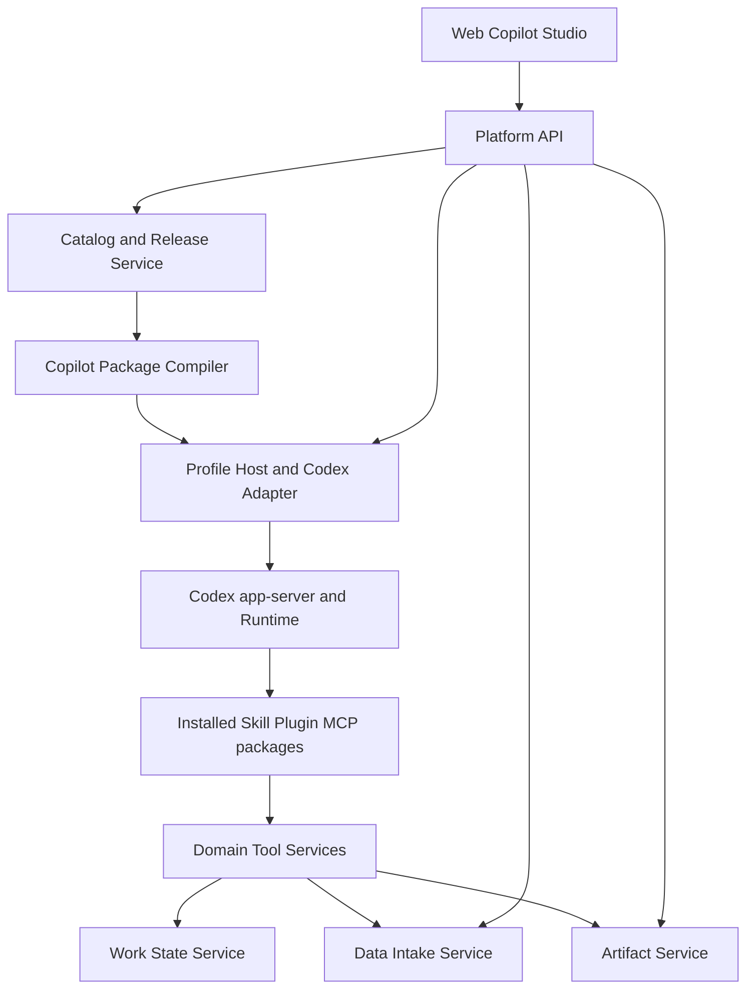

# Copilot 开发平台：Supervisor、Domain Agent、Skill 与 Tool 架构

| 字段 | 内容 |
| --- | --- |
| 状态 | 阶段二历史研究输入；不是当前接受架构 |
| 更新日期 | 2026-08-08 |
| 当前阶段 | 阶段一以 Codex 原生协作、MCP Resource 与 Workspace 文件完成内置仓网闭环 |
| 参考实现 | 印尼仓网规划 Copilot |
| 当前实施 | [开发计划](development-plan.md) |
| 接受基线 | [ADR-018](adr/018-built-in-network-copilot-runtime-closure.md) |

本文保存 ADR-017 时期对公开 Tool/Skill/Agent/Supervisor/Copilot 创作平台的研究。下文
关于 Work State、Data Intake、typed handles、Resource Broker、Assignment Grant、
Run Completion、Root-only 输入和五对象发布的设计已被 ADR-018 否决，既不是阶段一
合同，也不能直接作为阶段二 backlog。阶段二开始前必须根据阶段一证据重写本文件。

当前阶段只有以下合同有效：Task 固定授权 Workspace；同 Workspace Task 可显式复用普通文件
和授权 exact MCP Resource ref；允许经校验相对路径；Platform 不理解数据语义；Artifact 只承载用户交付；
协同、elicitation 与热加载最大化复用 Codex 原生能力。

## 1. 产品目标

算法工程师完成业务调研后，应能按以下路径交付一个场景：

1. 把稳定、可测试的算法和外部系统访问实现为 Tool；
2. 用中文 Skill 说明方法、输入条件、工具选择、失败处理和交付标准；
3. 创建一个或多个 Domain Agent，组合 Skills、Tools、数据权限和交付件；
4. 创建 Supervisor，定义总体责任、可用 Agent、协作规则和最终交付；
5. 在 Web 中验证、发布、安装、创建任务并观察真实执行；
6. 平台自动处理版本、内容摘要、依赖锁定、授权、持久化投影和恢复。

仓网规划只是验证这条路径的第一个参考场景。新增财务分析、质量检查或营销归因
Copilot 时，不应重新实现输入请求、Agent 生命周期、协作状态、版本发布、Artifact
交付和前端执行卡片。

## 2. 设计原则

1. **Runtime 执行，Platform 治理。** Thread、Turn、上下文、spawn、wait、Tool 调用、
   Skill 解释和 MCP 生命周期由 Codex Runtime 拥有；Platform 不创建第二个调度器。
2. **领域定义语义，平台提供机制。** 仓库、路线、成本属于仓网包；revision、依赖、
   readiness、幂等、终态和交付件索引属于通用平台能力。
3. **Catalog 不等于 Runtime ready。** 已发布、已授权、已安装、已被 Runtime 发现和
   当前可执行是不同状态，必须分别表达。
4. **Prompt 不承担权限。** 自然语言说明怎样工作，类型化合同决定能访问什么、需要
   什么输入、能交付什么以及是否允许执行。
5. **引用代替复制。** Agent 消息只传稳定身份、有界摘要和必要参数；大数据由权威
   owner 持久化，按授权和范围读取。
6. **发布者不维护机器字段。** semver、hash、Runtime role ID、MCP 内部名称、宿主
   路径和 lock file 由编译器生成。
7. **不兼容旧项目合同。** 直接迁移当前开发环境和所有调用方，删除 2.x、5.x、
   `planning-dataset.v2` 及领域协议在平台中的兼容分支。

### 2.1 平台机制、Skill 与执行 guardrail

可信机制只保护模型无法可靠承担的硬不变量；业务判断、分析方法和沟通方式继续由
Skill/Supervisor 指导。

| 问题 | Platform/Runtime 机制 | Skill/Instructions | 执行 guardrail |
| --- | --- | --- | --- |
| 可调用能力 | exact Release、Role 与 capability grant | 何时使用哪项已授权能力 | 未授权 Tool 不进入模型可见目录 |
| 数据访问 | typed handle、scope 与 resolver | 如何解释数据和判断缺口 | 错误类型、过期或越权在 Tool 边界拒绝 |
| 用户输入 | Runtime Root-only + durable Approval | Root 何时询问、怎样解释 | child 只返回 typed `needs_input` |
| Work State | SDK/server 原子 begin/commit、固定 write-set | Agent 判断业务 outcome | 模型不传 revision、operation ID 或 mutation JSON |
| Wire shape | Compiler 生成一个当前 Schema | 不指导字段兼容写法 | 严格校验，禁止 aliases 和字段猜测 |
| Run 完成 | required assignments 与 deliverable gate | Root 综合、解释冲突和部分成功 | 不满足合同不能标 completed |
| 安装可用 | Release、Installation、Discovery、Readiness 分别持有事实 | 不属于 Skill | `installed != discovered != ready` |
| 重试 | 稳定 operation identity 和幂等合同 | 是否更换业务方法 | 有界次数并保留原始 cause |

当前闭环不建设复杂信任分、证据图、自动重规划服务、Blackboard 或通用工作流 DSL。

## 3. 总体分层



| 层 | 拥有 | 不拥有 |
| --- | --- | --- |
| Browser | 编辑、选择、验证结果、执行展示、用户输入 | Runtime ID、宿主路径、Secret、调度语义 |
| Platform Server | Catalog、Draft/Release、授权、Secret 引用、Data Intake、Work State 元数据、Artifact、执行投影 | 模型上下文、Agent 推理、MCP 执行 |
| Package Compiler | 规范化、依赖解析、hash、版本、安装清单、能力要求 | 运行时发现结果、业务计算 |
| Profile Host | Profile 进程、类型化桥接、安装事务、Runtime 状态归一化 | 产品目录、业务工作状态 |
| Codex Runtime | Thread/Turn/Item、上下文、Agent 调度、Skills/Plugins/MCP/Tools | Web 工作流、企业授权、Catalog |
| Domain Package | 领域 schema、算法、外部系统适配、领域校验和报告 | 用户身份、通用上传、通用 Agent 状态 |

### 3.1 三平面、模块化单体

当前阶段采用模块化单体，不提前拆微服务。下列 Service/Controller 是同一个 Platform
Server 内的逻辑 owner 和可测试边界：

| 平面 | 权威 owner | 逻辑模块 |
| --- | --- | --- |
| Control Plane | Platform | Identity/Auth、Catalog/Compiler、Installation、Task/Run、Assignment Grant、Approval、Audit、Artifact metadata |
| Runtime Plane | Codex Runtime；Profile Host 只桥接 | Thread/Turn/context、Root/child Agent、spawn/wait/follow-up、Skill/Plugin/MCP discovery、Tool execution、Provider transport、官方输入 |
| Data Plane | Platform Data Intake + Domain Package | SourceAsset、Mapping Revision、Dataset Release、Work State、Domain Resource、Artifact blob、领域 schema/算法/校验 |

模块通过 typed contract 连接，但不因未来规模而先增加网络调用、分布式事务和独立部署。
多用户和容量证据出现后，再按 owner 边界评估拆分。

## 4. 五类可发布资源

所有资源采用 `Draft -> Validated Draft -> Immutable Release` 生命周期。Draft 使用整数
revision；Release 版本由服务器自动分配。发布操作锁定规范化内容和所有精确依赖。

### 4.1 ToolPackage

ToolPackage 是确定性能力及其安装声明，不等于某个 Python 文件。

```text
ToolPackage
  identity: organization_id + tool_package_id
  draft: revision + source bundle
  release: generated version + content_sha256
  contract: input schema + output schema + error taxonomy
  runtime: transport + launcher + health check + capability inventory
  policy: secret refs + network/filesystem/side-effect class + approval class
  tests: contract cases + stdio/HTTP smoke + deterministic fixtures
```

首期提供受限 Python MCP SDK：固定 launcher、依赖锁、JSON Schema、结构化错误、
有界 Tool result、Resource/Artifact 发布适配器和本地测试器。平台不得把任意用户 shell
命令直接变成 Tool，也不得用 `source` 执行 Tool。

### 4.2 SkillPackage

SkillPackage 是模型可见的方法说明。中文 `SKILL.md` 是正文，但发布资源还包含机器可
校验的声明：

- 适用任务和不适用任务；
- 必需/可选输入及其 owner；
- 可用 Tool capability，而不是显示名称；
- 输出交付件类型；
- 必须请求用户的情况；
- 失败、unavailable、timeout 的处理；
- 上下文预算与禁止复制的数据；
- 示例和验证用例。

Skill 可以依赖 Tool capability，但不能自行授予权限或修改 Profile。

### 4.3 AgentDefinition

AgentDefinition 是可评审的专业角色：

```text
AgentDefinition
  purpose
  instructions
  skill_requirements[]
  tool_capability_requirements[]
  data_permissions[]
  input_contract
  assignment_requirements
  deliverable_contracts[]
  execution_limits
  model_policy
```

指令描述责任和判断方法；类型化字段约束输入、权限、资源和交付。Agent Release 不保存
宿主路径，不通过 “data agent” 等显示文本推断能力。

### 4.4 SupervisorDefinition

SupervisorDefinition 负责一个任务的最终结果，而不是固定工作流脚本：

```text
SupervisorDefinition
  objective and final responsibility
  allowed_agent_releases[]
  selection_guidance
  collaboration_policy
  required_final_deliverables[]
  stopping_and_partial_failure_policy
  root_read_capabilities[]
  execution_limits
```

Supervisor 可以根据缺口 spawn、follow-up、wait 和综合，但不能绕过 Runtime 调度；
也不能把“先 Data、后 Network”写成平台硬编码。固定、有业务确定性的处理顺序应进入
Tool 或领域状态依赖，而不是用 Prompt 模拟工作流引擎。

### 4.5 CopilotPackage

CopilotPackage 是用户可安装、可运行的完整产品单元：

- 一个精确 Supervisor Release；
- 精确 Agent、Skill 和 Tool 依赖；
- 所需 Runtime capability；
- 默认权限模板和 Secret slot；
- 可选 Tutorial Blueprint、示例数据和验收用例；
- 安装、升级、卸载和健康检查合同。

Catalog 中的 Copilot Release 不代表可运行。只有依赖已授权、安装事务成功、Runtime
重新发现并通过 readiness 后，Profile Installation 才能进入 `ready`。

## 5. 通用 Work State

### 5.1 为什么需要

仓网 6.0 中的 case identity、facet revision、dependency、stale、operation、readiness
和 deliverable 已经证明这些机制有价值，但把它们留在供应链 MCP 会导致每个领域重复
实现相同基础设施，也使 Root 只能询问子 Agent 获取进度。

平台应抽取一个通用 **Work State** 元数据引擎。它不是 Thread、Memory、Workflow
或 Blackboard；它只保存任务内可审计的结构化工作事实和对领域 payload 的引用。

### 5.2 权威边界

Platform Work State 保存：

- `work_state_id`、organization/profile/workspace/task/run scope；
- component type、revision、state、content reference 和 content hash；
- component dependency 与 stale 原因；
- operation identity、idempotency key、开始时间和完整终态；
- blocking issue、readiness、next action 的类型化摘要；
- deliverable 与 Artifact provenance 关系。

领域包保存或定义：

- component payload schema；
- 业务字段和业务校验；
- 哪些输入变化使哪些结果失效；
- 领域 operation 的计算；
- 领域摘要如何安全生成。

Platform 不读取仓库、路线、成本等字段来决定业务状态。领域 Tool 只返回业务
`ToolOutcome`；Tool SDK/Runner 根据服务器注入的 Assignment Grant 自动 begin/commit，
Work State Service 校验 scope、固定 write-set、revision、依赖和幂等后原子写入元数据。
低层 mutation API 只供受信 SDK/服务内部使用，不进入模型 Tool inventory。

### 5.3 最小状态模型

```text
WorkState
  id, scope, definition_release_id, revision, status

WorkComponent
  component_id, component_type, revision, state
  payload_ref, content_sha256, summary

WorkDependency
  source_component, target_component, invalidation_policy

WorkOperation
  operation_id, operation_type, idempotency_key
  status: pending|running|waiting_input|completed|failed|cancelled|timeout|interrupted
  input_component_revisions, result_component_revisions, safe_error

WorkDeliverable
  deliverable_type, artifact_id, source_component_revisions
```

大 payload 不进入表内 JSON、Agent 消息或事件。`payload_ref` 指向授权的 Dataset Release、
Artifact 或领域 Resource；Platform 只保存有界摘要和 hash。

## 6. Root 的通用只读协调能力

Root 不应依赖子 Agent 自述“做完了什么”，也不能获得平台写权限。平台提供一个按当前
Task/Run 自动绑定 scope 的只读 Coordination Tool：

```text
get_collaboration_status()
list_agent_executions(status?, limit?, cursor?)
get_agent_execution(execution_id)
get_work_state_summary()
list_blocking_inputs()
list_deliverables(type?)
```

这些 Tool 只读取 Approval、agent execution projection、Work State 和 Artifact 的权威
投影，返回 `platform-tool-outcome.v1` 有界结果。它们不得：

- spawn、interrupt、审批或修改 Agent；
- 修改 Work State 或宣称业务成功；
-返回原始 Runtime request ID、路径、Secret、完整事件或完整 Artifact；
- 根据 Agent 名称、Prompt 文本或错误字符串推断状态。

Runtime 仍通过官方 Agent 工具执行 spawn/follow-up/wait。Coordination Tool 只消除
重复追问和不可信进度转述，不构成第二个 scheduler。

## 7. Agent 协作合同

### 7.1 CollaborationContext

每次受治理执行由 Platform/Profile Host 根据授权状态生成不可变上下文，模型和浏览器
不能自行构造：

```text
CollaborationContext
  organization_id
  profile_id
  workspace_id
  task_id
  run_id
  root_thread_id
  supervisor_release_id
  installation_id
  authorized_work_state_ids[]
  authorized_dataset_release_ids[]
  capability_grants[]
  context_budget_policy
```

这个上下文用于 scope Tool、Artifact、用户输入和执行投影。它不是把全部数据注入
Prompt 的 context bundle，也不改变 Codex 拥有 Thread context 的事实。

### 7.2 Assignment Grant

Supervisor 选择 Agent 和业务目标后，由 Assignment Service 编译不可变、有界的授权合同：

```text
AssignmentGrant
  assignment_id
  objective
  work_state_id
  read_set[]
  write_set[]
  exact_capabilities[]
  expected_outputs[]
  parameters_snapshot
  blocking_input_policy
  completion_criteria
  time/cost/context budgets
```

Assignment Service 不 spawn Agent；Codex Runtime 继续拥有 spawn、wait、follow-up 和
interrupt。首期可以把 Grant 作为受控 assignment metadata 注入现有 Runtime Agent seam；
长期优先采用官方类型化 Agent contract。不得解析自然语言 assignment 来恢复权限、
资源 ID、write-set 或参数。

### 7.3 信息交换规则

| 信息 | 交换方式 |
| --- | --- |
| 简短目标、假设、结论 | Runtime Agent message |
| 共享状态、readiness、依赖 | Work State 引用与有界摘要 |
| 原始文件和规范化表 | Platform Dataset Release |
| 大型矩阵和计算中间结果 | 领域 payload Resource 或 Artifact 引用 |
| 最终报告、地图、可下载文件 | Platform Artifact |
| child 发现需要人的业务选择 | typed `needs_input` 终态，交给 Root |
| Root 向人提问 | 官方 `request_user_input` 经持久 Approval 投影 |
| Agent 进度和终态 | Runtime 事件的 Platform execution projection |

Agent 不应在消息中转发完整文件、矩阵、Tool schema inventory、另一个 Agent 的完整
输出或重复 Skill 正文。需要读取时，通过明确引用调用 owner 提供的有界 Tool。

### 7.4 类型化内容引用

跨 owner 的内容引用使用带 discriminator、scope 和状态校验的当前合同：

- `SourceAssetRef`：Platform Data Intake 私有输入；只有获授权的数据准备能力可消费；
- `DatasetReleaseRef`：不可变标准化数据；Domain Tool 通过服务端 resolver 消费；
- `DomainResourceRef`：矩阵、方案、求解结果等领域中间资源；按 producer/consumer grant；
- `ArtifactRef`：用户可见、可授权下载或渲染的长期交付物；
- `McpResourceUri`：只存在于 Runtime/MCP 传输内部，不进入 Work State、Assignment 或
  Agent 间消息。

引用中的 URI、路径、hash 或显示名都不是授权身份。Resolver 根据当前 Assignment Grant
和 scope 解析 handle；错误 variant、过期状态或越权返回 typed `rejected`。尤其不能用
Skill 文字禁止把 Workspace `source_ref` 当成 MCP Resource；Network Agent 根本不获得
SourceAsset capability，Data Agent 只调用接受 `SourceAssetRef` 的工具。

### 7.5 Root-only 输入与 Run Completion

child 不能直接调用官方用户输入。它在发现缺参数、歧义或授权选择时，以
`needs_input` 结束当前 assignment，返回问题 schema、业务原因和可选项。Root 通过官方
`request_user_input` 收集答案后，Platform 创建一个带新参数快照的新 assignment；原
assignment 不恢复成 running。

Run Orchestrator 维护通用完成状态：

```text
prepared -> awaiting_children -> awaiting_synthesis
         -> succeeded
         -> partial | failed | rejected | cancelled | timeout | interrupted
         -> orchestration_incomplete
```

所有 required child terminal 且交付合同满足后才进入 `awaiting_synthesis`。Root 过早结束
时，Run Completion Controller 最多执行一次通用、有界、幂等的 synthesis 恢复，只要求
读取当前 coordination 状态并完成综合，不能含仓网字段、映射数量或固定步骤。第二次仍
未完成则返回 `orchestration_incomplete`，由 UI 提供恢复入口。Event Projector 只做幂等
投影和广播，不能发送消息、调度 Agent 或 interrupt Turn。

## 8. 通用 ToolOutcome 合同

平台事件和 Web 不能认识 `network-case-tool-result.v1`。领域 Tool 只产生业务 outcome，
Work State commit 由受信 SDK/Runner 完成；模型可见的统一结果为：

```json
{
  "schema": "platform-tool-outcome.v1",
  "status": "succeeded",
  "summary": "已生成时效优先基线",
  "references": [
    {"type": "artifact_ref", "handle": "...", "schema": "network_planning_report.v1"}
  ],
  "needs_input": null,
  "diagnostics": [],
  "page": null
}
```

合同要求：

- `status` 使用 `succeeded | needs_input | failed | rejected | cancelled | timeout |
  interrupted`，不从正文判断成功；
- `summary`、diagnostics、列表和分页有统一上限；
- 大型内容只返回 typed handle；
- revision、operation ID、CAS、Run/Work State ID 不进入模型结果；
- secret、路径、内部 request ID 和思维链永不进入结果；
- 原始失败 cause 安全保留，重试只能由幂等合同允许；
- Web 只根据通用 envelope 和 Artifact renderer registry 投影卡片。

领域可以在 `domain` 字段内返回受 schema 约束的有界扩展，但平台核心不得按领域
schema 分支。供应链现有 envelope 必须被替换，而不是双读。

## 9. Data Intake 只有一个 owner

Platform 已拥有 SourceAsset、DataIntakeSession、mapping 和 Dataset Release，领域 Case
不得再次扫描 Workspace、保存来源 revision 或建立第二套映射状态机。

正确链路：


Data Intake 负责格式、文件 revision、通用字段画像、映射选择和 Dataset 发布。领域包
通过 `DataRequirementContract` 声明需要的业务实体与字段，并提供领域 validator/
normalizer。Work State 只绑定 Dataset Release 和领域校验结果，不复制源文件状态。

当前仓网 `case_sources`、映射候选和映射选择表必须删除；`workspace_intake.py` 的通用
扫描能力迁入或接入 Platform Data Intake，供应链包只保留网络数据需求和业务转换。

## 10. Web 开发者旅程

### 10.1 Tool Studio

1. 创建 Tool Draft，选择受支持的 Python MCP SDK 模板或导入规范包；
2. 编辑代码、依赖、input/output schema、Secret slot 和副作用分类；
3. 在隔离测试 Runner 中运行 contract tests 和 Tool smoke；
4. 查看 Tool inventory、错误分类、资源消耗和安全检查；
5. 发布，平台生成版本、hash 和安装包；
6. 安装到当前 Profile，Profile Host 完成事务式物化和 Runtime reload；
7. Web 分别显示 `published`、`installed`、`discovered`、`ready`。

首期不承诺浏览器内任意依赖构建。SDK CLI 与 Web 上传可以共用同一个 package format；
Web 是治理入口，算法工程师仍可在本地 IDE 开发并上传包。

### 10.2 Skill Studio

1. 用中文模板编写 `SKILL.md`；
2. 选择 Tool capabilities、输入和交付件；
3. 运行静态校验和示例任务测试；
4. 发布并安装；
5. 通过 Runtime 官方 discovery 确认模型可见，而不是检查某个目录。

### 10.3 Agent Studio

1. 填写职责、边界、指令、Skills、Tools、数据权限、交付件和执行限制；
2. 编译器验证依赖存在、授权不越界、输出合同可满足；
3. 先以单 Agent test task 运行；
4. 发布 Agent Release；
5. Profile Installation 只有在 Runtime 可发现 exact role 后才 ready。

### 10.4 Supervisor Studio

1. 填写目标、最终责任、协作原则、停止规则和部分失败策略；
2. 选择精确 Agent Releases 和最终交付件；
3. 自动获得平台只读 coordination capability；
4. 运行协作模拟和真实测试任务；
5. 发布为 Supervisor Release 或完整 Copilot Package。

用户不输入 semver、hash、Runtime role ID、MCP server 内部名称、JSON-RPC ID 或宿主
路径。高级页面可以展示生成结果，但不能要求用户手工维持它们的一致性。

## 11. Copilot Package Compiler

编译器是 Catalog Draft 到 Runtime 可执行安装包的唯一转换器：

```text
normalize draft
  -> validate typed contracts
  -> resolve exact releases
  -> intersect requested permissions with grants
  -> generate runtime role/plugin/mcp materialization
  -> compute canonical content hash
  -> allocate release version transactionally
  -> emit immutable lock manifest
  -> run package validation
```

建议核心接口：

```rust
trait PackageCompiler {
    fn validate(&self, draft: CopilotDraft) -> ValidationReport;
    fn compile(&self, draft: CopilotDraft, resolved: ResolvedDependencies)
        -> CompiledCopilotPackage;
}

struct CompiledCopilotPackage {
    manifest: CopilotLockManifest,
    runtime_bundle: RuntimeInstallationBundle,
    content_sha256: String,
    capability_requirements: Vec<CapabilityRequirement>,
}
```

代码 seed、Web Draft 和教程 Blueprint 必须调用同一个 compiler。任何 hash 漂移都应在
编译阶段自动产生新 Release 或阻止发布，不再手工同步 migration 常量。

## 12. 安装、发现和运行时卡控

发布生命周期与运行生命周期分离：

```text
Draft -> Validated -> Released
Released -> Authorized -> Installing -> Installed -> Discovered -> Ready
Ready -> Degraded | Unavailable
```

- Catalog Service 是 Release 和依赖锁的 owner；
- Installation Service 是 Profile 安装状态的 owner；
- Runtime discovery 是可执行能力的 owner；
- Readiness 聚合三个事实，但不猜测或自动降级；
- 新任务固定 installation snapshot，运行中发布新版本不改变已有任务；
- Draft 可以连续保存，Release 不可变；开发者默认自动 patch，必要时由发布策略选择
  minor/major，而不是每次保存改版本。
- 安装只能物化到目标 Profile generation；不得把 package 写入 Workspace 后冒充安装；
- discovery 只能读取原子激活的 installation snapshot；不得扫描进程 cwd、Workspace、
  source repository、文件存在或错误文本推断能力。

不保留旧 package 的兼容读取。开发数据库和 Profile installation 可按文档化流程重建，
启动路径不得猜测、修补或自动回退到旧版本。

## 13. Codex Runtime 定制策略

优先级固定为：

1. 官方 app-server V2 合同和 Runtime discovery；
2. 官方 Skill、Plugin、MCP 包格式与配置；
3. Platform Catalog、Package Compiler、Profile Host 安装事务和安全 DTO；
4. 已登记在 Patch Map 的最小 retained seam；
5. 只有前四项无法满足必要合同，才提出新的 `codex-rs` 修改。

当前已确认 Runtime 提供 Skill 列表/配置、MCP 状态/reload/OAuth/resource/tool 等能力，
应先复用。当前代码没有证明存在完整的官方 Agent CRUD，因此近期由 Platform Catalog
和现有 request-scoped exact role seam 提供发布与运行桥接；这不等于先假设必须扩展
Codex。只有当“安全安装用户定义 Agent 且让新 Thread 精确发现”无法通过现有 seam
完成时，才可按 Patch Map 流程提出最小协议扩展。

平台不得因 UI 需要修改 Codex；浏览器卡片、Catalog、版本、Work State、Data Intake、
Artifact 和执行投影都属于 Web/server。

## 14. 多用户就绪边界

当前不建设成员、邀请和租户管理 UI，但所有新表、缓存、事件和进程键必须包含权威
scope：

- organization/user/profile/workspace/task/run；
- Catalog visibility 与 publisher；
- Profile Installation；
- Secret grant 与 Tool capability grant；
- Work State、Dataset、Artifact 和 execution projection；
- subscription、idempotency 和审计键。

当前单用户默认记录不能变成无 scope singleton。开放多用户前必须完成两用户并发、
越权 ID、重启、缓存污染和 Runtime 进程隔离矩阵。

## 15. 仓网参考实现如何迁移

| 当前供应链实现 | 目标归属 |
| --- | --- |
| case identity/revision/operation/dependency/readiness | Platform Work State |
| case_sources、文件 revision、mapping state | Platform Data Intake，删除领域副本 |
| demand/warehouse/route/cost/assignment/scenario | Supply Chain domain schema/payload |
| `network-case-tool-result.v1` | `platform-tool-outcome.v1` |
| Root `get_network_case_status` | 通用 coordination + work-state read Tool |
| Data/Network Agent | 用户可发布的 Agent Releases |
| 中文仓网 Skills | 用户可发布的 Skill Releases |
| 单一供应链 MCP | ToolPackage reference implementation |
| 报告和地图 | Artifact renderer registry + 领域 renderer |
| 6.0 手工 package/hash | Compiler 生成的无手工版本 Release |

领域中仍然保留：网络数据需求、行政区匹配、距离/时效/成本矩阵、覆盖、模拟、选址和
地图的业务语义。平台不得理解这些字段。

## 16. 禁止的实现方式

- 在 Platform Server 中根据领域 envelope、Agent 显示名或 Tool 名写分支；
- 用长 Prompt、完整 Resource 列表或目录扫描代替类型化 discovery；
- 把 Agent 进度、共享状态或 Artifact 正文全部放入模型上下文；
- 在每个领域包重建上传、映射、Approval、Agent execution 或发布版本；
- 让 Root 轮询所有子 Agent 的自然语言状态，或为解决该问题自建 scheduler；
- Catalog 发布成功后直接宣称 Runtime ready；
- 浏览器直接写 `CODEX_HOME`、MCP 配置或 Runtime 文件；
- 用 retry、mock、fallback 或旧协议双读掩盖安装、发现和执行失败；
- 因开发环境可重建而在启动路径中自动篡改已应用迁移。

### 16.1 当前最小可靠内核

当前闭环只建设：一个 Catalog/Compiler、一个 Profile Installation、Runtime discovery、
Assignment Grant、Root-only input、原子 ToolOutcome/Work State commit、Run Completion、
bounded execution projection 和 typed handles。

以下能力明确暂缓：微服务拆分、通用工作流引擎、Marketplace、自动 Agent 规划器、复杂
trust score、Blackboard/Knowledge Ledger、多租户管理 UI 和任意依赖构建。它们不能成为
Clean Spine 验收的前置条件。

## 17. 架构验收

新架构只有同时满足以下证据才成立：

1. 一个算法工程师能用 SDK + Web 从零发布 Tool、中文 Skill、两个 Domain Agent 和
   一个 Supervisor，不手写内部版本/hash/path；
2. 仓网 Copilot 迁移后不再拥有通用 Source/mapping/operation/readiness 基础设施；
3. 再实现一个非供应链 Copilot 时，可复用 Work State、coordination、发布、安装、
   用户输入、execution 和 Artifact 能力，不修改平台领域分支；
4. Root 能读取可信进度、阻塞输入和交付件，但无法通过该接口调度或越权；
5. 大文件和矩阵不进入 Agent 消息，Provider 观测能证明输入、输出、cache、Tool schema
   和 compaction 开销受预算约束；
6. 刷新、重连、Runtime/Profile 重启、失败、取消、超时、乱序和并发发布都收敛到同一
   权威状态；
7. Catalog、Installation、Runtime discovery 三种状态可独立失败并得到安全诊断；
8. `codex-rs` 没有新增差异，或新增 seam 已具备无法外置的证据、Patch Map、测试和
   明确退出条件；
9. 两用户隔离矩阵通过后，才开放多用户产品入口。

实施顺序、owner、类型化合同与删除门见
[Agent 能力生命周期实施计划](agent-capability-lifecycle-plan.md)。
