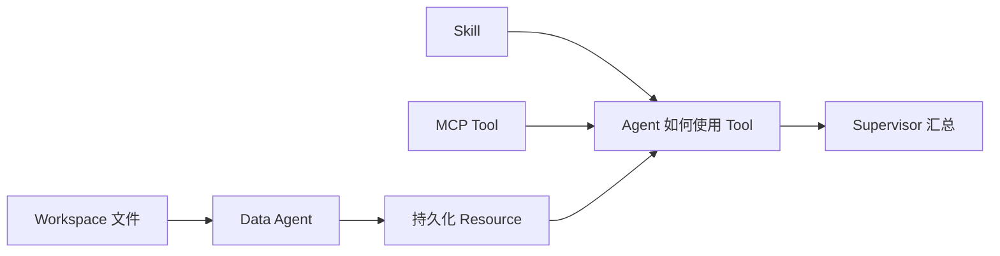

# Web 新手教程标准与四条学习路径

状态：冻结迁移输入（2026-08-08）。

以下页面记录旧仓网原型，不是当前可执行的新手入口；其中的 Settings 页面、Workspace
发布/扫描、capability template 和手工 Release 合同均不得作为新实现依据。Clean Spine
产品 E2E 完成后，本目录必须从正式 SDK/Copilot Studio 用户入口整体重写。当前证据以
[能力基线](../capability-baseline.md) 为准，接受边界以
[ADR-017](../adr/017-clean-copilot-platform-spine.md) 为准。

以下保留原教程设计，供迁移时核对业务示例与学习梯度。

## 学习路径

| 路径 | 适合谁 | 从哪里开始 |
| --- | --- | --- |
| 快速体验 | 只想确认链路能不能跑通 | [印尼仓网快速开始](indonesia-network-quickstart.md) |
| 理解执行 | 想知道 Agent、Tool、Skill 和 Resource 如何协作 | [单 Agent 配送审计](web-single-agent-delivery-audit.md) |
| 仓网入门 | 想从最小网络问题逐步增加数据 | 印尼仓网 1 → 2 → 3 |
| 高级规划 | 需要候选仓、选址约束和地图比较 | 印尼仓网 4 |

## 合格教程的标准

1. **先给结果。** 开头说明用户最后会看到什么、需要哪些输入和哪些参数。
2. **输入可重复。** 使用仓库内经过校验的 fixture 或用户明确上传的文件；记录来源、单位、hash 和生成规则。
3. **界面真实。** 只写当前 Web 已存在的按钮、输入卡片、Agent execution 卡片和状态；未实现能力必须明确标为阻塞。
4. **一次增加一个主要难点。** 每篇写清楚比上一篇增加了什么，不把所有数据和算法一次塞给新手。
5. **解释原因。** 用业务语言说明为什么需要某个字段、参数、Agent 或 Tool，不要求读者先理解内部实现。
6. **权限可检查。** 明确每个 Agent 可以读什么 Workspace 数据、使用哪些 MCP 和 Tool、产生哪些 Resource；Prompt 不是权限。
7. **计算与判断分开。** 距离、时效、成本、优化和地图由确定性 Tool 计算，Agent 负责选择口径、补业务参数和解释结果。
8. **交付可追溯。** 读者能看到结构化结果、Resource schema、来源摘要和 execution 终态；模型文字本身不算证据。
9. **失败保持失败。** 缺数据、字段歧义、工具不可用、矩阵不完整和求解超时都要有明确状态，不猜、不填零、不 Mock 回退。
10. **口径完整。** 写明分母、单位、时间范围、舍入、约束、估算方法和方案标签。
11. **可扩展。** 说明自己的业务需要替换哪些文件，什么时候需要新增 Tool、MCP、Agent 或输入参数。
12. **不泄露内部状态。** 不把 Provider key、主机路径、Runtime request ID、Resource URI 或完整原始表格放进教程和浏览器消息。

## 对象分工

| 对象 | 负责什么 | 不负责什么 |
| --- | --- | --- |
| Workspace SourceAsset | 保存用户授权的 CSV、JSON、XLSX | 决定计算目标 |
| MCP Tool | 执行可重复的检查、计算或发布 | 自己决定业务优先级 |
| Skill | 说明什么时候调用 Tool、输入输出和失败处理 | 扩大 Agent 权限或保存隐式状态 |
| Agent | 对数据准备或网络分析职责负责 | 读取未授权文件或复制大表进消息 |
| Resource | 保存有身份、hash、schema 和来源的结果 | 充当第二个 Thread 或调度器 |
| Supervisor | 识别缺口、动态协调、汇总结果 | 写死国家、阶段数量和固定调用顺序 |

## Draft 和 Release

Supervisor Draft 是可连续保存的草稿，用整数 `revision` 和内容 hash 保护并发更新，用户不需要填写语义版本号。发布时平台在事务中分配不可变 Release semver；Thread 使用 Draft 时固定 `revision + content_sha256`，使用 Release 时固定 `release_version + content_sha256`。

## 印尼仓网四篇

1. [从 Web 跑通第一份网络分析](indonesia-network-01-data.md)：50 个需求城市、已有仓、球面距离、时效覆盖率。
2. [加入两级仓网和运输成本](indonesia-network-02-service-baseline.md)：报价、干线、末端和分仓成本。
3. [当前覆盖、基线和仓网模拟](indonesia-network-03-two-level-cost.md)：实际当前方案、优化基线、增删搬迁。
4. [候选仓、p-median 和方案地图](indonesia-network-04-optimization-map.md)：候选仓、固定/可选已有仓、服务约束、地图和报告。

四篇都使用球面距离估算。客户数量大时先按城市聚合需求；只有拥有缓存、批量接口和费用许可时才接导航矩阵。
