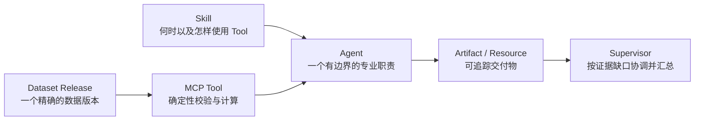

# Web 新手教程标准与四条学习路径

这组教程面向第一次使用 open-web-codex Web 平台的人。最快路径先在 5–10 分钟内运行
一个准备好的案例；理解合同、修改版本和从零构建是后续独立路径，不再要求新用户在看见
第一次业务结果前学习全部平台对象。

## 选择适合你的路径

| 路径 | 适合谁 | 从哪里开始 | 预计用时 |
| --- | --- | --- | ---: |
| 1. 快速体验 | 第一次使用，只想确认产品能解决什么问题 | [10 分钟运行印尼仓网示例](indonesia-network-quickstart.md) | 5–10 分钟人工设置，另加模型执行时间 |
| 2. 理解执行 | 已跑通示例，想知道 Agent、Tool 和 Artifact 做了什么 | [案例与计算口径](supply-chain-agent-tutorial.md)，再读[审批与恢复](approvals-and-recovery.md) | 15–25 分钟 |
| 3. 安全修改 | 想修改一个受控目标，并理解不可变新版本 | [单层时效](indonesia-network-02-service-baseline.md)，再做[两级成本与指定方案](indonesia-network-03-two-level-cost.md) | 50–75 分钟 |
| 4. 高级 Builder | 想从数据、Tool、Agent 到 Supervisor 全部自己构建 | [单 Agent 配送审计](web-single-agent-delivery-audit.md)，再按印尼仓网 1–4 顺序完成 | 100–150 分钟 |

快速体验只在生产 `/web` 的 **Learn** 中列出
`indonesia-warehouse-network@1.4.0`，且 **Set up example**、**Readiness** 和
**Start task** 可达、推荐 Prompt 可以由用户确认后 **Send** 时成立。任一入口缺失都
属于产品能力阻塞；不要改隐藏配置、运行仓库脚本或把内部资源 ID 交给模型来“完成教程”。

高级 Builder 的印尼仓网顺序是：

1. [发布并核验数据](indonesia-network-01-data.md)；
2. [只分析单层时效](indonesia-network-02-service-baseline.md)；
3. [加入两级成本和指定方案](indonesia-network-03-two-level-cost.md)；
4. [有限候选优化、确定性报告与地图](indonesia-network-04-optimization-map.md)。

不要跳过第 1 篇数据核验；后续网络结论都依赖精确
`indonesia_dataset_inspection.v1`。

## 一篇合格的新手教程必须做到什么

项目中的新手教程必须同时满足以下标准：

1. **先给出一个可观察的结果。** 开头说明读者最终会看到什么、预计用时和可能产生的
   模型费用，而不是先讲大量概念。
2. **使用可重复的输入。** 教程自带数据或引用版本化 Tutorial Blueprint；不能把读者
   的私有接口、宿主路径或模型猜测当作成功前提。
3. **只描述当前真实界面。** 按钮、字段、版本和错误提示必须与当前 Web 和 Server
   合同一致；尚未实现的能力只能标为阻塞，不能写成可操作步骤。
4. **每次只增加一个主要难点。** 新一篇要明确“比上一篇多了什么”，并复用已经验证的
   数据和 Release。
5. **解释为什么这样拆分。** 用普通业务语言说明对象的职责、权限和交付边界，不要求
   读者先接受架构结论。
6. **把权限写成合同。** 明确 reviewed capability template、MCP Server、Tool、
   Dataset Release 和允许产生的 Artifact；Prompt 和 instructions 不是授权机制。
7. **区分计算与推理。** 可重复的校验、距离、时效、成本、优化和完整业务报告由确定性
   Tool 负责；Agent 负责选择能力、解释或交付 Tool-owned 结果。
8. **提供成功证据。** 至少检查真实 Tool 事件、结构化结果、不可变 Release、Agent
   Activity 或持久 Artifact。模型写出一个看似合理的答案不算通过。
9. **验证失败也保持失败。** 至少说明一个停止条件；系统不能猜测、降级或伪造成功。
10. **给出已知答案和口径。** 确定性案例列出关键值、单位、分母、时间范围和舍入规则。
11. **说明扩展边界。** 结尾说明自己的场景可以替换什么、何时需要新增 Tool、Agent、
    Secret 或导航服务。
12. **不泄露内部状态。** 教程、Prompt 和截图不包含 Provider Key、宿主机路径、内部
    Resource URI、Runtime request ID 或原始大数据。

这些标准也约束产品链路。教程需要某个对象，而 Web 不能创建、绑定、检查或启动它时，
应先补系统能力，不能要求读者绕到终端。

## 六个对象的分工

| 对象 | 负责什么 | 不负责什么 |
| --- | --- | --- |
| Dataset Release | 固定文件、角色、版本和哈希 | 决定怎样分析 |
| MCP Tool | 用类型化输入执行可重复操作 | 自己决定业务目标 |
| Skill | 告诉模型何时、按什么方法使用能力 | 执行计算或扩大权限 |
| Agent | 对一个专业结果负责 | 任意调用未授权能力 |
| Artifact / Resource | 保存有身份和来源的有界结果 | 复制整份对话或原始大数据 |
| Supervisor | 拆解目标、选择 Agent、检查证据并交付 | 写死所有任务的固定工作流 |

## 版本和冲突规则

Dataset、capability package、Agent、Supervisor 和 Tutorial Blueprint 都是不可变
Release。

- 教程声明的精确身份已经存在且内容哈希一致时，复用它；
- 同一身份内容不同时停止并查看冲突，不能自动改成 `1.0.1` 来掩盖漂移；
- 开发数据需要重建时，使用项目明确的开发环境清理流程，不在启动路径自动迁移；
- 有意改变定义时，先选择一个明确的新版本，再同步更新所有依赖、教程和验收值；
- 已有 Thread 始终使用创建时绑定的版本，不被新版本静默替换。

## 完成学习后

你应该能回答：

1. 数据是否需要成为一个可授权、可复现的 Release？
2. 哪些步骤必须由确定性 Tool 完成，哪些判断适合留给 Agent？
3. 一个 Agent 是否已有明确职责，还是只是把很多 Tool 放在一起？
4. 多个 Agent 交换的是哪种 Artifact，而不是哪段聊天文本？
5. Supervisor 应动态补齐哪些证据，何时应该停止并报告缺口？
6. readiness 为什么必须发生在 Thread 创建前？
7. 页面刷新后，哪些执行、审批和交付物必须仍然可审阅？
