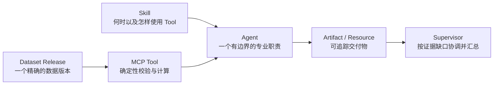

# Web 新手教程标准与学习路径

这组教程面向第一次使用 open-web-codex Web 平台的人。读者不需要理解 JSON-RPC、
进程管理或 Codex 内部协议，但要能区分数据、Tool、Skill、Agent、Supervisor 和
Artifact 分别负责什么。

## 一篇合格的新手教程必须做到什么

项目中的新手教程必须同时满足以下标准：

1. **先给出一个可观察的结果。** 开头说明读者最终会看到什么、预计用时和可能产生的
   模型费用，而不是先讲大量概念。
2. **使用可重复的输入。** 教程自带数据或指向稳定、合法、可核验的数据来源；不能把
   `example.com`、读者自己的私有接口或模型猜测当作成功前提。
3. **只描述当前真实界面。** 按钮、字段、版本和错误提示必须与当前 Web 和 Server
   合同一致；尚未实现的能力只能标为缺口，不能写成可操作步骤。
4. **每次只增加一个主要难点。** 新一篇要明确“比上一篇多了什么”，并复用已经验证的
   数据和 Release，避免读者同时排查多个未知问题。
5. **解释为什么这样拆分。** 用普通业务语言说明对象的职责、权限和交付边界，不用
   含糊比喻，也不要求读者先接受架构结论。
6. **把权限写成合同。** 明确 Agent 能使用哪个已评审 capability template、哪个 MCP
   Server、哪些 Tool、哪些 Dataset Release，以及允许产生哪些 Artifact。Prompt 和
   instructions 不能被描述成授权机制。
7. **区分计算与推理。** 可重复的校验、距离、时效、成本和优化由确定性 Tool 负责；
   Agent 负责选择合适的 Tool、解释结果和报告限制。
8. **提供成功证据。** 至少检查真实 Tool 事件、结构化结果、不可变 Release、Agent
   Activity 或持久 Artifact 中与本篇相关的证据。模型写出一个看似合理的答案不算通过。
9. **验证失败也保持失败。** 教程包含至少一个常见错误或停止条件，并说明正确系统为何
   应明确失败，而不是猜测、降级或伪造成功。
10. **给出已知答案和口径。** 确定性案例列出关键期望值、单位、分母、时间范围和允许的
    舍入误差，让读者能判断自己是否真的跑通。
11. **说明扩展边界。** 结尾告诉读者自己的场景可以替换什么、不能直接照搬什么，以及
    何时需要新增 Tool、Agent、Secret 或导航服务。
12. **不泄露内部状态。** 教程、Prompt 和截图不包含 Provider Key、宿主机路径、MCP
    Resource URI、Runtime request ID 或原始大数据。

这些标准不仅约束文档写法，也约束产品链路。教程需要某个对象，但 Web 不能创建、
绑定、验证或启动它时，应先补齐系统能力，而不是要求读者绕到终端修改隐藏配置。

## 推荐学习路径

| 顺序 | 教程 | 新增的主要概念 | 预计用时 |
| --- | --- | --- | ---: |
| 1 | [配送承诺审计](web-single-agent-delivery-audit.md) | Web 发布数据、Python MCP/Skill、单 Agent Release 与真实 Tool 调用 | 20–30 分钟 |
| 2 | [印尼仓网 1：发布并核验数据](indonesia-network-01-data.md) | 大型 Dataset Release、来源、数据质量、边界内客户与有界 Resource | 20–30 分钟 |
| 3 | [印尼仓网 2：只分析单层时效](indonesia-network-02-service-baseline.md) | 两个 Agent、动态 Supervisor、类型化 Artifact handoff | 25–35 分钟 |
| 4 | [印尼仓网 3：加入两级成本和指定方案](indonesia-network-03-two-level-cost.md) | 中心仓/前置仓、干线/末端报价、不可变新版本和方案比较 | 25–40 分钟 |
| 5 | [印尼仓网 4：有限候选优化与地图](indonesia-network-04-optimization-map.md) | 完整候选优化、Visualization Agent、GeoJSON Resource 和地图 Artifact | 30–45 分钟 |

印尼案例的背景、数据来源、统一口径和整体关系见
[印尼仓网教程总览](supply-chain-agent-tutorial.md)。不要跳过第 1 篇数据核验；后续
所有网络结论都依赖它产生的精确 `indonesia_dataset_inspection.v1`。

## 六个对象的分工

| 对象 | 负责什么 | 不负责什么 |
| --- | --- | --- |
| Dataset Release | 固定文件、角色、版本和哈希 | 决定怎样分析 |
| MCP Tool | 用类型化输入执行可重复操作 | 自己决定业务目标 |
| Skill | 告诉模型何时、按什么方法使用能力 | 执行计算或扩大权限 |
| Agent | 对一个专业结果负责 | 任意调用未授权能力 |
| Artifact / Resource | 保存有身份和来源的有界结果 | 复制整份对话或原始大数据 |
| Supervisor | 拆解目标、选择 Agent、检查证据并交付 | 写死所有任务的固定工作流 |

## 版本规则

教程使用的 Dataset、capability package、Agent 和 Supervisor 都是不可变 Release。
如果同一 ID 的 `1.0.0` 已经存在，不要覆盖；使用 `1.0.1` 或先按开发环境清理流程重建。
已有 Thread 继续使用创建时绑定的版本，不会被新版本静默替换。

## 完成整套教程后

你应该能根据自己的问题回答：

1. 数据是否需要成为一个可授权、可复现的 Release？
2. 哪些步骤必须由确定性 Tool 完成，哪些判断适合留给 Agent？
3. 一个 Agent 是否已有明确职责，还是只是把很多 Tool 放在一起？
4. 多个 Agent 之间交换的是哪种 Artifact，而不是哪段聊天文本？
5. Supervisor 应动态补齐哪些证据，何时应该停止并报告缺口？
6. 页面刷新后，哪些执行、审批和交付物必须仍然可审阅？
