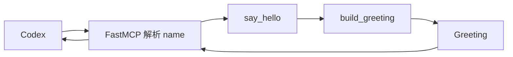

# Hello Agent：15 分钟跑通第一个 Tool

## 1. 本篇目标

完成本篇后，用户输入：

> 请使用 `$say-hello` 向小林问好。

Codex 会真实调用：

```text
hello_writer.say_hello
```

并得到：

```json
{
  "name": "小林",
  "message": "你好，小林！"
}
```

本篇只学习 Agent、Skill、MCP 和 Tool。它还不是多 Agent。

返回[教程总入口](../multi-agent-development-tutorial.md)。

---

## 2. 第一步先运行，不要先抄代码

示例代码位于：

[`tools/hello-agent`](../../tools/hello-agent/)

准备隔离环境：

```bash
tools/hello-agent/bin/setup-env
```

默认环境位于：

```text
.local/open-web-codex/tool-envs/hello-agent
```

运行单元测试：

```bash
.local/open-web-codex/tool-envs/hello-agent/bin/python \
  -m pytest tools/hello-agent/tests -q
```

期望：

```text
8 passed
```

运行真实 MCP stdio smoke：

```bash
.local/open-web-codex/tool-envs/hello-agent/bin/python \
  tools/hello-agent/tests/stdio_smoke.py
```

期望：

```text
Hello Agent stdio smoke passed
```

这个 smoke 不是只调用 Python 函数，而是真实完成：

```text
启动 MCP Server
→ initialize
→ tools/list
→ tools/call
→ 检查结构化结果
```

如果这里失败，先查看第 10 节故障表，不要继续多 Agent。

---

## 3. 在新 Thread 中验证 Agent 调用

Plugin 能力是在 Thread 启动时交给 Codex 的。因此必须新建 Thread，旧 Thread 不会
自动获得刚加入的 Plugin。

当前 Web 适配层会在新 Thread 启动时选择源码仓库和 Workspace 的
`tools/*/.codex-plugin/plugin.json`。这是一条现阶段的本地能力发现路径，不代表
Plugin Studio 的安装、权限和发布体验已经完整。

1. 按[本地运行手册](../mvp-runbook.md)启动平台；
2. 使用当前仓库创建或选择 Workspace；
3. 新建 Thread；
4. 发送：

```text
请使用 $say-hello 向小林问好，并返回 Tool 的结构化结果。
```

成功时应该看到：

1. Codex 选择 `say-hello` Skill；
2. Codex 调用 `hello_writer.say_hello`；
3. Tool 参数是 `{"name": "小林"}`；
4. Tool 返回 `name` 和 `message`；
5. Codex 根据 Tool 结果回答。

如果 Codex 没调用 Tool，只是直接说“你好，小林！”，这个练习没有通过。我们验证的
不是模型会不会问好，而是 Agent 是否会使用确定性能力。

---

## 4. 目录中每个部分负责什么

```text
tools/hello-agent/
├── .codex-plugin/plugin.json
├── .mcp.json
├── pyproject.toml
├── bin/
│   ├── setup-env
│   └── hello-agent-launcher
├── hello_agent/
│   ├── __init__.py
│   ├── core.py
│   ├── writer_server.py
│   └── reviewer_server.py
├── skills/
│   ├── say-hello/
│   └── review-greeting/
└── tests/
    ├── test_core.py
    ├── test_plugin_config.py
    └── stdio_smoke.py
```

本篇只关注 Writer：

| 文件 | 角色 |
| --- | --- |
| `plugin.json` | 声明这是一个可被 Codex 发现的 Plugin，以及它包含哪些能力 |
| `pyproject.toml` | 声明 Python 版本、运行依赖和测试依赖 |
| `__init__.py` | 把 `hello_agent` 标记为可导入的 Python 包 |
| `core.py` | 数据合同和纯业务规则 |
| `writer_server.py` | 把业务函数发布成 MCP Tool |
| `say-hello/SKILL.md` | 教 Codex 何时调用 Tool |
| `.mcp.json` | 告诉 Codex 怎样启动 MCP Server |
| `setup-env` | 在对话开始前准备隔离的 Python 环境 |
| `hello-agent-launcher` | 找到隔离环境并启动 Python |
| `test_core.py` | 验证普通业务规则 |
| `test_plugin_config.py` | 验证 Manifest 与两个 MCP Server 没有接错 |
| `stdio_smoke.py` | 验证真实 MCP 消息链 |

这是一条重要原则：

```text
业务规则不放进 Skill
Skill 不负责执行计算
MCP Server 不重新实现业务规则
```

`plugin.json` 中与本教程最相关的是：

```json
{
  "name": "hello-agent",
  "version": "0.1.0",
  "skills": "./skills/",
  "mcpServers": "./.mcp.json"
}
```

| 字段 | 作用 | 为什么这样写 |
| --- | --- | --- |
| `name` | Plugin 的稳定名称 | Runtime 和人都需要识别这个能力包 |
| `version` | 当前发布版本 | 后续升级可以明确比较，不靠目录内容猜测 |
| `skills` | Skill 根目录 | 让 Codex 发现模型可读的工作方法 |
| `mcpServers` | MCP 配置入口 | 让 Codex 发现可执行的 Tool |

Manifest 只是“能力包目录”，不会自动创建一个 Agent，也不负责保存 Thread 状态。

---

## 5. 逐行理解共享业务核心

打开：

[`core.py`](../../tools/hello-agent/hello_agent/core.py)

### 5.1 导入和常量

```python
from __future__ import annotations

from pydantic import BaseModel, ConfigDict, Field

MAX_NAME_CHARACTERS = 40
MAX_MESSAGE_CHARACTERS = 80
```

逐项说明：

| 代码 | 作用 | 为什么需要 |
| --- | --- | --- |
| `from __future__ import annotations` | 推迟类型注解求值 | 类型变复杂时仍能安全引用后面定义的类型 |
| `BaseModel` | 创建有类型的数据模型 | 输入输出不能依赖任意字典字段 |
| `ConfigDict` | 配置数据模型行为 | 用于禁止未知字段和修改 |
| `Field` | 给字段增加含义说明 | MCP Schema 和开发者可以看到字段用途 |
| `MAX_NAME_CHARACTERS` | 姓名长度唯一上限 | Writer 和 Reviewer 不重复写 `40` |
| `MAX_MESSAGE_CHARACTERS` | 消息长度唯一上限 | 所有审核规则引用同一事实 |

常量放在共享核心，是因为规则只能有一个权威来源。

### 5.2 `Greeting` 数据合同

```python
class Greeting(BaseModel):
    """The complete handoff from the Writer to the Reviewer."""

    model_config = ConfigDict(extra="forbid", frozen=True)

    name: str = Field(description="The person being greeted")
    message: str = Field(description="The exact greeting produced for that person")
```

逐行说明：

| 代码 | 作用 |
| --- | --- |
| `class Greeting(BaseModel)` | 声明一份问候的完整结构 |
| docstring | 说明这是 Writer 交给 Reviewer 的合同 |
| `extra="forbid"` | 拒绝合同没有声明的字段 |
| `frozen=True` | 创建后不能原地修改，避免审核对象被偷偷改变 |
| `name: str` | 姓名必须是字符串 |
| `message: str` | 问候必须是字符串 |
| `Field(description=...)` | 给生成的 Schema 增加可读含义 |

为什么不用普通字典？

下面的字典不会立即暴露拼写错误：

```python
{"naem": "小林", "message": "你好，小林！"}
```

`Greeting` 会拒绝未知的 `naem`，让错误在边界发生，而不是进入下游。

### 5.3 `normalize_name`

```python
def normalize_name(name: str) -> str:
    """Normalize and bound one user-provided name."""

    normalized = name.strip()
    if not normalized:
        raise ValueError("name must not be empty")
    if len(normalized) > MAX_NAME_CHARACTERS:
        raise ValueError(
            f"name must contain at most {MAX_NAME_CHARACTERS} characters"
        )
    return normalized
```

逐行说明：

| 代码 | 作用 | 不这样做会怎样 |
| --- | --- | --- |
| 函数类型 `str -> str` | 明确输入输出都是姓名文本 | 调用者需要猜返回类型 |
| docstring | 说明函数同时规范化和限制输入 | 规则容易被误用 |
| `strip()` | 删除首尾空格 | `" 小林 "` 会成为不一致的姓名 |
| `if not normalized` | 拒绝空姓名 | 可能生成“你好，！” |
| 长度判断 | 限制无界输入 | 超长文本进入 Tool 和上下文 |
| `ValueError` | 把非法输入变成明确失败 | 错误数据看起来像成功结果 |
| `return normalized` | 只向下游提供规范化姓名 | 下游不必再次清洗 |

### 5.4 `build_greeting`

```python
def build_greeting(name: str) -> Greeting:
    """Build the one canonical greeting for a valid name."""

    normalized = normalize_name(name)
    return Greeting(name=normalized, message=f"你好，{normalized}！")
```

逐行说明：

| 代码 | 作用 |
| --- | --- |
| `-> Greeting` | 承诺返回稳定数据合同 |
| docstring | 声明这里产生唯一标准问候 |
| `normalize_name(name)` | 复用唯一输入规则 |
| `Greeting(...)` | 在返回前验证字段 |
| f-string | 使用规范化姓名生成确定性消息 |

这个函数不知道 MCP、Codex、Thread 或网络。它是纯业务逻辑，因此可以快速测试。

---

## 6. 逐行理解 MCP Tool

打开：

[`writer_server.py`](../../tools/hello-agent/hello_agent/writer_server.py)

### 6.1 导入

```python
from __future__ import annotations

from mcp.server.fastmcp import FastMCP

from .core import Greeting, build_greeting
```

| 代码 | 作用 |
| --- | --- |
| `FastMCP` | 注册 Tool 并处理 MCP 协议 |
| `.core` | 从唯一业务核心复用合同和规则 |
| `Greeting` | 声明 Tool 返回类型 |
| `build_greeting` | 执行实际业务规则 |

Server 不复制姓名长度或消息格式。

### 6.2 创建 MCP Server

```python
mcp = FastMCP(
    "Hello Writer",
    instructions=(
        "Call say_hello only when a user provides one person to greet. "
        "Return the structured Tool result unchanged. Do not invent a successful "
        "result when the Tool rejects the input or is unavailable."
    ),
    json_response=True,
)
```

| 代码 | 作用 | 注意 |
| --- | --- | --- |
| `mcp = FastMCP(...)` | 创建 Server 和 Tool 注册表 | 还没有启动进程 |
| `"Hello Writer"` | 可读 Server 名称 | 不是授权身份 |
| `instructions` | 告诉 Agent 何时使用和怎样处理失败 | 不是安全边界 |
| `json_response=True` | 保留结构化结果 | 下游可读取稳定字段 |

安全边界仍来自：

- Tool 只暴露允许的操作；
- `core.py` 校验输入；
- MCP Server 不提供写文件或任意命令 Tool；
- 平台决定当前 Thread 能使用哪些能力。

### 6.3 注册 `say_hello`

```python
@mcp.tool()
def say_hello(name: str) -> Greeting:
    """Return the canonical structured greeting for one named person."""

    return build_greeting(name)
```

| 代码 | 作用 |
| --- | --- |
| `@mcp.tool()` | 把下面的函数注册为 Codex 可发现 Tool |
| `say_hello` | 形成 Tool 名称 |
| `name: str` | 形成输入 Schema |
| `-> Greeting` | 形成结构化输出说明 |
| docstring | 告诉 Agent Tool 做什么 |
| `return build_greeting(name)` | 复用唯一业务函数 |

Tool 故意只有一行业务调用。协议层越薄，规则越不容易在多个入口中分叉。

### 6.4 启动 Server

```python
def main() -> None:
    """Run the Writer MCP over standard input and output."""

    mcp.run(transport="stdio")


if __name__ == "__main__":
    main()
```

| 代码 | 作用 |
| --- | --- |
| `main` | 管理进程启动 |
| `mcp.run(...)` | 进入 MCP 消息循环 |
| `transport="stdio"` | 通过标准输入输出与 Codex 通信 |
| `__name__` 判断 | import 测试时不自动启动 Server |

进入 stdio 模式后，stdout 只能输出 MCP 协议。普通日志应写 stderr 或独立日志。

一次真实调用经过：



---

## 7. Skill 为什么仍然需要

打开：

[`say-hello/SKILL.md`](../../tools/hello-agent/skills/say-hello/SKILL.md)

最小结构：

```markdown
---
name: say-hello
description: Use the hello_writer MCP server to generate one deterministic
  structured greeting for a named person.
---

# Say Hello

1. Require one explicit person's name.
2. Call `hello_writer.say_hello` exactly once with that name.
3. Return the structured Tool result.
4. Pass that result unchanged when another Agent reviews it.
5. Report Tool failure instead of inventing a result.
```

| 部分 | 角色 | 为什么需要 |
| --- | --- | --- |
| `---` 之间的内容 | Skill 元数据 | Runtime 先读取这一小段进行发现 |
| `name` | 稳定 Skill ID | 用户可以用 `$say-hello` 明确触发 |
| `description` | 触发条件摘要 | 帮助 Agent 判断何时应读完整 Skill |
| `# Say Hello` | 面向人的标题 | 方便维护者阅读 |
| 第 1 步 | 输入前置条件 | 缺姓名时询问，不让模型猜 |
| 第 2 步 | 指定唯一 Tool | 避免名称相似时调用错误 Server |
| 第 3、4 步 | 交接规则 | 保持 Tool 输出可追踪且不被改写 |
| 第 5 步 | 失败规则 | 防止 Tool 不可用时伪造成功 |

它只有五步，因为 Skill 只保存模型无法稳定推断的流程：

1. 必须有明确姓名；
2. 调用 `hello_writer.say_hello`；
3. 返回 Tool 的结构化结果；
4. 交给 Reviewer 时不能修改；
5. Tool 失败时不能伪造替代结果。

分工是：

```text
Skill：何时调用、失败后怎么办
Tool：接收什么参数、返回什么结构
core.py：真正的确定性规则
```

不要把 Python 公式复制进 Skill。否则规则变更时会产生两份事实。

---

## 8. `.mcp.json` 和 launcher

`.mcp.json` 中 Writer 配置：

```json
{
  "hello_writer": {
    "command": "./bin/hello-agent-launcher",
    "args": [],
    "cwd": ".",
    "startup_timeout_sec": 30,
    "tool_timeout_sec": 30,
    "default_tools_approval_mode": "approve",
    "env_vars": [
      "OPEN_WEB_CODEX_DATA_DIR",
      "OPEN_WEB_CODEX_HELLO_AGENT_VENV"
    ]
  }
}
```

| 字段 | 作用 |
| --- | --- |
| `hello_writer` | 稳定 MCP Server ID |
| `command` | Codex 应运行哪个启动器 |
| `args` | Writer 使用默认模式，所以为空 |
| `cwd` | 相对路径以 Plugin 根解析 |
| `startup_timeout_sec` | 启动卡住时明确失败 |
| `tool_timeout_sec` | Tool 卡住时明确失败 |
| `default_tools_approval_mode` | 这个无副作用教学 Tool 默认不逐次弹出确认 |
| `env_vars` | 只传明确允许的配置名 |

`approve` 只是这个本地教学 Tool 的默认调用确认策略，不是权限身份，也不会绕过
Workspace、Profile 或平台授权。

launcher 负责：

1. 找到 Plugin 根；
2. 找到预先安装的隔离环境；
3. 环境缺失时快速失败；
4. 用 `exec` 启动 `hello_agent.writer_server`。

launcher 不在用户对话期间安装依赖。安装由 `setup-env` 提前完成。
最后使用 `exec`，是为了让 MCP Server 直接接管进程，平台发送的终止信号和退出码
不会被一层残留 Shell 模糊掉。

---

## 9. 做一次失败测试

先发一条没有姓名的请求：

```text
请使用 $say-hello 问好，但我没有提供姓名。
```

Codex 应询问姓名，而不是猜测。

再临时禁止 launcher：

```bash
chmod -x tools/hello-agent/bin/hello-agent-launcher
```

新建 Thread 后再次请求。Codex 应明确报告 Tool 不可用，不能伪造 Tool 结果。

测试后立即恢复：

```bash
chmod +x tools/hello-agent/bin/hello-agent-launcher
```

---

## 10. 故障对照表

| 现象 | 优先检查 |
| --- | --- |
| `mcp` import 失败 | 是否执行 `tools/hello-agent/bin/setup-env` |
| launcher 不可执行 | 是否执行 `chmod +x` |
| 单元测试失败 | `core.py` 的合同和业务规则 |
| stdio smoke 失败 | launcher、MCP import、stdout 污染 |
| Plugin 校验失败 | Manifest、Skill 或 `.mcp.json` |
| 新 Thread 看不到 Skill | 是否在 Plugin 加入后新建 Thread |
| Agent 不调用 Tool | Skill 触发描述和 MCP Server 状态 |
| Tool 一直运行 | 超时、Server 崩溃或 stdout 普通日志 |

查看 Skill 和 Plugin：

```bash
python3 \
  codex/codex-rs/skills/src/assets/samples/skill-creator/scripts/quick_validate.py \
  tools/hello-agent/skills/say-hello

python3 \
  codex/codex-rs/skills/src/assets/samples/plugin-creator/scripts/validate_plugin.py \
  tools/hello-agent
```

---

## 11. 完成标志

- [ ] 8 项单元测试通过；
- [ ] stdio smoke 通过；
- [ ] 能解释 `core.py`、MCP Tool 和 Skill 的区别；
- [ ] 能解释 `@mcp.tool()` 的作用；
- [ ] 能解释为什么正常 stdio Server 不能随意打印；
- [ ] 新 Thread 真实调用 `hello_writer.say_hello`；
- [ ] Tool 不可用时 Agent 不伪造结果。

下一篇：

[Hello Team：从一个 Agent 扩展到两个 Agent](hello-agent-team.md)
