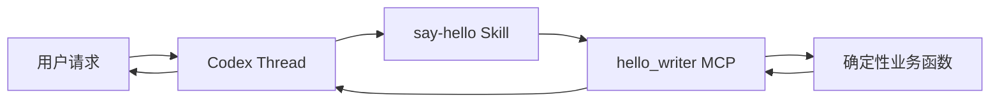

# Hello Agent：第一次真实 Tool 调用

本篇目标很小：在 Web 中创建一个普通 Thread，让 Codex 真实调用
`hello_writer.say_hello`，而不是直接凭模型生成一句问候。

预计用时 10–15 分钟。你会创建一个 Thread，并产生一次模型调用；不会发布
Supervisor、修改业务数据或访问外部系统。

返回[教程总入口](../multi-agent-development-tutorial.md)。

## 完成后的结果

你发送：

> 请使用 `$say-hello` 向小林问好，并返回 Tool 的结构化结果。

正确结果包含：

```json
{
  "name": "小林",
  "message": "你好，小林！"
}
```

更重要的是，执行轨迹中的 Tool 卡片必须对应：

```text
hello_writer.say_hello
```

Web 可能把它显示成更友好的 `hello writer · say hello`。如果只有最终问候，没有
Tool 调用，这次练习没有通过。

## 1. 检查前置条件

开始前确认：

- Web 页面可以打开；
- 左侧有一个指向当前仓库的授权 Workspace；
- Provider 和模型可用；
- 当前工作树包含 `tools/hello-agent`；
- 你位于仓库根目录。

先准备隔离的能力环境：

```bash
tools/hello-agent/bin/setup-env
```

然后运行最小验证：

```bash
.local/open-web-codex/tool-envs/hello-agent/bin/python \
  -m pytest tools/hello-agent/tests -q

.local/open-web-codex/tool-envs/hello-agent/bin/python \
  tools/hello-agent/tests/stdio_smoke.py
```

期望看到：

```text
8 passed
Hello Agent stdio smoke passed
```

第一条证明业务规则和能力配置通过；第二条真实执行 MCP 的初始化、Tool 发现和调用。
如果这里失败，先修复能力包，不要让模型答案掩盖底层问题。

## 2. 在 Web 中启动标准 Task

1. 打开 Web 页面。
2. 在左侧选择当前仓库的 Workspace。
3. 点击 Workspace 行的 **New task**。
4. 在 **Start a task** 中选择 **Standard**，确认准备使用的 Provider 和模型。
5. 输入下列内容并点击 **Start task**：

```text
请使用 $say-hello 向小林问好，并返回 Tool 的结构化结果。
```

普通 Thread 启动时，平台会把当前源码仓库中有效的 Plugin capability roots 通过
正式合同交给 Codex Runtime。能力包发生变化后应新建 Thread；已有 Thread 不会被
目录变化静默改写。

## 3. 核对五个成功信号

按顺序检查：

1. Thread 创建成功，没有出现 “Run failed before its Codex Thread was ready”；
2. 页面显示与 `hello_writer.say_hello` 对应的 Tool 调用；
3. 如果页面展示安全参数摘要，其中只有姓名 `小林`；
4. Tool 结果同时包含 `name` 和 `message`；
5. Assistant 的回答来自这份 Tool 结果。

你刚刚跑通的是：



这里的一名 Agent 就是当前 Thread。Plugin、Skill 和 Tool 都不是第二名 Agent。

## 4. 理解这四个文件的分工

示例位于 [`tools/hello-agent`](../../tools/hello-agent/)：

| 位置 | 负责什么 |
| --- | --- |
| `hello_agent/core.py` | 输入校验和唯一问候规则 |
| `hello_agent/writer_server.py` | 把规则暴露为 MCP Tool |
| `skills/say-hello/SKILL.md` | 告诉 Agent 何时、怎样调用 Tool |
| `.mcp.json` | 告诉 Runtime 怎样启动 MCP Server |
| `.codex-plugin/plugin.json` | 把 Skill 与 MCP 组成一个可发现能力包 |

最重要的分层是：

```text
Skill：工作方法和失败规则
Tool：类型化调用入口
core.py：确定性业务事实
```

不要把同一条问候规则分别复制到 Prompt、Skill 和 Server 中。

## 5. 验证失败时不会假成功

在同一 Thread 发送：

```text
请使用 $say-hello 问好，但我没有提供姓名。
```

正确行为是询问姓名，不是猜一个人名，也不是伪造 Tool 结果。

再发送一个只有空格的姓名：

```text
请使用 $say-hello 向三个空格组成的姓名问好。
```

Tool 应明确拒绝空姓名。Assistant 可以解释错误，但不能声称已经生成有效问候。

这一步验证“失败保持失败”，比只看 happy path 更重要。

## 6. 为什么这个 Tool 不逐次审批

`hello_writer.say_hello` 是无外部副作用、无凭据、无文件写入的确定性教学 Tool。
它在 Plugin 合同中被评审为默认可执行，因此不会每次弹出审批。

这不代表整个 Thread 获得无限权限。命令执行、文件修改、凭据、权限扩大和外部
副作用仍按各自合同决定是否需要审批。不要为了让教程更顺畅而把全局审批策略关闭。

## 7. 常见问题

| 现象 | 先检查什么 |
| --- | --- |
| Thread 创建失败 | Provider、模型、Profile Host 和服务状态 |
| `mcp` 无法导入 | 是否运行 `tools/hello-agent/bin/setup-env` |
| stdio smoke 失败 | launcher、Python 环境和 stdout 是否被普通日志污染 |
| 新 Thread 看不到 Tool | Plugin 校验、当前工作目录和 capability root 发现 |
| Assistant 直接问好 | 请求是否明确使用 `$say-hello`，Tool 是否处于可用状态 |
| Tool 一直运行 | MCP Server 进程、启动超时和 Tool 超时 |
| Tool 失败后仍返回成功 | Skill/Agent 失败规则不合格，不能接受该结果 |

需要验证 Skill 与 Plugin 时运行：

```bash
python3 \
  codex/codex-rs/skills/src/assets/samples/skill-creator/scripts/quick_validate.py \
  tools/hello-agent/skills/say-hello

python3 \
  codex/codex-rs/skills/src/assets/samples/plugin-creator/scripts/validate_plugin.py \
  tools/hello-agent
```

## 完成检查表

- [ ] `8 passed`；
- [ ] stdio smoke 通过；
- [ ] 新 Thread 中真实出现 `hello_writer.say_hello`；
- [ ] 结构化结果中的姓名和消息正确；
- [ ] 缺少姓名时 Agent 追问；
- [ ] 空姓名被明确拒绝；
- [ ] 能解释 Agent、Skill、Tool 和业务函数的区别；
- [ ] 能解释为什么这个 Tool 可以免逐次审批，但其他高风险操作仍可能需要审批。

接下来阅读[开发一个仓网 Copilot](warehouse-copilot-developer-tutorial.md)。
