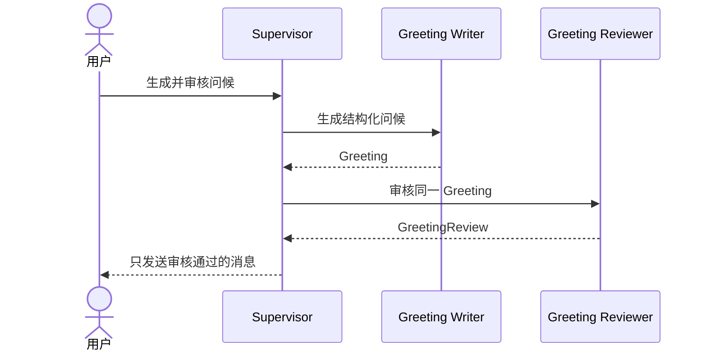

# Hello Team：从一个 Agent 扩展到两个 Agent

## 1. 本篇目标

先完成[Hello Agent 快速入门](hello-agent-quickstart.md)。

本篇增加两个职责：

- Writer：生成结构化问候；
- Reviewer：审核问候，不能改写；
- Supervisor：安排生成、审核和最终交付。

用户问题：

> 生成一条给小林的问候，检查通过后再发给我。

期望协作：



返回[教程总入口](../multi-agent-development-tutorial.md)。

---

## 2. 当前可运行部分与未来目标

当前可以真实运行：

- `hello_writer` MCP Server；
- `hello_reviewer` MCP Server；
- `$say-hello` 和 `$review-greeting`；
- 一个 Thread 中 Writer → Reviewer 的完整 Tool 链；
- 双 Server 的 initialize、tools/list 和 tools/call smoke。

当前仍在继续建设和验证：

- Supervisor 创建两个指定 Runtime Role 的真实子 Thread；
- 按 Agent 独立选择能力；
- Web 中完整投影父子 Agent 轨迹。

所以本篇先验证两套能力的交接，再解释真实双 Agent 的目标。两个 Skill 或两个 MCP
Server 本身不能冒充两个 Runtime Agent。

未来平台能力补齐后，创建两个 Agent 和选择能力会更直接；这里的 Tool、Skill 和
共享合同仍然复用。

---

## 3. 为什么需要独立 Reviewer

如果 Writer 自己生成、自行检查并宣布通过，产生内容的人也是唯一审核人。

Reviewer 只做明确的确定性检查：

1. 姓名是否合法；
2. 消息长度是否在上限内；
3. 消息是否与规范问候一致；
4. 返回所有拒绝原因；
5. 不修改被审核内容。

这对应真实领域中的常见分工：

| 产生结果 | 独立检查 |
| --- | --- |
| 代码生成 Agent | Code Review Agent |
| 数据分析 Agent | Data Validation Agent |
| Network Planning Agent | 结果验证流程 |

独立 Reviewer 有意义的前提是它检查明确合同，而不是再生成一个自己的答案。

---

## 4. 一个目录中的共享核心

当前结构：

```text
tools/hello-agent/
├── hello_agent/
│   ├── core.py
│   ├── writer_server.py
│   └── reviewer_server.py
├── skills/
│   ├── say-hello/
│   └── review-greeting/
└── .mcp.json
```

Writer 和 Reviewer 共同使用：

[`core.py`](../../tools/hello-agent/hello_agent/core.py)

这里集中保存：

```text
Greeting
GreetingReview
MAX_NAME_CHARACTERS
MAX_MESSAGE_CHARACTERS
normalize_name
build_greeting
evaluate_greeting
```

姓名上限和问候格式没有在两个 Server 中各写一遍。这样规则变更时，只修改一个权威
位置。

这也是两个能力暂时放在同一个 Plugin 的第一个原因：它们属于同一领域并共享同一
合同。

---

## 5. 逐行理解 Reviewer 业务函数

`evaluate_greeting` 位于共享 `core.py`：

```python
def evaluate_greeting(greeting: Greeting) -> GreetingReview:
    """Review a greeting without modifying the submitted handoff."""

    reasons: list[str] = []
    expected: Greeting | None = None

    try:
        normalized = normalize_name(greeting.name)
        expected = build_greeting(normalized)
        if greeting.name != normalized:
            reasons.append("name must not contain leading or trailing whitespace")
    except ValueError as error:
        reasons.append(str(error))

    if len(greeting.message) > MAX_MESSAGE_CHARACTERS:
        reasons.append(
            f"message must contain at most {MAX_MESSAGE_CHARACTERS} characters"
        )
    if expected is not None and greeting.message != expected.message:
        reasons.append("message does not match the expected greeting")

    return GreetingReview(
        approved=not reasons,
        greeting=greeting,
        reasons=reasons,
    )
```

逐项解释：

| 代码 | 作用 | 设计原因 |
| --- | --- | --- |
| 输入 `Greeting` | 接收完整 Writer 合同 | 不用两个松散参数猜对应关系 |
| 输出 `GreetingReview` | 承诺稳定审核结构 | Supervisor 可以可靠读取 |
| `reasons = []` | 累计全部问题 | 一次审核报告所有可见错误 |
| `expected = None` | 表示还没有有效预期结果 | 姓名无效时不继续错误比较 |
| `normalize_name` | 复用唯一姓名规则 | Reviewer 不定义第二套上限 |
| `build_greeting` | 复用唯一消息格式 | Reviewer 不复制 f-string |
| 首尾空格检查 | 要求交接内容已经规范化 | 防止 Writer 与 Reviewer 粒度不同 |
| `except ValueError` | 把业务失败转为审核原因 | Reviewer 返回拒绝，而不是崩溃 |
| 消息长度判断 | 使用共享消息上限 | 避免无界审核输入 |
| `expected is not None` | 仅在姓名有效时比较消息 | 避免无意义的后续错误 |
| `approved=not reasons` | 没有任何原因才通过 | 结论由规则确定，不由模型自由判断 |
| `greeting=greeting` | 原样返回被审核内容 | 证明审核对象没有被替换 |

如果消息是：

```json
{
  "name": "小林",
  "message": "你好，小周！"
}
```

Reviewer 返回：

```json
{
  "approved": false,
  "greeting": {
    "name": "小林",
    "message": "你好，小周！"
  },
  "reasons": [
    "message does not match the expected greeting"
  ]
}
```

它不会返回一条改写后的正确消息。

---

## 6. 逐行理解 Reviewer MCP Tool

打开：

[`reviewer_server.py`](../../tools/hello-agent/hello_agent/reviewer_server.py)

核心内容：

```python
from mcp.server.fastmcp import FastMCP

from .core import Greeting, GreetingReview, evaluate_greeting

mcp = FastMCP(
    "Hello Reviewer",
    instructions=(
        "Call review_greeting with the Writer's unchanged structured result. "
        "Return approval and reasons. Never rewrite a rejected greeting."
    ),
    json_response=True,
)


@mcp.tool()
def review_greeting(greeting: Greeting) -> GreetingReview:
    """Approve or reject one greeting without modifying it."""

    return evaluate_greeting(greeting)
```

| 代码 | 角色 |
| --- | --- |
| `FastMCP` | 创建独立 Reviewer MCP Server |
| 导入 `Greeting` | 复用 Writer 与 Reviewer 的共同输入合同 |
| 导入 `GreetingReview` | 声明结构化输出 |
| 导入 `evaluate_greeting` | 复用唯一审核规则 |
| `"Hello Reviewer"` | 可读 Server 名称，不是权限身份 |
| `instructions` | 告诉 Agent 审核而不改写 |
| `@mcp.tool()` | 注册外部 Tool |
| `review_greeting` | 形成自然的 Tool 名称 |
| 输入类型 | FastMCP 生成嵌套 Greeting Schema |
| 返回类型 | FastMCP 保留结构化审核结果 |
| 一行 `return` | MCP 边界不实现第二套业务规则 |

Tool 名称因此是：

```text
hello_reviewer.review_greeting
```

内部业务函数叫 `evaluate_greeting`，外部 Tool 叫 `review_greeting`。两个名称分别
表达“普通业务判断”和“可供 Agent 调用的能力”，读代码时更容易分清边界。

---

## 7. 两个 MCP Server 怎样启动

`.mcp.json` 声明：

```text
hello_writer
    command: ./bin/hello-agent-launcher
    args: []

hello_reviewer
    command: ./bin/hello-agent-launcher
    args: [--reviewer-server]
```

launcher 默认启动：

```text
hello_agent.writer_server
```

看到 `--reviewer-server` 时启动：

```text
hello_agent.reviewer_server
```

这样两个 Server：

- 共用一个已准备的 Python 环境；
- 使用不同 MCP Server ID；
- 暴露不同 Tool；
- 拥有不同 instructions；
- 可以独立启动和失败。

---

## 8. 为什么两个 Agent 能力放在一个目录

这是当前版本的短期组织方式，也符合当前两个能力的发布关系。

```text
Plugin 目录
    = 代码、依赖、Skill、MCP 的发布边界

Runtime Agent Thread
    = 某一次运行中的 Agent 身份
```

两名员工可以共用一个部门工具柜，但各自仍有工号和工作记录。同样，两个 Agent 能力
可以放在一个 Plugin，运行时仍由两个独立 Thread 表示两个 Agent。

当前放在一起，因为：

1. 属于同一个“结构化问候”领域；
2. 共享 `Greeting` 和 `GreetingReview`；
3. 共享姓名、消息和格式规则；
4. 使用同一 Python 依赖；
5. 由同一团队一起发布和升级。

逻辑边界仍然分开：

| 边界 | Writer | Reviewer |
| --- | --- | --- |
| Skill | `say-hello` | `review-greeting` |
| MCP Server | `hello_writer` | `hello_reviewer` |
| Tool | `say_hello` | `review_greeting` |
| 未来 Runtime Role | `greeting_writer` | `greeting_reviewer` |
| 未来执行身份 | Writer 子 Thread | Reviewer 子 Thread |

必须注意：

> 拆成两个 MCP Server 是职责边界，不自动构成安全授权边界。

当前平台尚未完整按 Agent 为子 Thread 选择能力，因此不能声称 Reviewer 在权限上
绝对看不到 Writer Tool。Role instructions 也不是权限控制。

只有出现以下情况时才拆成两个 Plugin：

- 不同团队独立发布；
- 依赖或版本周期明显不同；
- 需要独立安装或部署；
- 平台已支持并且业务确实需要独立 capability root；
- 需要不同的正式授权边界。

未来平台体验补齐后，Agent 创建和能力选择会更直接，不需要开发者从目录关系推断
Agent 关系。

---

## 9. 先验证一个 Thread 中的两步链

运行自动 smoke：

```bash
.local/open-web-codex/tool-envs/hello-agent/bin/python \
  tools/hello-agent/tests/stdio_smoke.py
```

它会：

1. 启动 Writer；
2. 检查 Writer 只暴露 `say_hello`；
3. 调用 Writer；
4. 启动 Reviewer；
5. 检查 Reviewer 只暴露 `review_greeting`；
6. 把 Writer 的原结果交给 Reviewer；
7. 断言审核通过。

然后新建 Thread，发送：

```text
先使用 $say-hello 生成给小林的问候，再使用 $review-greeting 审核。
只有 approved 为 true 时才返回问候。
```

应该看到两个 Tool 调用：

```text
hello_writer.say_hello
→ hello_reviewer.review_greeting
```

到这里证明的是“一名 Agent 使用两套能力完成业务链”，还不是两个真实 Agent。

---

## 10. 再理解两个真实 Agent

真实目标：

```text
Root Supervisor Thread
├── Greeting Writer Thread
└── Greeting Reviewer Thread
```

运行时应发生：

1. Supervisor 创建 Writer 子 Thread；
2. Writer 调用 `hello_writer.say_hello`；
3. Writer 返回小型结构化 Greeting；
4. Supervisor 创建 Reviewer 子 Thread；
5. Reviewer 调用 `hello_reviewer.review_greeting`；
6. Reviewer 返回审核结论；
7. Supervisor 只交付通过的消息。

每个子 Agent 必须有：

- 独立 Thread ID；
- 父 Thread 关系；
- Runtime Role；
- 自己的消息和 Tool 调用；
- completed、failed、interrupted 等真实状态。

当前完整 multi-agent trajectory 仍是 experimental。本节是后续 Runtime 验收目标，
不要现在随意创建 TOML 文件或在平台数据库中插入模拟 Agent 状态。

---

## 11. 为什么这里不用 Artifact

Greeting 只有两个短字段：

```json
{
  "name": "小林",
  "message": "你好，小林！"
}
```

普通消息足够传递。

| 内容 | 交接方式 |
| --- | --- |
| 短问题、短结论、小型 JSON | 普通消息 |
| MCP 内需要重复读取的较大内容 | MCP Resource |
| 跨 Agent、需要授权和长期保留的成果 | Artifact |

不要为了使用新概念，就把每条短消息都持久化为 Artifact。

---

## 12. 完成标志

- [ ] 能解释 Writer 与 Reviewer 的职责差异；
- [ ] 能解释共享 `core.py` 为什么是一处事实来源；
- [ ] Writer 和 Reviewer Tool 都能通过 stdio 调用；
- [ ] 错误问候返回明确原因且没有被改写；
- [ ] 能解释两个 MCP Server 为什么仍不是两个 Agent；
- [ ] 能解释两个能力为什么暂时放在一个 Plugin；
- [ ] 能解释 MCP 分离为什么不自动等于权限隔离；
- [ ] 能描述两个真实 Runtime 子 Thread 的验收证据。

下一篇：

[仓网规划：从领域能力走向真实多 Agent](supply-chain-agent-tutorial.md)
