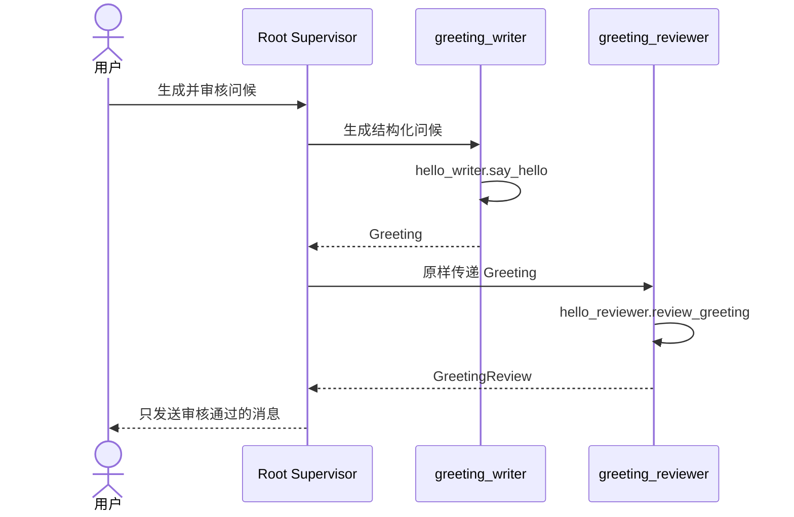

# Hello Team：用两个真实子 Agent 完成协作

## 1. 本篇目标

先完成[Hello Agent 快速入门](hello-agent-quickstart.md)。

本篇增加三个职责：

- Writer：生成结构化问候；
- Reviewer：审核问候，不能改写；
- Root Supervisor：安排生成、审核和最终交付。

用户问题：

> 生成一条给小林的问候，检查通过后再发给我。

期望协作：



返回[教程总入口](../multi-agent-development-tutorial.md)。

---

## 2. 先区分两种完全不同的“两个”

`hello-agent` 包含两个 MCP Server：

```text
hello_writer
hello_reviewer
```

这只证明 Runtime 有两套可调用能力。一个 Thread 也可以依次调用它们：

```text
一个 Thread
  ├── hello_writer.say_hello
  └── hello_reviewer.review_greeting
```

真正的两个 Agent 必须是两个由 Codex Runtime 创建的子 Thread：

```text
Root Thread
├── Child Thread · greeting_writer
└── Child Thread · greeting_reviewer
```

两种验证都要保留，因为它们定位不同问题：

| 验证 | 证明什么 | 失败时先查哪里 |
| --- | --- | --- |
| 两个 MCP Server 的 stdio smoke | Tool Schema、进程和数据交接正确 | Python、launcher、MCP |
| 两个真实子 Thread | Runtime Role、spawn、消息和等待正确 | Profile Role、Runtime、多 Agent |

如果底层 Tool 还不稳定就直接引入子 Agent，错误会同时出现在数据、协议、模型选择和
Thread 生命周期中，很难定位。正确顺序仍然是先验证能力，再验证协作。

---

## 3. 为什么需要独立 Reviewer

如果 Writer 自己生成、自行检查并宣布通过，产生内容的人也是唯一审核人。

Reviewer 只做明确的确定性检查：

1. 姓名是否合法；
2. 消息长度是否在上限内；
3. 消息是否与规范问候一致；
4. 返回所有拒绝原因；
5. 不修改被审核内容。

这对应真实领域中的常见分工：

| 产生结果 | 独立检查 |
| --- | --- |
| 代码生成 Agent | Code Review Agent |
| 数据准备 Agent | Data Validation 流程 |
| 方案分析 Agent | 风险或约束检查 Agent |

独立 Reviewer 有意义的前提是它检查明确合同，而不是再生成一份自己的答案。把同一
个宽泛问题交给两个模型再“投票”，既不说明谁的事实正确，也不解决结论冲突。

---

## 4. 一个能力包中的共享核心

当前结构：

```text
tools/hello-agent/
├── hello_agent/
│   ├── core.py
│   ├── writer_server.py
│   └── reviewer_server.py
├── skills/
│   ├── say-hello/
│   └── review-greeting/
├── examples/
│   ├── hello-team-request.md
│   └── runtime-roles/
└── .mcp.json
```

Writer 和 Reviewer 共同使用：

[`core.py`](../../tools/hello-agent/hello_agent/core.py)

这里集中保存：

```text
Greeting
GreetingReview
MAX_NAME_CHARACTERS
MAX_MESSAGE_CHARACTERS
normalize_name
build_greeting
evaluate_greeting
```

姓名上限和问候格式没有在两个 Server 中各写一遍。这样规则变更时，只修改一个权威
位置。

这也是两个能力放在同一个 Plugin 的第一个原因：它们属于同一领域、共享合同、使用
同一依赖，并由同一团队一起发布。

---

## 5. 逐行理解 Reviewer 业务函数

`evaluate_greeting` 位于共享 `core.py`：

```python
def evaluate_greeting(greeting: Greeting) -> GreetingReview:
    """Review a greeting without modifying the submitted handoff."""

    reasons: list[str] = []
    expected: Greeting | None = None

    try:
        normalized = normalize_name(greeting.name)
        expected = build_greeting(normalized)
        if greeting.name != normalized:
            reasons.append("name must not contain leading or trailing whitespace")
    except ValueError as error:
        reasons.append(str(error))

    if len(greeting.message) > MAX_MESSAGE_CHARACTERS:
        reasons.append(
            f"message must contain at most {MAX_MESSAGE_CHARACTERS} characters"
        )
    if expected is not None and greeting.message != expected.message:
        reasons.append("message does not match the expected greeting")

    return GreetingReview(
        approved=not reasons,
        greeting=greeting,
        reasons=reasons,
    )
```

逐项解释：

| 代码 | 作用 | 设计原因 |
| --- | --- | --- |
| 输入 `Greeting` | 接收完整 Writer 合同 | 不用两个松散参数猜对应关系 |
| 输出 `GreetingReview` | 承诺稳定审核结构 | Supervisor 可以可靠读取 |
| `reasons = []` | 累计全部问题 | 一次报告所有可见错误 |
| `normalize_name` | 复用唯一姓名规则 | Reviewer 不定义第二套上限 |
| `build_greeting` | 复用唯一消息格式 | Reviewer 不复制生成公式 |
| `except ValueError` | 把非法输入转成拒绝原因 | 审核失败不等于 Server 崩溃 |
| `approved=not reasons` | 没有任何问题才通过 | 结论由规则确定 |
| `greeting=greeting` | 原样返回审核对象 | 证明 Reviewer 没有偷偷替换内容 |

例如：

```json
{
  "name": "小林",
  "message": "你好，小周！"
}
```

会得到：

```json
{
  "approved": false,
  "greeting": {
    "name": "小林",
    "message": "你好，小周！"
  },
  "reasons": [
    "message does not match the expected greeting"
  ]
}
```

Reviewer 不会返回一条改写后的“正确消息”。这样 Root Supervisor 能清楚地区分
“原结果被拒绝”和“另一个 Agent 又生成了一份结果”。

---

## 6. Reviewer MCP 为什么仍然很薄

打开：

[`reviewer_server.py`](../../tools/hello-agent/hello_agent/reviewer_server.py)

核心内容：

```python
from mcp.server.fastmcp import FastMCP

from .core import Greeting, GreetingReview, evaluate_greeting

mcp = FastMCP(
    "Hello Reviewer",
    instructions=(
        "Call review_greeting with the Writer's unchanged structured result. "
        "Return approval and reasons. Never rewrite a rejected greeting."
    ),
    json_response=True,
)


@mcp.tool()
def review_greeting(greeting: Greeting) -> GreetingReview:
    """Approve or reject one greeting without modifying it."""

    return evaluate_greeting(greeting)
```

| 代码 | 角色 |
| --- | --- |
| `FastMCP` | 创建独立 Reviewer MCP Server |
| `Greeting` | 复用 Writer 与 Reviewer 的共同输入合同 |
| `GreetingReview` | 声明结构化输出 |
| `evaluate_greeting` | 调用唯一审核规则 |
| `instructions` | 说明 Tool 的使用语义，不形成权限 |
| `@mcp.tool()` | 注册 Runtime 可发现的外部 Tool |

Tool 名称是：

```text
hello_reviewer.review_greeting
```

MCP 边界只做协议适配。姓名规则、消息格式和审核判断仍然只在 `core.py` 中存在。

---

## 7. Runtime Role 解决什么问题

到这里，Writer 和 Reviewer 只是两套能力。Root Supervisor 若要创建指定职责的子
Thread，Codex Profile 还需要两个可发现的 Runtime Role：

| Runtime Role | 职责 | 示例指令 |
| --- | --- | --- |
| `greeting_writer` | 只生成并返回 `Greeting` | [`greeting-writer.md`](../../tools/hello-agent/examples/runtime-roles/greeting-writer.md) |
| `greeting_reviewer` | 只审核并返回 `GreetingReview` | [`greeting-reviewer.md`](../../tools/hello-agent/examples/runtime-roles/greeting-reviewer.md) |

Runtime Role 是子 Thread 启动时采用的执行配置。它不是：

- 一个正在运行的 Agent；
- 一个 Plugin；
- 一个企业 Agent Definition；
- 一个数据授权身份。

只有 Root 真正调用 `spawn_agent`，Runtime 创建出新的 Thread 后，运行实例才存在。

示例指令放在 `examples/runtime-roles/`，而不是 `.codex-plugin/plugin.json`，是因为
Plugin 能力发现和 Profile Role 配置属于不同生命周期。能力包不应在安装或启动时
悄悄修改用户的 `CODEX_HOME`。

---

## 8. 通过正式 Profile 设置创建两个 Role

先启动平台并打开 **Settings → Agents**：

1. 开启 multi-agent；
2. 将最大并发 Thread 设置为至少 `4`；
3. 将最大深度设置为 `1`；
4. 创建 `greeting_writer`；
5. 将
   [`greeting-writer.md`](../../tools/hello-agent/examples/runtime-roles/greeting-writer.md)
   的正文作为 developer instructions；
6. 创建 `greeting_reviewer`；
7. 将
   [`greeting-reviewer.md`](../../tools/hello-agent/examples/runtime-roles/greeting-reviewer.md)
   的正文作为 developer instructions。

平台会通过类型化 Profile API 保存 Role 配置并让 Codex 正式读取。不要为了图快而
用教程脚本写隐藏 `config.toml` 或 `agents/*.toml`；那会绕过当前 Profile 所有权和
错误处理。

Role 配置完成后新建 Root Thread。这样新的 Thread 同时获得：

- 当前 Profile 的 multi-agent 配置；
- `greeting_writer` 与 `greeting_reviewer` 两个 Role；
- `hello-agent` 这个 selected capability root；
- Codex 原生协作 Tool。

---

## 9. 先验证两个 MCP Server

运行：

```bash
.local/open-web-codex/tool-envs/hello-agent/bin/python \
  tools/hello-agent/tests/stdio_smoke.py
```

它会：

1. 启动 Writer；
2. 检查 Writer 只暴露 `say_hello`；
3. 调用 Writer；
4. 启动 Reviewer；
5. 检查 Reviewer 只暴露 `review_greeting`；
6. 把 Writer 的原结果交给 Reviewer；
7. 断言审核通过。

到这里证明的是“两套 MCP 能力能够交接”，不是 Runtime 已创建两个 Agent。

你也可以先在一个普通 Thread 中依次调用两个 Tool，以确认模型发现链路：

```text
先使用 $say-hello 生成给小林的问候，再使用 $review-greeting 审核。
只有 approved 为 true 时才返回问候。
```

这仍然是一名 Agent 使用两套能力。

---

## 10. 再运行两个真实子 Agent

在已配置 Role 的新 Root Thread 中，发送
[`hello-team-request.md`](../../tools/hello-agent/examples/hello-team-request.md)
中的请求。

正确轨迹是：

1. Root 创建 `greeting_writer` 子 Thread；
2. Writer 子 Thread 调用 `hello_writer.say_hello`；
3. Root 等待 Writer 完成并取得结构化 `Greeting`；
4. Root 创建 `greeting_reviewer` 子 Thread，并原样传入 Greeting；
5. Reviewer 子 Thread 调用 `hello_reviewer.review_greeting`；
6. Root 等待 Reviewer 完成；
7. Root 只在 `approved=true` 时交付问候。

每个子 Agent 应留下：

- 独立 Thread ID；
- 指向 Root 的父 Thread 关系；
- `greeting_writer` 或 `greeting_reviewer` Runtime Role；
- 自己的消息和 MCP Tool 调用；
- Runtime 报告的状态。

以下结果都不能算通过：

| 观察到的结果 | 为什么不通过 |
| --- | --- |
| Root 自己调用了两个 Tool | 没有创建子 Agent |
| 创建两个默认 Agent，没有指定 Role | 没验证可发现的职责配置 |
| Writer 和 Reviewer 是两条平台数据库记录 | 数据库记录不能替代 Runtime Thread |
| Reviewer 收到的是 Root 改写后的问候 | 交接合同被破坏 |
| Tool 不可用时子 Agent自己生成结果 | 伪造了确定性证据 |

当前企业 Supervisor 面板只显示绑定了企业 Policy 的协作；Hello Team 是 Runtime
教学练习，不应为了展示它而伪造一块平台 Agent 树。发布级父子轨迹和浏览器恢复证据
将在下一篇供应链案例中验证。

---

## 11. 为什么子 Agent 能看到同一 Plugin

Root Thread 启动时记录 selected capability roots。当前 Codex Runtime 在创建子
Thread 时继承这组 roots，所以 Writer 与 Reviewer 都能发现 `hello-agent` 中的
Skills 和 MCP Servers。

这解释了两个看似矛盾的事实：

1. 两个子 Thread 是两个真实 Agent；
2. 两个 Agent 当前仍共享同一个能力包。

共享能力包不等于共享上下文：它们有独立 Thread 和执行历史。共享能力包也不等于
已经完成最小权限：两个 Role 在技术上都能发现 Writer 与 Reviewer Tool。

当前安全边界来自：

- Tool 只暴露有限操作；
- 输入由 Pydantic 合同校验；
- MCP Server 不提供任意命令或文件能力；
- 平台控制 Profile、Workspace 与 capability roots；
- 企业场景中的数据范围由服务端绑定。

Role instructions 是职责约束，不是授权。未来若确实需要每个 Agent 获得不同能力，
必须增加可验证的 Role/capability 授权合同，不能靠 Prompt 声称隔离。

---

## 12. 为什么这里不需要 Policy、Definition 和 Artifact

Hello Team 的目标是学习 Runtime 协作，不是模拟一整套企业平台。

| 暂不引入 | 原因 |
| --- | --- |
| Supervisor Policy | 一次教学请求足以表达固定顺序，不需要企业版本绑定 |
| Agent Definition | 两个本地 Role 尚不需要发布状态、所有者和治理目录 |
| Artifact | Greeting 只有两个短字段，普通消息足够交接 |

这不是说这些概念不重要，而是它们还没有解决本例中的真实问题。下一篇仓网案例会
出现大型数据、长期成果、角色发布和协调规则，届时再引入它们。

---

## 13. 做两次失败验证

### Role 缺失

暂时删除或改名 `greeting_reviewer`，再发送相同请求。

正确行为：

- Root 明确报告 Role 不存在；
- 不换成 `default`；
- 不由 Root 自己完成审核；
- 不声称已经有两个 Agent。

恢复 Role 后新建 Thread 再测。

### Reviewer 拒绝

让 Reviewer 审核：

```json
{
  "name": "小林",
  "message": "你好，小周！"
}
```

正确行为：

- `approved=false`；
- 原问候不被改写；
- Root 返回拒绝原因；
- Root 不把另一个新问候伪装成“审核通过的原结果”。

---

## 14. 完成标志

- [ ] 能解释两个 MCP Server 与两个 Agent 的区别；
- [ ] Writer 和 Reviewer Tool 都能通过 stdio 调用；
- [ ] 错误问候返回明确原因且没有被改写；
- [ ] 通过正式 Profile 设置创建两个精确 Runtime Role；
- [ ] Root 创建两个拥有独立 Thread ID 的子 Agent；
- [ ] Writer 和 Reviewer 分别调用正确 MCP Tool；
- [ ] 能解释 capability root 继承为什么不等于按 Role 授权；
- [ ] 能解释为什么 Hello Team 不需要 Artifact；
- [ ] Role 缺失时明确失败，且不改用默认 Role 或由 Root 兜底。

下一篇：

[仓网规划：接入企业 Supervisor、治理合同与 Artifact](supply-chain-agent-tutorial.md)
