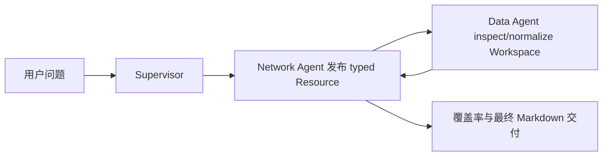

# 印尼仓网 1：从 Web 跑通第一份网络分析

本篇只解决一个问题：在不计算运输成本、不接导航接口的前提下，用 50 个印尼需求城市和已有仓库，按球面距离估算时效，得到 6、12、18 小时覆盖率。

本篇是四篇教程的起点。它先让读者理解最小链路：



## 你会用到什么

| 对象 | 本篇的作用 |
| --- | --- |
| Supervisor | 根据缺口协调两个 Agent，不负责计算 |
| Network Agent | 说明本次问题需要需求城市、已有仓库、路线参数和时效目标 |
| Data Agent | 检查 CSV/JSON/XLSX、生成字段映射、补充行政区和坐标 |
| `supply_chain` | Data/Network logical provider；发现来源、确认映射、构建矩阵、计算覆盖率并发布报告 |
| typed ResourceRef | Agent 消息只传经校验的 `source_profile.v1`、`normalized_network_input.v1` 和分析结果引用 |
| Artifact | 只保存用户最终需要查看和下载的报告，不承担 Agent 间数据交换 |

本篇只用 `haversine distance × 绕路系数`。它是规划估算，不是导航承诺。导航接口要在后续得到明确许可后批量调用，不能逐个客户调用。

## 准备教程数据

数据已经生成并保存在 [base fixture](../../tools/warehouse-network-planner/examples/indonesia-network/base/)：

| 文件 | 用途 |
| --- | --- |
| `demand-cities.csv` | 50 个需求城市、人口、需求量、城市和省份坐标 |
| `existing-warehouses.csv` | Jakarta、Palembang、Medan、Surabaya、Makassar 五个中心仓和六个 cross-docking 仓 |
| `administrative-areas.json` | 城市、省份、坐标和 ADM2 来源信息 |
| `candidate-warehouses.csv` | 第四篇才使用的候选仓，第一篇可以先不上传 |
| `route-quotes.csv` | 第二篇才使用的报价 |
| `source-lock.json`、`validation-report.json` | 来源、许可证、hash 和生成校验，不是计算输入 |

生成器已验证 50 个需求点位于 geoBoundaries ADM2 边界内，需求量为 `ceil(population / 1000)`，11 个已有仓，550 条末端报价和 30 条干线报价。不要手工改动这些文件；改动后应重新生成并检查 `validation-report.json`。

## Web 操作

1. 打开 Web 的 **Workspace → Files**，选择一个有权使用的 Workspace。
2. 点击 **Add data**，上传 `demand-cities.csv`、`existing-warehouses.csv` 和 `administrative-areas.json`。只接受 CSV、JSON、XLSX；不要上传 `geoboundaries-idn-adm2.geojson` 原始大文件，边界核验结果已经保存在行政区数据和校验报告中。
3. 在 **Supervisor / Enterprise Network Planning Copilot** 中选择 `6.0.0`。如果列表没有该版本，说明服务未应用当前 seed migration，不要改用旧 Supervisor。
4. 创建 Thread，发送：

   ```text
   规划国家是印度尼西亚。请使用我上传的教程 mock 数据，先只分析已有仓库覆盖。
   不计算运输成本、不调用导航接口。使用球面距离乘绕路系数估算距离，使用平均行驶速度估算时效，给出 6、12、18 小时需求覆盖率，并说明各省哪些较差。
   ```

“教程 mock 数据”是明确的示例数据意图；本包已没有独立 Demo MCP，系统只在该意图下把 fixture 作为普通 Workspace 文件写入，失败时不得自动回退。

## 预期交互

Root Thread 先发布 typed 数据需求。Data Agent 和 Network Agent 通过同一 `supply_chain` provider 的 `ResourceRef` 协作：

1. 发现并检查 Workspace 来源，发布 `source_profile.v1`。
2. 提出显式字段映射，说明每个源字段如何映射到需求城市、已有仓库和行政区字段。
3. 如果字段名或城市名有歧义，显示用户输入卡片。`ambiguous` 不能由模型猜测。
4. 把 `normalized_network_input.v1` 和数据质量状态发布为 Resource，不把数据行带回对话。

Network Agent 再请求缺失参数。第一次看到输入卡片时选择：

| 参数 | 教程建议值 | 原因 |
| --- | ---: | --- |
| 绕路系数 | `1.28` | 用于把球面距离调整为规划道路距离 |
| 平均行驶速度 | `42 km/h` | 用于把调整后距离换算成行驶时间 |
| 每日可行驶小时 | `6` | 本篇把日级时效换算为 6 小时一个驾驶日 |
| 目标时效 | `6, 12, 18 小时` | 同时输出三个需求加权覆盖率 |

前端应显示一个简短的 Agent execution 卡片，而不是连续显示 `wait` 消息。卡片的终态应是“已完成”或明确的“等待输入/失败”；原始事件仍保存在 Run 审计中。

## 真实结果检查

检查以下事实，而不是只看模型的一段总结：

- `normalized_network_input.v1` 为 `ready`，且摘要显示 50 个需求城市和 11 个已有仓。
- `route_matrix.v3` 为 `ready`，方法是 `haversine`，路线数等于 11 × 50 = 550。
- 路线组件保存绕路系数和平均速度；没有 `navigation` 结果。
- `network_baseline.v2` 为 `ready`，并由 final Tool 创建 `network_planning_report_markdown.v2` Workspace 交付物；baseline 评估仍使用独立 baseline report bundle 口径，比较报告使用 generic before/after 口径。
- 报告写明这是 `optimized_existing_footprint`，因为本篇没有上传当前覆盖关系；不能称为实际当前方案。
- 刷新页面后，输入卡片、Agent 状态和报告交付物仍可恢复。

## 常见失败

| 现象 | 含义和处理 |
| --- | --- |
| 找不到需求城市 | 文件没有城市标识或需求量；补充 `city_id/city_name/demand_quantity` |
| 找不到已有仓库 | 文件没有 `warehouse_id/name/type/city_id/city_name`；补充仓库列表 |
| 坐标缺失 | Data Agent 应先用行政区目录补充；匹配不明确时由用户选择，不要填 0 |
| 要求导航许可 | 本篇参数选择错了；选择球面距离，或明确承担批量导航费用 |
| 显示没有当前覆盖 | 这是预期结果，不是运行失败；本篇只计算已有仓范围内的优化基线 |
| 空 Workspace 自动出现示例数据 | 这是缺陷。空 Workspace 必须保持 `needs_input`，不能 Mock 回退 |

## 换成自己的数据

只需要替换需求城市和已有仓库文件，并在映射卡片中确认字段。需求城市至少需要：`city_id`、`city_name`、`demand_quantity`；已有仓库至少需要：`warehouse_id`、`warehouse_name`、`warehouse_type`、`city_id`、`city_name`。如果文件没有经纬度，Data Agent 可以使用已授权的行政区目录补充，但必须保留匹配来源和结果状态。

下一篇将加入报价、center/cross-docking 两级关系和全网运输成本。
