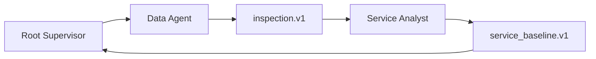

# 印尼仓网 2：只分析当前单层时效

本篇只回答：

- 当前客户到前置仓的 1 天、2 天、3 天需求覆盖率是多少？
- 哪些省份时效较差，哪些较好？

暂不引入中心仓补货、仓库容量、运输成本、新仓候选或地图。确定性 Tool 返回的
`indonesia_service_baseline.v1` 明确不包含 `costs`、`warehouses` 或 `links`。

比上一篇增加的概念是：Data Agent 与 Network Agent 通过一个类型化 Artifact 交接，
Root Supervisor 根据当前证据决定怎样协调它们。

预计用时 25–35 分钟。先完成
[印尼仓网 1](indonesia-network-01-data.md)。

## 已知答案

| 指标 | 期望值 |
| --- | ---: |
| 1 天需求覆盖率 | 30.42% |
| 2 天需求覆盖率 | 71.80% |
| 3 天需求覆盖率 | 90.60% |

部分省份结果：

| 省份 | 2 天需求覆盖率 | 需求加权平均服务天数 | 解释 |
| --- | ---: | ---: | --- |
| Maluku | 0.00% | 5.32 | 当前优先改善 |
| Papua Barat Daya | 0.00% | 4.68 | 当前优先改善 |
| Sulawesi Tenggara | 0.00% | 3.58 | 当前优先改善 |
| Kalimantan Selatan | 100.00% | 1.14 | 当前表现最好 |
| Jawa Timur | 98.15% | 1.73 | 当前表现较好 |
| DKI Jakarta | 94.70% | 2.05 | 当前表现较好 |

三个人口和需求很小的省份在本数据版本中需求为 0，不应被当作“100% 覆盖”或“0%
失败”；正确结果会把它们标为无需求。

本教程的“较好/优先改善”不是按平均天数临时排序：只纳入有需求省份，先按 **2 天
需求覆盖率** 排序，再用需求加权平均服务天数打破并列。Resource 中的
`province_ranking_policy` 声明口径，`best_province_codes` 和
`priority_province_codes` 给出权威顺序。

## 1. 发布一个只交付时效基线的 Network Agent

打开 **Agent Studio → Agents → New Agent**：

| 字段 | 值 |
| --- | --- |
| Agent ID | `tutorial-indonesia-network` |
| Version | `1.0.0` |
| Display name | `Tutorial Indonesia Service Analyst` |
| Description | `Evaluates current last-mile service without cost or location optimization.` |
| Reviewed capability template | `Enterprise Network Planning Agent · 3.1.0` |

**Responsibilities**：

```text
读取一个已验证的印尼仓网 inspection Artifact
只计算当前客户到前置仓的服务覆盖和省份表现
发布有界的 indonesia_service_baseline.v1，不分析成本或新仓
```

**Custom Agent instructions**：

```text
开始前必须收到完整的 indonesia_dataset_inspection.v1 handoff，其中包含原样
resource_name 和结构化 data_ref。把 resource_name 原样作为 inspection_resource_name
传给分析 Tool；data_ref 只保留为交付来源，不作为 Tool 输入。缺少精确 resource_name
时只报告 MISSING_ARTIFACT_HANDOFF 并停止；不要列出 MCP Resources、读取 inspection、
搜索 Workspace 或猜 URI。

只调用 supply_chain_indonesia.evaluate_indonesia_service_baseline。Tool 由
supply_chain_indonesia 自己解析并校验 inspection Resource，再按当前前置仓分配计算
1/2/3 天覆盖和省份结果；不得调用完整现状成本、候选、优化或地图 Tool，也不要用模型重算。
省份排名必须按 province_ranking_policy 解释，并保持 best_province_codes 和
priority_province_codes 的原始顺序，不要改按平均天数重排。

最终回答先输出原样 ARTIFACT_HANDOFFS，然后报告覆盖率、优先改善省份、表现较好省份、
距离/速度/每天驾驶时长假设和限制。不得报告本 Artifact 不包含的成本、容量或干线结论。
```

Artifact contracts 只保留：

```text
Input · indonesia_dataset_inspection.v1
Output · indonesia_service_baseline.v1
```

依次点击：

```text
Create draft → Validate → Publish
```

当前 Web 的 **Reviewed capability template** 固定整个 Network MCP Tool allowlist，Agent
作者不能在 draft 中逐个增加或删除 Tool；你能收窄的是 Artifact 输入输出和任务方法。
本篇要求实际只调用一个分析 Tool。若生产环境需要从技术上禁止同模板中的其他 Tool，
应由平台发布一个更窄的 reviewed template，而不是只靠文字约束。

## 2. 创建两 Agent Supervisor

打开 **Agent Studio → Supervisors → New Supervisor**：

| 字段 | 值 |
| --- | --- |
| Policy ID | `tutorial-indonesia-network-supervisor` |
| Version | `1.0.0` |
| Display name | `Tutorial Indonesia Network Supervisor` |
| Description | `Coordinates validated data and a bounded current-service analysis.` |
| Platform behavior contract | `Platform Supervisor behavior · 1.1.0` |
| Maximum active child Agents | `2` |

**Responsibilities**：

```text
识别回答当前时效问题所缺少的最小证据
只委派已发布的 Data 和 Service Analyst
保证 inspection 以类型化 Artifact 交给下游
核对结果口径并交付事实、假设、分析、建议、局限和缺失证据
```

**Custom Supervisor instructions**：

```text
你是本任务的 Root Supervisor，对最终报告负责。

先识别用户问题和当前 Task 中已有的有效 Artifact。缺少经过验证的
indonesia_dataset_inspection.v1 时，委派 Tutorial Indonesia Data Agent；需要当前末端
时效事实时，委派 Tutorial Indonesia Service Analyst。不要把角色数量或固定顺序当作
完成条件；已有有效 Artifact 时应复用，证据缺失时才补齐。

Root 不读取 Workspace、不调用业务 MCP、不复制原始客户数据，也不替代专业 Agent 计算。
把完整的 resource_name 和结构化 data_ref 原样交给兼容 Agent，并明确要求下游只把
resource_name 作为分析 Tool 输入。Agent 失败或 handoff 不完整时报告缺口，不让下游
搜索 Resource、Workspace 或同名替代版本。

最终报告分为：事实、假设、分析、建议、局限、缺失证据。关键数字注明 Artifact schema
和 resource_name；不要暴露 Resource URI。本版本不得讨论成本、新仓或地图。
```

在 **Allowed Agents** 中只选择：

- `Tutorial Indonesia Data Agent · 1.0.0`；
- `Tutorial Indonesia Service Analyst · 1.0.0`。

设置 handoff：

| Artifact | Producer | Consumer | Required |
| --- | --- | --- | --- |
| `indonesia_dataset_inspection.v1` | Data Agent | Service Analyst | 否 |
| `indonesia_service_baseline.v1` | Service Analyst | Supervisor | 否 |

点击：

```text
Create draft → Validate → Publish
```

这里的“否”不是说本次答案不需要证据，而是说 Supervisor Release 只声明允许的条件性
证据边，不把每个未来问题都固定成同一流程。本篇用户问题要求时效，所以 Runtime 必须
补齐这两项证据。一个全新 Task 通常没有 inspection；当前平台尚未支持跨 Task 复用
Artifact。只有同一 Task 的后续问题已经持有有效证据时，才可以跳过重复工作。

## 3. 启动 Supervisor

回到主页面，在 Workspace 行点击星光图标 **Start governed supervisor**，选择
**Tutorial Indonesia Network Supervisor · 1.0.0**。

发送：

```text
分析当前印尼客户到前置仓的末端时效。告诉我 1 天、2 天和 3 天需求覆盖率，各省表现，
哪些省份应优先改善，哪些表现较好。

本次只分析当前前置仓服务，不讨论中心仓补货、容量、成本、新仓或地图。距离使用教程
声明的球面距离乘系数方法，平均速度和每天驾驶时长使用已验证 policy。请根据证据缺口
动态选择 Agent，不要按写死顺序执行。
```

## 4. 审阅 Agent Activity

对一个没有现成 Artifact 的新 Task，常见轨迹是：



不要把这张图理解成平台固定 Workflow。审阅的是以下不变量：

- Root 只使用协作能力，不调用 `supply_chain_indonesia`；
- Data Agent 只看到会原子校验输出的 `inspect_indonesia_dataset_release`，不看到
  独立 validator 或网络分析 Tool；
- Service Analyst 收到完整 inspection handoff；
- 实际业务分析只调用 `evaluate_indonesia_service_baseline`；独立审计已有 Resource
  时可以再调用通用 validator；
- 没有候选、优化、地图或成本 Tool 调用；
- 两个 Artifact 都为 `ready`，生产者和消费者正确；
- Agent 的 `wait` 状态包含正在等待什么，而不是空白事件。

## 5. 审阅最终报告

报告应准确包含：

- 1 天 30.42%、2 天 71.80%、3 天 90.60% 的需求覆盖率；
- Maluku、Papua Barat Daya、Sulawesi Tenggara 等优先改善省份；
- Kalimantan Selatan、Jawa Timur、DKI Jakarta 等表现较好省份；
- 球面距离乘 1.25、45 km/h、6 小时/天的假设；
- `indonesia_service_baseline.v1` 的原样 `resource_name`；
- 明确声明本篇没有分析干线、容量或成本。

刷新页面后，Agent 树、Tool 事件、Artifact 和报告必须恢复为同一组持久记录。

## 6. 为什么第二个 Agent 是合理的

Data Agent 的职责是回答“这份数据能不能用”；Service Analyst 回答“按统一口径算出来
是什么”。如果把两者合成：

- 数据校验失败和业务分析失败难以区分；
- 下游无法复用同一份 inspection；
- Agent 可能一边修改口径一边计算；
- 权限和交付物会变得含糊。

但不要继续拆成“1 天覆盖 Agent”“2 天覆盖 Agent”。这些指标使用同一数据、同一算法、
同一结果合同，拆开只会增加协调成本。

下一篇：

[印尼仓网 3：加入两级运输成本和指定候选](indonesia-network-03-two-level-cost.md)
