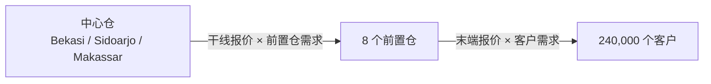

# 印尼仓网 3：加入两级运输成本和指定候选

本篇在时效基线之上增加：

- 3 个中心仓到 8 个前置仓的干线；
- 前置仓到客户的末端配送；
- 当前仓库容量和负荷；
- 一张距离总体正相关的运输报价表；
- 用户明确指定的 `CAN-PONTIANAK` 候选前置仓；
- 5 年直线摊销的开仓费用和年度固定费用。

我们仍不做“最优位置”搜索，也不创建地图。这样可以先学会怎样解释一个已知方案的
增量效果，再进入优化。

预计用时 25–40 分钟。先完成
[印尼仓网 2](indonesia-network-02-service-baseline.md)。

## 已知答案

当前网络年度成本：

| 成本 | IDR |
| --- | ---: |
| 中心仓到前置仓干线 | 46,795,403,300 |
| 前置仓到客户末端 | 63,229,294,100 |
| 运输成本合计 | 110,024,697,400 |

Pontianak 候选方案：

| 指标 | 当前 | Pontianak | 增量 |
| --- | ---: | ---: | ---: |
| 2 天需求覆盖率 | 71.80% | 74.18% | +2.38 个百分点 |
| 运输成本 | 110,024,697,400 | 109,048,262,500 | -976,434,900 |
| 年度决策成本 | 110,024,697,400 | 125,473,262,500 | +15,448,565,100 |

Pontianak 方案承接 249,999 个年度需求单位，未超过 250,000 的容量。它减少了运输成本，
但加上每年 9,300,000,000 的开仓摊销和 7,125,000,000 的固定费用后，年度决策成本
反而上升。时效改善和总经济成本必须分别报告。

## 1. 理解两级成本口径

当前网络：



计算口径：

```text
干线成本 = Σ(前置仓年度需求 × 对应中心仓到前置仓单位需求报价)
末端成本 = Σ(省份内分配给某前置仓的年度需求 × 该前置仓到该省单位需求报价)
当前运输成本 = 干线成本 + 末端成本
```

候选方案的年度决策成本为：

```text
候选运输成本
+ 候选年度固定费用
+ 候选开仓费用 ÷ 5
```

开仓费用是探索性年化，不等于财务折现评价。现金流、税、折旧、营运资金和资本成本不在
本篇范围内。

## 2. 发布 Network Agent 新版本

已发布的 `tutorial-indonesia-network@1.0.0` 不能修改。在 **Agent Studio → Agents**
找到该定义，点击 **New version**，填写版本 `2.0.0`。

保留同一 Agent ID，Display name 改为：

```text
Tutorial Indonesia Network Analyst
```

Description：

```text
Evaluates current two-level service and cost plus one user-named reviewed candidate.
```

**Responsibilities**：

```text
读取经过验证的同一印尼 Dataset inspection
核算当前两级仓网的时效、容量、干线和末端成本
只在用户明确给出候选 ID 时评价一个已评审候选
发布可对账的 current 和 candidate Resources
```

**Custom Agent instructions**：

```text
开始前必须收到完整的 indonesia_dataset_inspection.v1 resource_name 和结构化 data_ref。
把 resource_name 原样作为 inspection_resource_name 传给 Domain Tool；data_ref 只保留
为交付来源，不作为 Tool 输入。缺少精确 resource_name 时停止，不列出 Resources、不读取
inspection、不搜索 Workspace、不猜 URI。

当任务要求当前两级仓网时，调用 evaluate_indonesia_current_network。当用户明确给出
一个已审核 candidate_id 时，只把该 ID 传给 evaluate_indonesia_candidate，并使用
用户给出的 opening_amortization_years。只使用 Dataset 中的当前分配、仓库关系、容量
和报价。不得把当前分配重标为最优，不得自行选择其他候选，也不得调用 optimize 或
map Tool。

确定性 Tool 负责客户重分配、容量、报价、覆盖和成本对账。最终回答先输出全部原样
ARTIFACT_HANDOFFS，再分别报告当前成本、候选时效变化、运输成本变化、含固定和年化开仓
费用的年度决策成本变化、约束和 checks。不得把运输成本下降写成总成本下降。
```

选择同一个 `Enterprise Network Planning Agent · 3.6.0` template，Artifact contracts
保留：

```text
Input · indonesia_dataset_inspection.v1
Output · indonesia_current_network_analysis.v1
Output · indonesia_candidate_scenario.v1
```

依次点击：

```text
Save draft → Validate → Publish
```

如果页面从 **New version** 打开的是新草稿而不是旧内容副本，应重新填写职责、instructions
和 Artifact 选择。不要假定新版本自动继承旧版本的隐藏状态。

## 3. 发布 Supervisor 新版本

在 **Agent Studio → Supervisors** 找到
`tutorial-indonesia-network-supervisor`，点击 **New version**，设置版本 `2.0.0`。

Allowed Agents 只选择：

- `Tutorial Indonesia Data Agent · 1.0.0`；
- `Tutorial Indonesia Network Analyst · 2.0.0`。

不要继续绑定旧的 Service Analyst `1.0.0`。一个 Supervisor Release 必须精确绑定它
实际要求的 Agent Release。

设置 handoff：

| Artifact | Producer | Consumer | Required |
| --- | --- | --- | --- |
| `indonesia_dataset_inspection.v1` | Data Agent 1.0.0 | Network Analyst 2.0.0 | 否 |
| `indonesia_current_network_analysis.v1` | Network Analyst 2.0.0 | Supervisor | 否 |
| `indonesia_candidate_scenario.v1` | Network Analyst 2.0.0 | Supervisor | 否 |

Maximum active child Agents 仍为 `2`。

**Custom Supervisor instructions**：

```text
根据当前 Task 的证据缺口动态选择已绑定 Agent，不把固定数量或顺序作为完成条件。
当用户只问现网时只要求现网证据；当用户明确指定一个已审核候选时，再要求同口径候选
证据。候选 ID 和摊销年限来自当前用户任务，不得写死或自行替换。Root 不调用业务
MCP、不读取 Workspace，也不替代 Network Agent 计算。

把 Data Agent 返回的完整 resource_name 和结构化 data_ref 原样交给 Network Agent，
并明确要求它只把 resource_name 作为 inspection_resource_name 传给 Domain Tool。
要求 Network Agent 区分当前分配、候选重分配、运输成本和含固定/摊销费用的年度决策成本。
Artifact 缺失、Tool 失败、容量超限或报价不完整时停止相应结论并报告缺口。

最终报告分为事实、假设、分析、建议、局限、缺失证据。每个关键数字引用准确 Artifact
schema 和 resource_name，不暴露 URI。本版本不运行全候选优化，不创建地图。
```

完成：

```text
Save draft → Validate → Publish
```

## 4. 启动 2.0.0 Supervisor

在 Workspace 点击 **New task**。在 **Start a task** 中选择 **Supervisor** 和
**Tutorial Indonesia Network Supervisor · 2.0.0**，发送：

```text
核算当前印尼两级仓网的 1 天、2 天、3 天需求覆盖率、中心仓到前置仓的年度干线成本、
前置仓到客户的年度末端成本和运输成本合计。

然后只评价已审核候选 CAN-PONTIANAK。开仓费用按 5 年摊销，请比较它的时效、运输成本
和含年度固定费用及开仓摊销的年度决策成本。不要搜索其他候选，不做最优选址，不创建地图。
根据证据缺口动态选择 Agent，不按写死顺序执行。
```

## 5. 审阅 Tool 与 Artifact

本篇任务需要的最小业务调用是：

```text
inspect_indonesia_dataset_release
evaluate_indonesia_current_network
evaluate_indonesia_candidate
```

Data Agent 的 inspection Tool 已在发布时原子校验自己的 Resource，因此不需要也
看不到重复的 validator；具有独立审计权限的消费者才按需调用通用 validator。

不应出现：

```text
optimize_indonesia_new_warehouse
prepare_indonesia_network_map
map_utils.create_map_card
```

Artifact 应包含：

- `indonesia_dataset_inspection.v1`；
- `indonesia_current_network_analysis.v1`；
- `indonesia_candidate_scenario.v1`。

三个 handoff 在 Release 中保持条件性：本篇 Prompt 同时要求现网和 Pontianak，所以
本次运行应产生三项；后续若只问现网，不应为了“Required”标记强行评价候选。每个
Domain Tool 在发布前已经原子校验自己的 Resource。独立 `validate_indonesia_resource`
适合审计一个已有 handoff，但正确性不能依赖模型记得再调用第二个 validator。

## 6. 怎样读方案结果

正确结论不是简单说“Pontianak 好”或“不好”，而是：

- 它让 2 天需求覆盖率从 71.80% 提升到 74.18%；
- 它让年度运输成本降低 IDR 976,434,900；
- 它的固定费用和年化开仓费用合计 IDR 16,425,000,000；
- 因此年度决策成本增加 IDR 15,448,565,100；
- 是否接受这项成本取决于业务对时效改善的价值判断，本篇没有提供这个价值函数。

建议可以是“Pontianak 能达到 74% 左右的时效目标，但仅凭运输节省不能覆盖设施费用”，
不能把计算结果扩展成未经证据支持的投资批准。

## 7. 失败和边界

| 情况 | 正确行为 |
| --- | --- |
| 用户输入未评审的候选 ID | Tool 明确拒绝，不按城市名猜 |
| 候选需求超过容量 | 结果必须受容量限制或失败 |
| 某条报价缺失 | 结果不完整并明确失败，不能使用平均价补齐 |
| 用户只问当前成本 | 不运行候选 Tool |
| 用户要求真实 ETA | 说明当前是规划近似，不能冒充导航 |

下一篇：

[印尼仓网 4：有限候选优化与地图](indonesia-network-04-optimization-map.md)
