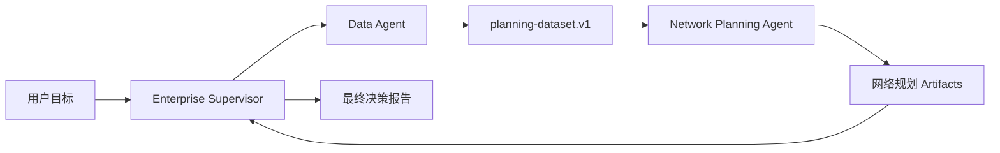

# 仓网规划：运行并审阅企业 Supervisor

本篇使用仓库自带的 **Enterprise Supervisor Copilot** 完成一次端到端企业案例。
重点不是再次创建 Agent，而是学会检查：

- Supervisor 是否按合同委派；
- 两个 Agent 是否使用正确能力；
- 数据是否通过 Resource 和 Artifact 交接；
- 覆盖率与成本是否同口径比较；
- 页面刷新后是否仍能恢复同一结果。

预计用时 20–30 分钟。任务会启动 Root 和两个子 Agent，Provider 用量高于普通
Thread。

先完成：

1. [Hello Agent](hello-agent-quickstart.md)
2. [Hello Team](hello-agent-team.md)

返回[教程总入口](../multi-agent-development-tutorial.md)。

## 完成后的结果



正确任务具有：

- 一个绑定精确 Policy 版本的 Root Thread；
- 一个 Data Child Thread；
- 一个 Network Planning Child Thread；
- 一组 `ready` Artifact；
- 一份引用证据、说明假设和风险的最终报告。

## 1. 检查能力环境

在仓库根目录运行：

```bash
tools/supply-chain-network-planner/bin/setup-env

.local/open-web-codex/tool-envs/supply-chain-network-planner/bin/python \
  -m pytest tools/supply-chain-network-planner/tests -q

.local/open-web-codex/tool-envs/supply-chain-network-planner/bin/python \
  tools/supply-chain-network-planner/tests/stdio_smoke.py
```

期望：

```text
15 passed
Supply-chain MCP stdio smoke passed
```

还可以验证全部 Skill 和 Plugin：

```bash
for skill in tools/supply-chain-network-planner/skills/*; do
  python3 \
    codex/codex-rs/skills/src/assets/samples/skill-creator/scripts/quick_validate.py \
    "$skill"
done

python3 \
  codex/codex-rs/skills/src/assets/samples/plugin-creator/scripts/validate_plugin.py \
  tools/supply-chain-network-planner
```

这些检查分别证明业务规则、MCP 协议、Skill 结构和 Plugin 结构。它们不能代替真实
Runtime 任务，但能把底层错误隔离在进入多 Agent 之前。

## 2. 读懂本次练习数据

数据源 ID：

```text
warehouse-network-fixture
```

它是一个去标识化、可重复的小型规划源：

| 项目 | 值 |
| --- | ---: |
| 总需求 | 100 |
| 上海需求 | 40 |
| 苏州需求 | 35 |
| 杭州需求 | 25 |
| 现有仓 | 上海、南京 |
| 候选仓 | 杭州、无锡 |
| 目标一日达覆盖率 | 90% |

第一版使用 fixture，而不是直接接生产 ERP/WMS，因为小数据可以人工核对，错误能明确
定位，同一输入也能重复运行。fixture 证明架构和计算链，不代表生产数据接入、质量或
多用户授权已经完成。

## 3. 启动内置 Supervisor

在 Web 中：

1. 选择当前仓库的 Workspace；
2. 点击 Workspace 行上的 **Start governed supervisor**；
3. 选择 **Enterprise Supervisor Copilot**；
4. 等待 Thread 创建完成；
5. 确认页面显示当前精确版本为 `bound`。

当前仓库示例版本是：

```text
enterprise-supervisor-copilot@1.7.0
```

它精确绑定：

```text
Enterprise Data Agent
Enterprise Network Planning Agent
```

平台会在启动前验证 Release、能力根、MCP Tool allowlist 和 Runtime 要求，再为本次
Thread 准备 request-scoped Runtime Roles。不要手工创建同名全局 Agent，也不要用
脚本修改隐藏 Profile 配置。

## 4. 提交完整且有界的目标

发送：

```text
分析授权数据源 warehouse-network-fixture 的华东仓网。

请先准备并验证 planning-dataset.v1，再比较：
1. 实际当前分配关系；
2. 不新增仓、严格遵守容量的现有网络优化基线；
3. 增加杭州候选仓；
4. 增加无锡候选仓。

目标是一日达覆盖率至少 90%。一日达必须使用完整端到端时效，而不是只看导航时间。
最终报告分为事实、假设、方案比较、建议、风险和缺失证据，并引用关键 Artifact 的
Schema 与 resource_name。
```

这个 Prompt 指定业务目标和比较范围，但不授予 Tool、文件、凭据或数据权限。实际
能力来自 Supervisor Release、Agent Release、capability roots 和服务端授权。

## 5. 观察正确的委派顺序

打开右上角 **Agent activity**。正确顺序是：

```text
Root Supervisor
  ↓ 委派数据准备
Data Agent
  ↓ list → inspect → build → validate
planning-dataset.v1
  ↓ 原 data_ref
Network Planning Agent
  ↓ read → snapshot → route → evaluate → compare → validate
网络规划 Artifacts
  ↓
Root Supervisor 最终综合
```

重点检查：

- Data Agent 先完成，Network Agent 后开始；
- Data Agent 不选择仓库；
- Network Agent 不重新构造或猜测 Dataset；
- Network Agent 在计算前读取同一 `data_ref`；
- Root 不在 Agent 缺失时自己伪造专业结果；
- 失败时状态和原因保持可见。

右侧面板可以通过关闭按钮、`Esc` 或点击面板外部区域关闭。

## 6. 理解 Data Agent 的边界

Data Agent 只处理事实：

- 列出受控数据源元数据；
- 检查时间范围、单位、行数和质量；
- 构建 `planning-dataset.v1`；
- 验证总需求和投影一致；
- 返回原始 `data_ref` 和安全的 `resource_name`。

Data Tool 接受稳定 `source_id`，不接受任意 SQL、数据库密码或本地路径。只读属性
来自 Tool 的操作面和服务端数据根，不来自 Prompt 中“请保持只读”这句话。

如果数据缺失，正确结果是带着 warning 或 error 停止/限缩结论，不是用默认值补齐。

## 7. 理解 Network Planning Agent 的比较口径

一日达不是只看地图导航时间：

```text
端到端时效
  = 截单等待
  + 仓内处理
  + 干线/公路运输
  + 末端缓冲
```

同一 fixture 的核心回归结果是：

| 方案 | 覆盖率 | 怎样解释 |
| --- | ---: | --- |
| 实际当前关系 | 75% | 观察现状，同时披露超容量分配 |
| 现有网络优化基线 | 70% | 不新增仓且严格遵守容量时的可行基线 |
| 增加杭州 | 95% | 越过 90% 目标 |
| 增加无锡 | 100% | 适合 100% 覆盖为硬约束的情况 |

75% 与 70% 不矛盾。实际关系可以记录超容量分配；优化基线不能用违规容量换覆盖率。

新增仓效果必须比较：

```text
现有网络优化基线 ↔ 候选方案
```

不要直接用“实际当前”减“候选方案”，否则会把重新分配收益和新增仓收益混在一起。
成本也必须使用同一 Snapshot、路线、币种、规划周期和约束。

## 8. 检查 Artifact，而不是记调用次数

Data MCP 首先发布不可变 MCP Resource。平台从真实 Tool completion 中注册并物化
Artifact：

```text
MCP Resource
  ↓ Runtime 内按原引用交接
Task-owned Artifact
  ↓ 独立 ID、授权、状态和生产者来源
浏览器与后续授权历史
```

至少应看到：

| Schema | 说明 |
| --- | --- |
| `planning-dataset.v1` | 已验证的规划输入 |
| `network_snapshot.v1` | 本次网络事实和候选约束 |
| `route_matrix.v1` | 设施到需求点的完整路线 |
| `current_coverage_result.v1` | 实际关系与现有网络基线 |
| `network_scenario_result.v1` | 每个候选方案结果 |
| `scenario_comparison.v1` | 同口径方案差异 |
| `facility_location_solution.v1` | 只有运行目标选址时才需要 |

Artifact 精确数量和 Tool 调用次数可以随有效调查步骤变化。稳定标准是：

- 必需 Schema 存在；
- 所有注册的 Artifact 均为 `ready`；
- 生产者正确；
- 最终报告引用的 Artifact 真实存在；
- 浏览器不暴露内部 Resource URI 或宿主机路径。

## 9. 审批应该怎样出现

供应链两个 MCP Server 的完整 Tool 集已经评审为只读或有界确定性计算，只创建不可变
内部 Resource，因此默认不需要每一步弹出审批。

这项预批准仍受以下限制：

- Thread 选择的 capability root；
- Agent Release 派生的精确 Tool allowlist；
- MCP Server 的输入 Schema 和有界数据根；
- 平台对 Profile、Workspace、Task 和 Artifact 的授权。

命令执行、文件修改、凭据、权限扩大、非幂等写入或外部副作用不属于这项预批准。
如果出现审批卡，应在卡片中查看动作和发起 Agent，再决定 Accept 或 Deny；不要用
聊天文本替代决策。

## 10. 检查最终报告

合格报告至少包含：

1. **事实**：需求、现有仓、数据质量、当前覆盖；
2. **假设**：服务政策、容量、候选仓、成本口径；
3. **方案比较**：基线、杭州、无锡的同口径结果；
4. **建议**：为什么默认建议满足目标；
5. **风险**：哪些输入变化会改变结论；
6. **缺失证据**：当前 fixture 没有证明什么；
7. **引用**：关键数字对应的 Artifact Schema 和 resource name。

Supervisor 可以给出建议，但最终建仓、预算和生产变更仍由企业决策者决定。报告不应
把分析结论伪装成已经执行的外部操作。

## 11. 验证恢复

任务完成后：

1. 记下 Thread 标题和绑定的 Supervisor 版本；
2. 刷新页面；
3. 重新选择同一个 Thread；
4. 打开 **Agent activity**；
5. 检查 Root、两个子 Agent、Artifact 摘要和最终报告仍然存在。

恢复依赖 Codex Thread 历史、不可变 Policy binding、平台 Artifact 和可重建投影。
不要因为页面暂时没有加载出来就创建第二个相同任务；先确认原 Thread 是否仍在运行或
恢复中。

## 12. 常见问题

| 现象 | 先检查什么 |
| --- | --- |
| Supervisor 不在启动列表 | 内置 capability catalog 是否加载，页面是否刷新 |
| Thread 创建前失败 | Provider、Profile Host、精确 Release、capability root 和 Runtime 要求 |
| 每个 Tool 都要求审批 | 是否仍在旧 Thread，Plugin 是否以当前配置重新加载 |
| Data 总量不一致 | source fixture、聚合和 `network_input` 投影 |
| Network 没读取 Data Resource | `data_ref` 是否原样交接，Agent instructions 是否被破坏 |
| 覆盖率异常 | 服务政策、容量、路线和实际分配/优化基线是否混用 |
| Artifact 长期 `materializing` | MCP Resource read、内容类型、大小和恢复任务 |
| Agent 树状态异常 | Runtime 事件、Thread 父子关系和投影恢复 |
| 页面出现内部 URI 或路径 | 立即停止对外分享，检查事件归一化和 Artifact DTO |

## 完成检查表

- [ ] 能力测试和 stdio smoke 通过；
- [ ] Root Thread 绑定精确 Enterprise Supervisor 版本；
- [ ] Agent Activity 显示一个 Root 和两个子 Agent；
- [ ] Data Agent 先发布并验证 `planning-dataset.v1`；
- [ ] Network Agent 读取同一 `data_ref`；
- [ ] 方案比较使用现有网络优化基线；
- [ ] 必需 Artifact 存在且全部 `ready`；
- [ ] 最终报告包含六类内容和真实引用；
- [ ] 页面刷新后恢复同一任务；
- [ ] 能解释为什么只读规划 Tool 免逐次审批，而高风险操作仍需审批。

下一篇：

[审批与故障恢复](approvals-and-recovery.md)
