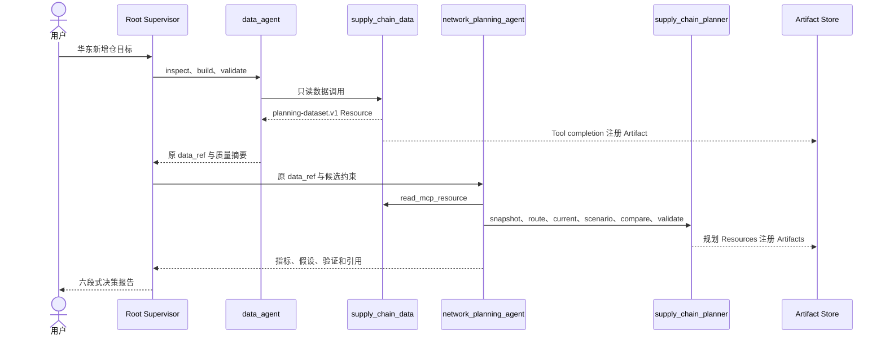

# 仓网规划：接入企业 Supervisor、治理合同与 Artifact

## 1. 本篇目标

先完成：

1. [Hello Agent 快速入门](hello-agent-quickstart.md)
2. [Hello Team 双 Agent 教程](hello-agent-team.md)

本篇不再停留在“未来怎样升级”。我们会沿当前已经验证的架构，理解并运行一个受限
但真实的企业多 Agent 闭环：

```text
用户
  ↓
绑定 enterprise-supervisor-copilot@1.0.0 的 Root Thread
  ├── data_agent Child Thread
  │     └── supply_chain_data MCP
  └── network_planning_agent Child Thread
        └── supply_chain_planner MCP
  ↓
Task-owned Artifacts
  ↓
事实、假设、分析、建议、风险、缺失证据
```

案例回答四个问题：

1. 当前仓网按实际分配关系的一日到货覆盖率是多少？
2. 不新增仓、只在现有仓网重新分配时，优化基线是多少？
3. 增加杭州或无锡仓后，覆盖率和成本怎样变化？
4. 哪个方案应成为默认建议，哪些约束会改变建议？

返回[教程总入口](../multi-agent-development-tutorial.md)。

---

## 2. 从 Hello Team 到企业场景

Hello Team 已经证明：一个 Root Thread 可以把小型结构化结果从 Writer 交给
Reviewer。但企业案例多了三类问题。

### 数据不能复制进消息

仓网输入包含需求、仓库、费率、服务政策和路线。让 Data Agent 把全部内容粘贴给
Network Agent，会造成：

- 上下文膨胀；
- 内容被截断或改写；
- 无法证明下游读取的是哪一版数据；
- 页面和日志暴露内部数据引用。

因此，Data MCP 发布不可变 Resource，Network Agent 按原 `data_ref` 读取；Tool
同时返回稳定的 `resource_name` 供报告引用，避免把内部 URI 暴露成证据名称。

### 协作规则需要版本

“先 Data、后 Network”“冲突由谁处理”“什么时候停止”“报告必须引用什么证据”
不能只靠每次用户临时写一段 Prompt。平台将这些规则发布为版本化 Supervisor
Policy，并把不可变 Snapshot 绑定到实际 Root Thread。

### 角色需要区分治理与执行

企业需要知道“允许提供哪种 Agent”，Runtime 则需要知道“怎样创建这个子 Thread”。
它们分别由：

- Agent Definition：治理记录；
- Runtime Role：Codex 可发现的执行配置；
- Child Thread：本次真正运行的 Agent。

完整映射如下：

| Hello Team | 当前仓网案例 |
| --- | --- |
| `greeting_writer` Role | `data_agent` Role |
| `greeting_reviewer` Role | `network_planning_agent` Role |
| 短 `Greeting` 消息 | `planning-dataset.v1` Resource |
| 本地根请求 | `enterprise-supervisor-copilot@1.0.0` |
| 无企业治理记录 | 两份代码发布的 Agent Definition |
| 无长期成果 | Task-owned Artifact |

这个类比只说明交接结构。Network Planning Agent 会计算候选方案，不是一个只做格式
审核的 Reviewer。

---

## 3. 当前实现的事实边界

当前分支已经真实验证：

- `enterprise-supervisor-copilot@1.0.0` 由服务端发布、生成不可变 Snapshot，并
  通过正式 `thread/start.developerInstructions` 绑定到 Root Thread；
- `enterprise-data-agent@1.0.0` 与
  `enterprise-network-planning-agent@1.0.0` 映射到精确的 `data_agent` 和
  `network_planning_agent` Runtime Role；
- Run 启动前会检查 Capability Manifest、multi-agent 开关、并发/深度限制和两个
  Role，不存在时明确失败；
- Root 按顺序创建两个真实子 Thread，子 Thread 继承 Root 的 selected capability
  roots；
- Data Agent 使用只读 `supply_chain_data` MCP，Network Agent 使用有界
  `supply_chain_planner` MCP；
- Platform 从真实 MCP Resource link 注册并物化 Task Artifact；
- 最新重跑中，浏览器恢复同一 Policy、三个 Runtime Agent、十个 ready Artifact
  和完整报告。

当前仍没有完成：

- 按 Runtime Role 动态分配不同 capability roots 或企业数据权限；
- 任意 Agent Definition Catalog、在线 Policy 编辑器或流程画布；
- Completed Agent follow-up、interrupt、审批拒绝、数据缺失和部分失败的完整
  企业 E2E；
- 可进入的子 Thread 历史和 Artifact 内容打开体验；
- Artifact 替代、失效、删除、保留与跨 Run 复用；
- 多 Profile、多用户生产隔离和共享 Workspace 并发矩阵。

因此，本篇展示的是**单 Profile、固定 Role、固定 Policy、受控 fixture 的真实
happy path**，不是通用生产平台。

---

## 4. 先获得三层证据

实现位于：

[`tools/supply-chain-network-planner`](../../tools/supply-chain-network-planner/)

### 4.1 业务与合同测试

准备环境：

```bash
tools/supply-chain-network-planner/bin/setup-env
```

运行：

```bash
.local/open-web-codex/tool-envs/supply-chain-network-planner/bin/python \
  -m pytest tools/supply-chain-network-planner/tests -q
```

当前基线：

```text
15 passed
```

这证明确定性数据处理、覆盖率、成本、比较、选址和 Resource Store 规则通过，但还
没有证明 Runtime 能发现 MCP。

### 4.2 MCP 协议测试

```bash
.local/open-web-codex/tool-envs/supply-chain-network-planner/bin/python \
  tools/supply-chain-network-planner/tests/stdio_smoke.py
```

期望：

```text
Supply-chain MCP stdio smoke passed
```

它会真实执行 initialize、tools/list 和 tools/call，并验证：

```text
supply_chain_data:
  inspect → build → validate

supply_chain_planner:
  prepare snapshot → validate
```

再验证 Skill 与 Plugin：

```bash
for skill in tools/supply-chain-network-planner/skills/*; do
  python3 \
    codex/codex-rs/skills/src/assets/samples/skill-creator/scripts/quick_validate.py \
    "$skill"
done

python3 \
  codex/codex-rs/skills/src/assets/samples/plugin-creator/scripts/validate_plugin.py \
  tools/supply-chain-network-planner
```

### 4.3 真实平台 E2E

发布级案例使用：

```bash
scripts/smoke-enterprise-supervisor-copilot.sh
```

脚本会：

1. 构建当前 Web 与 Server；
2. 创建一次性 PostgreSQL、Profile 和 managed Workspace；
3. 使用真实 Codex app-server 和 Provider；
4. 不通过 E2E 脚本预创建任何 Runtime Role；
5. 启动绑定精确 Policy 版本的 Root Thread；
6. 验证 worker 根据已发布 Definition 自动生成并安全物化两个 Runtime Role 文件，
   启动前重验摘要，再由本次 Thread 的 request config 精确引用；
7. 运行两个真实子 Agent、MCP、Artifact 和报告链；
8. 重新读取浏览器依赖的历史与证据概览；
9. 输出一份不含凭据和宿主机路径的证据文件。

它依赖本机 PostgreSQL 17、已准备的供应链 MCP 环境和可用的 Provider 登录态。运行
时间明显长于单元测试，因为模型、Runtime、两个子 Thread、数十次 MCP 调用、数据库
物化和恢复都在真实执行。

> 单元测试、stdio smoke 和真实 E2E 不是重复劳动。它们分别证明业务规则、MCP
> 协议和完整平台协作。任何一层失败，都不应由上一层的成功掩盖。

脚本也提供诊断用的开放问题观察模式：

```bash
E2E_OBSERVE_ONLY=1 \
E2E_CASE_NAME='长三角 50 单位新增仓选址' \
E2E_PROMPT='长三角的地级市中，哪个城市最适合额外建一个 50 单位产能的仓库？' \
scripts/smoke-enterprise-supervisor-copilot.sh
```

观察模式仍使用真实 Policy、Profile、Runtime 和 Provider，并保存 Agent 树、MCP
调用、Artifact、最终报告以及每条受治理 Thread 的 V2 session metadata；但它不会
要求任意问题产生固定仓网案例的十个 Artifact。它用于检查真实委派行为和证据边界，
不能代替上面的固定 9/9 发布门禁。

---

## 5. 读懂最小演示数据

打开：

[`warehouse-network-fixture.json`](../../tools/supply-chain-network-planner/examples/data-sources/warehouse-network-fixture.json)

它包含：

| 数据 | 内容 |
| --- | --- |
| 需求点 | 上海、苏州、杭州 |
| 现有仓 | 上海、南京 |
| 运输报价 | 两个现有仓及候选仓的明确费率 |
| 订单 | 六行，共 100 个需求单位 |

可以人工核对的事实：

| 指标 | 值 |
| --- | ---: |
| 总需求 | 100 |
| 上海需求 | 40 |
| 苏州需求 | 35 |
| 杭州需求 | 25 |
| 促销相关需求 | 30 |
| 有实际履约时效的数据 | 90 |
| 实际按时需求 | 55 |

为什么第一版不用生产 ERP/WMS？

- 小数据能人工核对；
- fixture 不包含姓名、电话等直接个人标识；
- 同一输入可以重复运行；
- 错误容易定位在数据、计算、Tool 或 Runtime；
- MCP 的只读与 Schema 边界可以先真实建立。

这不意味着 fixture 等于生产数据接入。当前企业案例证明的是架构链路和确定性计算，
不是生产数据质量或业务授权已经完成。

---

## 6. 先冻结内容合同，再讨论 Agent

核心合同定义在：

[`models.py`](../../tools/supply-chain-network-planner/supply_chain_planner/models.py)

主链路是：

```text
planning_source.v1
    ↓ Data MCP
planning-dataset.v1
    └── network_input.v1
            ↓ Network MCP
network_snapshot.v1
    + route_matrix.v1
            ↓
current_coverage_result.v1
network_scenario_result.v1
scenario_comparison.v1
facility_location_solution.v1（选址工作流）
```

Data 与 Network 不应分别定义：

- 什么叫需求单位；
- 规划周期和币种是什么；
- 一日达的端到端秒数怎样计算；
- 当前仓关系、设施容量和费率怎样表达；
- 路线距离和时长怎样关联；
- 覆盖率分子、分母和成本口径是什么。

每份合同至少包含：

- Schema 版本；
- 稳定业务 ID；
- 时间范围、规划周期、数量单位和币种；
- 来源时间与内容 digest；
- 行数、截断、缺失、警告和错误；
- 上游 Resource 引用。

Agent 负责决定使用哪项能力以及如何解释；类型化普通代码负责计算事实。

---

## 7. Resource 与 Artifact 怎样衔接

MCP Tool 先发布不可变 Resource，例如：

```text
supply-chain-data://resources/<opaque-id>
supply-chain://resources/<opaque-id>
```

Tool 返回：

- 人类可读摘要；
- 类型化 `structuredContent`；
- 标准 `resource_link`；
- 原样可传递的 `data_ref`；
- 用于报告引用、不能由 URI 推断的 `resource_name`。

Network Agent 使用 `read_mcp_resource` 读取 Data Agent 的同一 Resource。它不需要
从 Root 的自然语言摘要中重新拼装 Dataset。

Platform 在持久化 Tool completion 时：

1. 只接受受支持的 `resource_link` 与内容类型；
2. 以 MCP server + Resource URI 识别同一来源；
3. 创建独立 Artifact ID 与当前 Task 的 read grant；
4. 记录 Run/Thread/Turn/Item 作为 producer provenance；
5. 通过正式 MCP Resource read 物化内容；
6. 校验 JSON 语法、内容类型、大小和 immutable metadata；真实 E2E 再断言内容中的
   `schema_version` 与 Artifact Schema 一致；
7. 将状态推进为 `pending → materializing → ready`，失败则进入 `failed`；
8. 向浏览器只返回安全 Artifact DTO，不返回内部 Resource URI。

这解释了为什么同一份内容同时出现 Resource 和 Artifact：

| 生命周期 | 对象 | 责任 |
| --- | --- | --- |
| Runtime 执行 | MCP Resource | 子 Agent 按原引用读取内容 |
| 平台产品 | Artifact | 独立授权、持久内容、浏览器恢复和生产者追踪 |

Run、Thread、Turn 和 Item 只是来源。当前 fresh-schema 测试已经证明，删除生产 Run
不会级联删除 Artifact、Task grant 或 provenance identity。

---

## 8. Data Agent：只准备事实，不选择方案

Data MCP Server：

```text
supply_chain_data
```

实现：

[`data_server.py`](../../tools/supply-chain-network-planner/supply_chain_planner/data_server.py)

只暴露：

```text
inspect_planning_source
build_planning_dataset
validate_planning_dataset
```

### 为什么分成三个 Tool


- inspect：在构建前确认时间、规模、单位和阻断问题；
- build：生成唯一 `planning-dataset.v1`；
- validate：在交给 Network Agent 前检查结构和总量。

失败因此能定位在源范围、聚合或交接验证，而不是只得到一句“数据处理失败”。

### 为什么只接受 `source_id`

模型传入：

```text
warehouse-network-fixture
```

而不是任意路径、数据库密码或 SQL。Server 在部署绑定的只读目录中解析这个 ID。

真正的只读属性来自：

- MCP 没有源数据写入 Tool；
- Tool 不接受任意 SQL、凭据或本地路径；
- 输入合同拒绝额外个人字段；
- 数据根由部署或服务端绑定；
- 负向测试验证非法输入失败。

Prompt 中的“请保持只读”只是工作说明，不能代替这些边界。

### Data Role 指令

已发布 Data Agent Definition 绑定的 Role 指令是：

[`data-agent.md`](../../tools/supply-chain-network-planner/examples/runtime-roles/data-agent.md)

它要求 Data Agent 按 inspect → build → validate 工作，返回原 `data_ref`、结构化
结果中的准确 `resource_name`、来源范围、单位、统计和质量限制，并明确禁止它选择
仓库、运行规划或创建下级 Agent。

服务端编译时校验 Definition 中声明的指令摘要，并从这份唯一受评审的指令源确定性
生成 Runtime TOML。用户选择对应 Supervisor Policy 启动 Run 后，worker 才通过
Profile Host 内部边界安全物化 `data_agent` 文件；Adapter 在 Runtime 消费前重验
摘要，并仅由本次 Thread 的 request config 引用。它不调用 Agent CRUD，也不把 Role
注册到 Profile 全局 Agent Catalog，因此 E2E 验证的是
Definition → request-scoped Runtime Role → Runtime Thread 这段产品链路。

---

## 9. Network Planning Agent：在同一输入上比较方案

Network MCP Server：

```text
supply_chain_planner
```

实现：

[`server.py`](../../tools/supply-chain-network-planner/supply_chain_planner/server.py)

| 阶段 | Tool | 作用 |
| --- | --- | --- |
| 准备 | `prepare_network_snapshot` | 固化本次规划输入 |
| 路线 | `register_route_matrix` | 保存完整设施到需求点路线 |
| 当前 | `evaluate_current_coverage` | 同时计算实际关系与现有网络优化基线 |
| 场景 | `evaluate_network_scenario` | 计算指定设施组合 |
| 比较 | `compare_network_scenarios` | 计算两个同口径方案的差值 |
| 选址 | `solve_facility_location` | 在有限候选集合中求解目标覆盖率 |
| 验证 | `validate_network_resource` | 对决策引用的 Resource 做结构和一致性检查 |

### 为什么必须先读 Data Resource

Network Agent 首先读取 Data Agent 返回的同一个 `planning-dataset.v1`，并检查：

- Schema；
- 需求总量；
- 现有设施；
- 币种和规划周期；
- 服务政策；
- `network_input` 投影。

它可以在新 Snapshot 中增加明确候选仓、候选容量、成本、费率和路线，但不能静默
修改历史需求、现有仓关系、币种或服务政策。数据或假设变化时，应创建新 Resource，
而不是覆盖旧结果。

### 一日达为什么不只看导航时间

当前合同：

```text
端到端时效
  = 截单等待
  + 仓内处理
  + 导航运输
  + 末端缓冲
```

只有总时长不超过：

```text
max_delivery_seconds = 86400
```

才算一日达。只看地图导航时间会系统性高估覆盖率。

### 实际当前与优化基线为什么不同

| 结果 | 覆盖率 | 回答的问题 |
| --- | ---: | --- |
| 实际当前关系 | 75% | 记录的客户—仓关系下表现怎样，同时披露超容量 |
| 现有网络优化基线 | 70% | 不新增仓且严格满足容量时，最优可覆盖多少 |

75% 与 70% 不矛盾：实际关系记录了一项超容量分配；优化基线不能用违规容量换覆盖。

新增仓效果必须使用：

```text
优化基线 ↔ 候选方案
```

做同口径比较。不能用“实际当前 75%”直接减“杭州 95%”，再把全部差异说成新增仓
收益，因为其中混入了重新分配的影响。

### Network Role 指令

当前真实 E2E 使用：

[`network-planning-agent.md`](../../tools/supply-chain-network-planner/examples/runtime-roles/network-planning-agent.md)

它要求 Network Agent 先读取 Data Resource，再调用有界规划 Tool，验证所有用于结论
的 snapshot、route、scenario 和 comparison，并把最终企业建议留给 Root
Supervisor。

---

## 10. Policy、Definition 与 Role 各自负责什么

### Supervisor Policy

当前发布文件：

[`enterprise-supervisor-copilot-v1.md`](../../apps/web/server/resources/supervisor-policies/enterprise-supervisor-copilot-v1.md)

它规定：

- Root 负责分解、委派、冲突处理与最终综合；
- 先完成并验证 `planning-dataset.v1`，再启动 Network Agent；
- 必须使用实际存在的 Role，缺少能力时不得换默认 Agent；
- 大数据通过 Artifact/Resource 引用交接；
- 报告区分事实、假设、分析、建议、风险和缺失证据；
- Prompt 不能授予权限、批准操作、声明 Artifact durable 或标记 Run 成功。

服务端把 Policy 正文和 digest 保存为不可变 Snapshot，并绑定 Run 与实际 Root
Thread。Resume 继续使用原 Snapshot，不会因为源文件后来更新就静默改变已有会话。

### Agent Definition

当前两份发布文件：

- [`data-agent-v1.json`](../../apps/web/server/resources/agent-definitions/data-agent-v1.json)
- [`network-planning-agent-v1.json`](../../apps/web/server/resources/agent-definitions/network-planning-agent-v1.json)

Definition 记录稳定 ID、版本、职责、输入/输出 Artifact 类型、所需 Capability、
风险和 Runtime Role 引用。

它不保存：

- 本次子 Thread 的状态；
- 完整 Tool 参数；
- Runtime 对话历史；
- 企业数据授权决定。

### Runtime Role

`data_agent` 与 `network_planning_agent` 是本次受治理 Thread 获得的 Codex 执行
配置。服务端先校验发布版本，再让 Profile Host 安全准备对应指令文件；只有本次
Thread 的启动配置会引用它们。它们不会注册成整个 Profile 的全局 Agent。

三者关系是：

```text
Agent Definition
  └── 声明 runtimeRole = data_agent

Request-scoped Runtime Role
  └── 只为本次受治理 Thread 提供 data_agent 的执行指令

Runtime spawn
  └── 创建本次 Data Child Thread
```

Definition 不是 Thread，Role 也不是 Thread。只有最后一步产生运行中的 Agent。

---

## 11. 真实企业流程怎样运行

### 11.1 自动化路径

推荐先运行：

```bash
scripts/smoke-enterprise-supervisor-copilot.sh
```

脚本会通过类型化 API：

- 不预先开启 multi-agent，也不向 Profile 全局注册 Runtime Role；
- 确认已发布 Policy 与 Agent Definitions；
- 创建独立 managed Workspace、Task 和 Run；
- 将精确 Policy ID/version 交给服务端；
- 由 worker 安全准备该版本 Definition 对应的两份 Runtime Role 指令文件，
  并只通过本次 Thread 的 V2 request config 引用；E2E 不预创建 Agent；
- 只为这个新企业 Thread 启用 Codex 当前的 V2 多 Agent 协作引擎，不修改 Profile
  中其他 Thread 的选择，也不为新功能增加 V1 兼容分支；
- 等待 Root Thread 与 Policy binding；
- 发送冻结了数据源、候选方案和路线 fixture 的案例请求；
- 自动处理当前案例中的 MCP elicitation；
- 断言真实 Thread、Tool、Artifact 和报告。

### 11.2 交互式路径

若要从页面观察：

1. 运行供应链 `setup-env`；
2. 启动当前平台；
3. 在 **Settings → Agents** 开启 multi-agent；
4. 创建精确的 `data_agent` 和 `network_planning_agent`，分别使用脚手架中的 Role
   instructions；
5. 创建或选择当前仓库的授权 Workspace；
6. 在 Workspace 菜单点击 **New enterprise supervisor copilot**；
7. 确认页面显示 `enterprise-supervisor-copilot · 1.0.0` 为 bound；
8. 提交“华东新增仓”请求，并明确使用固定的
   `warehouse-network-fixture`、`network-input.json` 和
   `route-matrix-input.json`。

发布级判断仍以自动 smoke 为准，因为它冻结了完整路线行、调用顺序和断言；手工页面
演示更适合观察过程，不替代可重复证据。

### 11.3 正确顺序



Network Agent 在读取 Data Resource 之前进行计算，或者 Root 自己代替缺失 Role
完成工作，都属于失败。

---

## 12. 当前案例产生了什么

最新一次全新环境证据为 9/9：

| 证据 | 结果 |
| --- | --- |
| Profile 与 Provider | 真实 Provider、单 Profile 启动成功 |
| Runtime Role | 精确发现 `data_agent`、`network_planning_agent` |
| 治理合同 | Policy 与两份 Agent Definition 可列出 |
| Root binding | Run、Root Thread 和 Policy Snapshot 正确绑定 |
| 协作 | 一个 Root、两个真实 Child Thread |
| MCP | 33 次数据、Resource read、规划和验证调用 |
| Artifact | 十个 ready Task Artifact |
| 报告 | 六段式报告引用关键 Schema 与 Resource name |
| 恢复 | 重读同一 Turn、三个 Agent、十个 Artifact 和完整报告 |

该次十个 Artifact 是：

| 数量 | Schema | 生产者 |
| ---: | --- | --- |
| 1 | `planning-dataset.v1` | Data Agent |
| 2 | `network_snapshot.v1` | Network Planning Agent |
| 1 | `route_matrix.v1` | Network Planning Agent |
| 1 | `current_coverage_result.v1` | Network Planning Agent |
| 3 | `network_scenario_result.v1` | Network Planning Agent |
| 2 | `scenario_comparison.v1` | Network Planning Agent |

该次比较流程没有调用 `solve_facility_location`，因此没有
`facility_location_solution.v1`。Definition 仍声明这个可选输出，因为同一
Network Role 的目标覆盖率工作流会产生它。

调用次数与 Artifact 精确数量不是架构合同。稳定 happy-path 门禁要求至少存在：

- 一份 Dataset、Snapshot、Route Matrix 和 Current Coverage；
- 两份候选 Scenario Result；
- 两份同口径 Scenario Comparison；
- 所有已注册 Artifact 均为 `ready`。

Network Agent 可以为了明确基线或额外验证产生更多同 Schema Artifact，只要没有
重复身份、越权读取或未经引用的错误结论。自动 E2E 按这个最小集合断言，不把某一次
模型轨迹的精确数量固化为产品行为。

确定性业务结果为：

| 方案 | 覆盖率 | 建模总成本 | 解释 |
| --- | ---: | ---: | --- |
| 实际当前关系 | 75% | CNY 1,038.00 | 含超容量分配，只作为运营现状 |
| 现有网络优化基线 | 70% | CNY 895.10 | 严格容量约束下的不新增仓基线 |
| 增加杭州 | 95% | CNY 1,067.10 | 当前默认建议 |
| 增加无锡 | 100% | CNY 1,540.18 | 只有 100% 覆盖是硬约束时更合理 |

杭州成为默认建议，不是因为模型“偏好杭州”，而是因为同口径比较显示它已越过 90%
目标，成本明显低于无锡方案。若业务把 100% 覆盖设为不可妥协的硬约束，建议会变。

---

## 13. 浏览器展示为什么只是投影

页面展示：

- bound Policy 名称与版本；
- Root Supervisor；
- 两个子 Agent 的 Role 与当前可观察状态；
- Artifact Schema、生产者、大小和状态；
- Root 的完整最终报告。

这些状态来自真实 Runtime 事件和平台持久事实：

```text
Codex Thread / collab events
    ↓ 安全归一化
Runtime Agent projection
    ↓
Browser DTO
```

平台投影可以重放重建，但不能反过来驱动 Codex。数据库中插入一条
“Network Agent running”记录不会创建 Thread、继承上下文、获得 Role、调用 Tool
或拥有恢复能力。

同样，浏览器不会接收：

- raw JSON-RPC；
- app-server request ID；
- Profile 或 Workspace 本地路径；
- 内部 MCP Resource URI；
- Secret；
- 不受限 Runtime payload。

当前子 Agent 行还不能直接进入各自的权威历史，Artifact 卡片也缺少完整内容打开和
生命周期操作；这属于后续产品体验，不通过复制 Thread 或 Resource 数据来填补。

---

## 14. 为什么两个领域能力仍在一个 Plugin

当前目录：

```text
tools/supply-chain-network-planner/
├── supply_chain_planner/data_server.py
├── supply_chain_planner/server.py
├── supply_chain_planner/models.py
├── examples/runtime-roles/
├── skills/
└── .mcp.json
```

两个 MCP Server 是明确职责边界：

| 边界 | Data | Network Planning |
| --- | --- | --- |
| MCP Server | `supply_chain_data` | `supply_chain_planner` |
| Skill | 数据准备 | 基准、场景、优化、验证 |
| Resource scheme | `supply-chain-data://` | `supply-chain://` |
| Runtime Role | `data_agent` | `network_planning_agent` |
| Child Thread | Data Agent | Network Planning Agent |

它们仍在一个 Plugin，因为：

1. 共享 `planning-dataset.v1` 与 `network_input.v1` 合同；
2. 使用同一 Python 依赖；
3. 由同一领域包一起测试和发布；
4. 当前子 Thread 会继承同一 capability root；
5. 拆目录本身不会形成企业授权。

真正的数据边界来自只读 Data MCP、有界规划 Tool、部署绑定的数据根、Task/Profile
范围和平台 Artifact 授权。Role Prompt 和 MCP Server 名称都不能单独成为权限依据。

只有团队、依赖、部署、发布周期或正式授权确实独立时，才应拆成多个 Plugin。

---

## 15. 如何扩展这个案例

第一次修改不要接生产数据库，也不要先增加第三个 Agent。

建议增加一条数据质量规则：

> 没有实际履约时效的需求超过总需求 20% 时，必须产生警告。

顺序：

1. 在 `test_data_core.py` 增加失败测试；
2. 构造未观察需求超过 20% 的内存数据；
3. 断言出现明确 warning；
4. 在 `data_core.py` 实现唯一规则；
5. 运行供应链单元测试；
6. 运行 stdio smoke，确认 Schema 和 Tool 交接未破坏；
7. 检查 `planning-dataset.v1` 总量仍然对账；
8. 检查 Data Skill 与 Role 会报告 warning；
9. 若 warning 会改变 Supervisor 的停止条件，再发布新的 Policy 版本并更新 E2E。

这个顺序能看出不同层的责任：

| 变化 | 应修改 |
| --- | --- |
| 质量事实怎样计算 | 普通 Python 与单元测试 |
| Tool 返回哪些稳定字段 | MCP Schema |
| Agent 怎样报告 warning | Skill / Runtime Role |
| warning 是否阻止最终建议 | Supervisor Policy |
| 结果怎样长期保存 | Artifact Schema/lifecycle |

不要把同一条 `20%` 规则复制到五层。

---

## 16. 当前最重要的失败场景

| 场景 | 正确行为 | 当前证据 |
| --- | --- | --- |
| Definition 对应 Role 文件物化或校验失败 | Root Thread 创建前失败，不换默认 Role | 已有定向测试 |
| 普通 Thread 启动 | 不获得企业 Role、Policy 指令或 V2 request override | 已有定向测试 |
| Data 字段缺失 | 保留缺口，限制结论或追问 | 待真实企业 E2E |
| 两个 Agent 结论冲突 | 保存两份依据，继续最小调查或说明取舍 | 待真实企业 E2E |
| 高成本操作被拒绝 | 保留已完成 Artifact，给出部分结果 | 审批链已有，拒绝综合待 E2E |
| Network Agent 失败 | 复用 Data Artifact，明确哪些比较未完成 | 待真实企业 E2E |
| Completed Agent 收到补充问题 | 复用同一子 Thread 产生新 Turn | 待真实企业 E2E |
| 页面刷新/服务重启 | 恢复同一树，不重复 Artifact | happy path 已验证 |
| 猜测其他组织 Artifact ID | 返回不可枚举拒绝 | fresh-schema 测试已验证 |

这张表解释了为什么“9/9 happy path 通过”还不等于 M2 完成。下一步应继续扩大同一
纵向案例的失败、继续和恢复证据，而不是另起一套编排器或 Blackboard。

---

## 17. 故障对照表

| 现象 | 优先检查 |
| --- | --- |
| Data 总量不一致 | fixture、聚合和 `network_input` |
| 覆盖率不符合预期 | 服务政策、路线、容量和当前分配关系 |
| 新 Thread 缺少 Tool | selected capability root、Plugin 与 `.mcp.json` |
| Role 不可发现 | Profile Agent 设置、精确名称和 multi-agent 开关 |
| Enterprise Run 启动失败 | Capability Manifest、Role、并发/深度和 Policy version |
| Network 未读取 Data Resource | Root 是否原样传 `data_ref`、Role 是否先调用 Resource read |
| 地图调用失败 | `map_utils` Provider 和配置 |
| 选址 infeasible | 候选容量、完整路线和目标比例 |
| Agent 编造结果 | Skill/Role 失败规则、Runtime MCP 状态 |
| Agent 树重复或状态错误 | Runtime 事件投影、重放和 root/child 关联 |
| Artifact 长期 `materializing` | MCP Resource read、内容类型、大小和恢复任务 |
| 浏览器出现内部 URI/路径 | 事件归一化与 Artifact DTO 脱敏 |

---

## 18. 完成检查表

### 业务与能力包

- [ ] Data MCP 只接受有界 `source_id`，不接受任意 SQL、凭据或路径；
- [ ] Dataset 总量、单位、时间和质量信息可对账；
- [ ] 一日达使用完整端到端时效；
- [ ] 实际当前与现有网络优化基线分开；
- [ ] 候选方案使用同一 Snapshot、Route Matrix、币种和规划周期；
- [ ] 单元测试、stdio smoke、Skill 与 Plugin 校验通过。

### Runtime 与治理

- [ ] Profile 中存在精确的 `data_agent` 与 `network_planning_agent`；
- [ ] Run 绑定 `enterprise-supervisor-copilot@1.0.0`；
- [ ] 两份 Agent Definition 映射到真实 spawn 使用的 Role；
- [ ] Root 创建两个拥有独立 Thread ID 的子 Agent；
- [ ] Network 在计算前读取 Data Agent 返回的同一 Resource；
- [ ] Role 缺失或 Tool 失败时明确失败，不改用默认 Role 或模型答案兜底。

### Artifact 与报告

- [ ] Artifact 拥有独立 ID、Task grant、状态和 producer provenance；
- [ ] 浏览器 DTO 不包含内部 Resource URI 或宿主机路径；
- [ ] 必需的八个最小 happy-path Artifact 均存在，且所有已注册 Artifact 进入
  `ready`；
- [ ] 最终报告包含事实、假设、分析、建议、风险和缺失证据；
- [ ] 每个关键数字引用对应 Schema 与 Resource name；
- [ ] 刷新与重启后恢复同一 Policy、Agent、Artifact 和报告。

### 能力声明

- [ ] 能说明当前已完成的是单 Profile 受限 happy path；
- [ ] 不把 Role instructions 描述成企业权限；
- [ ] 不把 Runtime 投影描述成第二套 Agent 状态机；
- [ ] 不把 Resource 与 Artifact 混为同一个所有者；
- [ ] 不把尚未完成的失败矩阵、Artifact 生命周期或多用户能力写成现状。
