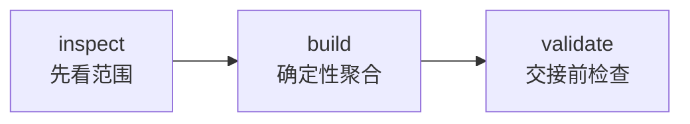
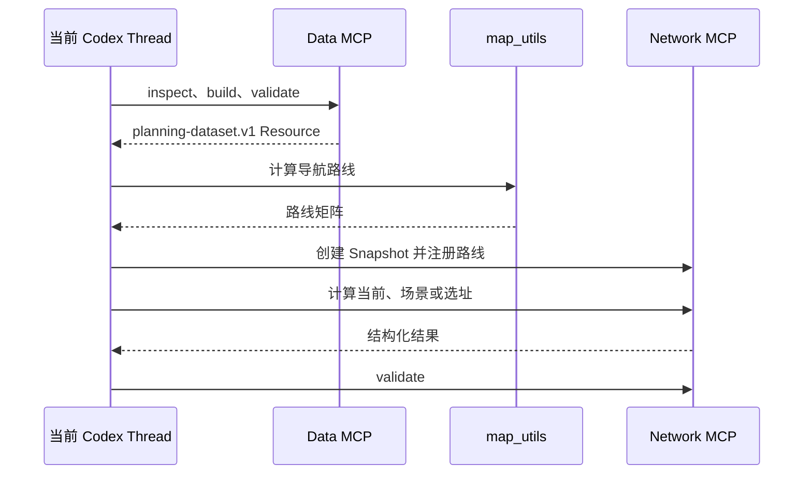

# 仓网规划：从领域能力走向真实多 Agent

## 1. 本篇目标

先完成：

1. [Hello Agent 快速入门](hello-agent-quickstart.md)
2. [Hello Team 双 Agent 教程](hello-agent-team.md)

本篇使用相同结构回答三个供应链问题：

1. 当前仓网的一日到货覆盖率是多少？
2. 如果在杭州增加仓库，时效和成本变化多少？
3. 如果一日覆盖率目标为 90%，至少增加几个仓？

返回[教程总入口](../multi-agent-development-tutorial.md)。

---

## 2. 从 Hello Team 映射到仓网规划

| Hello Team | 仓网规划 |
| --- | --- |
| Writer | Data Agent |
| Reviewer | Network Planning Agent |
| `Greeting` | `planning-dataset.v1` |
| `say_hello` | 数据检查、聚合和验证 |
| `review_greeting` | 覆盖率、场景和选址 |
| 两个短字段 | 需求、仓库、费率、时效和路线 |
| 普通消息 | MCP Resource，未来使用 Artifact |

这个表只类比“上游产生结构化交接物、下游消费并判断”的形状，不表示 Reviewer 和
Network Planning 的业务职责相同。仓网规划能力会计算新方案，而 Hello Reviewer
只检查、不改写。

两个专业职责：

- Data Agent：读取授权只读数据，整理需求、现有仓库、运输费率和历史履约；
- Network Planning Agent：读取同一份规划数据，加入路线和候选仓，计算覆盖率、成本
  与选址方案。

为什么不让一个 Agent 全做？

因为数据事实与规划决策有不同生命周期：

- 数据源变化时，不应修改选址算法；
- 算法变化时，不应重新解释原始订单；
- Data 结果应该可以被多个规划方案复用；
- 任何规划结论都应追溯到同一版 Dataset。

---

## 3. 当前阶段说明

当前已经实现：

- Data 与 Network Planning 两组确定性能力；
- 两个独立 MCP Server；
- 五个供应链 Skill；
- 版本化 MCP Resource；
- 覆盖率、场景比较和有限候选点精确求解；
- 两个代码托管的企业 Agent Definition 治理清单；
- 单元测试与 MCP 启动链。

当前仍未全部完成：

- Definition 对应 Runtime Role 的真实发现、能力选择与 spawn provenance 闭环；
- 两个真实子 Thread 的 Web 端到端验收；
- Dataset 与 Simulation 的持久 Artifact 交接。

所以当前短期方案是：

```text
一个供应链 Plugin
  + Data MCP
  + Network Planning MCP
  + 五个 Skill
  + 单 Thread 完整能力链
  + 后续接入真实子 Agent 与 Artifact
```

未来平台能力补齐后，创建 Agent 和连接交接物会更直接。当前 Tool、数据合同和算法
不需要推倒重写。

---

## 4. 先运行现有代码

实现位于：

[`tools/supply-chain-network-planner`](../../tools/supply-chain-network-planner/)

准备环境：

```bash
tools/supply-chain-network-planner/bin/setup-env
```

运行测试：

```bash
.local/open-web-codex/tool-envs/supply-chain-network-planner/bin/python \
  -m pytest tools/supply-chain-network-planner/tests -q
```

期望：

```text
15 passed
```

运行两个真实 MCP Server 的 stdio smoke：

```bash
.local/open-web-codex/tool-envs/supply-chain-network-planner/bin/python \
  tools/supply-chain-network-planner/tests/stdio_smoke.py
```

期望：

```text
Supply-chain MCP stdio smoke passed
```

它会真实完成 initialize、tools/list 和 tools/call，并分别验证 Data MCP 的
inspect → build → validate，以及 Network MCP 的 Snapshot 创建与验证。

验证五个 Skill：

```bash
for skill in tools/supply-chain-network-planner/skills/*; do
  python3 \
    codex/codex-rs/skills/src/assets/samples/skill-creator/scripts/quick_validate.py \
    "$skill"
done
```

验证 Plugin：

```bash
python3 \
  codex/codex-rs/skills/src/assets/samples/plugin-creator/scripts/validate_plugin.py \
  tools/supply-chain-network-planner
```

业务测试失败时，不要先增加子 Agent。多 Agent 只会让调用链更长，不会修复底层计算。

---

## 5. 读懂最小演示数据

打开：

[`warehouse-network-fixture.json`](../../tools/supply-chain-network-planner/examples/data-sources/warehouse-network-fixture.json)

包含：

| 数据 | 内容 |
| --- | --- |
| 需求点 | 上海、苏州、杭州 |
| 现有仓 | 上海、南京 |
| 运输报价 | 两个仓的默认费率 |
| 订单 | 六行，共 100 个需求单位 |

已知结果：

| 指标 | 值 |
| --- | ---: |
| 总需求 | 100 |
| 上海需求 | 40 |
| 苏州需求 | 35 |
| 杭州需求 | 25 |
| 促销相关需求 | 30 |
| 有实际履约时效的数据 | 90 |
| 实际按时需求 | 55 |

为什么先用小 fixture？

- 可以人工核对；
- 不包含姓名、电话等 PII；
- 同一输入可以重复；
- 错误容易定位在数据、计算或调用边界。

不要从百万行生产订单开始第一次 Agent 开发。

---

## 6. 先冻结双方共享的数据合同

合同链：

```text
planning_source.v1
    ↓ Data MCP
planning-dataset.v1
    └── network_input
            ↓ Network MCP
network_snapshot.v1
    + route_matrix.v1
            ↓
network_scenario_result.v1
scenario_comparison.v1
facility_location_solution.v1
```

类型集中在：

[`models.py`](../../tools/supply-chain-network-planner/supply_chain_planner/models.py)

与 Hello Team 的共享 `core.py` 一样，Data 和 Network Planning 不应分别定义：

- 什么叫需求单位；
- 一日达的秒数；
- 当前仓关系；
- 费率字段；
- 路线距离和时长；
- 结果覆盖率。

每份合同至少说明：

- Schema 版本；
- 稳定业务 ID；
- 时间范围和规划周期；
- 数量单位与币种；
- 数据行数和是否截断；
- 来源时间和内容 digest；
- 缺失、警告和错误；
- 上游 Resource 或 Artifact 引用。

---

## 7. Data Agent 能力

Data MCP：

```text
supply_chain_data
```

实现：

[`data_server.py`](../../tools/supply-chain-network-planner/supply_chain_planner/data_server.py)

只暴露：

```text
inspect_planning_source
build_planning_dataset
validate_planning_dataset
```

### 7.1 为什么分成三个 Tool



- inspect：在读取完整内容前确认数据范围、时间和规模；
- build：生成唯一 `planning-dataset.v1`；
- validate：在交给规划能力前检查总量和字段一致性。

分步后，失败可以定位在数据范围、构建或交接验证。

### 7.2 为什么只接受 `source_id`

模型传入：

```text
warehouse-network-fixture
```

而不是任意本地路径、数据库密码或 SQL。服务端在部署绑定的只读目录中解析 ID。

真正只读来自：

- 没有写入 Tool；
- 不接受任意文件路径；
- 不接受凭据和任意 SQL；
- 输入合同拒绝额外 PII；
- 负向测试证明违规输入失败。

Prompt 中写“请保持只读”不是安全边界。

### 7.3 为什么聚合写成普通 Python

聚合逻辑：

[`data_core.py`](../../tools/supply-chain-network-planner/supply_chain_planner/data_core.py)

确定性计算：

- 各需求点需求量；
- 订单行数；
- 促销需求量和占比；
- 已观察与未观察履约量；
- 历史一日达比例；
- 数据质量问题；
- Network Planning 所需 `network_input`。

Agent 负责决定何时需要这些数据，普通代码负责可重复计算。

### 7.4 Data Skill

[`prepare-planning-dataset/SKILL.md`](../../tools/supply-chain-network-planner/skills/prepare-planning-dataset/SKILL.md)

Skill 只规定：

1. 先 inspect；
2. 再 build；
3. 最后 validate；
4. 哪些质量问题必须停止；
5. 交付哪些摘要和引用。

Skill 不保存数据库密码，也不重新实现聚合公式。

---

## 8. Network Planning Agent 能力

Network MCP：

```text
supply_chain_planner
```

实现：

[`server.py`](../../tools/supply-chain-network-planner/supply_chain_planner/server.py)

Tool 分组：

| 阶段 | Tool | 作用 |
| --- | --- | --- |
| 准备 | `prepare_network_snapshot` | 固化本次规划数据 |
| 路线 | `register_route_matrix` | 保存完整仓到需求点路线 |
| 当前 | `evaluate_current_coverage` | 计算当前关系覆盖率 |
| 场景 | `evaluate_network_scenario` | 计算指定设施组合 |
| 比较 | `compare_network_scenarios` | 计算两个兼容场景差值 |
| 选址 | `solve_facility_location` | 求解目标覆盖率 |
| 验证 | `validate_network_resource` | 对外发布前检查 |

### 8.1 为什么不重新读取订单

Network Planning 从 Data 产生的同一 `planning-dataset.v1` 中读取
`network_input`。

它可以增加：

- 候选设施；
- 候选设施容量；
- 固定成本和处理成本；
- 候选设施费率；
- 候选设施路线。

它不能静默修改：

- 历史需求；
- 当前仓关系；
- 规划周期；
- 币种；
- 服务政策。

数据变化时创建新的 Dataset 和 Snapshot。

### 8.2 为什么路线继续使用 `map_utils`

地址转坐标和导航路线已有明确能力所有者：

```text
地址
  ↓ map_utils.batch_geocode
坐标
  ↓ map_utils.distance_matrix
距离和导航时长
  ↓ supply_chain_planner.register_route_matrix
```

Network Planner 不重复保存地图 Key，不重新实现 Provider、计费、超时和导航语义。

### 8.3 一日达为什么不只看导航时长

当前合同：

```text
端到端时效
  = 截单等待
  + 仓内处理
  + 导航运输
  + 末端缓冲
```

只有总时长不超过：

```text
max_delivery_seconds = 86400
```

才算一日达。

只看地图导航时间会系统性高估覆盖率。

### 8.4 两种“当前覆盖率”

| 结果 | 覆盖率 | 回答的问题 |
| --- | ---: | --- |
| 保持当前仓库分配关系 | 75% | 当前关系下时效怎样，同时报告超容量 |
| 不新增仓但严格满足容量 | 70% | 现有仓网在约束下理论最优多少 |
| 增加杭州候选仓 | 95% | 指定新增仓场景怎样 |

75% 与 70% 不矛盾。第一项允许报告当前超容量事实，第二项要求重新分配后严格满足
容量。

### 8.5 90% 目标怎样求解

当前求解器：

1. 保留现有仓开启；
2. 枚举输入的有限候选仓组合；
3. 先找达到目标的最少新增仓数量；
4. 同样数量时选择建模总成本更低的方案；
5. 最多支持 14 个候选点。

演示结果：

```text
选择 candidate-hangzhou
新增 1 个仓
覆盖率达到 95%
```

它只保证给定候选点集合内的精确解，不能声称在地图任意位置找到全球最优仓网。

---

## 9. 五个 Skill 为什么不是五个 Agent

| Skill | 工作流 |
| --- | --- |
| `prepare-planning-dataset` | 准备 Data 交接物 |
| `prepare-network-baseline` | 创建快照和路线 |
| `evaluate-network-scenario` | 评估当前或新增仓 |
| `optimize-network-to-target` | 求解目标覆盖率 |
| `validate-network-result` | 发布前验证 |

一个 Network Planning Agent 可以掌握多种工作方法：

```text
Agent = 执行工作的角色
Skill = 这个角色掌握的一套操作流程
```

五个 Skill 不代表五个独立 Agent。

---

## 10. 为什么两个仓网能力放在一个目录

```text
tools/supply-chain-network-planner/
├── supply_chain_planner/data_server.py
├── supply_chain_planner/server.py
├── supply_chain_planner/models.py
├── skills/
└── .mcp.json
```

这与 Hello Team 相同：

```text
Plugin 目录 = 能力发布边界
Runtime Thread = Agent 执行身份
```

当前共目录的原因：

1. 共享 `planning-dataset.v1`、`NetworkInput` 和服务政策；
2. 使用同一 Python 依赖；
3. 由同一领域包一起测试和发布；
4. 当前还没有完整按 Agent 动态选择 capability root；
5. 提前拆目录不会自动形成权限隔离。

逻辑边界仍然分开：

| 边界 | Data | Network Planning |
| --- | --- | --- |
| MCP Server | `supply_chain_data` | `supply_chain_planner` |
| Skill | 数据准备 | 基准、场景、优化、验证 |
| Resource URI | `supply-chain-data://...` | `supply-chain://...` |
| 未来 Runtime Role | Data Role | Network Role |
| 未来子 Thread | Data Agent | Network Planning Agent |

两个 MCP Server 是职责边界，不自动等于权限边界。真正权限来自只读连接、Tool
集合、服务端资源绑定和平台授权。

未来平台能直接按 Agent 发布和选择能力后，开发体验会更符合直觉。当前合同和 Tool
仍可复用。

只有出现独立团队、依赖、发布、部署或授权需求时，才拆成多个 Plugin。

---

## 11. 先跑通单 Thread 业务链



这一阶段验证：

- 两个 MCP Schema 能衔接；
- Data Source 保持只读；
- Dataset 总量能对账；
- 路线完整；
- 覆盖率和成本可重复；
- 缺字段、缺路线和不可达明确失败；
- Tool 失败时 Agent 不编造结果。

业务链稳定前不要引入子 Agent，否则难以区分数据、Tool、Skill、消息和 Runtime
生命周期错误。

---

## 12. 从 Resource 演进到 Artifact

当前 Data Tool 发布：

```text
supply-chain-data://resources/<opaque-id>
```

Resource 让后续步骤读取同一份 Dataset，而不是在消息中复制订单。

真正跨 Agent 的目标：

```text
Data Agent
  ↓
planning-dataset.v1 Artifact
  ↓ 同 Task 授权读取
Network Planning Agent
  ↓
network-simulation.v1 Artifact
  ↓
Supervisor 最终报告
```

Artifact 应拥有：

- 独立 ID；
- Schema 和版本；
- 生产者与 provenance；
- Task 级读取授权；
- 保留、替代和删除生命周期。

Run、Thread、Turn 和 Item 只是来源，不应拥有 Artifact 的长期身份。

当前 Resource 是短期业务交接方式，不等于持久 Artifact。

---

## 13. 升级为两个真实仓网 Agent

目标：

```text
Root Supervisor Thread
├── Data Agent Thread
└── Network Planning Agent Thread
```

需要逐步完成：

1. 复用已代码发布的 Data 与 Network Agent Definition；
2. 让 Codex Profile 真实发现两个 Runtime Role；
3. Definition 与 Role 不匹配时明确失败；
4. Supervisor 使用 Codex 原生协作 Tool 创建子 Thread；
5. 平台只投影真实 Runtime 事件；
6. Data 通过 Artifact 交给 Network；
7. 覆盖完成、失败、拒绝、取消、中断和恢复。

只有真实子 Thread 存在，才能称为两个 Agent。平台数据库不能插入模拟
“Data Agent running”记录替代 Runtime。

当前完整 trajectory 仍为 experimental，这一节是后续 M2 验收目标。

---

## 14. 推荐开发顺序

### 阶段 1：合同和 fixture

- 固定业务问题；
- 定义单位、币种和一日达；
- 准备可人工核对的数据；
- 建立已知结果。

退出条件：同一输入重复产生相同指标。

### 阶段 2：Data Tool

- 只读输入；
- inspect、build、validate；
- 总量对账；
- 质量错误阻止决策就绪。

退出条件：稳定产生 `planning-dataset.v1`。

### 阶段 3：Network Tool

- Snapshot；
- 完整路线；
- 覆盖率与成本；
- 场景和有限候选点选址。

退出条件：基准、场景和不可行目标都可重复验证。

### 阶段 4：单 Thread Skill 编排

- 自然语言触发正确 Skill；
- Tool 失败不编造；
- 完整链无需人工指定每个 Tool。

退出条件：业务链稳定。

### 阶段 5：真实子 Agent

- 两个 Role；
- 两个 Definition；
- 真实父子 Thread；
- 正确终态和恢复。

退出条件：app-server 真实轨迹通过。

### 阶段 6：Artifact

- 独立 Artifact ID；
- 同 Task 授权读取；
- 其他 Task 拒绝；
- 大内容不进入消息。

退出条件：Network 在另一个 Thread 读取同一 Data Artifact。

---

## 15. 第一次修改建议

不要把第一次修改设为生产数据库接入。

建议增加一个数据质量规则：

> 没有实际履约时效的需求超过总需求 20% 时，必须产生警告。

顺序：

1. 先在 `test_data_core.py` 增加失败测试；
2. 构造未观察需求超过 20% 的内存数据；
3. 断言出现明确 warning；
4. 在 `data_core.py` 实现；
5. 运行 Data 测试和全部供应链测试；
6. 检查 Dataset 总量仍然对账；
7. 确认 Skill 会报告 warning。

这个练习可以学习：

- Tool 计算事实；
- Skill 规定怎样报告事实；
- 测试保护合同；
- 不需要生产权限。

---

## 16. 故障对照表

| 现象 | 优先检查 |
| --- | --- |
| Data 总量不一致 | fixture、聚合和 `network_input` |
| 覆盖率不符合预期 | 服务政策、路线、容量和当前关系 |
| 缺少 Tool | Plugin 发现和 `.mcp.json` |
| 新 Thread 看不到 Skill | 是否在能力变更后新建 Thread |
| 地图调用失败 | `map_utils` Provider 和配置 |
| 选址 infeasible | 候选容量、路线和目标比例 |
| Agent 编造结果 | Skill 失败规则和 MCP 状态 |
| 两个 Agent 状态重复 | Runtime 事件投影和恢复 |
| 跨 Task 可读取结果 | Artifact 授权边界 |

---

## 17. 完成检查表

下面分成两个阶段。不要因为长期项尚未完成，就误判当前 Tool 实现失败。

### 当前短期方案

#### Data

- [ ] 只读 Tool；
- [ ] 不接受任意 SQL、密码或本地路径；
- [ ] Dataset 总量可对账；
- [ ] 同一输入身份稳定；
- [ ] 质量问题明确报告。

#### Network Planning

- [ ] 使用同一 Dataset；
- [ ] 路线有来源；
- [ ] 一日达使用端到端时效；
- [ ] 实际覆盖和优化覆盖分开；
- [ ] 成本使用同一币种和周期；
- [ ] 算法声明候选范围和假设。

#### 验证

- [ ] 15 项供应链测试通过；
- [ ] 两个 MCP Server 的真实 stdio smoke 通过；
- [ ] 五个 Skill 通过校验；
- [ ] Plugin 通过校验；
- [ ] 平台可以列出两份代码托管的 Agent Definition；
- [ ] 新 Thread 发现两个 MCP Server 和五个 Skill；
- [ ] 单 Thread 可完成 Data → 路线 → Network 的业务链；
- [ ] Tool 失败时不编造结果。

### 长期多 Agent 升级

- [ ] 两个 Runtime Role 可发现；
- [ ] 两个 Agent Definition 与真实 Runtime Role 正确绑定；
- [ ] Supervisor 创建真实子 Thread；
- [ ] Dataset 通过授权 Artifact 交接；
- [ ] 失败、取消和恢复有明确终态；
- [ ] 浏览器状态来自真实 Runtime 事件。

#### 目标验收

- [ ] 只读和跨 Task 负向测试通过；
- [ ] 真实 app-server 多 Agent 轨迹通过。
