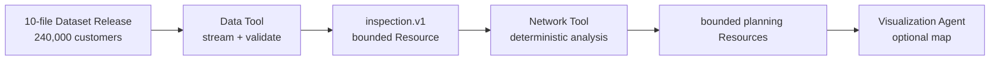

# 印尼全国仓网规划：四篇渐进式教程

这组教程把一个现实但复杂的仓网问题拆成四次可以独立验证的交付。第一篇只确认数据，
第二篇只分析当前末端时效，第三篇加入两级仓网和成本，第四篇才做有限候选选址与地图。

返回[教程标准与学习路径](README.md)。

## 业务背景

我们服务覆盖印度尼西亚全国的客户。教程使用 240,000 个合成客户点，它们分布在当前
38 个省级行政区内，需求规模参考人口但不与人口机械成正比。人口和业务量很小的
Kalimantan Utara、Papua Barat 和 Papua Selatan 在本版本中没有需求。

现有网络包括：

- 3 个中心仓：Bekasi、Sidoarjo、Makassar；
- 8 个前置仓：Medan、Palembang、Semarang、Denpasar、Banjarmasin、Balikpapan、
  Manado、Jayapura；
- 240,000 条客户与前置仓的当前对应关系；
- 20 个经过评审的新前置仓候选点；
- 中心仓到前置仓的干线关系；
- 当前仓和候选仓到 38 个省份的完整运输报价；
- 仓库容量、候选开仓费用和年度固定费用。

当前对应关系不是纯粹的最近仓分配：82% 客户分配给最近前置仓，13% 保留在第二近仓，
5% 保留历史分配。因此网络有真实的优化空间，但不会被故意构造成完全错误。

## 统一计算口径

教程不用导航接口。客户与仓库之间采用：

```text
估算道路距离 = 球面距离 × 1.25
估算行驶小时 = 估算道路距离 ÷ 45 km/h
服务天数 = 向上取整(估算行驶小时 ÷ 6 小时/天)，最少 1 天
```

每天只按 6 小时驾驶，是为了给用餐、休息和避免疲劳驾驶保留时间。这里的“服务天数”
从有货的前置仓开始计算；中心仓到前置仓属于补货干线，不直接加入客户承诺时效。

这是一套规划近似，不是导航承诺。它适合用来筛选大规模候选和比较方向，不适合承诺
某辆车在某天的准确到达时间。

## 数据来源与合成方法

行政边界的主来源是 World Bank Official Boundaries 的 Indonesia ADM1 图层，许可为
CC BY 4.0。数据生成时还使用 geoBoundaries Indonesia ADM1 和印度尼西亚农业部的
38 省边界服务做独立核对。省级人口权重来自 BPS《Statistical Yearbook of Indonesia
2025》表 3.1.1。

来源与锁定哈希记录在：

- [`source-lock.json`](../../tools/supply-chain-network-planner/examples/indonesia-tutorial/source-lock.json)
- [`generation-policy.json`](../../tools/supply-chain-network-planner/examples/indonesia-tutorial/generation-policy.json)
- [`validation-report.json`](../../tools/supply-chain-network-planner/examples/indonesia-tutorial/releases/1.0.0/validation-report.json)

原始来源：

- [World Bank Official Boundaries](https://datacatalog.worldbank.org/search/dataset/0038272/world-bank-official-boundaries)
- [World Bank ADM1 ArcGIS layer](https://services.arcgis.com/iQ1dY19aHwbSDYIF/arcgis/rest/services/World_Bank_Global_Administrative_Divisions/FeatureServer/2)
- [geoBoundaries API](https://www.geoboundaries.org/api.html)
- [Indonesia Ministry of Agriculture province boundaries](https://geoportal.pertanian.go.id/arcgis/rest/services/Hosted/Batas_Administrasi_Provinsi/FeatureServer/0)
- [BPS Statistical Yearbook of Indonesia 2025](https://www.bps.go.id/en/publication/2025/02/28/8cfe1a589ad3693396d3db9f/statistik-indonesia-2025.html)

所有客户、需求、仓库容量、报价和费用都是确定性生成的教程数据，不是观察到的商业
事实。报价总体随距离增加，并加入受限的线路和噪声系数；它们只用于检验链路与方法。

## 为什么不把 240,000 个客户放进模型上下文

模型不需要逐行看到客户。Data Tool 在进程内流式读取和校验所有行，只发布一个有界的
`indonesia_dataset_inspection.v1`。Network Tool 再通过精确 Resource 引用读取相同
Release，完成确定性计算，并只返回省份、仓库、成本和候选摘要。



这避免三类问题：

1. 原始数据占满上下文；
2. 多个 Agent 复制不同版本的数据；
3. 模型用自然语言重算大规模指标。

## 四篇怎样增加复杂度

| 教程 | 使用的数据口径 | Agent | Tool 结果 |
| --- | --- | --- | --- |
| [1. 发布并核验数据](indonesia-network-01-data.md) | 全部文件，只做完整性和质量检查 | Data | `indonesia_dataset_inspection.v1` |
| [2. 单层时效基线](indonesia-network-02-service-baseline.md) | 当前客户到前置仓，只看末端时效 | Data + Network | `indonesia_service_baseline.v1` |
| [3. 两级成本与指定方案](indonesia-network-03-two-level-cost.md) | 加入中心仓、干线、报价、容量和开仓费用 | Data + Network | current + candidate Resources |
| [4. 优化与地图](indonesia-network-04-optimization-map.md) | 完整 20 候选集和有界地图数据 | Data + Network + Visualization | optimization + scenario + map |

Supervisor 在第 2 篇出现，但不会写死“先 Data、再 Network”。它只知道有哪些 Agent、
哪些 Artifact 可以交接以及最终需要什么证据。具体是否创建某个 Agent、是否复用已有
Artifact、是否追加一次分析，由 Runtime 根据当前问题和证据决定。

## 何时才应该接导航服务

如果真实业务需要道路限制、轮渡、交通状态或可承诺 ETA，应接入导航或路线矩阵 MCP，
但不要对 240,000 个客户在每次分析时实时请求。

合理的生产链路是：

1. 先用球面距离乘系数做大规模粗筛；
2. 只对入围仓库、代表点或稳定线路计算导航距离；
3. 以起点、终点、车辆/道路配置、Provider 和算法版本作为缓存键；
4. 记录生成时间、失效规则、失败和不可达状态；
5. 批量限流，并让缺失路线产生显式不完整结果；
6. 在关键候选和上线前抽样复核。

缓存是导航结果的可重建投影，不能在 Provider 失败时伪造路线，也不能把过期值默认为
最新事实。

下一篇：

[印尼仓网 1：发布并核验大型规划数据](indonesia-network-01-data.md)
