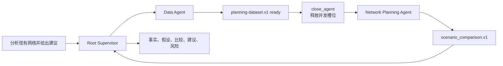

# 仓网建议：在 Web 创建并运行多 Agent Supervisor

本篇从 Web 发布两个 Agent 和一个 Supervisor，再用真实 Runtime 完成：

```text
Data Agent -> planning-dataset.v1 -> Network Agent -> Supervisor 报告
```

重点是验证 Supervisor 真正协调多个子 Thread，而不是 Root 自己模拟两个角色。
预计用时 25–40 分钟，并会产生 Provider 用量。

开始前先完成[Hello Agent](hello-agent-quickstart.md)，并按
[Hello Team](hello-agent-team.md)理解 Agent Release、Supervisor Release 和
Artifact handoff。

## 完成后的链路



本案例故意把 **Maximum active child Agents** 设为 `1`。两个角色必须顺序执行，
从而验证终态 Agent 的槽位释放生命周期。

## 1. 准备供应链能力

在仓库根目录运行：

```bash
tools/supply-chain-network-planner/bin/setup-env

.local/open-web-codex/tool-envs/supply-chain-network-planner/bin/python \
  -m pytest tools/supply-chain-network-planner/tests -q

.local/open-web-codex/tool-envs/supply-chain-network-planner/bin/python \
  tools/supply-chain-network-planner/tests/stdio_smoke.py
```

底层测试和 MCP stdio smoke 都成功后再发布 Agent。页面上的 `Published` 不能替代
业务 Tool 的可运行证据。

## 2. 发布 Data Agent

打开 **Agent Studio → Agent Catalog → New Agent**，填写：

| 字段 | 值 |
| --- | --- |
| Agent ID | `beginner-network-data-agent` |
| Version | `1.0.0` |
| Display name | `新手仓网数据 Agent` |
| Reviewed capability template | `Enterprise Data Agent · 1.6.0` |

Responsibilities：

```text
检查授权规划源的范围和数据质量
构建并验证 planning-dataset.v1
报告单位、规划周期、缺失字段和限制
```

Agent instructions：

```text
你只负责准备可验证的仓网规划输入。
先检查授权数据源，再构建并验证 planning-dataset.v1。
返回准确的 resource_name 和原始 data_ref，不复制无界原始数据。
不得选择仓库、运行网络方案、读取项目目录或创建下级 Agent。
数据或 Tool 不可用时明确失败，不得猜测。
```

保留 `planning-dataset.v1` 输出，依次点击 **Create draft → Validate → Publish**。

## 3. 发布 Network Agent

创建第二个 Agent：

| 字段 | 值 |
| --- | --- |
| Agent ID | `beginner-network-planning-agent` |
| Version | `1.0.0` |
| Display name | `新手仓网规划 Agent` |
| Reviewed capability template | `Enterprise Network Planning Agent · 1.5.0` |

Responsibilities：

```text
读取上游 planning-dataset.v1
建立并验证网络快照和路线矩阵
比较现有网络与候选方案
用 Artifact 证据报告覆盖率、成本、假设和风险
```

Agent instructions：

```text
你只基于上游交付的 planning-dataset.v1 工作。
计算前读取并核对原始 data_ref，不得重新构造 Dataset。
只使用模板提供的有界规划 Tool，并验证用于结论的 Artifact。
区分事实、假设和分析；不得静默修改需求、币种、规划周期或容量约束。
不得创建下级 Agent，最终业务取舍交给 Supervisor。
```

保留 `planning-dataset.v1` 输入和模板提供的网络规划输出，然后
**Create draft → Validate → Publish**。

## 4. 创建 Supervisor

打开 **Agent Studio → Supervisors → New Supervisor**：

| 字段 | 值 |
| --- | --- |
| Policy ID | `beginner-network-supervisor` |
| Version | `1.0.0` |
| Display name | `新手仓网 Supervisor` |
| Maximum active child Agents | `1` |

只选择刚发布的两个 Agent Release，并设置 Artifact handoff：

| Artifact | Producer | Consumer | Required |
| --- | --- | --- | --- |
| `planning-dataset.v1` | Data Agent | Network Agent | 是 |
| `scenario_comparison.v1` | Network Agent | Supervisor | 是 |

Custom Supervisor instructions：

```text
先委派 Data Agent 准备并验证 planning-dataset.v1。
只有该 Artifact 已经 ready，并取得原始 data_ref 后，才结束 Data Agent 的生命周期。
随后委派 Network Agent，传递同一 data_ref、用户目标和约束。
不得让 Root 代替缺失 Agent 调用业务 Tool，也不得把大型 Dataset 粘贴进消息。
最终报告分为事实、假设、方案比较、建议、风险和缺失证据，并引用 Artifact Schema
与 resource_name。
```

依次点击 **Create draft → Validate → Publish**。

当前平台生成的执行合同还会明确：

- 子 Agent 的 Turn 进入终态后仍占用 Runtime 并发槽位；
- 必需 Artifact ready 后才可调用 `close_agent`；
- 达到上限时，必须先关闭不再需要的终态 Agent，再创建下一 Agent；
- 不得关闭仍有活动 Turn 或尚未完成必需 Artifact handoff 的 Agent。

这部分由平台生成，不需要用户把 Runtime 规则复制到每个草稿。

## 5. 启动真实任务

回到 Workspace：

1. 点击 **Start governed supervisor**；
2. 选择 `新手仓网 Supervisor · 1.0.0`；
3. 等待 Thread 创建；
4. 发送：

```text
分析现有网络并给出建议。
```

这个简短 Prompt 只给出目标。角色、Tool、Artifact 和并发限制来自已发布合同，不应
靠 Prompt 写死。

## 6. 在页面审查运行过程

打开右侧 **Agents** 或 **Agent activity**。正确顺序是：

1. Root 创建 Data Agent；
2. Data Agent 使用数据 MCP；
3. `planning-dataset.v1` 变为 `ready`；
4. Root 等待 Data Agent 终态；
5. Root 调用 `close_agent` 释放槽位；
6. Root 创建 Network Agent；
7. Network Agent 读取同一 `data_ref` 并使用规划 MCP；
8. `scenario_comparison.v1` 变为 `ready`；
9. Root 综合最终报告；
10. Run 和 Task 进入 `completed`，没有活动 Turn。

Agent 的等待记录不能是无解释的空行。页面至少应显示等待开始、等待对象或“等待任一
Agent 更新”、完成或超时结果，让用户能区分“正在等待”和“已经卡死”。

## 7. 成功检查表

- [ ] 两个 Agent 和 Supervisor 都是精确、不可变 Release；
- [ ] Root 只创建两个白名单角色；
- [ ] 整个运行最多只有一个活跃子 Agent；
- [ ] Data Agent 先完成必需 Artifact；
- [ ] `close_agent` 发生在 Artifact ready 之后；
- [ ] Network Agent 在槽位释放后创建；
- [ ] Data 与 Network 只调用各自模板允许的 MCP Tool；
- [ ] Root 没有调用业务 MCP 或 shell 代做专业任务；
- [ ] 最终报告引用真实 Artifact；
- [ ] 刷新页面后 Agent 活动、Artifact 和终态仍可恢复。

## 8. 常见问题

### `agent thread limit reached`

先检查 Agent activity：

- 前一个子 Agent 是否已经终态；
- 必需 Artifact 是否已经 `ready`；
- Root 是否随后调用了 `close_agent`；
- Supervisor Release 是否在当前平台版本上重新发布。

如果 Release 是修复前编译的旧内容，创建 `1.0.1` 并重新
**Validate → Publish**。不要原地覆盖 `1.0.0`。

不要为了让顺序工作流“先跑起来”而盲目把上限从 `1` 调到 `2`。提高上限只适用于
业务确实允许并行的工作流；它不能替代完整的 Agent 生命周期。

### Data Agent 完成后 Root 又给它发送多轮消息

Supervisor 没有在取得必需结果后及时结束该 Agent，或者 Artifact handoff 不完整。
检查 Data Agent 是否返回准确 `resource_name` 和 `data_ref`，以及
`planning-dataset.v1` 是否为必需交付物。

### 页面只看到 Root，看不到子 Agent

不能把模型在 Root 中描述“我将作为两个专家分析”当成多 Agent 成功。检查：

- 是否通过 **Start governed supervisor** 启动；
- 是否绑定刚发布的 Supervisor Release；
- Agent activity 是否记录真实 `spawn_agent`；
- Run 是否因能力预检失败而在创建子 Thread 前终止。

### Network Agent 没有读取 Data Artifact

确认 handoff 的 Consumer 是 Network Agent，并且 custom instructions 要求传递原始
`data_ref`。不要把 Dataset 内容复制到消息里替代持久引用。

### 修改后仍运行旧行为

Release 不可变，已有 Thread 也保持原绑定。创建新版本并启动新 Thread，不要增加
历史 fallback，也不要修改隐藏 Profile 文件。
